# 🤖 AI & Kubernetes — The Present, The Future & The DevSecOps Playbook

> **Audience:** DevOps / DevSecOps Engineers, Platform Engineers, SREs  
> **Knowledge Cutoff:** May 2025  
> **Purpose:** Understand AI's current impact on Kubernetes, the full SDLC, and build a competitive learning roadmap.

---

## 📌 Table of Contents

1. [The AI Revolution in Kubernetes — What's Happening Now](#-the-ai-revolution-in-kubernetes--whats-happening-now)
2. [Can AI Completely Take Over Kubernetes?](#-can-ai-completely-take-over-kubernetes)
3. [AI in AWS EKS](#-ai-in-aws-eks)
4. [AI in Azure AKS](#-ai-in-azure-aks)
5. [Before AI vs After AI — The Full SDLC Picture](#-before-ai-vs-after-ai--the-full-sdlc-picture)
6. [The DevSecOps AI Learning Roadmap](#-the-devsecops-ai-learning-roadmap)
7. [How to Become the Best — Competitive Strategy](#-how-to-become-the-best--competitive-strategy)

---

## 🌊 The AI Revolution in Kubernetes — What's Happening Now

### The Big Shift

Kubernetes was designed to manage containerized workloads. AI/ML is now the dominant workload **running on** Kubernetes — and simultaneously, AI is transforming **how we manage** Kubernetes itself. These are two distinct revolutions happening at the same time.

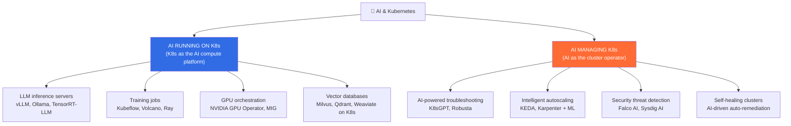

---

### Part 1: AI Running ON Kubernetes

#### GPU Orchestration — The New Normal

Companies are now standing up GPU clusters on Kubernetes to train and serve LLMs. This requires entirely new tooling:

| Challenge | Old Approach | New AI-Era Solution |
|:---|:---|:---|
| **GPU scheduling** | First-come, first-served | NVIDIA GPU Operator + MIG (Multi-Instance GPU) |
| **Multi-GPU jobs** | Manual setup | Volcano / Kueue batch schedulers |
| **Model serving** | Custom Flask/FastAPI | vLLM, TorchServe, Triton Inference Server on K8s |
| **Distributed training** | Manual node coordination | Kubeflow Training Operator (PyTorchJob, TFJob) |
| **Resource sharing** | Dedicated GPU per pod | GPU time-slicing, MIG partitioning |
| **Job queuing** | No queue — chaos | Kueue (K8s-native job queue) |

```bash
# Real example: Running Llama 3 on Kubernetes with vLLM
apiVersion: apps/v1
kind: Deployment
metadata:
  name: llama3-inference
  namespace: ai-production
spec:
  replicas: 2
  selector:
    matchLabels:
      app: llama3
  template:
    spec:
      containers:
      - name: vllm
        image: vllm/vllm-openai:latest
        args:
          - --model=meta-llama/Meta-Llama-3-8B-Instruct
          - --tensor-parallel-size=2
          - --max-model-len=8192
        resources:
          limits:
            nvidia.com/gpu: "2"       # Request 2 GPUs
            memory: "64Gi"
            cpu: "8"
        volumeMounts:
        - name: model-cache
          mountPath: /root/.cache/huggingface
      tolerations:
      - key: nvidia.com/gpu
        operator: Exists
        effect: NoSchedule
```

#### Key AI Platforms Running on Kubernetes Today

| Platform | Purpose | Companies Using It |
|:---|:---|:---|
| **Kubeflow** | End-to-end ML pipeline orchestration | Google, IBM, Spotify |
| **Ray on K8s** | Distributed AI/ML compute | OpenAI, Uber, AWS |
| **Volcano** | Batch and HPC job scheduling | Baidu, Huawei |
| **Kueue** | Job queuing for AI workloads | Google (native K8s) |
| **Knative** | Serverless AI inference (scale-to-zero) | Google, IBM |
| **KAITO** | K8s AI Toolchain Operator | Microsoft |

---

### Part 2: AI Managing Kubernetes

This is where DevSecOps engineers should pay the most attention — AI is starting to operate the cluster itself.

#### 🔧 K8sGPT — AI-Powered Troubleshooting

**K8sGPT** (open-source) connects your cluster to an LLM (OpenAI, Ollama, Claude, Gemini) and gives you plain-English explanations for cluster problems.

```bash
# Install K8sGPT
brew install k8sgpt   # macOS
# or
curl -LO https://github.com/k8sgpt-ai/k8sgpt/releases/download/v0.3.40/k8sgpt_Linux_x86_64.tar.gz

# Connect to OpenAI backend
k8sgpt auth add --backend openai --model gpt-4o

# Or use local Ollama (no API key needed)
k8sgpt auth add --backend localai --baseurl http://localhost:11434/v1

# Analyze the entire cluster
k8sgpt analyze

# Sample output:
# 🔍 Analyzing cluster...
# ✅ Pod: default/my-app (CrashLoopBackOff)
#    AI Explanation: "The container is crashing because it cannot connect to
#    the database at 'postgres:5432'. The Service 'postgres' does not exist
#    in this namespace. Recommendation: Create the postgres Service or
#    check if the pod should be in a different namespace."

# Filter to a specific namespace
k8sgpt analyze --namespace production

# Get deep analysis with remediation steps
k8sgpt analyze --explain --filter=Pod

# Auto-apply suggested fixes (use with caution!)
k8sgpt analyze --explain --no-cache | k8sgpt fix
```

#### 🤖 Robusta — AI-Powered Incident Response

Robusta integrates with Prometheus/Grafana and uses AI to correlate alerts, find root causes, and suggest or execute remediation playbooks automatically.

```yaml
# robusta-playbooks.yaml — Auto-remediation example
triggers:
  - on_prometheus_alert:
      alert_name: KubePodCrashLooping
actions:
  - ai_enrichment:           # Ask AI to explain the crash
      model: gpt-4o
  - pod_logs:                # Attach last 100 lines of logs
      previous: true
  - notify_slack:            # Send enriched alert to Slack
      channel: "#incidents"
  - restart_pod:             # Auto-restart if AI confidence > 0.9
      condition: ai_confidence > 0.9
```

#### 📊 Intelligent Autoscaling — Beyond CPU/Memory

Traditional HPA scales on CPU/Memory. AI-powered scaling predicts load before it happens:

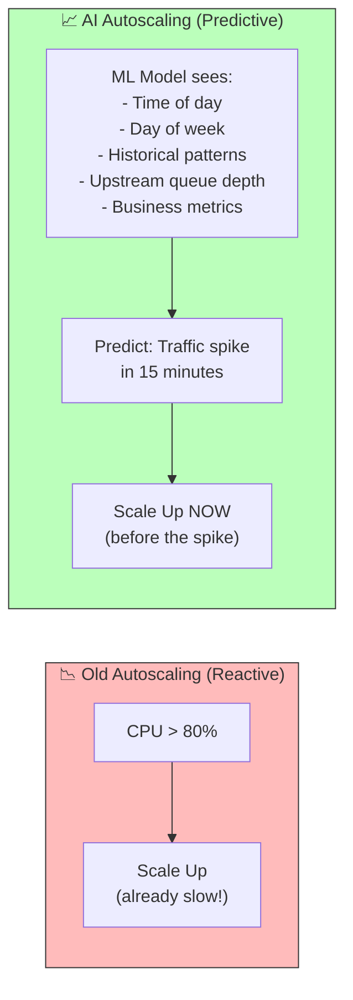

**Tools enabling AI-powered autoscaling:**

| Tool | Mechanism | AI/ML Capability |
|:---|:---|:---|
| **KEDA** | Scale on any metric (Kafka lag, SQS depth, custom) | External metric scaling triggers |
| **Karpenter** | Node provisioning | Smart node type selection (cost+performance) |
| **Predictive HPA** | K8s plugin | Predicts future CPU/mem based on history |
| **Crane (Tencent)** | Resource optimization | ML-based resource recommendation |

#### 🛡️ AI-Powered Security in K8s

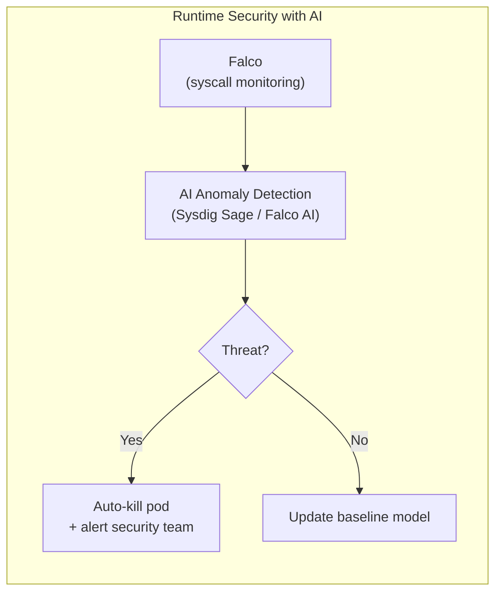

**Real capability:** Sysdig's AI (2024) can detect zero-day container escapes by modeling normal syscall behavior and flagging deviations — catching attacks that rule-based systems miss entirely.

---

## 🤔 Can AI Completely Take Over Kubernetes?

### The Honest Answer: **No — but it will change the job significantly.**

Here is the realistic breakdown of what AI can and cannot do in 2025 and beyond:

```mermaid
graph TD
    TASKS["All K8s Tasks"]
    TASKS --> AUTO["🤖 AI Can Automate Now"]
    TASKS --> ASSIST["🤝 AI Assists Humans"]
    TASKS --> HUMAN["👨‍💻 Humans Always Required"]

    AUTO --> A1["Identifying failing pods\nand explaining errors"]
    AUTO --> A2["Generating YAML manifests\nfrom natural language"]
    AUTO --> A3["Routine certificate rotation"]
    AUTO --> A4["Anomaly detection in logs/metrics"]
    AUTO --> A5["Cost optimization recommendations"]

    ASSIST --> B1["Incident root cause analysis\n(AI suggests, human decides)"]
    ASSIST --> B2["Security policy recommendations\n(human reviews impact)"]
    ASSIST --> B3["Capacity planning\n(AI models + human judgment)"]
    ASSIST --> B4["Upgrade planning\n(AI checks compatibility)"]

    HUMAN --> C1["Architecture decisions\n(tradeoffs require experience)"]
    HUMAN --> C2["Business continuity planning\n(risk tolerance = human judgment)"]
    HUMAN --> C3["Regulatory compliance sign-off\n(legal accountability)"]
    HUMAN --> C4["Novel security threats\n(AI has no playbook for new attacks)"]
    HUMAN --> C5["Multi-system incident management\n(cross-team coordination)"]

    style AUTO fill:#bfb,stroke:#333
    style ASSIST fill:#fbf,stroke:#333
    style HUMAN fill:#fbb,stroke:#333
```

### The Evolving Role

| Year | What AI Does | What Engineers Do |
|:---:|:---|:---|
| **2023** | Copilot helps write YAML faster | Everything else |
| **2024** | K8sGPT explains errors, Robusta auto-remediates simple issues | Architecture, security, complex incidents |
| **2025** | AI agents handle Tier-1 incidents autonomously, predictive scaling | Tier-2+ incidents, policy, architecture |
| **2027 (projected)** | AI manages 80% of routine ops, self-healing clusters | Strategy, security posture, AI system oversight |
| **2030 (projected)** | Autonomous clusters — AI runs the full lifecycle | AI system design, compliance, innovation |

> **The uncomfortable truth:** Junior DevOps engineers doing only repetitive tasks (restarting pods, writing basic YAML, following runbooks) are most at risk. Senior engineers who can architect, secure, and design AI-augmented systems are more valuable than ever.

---

## 🟠 AI in AWS EKS

### Current AI-Native EKS Features (2024–2025)

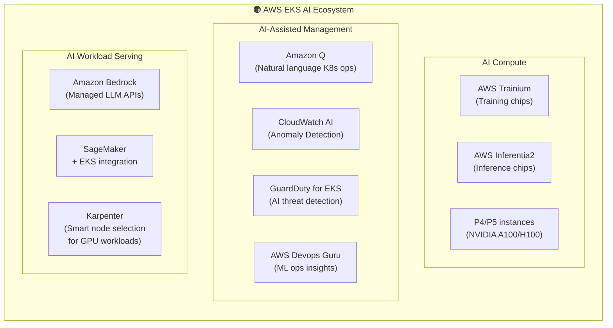

#### Amazon Q Developer + EKS

Amazon Q (AWS's AI assistant, 2024) can now directly interact with your EKS clusters:

```bash
# With Amazon Q in the terminal:
# Instead of remembering commands, just ask:

# "Q, why is my deployment in the default namespace failing?"
# → Q queries the API, reads events, logs, describes pod, then explains in plain English

# "Q, scale my frontend deployment to handle 10x traffic"
# → Q generates and applies the correct HPA config

# "Q, check if my EKS cluster passes the CIS benchmark"
# → Q runs kube-bench and summarizes results with remediation priorities
```

#### GuardDuty for EKS — AI Threat Detection

GuardDuty analyzes EKS audit logs and runtime events using ML to detect:

| Threat | How AI Detects It | Old Method |
|:---|:---|:---|
| **Cryptomining** | Unusual CPU patterns + known mining pool IPs | Manual log review |
| **Container escape** | Anomalous syscalls from containers | Rule-based (slow) |
| **Privilege escalation** | Unusual API calls from pods | RBAC audit (reactive) |
| **Lateral movement** | Unexpected cross-namespace API calls | Manual correlation |
| **Data exfiltration** | High-volume egress to unknown IPs | Manual network review |

```bash
# Enable GuardDuty EKS Protection
aws guardduty update-detector \
  --detector-id <id> \
  --features '[{"Name": "EKS_AUDIT_LOGS","Status": "ENABLED"},
               {"Name": "EKS_RUNTIME_MONITORING","Status": "ENABLED"}]'

# View GuardDuty findings for EKS
aws guardduty list-findings \
  --detector-id <id> \
  --finding-criteria '{"Criterion":{"resource.resourceType":{"Eq":["EKSCluster"]}}}'
```

#### AWS Inferentia2 on EKS — Cost-Efficient AI Inference

```yaml
# Deploying an LLM on AWS Inferentia2 nodes (70% cheaper than GPU)
apiVersion: v1
kind: Node  # These are inf2.xlarge instances
metadata:
  labels:
    node.kubernetes.io/instance-type: inf2.xlarge
---
apiVersion: apps/v1
kind: Deployment
metadata:
  name: llm-inferentia
spec:
  template:
    spec:
      nodeSelector:
        node.kubernetes.io/instance-type: inf2.xlarge
      containers:
      - name: inference-server
        image: 763104351884.dkr.ecr.us-east-1.amazonaws.com/pytorch-inference-neuronx:latest
        resources:
          limits:
            aws.amazon.com/neuron: "1"   # Request Inferentia2 chip
```

---

## 🔷 AI in Azure AKS

### Current AI-Native AKS Features (2024–2025)

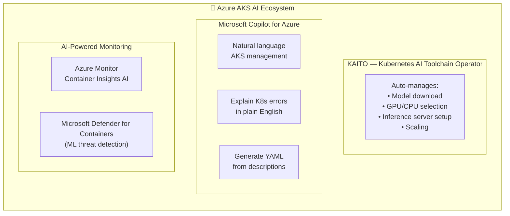

#### KAITO — The Game Changer for AI on K8s

**KAITO (Kubernetes AI Toolchain Operator)** is Microsoft's open-source operator that makes deploying LLMs on AKS trivially easy:

```yaml
# Old way: 200+ lines of YAML, manual GPU config, storage setup
# New way with KAITO: 15 lines

apiVersion: kaito.sh/v1alpha1
kind: Workspace
metadata:
  name: llama3-workspace
  namespace: ai-team
resource:
  instanceType: "Standard_NC24ads_A100_v4"   # Auto-selects GPU node
  labelSelector:
    matchLabels:
      app: llama3
inference:
  preset:
    name: "llama-3-8b-instruct"              # KAITO handles download + config
    accessMode: private
# That's it. KAITO handles:
# - Node provisioning with correct GPU
# - Model download from HuggingFace
# - vLLM server setup
# - OpenAI-compatible API endpoint
# - Auto-scaling
```

#### Microsoft Copilot for Azure — AKS Integration

```bash
# In the Azure Portal or az CLI with Copilot:
# Natural language operations on AKS

# "Why is my AKS cluster showing high memory usage?"
# → Copilot queries metrics, identifies the top memory-consuming pods,
#    and recommends right-sizing with specific numbers

# "Create an AKS cluster optimized for AI workloads"
# → Copilot generates the full az aks create command with GPU node pools,
#    proper RBAC, monitoring, and Azure AD integration

# "Check my AKS cluster for security misconfigurations"
# → Copilot runs Microsoft Defender assessment and prioritizes findings
```

#### Microsoft Defender for Containers — ML Security

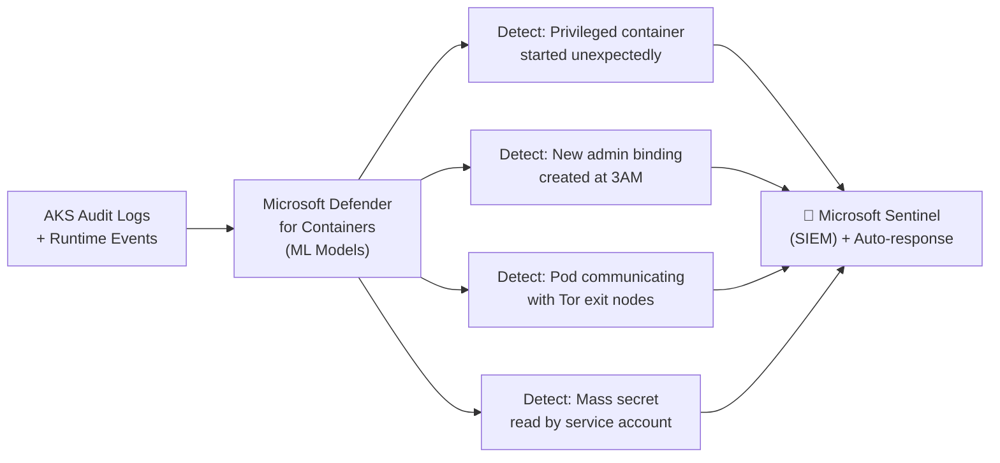

---

## 🔄 Before AI vs After AI — The Full SDLC Picture

This is the most important section for a DevSecOps engineer. Every phase of software delivery is being transformed.

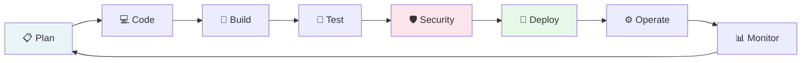

---

### 📋 Phase 1: Planning

| Aspect | Before AI | After AI |
|:---|:---|:---|
| **Sprint planning** | Manual story writing, poker planning with team | AI generates user stories from product docs, estimates complexity |
| **Architecture design** | Whiteboard sessions, weeks of documentation | AI generates architecture options, trade-off analysis in hours |
| **Threat modeling** | Quarterly manual sessions (STRIDE) | Continuous AI-assisted threat modeling (Microsoft Threat Modeling AI) |
| **Ticket creation** | Engineers manually write Jira tickets | AI converts Slack discussions and PR comments to structured tickets |
| **Dependency analysis** | Manual spreadsheets | AI maps service dependencies automatically |

**Real Tools Today:**
- **GitHub Copilot for Workspace** — Generate entire project scaffolding from a description
- **Linear AI** — AI-powered sprint planning and ticket management
- **Jira AI** — Auto-generate sub-tasks, acceptance criteria
- **OWASP Threat Dragon + AI** — AI-assisted threat modeling

---

### 💻 Phase 2: Coding

| Aspect | Before AI | After AI |
|:---|:---|:---|
| **Code writing** | Developer writes every line | AI writes 40-80% of boilerplate, developer reviews + guides |
| **Code review** | Manual peer review (slow, inconsistent) | AI pre-reviews PRs before humans see them |
| **Documentation** | Often skipped / always outdated | AI auto-generates docstrings, README, API docs |
| **Refactoring** | Manual, risky, time-consuming | AI suggests and applies refactors safely |
| **Bug fixing** | Read stack trace → search Google → fix | AI explains bug + generates fix in seconds |
| **Unit tests** | Often skipped due to time | AI generates test suite from function signatures |

**Real Tools Today:**
- **GitHub Copilot** — In-editor AI pair programmer (most widely used)
- **Cursor** — AI-native IDE with full codebase context
- **Cody (Sourcegraph)** — Enterprise code AI with private codebase awareness
- **Claude / ChatGPT** — Architecture, complex logic, code explanation

```python
# Before AI: Write a Kubernetes client health check manually
# ~ 30 minutes of writing + debugging

# After AI: Describe what you need, get it in 30 seconds
# Prompt: "Write a Python function that checks if all pods in a K8s namespace
#          are healthy, retrying 3 times with exponential backoff"

from kubernetes import client, config
import time

def check_namespace_health(namespace: str, retries: int = 3) -> dict:
    """AI-generated: Check all pods in namespace are Running/Succeeded."""
    config.load_incluster_config()
    v1 = client.CoreV1Api()

    for attempt in range(retries):
        try:
            pods = v1.list_namespaced_pod(namespace)
            unhealthy = [
                p.metadata.name for p in pods.items
                if p.status.phase not in ["Running", "Succeeded"]
            ]
            return {"healthy": len(unhealthy) == 0, "unhealthy_pods": unhealthy}
        except Exception as e:
            if attempt < retries - 1:
                time.sleep(2 ** attempt)
            else:
                raise e
```

---

### 🔨 Phase 3: Build & CI/CD

| Aspect | Before AI | After AI |
|:---|:---|:---|
| **Pipeline writing** | Manually write YAML (Jenkinsfile, GitHub Actions) | AI generates entire pipelines from description |
| **Build failures** | Read logs, search Stack Overflow | AI explains exactly why build failed + fix |
| **Pipeline optimization** | Guess and check over weeks | AI analyzes build times, suggests parallelization |
| **Dependency management** | Manual version pinning, break/fix cycle | AI suggests compatible versions, detects conflicts |
| **Docker optimization** | Trial and error for Dockerfile layers | AI generates optimal multi-stage Dockerfiles |
| **Secret scanning** | Separate Gitleaks runs | AI-powered pre-commit hooks catch secrets in real time |

**Before AI — Writing a GitHub Actions Pipeline:**
```yaml
# Engineer spends 2-3 hours writing this from scratch, looking up syntax
name: CI
on: [push]
jobs:
  test:
    runs-on: ubuntu-latest
    steps:
      - uses: actions/checkout@v4
      # ... 50 more lines of YAML they have to research
```

**After AI — Just describe what you need:**
```
Prompt: "Create a GitHub Actions pipeline for a Python FastAPI app that:
- Runs on PR and push to main
- Runs unit tests with coverage report
- Scans with Trivy for CVEs
- Builds and pushes Docker image to ECR
- Updates the EKS deployment if tests pass
- Notifies Slack on failure"

→ AI generates the complete 120-line workflow in 10 seconds
```

**Real CI/CD AI Tools:**
- **GitHub Copilot for GitHub Actions** — In-editor pipeline generation
- **Harness AI** — Self-healing pipelines that auto-fix build failures
- **CircleCI AI** — Natural language pipeline creation
- **Jenkins + OpenAI Plugin** — Explain build failures in plain English

---

### 🧪 Phase 4: Testing

| Aspect | Before AI | After AI |
|:---|:---|:---|
| **Unit test writing** | Manual, often skipped | AI generates full test suite from function code |
| **E2E test creation** | Manual Selenium/Playwright (weeks) | AI generates from user stories or screen recordings |
| **Test coverage gaps** | Hard to find without full analysis | AI identifies untested code paths automatically |
| **Load test scripting** | Manual k6/JMeter scripts | AI generates realistic traffic patterns from prod logs |
| **Test data** | Manually created fixtures | AI generates diverse, realistic test datasets |
| **Flaky test diagnosis** | Manual investigation (painful) | AI correlates flaky test patterns across runs |

---

### 🛡️ Phase 5: Security (SAST, DAST, SCA, Container Security)

This is where AI is making the **biggest difference for DevSecOps engineers**.

#### SAST (Static Application Security Testing)

| Aspect | Before AI | After AI |
|:---|:---|:---|
| **Finding triage** | 500 findings → manual review of all | AI prioritizes: "These 12 are real risks, ignore the rest" |
| **False positive rate** | 70-90% false positives (alert fatigue) | AI reduces to ~20% (context-aware analysis) |
| **Fix generation** | Engineer must know how to fix | AI generates the secure code fix inline |
| **Custom rules** | Senior security engineer writes regex rules | AI generates rules from natural language descriptions |

**Before AI (Semgrep alone):**
```
Found 847 findings across 1,200 files.
Time to triage: 3 engineers × 2 weeks
Result: Most findings ignored due to alert fatigue
```

**After AI (Semgrep + AI triage):**
```
Found 847 findings.
AI Analysis: 23 Critical (exploit-ready), 45 High (needs fix), 779 Informational (ignore)
Time to triage: 1 engineer × 2 hours
Result: Critical issues fixed same day
```

**Real AI SAST Tools:**
- **Snyk Code AI** — Context-aware vulnerability detection + AI-generated fixes
- **Semgrep AI (Semgrep Assistant)** — AI triage and autofix
- **Checkmarx AI** — Exploitability scoring with AI
- **GitHub Advanced Security + Copilot** — AI autofix for code scanning alerts

#### DAST (Dynamic Application Security Testing)

| Aspect | Before AI | After AI |
|:---|:---|:---|
| **Test generation** | Manual test case writing | AI generates attack payloads from API specs |
| **Crawl coverage** | Limited to what spider can find | AI understands app flow, tests hidden paths |
| **Finding triage** | Manual verification of each finding | AI verifies and confirms exploitability automatically |
| **Report writing** | Manual security report (days) | AI generates executive + technical reports instantly |

**Real AI DAST Tools:**
- **OWASP ZAP + AI Scripts** — AI-powered attack plan generation
- **Burp Suite Enterprise AI** — Intelligent scanning + triage
- **StackHawk AI** — API-first DAST with AI guidance

#### SCA (Software Composition Analysis)

| Aspect | Before AI | After AI |
|:---|:---|:---|
| **Vulnerability assessment** | "Log4Shell affects you" — you figure out impact | AI: "Log4Shell affects your payment service, which is internet-facing. Fix in 24h." |
| **Upgrade paths** | Manual compatibility testing | AI models breaking changes, suggests safe upgrade path |
| **License compliance** | Manual license inventory | AI automatically categorizes and flags license conflicts |
| **SBOM generation** | Manual or semi-automated | AI generates + maintains SBOM continuously |

**Real AI SCA Tools:**
- **Snyk Open Source AI** — Exploitability scoring, fix PRs
- **Mend (WhiteSource) AI** — Automated remediation PRs
- **Dependabot + Copilot** — AI-authored dependency upgrade PRs

#### Container & K8s Security

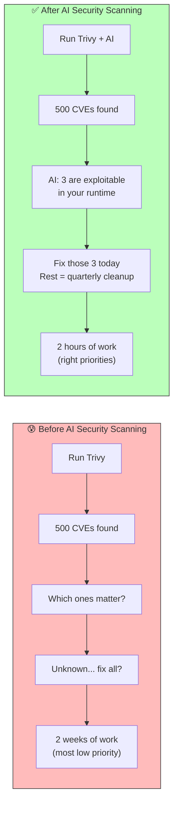

---

### 🚀 Phase 6: Deployment (Kubernetes & ArgoCD)

| Aspect | Before AI | After AI |
|:---|:---|:---|
| **Deployment strategy** | Engineer picks (rolling/blue-green/canary) based on intuition | AI analyzes service criticality + traffic patterns + recommends strategy |
| **ArgoCD sync issues** | Manual diff analysis | AI explains out-of-sync state in plain English + generates fix |
| **Helm chart creation** | Manual (complex, error-prone) | AI generates charts from deployment requirements |
| **Rollback decision** | Manual monitoring + human judgment | AI monitors error rate → auto-triggers rollback if threshold crossed |
| **GitOps PR review** | Manual infrastructure PR review | AI reviews IaC PRs for security, cost, correctness |
| **Release notes** | Manual writing | AI generates release notes from git commits + Jira tickets |

**ArgoCD + AI Example:**

```bash
# Before AI: ArgoCD shows "OutOfSync" — engineer investigates manually
argocd app diff my-app
# → 200 lines of YAML diff to parse

# After AI: Ask K8sGPT or ArgoCD AI integration
# "Why is my-app out of sync?"
# AI Response:
# "Your ArgoCD app 'my-app' is out of sync because:
#  1. The replica count in Git (3) differs from live (5) — someone scaled manually
#  2. A ConfigMap 'app-config' has a new key 'DATABASE_POOL_SIZE' in Git
#     that doesn't exist in the cluster.
#  Recommended action: Run 'argocd app sync my-app' to apply Git state.
#  Note: Manual scale will be overwritten. Update HPA in Git instead."
```

---

### ⚙️ Phase 7: Infrastructure (Terraform, Pulumi)

| Aspect | Before AI | After AI |
|:---|:---|:---|
| **IaC writing** | Manual Terraform/Pulumi writing (hours per module) | AI generates from description in minutes |
| **Plan review** | Manually read `terraform plan` output | AI summarizes: "These 3 changes will cause downtime" |
| **Drift detection** | Manual `terraform plan` comparisons | AI continuously monitors and explains drift |
| **Cost optimization** | Manual cost review | AI flags over-provisioned resources with specific savings numbers |
| **Security review** | Separate Checkov/tfsec runs | AI combines security + cost + correctness review |
| **Documentation** | Often skipped | AI auto-generates module documentation |

**Before AI (Terraform for EKS):**
```bash
# Engineer spends 3 days writing EKS Terraform modules from scratch
# Googles every argument, makes mistakes, iterates
```

**After AI:**
```
Prompt: "Write Terraform to create an EKS cluster with:
- 3 node groups (system, app, gpu)
- Private endpoint only
- IRSA enabled
- Managed add-ons: CoreDNS, VPC-CNI, kube-proxy
- CloudWatch logging
- Karpenter for node auto-provisioning
- Follow AWS security best practices"

→ AI generates ~400 lines of correct Terraform in 30 seconds
```

**Real AI IaC Tools:**
- **HashiCorp AI (Terraform)** — AI-assisted configuration generation
- **Pulumi AI** — Natural language to infrastructure code
- **Terraform AI by env0** — AI-powered plan review
- **Checkov + AI** — AI explanation of IaC security findings
- **Infracost AI** — AI-powered cost optimization suggestions

---

### 📊 Phase 8: Monitoring & Observability (Datadog, Grafana, Prometheus)

| Aspect | Before AI | After AI |
|:---|:---|:---|
| **Alert configuration** | Manual threshold setting (guess-and-check) | AI learns baselines, sets dynamic thresholds |
| **Alert triage** | 100 alerts → engineer reads each one | AI correlates alerts → "These 100 alerts are all caused by 1 root issue" |
| **Dashboard creation** | Manual Grafana panel building (hours) | AI generates dashboards from description |
| **Log analysis** | grep + manual pattern recognition | AI finds anomalies across millions of log lines instantly |
| **Root cause analysis** | Manual correlation across metrics/logs/traces | AI does full RCA across all signals in seconds |
| **Incident write-ups** | Manual post-mortems (days after incident) | AI generates draft post-mortem during the incident |

**Datadog AI (Watchdog) — Real Capabilities:**

```
Before: 200 monitors → 50 alerts fire → on-call engineer manually triages
After:  200 monitors → 50 alerts → Watchdog AI says:
        "Root cause: Memory leak in payment-service v2.3.1
         Deployed 47 minutes ago.
         Affecting: 3 downstream services
         Impact: 2.3% checkout error rate
         Recommended: Rollback to v2.3.0"
         [Rollback] [Acknowledge] [Investigate]
```

**Real AI Monitoring Tools:**
- **Datadog Watchdog AI** — Automatic anomaly detection + RCA
- **Grafana AI (Sift)** — AI-powered investigation automation
- **New Relic AI (NRAI)** — Natural language APM queries
- **Dynatrace Davis AI** — Causation-based RCA (not just correlation)
- **PagerDuty Copilot** — AI-powered incident triage and response

---

### 🔑 Phase 9: Secrets & Vault Management

| Aspect | Before AI | After AI |
|:---|:---|:---|
| **Secret rotation** | Manual rotation on schedule (often skipped) | AI-triggered rotation based on threat intelligence |
| **Access audit** | Quarterly manual Vault audit | Continuous AI monitoring for anomalous secret access |
| **Vault policy writing** | HCL policy writing (complex syntax) | AI generates Vault policies from plain English |
| **Secret sprawl detection** | Unknown — secrets everywhere | AI scans all repos, configs, K8s secrets for exposure |
| **Break-glass access** | Manual break-glass process | AI-monitored break-glass with automatic alert + audit |

---

## 🗺️ The DevSecOps AI Learning Roadmap

> **Goal:** Become the best AI-augmented DevSecOps engineer — not replaced by AI, but irreplaceable *because of* AI.

```mermaid
graph TD
    START["🚀 Start Here"] --> FOUND

    subgraph FOUND["Layer 1: AI Foundations\n(Month 1-2)"]
        F1["How LLMs work\n(transformers, tokens, context)"]
        F2["Prompt Engineering\n(zero-shot, few-shot, chain-of-thought)"]
        F3["AI tool landscape\n(which AI for which job)"]
        F4["RAG & Embeddings basics\n(for custom AI tools)"]
    end

    FOUND --> CORE

    subgraph CORE["Layer 2: AI in Core DevOps Tools\n(Month 2-4)"]
        C1["K8s + AI\nK8sGPT, Robusta, KAITO"]
        C2["CI/CD + AI\nCopilot, Harness AI"]
        C3["IaC + AI\nTerraform AI, Pulumi AI"]
        C4["Monitoring + AI\nDatadog Watchdog, Grafana AI"]
    end

    CORE --> SEC_AI

    subgraph SEC_AI["Layer 3: AI in Security Tools\n(Month 4-6)"]
        S1["SAST + AI\nSemgrep AI, Snyk Code"]
        S2["DAST + AI\nBurp Suite AI, ZAP AI"]
        S3["SCA + AI\nSnyk OSS, Mend AI"]
        S4["Runtime Security\nFalco AI, Sysdig Sage"]
    end

    SEC_AI --> BUILD

    subgraph BUILD["Layer 4: Build AI Tools Yourself\n(Month 6-12)"]
        B1["Custom K8s AI agents\nusing LangChain / CrewAI"]
        B2["MCP servers for\nDevOps tool integration"]
        B3["AI-powered runbooks\n(auto-remediation)"]
        B4["Internal AI security scanner\nusing OpenAI API + custom rules"]
    end

    BUILD --> MASTER

    subgraph MASTER["Layer 5: Strategic Mastery\n(Ongoing)"]
        M1["AI architecture for\nenterprise platforms"]
        M2["AI governance &\nsecurity of AI systems"]
        M3["Cost optimization\nfor AI workloads on K8s"]
        M4["Building AI-native\nsecurity programs"]
    end
```

---

### Layer 1: AI Foundations — Where to Start

#### What to Learn

| Topic | Why It Matters for DevSecOps | Best Resource |
|:---|:---|:---|
| **How LLMs work** | Understand context windows, hallucinations, limitations | Andrej Karpathy "Let's build GPT" (YouTube, free) |
| **Prompt Engineering** | Write better prompts = better AI output for your tools | Anthropic Prompt Engineering Guide (free) |
| **OpenAI API basics** | Build custom AI tools for your pipeline | OpenAI Cookbook (GitHub, free) |
| **RAG (Retrieval-Augmented Generation)** | Build AI that knows your internal docs/runbooks | LangChain documentation |
| **AI Agent concepts** | Understand autonomous AI systems you'll manage | AutoGen, CrewAI docs |

#### Practical Exercises — Week by Week

```bash
# Week 1: Prompt Engineering for DevOps
# Practice: Write prompts that generate correct Kubernetes YAML
# Goal: 0 errors in 10 generated manifests

# Prompt template to master:
"Act as a Kubernetes security expert. Generate a [resource type] for [use case].
Requirements:
- Non-root user (runAsUser: 1000)
- Read-only filesystem
- Drop ALL capabilities
- Resource limits: CPU [X], Memory [Y]
- [specific requirement]
Output only the YAML, no explanation."

# Week 2: Use AI APIs directly
python3 << 'EOF'
from openai import OpenAI
client = OpenAI()

# Build a simple K8s advisor
def ask_k8s_ai(question):
    response = client.chat.completions.create(
        model="gpt-4o",
        messages=[
            {"role": "system", "content": "You are a Kubernetes security expert. Answer questions about K8s security, provide kubectl commands, and explain errors."},
            {"role": "user", "content": question}
        ]
    )
    return response.choices[0].message.content

print(ask_k8s_ai("My pod is in CrashLoopBackOff. What are the 5 most common causes and how do I diagnose each?"))
EOF
```

---

### Layer 2: AI in Core DevOps Tools

#### Kubernetes + AI Toolkit

```bash
# Tool 1: K8sGPT — Install and use immediately
brew install k8sgpt
k8sgpt auth add --backend openai --model gpt-4o
k8sgpt analyze --explain

# Tool 2: Robusta — AI-powered incident response
helm repo add robusta https://robusta-charts.storage.googleapis.com
helm install robusta robusta/robusta \
  -f https://docs.robusta.dev/master/helm-values.yaml \
  --set sinksConfig[0].slack_sink.slack_channel="#k8s-alerts"

# Tool 3: Botkube — Chatops for K8s (with AI)
helm install botkube \
  --namespace botkube --create-namespace \
  --set communications.slack.enabled=true \
  --set communications.slack.token=<token> \
  oci://ghcr.io/kubeshop/botkube/chart/botkube

# In Slack: "@Botkube AI why is my deployment failing?"
# → AI analyzes and responds in Slack thread
```

#### CI/CD + AI

| Pipeline Tool | AI Integration | What to Learn |
|:---|:---|:---|
| **GitHub Actions** | Copilot for GitHub Actions | Generate workflows from description |
| **Jenkins** | OpenAI plugin + custom scripts | AI-explained build failures |
| **Harness** | Native AI (self-healing pipelines) | ML-driven deployment verification |
| **GitLab CI** | Duo AI integration | AI code review + security scanning |
| **ArgoCD** | K8sGPT integration + Notifications | AI-explained sync failures |

```yaml
# GitHub Actions with AI-powered security gate
name: AI Security Gate
on: [pull_request]
jobs:
  ai-security-review:
    runs-on: ubuntu-latest
    steps:
      - uses: actions/checkout@v4

      - name: Snyk AI Security Scan
        uses: snyk/actions/node@master
        env:
          SNYK_TOKEN: ${{ secrets.SNYK_TOKEN }}
        with:
          args: --severity-threshold=high --fail-on=upgradable

      - name: Trivy Container Scan with AI Summary
        uses: aquasecurity/trivy-action@master
        with:
          image-ref: ${{ env.IMAGE_TAG }}
          format: 'json'
          output: 'trivy-results.json'

      - name: AI Triage of Trivy Results
        uses: anthropics/claude-github-action@v1   # hypothetical action
        with:
          prompt: |
            Analyze these Trivy results and tell me:
            1. Which CVEs are actually exploitable in a web API context?
            2. Which can be safely ignored?
            3. What is the priority order for fixing?
          file: trivy-results.json
```

#### Infrastructure + AI

```bash
# Terraform + AI workflow
# Step 1: Generate with AI
# Prompt → Terraform code (via Copilot or ChatGPT)

# Step 2: AI security review with Checkov
checkov -d . --output json | python3 << 'EOF'
import json, sys
from openai import OpenAI

client = OpenAI()
findings = json.load(sys.stdin)
failed = [f for f in findings['results']['failed_checks']]

response = client.chat.completions.create(
    model="gpt-4o",
    messages=[{
        "role": "user",
        "content": f"Prioritize these Terraform security findings for a production K8s cluster: {json.dumps(failed[:20])}"
    }]
)
print(response.choices[0].message.content)
EOF

# Step 3: AI cost analysis with Infracost
infracost diff --path . --format json | infracost comment github \
  --path /code \
  --github-token $GITHUB_TOKEN \
  --pull-request $PR_NUMBER
```

---

### Layer 3: AI in Security Tools

#### SAST AI Workflow

```bash
# Semgrep AI (Semgrep Assistant)
# Install Semgrep
pip install semgrep

# Run with AI triage
semgrep --config=auto --json | python3 << 'EOF'
import json, sys
from openai import OpenAI

client = OpenAI()
findings = json.load(sys.stdin)['results']

for finding in findings[:5]:  # Process first 5
    context = {
        "rule": finding['check_id'],
        "message": finding['extra']['message'],
        "code": finding['extra'].get('lines', ''),
        "file": finding['path']
    }
    response = client.chat.completions.create(
        model="gpt-4o",
        messages=[{
            "role": "system",
            "content": "You are a security expert. Assess if this SAST finding is a real vulnerability or false positive, and if real, provide the secure code fix."
        }, {
            "role": "user",
            "content": f"Finding: {json.dumps(context)}"
        }]
    )
    print(f"Finding: {finding['check_id']}")
    print(f"AI Assessment: {response.choices[0].message.content}\n")
EOF
```

#### Runtime Security + AI

```bash
# Falco + AI alerting
# Custom Falco output to AI enrichment service
# falco-ai-enricher.py

from flask import Flask, request
from openai import OpenAI
import requests

app = Flask(__name__)
client = OpenAI()

@app.route('/falco-alert', methods=['POST'])
def enrich_alert():
    alert = request.json

    response = client.chat.completions.create(
        model="gpt-4o",
        messages=[{
            "role": "system",
            "content": "You are a container security expert. Explain this Falco alert in plain English, assess the severity, and recommend immediate response actions."
        }, {
            "role": "user",
            "content": f"Falco Alert: {alert}"
        }]
    )

    enriched = {
        "original_alert": alert,
        "ai_explanation": response.choices[0].message.content,
        "severity": alert.get('priority', 'unknown')
    }

    # Send to Slack
    requests.post(SLACK_WEBHOOK, json={"text": f"🚨 Security Event\n{enriched['ai_explanation']}"})
    return {"status": "enriched"}, 200
```

---

### Layer 4: Build AI Tools Yourself

#### Build a Custom K8s AI Agent

```python
# k8s-ai-agent.py
# A simple autonomous agent that monitors and responds to cluster issues

from openai import OpenAI
from kubernetes import client, config
import json

config.load_kube_config()
k8s = client.CoreV1Api()
apps = client.AppsV1Api()
openai_client = OpenAI()

def get_cluster_state():
    """Gather cluster state for AI analysis."""
    pods = k8s.list_pod_for_all_namespaces()
    failing_pods = [
        {
            "name": p.metadata.name,
            "namespace": p.metadata.namespace,
            "phase": p.status.phase,
            "conditions": [c.reason for c in (p.status.conditions or [])]
        }
        for p in pods.items
        if p.status.phase in ["Failed", "Pending"]
    ]
    return failing_pods

def ai_diagnose_and_act(cluster_state):
    """Let AI diagnose issues and suggest actions."""
    response = openai_client.chat.completions.create(
        model="gpt-4o",
        messages=[
            {
                "role": "system",
                "content": """You are an autonomous Kubernetes operator.
                Given cluster state, diagnose issues and respond with JSON:
                {"diagnosis": "...", "action": "restart_pod|scale_up|alert_only", "target": "pod-name", "namespace": "ns", "reasoning": "..."}"""
            },
            {
                "role": "user",
                "content": f"Current failing pods: {json.dumps(cluster_state)}"
            }
        ],
        response_format={"type": "json_object"}
    )

    action = json.loads(response.choices[0].message.content)
    return action

def execute_action(action):
    """Execute AI-recommended action."""
    if action["action"] == "restart_pod":
        k8s.delete_namespaced_pod(
            name=action["target"],
            namespace=action["namespace"]
        )
        print(f"✅ Restarted pod: {action['target']} — Reason: {action['reasoning']}")
    elif action["action"] == "alert_only":
        print(f"⚠️ Alert: {action['diagnosis']}")

# Main loop
if __name__ == "__main__":
    state = get_cluster_state()
    if state:
        action = ai_diagnose_and_act(state)
        execute_action(action)
```

---

### Layer 5: Certifications & Resources to Become the Best

#### Learning Resources Per Tool

| Tool | AI Learning Resource | Level |
|:---|:---|:---:|
| **Kubernetes + AI** | K8sGPT docs + Kubeflow docs | ⭐⭐ |
| **GitHub Copilot** | GitHub Copilot Fundamentals (MS Learn, free) | ⭐ |
| **Terraform + AI** | HashiCorp AI tutorials + Infracost blog | ⭐⭐ |
| **Datadog AI** | Datadog Learning Center — Watchdog module | ⭐⭐ |
| **Snyk AI** | Snyk Learn platform (free) | ⭐ |
| **LLM APIs** | OpenAI Cookbook, Anthropic prompt guide | ⭐⭐ |
| **LangChain/Agents** | LangChain documentation + DeepLearning.AI | ⭐⭐⭐ |
| **RAG Systems** | LlamaIndex docs + Pinecone learning | ⭐⭐⭐ |
| **AI Security** | OWASP LLM Top 10 | ⭐⭐ |

#### Certifications That Matter

| Certification | Provider | Relevance to AI DevSecOps |
|:---|:---|:---|
| **CKS** (Certified K8s Security Specialist) | CNCF | Directly relevant — K8s security foundation |
| **AWS ML Specialty** | AWS | Understanding AI workloads on EKS |
| **Azure AI Engineer (AI-102)** | Microsoft | KAITO, AKS AI workloads, Copilot integration |
| **Google Professional ML Engineer** | Google | GKE + Vertex AI integration |
| **HashiCorp Terraform Associate** | HashiCorp | IaC foundation for AI-generated Terraform |
| **Prompt Engineering Certificate** | DeepLearning.AI | Foundation for all AI tool usage |

---

## 🏆 How to Become the Best — Competitive Strategy

### The Three Profiles You Are Competing Against

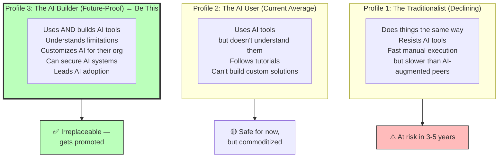

### Your 12-Month Competitive Plan

| Month | Focus Area | Deliverable to Show |
|:---:|:---|:---|
| **1-2** | AI Foundations + Prompt Engineering | Write a blog post about prompting for DevOps |
| **2-3** | K8sGPT + Robusta in your cluster | Demo: AI auto-remediating a K8s incident |
| **3-4** | AI-enhanced CI/CD pipeline | GitHub repo with full AI-augmented pipeline |
| **4-5** | AI SAST/DAST integration | Reduce false positive rate by 60% in demo |
| **5-6** | Terraform + AI IaC generation | Module library generated and secured with AI |
| **6-8** | Build a custom AI agent (K8s or security) | Open-source tool on GitHub |
| **8-10** | AI monitoring integration (Datadog/Grafana) | Dashboard + runbook auto-generation demo |
| **10-12** | Teach the organization | Internal workshop: "AI for our DevSecOps team" |

### The Skills That Make You Irreplaceable

```
🔴 Anyone can do: "Use Copilot to write YAML"

🟡 Valuable: "I set up K8sGPT + Robusta in our cluster,
              reducing MTTR from 45 minutes to 8 minutes"

🟢 Irreplaceable: "I built a custom AI security agent that:
                  - Monitors Falco alerts
                  - Correlates with Datadog metrics
                  - Automatically creates Jira tickets with root cause
                  - Executes remediation playbooks autonomously
                  - Has saved us 20 engineer-hours per week"
```

### Key Mindset: AI is Your Multiplier

| Without AI | With AI (Multiplier) | You Deliver |
|:---:|:---:|:---:|
| 1x output | 3-5x output | Same hours, 5x impact |
| React to problems | Predict problems | Fewer incidents |
| Know K8s commands | Build K8s AI agents | Platform products |
| Write security rules | Train security models | Security programs |

> **The engineers who thrive** are not the ones who resist AI, nor the ones who blindly trust it. They are the ones who deeply understand both Kubernetes/DevSecOps and AI — and use that combination to solve problems at a scale no individual could before.

---

## 📚 Essential Reading & Following List

| Resource | Type | Why Follow |
|:---|:---|:---|
| **K8sGPT blog** (k8sgpt.ai) | Blog | Latest AI K8s tooling |
| **The New Stack** (thenewstack.io) | News | AI/K8s industry news |
| **Kelsey Hightower** (Twitter/X) | Person | K8s thought leadership |
| **Brendan Burns** (K8s co-creator) | Person | K8s future direction |
| **CNCF Blog** (cncf.io/blog) | Blog | Official K8s/AI ecosystem news |
| **Andrej Karpathy** (YouTube) | Person | Best LLM explainer for engineers |
| **Simon Willison's Weblog** | Blog | Practical AI tool usage |
| **DevSecOps Podcast** | Podcast | Security + DevOps + AI intersection |

---

*Part of the [Certified Kubernetes Security Specialist (CKS)](./CKS.md) study series.*
