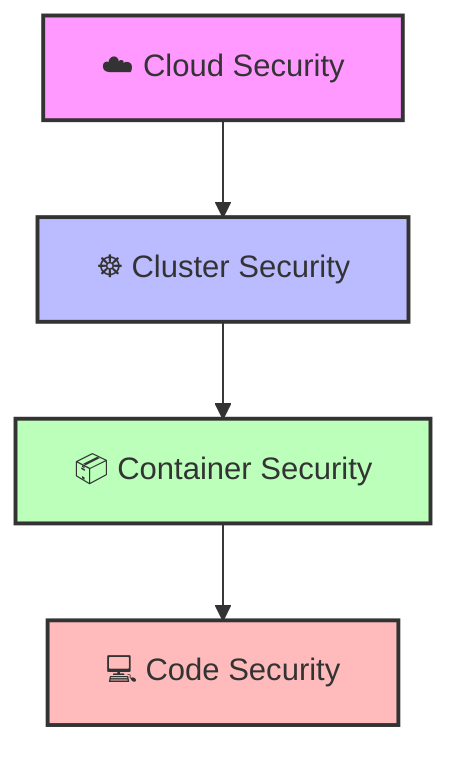

# 🛡️ Certified Kubernetes Security Specialist (CKS) Study Guide

Welcome to the CKS comprehensive overview. This document is designed to provide a clear, structured understanding of Kubernetes security, starting from the foundational principles to the specific requirements of the CKS certification.

---

## 📌 Table of Contents
1. [The 4Cs of Cloud Native Security](#the-4cs-of-cloud-native-security)
2. [What is CKS?](#what-is-cks)
3. [Detailed CKS Curriculum](#detailed-cks-curriculum)
    - [Cluster Setup](#1-cluster-setup)
    - [Cluster Hardening](#2-cluster-hardening)
    - [System Hardening](#3-system-hardening)
    - [Microservice Security](#4-microservice-security)
    - [Monitoring & Runtime Security](#5-monitoring-logging-and-runtime-security)
4. [Comparison: CKA vs. CKS](#comparison-cka-vs-cks)

---

## 🌐 The 4Cs of Cloud Native Security

Cloud Native security is not a single tool but a **layered approach**. This is known as **Defense in Depth**. If one layer fails, the others are there to stop the attacker.

| Layer | Focus Area | Key Examples | Risk if Compromised |
| :--- | :--- | :--- | :--- |
| **Cloud** | Infrastructure | IAM, VPC, Security Groups, Physical DC | Total account takeover |
| **Cluster** | Orchestration | API Server, etcd, RBAC, Network Policies | Cluster-wide privilege escalation |
| **Container** | Packaging | Image Scanning, Distroless, Rootless | Host breakout / Lateral movement |
| **Code** | Application | SAST, DAST, Dependency Scanning | Application-level exploits (SQLi, XSS) |

---

## 🎓 What is CKS?

The **Certified Kubernetes Security Specialist (CKS)** is a professional, performance-based certification by the CNCF and The Linux Foundation.

> [!IMPORTANT]
> **CKS is NOT a multiple-choice exam.** It is a practical test where you are given a live Kubernetes cluster and tasked with securing it against specific threats.

While the CKA (Administrator) focuses on *how to run* Kubernetes, the CKS focuses on *how to protect* it.

---

## 📚 Detailed CKS Curriculum

### 1. Cluster Setup ⚙️
Securing the foundation of the cluster.
*   **API Server:** Implementing strong authentication (OIDC), ensuring authorization via RBAC, and enabling **Encryption at Rest** for secrets.
*   **etcd:** Securing the cluster's "brain" via TLS and restricting access so only the API server can talk to it.
*   **Kubelet:** Disabling anonymous authentication and restricting access to the Kubelet API.
*   **Network Policies:** Moving from a "flat network" to a **Zero Trust** model using a "Default Deny" posture.

### 2. Cluster Hardening 🛡️
Reducing the attack surface of the orchestration layer.
*   **CIS Benchmarks:** Using `kube-bench` to audit the cluster against industry-standard security configurations.
*   **RBAC (Role-Based Access Control):** Applying the **Principle of Least Privilege (PoLP)**. No one should be `cluster-admin` unless absolutely necessary.
*   **Attack Surface Reduction:** Removing unused API features and ensuring internal services aren't exposed to the public internet.

### 3. System Hardening 💻
Securing the underlying Node/OS.
*   **Host OS Security:** Using AppArmor and Seccomp to restrict what a container can do on the host.
*   **Kernel Hardening:** Dropping dangerous Linux capabilities (e.g., `CAP_SYS_ADMIN`) to prevent container breakouts.
*   **Runtime Security:** Ensuring the container runtime (containerd/CRI-O) is updated and configured securely.

### 4. Microservice Security 📦
Securing the workloads running inside the cluster.
*   **Pod Security Admission (PSA):** Enforcing standards (Privileged, Baseline, Restricted) to prevent pods from running as root.
*   **Secrets Management:** Using external vaults (like HashiCorp Vault) instead of relying on base64-encoded K8s secrets.
*   **Image Security:**
    *   **Scanning:** Finding CVEs with tools like Trivy.
    *   **Provenance:** Signing images with Cosign.
    *   **Minimalism:** Using Distroless images to reduce vulnerabilities.

### 5. Monitoring, Logging, and Runtime Security 🔍
Detecting and responding to threats in real-time.
*   **Runtime Detection:** Using **Falco** to alert on suspicious system calls (e.g., a shell spawned in a pod).
*   **Audit Logging:** Enabling API server logs to track "Who did what, when, and how."
*   **Log Aggregation:** Using EFK/ELK stacks for centralized security analysis.
*   **Vulnerability Scanning:** Continuous scanning of running containers for new CVEs.

---

## ⚖️ Comparison: CKA vs. CKS

| Feature | CKA (Administrator) | CKS (Security Specialist) |
| :--- | :--- | :--- |
| **Primary Goal** | Cluster Stability & Management | Cluster Security & Hardening |
| **Core Focus** | Scheduling, Networking, Storage | RBAC, PSA, Runtime Security, CIS |
| **Prerequisite** | None | **Must have CKA** |
| **Exam Style** | Hands-on / Practical | Hands-on / Practical |
