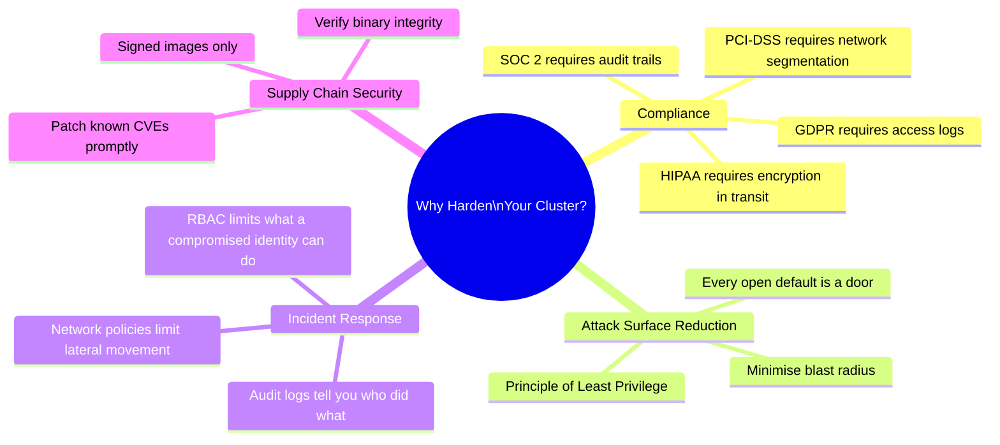
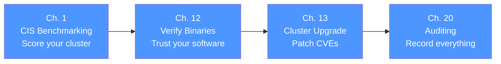
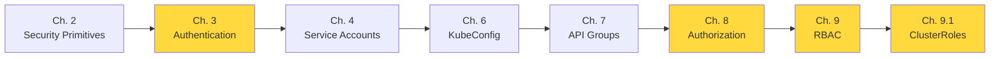
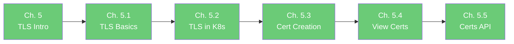
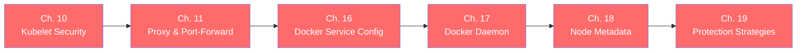
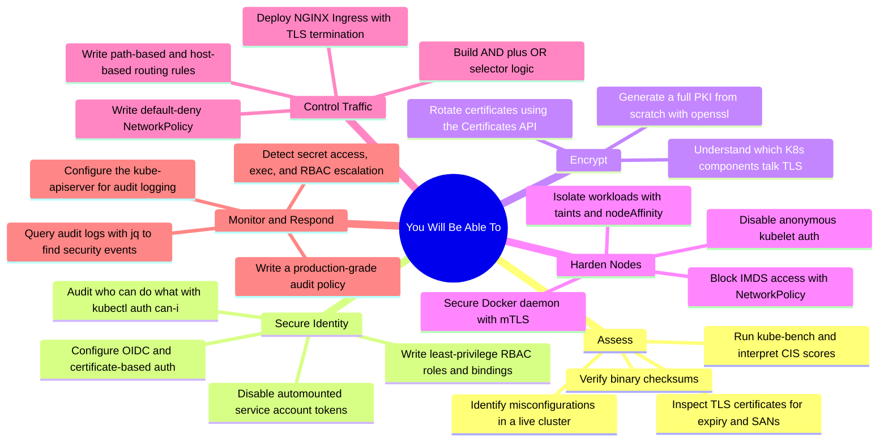
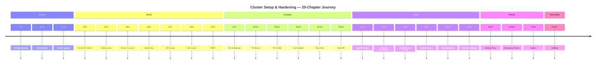

# Cluster Setup & Hardening — Module Introduction

> **Domain:** CKS Exam — Cluster Setup & Hardening (15% of exam weight)
> **Chapters covered:** 20 chapters + sub-chapters
> **Goal:** Transform a default, permissive Kubernetes installation into a production-hardened, compliance-ready cluster.

---

## Table of Contents

1. [What is Cluster Setup & Hardening?](#1-what-is-cluster-setup--hardening)
2. [Why This Domain Matters](#2-why-this-domain-matters)
3. [The Big Picture — Five Security Layers](#3-the-big-picture--five-security-layers)
4. [Chapter Map — Everything We Covered](#4-chapter-map--everything-we-covered)
5. [Learning Path by Security Domain](#5-learning-path-by-security-domain)
6. [Key Technologies & Tools](#6-key-technologies--tools)
7. [Skills You Will Have After This Module](#7-skills-you-will-have-after-this-module)
8. [How to Use This Guide](#8-how-to-use-this-guide)

---

## 1. What is Cluster Setup & Hardening?

Deploying a Kubernetes cluster is straightforward. Securing it is an entirely different challenge.

Out of the box, Kubernetes is designed for **flexibility and usability** — which means many security features are either disabled, set to permissive defaults, or rely on the operator to configure them explicitly. The API server trusts anonymous requests unless you block them. Pods run as root unless you prevent it. Any pod can talk to any other pod unless you write network policies. Nodes expose their metadata to every workload unless you restrict it.

**Cluster Setup & Hardening** is the discipline of closing all those gaps:

```mermaid
flowchart LR
    subgraph Default["Default Kubernetes (Unsecured)"]
        A1[Anonymous API access]
        A2[No network segmentation]
        A3[Pods run as root]
        A4[Cloud metadata exposed]
        A5[No audit trail]
        A6[Unverified binaries]
    end

    subgraph Hardened["Hardened Kubernetes (This Module)"]
        B1[RBAC + AuthN/AuthZ]
        B2[NetworkPolicy default-deny]
        B3[PodSecurity + non-root]
        B4[IMDS blocked by NetworkPolicy]
        B5[Full audit logging]
        B6[Binary checksums verified]
    end

    Default -->|"Cluster Hardening\n(20 chapters)"| Hardened

    style Default fill:#ff6b6b,color:#fff
    style Hardened fill:#6bcb77,color:#fff
```

The goal is **defence in depth**: even if one layer is breached, the next layer stops the attacker from reaching what matters.

---

## 2. Why This Domain Matters

This domain accounts for **15% of the CKS exam**, but its real-world importance is even greater. The majority of Kubernetes security incidents in production stem from misconfigurations in exactly these areas — not from exotic zero-days.

Real incidents this module helps prevent:

| Incident Type | Chapter That Addresses It |
|---|---|
| Attacker exploits overpermissive RBAC | Ch. 8, 9, 9.1 — Authorization & RBAC |
| Stolen cloud IAM credentials via IMDS | Ch. 18, 19 — Node Metadata & Protection |
| Lateral movement between pods | Ch. 14, 14.1 — Network Policies |
| Compromised Docker daemon | Ch. 16, 17 — Docker Configuration & Daemon |
| No forensic trail after breach | Ch. 20 — Auditing |
| Misconfigured ingress exposes internals | Ch. 15 — Ingress |
| Cluster running outdated CVE-laden version | Ch. 13 — Cluster Upgrade |
| Tampered kubelet binary | Ch. 12 — Verify Platform Binaries |

---

## 3. The Big Picture — Five Security Layers

Every chapter in this module belongs to one of five concentric security layers. Together they form the cluster's defence-in-depth model:

```mermaid
graph TD
    subgraph L1["Layer 1 — Baseline & Compliance"]
        C1[Ch. 1 — CIS Benchmarking]
        C12[Ch. 12 — Verify Binaries]
        C13[Ch. 13 — Cluster Upgrade]
        C20[Ch. 20 — Auditing]
    end

    subgraph L2["Layer 2 — Identity & Access"]
        C2[Ch. 2 — Security Primitives]
        C3[Ch. 3 — Authentication]
        C4[Ch. 4 — Service Accounts]
        C6[Ch. 6 — KubeConfig]
        C7[Ch. 7 — API Groups]
        C8[Ch. 8 — Authorization]
        C9[Ch. 9 — RBAC]
        C91[Ch. 9.1 — ClusterRoles]
    end

    subgraph L3["Layer 3 — Encryption & TLS"]
        C5[Ch. 5 — TLS Intro]
        C51[Ch. 5.1 — TLS Basics]
        C52[Ch. 5.2 — TLS in K8s]
        C53[Ch. 5.3 — TLS Creation]
        C54[Ch. 5.4 — View Certificates]
        C55[Ch. 5.5 — Certificates API]
    end

    subgraph L4["Layer 4 — Node & Infrastructure"]
        C10[Ch. 10 — Kubelet Security]
        C11[Ch. 11 — Kubectl Proxy & Port-Forward]
        C16[Ch. 16 — Docker Service Config]
        C17[Ch. 17 — Docker Daemon]
        C18[Ch. 18 — Node Metadata Security]
        C19[Ch. 19 — Protection Strategies]
    end

    subgraph L5["Layer 5 — Network & Traffic"]
        C14[Ch. 14 — Network Policy]
        C141[Ch. 14.1 — Developing Network Policies]
        C15[Ch. 15 — Ingress]
    end

    L1 --> L2 --> L3 --> L4 --> L5
```

---

## 4. Chapter Map — Everything We Covered

### Complete Chapter Reference

| # | Chapter | Core Topic | Key Skills |
|---|---|---|---|
| 1 | CIS Benchmarking | Industry-standard security scoring for K8s | `kube-bench`, CIS Level 1 & 2, remediation |
| 2 | K8s Security Primitives | The 4Cs model — Cloud, Cluster, Container, Code | Attack surface mapping, security layers |
| 3 | Authentication | Who can reach the API server | X.509 certs, static tokens, OIDC, anonymous auth |
| 4 | Service Accounts | Pod identities | SA tokens, automountServiceAccountToken: false, RBAC for SAs |
| 5 | TLS Introduction | Why encryption matters | TLS handshake, certificates, CAs, PKI |
| 5.1 | TLS Basics | Symmetric vs asymmetric crypto | RSA, AES, public/private keys, certificate chain |
| 5.2 | TLS in Kubernetes | Which K8s components use TLS | Client certs, server certs, CA trust chains |
| 5.3 | TLS Certificate Creation | Generate certs from scratch | `openssl`, kubeadm PKI, `cfssl` |
| 5.4 | View Certificates | Inspect and decode certs | `openssl x509 -text`, expiry dates, SANs |
| 5.5 | Certificates API | Kubernetes-native CSR workflow | CertificateSigningRequest, approve/deny |
| 6 | KubeConfig | Authenticating kubectl | `~/.kube/config`, contexts, clusters, users |
| 7 | API Groups | K8s API structure | Core group vs named groups, resource paths |
| 7.1 | API Test Examples | Exploring the API live | `kubectl proxy`, `curl` to API, verb mapping |
| 7.2 | Service Account API | SA token API access | In-pod API calls, projected volume tokens |
| 8 | Authorization | RBAC, ABAC, Webhook, Node | `--authorization-mode`, deciding which modes to use |
| 9 | RBAC | Roles and RoleBindings | `Role`, `RoleBinding`, `kubectl auth can-i` |
| 9.1 | ClusterRoles & Bindings | Cluster-wide RBAC | `ClusterRole`, `ClusterRoleBinding`, aggregation |
| 10 | Kubelet Security | Hardening the node agent | `--anonymous-auth=false`, `--authorization-mode=Webhook`, kubelet config |
| 11 | Kubectl Proxy & Port-Forward | Safe API tunnelling | `kubectl proxy`, `kubectl port-forward`, risk management |
| 12 | Verify Platform Binaries | Binary integrity checks | SHA512 checksum, `sha512sum`, tampered binary detection |
| 13 | Cluster Upgrade | Patch management workflow | `kubeadm upgrade plan/apply`, drain/uncordon, version skew |
| 14 | Network Policy | Pod-level L3/L4 firewall | `podSelector`, `namespaceSelector`, `ipBlock`, default-deny |
| 14.1 | Developing Network Policies | Policy evolution step-by-step | AND vs OR selector logic, egress + ingress combined |
| 15 | Ingress | External traffic routing & TLS | NGINX controller, path routing, host routing, TLS termination |
| 16 | Docker Service Config | Docker daemon management | `daemon.json`, systemd, TCP vs Unix socket, TLS setup |
| 17 | Docker Daemon | Docker fundamentals + security | What Docker is, daemon architecture, rootless Docker, mTLS |
| 18 | Securing Node Metadata | Protecting cloud IMDS | IMDS attack via SSRF, NetworkPolicy block 169.254.169.254, IMDSv2 |
| 19 | Protection Strategies | Defence in depth | RBAC + Node Isolation + NetworkPolicy + Audit + Patching |
| 20 | Auditing | Full cluster audit trail | Audit policy levels, kube-apiserver config, log analysis, `jq` queries |

---

## 5. Learning Path by Security Domain

### Domain 1 — Compliance & Baseline (Start Here)

These four chapters answer: **"Is my cluster measurably secure and am I tracking what happens in it?"**

### Domain 2 — Identity & Access Management

These chapters answer: **"Who can do what, and is every identity operating with the minimum privilege needed?"**

### Domain 3 — Encryption & TLS

These chapters answer: **"Is all communication between components and clients encrypted and authenticated?"**

### Domain 4 — Node & Infrastructure Hardening

These chapters answer: **"Are the machines and container runtime running on them secured against compromise?"**

### Domain 5 — Network & Traffic Control

These chapters answer: **"Is traffic between pods, namespaces, and the outside world controlled and minimal?"**

---

## 6. Key Technologies & Tools

| Tool / Technology | Covered In | Purpose |
|---|---|---|
| `kube-bench` | Ch. 1 | CIS benchmark scanner |
| `openssl` | Ch. 5.1, 5.3, 5.4 | Certificate generation and inspection |
| `kubeadm` | Ch. 5.3, 5.5, 13 | Cluster bootstrap, PKI, upgrades |
| `kubectl auth can-i` | Ch. 8, 9 | Test RBAC permissions |
| `kubectl proxy` | Ch. 11 | Safe local API tunnel |
| `sha512sum` | Ch. 12 | Binary integrity verification |
| NetworkPolicy (Calico/Cilium/Weave) | Ch. 14, 14.1 | Pod-level firewall rules |
| NGINX Ingress Controller | Ch. 15 | External traffic routing + TLS |
| `daemon.json` | Ch. 16 | Docker daemon configuration file |
| Docker TLS / mTLS | Ch. 16, 17 | Secure remote Docker daemon access |
| IMDS (169.254.169.254) | Ch. 18 | Cloud instance metadata — attack vector |
| IMDSv2 (hop limit=1) | Ch. 18 | AWS defence against SSRF-based IMDS attacks |
| Falco | Ch. 18, 19 | Runtime threat detection rules |
| OPA / Kyverno | Ch. 18, 19 | Policy enforcement for node taints and metadata |
| `kube-apiserver` audit flags | Ch. 20 | Enable structured audit logging |
| `jq` | Ch. 20 | Parse and query JSON audit logs |
| Trivy | Ch. 19 | Container image CVE scanning |
| Prometheus | Ch. 19 | Alerting on security metrics |

---

## 7. Skills You Will Have After This Module

By working through all 20 chapters you will be able to:

---

## 8. How to Use This Guide

Each chapter follows the same structure so you always know where to find what you need:

| Section | What It Contains |
|---|---|
| **What is X?** | Plain-language explanation with analogies |
| **Why does it matter?** | Real attack scenarios and compliance reasons |
| **How it works** | Architecture diagrams and flow charts |
| **Hands-on commands** | Step-by-step commands explained line by line |
| **YAML examples** | Complete, copy-paste-ready manifests |
| **Real-world scenarios** | Case studies mapping the concept to actual incidents |
| **Common mistakes** | The gotchas that catch engineers in the exam and in prod |
| **CKS exam tips** | What the exam actually tests, what to memorise |

### Recommended Reading Order

If you are new to Kubernetes security, follow the chapters in order — each builds on the previous. If you are revising for the CKS exam, the highest-value chapters by exam weight are:

1. Ch. 9 & 9.1 — RBAC (tested heavily)
2. Ch. 14 & 14.1 — Network Policies (scenario-based questions)
3. Ch. 20 — Auditing (write a policy + configure apiserver)
4. Ch. 10 — Kubelet Security (flag-by-flag hardening)
5. Ch. 13 — Cluster Upgrade (drain, upgrade, uncordon workflow)

> **Tip:** The CKS is a hands-on exam in a live cluster. Reading alone is not enough — run every command, apply every YAML, and break things intentionally so you understand how to fix them.

---

## Module at a Glance

