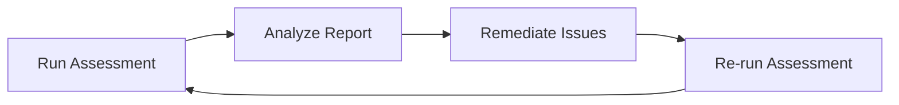

# 🛡️ Phase 1: CIS Benchmarking

## 📖 Understanding Security Benchmarks

Before diving into the technicalities of Kubernetes security, we must understand the concept of a **Security Benchmark**. 

In simple terms, a security benchmark is a set of industry-standard "best practices" used to harden a system. Think of it as a **security checklist** that transforms a default installation (which is often optimized for ease of use) into a production-ready environment (which is optimized for security).

### 🛠️ The Analogy: Hardening a Linux Server
Imagine you have just deployed a fresh Ubuntu server. Out of the box, it is functional, but it is not secure. To "harden" this server, a system administrator would perform several steps:

*   **Physical Security:** Disabling unused USB ports to prevent malware injection via hardware.
*   **Access Control:** Disabling direct `root` logins and requiring individual user accounts with `sudo` privileges to ensure accountability.
*   **Network Security:** Implementing strict firewall (IPTables/UFW) rules to allow only essential traffic.
*   **Service Reduction:** Disabling all non-essential services to reduce the attack surface.
*   **Monitoring:** Enabling detailed auditing and logging to track modifications or intrusions.

**The core philosophy is simple:** If a feature or port isn't absolutely necessary for the application to run, it should be disabled.

---

## 🌐 Introduction to CIS (Center for Internet Security)

**CIS** is a globally recognized non-profit organization dedicated to enhancing cybersecurity. They provide community-driven, consensus-based security recommendations that have become the "gold standard" for hardening IT systems.

### 📊 The Scope of CIS Benchmarks
CIS doesn't just focus on one tool; they provide benchmarks across a vast array of technology categories:

| Category | Examples |
| :--- | :--- |
| **Operating Systems** | Linux, Windows, macOS |
| **Public Cloud** | AWS, Google Cloud (GCP), Azure |
| **Virtualization** | **Kubernetes**, Docker, VMware |
| **Network Devices** | Cisco, Juniper, Palo Alto Networks |
| **Server Software** | Nginx, Apache Tomcat |
| **Mobile & Desktop** | iOS, Android, Web Browsers |

---

## 🔍 Anatomy of a CIS Benchmark

A CIS benchmark is not just a list of "dos and don'ts." Each recommendation is structured to be actionable and verifiable. Every benchmark item typically includes:

1.  **The Risk:** A detailed explanation of *why* a specific configuration is dangerous and what an attacker could do if it's left unpatched.
2.  **Verification (The Audit):** Step-by-step instructions and commands to check if the risk exists in your environment.
    *   *Example:* To check if USB storage is enabled, you might run: 
        `modprobe -n -v usb-storage`
3.  **Remediation (The Fix):** Exact procedures and commands to resolve the issue and bring the system into compliance.

---

## ⚙️ Automation with CIS CAT

Manually checking hundreds of benchmark items is time-consuming and prone to human error. To solve this, CIS provides the **CIS CAT (Configuration Assessment Tool)**.

### How CIS CAT Works:
*   **Automated Scanning:** It automatically compares your current system configuration against the CIS benchmark.
*   **Comprehensive Reporting:** It generates a detailed HTML report.
*   **Scoring:** It provides a percentage score based on "Pass" vs "Fail" results for various categories.
*   **Drill-down Analysis:** Users can click into specific failed tests to see the exact reason for the failure and the recommended fix.

---

## ☸️ CIS Benchmark for Kubernetes

The **CIS Kubernetes Benchmark** is a specialized set of guidelines designed to secure the Kubernetes orchestration layer. Because Kubernetes is a complex system with many moving parts, the benchmark is divided into sections based on the cluster components.

### 🔑 Key Focus Areas of the K8s Benchmark

| Section | What is being checked? | Why it matters |
| :--- | :--- | :--- |
| **Control Plane** | API Server, Scheduler, Controller Manager | Prevents unauthorized cluster management and privilege escalation. |
| **etcd** | Encryption, TLS, Access Control | Protects the "source of truth" for the entire cluster. |
| **Kubelet** | AuthN/AuthZ, ReadOnlyPort, Cgroup drivers | Prevents attackers from taking over a node via the Kubelet API. |
| **Worker Nodes** | OS hardening, Container runtime config | Stops container breakouts from affecting the host OS. |
| **Network Policies** | Default Deny, Pod isolation | Stops lateral movement between pods within the cluster. |
| **RBAC** | ClusterRoleBindings, User permissions | Ensures the Principle of Least Privilege (PoLP) is enforced. |

---

## 🚀 Automating with Kube-Bench

While the CIS Benchmark provides the *rules*, **Kube-Bench** is the tool that *enforces* them. Developed by **Aqua Security**, Kube-Bench is an open-source tool that automates the verification of your Kubernetes cluster against the CIS Benchmarks.

### 🛠️ How Kube-Bench Works
Kube-Bench maps every single CIS recommendation to a specific automated check. Instead of you running 100+ manual commands, Kube-Bench scans your master and worker nodes and returns a clear **PASS** or **FAIL** status for each item.

### 📦 Deployment Options
Depending on your environment and security requirements, you can run Kube-Bench in three ways:

| Method | Use Case | Pros | Cons |
| :--- | :--- | :--- | :--- |
| **Docker Container** | Local testing / Isolated scan | Fast, clean, no installation on host | Requires Docker to be installed |
| **K8s Job** | Production / Scheduled audits | Automated, scalable, cluster-native | Requires cluster permissions to run |
| **Binaries/Source** | Hardened nodes / Custom builds | Maximum control, no dependencies | Manual installation and updates |

### 📋 Step-by-Step Implementation Workflow

To properly secure a cluster using Kube-Bench, follow this professional lifecycle:

1.  **Version Selection:** Visit the [Kube-Bench GitHub](https://github.com/aquasecurity/kube-bench) and select a stable release compatible with your specific Kubernetes version.
2.  **Deployment:** Install the tool on your master node (the control plane is the most critical part to audit).
3.  **Execution:** Run the security assessment. Kube-Bench will probe the API server, Kubelet, and other components.
4.  **Analysis:** Review the output report. Focus on the `FAIL` results first.
5.  **Remediation:** Use the remediation steps provided by Kube-Bench (or the CIS documentation) to fix the misconfigurations.
6.  **Verification:** Re-run Kube-Bench to ensure the fixes were applied correctly and the status has changed to `PASS`.

---

## ☁️ CIS Benchmark for Amazon EKS

When moving to a managed service like **Amazon EKS (Elastic Kubernetes Service)**, the security landscape changes. This is due to the **Shared Responsibility Model**.

### 🤝 The Shared Responsibility Model
In EKS, AWS manages the **Control Plane** (API Server, etcd, etc.), while you manage the **Worker Nodes** and the **Workloads**. Therefore, the CIS EKS Benchmark differs from the vanilla Kubernetes Benchmark.

#### 1. Control Plane (AWS Managed)
You cannot run `kube-bench` on the EKS Control Plane because you don't have SSH access to it. AWS ensures the control plane follows security best practices, but you are responsible for:
*   **API Server Access:** Restricting public access to the API server.
*   **Logging:** Enabling Control Plane logging (Audit, API, Authenticator) in CloudWatch.

#### 2. Worker Nodes (User Managed)
You are fully responsible for the nodes. The CIS EKS Benchmark focuses heavily here:
*   **AMI Hardening:** Using the EKS-optimized AMI and ensuring it is patched.
*   **Node Security Groups:** Restricting traffic to the nodes.
*   **IMDSv2:** Ensuring the Instance Metadata Service version 2 is enforced to prevent SSRF attacks.

### ⚖️ Comparison: Vanilla K8s vs. EKS Benchmark

| Feature | Vanilla K8s Benchmark | EKS Benchmark |
| :--- | :--- | :--- |
| **Control Plane** | Full audit of API, etcd, etc. | Audit of API access and logging only. |
| **Worker Nodes** | Full OS & Kubelet hardening. | OS hardening + AWS-specific metadata security. |
| **Implementation** | Use `kube-bench` on all components. | Use `kube-bench` on nodes; use AWS Console/CLI for CP. |

---

## 🔄 The Remediation Lifecycle

When working with CIS Benchmarks, you will follow a continuous loop of improvement:

> [!TIP]
> **Remember:** Security is not a one-time event. New vulnerabilities emerge daily. The process of **Audit $\rightarrow$ Fix $\rightarrow$ Verify** must be repeated regularly to keep your cluster secure.
