# 🔒 10 -- Kubelet Security

> **Series:** Cluster Setup & Hardening | **Phase 3: Node Security**  
> **Chapter Goal:** Understand what the Kubelet is, why it is a critical attack surface, and how to harden it using authentication, authorization, and port management — the four key security controls every CKS candidate must know.

---

## 📌 Table of Contents

1. [What is the Kubelet — and Why Does It Matter for Security?](#-what-is-the-kubelet--and-why-does-it-matter-for-security)
2. [Installing and Configuring the Kubelet](#-installing-and-configuring-the-kubelet)
3. [Kubelet Ports — The Attack Surface](#-kubelet-ports--the-attack-surface)
4. [The Four Security Controls](#-the-four-security-controls)
5. [Control 1 — Disable Anonymous Authentication](#-control-1--disable-anonymous-authentication)
6. [Control 2 — Certificate-Based Authentication](#-control-2--certificate-based-authentication)
7. [Control 3 — Authorization via Webhook Mode](#-control-3--authorization-via-webhook-mode)
8. [Control 4 — Disable the Read-Only Port (10255)](#-control-4--disable-the-read-only-port-10255)
9. [Applying All Controls Together](#-applying-all-controls-together)
10. [Verifying Kubelet Security](#-verifying-kubelet-security)
11. [Real-World Scenarios](#-real-world-scenarios)
12. [Commands Reference](#-commands-reference)
13. [Concepts at a Glance](#-concepts-at-a-glance)

---

## 🧠 What is the Kubelet — and Why Does It Matter for Security?

### The Kubelet's Role in the Cluster

The Kubelet is the **primary agent running on every worker node**. It is the bridge between the kube-apiserver (control plane) and the actual container runtime (Docker, containerd, CRI-O) on the node.

Think of the Kubelet like a **ship's captain** — it handles everything on its node:

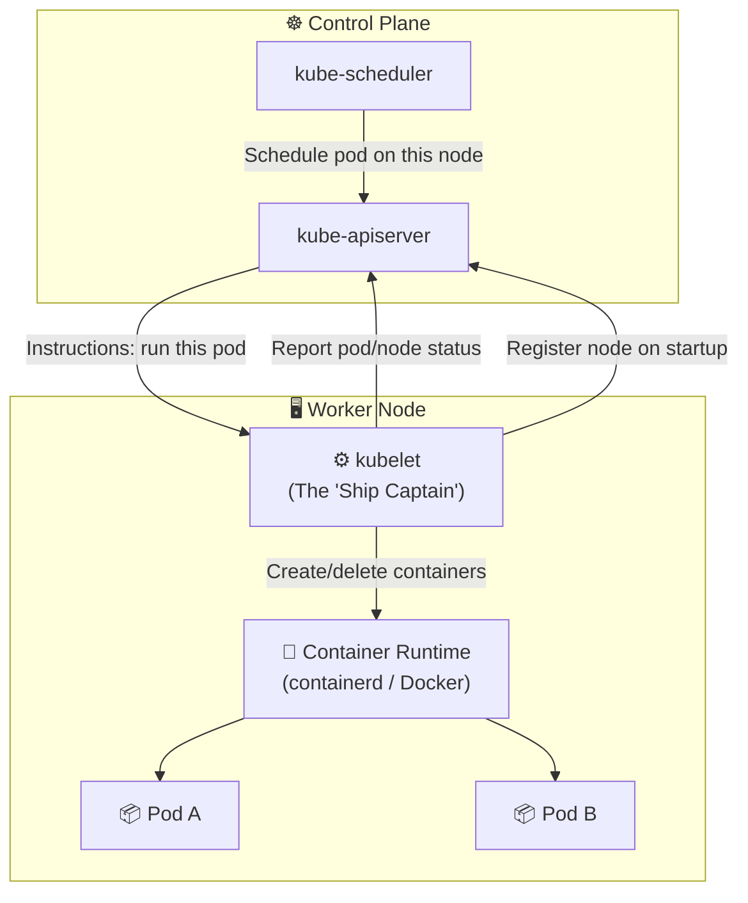

**What the Kubelet does:**

| Responsibility | Detail |
|:---|:---|
| **Node Registration** | On startup, kubelet registers itself with the API server as a node |
| **Pod Lifecycle** | Receives pod specs, instructs the container runtime to create/delete containers |
| **Health Monitoring** | Continuously monitors pod and container states, restarts failed containers |
| **Status Reporting** | Sends node and pod status back to the kube-apiserver regularly |
| **Volume Management** | Mounts volumes and secrets into pods |
| **API Server** | Exposes its own HTTP API so the control plane and tools can interact with it |

### Why the Kubelet Is a High-Value Attack Target

The Kubelet's API gives an attacker extraordinary power over a node:

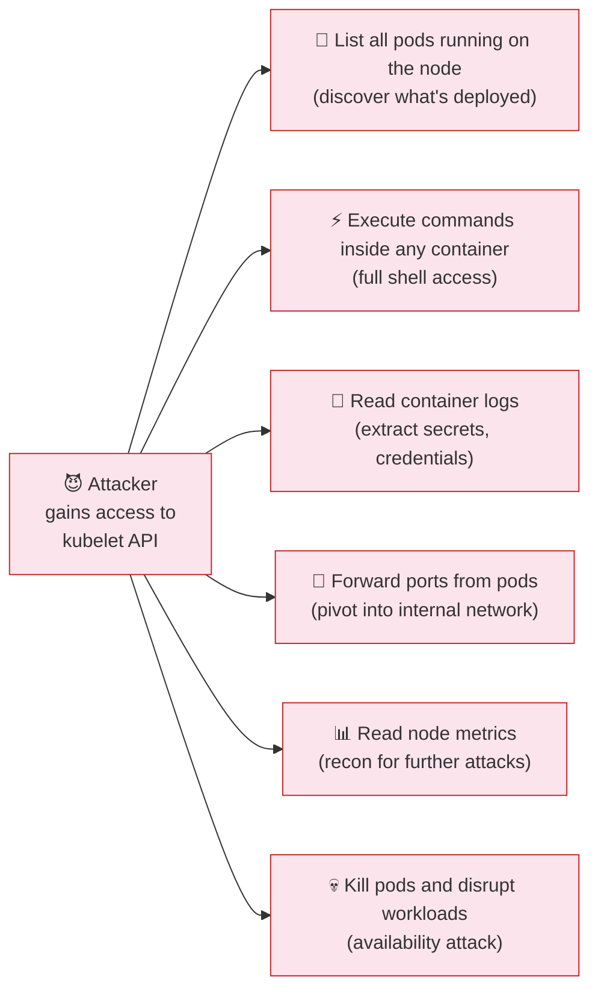

**The critical security issue:** By default, the Kubelet API accepts **unauthenticated requests**. Anyone with network access to the node can call it. This is like leaving the ship's bridge unlocked with the keys in the ignition.

---

## ⚙️ Installing and Configuring the Kubelet

### Two Ways to Pass Kubelet Configuration

Since Kubernetes v1.10, kubelet configuration has two approaches:

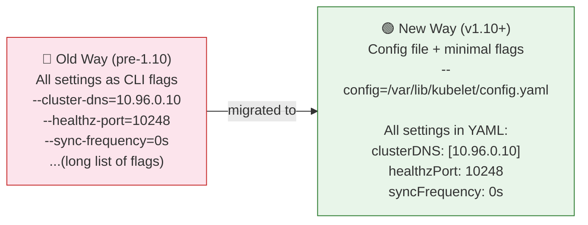

### The Kubelet Service File

```bash
# /etc/systemd/system/kubelet.service
[Unit]
Description=kubelet: The Kubernetes Node Agent
Documentation=https://kubernetes.io/docs/

[Service]
ExecStart=/usr/local/bin/kubelet \
  --container-runtime=remote \
  --image-pull-progress-deadline=2m \
  --kubeconfig=/var/lib/kubelet/kubeconfig \       # ← Credentials to talk to apiserver
  --network-plugin=cni \
  --register-node=true \
  --config=/var/lib/kubelet/config.yaml \          # ← Path to the config file
  -v=2

[Install]
WantedBy=multi-user.target
```

### The Kubelet Configuration File

```yaml
# /var/lib/kubelet/config.yaml  (or /var/lib/kubelet/kubelet-config.yaml)
apiVersion: kubelet.config.k8s.io/v1beta1
kind: KubeletConfiguration

# ── Cluster Settings ──────────────────────────────────────
clusterDomain: cluster.local
clusterDNS:
  - 10.96.0.10

# ── Timing Settings ───────────────────────────────────────
cpuManagerReconcilePeriod: 0s
evictionPressureTransitionPeriod: 0s
fileCheckFrequency: 0s
httpCheckFrequency: 0s
syncFrequency: 0s
imageMinimumGCAge: 0s
nodeStatusReportFrequency: 0s
nodeStatusUpdateFrequency: 0s
runtimeRequestTimeout: 0s
streamingConnectionIdleTimeout: 0s

# ── Health ────────────────────────────────────────────────
healthzBindAddress: 127.0.0.1
healthzPort: 10248

# ── TLS / Certificates ────────────────────────────────────
rotateCertificates: true          # ← Auto-renew kubelet certs before expiry

# ── Static Pods ───────────────────────────────────────────
staticPodPath: /etc/kubernetes/manifests  # ← Where static pod YAMLs live

# ── SECURITY SETTINGS (defaults — we will harden these) ──
# authentication:
#   anonymous:
#     enabled: true              ← ⚠️ Default: anonymous access ALLOWED
#   x509:
#     clientCAFile: ""           ← ⚠️ Default: no CA cert = no cert auth
# authorization:
#   mode: AlwaysAllow            ← ⚠️ Default: all requests permitted!
# readOnlyPort: 10255            ← ⚠️ Default: unauthenticated metrics exposed
```

> **Note on precedence:** If the same setting appears in both the CLI flags and the config file, **the CLI flag wins**. Always check both places when auditing a kubelet.

### Finding the Kubelet Config on a Running System

```bash
# Find the kubelet process and its flags
ps -aux | grep kubelet
# /usr/bin/kubelet --bootstrap-kubeconfig=... --kubeconfig=... --config=/var/lib/kubelet/config.yaml

# The --config flag tells you where the config file is
# Typically: /var/lib/kubelet/config.yaml

# View the full config file
cat /var/lib/kubelet/config.yaml

# Or use systemctl to see the full service definition
systemctl cat kubelet

# Find kubelet binary location
which kubelet
# /usr/bin/kubelet

# Check kubelet version
kubelet --version
# Kubernetes v1.28.0
```

---

## 🚪 Kubelet Ports — The Attack Surface

The Kubelet exposes **two ports** that create the attack surface:


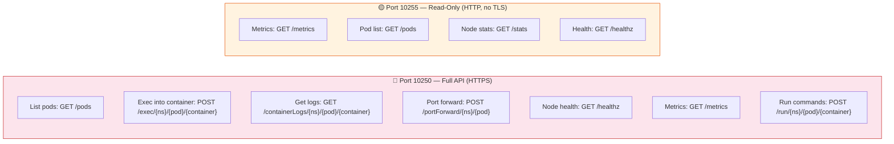

| Port | Protocol | Access Level | Default Auth | Risk |
|:---:|:---:|:---|:---:|:---:|
| **10250** | HTTPS | Full API — read + write + exec | None (anonymous) | 🔴 Critical |
| **10255** | HTTP (no TLS) | Read-only metrics | None (always open) | 🟡 High |

### Demonstrating the Default Exposure

```bash
# ⚠️ These work by DEFAULT on an unsecured kubelet!

# List all pods on this node (no credentials needed)
curl -sk https://localhost:10250/pods
# Returns full JSON list of all pods — names, images, env vars, volume mounts...

# Read unauthenticated metrics (port 10255, plain HTTP)
curl -s http://localhost:10255/metrics
# Returns Prometheus-format metrics — CPU, memory, network usage

# Read system logs
curl -sk https://localhost:10250/logs/syslog
# Returns the actual syslog from the node!

# Execute a command inside a container (most dangerous!)
# curl -sk https://localhost:10250/run/<namespace>/<pod>/<container> \
#   -d "cmd=cat /etc/shadow"
# Returns the output of the command inside the container!
```

> **The 2018 Tesla breach exploited exactly this.** The kubelet API (and Kubernetes dashboard) were exposed without authentication. Attackers used the exec endpoint to run commands inside pods and steal AWS credentials from environment variables — then used those credentials to mine cryptocurrency using Tesla's AWS infrastructure.

---

## 🛡️ The Four Security Controls

There are four security controls to harden the Kubelet. Each can be configured either in the **service file** (CLI flags) or the **config YAML file**. Both methods achieve the same result.

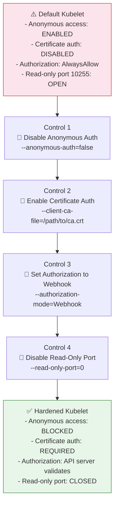

---

## 🚫 Control 1 — Disable Anonymous Authentication

### What Is the Default Behavior?

By default, the Kubelet treats any request that does not match a known authentication method as **anonymous** — specifically:
- **Username:** `system:anonymous`
- **Group:** `system:unauthenticated`

This means a plain `curl` request with no credentials at all is still processed.

```bash
# Default behavior — this WORKS even with no credentials
curl -sk https://localhost:10250/pods
# Returns pod list! ← This is the vulnerability
```

### What We Want

After disabling anonymous auth, unauthenticated requests are immediately rejected:

```bash
# After setting anonymous-auth=false:
curl -sk https://localhost:10250/pods
# {"kind":"Status","status":"Failure","message":"Unauthorized","code":401}
```

### Configuration — Two Ways

**Method 1: CLI Flag (in kubelet.service)**

```bash
# /etc/systemd/system/kubelet.service.d/10-kubeadm.conf
ExecStart=/usr/local/bin/kubelet \
  ...
  --anonymous-auth=false \     # ← Reject all anonymous requests
  ...
```

**Method 2: Config File (recommended — no restart of systemd needed)**

```yaml
# /var/lib/kubelet/config.yaml
apiVersion: kubelet.config.k8s.io/v1beta1
kind: KubeletConfiguration
authentication:
  anonymous:
    enabled: false              # ← false = reject anonymous requests
                                #   true  = allow anonymous (default, insecure)
```

### How It Works

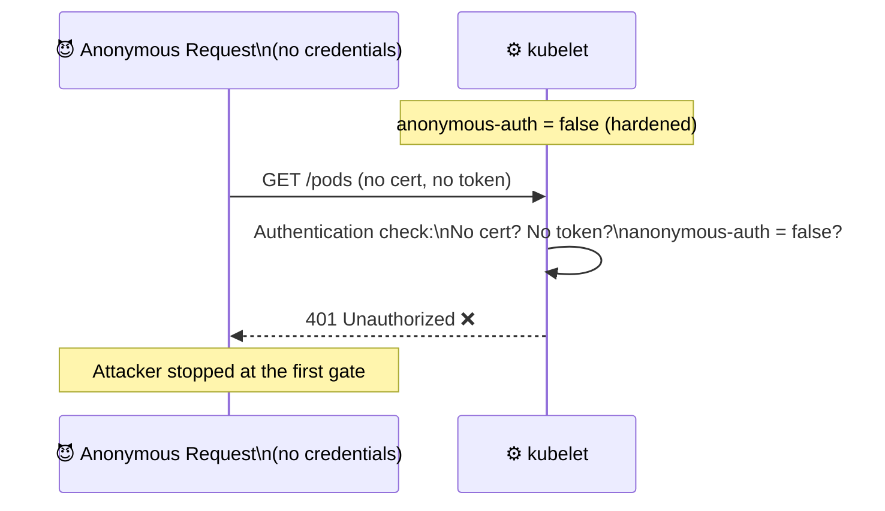

---

## 📜 Control 2 — Certificate-Based Authentication

### Why Certificates?

After disabling anonymous auth, you need to allow **legitimate callers** (like the kube-apiserver) to authenticate. The most secure method is **mutual TLS (mTLS)** — both sides present certificates.

From the Kubelet's perspective, the kube-apiserver is a **client**. So the Kubelet needs to verify the kube-apiserver's identity using a CA certificate.

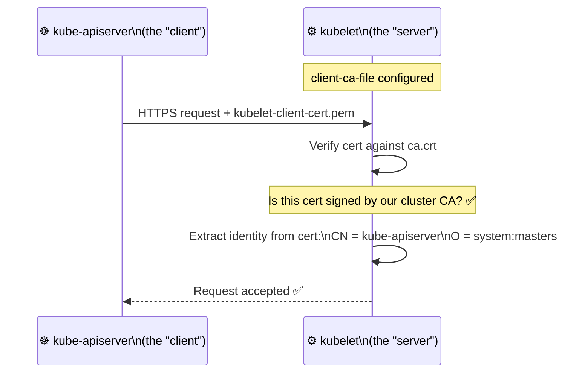

### Configuration — Two Ways

**Method 1: CLI Flag**

```bash
# /etc/systemd/system/kubelet.service
ExecStart=/usr/local/bin/kubelet \
  --client-ca-file=/var/lib/kubernetes/ca.crt \   # ← CA cert to verify clients
  ...
```

**Method 2: Config File**

```yaml
# /var/lib/kubelet/config.yaml
apiVersion: kubelet.config.k8s.io/v1beta1
kind: KubeletConfiguration
authentication:
  anonymous:
    enabled: false
  x509:
    clientCAFile: /var/lib/kubernetes/ca.crt   # ← CA cert to verify client certs
```

### The kube-apiserver Must Present a Certificate

The kube-apiserver is configured to present a certificate when talking to the kubelet:

```bash
# /etc/kubernetes/manifests/kube-apiserver.yaml (on control plane)
# Look for these flags in the kube-apiserver pod spec:
--kubelet-client-certificate=/var/lib/kubernetes/apiserver-kubelet-client.crt
--kubelet-client-key=/var/lib/kubernetes/apiserver-kubelet-client.key
```

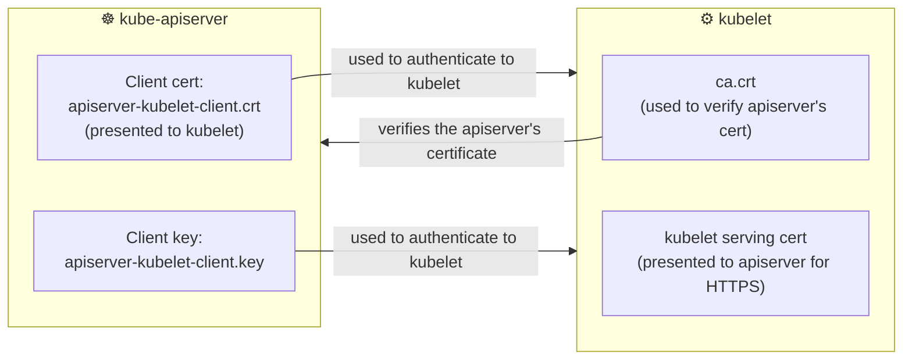

### Manually Testing Certificate Auth (for debugging)

```bash
# Test kubelet API with a certificate (simulating what kube-apiserver does)
curl -sk https://localhost:10250/pods \
  --key /var/lib/kubernetes/apiserver-kubelet-client.key \
  --cert /var/lib/kubernetes/apiserver-kubelet-client.crt
# Returns pod list ✅ (authenticated with cert)

# Without cert — should now fail
curl -sk https://localhost:10250/pods
# 401 Unauthorized ❌
```

> **⚠️ Important:** If neither certificate-based nor token-based authentication **explicitly rejects** a request, the Kubelet falls back to treating it as anonymous. Always verify your authentication is working before disabling anonymous-auth, otherwise you might accidentally lock out the API server.

---

## 🔐 Control 3 — Authorization via Webhook Mode

### What Is the Default?

After authentication, the Kubelet decides **what the authenticated user is allowed to do**. The default authorization mode is `AlwaysAllow` — meaning any authenticated user can do anything.

```bash
# Default: any authenticated user can exec into containers, read secrets, etc.
# AlwaysAllow = no authorization enforcement
```

### What Webhook Mode Does

Setting authorization to `Webhook` makes the Kubelet **call back to the kube-apiserver** for every authorization decision. The kube-apiserver uses RBAC to decide if the request should be allowed.

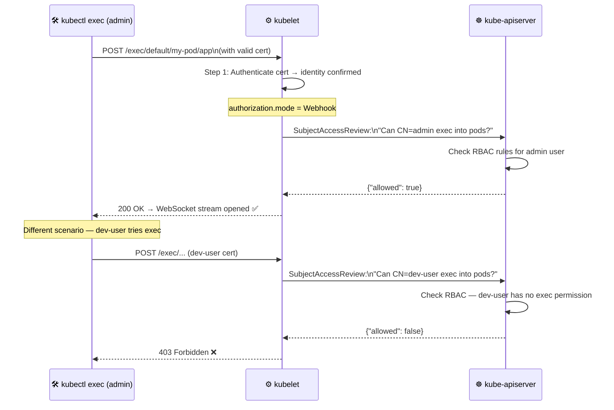

### Configuration — Two Ways

**Method 1: CLI Flag**

```bash
ExecStart=/usr/local/bin/kubelet \
  ...
  --authorization-mode=Webhook \   # ← Delegate decisions to kube-apiserver
  ...
```

**Method 2: Config File**

```yaml
# /var/lib/kubelet/config.yaml
apiVersion: kubelet.config.k8s.io/v1beta1
kind: KubeletConfiguration
authorization:
  mode: Webhook                    # ← "AlwaysAllow" (default, insecure)
                                   #   "Webhook" (consults kube-apiserver)
                                   #   "AlwaysDeny" (blocks everything)
```

### The SubjectAccessReview — How Webhook Auth Works

When Webhook mode is enabled, the Kubelet sends a `SubjectAccessReview` to the kube-apiserver:

```json
// What the kubelet sends to the kube-apiserver for authorization
{
  "apiVersion": "authorization.k8s.io/v1",
  "kind": "SubjectAccessReview",
  "spec": {
    "user": "admin",
    "groups": ["system:masters"],
    "resourceAttributes": {
      "namespace": "default",
      "verb": "create",
      "resource": "pods",
      "subresource": "exec"
    }
  }
}

// kube-apiserver's response:
{
  "status": {
    "allowed": true,
    "reason": "RBAC: allowed by ClusterRoleBinding cluster-admin"
  }
}
```

---

## 🔌 Control 4 — Disable the Read-Only Port (10255)

### Why Port 10255 Is Dangerous

Port 10255 was created for **unauthenticated, read-only** access to kubelet metrics. There is **no TLS**, no certificates, no tokens — anyone who can reach the port gets the data.

```bash
# This works on DEFAULT kubelet — no auth required!
curl -s http://localhost:10255/metrics
# HELP kubelet_running_pods Number of pods that have a running pod sandbox
# kubelet_running_pods 12

curl -s http://localhost:10255/pods
# Full JSON list of all pods on the node (namespace, name, image, env vars...)

curl -s http://localhost:10255/stats
# Detailed CPU and memory usage per container
```

**What an attacker learns from port 10255:**

| Endpoint | Information Exposed |
|:---|:---|
| `/pods` | All pod names, namespaces, images, environment variable names, volume mounts |
| `/metrics` | Number of pods, containers, CPU/memory usage — recon data |
| `/stats` | Per-container resource usage — identify high-value targets |
| `/healthz` | Confirms the node is alive and kubelet is running |

### Configuration — Two Ways

Setting the port to `0` disables it completely.

**Method 1: CLI Flag**

```bash
ExecStart=/usr/local/bin/kubelet \
  ...
  --read-only-port=0 \       # ← 0 = disabled
                             #   10255 = default (open and unauthenticated)
  ...
```

**Method 2: Config File**

```yaml
# /var/lib/kubelet/config.yaml
apiVersion: kubelet.config.k8s.io/v1beta1
kind: KubeletConfiguration
readOnlyPort: 0              # ← 0 = disabled
                             #   10255 = default (open, no auth)
```

### After Disabling Port 10255

```bash
# Connection refused — port is closed
curl -s http://localhost:10255/metrics
# curl: (7) Failed to connect to localhost port 10255: Connection refused

# Metrics are still available on port 10250 (with auth)
curl -sk https://localhost:10250/metrics \
  --cert /var/lib/kubernetes/apiserver-kubelet-client.crt \
  --key /var/lib/kubernetes/apiserver-kubelet-client.key
# Returns same metrics — but now requires authentication ✅
```

---

## 🧩 Applying All Controls Together

### Complete Hardened Config File

```yaml
# /var/lib/kubelet/config.yaml — FULLY HARDENED
apiVersion: kubelet.config.k8s.io/v1beta1
kind: KubeletConfiguration

# ── Cluster Settings ──────────────────────────────────────
clusterDomain: cluster.local
clusterDNS:
  - 10.96.0.10
staticPodPath: /etc/kubernetes/manifests
rotateCertificates: true

# ── SECURITY: Control 1 + 2 — Authentication ─────────────
authentication:
  anonymous:
    enabled: false                    # ← Control 1: Block anonymous access
  webhook:
    enabled: true                     # ← Enable webhook token auth
    cacheTTL: 2m0s
  x509:
    clientCAFile: /etc/kubernetes/pki/ca.crt  # ← Control 2: Cert-based auth

# ── SECURITY: Control 3 — Authorization ──────────────────
authorization:
  mode: Webhook                       # ← Control 3: Delegate to kube-apiserver
  webhook:
    cacheAuthorizedTTL: 5m0s
    cacheUnauthorizedTTL: 30s

# ── SECURITY: Control 4 — Read-Only Port ─────────────────
readOnlyPort: 0                       # ← Control 4: Disable unauthenticated port

# ── TLS ──────────────────────────────────────────────────
tlsCertFile: /var/lib/kubelet/pki/kubelet.crt
tlsPrivateKeyFile: /var/lib/kubelet/pki/kubelet.key

# ── Other Settings ────────────────────────────────────────
healthzBindAddress: 127.0.0.1        # ← Bind health check to localhost only
healthzPort: 10248
eventRecordQPS: 0
```

### Complete Hardened Service File

```bash
# /etc/systemd/system/kubelet.service.d/10-kubeadm.conf
[Service]
ExecStart=/usr/local/bin/kubelet \
  --config=/var/lib/kubelet/config.yaml \    # ← Use config file
  --kubeconfig=/var/lib/kubelet/kubeconfig \ # ← Credentials for kube-apiserver
  --bootstrap-kubeconfig=/etc/kubernetes/bootstrap-kubelet.conf \
  --container-runtime-endpoint=unix:///var/run/containerd/containerd.sock \
  --anonymous-auth=false \                   # ← Control 1 (CLI override)
  --client-ca-file=/etc/kubernetes/pki/ca.crt \  # ← Control 2 (CLI override)
  --authorization-mode=Webhook \             # ← Control 3 (CLI override)
  --read-only-port=0 \                       # ← Control 4 (CLI override)
  -v=2

# After editing, reload and restart:
# systemctl daemon-reload
# systemctl restart kubelet
```

### Before and After Comparison

| Setting | Default (Insecure) | Hardened |
|:---|:---|:---|
| Anonymous access | ✅ Allowed | ❌ `anonymous.enabled: false` |
| Certificate auth | ❌ Disabled | ✅ `clientCAFile: /etc/kubernetes/pki/ca.crt` |
| Authorization mode | `AlwaysAllow` | `Webhook` |
| Port 10255 | Open (HTTP, no auth) | `readOnlyPort: 0` (disabled) |
| Port 10250 | Open (no auth) | HTTPS + cert required |

---

## 🔍 Verifying Kubelet Security

After applying the security controls, verify each one works correctly.

### Verify Control 1 — Anonymous Auth Disabled

```bash
# Test from the node itself (should now fail)
curl -sk https://localhost:10250/pods

# Expected: 401 Unauthorized (not a pod list)
# {"kind":"Status","status":"Failure","message":"Unauthorized","reason":"Unauthorized","code":401}

# If you still get a pod list: anonymous auth is still enabled!
```

### Verify Control 2 — Certificate Auth Works

```bash
# Test WITH a valid certificate (should succeed)
curl -sk https://localhost:10250/pods \
  --cert /etc/kubernetes/pki/apiserver-kubelet-client.crt \
  --key /etc/kubernetes/pki/apiserver-kubelet-client.key

# Expected: JSON pod list ✅

# Test WITH an INVALID/self-signed cert (should fail)
curl -sk https://localhost:10250/pods \
  --cert /tmp/fake-cert.crt \
  --key /tmp/fake-key.key
# Expected: 401 Unauthorized ❌
```

### Verify Control 3 — Webhook Authorization

```bash
# Confirm authorization mode in running config
ps aux | grep kubelet | grep authorization
# Should show: --authorization-mode=Webhook

# OR check the config file
grep -A2 "authorization:" /var/lib/kubelet/config.yaml
# authorization:
#   mode: Webhook

# Test that a low-privilege user CANNOT exec into pods
# (This is checked by kube-apiserver RBAC when using Webhook mode)
kubectl auth can-i create pods/exec --as=dev-user
# no ✅ (RBAC enforced through kubelet webhook)
```

### Verify Control 4 — Read-Only Port Disabled

```bash
# Test port 10255 — should be refused
curl -s http://localhost:10255/metrics
# curl: (7) Failed to connect to localhost port 10255: Connection refused ✅

# Confirm with netstat/ss (port should not be listening)
ss -tlnp | grep 10255
# (empty output — port not listening) ✅

ss -tlnp | grep 10250
# LISTEN 0 128 0.0.0.0:10250 ...  ← Only 10250 remains (with auth)
```

### Complete Security Check Script

```bash
#!/bin/bash
echo "=== Kubelet Security Audit ==="
echo ""

# Check 1: Anonymous auth
AUTH=$(curl -sk https://localhost:10250/pods 2>&1)
if echo "$AUTH" | grep -q "Unauthorized"; then
    echo "✅ Control 1: Anonymous auth is DISABLED"
else
    echo "❌ Control 1: Anonymous auth is ENABLED — INSECURE!"
fi

# Check 2: Certificate config
CA_FILE=$(grep -A5 "x509:" /var/lib/kubelet/config.yaml | grep clientCAFile | awk '{print $2}')
if [ -f "$CA_FILE" ]; then
    echo "✅ Control 2: CA file exists: $CA_FILE"
else
    echo "❌ Control 2: CA file not configured or not found"
fi

# Check 3: Authorization mode
AUTH_MODE=$(grep -A2 "authorization:" /var/lib/kubelet/config.yaml | grep mode | awk '{print $2}')
if [ "$AUTH_MODE" = "Webhook" ]; then
    echo "✅ Control 3: Authorization mode is Webhook"
else
    echo "❌ Control 3: Authorization mode is '$AUTH_MODE' — should be Webhook"
fi

# Check 4: Read-only port
RO_PORT=$(ss -tlnp | grep 10255)
if [ -z "$RO_PORT" ]; then
    echo "✅ Control 4: Read-only port 10255 is CLOSED"
else
    echo "❌ Control 4: Read-only port 10255 is OPEN — INSECURE!"
fi

echo ""
echo "=== Config File Location ==="
ps aux | grep kubelet | grep -oP '\-\-config=\S+'
```

---

## 🏭 Real-World Scenarios

### Scenario 1 — The Tesla Cryptomining Attack (2018)

**What happened:**

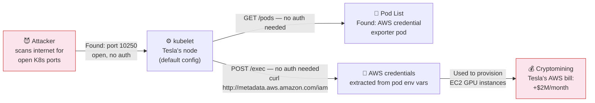

**What should have been in place:**

```yaml
# The four controls would have stopped this attack:
authentication:
  anonymous:
    enabled: false          # ← Step 1: Blocked the initial unauthenticated /pods request
  x509:
    clientCAFile: /etc/kubernetes/pki/ca.crt  # ← Step 2: Cert required to proceed
authorization:
  mode: Webhook             # ← Step 3: Even with cert, RBAC would deny /exec
readOnlyPort: 0             # ← Step 4: No unauthenticated metrics either
```

---

### Scenario 2 — Penetration Test: Kubelet Exposure Check

A security team runs a pentest on a Kubernetes cluster. Here's what they check:

```bash
# 1. Identify all nodes in the cluster
kubectl get nodes -o wide
# Note the INTERNAL-IP of each node

# 2. For each node, check if kubelet is exposed
NODE_IP="10.0.1.15"

# Check full API (unauthenticated)
curl -sk https://$NODE_IP:10250/pods | head -c 500
# If returns JSON: CRITICAL finding

# Check read-only port
curl -s http://$NODE_IP:10255/pods | head -c 500
# If returns JSON: HIGH finding

# 3. If accessible — check what the exec endpoint can do
curl -sk https://$NODE_IP:10250/run/default/my-pod/app \
  -d "cmd=id"
# If returns "uid=0(root)...": CRITICAL — remote command execution as root
```

---

### Scenario 3 — CIS Benchmark Check for Kubelet

The CIS Kubernetes Benchmark specifies exactly these controls. Here are the relevant checks:

| CIS Control | Recommendation | How to Fix |
|:---|:---|:---|
| 4.2.1 | `--anonymous-auth=false` | Set in config or service file |
| 4.2.2 | `--authorization-mode=Webhook` | Set in config or service file |
| 4.2.3 | `--client-ca-file` is set | Set `clientCAFile` in config |
| 4.2.4 | `--read-only-port=0` | Set `readOnlyPort: 0` in config |
| 4.2.5 | `--streaming-connection-idle-timeout` not zero | Prevents stuck connections |
| 4.2.6 | `--protect-kernel-defaults=true` | Protect kernel parameters |

```bash
# Run CIS benchmark check with kube-bench
kube-bench node --check 4.2.1,4.2.2,4.2.3,4.2.4

# Example output:
# [PASS] 4.2.1 Ensure that the --anonymous-auth argument is set to false
# [PASS] 4.2.2 Ensure that the --authorization-mode argument is not set to AlwaysAllow
# [PASS] 4.2.3 Ensure that the --client-ca-file argument is set
# [PASS] 4.2.4 Ensure that the --read-only-port argument is set to 0
```

---

## 📋 Commands Reference

### Viewing Kubelet Configuration

```bash
# Find the kubelet process and all its flags
ps -aux | grep kubelet

# Find the config file location
ps aux | grep kubelet | grep -oP '\-\-config=\S+'

# View the config file
cat /var/lib/kubelet/config.yaml
# OR common alternative path:
cat /etc/kubernetes/kubelet.conf

# View the kubelet service file
systemctl cat kubelet

# Check kubelet status
systemctl status kubelet

# View kubelet logs (recent entries)
journalctl -u kubelet -n 50
journalctl -u kubelet --since "5 minutes ago"

# Check which ports kubelet is listening on
ss -tlnp | grep kubelet
# or
netstat -tlnp | grep kubelet
```

### Modifying Kubelet Security Settings

```bash
# Edit config file directly
vi /var/lib/kubelet/config.yaml

# After editing — restart kubelet
systemctl daemon-reload
systemctl restart kubelet

# Verify restart was successful
systemctl status kubelet
# Active: active (running) ← good
# Active: failed           ← check the config for errors

# View errors if kubelet fails to start
journalctl -u kubelet -n 30
```

### Testing Security Controls

```bash
# Test 1: Anonymous auth (should return 401 after hardening)
curl -sk https://localhost:10250/pods
curl -sk https://<node-ip>:10250/pods

# Test 2: Certificate auth (should return pod list)
curl -sk https://localhost:10250/pods \
  --cert /etc/kubernetes/pki/apiserver-kubelet-client.crt \
  --key /etc/kubernetes/pki/apiserver-kubelet-client.key

# Test 3: Read-only port (should return connection refused)
curl -s http://localhost:10255/metrics
curl -s http://localhost:10255/pods

# Test 4: Check listening ports
ss -tlnp | grep 10250
ss -tlnp | grep 10255

# Test 5: Full security audit
grep -E "anonymous|authorization|clientCAFile|readOnlyPort" \
  /var/lib/kubelet/config.yaml
```

### Kubelet API Endpoints (for reference)

```bash
# These all require authentication after hardening:
# List pods on this node
curl -sk https://localhost:10250/pods --cert ... --key ...

# Node health check
curl -sk https://localhost:10250/healthz --cert ... --key ...

# Metrics
curl -sk https://localhost:10250/metrics --cert ... --key ...

# Container logs
curl -sk https://localhost:10250/containerLogs/<namespace>/<pod>/<container> \
  --cert ... --key ...

# kubelet configuration (v1.10+)
curl -sk https://localhost:10250/configz --cert ... --key ...
```

---

## 🧩 Concepts at a Glance

| Concept | What It Is | Key Point |
|:---|:---|:---|
| **Kubelet** | Agent on every worker node | Manages pod lifecycle, reports status, exposes an API |
| **Port 10250** | Kubelet full API (HTTPS) | Allows pod list, exec, logs, port-forward — full control |
| **Port 10255** | Read-only metrics (HTTP) | Unauthenticated by design — disable it with `readOnlyPort: 0` |
| **Anonymous auth** | Default: enabled | Any request with no credentials is treated as `system:anonymous` |
| **`--anonymous-auth=false`** | Disables anonymous access | First and most important security control |
| **`clientCAFile`** | CA cert for verifying client certs | Allows kubelet to verify the kube-apiserver's identity |
| **mTLS** | Mutual TLS | Both client (apiserver) and server (kubelet) present certificates |
| **`--authorization-mode=Webhook`** | Delegate auth decisions to kube-apiserver | Kubelet sends SubjectAccessReview to apiserver for each request |
| **`AlwaysAllow`** | Default authorization mode | Every authenticated request is permitted — insecure |
| **`readOnlyPort: 0`** | Disables port 10255 | Prevents unauthenticated metrics/pod data exposure |
| **`--config`** | Path to KubeletConfiguration YAML | Config file settings are overridden by CLI flags |
| **CLI flag vs config file** | Two ways to configure kubelet | CLI flag takes precedence if both are set |
| **`SubjectAccessReview`** | API call for authorization check | Kubelet asks kube-apiserver: "Is this user allowed to do X?" |
| **`rotateCertificates: true`** | Auto-renew kubelet certs | Prevents cert expiry from taking down the node |
| **CIS Benchmark 4.2.x** | Industry standard checks for kubelet | kube-bench can automate these checks |
| **Tesla Breach (2018)** | Real attack via unsecured kubelet | Exposed exec endpoint used to steal AWS creds and mine crypto |

---

### The Complete Security Architecture

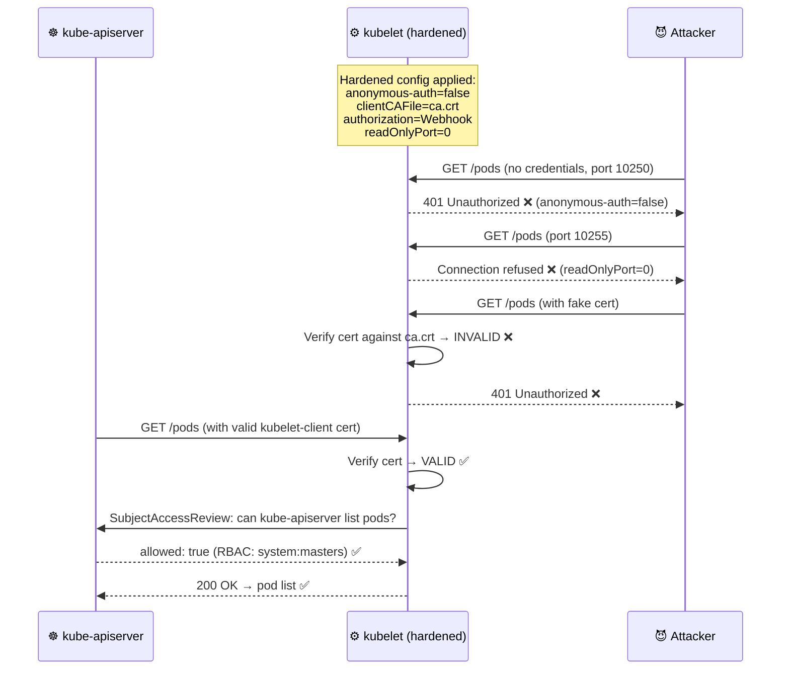

---

*Part of the [Certified Kubernetes Security Specialist (CKS)](../CKS.md) study series.*  
*Previous: [Chapter 9.1 — Cluster Roles and Bindings](./9.1%20--%20Cluster%20Role%20and%20Bindings.md) | Next: [Chapter 11 — Kubectl Proxy & Port Forward](./11%20--%20Kubectl%20Proxy.md)*
