# 🔌 11 -- Kubectl Proxy & Port Forward

> **Series:** Cluster Setup & Hardening | **Phase 3: Node Security**  
> **Chapter Goal:** Understand how `kubectl proxy` and `kubectl port-forward` give you secure, authenticated access to the Kubernetes API server and internal cluster services — without exposing them externally or passing credentials manually.

---

## 📌 Table of Contents

1. [The Problem These Commands Solve](#-the-problem-these-commands-solve)
2. [How kubectl Uses kubeconfig for Auth](#-how-kubectl-uses-kubeconfig-for-auth)
3. [The Direct curl Problem](#-the-direct-curl-problem)
4. [kubectl proxy — What It Is and How It Works](#-kubectl-proxy--what-it-is-and-how-it-works)
5. [Accessing the API Server via kubectl proxy](#-accessing-the-api-server-via-kubectl-proxy)
6. [Accessing Cluster Services via kubectl proxy](#-accessing-cluster-services-via-kubectl-proxy)
7. [kubectl port-forward — What It Is and How It Works](#-kubectl-port-forward--what-it-is-and-how-it-works)
8. [proxy vs port-forward — Key Differences](#-proxy-vs-port-forward--key-differences)
9. [Security Considerations](#-security-considerations)
10. [Real-World Scenarios](#-real-world-scenarios)
11. [Commands Reference](#-commands-reference)
12. [Concepts at a Glance](#-concepts-at-a-glance)

---

## 🤔 The Problem These Commands Solve

### The Access Challenge

Kubernetes services and the API server run **inside the cluster** — on private IP addresses that are not reachable from your laptop or a remote workstation by default.

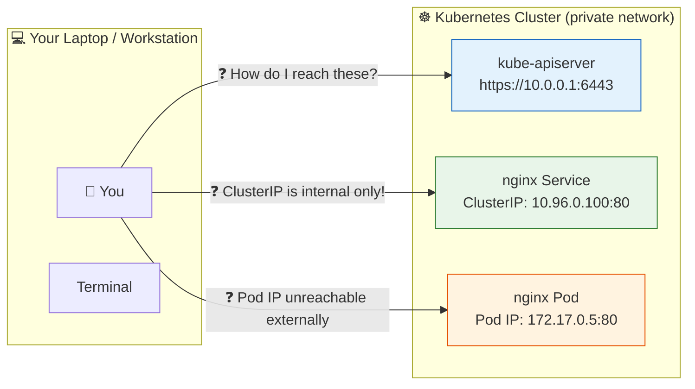

**Options to access internal services:**

| Method | Requires | Exposes Externally? | Auth Handling |
|:---|:---|:---:|:---|
| NodePort / LoadBalancer | Config change, port opened | ✅ Yes | Manual |
| Ingress | Ingress controller setup | ✅ Yes | Manual |
| **`kubectl proxy`** | Just `kubectl` | ❌ No (loopback only) | Automatic (kubeconfig) |
| **`kubectl port-forward`** | Just `kubectl` | ❌ No (loopback only) | Automatic (kubeconfig) |

`kubectl proxy` and `kubectl port-forward` give you **secure, temporary, local-only access** without changing any cluster configuration or exposing anything externally.

---

## 🔑 How kubectl Uses kubeconfig for Auth

When you run any `kubectl` command, it reads your `~/.kube/config` file and automatically handles authentication:

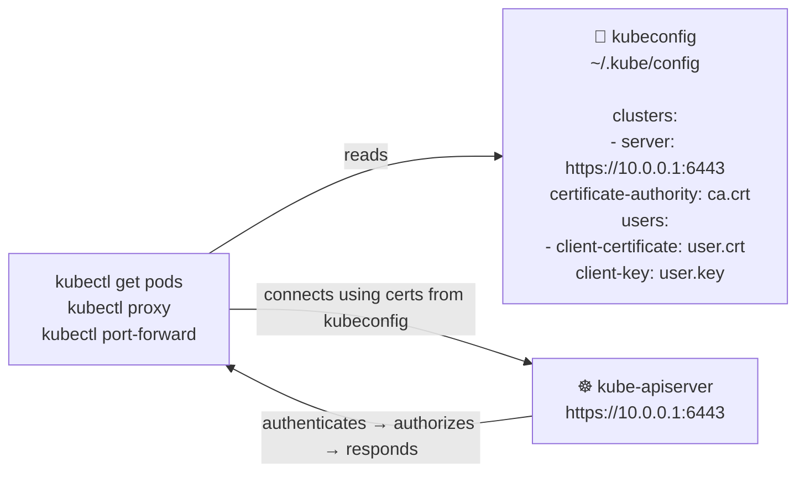

The key insight: **`kubectl` already knows how to authenticate**. The proxy and port-forward commands leverage this — you never need to pass `--cert`, `--key`, or `--token` manually.

---

## ⚠️ The Direct curl Problem

Before understanding kubectl proxy, let's see why direct curl to the API server fails without credentials:

```bash
# Attempt to curl the API server directly (no credentials)
curl http://<kube-api-server-ip>:6443 -k
```

**Response:**

```json
{
  "kind": "Status",
  "apiVersion": "v1",
  "metadata": {},
  "status": "Failure",
  "message": "forbidden: User \"system:anonymous\" cannot get path \"/\"",
  "reason": "Forbidden",
  "details": {},
  "code": 403
}
```

**Why this happens:**

```
curl http://<api-server>:6443 -k
│    │                         │
│    │                         └── Skip TLS verification (bad practice)
│    └── No certificates, no token
└── Just a raw HTTP request

Result: Kubernetes sees: "No credentials → system:anonymous → 403 Forbidden"
```

**To make curl work WITHOUT kubectl proxy, you'd need:**

```bash
# Manual approach — painful and error-prone
curl https://<api-server>:6443/api/v1/pods \
  --cert /path/to/client.crt \
  --key /path/to/client.key \
  --cacert /path/to/ca.crt

# OR with a token
TOKEN=$(kubectl config view --raw -o jsonpath='{.users[0].user.token}')
curl https://<api-server>:6443/api/v1/pods \
  -H "Authorization: Bearer $TOKEN" \
  --cacert /path/to/ca.crt
```

`kubectl proxy` eliminates all of this — it handles auth transparently.

---

## 🔄 kubectl proxy — What It Is and How It Works

### What It Does

`kubectl proxy` starts a **local HTTP proxy server** on your machine (port 8001 by default). All requests to `localhost:8001` are automatically forwarded to the Kubernetes API server with your kubeconfig credentials attached.

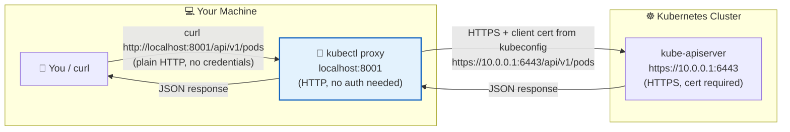

**The proxy acts as a translator:**

| What you send | What the proxy does | What the API server receives |
|:---|:---|:---|
| Plain HTTP to localhost | Adds your TLS certs from kubeconfig | Authenticated HTTPS request |
| No Authorization header | Reads token/cert from kubeconfig | Valid auth credentials |
| `http://localhost:8001/api/v1/pods` | Translates URL | `https://apiserver:6443/api/v1/pods` |

### Starting kubectl proxy

```bash
# Start proxy on default port 8001
kubectl proxy

# Output:
# Starting to serve on 127.0.0.1:8001

# Start on a different port
kubectl proxy --port=9090
# Starting to serve on 127.0.0.1:9090

# Start in the background (so you can keep using the terminal)
kubectl proxy &
# [1] 12345
# Starting to serve on 127.0.0.1:8001

# Start and bind to all interfaces (SECURITY RISK — see Security section)
kubectl proxy --address='0.0.0.0' --accept-hosts='^*$'
# ⚠️ This makes the proxy accessible from other machines — use carefully!
```

> **Why loopback (127.0.0.1) by default?**  
> The proxy listens only on `127.0.0.1` — the loopback interface. This means only processes on your local machine can connect. It cannot be reached from other machines on the network. This is a security feature — your cluster credentials are not exposed over the network.

---

## 🌐 Accessing the API Server via kubectl proxy

### Basic API Access

```bash
# Start the proxy (in a separate terminal or with &)
kubectl proxy &

# Query the API root — returns all available API paths
curl http://localhost:8001
```

**Response — list of all API paths:**

```json
{
  "paths": [
    "/api",
    "/api/v1",
    "/apis",
    "/apis/apps",
    "/apis/apps/v1",
    "/apis/batch",
    "/apis/networking.k8s.io",
    "/healthz",
    "/logs",
    "/metrics",
    "/openapi/v2",
    "/swagger-2.0.0.json",
    "/version"
  ]
}
```

### Querying Kubernetes Resources via proxy

```bash
# List all pods in the default namespace
curl http://localhost:8001/api/v1/namespaces/default/pods

# List all nodes
curl http://localhost:8001/api/v1/nodes

# List all deployments
curl http://localhost:8001/apis/apps/v1/namespaces/default/deployments

# Get a specific pod
curl http://localhost:8001/api/v1/namespaces/default/pods/my-pod

# Get cluster health
curl http://localhost:8001/healthz
# ok

# Get cluster version
curl http://localhost:8001/version
# {"major":"1","minor":"28","gitVersion":"v1.28.0",...}
```

### URL Structure for the Proxy

```
http://localhost:8001 / api/v1 / namespaces/default / pods
│                      │         │                    │
│                      │         │                    └── Resource type
│                      │         └── Namespace scope (omit for cluster-wide)
│                      └── API version (v1 = core group)
└── Proxy base URL

http://localhost:8001 / apis / apps/v1 / namespaces/default / deployments
                        │      │          │                     │
                        │      │          │                     └── Resource type
                        │      │          └── Namespace
                        │      └── Named API group + version
                        └── /apis/ = named API groups (not core)
```

**API path cheat sheet:**

| Resource | URL via proxy |
|:---|:---|
| All pods (default ns) | `http://localhost:8001/api/v1/namespaces/default/pods` |
| All pods (all ns) | `http://localhost:8001/api/v1/pods` |
| Specific pod | `http://localhost:8001/api/v1/namespaces/default/pods/my-pod` |
| All deployments | `http://localhost:8001/apis/apps/v1/namespaces/default/deployments` |
| All nodes | `http://localhost:8001/api/v1/nodes` |
| Specific service | `http://localhost:8001/api/v1/namespaces/default/services/my-svc` |
| All namespaces | `http://localhost:8001/api/v1/namespaces` |
| Cluster version | `http://localhost:8001/version` |

---

## 🛎️ Accessing Cluster Services via kubectl proxy

### The URL Pattern for Services

```bash
curl http://localhost:8001/api/v1/namespaces/<namespace>/services/<service-name>/proxy/
```

**Example: Access an nginx service with ClusterIP (internal only)**

```bash
# This service has no NodePort or LoadBalancer — normally inaccessible from outside
kubectl get svc nginx
# NAME    TYPE        CLUSTER-IP     PORT(S)   AGE
# nginx   ClusterIP   10.96.100.50   80/TCP    5m

# But via kubectl proxy — accessible instantly!
curl http://localhost:8001/api/v1/namespaces/default/services/nginx/proxy/
```

**Response:**

```html
<!DOCTYPE html>
<html>
<head>
<title>Welcome to nginx!</title>
</head>
<body>
<h1>Welcome to nginx!</h1>
<p>If you see this page, the nginx web server is successfully installed and working.</p>
</body>
</html>
```

### How the Service Proxy Works

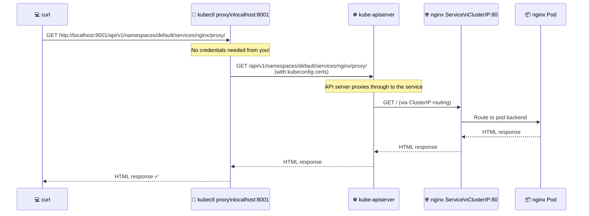

### Accessing Different Service Paths

```bash
# Access root of nginx service
curl http://localhost:8001/api/v1/namespaces/default/services/nginx/proxy/

# Access a specific path on the service
curl http://localhost:8001/api/v1/namespaces/default/services/nginx/proxy/status/

# Access a service in a different namespace
curl http://localhost:8001/api/v1/namespaces/monitoring/services/grafana/proxy/

# Access a service on a non-80 port (e.g., 8080)
# Format: http://localhost:8001/api/v1/namespaces/<ns>/services/<name>:<port>/proxy/
curl http://localhost:8001/api/v1/namespaces/default/services/myapp:8080/proxy/
```

---

## 🚇 kubectl port-forward — What It Is and How It Works

### What It Does

`kubectl port-forward` creates a **direct TCP tunnel** between a port on your local machine and a port on a pod, service, or deployment inside the cluster. Unlike `kubectl proxy` (which only works for HTTP/HTTPS), port-forward works for **any TCP protocol** — databases, gRPC, WebSockets, etc.

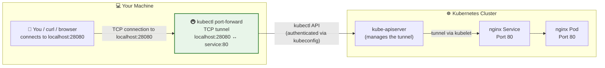

### Starting kubectl port-forward

```bash
# Forward local port 28080 to service port 80
kubectl port-forward service/nginx 28080:80

# Output:
# Forwarding from 127.0.0.1:28080 -> 80
# Forwarding from [::1]:28080 -> 80

# Then in another terminal:
curl http://localhost:28080/
# Returns nginx welcome page ✅
```

**Command format:**

```
kubectl port-forward <resource-type/resource-name> <local-port>:<remote-port>
│                    │                              │            │
│                    │                              │            └── Port on the K8s resource
│                    │                              └── Port on your local machine
│                    └── What to forward to
└── The command
```

### Forwarding to Different Resource Types

```bash
# Forward to a SERVICE (most common — routes to pods via service selector)
kubectl port-forward service/nginx 28080:80
kubectl port-forward svc/nginx 28080:80          # svc is shortname

# Forward directly to a POD (bypasses service load balancing)
kubectl port-forward pod/nginx-7c98b4f8d-xk2p9 28080:80

# Forward to a DEPLOYMENT (picks one of the deployment's pods)
kubectl port-forward deployment/nginx 28080:80

# Forward multiple ports at once
kubectl port-forward service/myapp 8080:8080 9090:9090

# Run in background
kubectl port-forward service/nginx 28080:80 &

# Specify namespace
kubectl port-forward service/nginx 28080:80 -n production
```

### How the Tunnel is Established

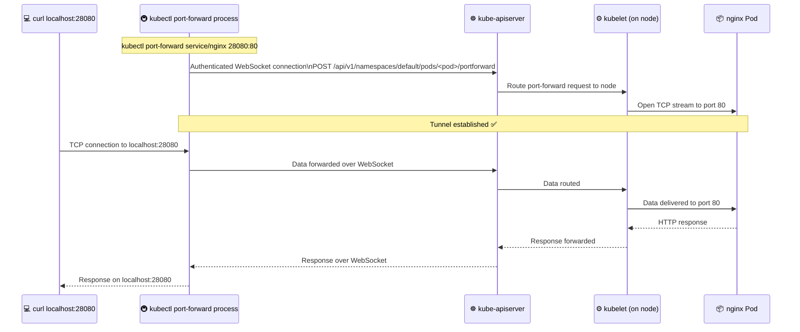

### Port-forward vs Service Types

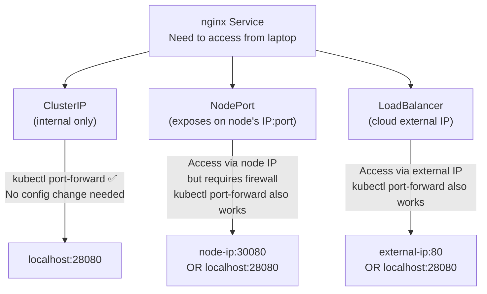

> **When is port-forward most useful?**  
> When you have a ClusterIP service — no external IP, no NodePort — and you need to test it from your laptop. No cluster config change required; just `kubectl port-forward` and you're in.

---

## 🔀 proxy vs port-forward — Key Differences

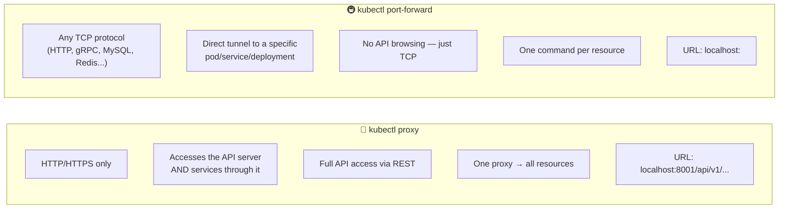

| Feature | `kubectl proxy` | `kubectl port-forward` |
|:---|:---|:---|
| **Protocol** | HTTP/HTTPS only | Any TCP protocol |
| **What it accesses** | API server + any service through it | One specific pod/service/deployment |
| **Use for API browsing** | ✅ Yes — all API endpoints accessible | ❌ Not designed for this |
| **Use for databases** | ❌ No (TCP-only protocols) | ✅ Yes (MySQL, PostgreSQL, Redis, etc.) |
| **Use for gRPC** | ❌ No | ✅ Yes |
| **URL format** | `http://localhost:8001/api/v1/...` | `http://localhost:<port>/` |
| **Number of resources** | One proxy → all resources | One command per resource |
| **Authentication** | Auto from kubeconfig | Auto from kubeconfig |
| **Network exposure** | Loopback by default | Loopback by default |
| **Typical use** | API exploration, CI/CD, service HTTP testing | Debugging, database access, local dev |

### Choosing the Right Tool

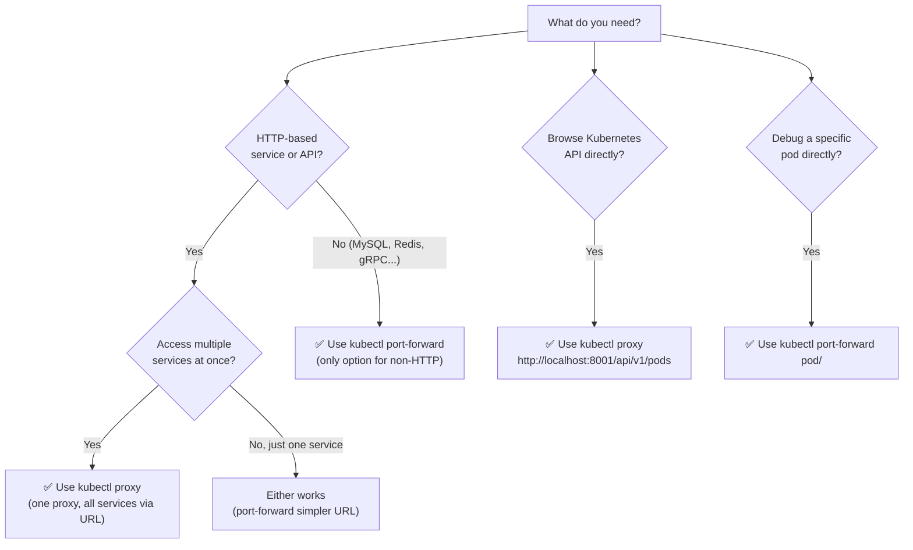

---

## 🔐 Security Considerations

### `kubectl proxy` Security

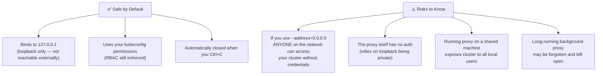

```bash
# ✅ Safe — loopback only (default)
kubectl proxy
# Starting to serve on 127.0.0.1:8001

# ⚠️ DANGEROUS — exposes proxy to network
kubectl proxy --address='0.0.0.0' --accept-hosts='^*$'
# Anyone on the network can now kubectl through your credentials!
# Use only in isolated lab environments
```

### `kubectl port-forward` Security

```bash
# ✅ Safe — loopback only (default)
kubectl port-forward service/nginx 28080:80
# Forwarding from 127.0.0.1:28080 -> 80
# Forwarding from [::1]:28080 -> 80

# ⚠️ Exposes to network — use carefully
kubectl port-forward service/nginx 28080:80 --address=0.0.0.0
# Anyone on the network can access the service through the tunnel
```

### Why These Commands Don't Replace Production Access

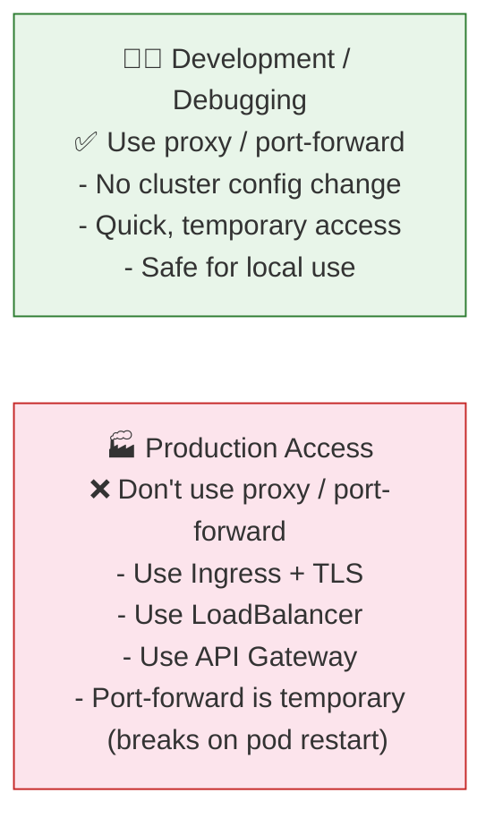

**Why port-forward breaks in production:**
- The tunnel is tied to a specific **pod name** or **process**
- If the pod restarts, the pod name changes → tunnel breaks
- It's a manual foreground process — not persistent
- Not suitable for automated production traffic

---

## 🏭 Real-World Scenarios

### Scenario 1 — Debugging a ClusterIP Service (Most Common)

**Problem:** You deployed a new API service as ClusterIP. You want to test it from your laptop without changing the service type or creating an Ingress.

```bash
# Check the service (ClusterIP — no external access)
kubectl get svc my-api
# NAME     TYPE        CLUSTER-IP    PORT(S)    AGE
# my-api   ClusterIP   10.96.50.10   8080/TCP   2m

# Forward it to your laptop
kubectl port-forward service/my-api 8080:8080

# Test it locally
curl http://localhost:8080/health
# {"status": "ok"}

curl http://localhost:8080/api/users
# [{"id":1,"name":"Alice"},{"id":2,"name":"Bob"}]

# Use with browser, Postman, etc.
# Open: http://localhost:8080 in your browser
```

---

### Scenario 2 — Accessing a Database Pod for Debugging

**Problem:** A PostgreSQL pod is in the cluster and something is wrong. You want to connect with `psql` from your laptop to run queries.

```bash
# Get the pod name
kubectl get pods -l app=postgres
# NAME                       READY   STATUS    RESTARTS
# postgres-5d8f9c7b4-x9k2p   1/1     Running   0

# Forward PostgreSQL port
kubectl port-forward pod/postgres-5d8f9c7b4-x9k2p 5432:5432

# Now connect with psql from your laptop
psql -h localhost -p 5432 -U admin -d mydb
# Password: ****
# mydb=#

# OR with any PostgreSQL GUI tool
# Host: localhost, Port: 5432, Database: mydb
```

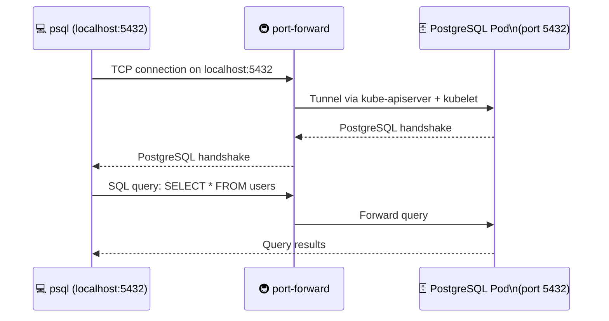

---

### Scenario 3 — Exploring the Kubernetes API

**Problem:** You want to understand the API structure, test a new endpoint, or script something that calls the API directly.

```bash
# Start the proxy
kubectl proxy &

# Explore available API groups
curl http://localhost:8001/apis | python3 -m json.tool | grep '"name"'
#   "name": "apps",
#   "name": "batch",
#   "name": "networking.k8s.io",
#   ...

# Explore the apps/v1 group
curl http://localhost:8001/apis/apps/v1 | python3 -m json.tool

# List all pods across all namespaces
curl http://localhost:8001/api/v1/pods | python3 -m json.tool

# Get a specific pod's full YAML equivalent (JSON format)
curl http://localhost:8001/api/v1/namespaces/default/pods/my-pod | python3 -m json.tool

# Watch for pod changes (streaming)
curl http://localhost:8001/api/v1/namespaces/default/pods?watch=true

# Check cluster health
curl http://localhost:8001/healthz
# ok

# Get API server version
curl http://localhost:8001/version
# {"major":"1","minor":"28","gitVersion":"v1.28.0",...}
```

---

### Scenario 4 — Accessing Grafana / Prometheus Without Ingress

**Problem:** You have Prometheus and Grafana deployed in the `monitoring` namespace with ClusterIP. You want to view dashboards during an incident investigation.

```bash
# Forward Grafana
kubectl port-forward service/grafana 3000:3000 -n monitoring &
# Forwarding from 127.0.0.1:3000 -> 3000

# Forward Prometheus
kubectl port-forward service/prometheus-server 9090:9090 -n monitoring &
# Forwarding from 127.0.0.1:9090 -> 9090

# Now open in browser:
# Grafana:    http://localhost:3000
# Prometheus: http://localhost:9090

# OR via kubectl proxy (HTTP only)
# Grafana:    http://localhost:8001/api/v1/namespaces/monitoring/services/grafana:3000/proxy/
# Prometheus: http://localhost:8001/api/v1/namespaces/monitoring/services/prometheus-server:9090/proxy/
```

---

### Scenario 5 — CI/CD Script Using kubectl proxy

**Problem:** A CI/CD pipeline needs to call the Kubernetes API to check deployment status without embedding certificates in the pipeline script.

```bash
#!/bin/bash
# ci-check.sh — Check if deployment is ready

# Start proxy in background
kubectl proxy --port=8001 &
PROXY_PID=$!

# Wait for proxy to be ready
sleep 2

# Check deployment status via proxy (no auth handling needed)
STATUS=$(curl -s http://localhost:8001/apis/apps/v1/namespaces/production/deployments/my-app \
  | python3 -c "
import json,sys
d = json.load(sys.stdin)
ready = d['status'].get('readyReplicas', 0)
desired = d['spec']['replicas']
print('READY' if ready == desired else 'NOT_READY')
")

echo "Deployment status: $STATUS"

# Stop the proxy
kill $PROXY_PID

if [ "$STATUS" != "READY" ]; then
  echo "❌ Deployment not ready — aborting!"
  exit 1
fi

echo "✅ Deployment ready — proceeding."
```

---

## 📋 Commands Reference

### kubectl proxy

```bash
# ── START ─────────────────────────────────────────────────
kubectl proxy                             # Default: port 8001, loopback only
kubectl proxy --port=9090                 # Custom port
kubectl proxy &                           # Background (keep terminal free)
kubectl proxy --port=8001 &              # Background on specific port

# UNSAFE — exposes to network:
kubectl proxy --address='0.0.0.0' --accept-hosts='^*$'

# ── API ACCESS VIA PROXY ──────────────────────────────────
curl http://localhost:8001                            # All API paths
curl http://localhost:8001/api/v1                     # Core API resources
curl http://localhost:8001/apis                       # Named API groups
curl http://localhost:8001/version                    # Cluster version
curl http://localhost:8001/healthz                    # Cluster health
curl http://localhost:8001/api/v1/namespaces          # All namespaces
curl http://localhost:8001/api/v1/nodes               # All nodes
curl http://localhost:8001/api/v1/pods                # All pods (all namespaces)
curl http://localhost:8001/api/v1/namespaces/default/pods       # Pods in default ns
curl http://localhost:8001/api/v1/namespaces/default/pods/<name>  # Specific pod
curl http://localhost:8001/apis/apps/v1/namespaces/default/deployments  # Deployments

# ── SERVICE ACCESS VIA PROXY ──────────────────────────────
curl http://localhost:8001/api/v1/namespaces/<ns>/services/<name>/proxy/
curl http://localhost:8001/api/v1/namespaces/default/services/nginx/proxy/
curl http://localhost:8001/api/v1/namespaces/default/services/myapp:8080/proxy/
curl http://localhost:8001/api/v1/namespaces/monitoring/services/grafana:3000/proxy/

# ── STOP ──────────────────────────────────────────────────
# Ctrl+C (if foreground)
# kill $PROXY_PID (if background)
# kill $(pgrep -f "kubectl proxy")
```

### kubectl port-forward

```bash
# ── FORWARD TO A SERVICE ──────────────────────────────────
kubectl port-forward service/nginx 28080:80          # local:28080 → svc:80
kubectl port-forward svc/nginx 28080:80              # shortname
kubectl port-forward service/nginx 28080:80 -n prod  # specific namespace
kubectl port-forward service/myapp 8080:8080 9090:9090  # multiple ports

# ── FORWARD TO A POD ──────────────────────────────────────
kubectl port-forward pod/nginx-abc123 28080:80       # specific pod
kubectl port-forward pod/postgres-xyz 5432:5432      # database pod

# ── FORWARD TO A DEPLOYMENT ───────────────────────────────
kubectl port-forward deployment/nginx 28080:80       # picks a pod from deployment

# ── BACKGROUND & MANAGEMENT ───────────────────────────────
kubectl port-forward service/nginx 28080:80 &        # run in background
# Kill port-forward:
kill $(pgrep -f "kubectl port-forward")
# Or by specific port:
kill $(lsof -ti :28080)

# ── COMMON FORWARDING EXAMPLES ────────────────────────────
# Grafana
kubectl port-forward svc/grafana 3000:3000 -n monitoring

# Prometheus
kubectl port-forward svc/prometheus-server 9090:9090 -n monitoring

# PostgreSQL
kubectl port-forward pod/postgres-<id> 5432:5432

# MySQL
kubectl port-forward svc/mysql 3306:3306

# Redis
kubectl port-forward svc/redis 6379:6379

# Elasticsearch
kubectl port-forward svc/elasticsearch 9200:9200

# Kubernetes Dashboard
kubectl port-forward svc/kubernetes-dashboard 8443:443 -n kubernetes-dashboard
```

---

## 🧩 Concepts at a Glance

| Concept | What It Is | Key Point |
|:---|:---|:---|
| **`kubectl proxy`** | Local HTTP proxy → kube-apiserver | Handles auth automatically from kubeconfig; HTTP only |
| **`kubectl port-forward`** | TCP tunnel → pod/service/deployment | Works for any TCP protocol (HTTP, databases, gRPC) |
| **Port 8001** | Default port for `kubectl proxy` | Change with `--port=<n>` |
| **Loopback (127.0.0.1)** | Default bind address for both commands | Only accessible from your local machine — secure by default |
| **`--address=0.0.0.0`** | Expose proxy/forward to network | ⚠️ Dangerous — use only in isolated environments |
| **kubeconfig** | Source of authentication for both commands | Both commands auto-read `~/.kube/config` |
| **ClusterIP service** | Internal-only service | Best use case for port-forward — no config change needed |
| **API path pattern** | `/api/v1/namespaces/<ns>/<resource>` | Core group (`/api`) vs named groups (`/apis`) |
| **Service proxy URL** | `/api/v1/namespaces/<ns>/services/<name>/proxy/` | Access any HTTP service through kubectl proxy |
| **`local-port:remote-port`** | port-forward format | `28080:80` = your port 28080 → container port 80 |
| **Temporary tunnel** | port-forward is not persistent | Breaks on pod restart — not for production traffic |
| **Background process** | Add `&` to run in background | `kubectl proxy &`, `kubectl port-forward ... &` |
| **RBAC enforced** | kubectl proxy still respects RBAC | If you can't `kubectl get pods`, the proxy won't show them either |
| **`kubectl proxy` vs `kube-proxy`** | Completely different tools | `kubectl proxy` = local HTTP proxy for your dev use; `kube-proxy` = cluster-wide iptables-based networking component |

---

### The Complete Picture

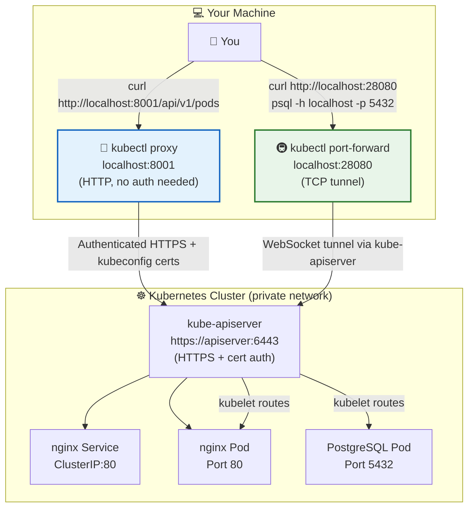

---

*Part of the [Certified Kubernetes Security Specialist (CKS)](../CKS.md) study series.*  
*Previous: [Chapter 10 — Kubelet Security](./10%20--%20Kubelet%20Security.md) | Next: [Chapter 12 — Kubernetes Dashboard](./12%20--%20Kubernetes%20Dashboard.md)*
