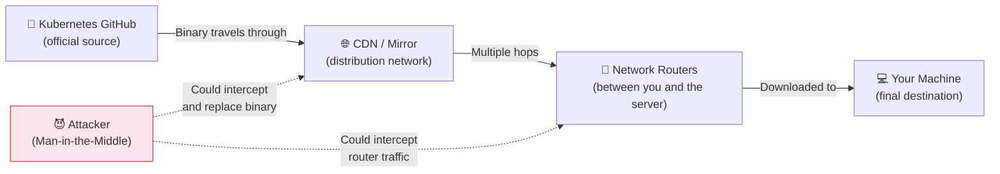
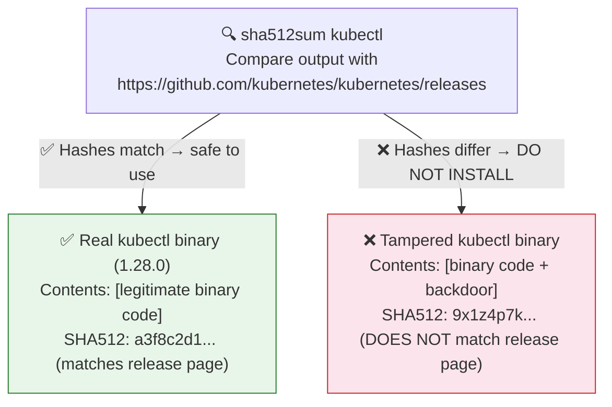
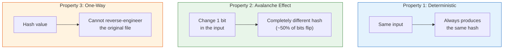
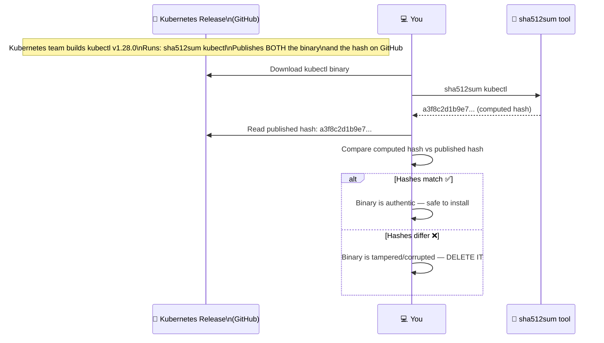
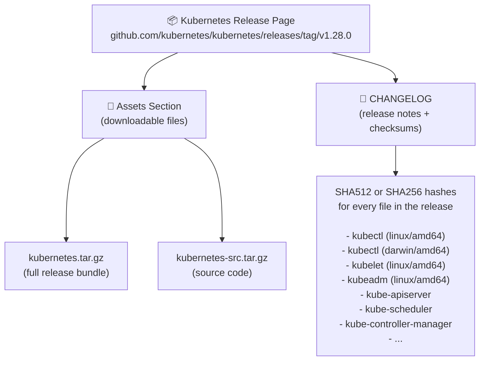
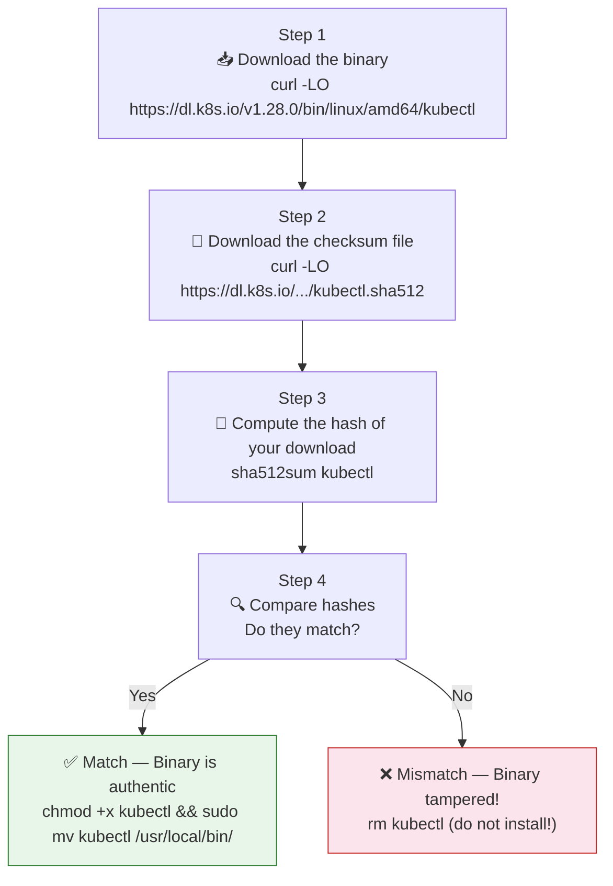
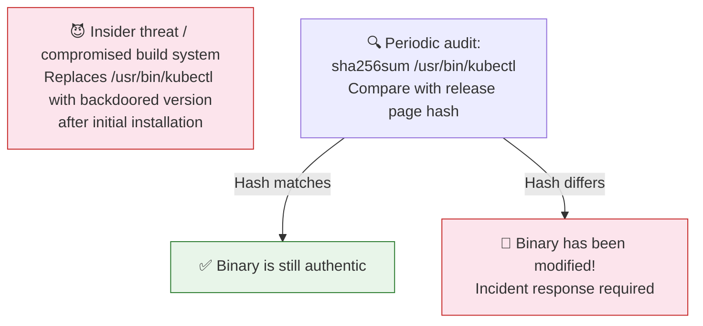
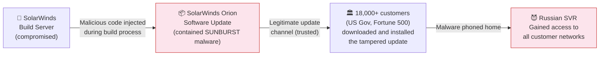
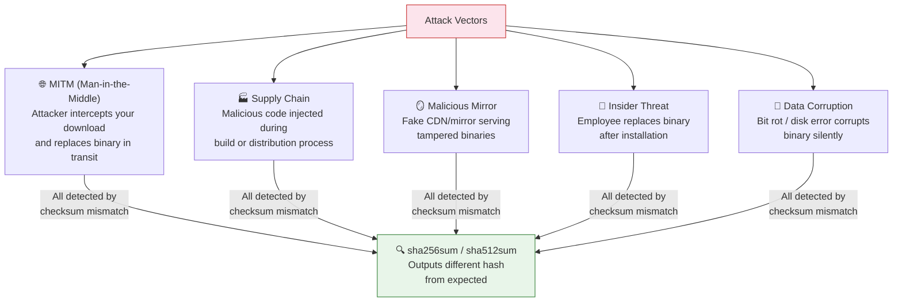
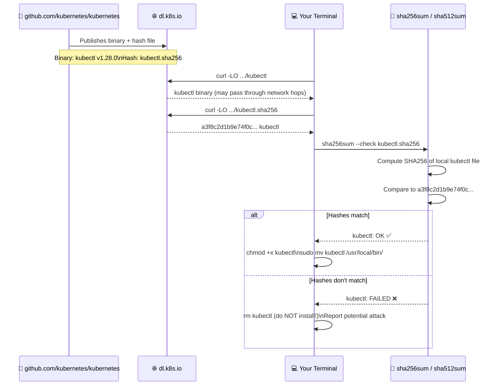

# ✅ 12 -- Verify Platform Binaries Before Deploying

> **Series:** Cluster Setup & Hardening | **Phase 3: Node Security**  
> **Chapter Goal:** Understand why binary verification matters, how cryptographic checksums work, and how to verify Kubernetes binaries (`kubectl`, `kubelet`, `kubeadm`) before installing them on any node — protecting your cluster from supply chain attacks.

---

## 📌 Table of Contents

1. [Why Binary Verification Matters](#-why-binary-verification-matters)
2. [How Checksums Work — The Concept](#-how-checksums-work--the-concept)
3. [SHA512 vs Other Hash Algorithms](#-sha512-vs-other-hash-algorithms)
4. [Where to Find Official Kubernetes Binaries](#-where-to-find-official-kubernetes-binaries)
5. [Step-by-Step: Verify a Downloaded Binary](#-step-by-step-verify-a-downloaded-binary)
6. [Verifying Individual Binaries (kubectl, kubelet, kubeadm)](#-verifying-individual-binaries-kubectl-kubelet-kubeadm)
7. [Verifying Binaries Already Installed on a System](#-verifying-binaries-already-installed-on-a-system)
8. [Verifying Container Images](#-verifying-container-images)
9. [Real-World Supply Chain Attacks](#-real-world-supply-chain-attacks)
10. [Commands Reference](#-commands-reference)
11. [Concepts at a Glance](#-concepts-at-a-glance)

---

## 🤔 Why Binary Verification Matters

### The Threat: Supply Chain Attacks

When you download a binary from the internet, you're trusting multiple systems along the way:



**What an attacker can do with a tampered binary:**

| Attack | What Happens | Impact |
|:---|:---|:---|
| **Backdoored `kubectl`** | Replaced with version that silently exfiltrates kubeconfig | Attacker gets your cluster credentials |
| **Backdoored `kubelet`** | Modified to allow unauthenticated exec on nodes | Full node compromise |
| **Backdoored `kubeadm`** | Manipulated to create a weak cluster config | Persistent cluster access |
| **Backdoored container runtime** | Can intercept all container ops | All workloads compromised |

### The Protection: Cryptographic Checksums

Every legitimate Kubernetes binary release comes with a **checksum** — a unique fingerprint of the file's contents. If even **one bit** of the file is changed (by an attacker or corruption in transit), the checksum will be completely different.



> **The guarantee:** If the hash you compute locally matches the hash published on the official Kubernetes GitHub release page, you have **cryptographic proof** that the file you downloaded is byte-for-byte identical to what the Kubernetes team built and signed. No attacker could modify the file without changing the hash.

---

## 🔢 How Checksums Work — The Concept

A **cryptographic hash function** (like SHA512) takes any input — a file, a string, anything — and produces a fixed-length "fingerprint" called a **digest** or **hash**. These functions have three critical properties:



### Seeing the Avalanche Effect

```bash
# Original string
echo -n "kubernetes" | sha512sum
# 3c9dd1a41b6e56a0...  (long hash)

# Change just one character: kubernetes → Kubernetes (capital K)
echo -n "Kubernetes" | sha512sum
# 9f4a2b8c7d3e1f0a...  (completely different hash!)

# The hashes share almost no characters — one bit changed, everything changed
```

### How the Verification Process Works



---

## 🔐 SHA512 vs Other Hash Algorithms

Kubernetes uses SHA512 (and in newer releases, SHA256) for checksum verification. Here's how these compare:

| Algorithm | Output Length | Security Status | Kubernetes Usage |
|:---|:---:|:---|:---|
| MD5 | 128 bits | ❌ Broken — collisions found | Never use for security |
| SHA1 | 160 bits | ⚠️ Weak — collisions demonstrated | Deprecated |
| **SHA256** | **256 bits** | **✅ Secure** | **Used in newer K8s releases** |
| **SHA512** | **512 bits** | **✅ Very secure** | **Used in older K8s releases** |

```bash
# SHA512 produces a 128-character hex string
sha512sum kubectl
# a3f8c2d1b9e74f0c8a2b1d3e5f7c9a0b1c2d3e4f5a6b7c8d9e0f1a2b3c4d5e6f7
# a8b9c0d1e2f3a4b5c6d7e8f9a0b1c2d3e4f5a6b7c8d9e0f1a2b3c4d5e6f7a8b9
# └─────────────────────128 hex characters──────────────────────────┘
# 128 chars × 4 bits = 512 bits

# SHA256 produces a 64-character hex string
sha256sum kubectl
# a3f8c2d1b9e74f0c8a2b1d3e5f7c9a0b1c2d3e4f5a6b7c8d9e0f1a2b3c4d5e6
# └─────────────────64 hex characters─────────────────────────────┘
```

---

## 🌐 Where to Find Official Kubernetes Binaries

### The Official GitHub Release Page

The official source for all Kubernetes binaries and their checksums:

```
https://github.com/kubernetes/kubernetes/releases
```


### What You'll Find on the Release Page



### Direct Download URLs for Individual Binaries

```bash
# Pattern: https://dl.k8s.io/v<version>/bin/<os>/<arch>/<binary>

# kubectl
curl -LO https://dl.k8s.io/v1.28.0/bin/linux/amd64/kubectl

# kubelet
curl -LO https://dl.k8s.io/v1.28.0/bin/linux/amd64/kubelet

# kubeadm
curl -LO https://dl.k8s.io/v1.28.0/bin/linux/amd64/kubeadm

# Full bundle (contains all binaries)
curl -L https://dl.k8s.io/v1.28.0/kubernetes.tar.gz -o kubernetes.tar.gz

# SHA512 hash file for kubectl (download and compare)
curl -LO https://dl.k8s.io/v1.28.0/bin/linux/amd64/kubectl.sha512

# SHA256 hash file (newer releases also provide SHA256)
curl -LO https://dl.k8s.io/v1.28.0/bin/linux/amd64/kubectl.sha256
```

---

## 📋 Step-by-Step: Verify a Downloaded Binary

### The Complete Workflow



### Full Example — Verifying the kubernetes.tar.gz Bundle

**Step 1: Download the binary**

```bash
# Download the full Kubernetes bundle
curl https://dl.k8s.io/v1.20.0/kubernetes.tar.gz -L -o kubernetes.tar.gz

# -L = follow redirects (dl.k8s.io redirects to storage.googleapis.com)
# -o = output filename
```

**Step 2: Generate the checksum of your downloaded file**

```bash
# On Linux
sha512sum kubernetes.tar.gz

# On macOS
shasum -a 512 kubernetes.tar.gz

# Example output:
# 3c9dd1a41b6e56a0f4c1d2e3b8a9c0d1e2f3a4b5c6d7e8f9a0b1c2d3e4f5a6b7
# c8d9e0f1a2b3c4d5e6f7a8b9c0d1e2f3a4b5c6d7e8f9a0b1c2d3e4f5a6b7c8d9
#   kubernetes.tar.gz
```

**Step 3: Get the official hash from the release page**

Go to: `https://github.com/kubernetes/kubernetes/releases/tag/v1.20.0`

Find the CHANGELOG section. Look for:

```
kubernetes.tar.gz   sha512: 3c9dd1a41b6e56a0f4c1d2e3b8a9c0d1e2f3a4b5...
```

**Step 4: Compare**

```bash
# Your computed hash:
# 3c9dd1a41b6e56a0f4c1d2e3b8a9c0d1e2f3a4b5...  kubernetes.tar.gz

# Official hash from release page:
# 3c9dd1a41b6e56a0f4c1d2e3b8a9c0d1e2f3a4b5...

# ✅ MATCH → Safe to use
# ❌ DIFFERENT → Delete and re-download from official source
```

### Automated One-Command Verification

Kubernetes provides `.sha512` files alongside each binary, enabling automatic comparison:

```bash
# Download binary AND its checksum file
curl -LO https://dl.k8s.io/v1.28.0/bin/linux/amd64/kubectl
curl -LO https://dl.k8s.io/v1.28.0/bin/linux/amd64/kubectl.sha512

# Verify in one command (checks kubectl against kubectl.sha512 automatically)
sha512sum --check kubectl.sha512

# If valid:
# kubectl: OK

# If tampered:
# kubectl: FAILED
# sha512sum: WARNING: 1 computed checksum did NOT match
```

```bash
# For SHA256 (newer releases)
curl -LO https://dl.k8s.io/v1.28.0/bin/linux/amd64/kubectl
curl -LO https://dl.k8s.io/v1.28.0/bin/linux/amd64/kubectl.sha256

echo "$(cat kubectl.sha256)  kubectl" | sha256sum --check
# kubectl: OK
```

---

## 🔧 Verifying Individual Binaries (kubectl, kubelet, kubeadm)

### kubectl

```bash
# Step 1: Download kubectl
curl -LO https://dl.k8s.io/v1.28.0/bin/linux/amd64/kubectl

# Step 2: Download its SHA256 checksum
curl -LO https://dl.k8s.io/v1.28.0/bin/linux/amd64/kubectl.sha256

# Step 3: Verify
echo "$(cat kubectl.sha256)  kubectl" | sha256sum --check
# kubectl: OK ✅

# Step 4: Install only if verified
chmod +x kubectl
sudo mv kubectl /usr/local/bin/kubectl

# Confirm the installed version
kubectl version --client
# Client Version: v1.28.0
```

### kubelet

```bash
# Download kubelet binary
curl -LO https://dl.k8s.io/v1.28.0/bin/linux/amd64/kubelet

# Download checksum
curl -LO https://dl.k8s.io/v1.28.0/bin/linux/amd64/kubelet.sha256

# Verify
echo "$(cat kubelet.sha256)  kubelet" | sha256sum --check
# kubelet: OK ✅

# Install
chmod +x kubelet
sudo mv kubelet /usr/local/bin/kubelet

# Verify installation
kubelet --version
# Kubernetes v1.28.0
```

### kubeadm

```bash
# Download kubeadm
curl -LO https://dl.k8s.io/v1.28.0/bin/linux/amd64/kubeadm

# Download checksum
curl -LO https://dl.k8s.io/v1.28.0/bin/linux/amd64/kubeadm.sha256

# Verify
echo "$(cat kubeadm.sha256)  kubeadm" | sha256sum --check
# kubeadm: OK ✅

# Install
chmod +x kubeadm
sudo mv kubeadm /usr/local/bin/kubeadm

# Confirm
kubeadm version
# kubeadm version: &Version{GitVersion:v1.28.0,...}
```

### Full Verification Script — All Three Binaries

```bash
#!/bin/bash
# verify-k8s-binaries.sh
# Verifies kubectl, kubelet, and kubeadm before installation

K8S_VERSION="v1.28.0"
ARCH="amd64"
OS="linux"
BASE_URL="https://dl.k8s.io/${K8S_VERSION}/bin/${OS}/${ARCH}"

BINARIES=("kubectl" "kubelet" "kubeadm")
ALL_OK=true

echo "=== Kubernetes Binary Verification ==="
echo "Version: ${K8S_VERSION}"
echo ""

for BINARY in "${BINARIES[@]}"; do
    echo "→ Downloading ${BINARY}..."
    curl -sLO "${BASE_URL}/${BINARY}"
    curl -sLO "${BASE_URL}/${BINARY}.sha256"

    echo "→ Verifying ${BINARY}..."
    RESULT=$(echo "$(cat ${BINARY}.sha256)  ${BINARY}" | sha256sum --check 2>&1)

    if echo "$RESULT" | grep -q "OK"; then
        echo "  ✅ ${BINARY}: VERIFIED"
    else
        echo "  ❌ ${BINARY}: VERIFICATION FAILED — DO NOT INSTALL!"
        ALL_OK=false
    fi

    rm "${BINARY}.sha256"
    echo ""
done

if $ALL_OK; then
    echo "=== All binaries verified! Safe to install. ==="
    echo "Run: chmod +x kubectl kubelet kubeadm"
    echo "Run: sudo mv kubectl kubelet kubeadm /usr/local/bin/"
else
    echo "=== VERIFICATION FAILED — Do not install any of these binaries! ==="
    echo "Delete all downloaded files and re-download from official source."
    rm -f kubectl kubelet kubeadm
    exit 1
fi
```

---

## 🔍 Verifying Binaries Already Installed on a System

In a CKS exam or real-world audit scenario, you may need to verify that a binary **already installed** on a system hasn't been tampered with. This is a key security audit step.

### Why Audit Installed Binaries?



### Checking an Installed Binary

```bash
# Step 1: Find where the binary is installed
which kubectl
# /usr/local/bin/kubectl

which kubelet
# /usr/bin/kubelet

which kubeadm
# /usr/bin/kubeadm

# Step 2: Check the version of the installed binary
kubectl version --client --short
# Client Version: v1.28.0

kubelet --version
# Kubernetes v1.28.0

kubeadm version -o short
# v1.28.0

# Step 3: Compute the hash of the INSTALLED binary
sha256sum /usr/local/bin/kubectl
# a3f8c2d1b9e74f0c8a2b1d3e5f7c9a0b1c2d3e4f5a6b7c8d9e0f1a2b3c4d5e6  /usr/local/bin/kubectl

sha512sum /usr/bin/kubelet
# 3c9dd1a41b6e56a0f4c1d2e3b8a9c0d1e2f3a4b5c6d7e8f9a0b1c2d3e4f5a6b7...  /usr/bin/kubelet

# Step 4: Compare with official hash from GitHub release page
# Go to: https://github.com/kubernetes/kubernetes/releases/tag/v1.28.0
# CHANGELOG → binary hashes section
# Compare your computed hash with the published hash

# OR: Download the expected hash directly and compare
curl -sL https://dl.k8s.io/v1.28.0/bin/linux/amd64/kubectl.sha256
# a3f8c2d1b9e74f0c8a2b1d3e5f7c9a0b1c2d3e4f5a6b7c8d9e0f1a2b3c4d5e6
```

### CKS Exam Pattern — What You're Often Asked to Do

In the CKS exam, you may be given a node with a binary already downloaded or installed and asked to verify it:

```bash
# Typical exam scenario:
# "A binary has been downloaded to /opt/kubernetes/kubectl.
#  Verify it against the official v1.28.0 release."

# Step 1: Compute hash of the file
sha512sum /opt/kubernetes/kubectl
# (long hash output)  /opt/kubernetes/kubectl

# Step 2: Get the official hash
# Usually provided in the exam, OR look at the GitHub release page
# Compare character by character

# Step 3: Report result
# "The hash matches / does not match the official release"
```

```bash
# Pro tip: Compare hashes without manual inspection
COMPUTED=$(sha256sum /opt/kubernetes/kubectl | awk '{print $1}')
EXPECTED=$(curl -sL https://dl.k8s.io/v1.28.0/bin/linux/amd64/kubectl.sha256)

if [ "$COMPUTED" = "$EXPECTED" ]; then
    echo "✅ Binary verified: hashes match"
else
    echo "❌ MISMATCH: Binary may be tampered!"
    echo "Computed:  $COMPUTED"
    echo "Expected:  $EXPECTED"
fi
```

---

## 🐳 Verifying Container Images

Beyond binaries, you should also verify container images used in your cluster. Kubernetes uses container images for core components (apiserver, etcd, etc.) and your workloads.

### Checking Image Digests

```bash
# Pull and verify a specific image by its SHA256 digest (not just tag)
# Tags can be reassigned — digests cannot be changed

# Get the digest of an image
docker pull k8s.gcr.io/kube-apiserver:v1.28.0
docker inspect k8s.gcr.io/kube-apiserver:v1.28.0 \
  --format='{{index .RepoDigests 0}}'
# k8s.gcr.io/kube-apiserver@sha256:a3f8c2d1b9e74f0c8...

# Pull by digest (most secure — immune to tag hijacking)
docker pull k8s.gcr.io/kube-apiserver@sha256:a3f8c2d1b9e74f0c8...

# Or with containerd (on Kubernetes nodes)
crictl pull k8s.gcr.io/kube-apiserver@sha256:a3f8c2d1b9e74f0c8...
```

### Comparing Image Digests with Official Releases

```bash
# Check what digest a running pod's image has
kubectl get pod kube-apiserver-controlplane \
  -n kube-system \
  -o jsonpath='{.status.containerStatuses[0].imageID}'
# k8s.gcr.io/kube-apiserver@sha256:a3f8c2d1...

# Compare with the official release's listed digest
# https://github.com/kubernetes/kubernetes/releases/tag/v1.28.0
# Look for: kube-apiserver image digest: sha256:a3f8c2d1...
```

---

## 🌍 Real-World Supply Chain Attacks

### SolarWinds (2020) — The Most Notable Supply Chain Attack

**What happened:**



**What would have caught it:** Companies that verified software digests/checksums against the build server's signed manifests could have detected the discrepancy — but most trusted the vendor's update channel implicitly.

---

### XZ Utils (2024) — Open Source Supply Chain Attack

**What happened:** An attacker spent months contributing to the xz-utils open source project, gaining maintainer trust. Then they inserted a backdoor into version 5.6.0/5.6.1 that would have given remote SSH access to any Linux system using the library.

**The Kubernetes lesson:** Even core tools (libraries, runtimes, utilities) that your cluster depends on could be backdoored. Checksum verification catches these: the compromised xz-utils would have had a **different hash** than a legitimate build.

```bash
# If you had verified xz-utils after this attack:
sha256sum /usr/bin/xz
# 9d17de4f...   /usr/bin/xz

# Compare with official:
# Official hash: a8c3f2e1...   (completely different!)
# ← This mismatch would have immediately flagged the attack
```

---

### What Binary Verification Protects Against



---

## 📋 Commands Reference

### Hash Generation Commands

```bash
# ── SHA512 ─────────────────────────────────────────────────
# Linux
sha512sum kubectl
sha512sum kubelet
sha512sum kubeadm
sha512sum kubernetes.tar.gz

# macOS
shasum -a 512 kubectl
shasum -a 512 kubernetes.tar.gz

# ── SHA256 ─────────────────────────────────────────────────
# Linux
sha256sum kubectl
sha256sum kubelet
sha256sum kubeadm

# macOS
shasum -a 256 kubectl
shasum -a 256 kubernetes.tar.gz

# ── MD5 (weak — use only for non-security comparison) ──────
md5sum kubernetes.tar.gz      # Linux
md5 kubernetes.tar.gz         # macOS
```

### Download Commands

```bash
# Full bundle
curl https://dl.k8s.io/v1.28.0/kubernetes.tar.gz -L -o kubernetes.tar.gz

# Individual binaries (change version and arch as needed)
curl -LO https://dl.k8s.io/v1.28.0/bin/linux/amd64/kubectl
curl -LO https://dl.k8s.io/v1.28.0/bin/linux/amd64/kubelet
curl -LO https://dl.k8s.io/v1.28.0/bin/linux/amd64/kubeadm

# Checksum files
curl -LO https://dl.k8s.io/v1.28.0/bin/linux/amd64/kubectl.sha256
curl -LO https://dl.k8s.io/v1.28.0/bin/linux/amd64/kubectl.sha512
curl -LO https://dl.k8s.io/v1.28.0/bin/linux/amd64/kubelet.sha256
curl -LO https://dl.k8s.io/v1.28.0/bin/linux/amd64/kubeadm.sha256
```

### Verification Commands

```bash
# ── Verify using downloaded checksum file ──────────────────
sha256sum --check kubectl.sha256          # Linux sha256
sha512sum --check kubectl.sha512          # Linux sha512
shasum -a 256 -c kubectl.sha256           # macOS sha256
shasum -a 512 -c kubectl.sha512           # macOS sha512

# ── Verify by manual comparison (inline) ───────────────────
# SHA256
echo "$(cat kubectl.sha256)  kubectl" | sha256sum --check
# kubectl: OK ✅

# SHA512
echo "$(cat kubectl.sha512)  kubectl" | sha512sum --check

# ── Verify an already-installed binary ─────────────────────
sha256sum $(which kubectl)
sha512sum $(which kubelet)
sha256sum /usr/local/bin/kubectl

# ── Compare computed vs expected (script-friendly) ─────────
COMPUTED=$(sha256sum kubectl | awk '{print $1}')
EXPECTED=$(curl -sL https://dl.k8s.io/v1.28.0/bin/linux/amd64/kubectl.sha256)
[ "$COMPUTED" = "$EXPECTED" ] && echo "✅ VERIFIED" || echo "❌ MISMATCH"
```

### Finding Checksums on the Release Page

```bash
# Official release page URLs:
# https://github.com/kubernetes/kubernetes/releases
# https://github.com/kubernetes/kubernetes/releases/tag/v1.28.0

# Direct binary download base URL:
# https://dl.k8s.io/v<version>/bin/<os>/<arch>/<binary>

# Available OS/ARCH combinations:
# linux/amd64   (most server nodes)
# linux/arm64   (ARM nodes, Raspberry Pi, Apple M1 servers)
# darwin/amd64  (Intel macOS)
# darwin/arm64  (Apple M1/M2 macOS)
# windows/amd64 (Windows nodes)
```

### CKS Exam Quick Commands

```bash
# Quick workflow for CKS exam:

# 1. Compute hash of the binary in question
sha512sum /path/to/binary

# 2. Compare to hash from release page (usually provided in the question)
# Just visually compare — or use:
echo "<official_hash>  /path/to/binary" | sha512sum --check

# 3. If mismatch → report it / take action as instructed
# If match → binary is authentic

# Common exam files to check:
sha512sum /usr/bin/kubectl
sha512sum /usr/bin/kubelet
sha512sum /usr/bin/kubeadm
sha512sum /opt/kubernetes/kubectl   # sometimes downloaded to non-standard paths
```

---

## 🧩 Concepts at a Glance

| Concept | What It Is | Key Point |
|:---|:---|:---|
| **Supply chain attack** | Attacker tampers with software before you download it | Binary looks legitimate but contains malicious code |
| **Checksum / Hash** | Unique fingerprint of a file's contents | Even 1-bit change produces a completely different hash |
| **SHA512** | Cryptographic hash algorithm producing 128-char hex | Used in older K8s releases; very strong |
| **SHA256** | Cryptographic hash algorithm producing 64-char hex | Used in newer K8s releases; strong and faster |
| **`sha512sum`** | Linux command to compute SHA512 hash | `sha512sum kubectl` → hash + filename |
| **`sha256sum`** | Linux command to compute SHA256 hash | `sha256sum kubectl` → hash + filename |
| **`shasum -a 512`** | macOS/cross-platform equivalent | `shasum -a 512 kubectl` |
| **`sha512sum --check`** | Verify a file against a `.sha512` checksum file | `sha512sum --check kubectl.sha512` → "OK" or "FAILED" |
| **`.sha256` / `.sha512` files** | Published alongside every K8s binary | Download both binary and .sha256, then `sha256sum --check` |
| **Avalanche effect** | One bit changed → completely different hash | Makes tampering instantly detectable |
| **One-way function** | Cannot reverse a hash back to original file | Hashes are for comparison, not decryption |
| **`dl.k8s.io`** | Official Kubernetes binary download CDN | `https://dl.k8s.io/v1.28.0/bin/linux/amd64/kubectl` |
| **Digest vs Tag** | Image digest (sha256:...) is immutable; tags can change | Always prefer `image@sha256:...` over `image:tag` |
| **`echo "$(cat x.sha256)  x" | sha256sum --check`** | Inline verification without a .sha256 file | Useful when you have the hash as a string |

---

### The Full Verification Flow



---

*Part of the [Certified Kubernetes Security Specialist (CKS)](../CKS.md) study series.*  
*Previous: [Chapter 11 — Kubectl Proxy & Port Forward](./11%20--%20Kubectl%20Proxy%20Port%20Forward.md) | Next: [Chapter 13 — Kubernetes Dashboard](./13%20--%20Kubernetes%20Dashboard.md)*
