# ⬆️ 13 -- Cluster Upgrade Process

> **Series:** Cluster Setup & Hardening | **Phase 4: Cluster Maintenance**  
> **Chapter Goal:** Understand Kubernetes component version skew rules, when and why to upgrade, the three worker node strategies, and execute a complete cluster upgrade using `kubeadm` — one minor version at a time — with zero application downtime.

---

## 📌 Table of Contents

1. [Why Upgrading Matters — Security and Support](#-why-upgrading-matters--security-and-support)
2. [Component Version Skew Rules](#-component-version-skew-rules)
3. [Kubernetes Support Window — When to Upgrade](#-kubernetes-support-window--when-to-upgrade)
4. [The One-Minor-Version Rule](#-the-one-minor-version-rule)
5. [Upgrade Overview — The Two Phases](#-upgrade-overview--the-two-phases)
6. [Worker Node Upgrade Strategies](#-worker-node-upgrade-strategies)
7. [Complete kubeadm Upgrade Walkthrough](#-complete-kubeadm-upgrade-walkthrough)
8. [Phase 1 — Upgrade the Control Plane](#-phase-1--upgrade-the-control-plane)
9. [Phase 2 — Upgrade Worker Nodes](#-phase-2--upgrade-worker-nodes)
10. [Verifying the Upgrade](#-verifying-the-upgrade)
11. [Real-World Scenarios](#-real-world-scenarios)
12. [Commands Reference](#-commands-reference)
13. [Concepts at a Glance](#-concepts-at-a-glance)

---

## 🔐 Why Upgrading Matters — Security and Support

Cluster upgrades are not just about new features — they are a **critical security practice**:

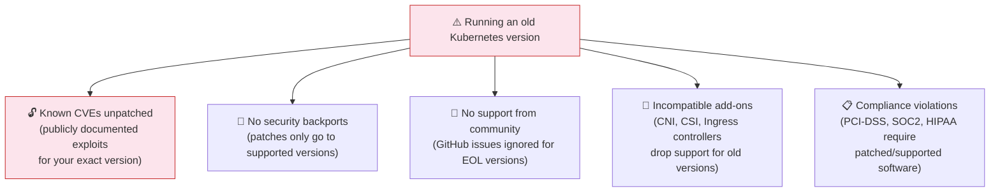

**Real examples of why version matters:**

| CVE | Affected Versions | Impact | Fixed In |
|:---|:---|:---|:---|
| CVE-2018-1002105 | ≤ 1.10.10, ≤ 1.11.4, ≤ 1.12.2 | Privilege escalation to cluster-admin | 1.10.11, 1.11.5, 1.12.3 |
| CVE-2019-11247 | ≤ 1.13.8, ≤ 1.14.4, ≤ 1.15.1 | Cluster-scoped resource access | 1.13.9, 1.14.5, 1.15.2 |
| CVE-2020-8559 | ≤ 1.16.12, ≤ 1.17.8, ≤ 1.18.5 | Node privilege escalation | 1.16.13, 1.17.9, 1.18.6 |

**Staying current = staying secure.**

---

## 📐 Component Version Skew Rules

Not all Kubernetes components need to run the same version simultaneously. Kubernetes defines a **version skew policy** — the maximum version difference allowed between components. This enables **live upgrades** without taking the whole cluster offline.


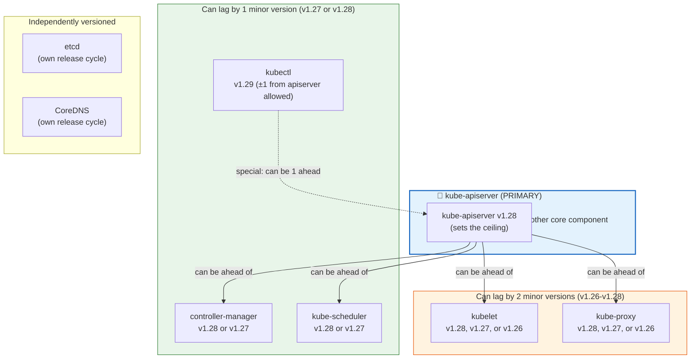

### The Version Skew Table

| Component | Maximum Lag Behind kube-apiserver | Can Exceed kube-apiserver? |
|:---|:---:|:---:|
| **kube-apiserver** | N/A (the ceiling) | N/A |
| **controller-manager** | 1 minor version | ❌ Never |
| **kube-scheduler** | 1 minor version | ❌ Never |
| **kubelet** | 2 minor versions | ❌ Never |
| **kube-proxy** | 2 minor versions | ❌ Never |
| **kubectl** | 1 minor version | ✅ Yes — 1 minor version ahead |

### Why This Skew Is Allowed

The skew policy enables a safe **rolling upgrade sequence**:

```
1. Upgrade kube-apiserver first (it must always be highest or equal)
2. Upgrade controller-manager and kube-scheduler (still within skew)
3. Upgrade kubelets on worker nodes one at a time (within 2-version skew)
4. Upgrade kube-proxy (matches kubelet version)
```

At every step of this process, all components remain within their allowed skew — the cluster stays functional throughout.

---

## ⏰ Kubernetes Support Window — When to Upgrade

Kubernetes supports only the **three most recent minor versions** at any given time. Once a version falls outside this window, it receives no security patches.


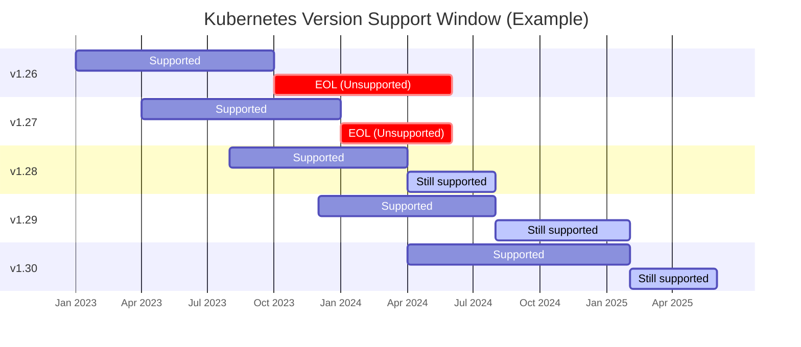

**The rule:** At any time, three minor versions are supported. When a new version releases, the oldest drops out.

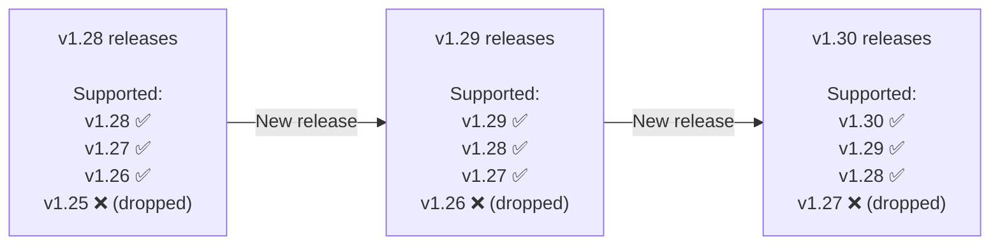

> **Action trigger:** When a new Kubernetes minor version releases and your current version becomes the oldest of the three supported, plan your upgrade immediately. When the NEXT version releases, yours will be unsupported.

---

## 📏 The One-Minor-Version Rule

You **cannot skip minor versions** during an upgrade. If you're on v1.26 and want v1.29, you must go through three separate upgrade cycles:

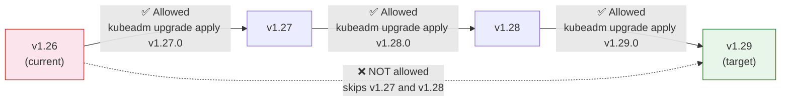

**Why?** Each minor version upgrade includes migration steps, API deprecations, and configuration changes that must be applied sequentially. Skipping versions risks leaving the cluster in an inconsistent, unsupported state.

---

## 📊 Upgrade Overview — The Two Phases

Every Kubernetes upgrade — regardless of the number of versions — follows the same two-phase structure:

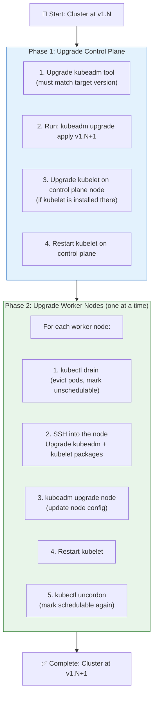

**What happens during Phase 1 (control plane upgrade):**

- kube-apiserver, controller-manager, kube-scheduler, kube-proxy all upgraded
- Brief downtime for management operations (kubectl commands pause)
- **Worker node workloads keep running** — pods are NOT affected
- Mixed-version state is normal and supported during this transition

---

## 🗂️ Worker Node Upgrade Strategies

There are three strategies for upgrading worker nodes. Each has different tradeoffs:

### Strategy 1 — Upgrade All Nodes Simultaneously


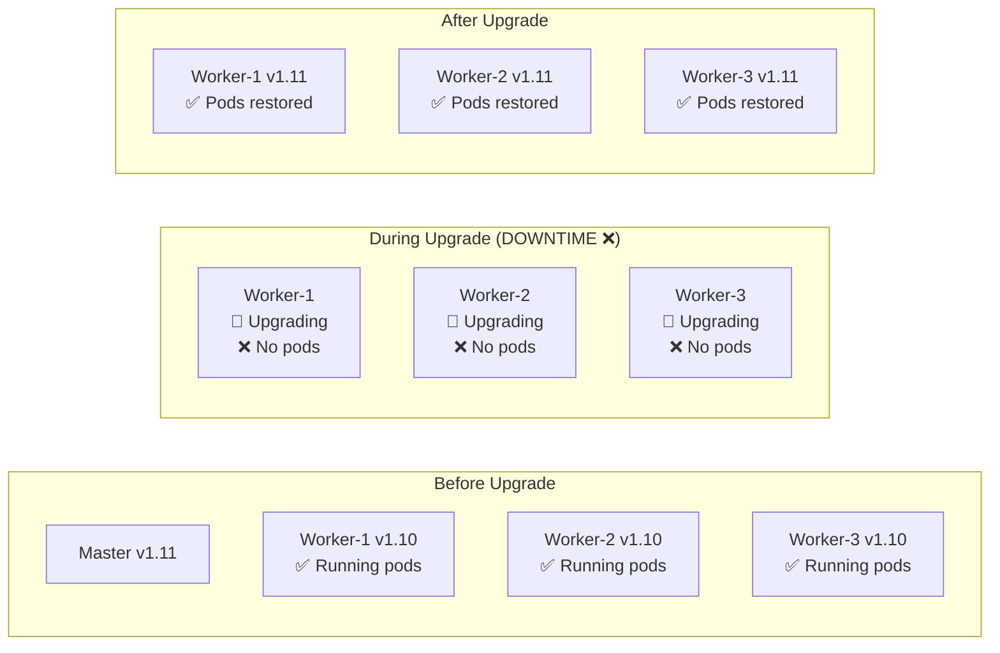

| | Strategy 1: All at Once |
|:---|:---|
| **Downtime** | ❌ Yes — all pods evicted during upgrade |
| **Speed** | ✅ Fastest total upgrade time |
| **Complexity** | ✅ Simplest to execute |
| **Best for** | Dev/test clusters; non-critical workloads |
| **Avoid for** | Production clusters with user traffic |

---

### Strategy 2 — Upgrade One Node at a Time (Rolling)


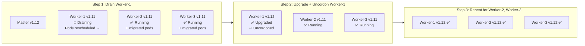

| | Strategy 2: One at a Time |
|:---|:---|
| **Downtime** | ✅ None — pods rescheduled to healthy nodes |
| **Speed** | ⚠️ Slower — sequential |
| **Complexity** | ⚠️ Moderate — drain/upgrade/uncordon per node |
| **Best for** | Production clusters; standard upgrade path |
| **Requirement** | Enough spare capacity to absorb rescheduled pods |

---

### Strategy 3 — Add New Nodes (Blue-Green / Rolling Replace)


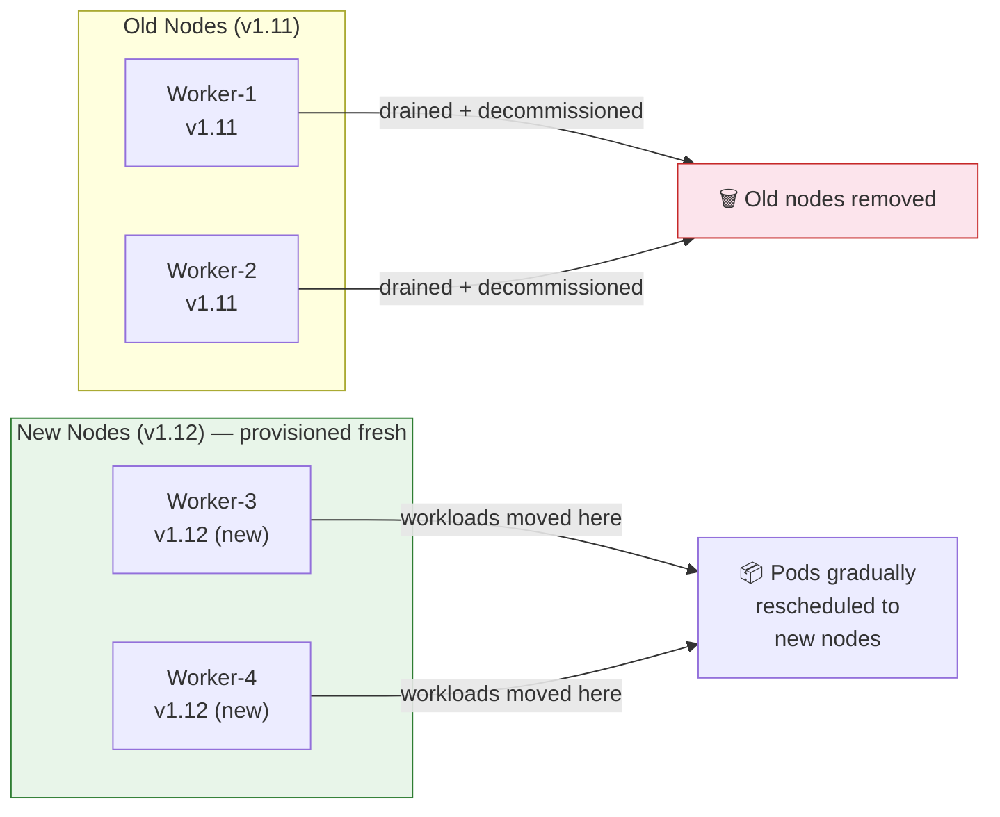

| | Strategy 3: New Nodes |
|:---|:---|
| **Downtime** | ✅ None |
| **Speed** | ✅ Fast if cloud-provisioned |
| **Complexity** | ⚠️ Higher — provision + drain old nodes |
| **Best for** | Cloud environments (AWS, GCP, Azure) with auto-scaling |
| **Cost** | ⚠️ Temporary extra cost (running both old and new nodes) |

---

## 🔧 Complete kubeadm Upgrade Walkthrough

### The Scenario

```
Current state:  v1.11 (master + 2 worker nodes)
Target:         v1.12 (one minor version at a time)
Method:         kubeadm
```

### Step 0 — Understand Your Current State

```bash
# Check current cluster version
kubectl get nodes
# NAME     STATUS   ROLES    AGE   VERSION
# master   Ready    master   1d    v1.11.3
# node-1   Ready    <none>   1d    v1.11.3
# node-2   Ready    <none>   1d    v1.11.3

# Check current kubeadm version
kubeadm version
# kubeadm version: &Version{GitVersion:v1.11.3,...}

# Run the upgrade plan BEFORE doing anything
kubeadm upgrade plan
```

**Understanding `kubeadm upgrade plan` output:**

```
[preflight] Running pre-flight checks.
[upgrade] Making sure the cluster is healthy:
[upgrade/config] Making sure the configuration is correct:
[upgrade] Fetching available versions to upgrade to

[upgrade/versions] Cluster version: v1.11.8          ← Current cluster
[upgrade/versions] kubeadm version: v1.11.3          ← Your kubeadm tool version
[upgrade/versions] Latest version in the v1.11 series: v1.11.8
                                                         ↑ Latest patch in current series

Components that must be upgraded manually after you have
upgraded the control plane with 'kubeadm upgrade apply':
COMPONENT   CURRENT      AVAILABLE
Kubelet     3 x v1.11.3  v1.13.4   ← kubelet is NOT auto-upgraded

Upgrade to the latest stable version:
COMPONENT           CURRENT   AVAILABLE
API Server          v1.11.8   v1.13.4   ← Available target
Controller Manager  v1.11.8   v1.13.4
Scheduler           v1.11.8   v1.13.4
Kube Proxy          v1.11.8   v1.13.4
CoreDNS             v1.1.3    v1.1.3    ← No upgrade needed
Etcd                3.2.18    N/A       ← etcd managed separately

You can now apply the upgrade by executing the following command:
  kubeadm upgrade apply v1.13.4   ← but we'll only go to v1.12.0!
```

> **Key insight:** `kubeadm upgrade plan` tells you **kubelet must be upgraded manually** on each node. kubeadm handles control plane components but not the kubelet.

---

## ⬆️ Phase 1 — Upgrade the Control Plane

### Step 1.1 — Upgrade kubeadm Itself

Before upgrading the cluster, you must upgrade the **kubeadm tool** to the target version. kubeadm cannot upgrade to a version higher than itself.

```bash
# Find available kubeadm versions
apt-cache madison kubeadm | head -5
# kubeadm | 1.12.0-00 | https://apt.kubernetes.io kubernetes-xenial/main amd64 Packages
# kubeadm | 1.11.8-00 | ...

# Upgrade kubeadm to target version (v1.12.0)
apt-get update
apt-get install -y kubeadm=1.12.0-00

# Verify the new kubeadm version
kubeadm version
# kubeadm version: &Version{GitVersion:v1.12.0,...}
```

> **Why upgrade kubeadm first?** kubeadm orchestrates the upgrade of all control plane components. It must be at the target version to know how to upgrade to that version.

### Step 1.2 — Run the Upgrade Plan Again

```bash
# Confirm kubeadm now shows v1.12 as available
kubeadm upgrade plan
# [upgrade/versions] Latest stable version: v1.12.x
# You can now apply the upgrade by executing: kubeadm upgrade apply v1.12.0
```

### Step 1.3 — Apply the Control Plane Upgrade

```bash
# Apply the upgrade to v1.12.0
kubeadm upgrade apply v1.12.0
```

**What `kubeadm upgrade apply` does:**

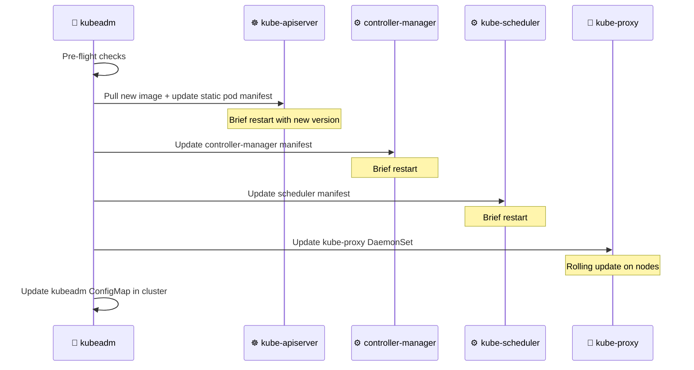

**Expected output:**

```
[upgrade/successful] SUCCESS! Your cluster was upgraded to "v1.12.0". Enjoy!
[upgrade/kubelet] Now that your control plane is upgraded, please proceed
with upgrading your kubelets if you haven't already done so.
```

### Step 1.4 — Check Node Status After Control Plane Upgrade

```bash
kubectl get nodes
# NAME     STATUS   ROLES    AGE   VERSION
# master   Ready    master   1d    v1.11.3  ← Still shows v1.11! Why?
# node-1   Ready    <none>   1d    v1.11.3
# node-2   Ready    <none>   1d    v1.11.3
```

> **Why does master still show v1.11?**  
> `kubectl get nodes` shows the **kubelet version**, not the kube-apiserver version. The control plane components (apiserver, controller-manager, scheduler) are now v1.12, but the **kubelet on the master** hasn't been upgraded yet. The kubelet reports its own version to `kubectl get nodes`.

### Step 1.5 — Upgrade the Kubelet on the Master Node

```bash
# Upgrade kubelet on the control plane node
apt-get upgrade -y kubelet=1.12.0-00

# Restart kubelet to apply the new version
systemctl daemon-reload
systemctl restart kubelet

# Verify
kubectl get nodes
# NAME     STATUS   ROLES    AGE   VERSION
# master   Ready    master   1d    v1.12.0  ← Now shows v1.12 ✅
# node-1   Ready    <none>   1d    v1.11.3  ← Workers still at v1.11 (OK — within skew)
# node-2   Ready    <none>   1d    v1.11.3
```

---

## ⬇️ Phase 2 — Upgrade Worker Nodes

Upgrade worker nodes **one at a time** to maintain application availability throughout. For each node:

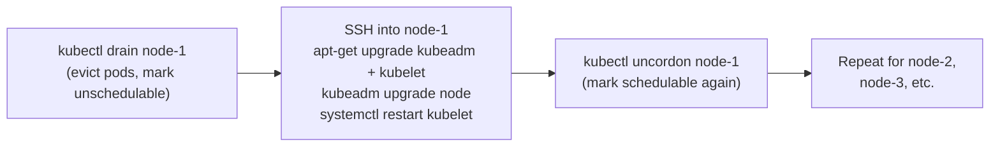

### Upgrading node-1

**Step 1 — Drain the node**

```bash
# From the control plane (master), drain node-1
kubectl drain node-1 --ignore-daemonsets

# What drain does:
# 1. Marks node-1 as "Unschedulable" (no new pods scheduled here)
# 2. Evicts all pods from node-1 (except DaemonSets)
# 3. Kubernetes reschedules those pods onto node-2 (still running)

# Expected output:
# node/node-1 cordoned
# evicting pod default/my-app-abc123
# pod/my-app-abc123 evicted
# node/node-1 drained ✅

# Verify node is cordoned (unschedulable)
kubectl get nodes
# NAME     STATUS                     ROLES    AGE   VERSION
# master   Ready                      master   1d    v1.12.0
# node-1   Ready,SchedulingDisabled   <none>   1d    v1.11.3  ← Cordoned
# node-2   Ready                      <none>   1d    v1.11.3
```

> **`--ignore-daemonsets` flag:** DaemonSets run one pod per node by design — they cannot be rescheduled elsewhere. This flag tells kubectl to evict all other pods but leave DaemonSet pods (like kube-proxy, Calico, Fluentd) — they'll be upgraded in place.

> **`--force` flag (use carefully):** If a pod is not managed by a controller (bare pod, no ReplicaSet/Deployment), drain fails by default because that pod would be **permanently lost**. Use `--force` only if you accept that risk.

**Step 2 — SSH into the node and upgrade packages**

```bash
# SSH into node-1
ssh node-1

# On node-1: Upgrade kubeadm first
apt-get update
apt-get install -y kubeadm=1.12.0-00

# Update the node's configuration (not the same as the control plane upgrade)
kubeadm upgrade node
# [upgrade] Reading configuration from the cluster...
# [upgrade] FYI: You can look at this config file with 'kubectl -n kube-system get cm kubeadm-config -o yaml'
# [kubelet-start] Writing kubelet configuration to file "/var/lib/kubelet/config.yaml"
# [upgrade] The configuration for this node was successfully updated!

# Upgrade kubelet
apt-get install -y kubelet=1.12.0-00

# Reload systemd and restart kubelet
systemctl daemon-reload
systemctl restart kubelet

# Exit back to the master
exit
```

**What `kubeadm upgrade node` does (on workers):**

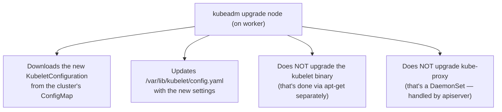

**Step 3 — Uncordon the node**

```bash
# Back on the master — mark node-1 as schedulable again
kubectl uncordon node-1

# Verify node-1 is back
kubectl get nodes
# NAME     STATUS   ROLES    AGE   VERSION
# master   Ready    master   1d    v1.12.0
# node-1   Ready    <none>   1d    v1.12.0  ← Upgraded and schedulable ✅
# node-2   Ready    <none>   1d    v1.11.3
```

### Upgrading node-2 (same pattern)

```bash
# From master
kubectl drain node-2 --ignore-daemonsets

# On node-2 (SSH)
apt-get install -y kubeadm=1.12.0-00
kubeadm upgrade node
apt-get install -y kubelet=1.12.0-00
systemctl daemon-reload
systemctl restart kubelet
exit

# From master
kubectl uncordon node-2
```

---

## ✅ Verifying the Upgrade

### Check All Nodes Are Upgraded

```bash
kubectl get nodes
# NAME     STATUS   ROLES    AGE   VERSION
# master   Ready    master   1d    v1.12.0  ✅
# node-1   Ready    <none>   1d    v1.12.0  ✅
# node-2   Ready    <none>   1d    v1.12.0  ✅
```

### Check Control Plane Component Versions

```bash
# Check control plane pod images
kubectl get pods -n kube-system

# Check specific component version
kubectl describe pod kube-apiserver-master -n kube-system | grep Image
# Image: k8s.gcr.io/kube-apiserver:v1.12.0 ✅

kubectl describe pod kube-controller-manager-master -n kube-system | grep Image
# Image: k8s.gcr.io/kube-controller-manager:v1.12.0 ✅

kubectl describe pod kube-scheduler-master -n kube-system | grep Image
# Image: k8s.gcr.io/kube-scheduler:v1.12.0 ✅
```

### Check Cluster Health

```bash
# All system pods should be Running
kubectl get pods -n kube-system
# All READY 1/1, STATUS Running ✅

# Check component health
kubectl get componentstatuses
# NAME                 STATUS    MESSAGE   ERROR
# controller-manager   Healthy   ok
# scheduler            Healthy   ok
# etcd-0               Healthy   {"health":"true"}

# Verify applications still running
kubectl get pods -A
# All user workloads should still be Running ✅
```

---

## 🏭 Real-World Scenarios

### Scenario 1 — Production Zero-Downtime Upgrade

**Setup:** E-commerce cluster, 5 worker nodes, 50 pods serving live traffic.

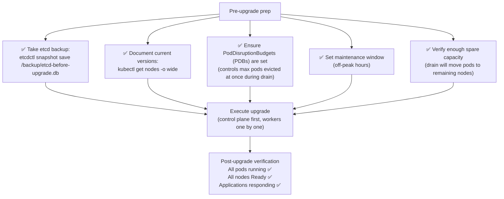

### Scenario 2 — Rollback If Something Goes Wrong

kubeadm does not have a built-in rollback command. The recovery process relies on:

```bash
# Option 1: Restore from etcd backup (taken before upgrade)
# This restores the cluster state to before the upgrade

# Take backup BEFORE any upgrade:
ETCDCTL_API=3 etcdctl snapshot save /backup/pre-upgrade-snapshot.db \
  --endpoints=https://127.0.0.1:2379 \
  --cacert=/etc/kubernetes/pki/etcd/ca.crt \
  --cert=/etc/kubernetes/pki/etcd/server.crt \
  --key=/etc/kubernetes/pki/etcd/server.key

# Verify backup
ETCDCTL_API=3 etcdctl snapshot status /backup/pre-upgrade-snapshot.db
# hash         revision  totalKeys  totalSize
# 4b68f4c4     1234      1234       4.2 MB

# Option 2: Downgrade packages (if upgrade failed early)
apt-get install -y kubelet=1.11.3-00 kubeadm=1.11.3-00
systemctl daemon-reload && systemctl restart kubelet
```

### Scenario 3 — Cloud (EKS/GKE/AKS) vs Self-Managed Upgrade

| Aspect | Managed (EKS/GKE/AKS) | Self-managed (kubeadm) |
|:---|:---|:---|
| **Control plane upgrade** | Click a button in console / `eksctl upgrade cluster` | `kubeadm upgrade apply v1.X.Y` |
| **Worker node upgrade** | Node group update / managed node rolling update | Manual drain + apt + uncordon |
| **etcd** | Managed by cloud provider | You manage it |
| **Downtime** | Near-zero (managed) | Depends on strategy chosen |
| **Rollback** | Provider-managed | Manual (etcd restore) |
| **Version skew** | Enforced by provider | Your responsibility |

```bash
# GKE upgrade (one command!)
gcloud container clusters upgrade my-cluster \
  --master \
  --cluster-version 1.28.0

# EKS upgrade
eksctl upgrade cluster \
  --name my-cluster \
  --version 1.28 \
  --approve

# AKS upgrade
az aks upgrade \
  --resource-group myRG \
  --name my-cluster \
  --kubernetes-version 1.28.0
```

---

## 📋 Commands Reference

### Planning

```bash
# View current cluster and node versions
kubectl get nodes
kubectl get nodes -o wide

# Check what upgrades are available
kubeadm upgrade plan

# Check available package versions (Debian/Ubuntu)
apt-cache madison kubeadm
apt-cache madison kubelet

# Check what would happen without doing it
kubeadm upgrade plan v1.12.0
```

### Upgrading kubeadm

```bash
# Unlock kubeadm (if held)
apt-mark unhold kubeadm

# Upgrade kubeadm
apt-get update
apt-get install -y kubeadm=1.12.0-00

# Lock kubeadm version again after upgrade
apt-mark hold kubeadm

# Verify
kubeadm version
```

### Upgrading Control Plane

```bash
# Run upgrade plan
kubeadm upgrade plan

# Apply the control plane upgrade (must specify exact version)
kubeadm upgrade apply v1.12.0

# Upgrade kubelet on control plane node
apt-get install -y kubelet=1.12.0-00
systemctl daemon-reload
systemctl restart kubelet

# Verify control plane is upgraded
kubectl get nodes
kubectl describe pod kube-apiserver-master -n kube-system | grep Image
```

### Upgrading Worker Nodes

```bash
# Drain (evict pods + cordon)
kubectl drain <node-name> --ignore-daemonsets
kubectl drain <node-name> --ignore-daemonsets --force    # For bare pods

# ON THE WORKER NODE (SSH):
apt-get update
apt-get install -y kubeadm=1.12.0-00
kubeadm upgrade node                                     # Worker-specific
apt-get install -y kubelet=1.12.0-00
systemctl daemon-reload
systemctl restart kubelet

# BACK ON THE MASTER:
kubectl uncordon <node-name>

# Verify node is back and upgraded
kubectl get nodes
```

### Verification

```bash
# All nodes status
kubectl get nodes

# Detailed node info (OS, kubelet version)
kubectl get nodes -o wide

# All system pods healthy
kubectl get pods -n kube-system

# Component health
kubectl get componentstatuses
# OR (newer):
kubectl get --raw '/healthz?verbose'

# API server version
kubectl version
# Client Version: v1.12.0
# Server Version: v1.12.0

# All workloads still running
kubectl get pods -A | grep -v Running
# Should be empty (all pods running)
```

### etcd Backup (Before Any Upgrade)

```bash
# Take snapshot before upgrading
ETCDCTL_API=3 etcdctl snapshot save /tmp/etcd-backup-$(date +%Y%m%d).db \
  --endpoints=https://127.0.0.1:2379 \
  --cacert=/etc/kubernetes/pki/etcd/ca.crt \
  --cert=/etc/kubernetes/pki/etcd/server.crt \
  --key=/etc/kubernetes/pki/etcd/server.key

# Verify snapshot
ETCDCTL_API=3 etcdctl snapshot status /tmp/etcd-backup-$(date +%Y%m%d).db \
  --write-out=table
```

---

## 🧩 Concepts at a Glance

| Concept | What It Is | Key Point |
|:---|:---|:---|
| **Version skew** | Allowed version difference between K8s components | apiserver is the ceiling; kubelet can lag 2 minor versions |
| **kube-apiserver** | The primary component | Must be ≥ all other core components |
| **3-version support window** | Kubernetes supports only 3 minor versions at once | Upgrade before your version falls out of this window |
| **One minor version at a time** | You cannot skip minor versions | v1.26 → v1.27 → v1.28, not v1.26 → v1.28 |
| **`kubeadm upgrade plan`** | Shows current version, available upgrades, component status | Always run this first — it's a dry run |
| **`kubeadm upgrade apply`** | Upgrades control plane components | Updates apiserver, controller-manager, scheduler, kube-proxy |
| **`kubeadm upgrade node`** | Updates a worker node's kubelet config | NOT the same as upgrading the kubelet binary |
| **`kubectl drain`** | Evicts pods + marks node as unschedulable | Required before upgrading a worker node |
| **`kubectl uncordon`** | Marks node as schedulable again | Required after worker node upgrade |
| **`--ignore-daemonsets`** | Drain flag to skip DaemonSet pods | Always use this — DaemonSets can't be rescheduled |
| **`--force`** | Drain flag to evict bare pods | Use carefully — bare pods are NOT recreated |
| **Control plane downtime** | apiserver/CM/scheduler briefly restart | Worker pods keep running; kubectl commands pause |
| **Mixed-version state** | Master at v1.12, workers at v1.11 | Normal and supported during rolling upgrade |
| **Strategy 1** | All nodes at once | Causes downtime; use only for dev |
| **Strategy 2** | One node at a time (rolling) | Zero downtime; standard production approach |
| **Strategy 3** | Add new nodes | Zero downtime; best for cloud environments |
| **kubelet not auto-upgraded** | kubeadm does not upgrade kubelet | Must be done manually with apt-get per node |
| **apt-mark hold/unhold** | Pin a package version | Use to prevent accidental upgrades |
| **etcd backup** | Snapshot before upgrade | Your rollback mechanism — always take before upgrading |

---

### The Complete Upgrade Flow

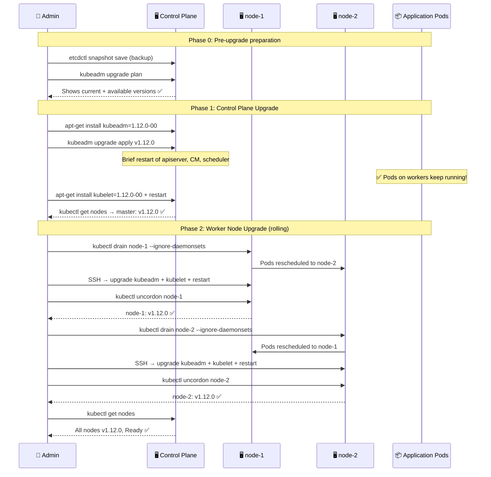

---

*Part of the [Certified Kubernetes Security Specialist (CKS)](../CKS.md) study series.*  
*Previous: [Chapter 12 — Verify Platform Binaries](./12%20--%20Verify%20platform%20binaries.md) | Next: [Chapter 14 — Network Policies](./14%20--%20Network%20Policies.md)*
