# 14 — Network Policy

> **CKS Domain:** Cluster Setup & Hardening  
> **Weight:** High — frequently tested with multi-rule and multi-selector scenarios  
> **TL;DR:** Kubernetes pods can talk to everyone by default. Network Policies let you enforce a **zero-trust, least-privilege** traffic model at the pod level.

---

## Table of Contents

1. [Why Network Policies Matter](#1-why-network-policies-matter)
2. [Ingress vs Egress — The Core Concept](#2-ingress-vs-egress--the-core-concept)
3. [Kubernetes Default: Allow All](#3-kubernetes-default-allow-all)
4. [Network Policy Basics](#4-network-policy-basics)
5. [Network Policy YAML — Deep Dive](#5-network-policy-yaml--deep-dive)
6. [Selectors: podSelector, namespaceSelector, ipBlock](#6-selectors-podselector-namespaceselector-ipblock)
7. [Combining Selectors (AND vs OR Logic)](#7-combining-selectors-and-vs-or-logic)
8. [Egress Network Policies](#8-egress-network-policies)
9. [CNI Plugin Support](#9-cni-plugin-support)
10. [Common Mistakes & Gotchas](#10-common-mistakes--gotchas)
11. [Real-World Scenarios](#11-real-world-scenarios)
12. [Concepts at a Glance](#12-concepts-at-a-glance)
13. [Commands Reference](#13-commands-reference)

---

## 1. Why Network Policies Matter

By default, every pod in a Kubernetes cluster can reach every other pod — across namespaces, across nodes, with zero restrictions. This is great for getting started, but catastrophic for production security.

### The Blast Radius Problem

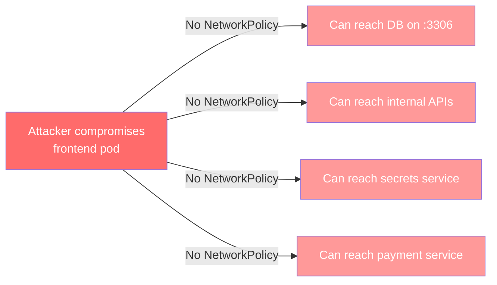

With Network Policies:

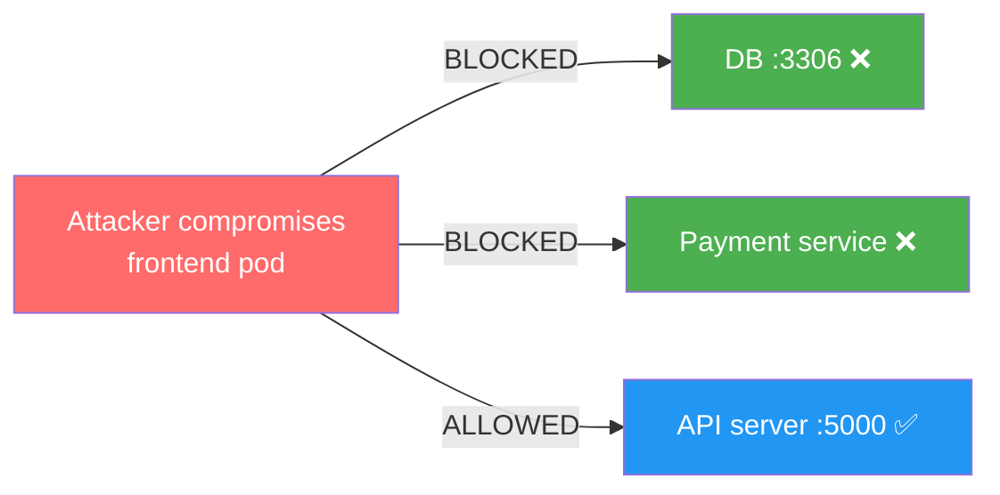

### Security Principles Enforced by Network Policies

| Principle | What it means | How NetworkPolicy helps |
|-----------|--------------|------------------------|
| **Least Privilege** | Only allow what's needed | Explicit allowlist per pod |
| **Zero Trust** | Trust nothing by default | Default-deny baseline |
| **Segmentation** | Isolate blast radius | Namespace + label boundaries |
| **Defense in Depth** | Multiple security layers | Works alongside RBAC, mTLS |

---

## 2. Ingress vs Egress — The Core Concept

Before writing any YAML, you must internalize what "ingress" and "egress" mean **from the pod's perspective**.

> 🔑 **Key Rule:** Ingress/egress is always defined **from the perspective of the pod the policy applies to**. Response traffic is automatically allowed — you never need to write a rule for it.

### The 3-Tier App Example


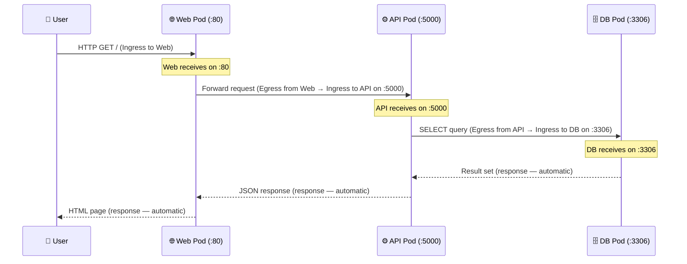

### Traffic Rules Per Component


| Component | Direction | Port | From/To | Rule Needed? |
|-----------|-----------|------|---------|--------------|
| **Web Pod** | Ingress | 80 | From Internet/Users | ✅ Yes |
| **Web Pod** | Egress | 5000 | To API Pod | ✅ Yes |
| **API Pod** | Ingress | 5000 | From Web Pod | ✅ Yes |
| **API Pod** | Egress | 3306 | To DB Pod | ✅ Yes |
| **DB Pod** | Ingress | 3306 | From API Pod | ✅ Yes |
| **DB Pod** | Egress | — | Initiates nothing | ❌ Not needed |
| Any Pod | Response | any | Reverse of above | ❌ Automatic |

> 💡 **Response traffic is always automatic.** If you allow ingress on port 3306, the DB can send the query results back without any egress rule. You only write rules for *initiated* connections.

---

## 3. Kubernetes Default: Allow All

When no Network Policy exists in a namespace, Kubernetes applies an implicit **Allow All** rule.


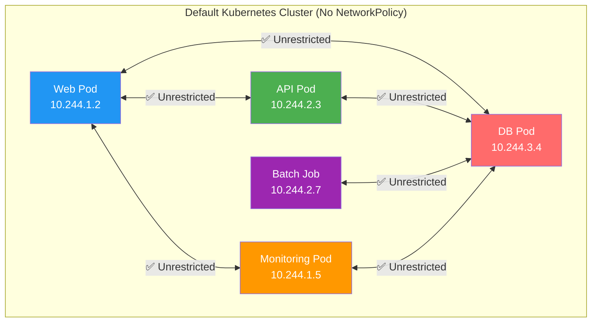

**The problem:** The batch job and monitoring pod can reach the DB directly. There's nothing stopping a compromised frontend from accessing production secrets.

### How Network Policies Change This

Once **any** Network Policy selects a pod:
- That pod becomes **isolated for the traffic types listed** in `policyTypes`
- All other traffic of that type is **denied by default**
- Only traffic matching the explicit rules is **allowed**

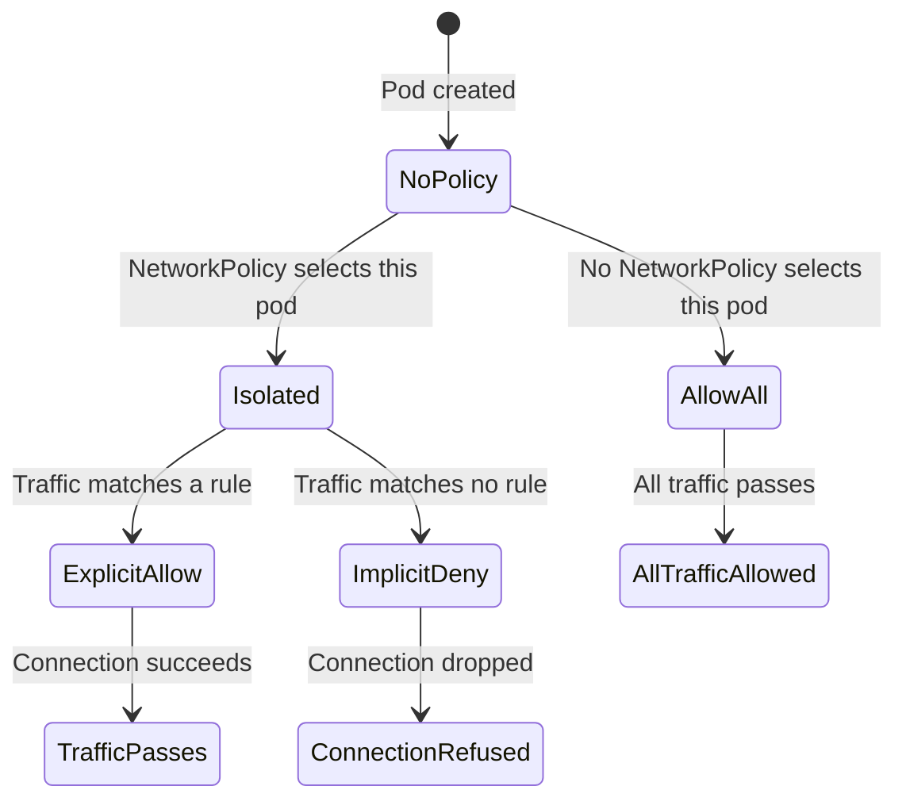

---

## 4. Network Policy Basics

### What is a Network Policy?

A `NetworkPolicy` is a Kubernetes API object (`networking.k8s.io/v1`) that acts as a **firewall rule set** for pods. It:

- Uses **label selectors** to target pods (just like Services and ReplicaSets)
- Defines **ingress rules** (who can reach the pod)
- Defines **egress rules** (where the pod can connect to)
- Is **namespace-scoped** — it lives in a namespace and applies to pods in that namespace

### The DB Pod Use Case


**Goal:** Only the API pod should be able to reach the DB pod on port 3306. The web pod must be blocked.

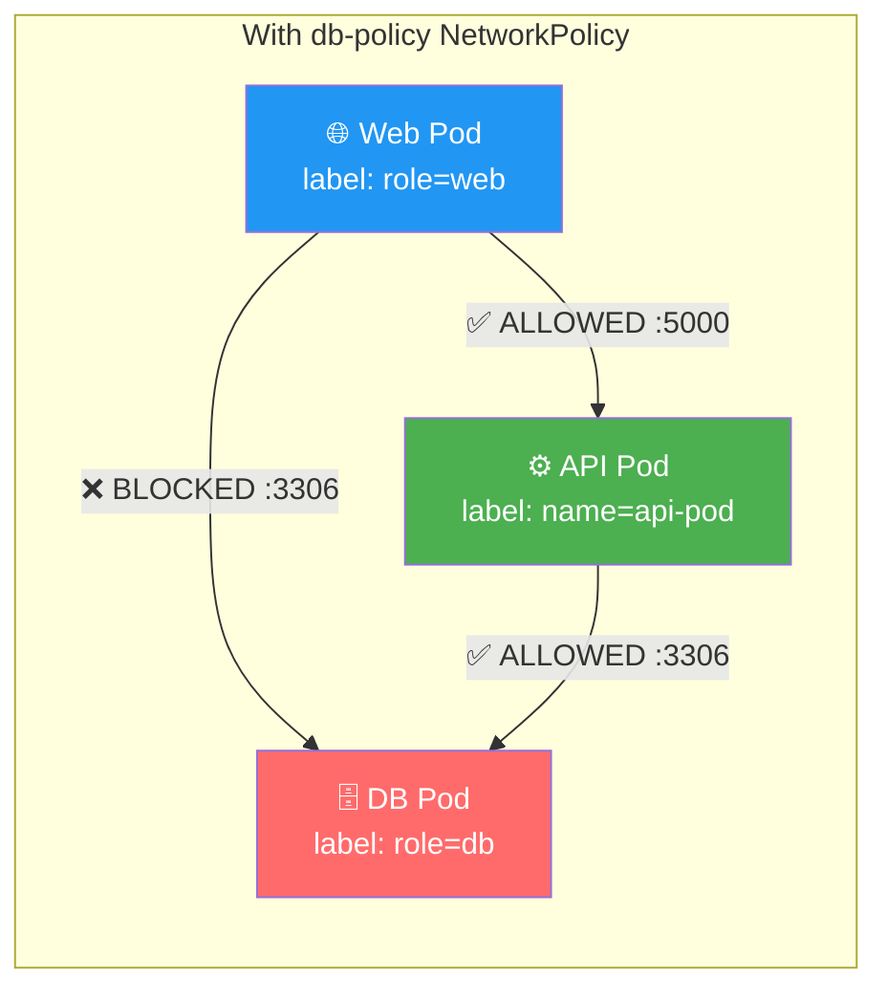

---

## 5. Network Policy YAML — Deep Dive

### Minimal DB Protection Policy

```yaml
apiVersion: networking.k8s.io/v1
kind: NetworkPolicy
metadata:
  name: db-policy
  namespace: default          # Policy lives in this namespace
spec:
  podSelector:                # ① WHICH pods does this policy apply to?
    matchLabels:
      role: db                #   → Pods with label role=db
  policyTypes:                # ② WHICH traffic directions are being controlled?
  - Ingress                   #   → We're restricting incoming traffic
                              #   (Egress not listed = egress is unrestricted)
  ingress:                    # ③ WHAT traffic is ALLOWED in?
  - from:                     #   → Source specification
    - podSelector:            #   → Allow from pods with this label...
        matchLabels:
          name: api-pod       #   → ...specifically: name=api-pod
    ports:
    - protocol: TCP
      port: 3306              #   → ...on port 3306 only
```

### Field-by-Field Explanation

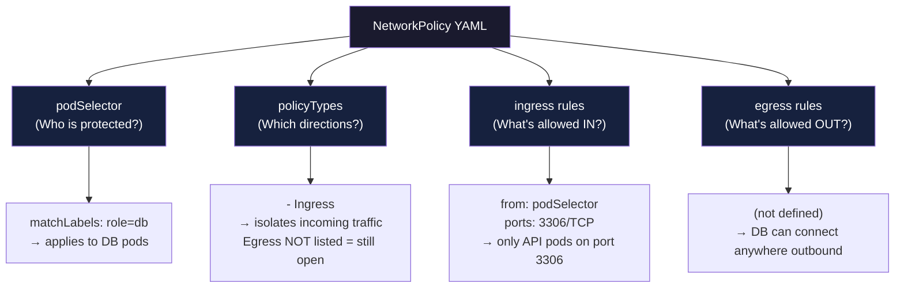

### policyTypes Behaviour Table

| `policyTypes` value | Ingress behaviour | Egress behaviour |
|---------------------|-------------------|-----------------|
| `[]` (omitted) | Allow all | Allow all |
| `[Ingress]` | **Isolated** — only explicit rules | Allow all |
| `[Egress]` | Allow all | **Isolated** — only explicit rules |
| `[Ingress, Egress]` | **Isolated** | **Isolated** |

> ⚠️ **Critical:** If `policyTypes: [Ingress]` is set but the `ingress:` section is **empty** (or omitted), ALL ingress is **denied**. This is the default-deny pattern.

### Default Deny All Pattern (CKS Exam Favourite)

```yaml
# Deny ALL ingress to pods in this namespace
apiVersion: networking.k8s.io/v1
kind: NetworkPolicy
metadata:
  name: default-deny-ingress
  namespace: production
spec:
  podSelector: {}       # {} = matches ALL pods in the namespace
  policyTypes:
  - Ingress
  # No ingress: section = deny everything
```

```yaml
# Deny ALL egress from pods in this namespace
apiVersion: networking.k8s.io/v1
kind: NetworkPolicy
metadata:
  name: default-deny-egress
  namespace: production
spec:
  podSelector: {}
  policyTypes:
  - Egress
  # No egress: section = deny everything
```

```yaml
# Deny ALL traffic in both directions
apiVersion: networking.k8s.io/v1
kind: NetworkPolicy
metadata:
  name: default-deny-all
  namespace: production
spec:
  podSelector: {}
  policyTypes:
  - Ingress
  - Egress
```

---

## 6. Selectors: podSelector, namespaceSelector, ipBlock

Network Policies support three types of sources/destinations in `from` (ingress) and `to` (egress) blocks:

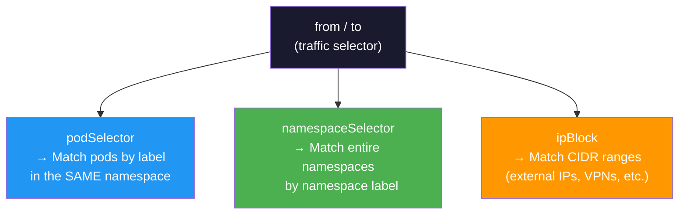

### podSelector

Matches pods **within the same namespace** as the NetworkPolicy:

```yaml
ingress:
- from:
  - podSelector:
      matchLabels:
        name: api-pod        # Only pods labeled name=api-pod (same namespace)
  ports:
  - protocol: TCP
    port: 3306
```

### namespaceSelector

Matches **all pods in any namespace** that has the given label:

```yaml
ingress:
- from:
  - namespaceSelector:
      matchLabels:
        kubernetes.io/metadata.name: monitoring   # Built-in namespace name label
  ports:
  - protocol: TCP
    port: 9090
```

> 💡 **Label your namespaces!** By default, namespaces don't have labels. Add them with:
> ```bash
> kubectl label namespace monitoring kubernetes.io/metadata.name=monitoring
> # or custom labels:
> kubectl label namespace prod env=production
> ```

### podSelector + namespaceSelector (AND logic within one rule)

When **both** selectors appear in the **same list item** (under the same `-`), they are combined with **AND**:

```yaml
ingress:
- from:
  - podSelector:            # ┐ BOTH must match (AND)
      matchLabels:          # │
        name: api-pod       # │
    namespaceSelector:      # │ Pod must be api-pod AND be in prod namespace
      matchLabels:          # ┘
        env: prod
```

### ipBlock

For traffic from/to external IP ranges (outside the cluster):

```yaml
ingress:
- from:
  - ipBlock:
      cidr: 172.17.0.0/16          # Allow this entire subnet
      except:
      - 172.17.1.0/24              # ...but exclude this range
```

```yaml
egress:
- to:
  - ipBlock:
      cidr: 0.0.0.0/0             # Allow all outbound internet
      except:
      - 10.0.0.0/8                # ...but block internal private range
      - 192.168.0.0/16
      - 172.16.0.0/12
```

### All Three Selectors Together

```yaml
apiVersion: networking.k8s.io/v1
kind: NetworkPolicy
metadata:
  name: complex-policy
  namespace: production
spec:
  podSelector:
    matchLabels:
      role: db
  policyTypes:
  - Ingress
  ingress:
  - from:
    - podSelector:               # Rule 1: api pods in same namespace
        matchLabels:
          name: api-pod
    - namespaceSelector:         # Rule 2: anything in monitoring namespace
        matchLabels:
          env: monitoring
    - ipBlock:                   # Rule 3: office VPN
        cidr: 203.0.113.0/24
    ports:
    - protocol: TCP
      port: 3306
```

---

## 7. Combining Selectors (AND vs OR Logic)

This is the **most misunderstood** part of Network Policies and a CKS trap.

### OR Logic (separate list items with `-`)

Each `-` in the `from` list is a **separate rule** — any one matching is enough (**OR**):

```yaml
ingress:
- from:
  - podSelector:          # Rule A: api-pod in same namespace
      matchLabels:
        name: api-pod
  - namespaceSelector:    # OR Rule B: anything in prod namespace
      matchLabels:
        env: prod
```

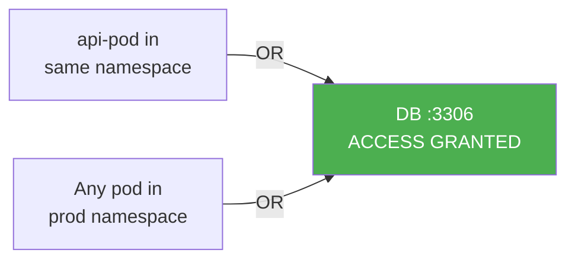

### AND Logic (selectors on the same list item, no `-`)

```yaml
ingress:
- from:
  - podSelector:          # AND: pod must BOTH be api-pod...
      matchLabels:
        name: api-pod
    namespaceSelector:    # ...AND be in prod namespace (no dash = same item)
      matchLabels:
        env: prod
```

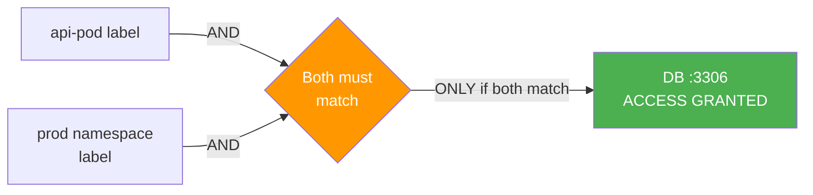

### Visual Diff Table

| YAML Structure | Logic | Who gets access |
|----------------|-------|-----------------|
| Two `-` entries | **OR** | Pod A **or** pods in namespace B |
| One entry, two selectors | **AND** | Pod A that is **also** in namespace B |

### Common Trap Example

```yaml
# ❌ WRONG: This allows ALL pods in prod namespace (not just api-pod in prod)
ingress:
- from:
  - podSelector:
      matchLabels:
        name: api-pod
  - namespaceSelector:      # This is a SEPARATE rule (OR)
      matchLabels:
        env: prod

# ✅ CORRECT: Only api-pod that lives in prod namespace
ingress:
- from:
  - podSelector:
      matchLabels:
        name: api-pod
    namespaceSelector:      # Same list item (AND) — no dash before this
      matchLabels:
        env: prod
```

---

## 8. Egress Network Policies

Egress controls outbound traffic **from** the protected pod. Use cases:
- Prevent pods from calling external internet
- Restrict which internal services a pod can reach
- Block DNS exfiltration

### API Pod with Restricted Egress

```yaml
apiVersion: networking.k8s.io/v1
kind: NetworkPolicy
metadata:
  name: api-policy
  namespace: default
spec:
  podSelector:
    matchLabels:
      name: api-pod
  policyTypes:
  - Ingress
  - Egress
  ingress:
  - from:
    - podSelector:
        matchLabels:
          role: web
    ports:
    - protocol: TCP
      port: 5000
  egress:
  - to:
    - podSelector:
        matchLabels:
          role: db
    ports:
    - protocol: TCP
      port: 3306
  - to:                         # Must allow DNS! (or name resolution breaks)
    ports:
    - protocol: UDP
      port: 53
    - protocol: TCP
      port: 53
```

> ⚠️ **DNS Gotcha!** If you restrict egress, **always add a rule for port 53 (DNS)**. Without it, pods can't resolve service names and will fail with DNS errors even if the destination IP is allowed.

### Complete Secured 3-Tier Architecture

```yaml
# --- Policy 1: DB Pod (only receives from API) ---
apiVersion: networking.k8s.io/v1
kind: NetworkPolicy
metadata:
  name: db-policy
spec:
  podSelector:
    matchLabels:
      role: db
  policyTypes:
  - Ingress
  ingress:
  - from:
    - podSelector:
        matchLabels:
          name: api-pod
    ports:
    - protocol: TCP
      port: 3306
---
# --- Policy 2: API Pod (receives from Web, sends to DB) ---
apiVersion: networking.k8s.io/v1
kind: NetworkPolicy
metadata:
  name: api-policy
spec:
  podSelector:
    matchLabels:
      name: api-pod
  policyTypes:
  - Ingress
  - Egress
  ingress:
  - from:
    - podSelector:
        matchLabels:
          role: web
    ports:
    - protocol: TCP
      port: 5000
  egress:
  - to:
    - podSelector:
        matchLabels:
          role: db
    ports:
    - protocol: TCP
      port: 3306
  - to:
    ports:
    - protocol: UDP
      port: 53
---
# --- Policy 3: Web Pod (receives from internet, sends to API) ---
apiVersion: networking.k8s.io/v1
kind: NetworkPolicy
metadata:
  name: web-policy
spec:
  podSelector:
    matchLabels:
      role: web
  policyTypes:
  - Ingress
  - Egress
  ingress:
  - from: []            # Allow from anywhere (internet users)
    ports:
    - protocol: TCP
      port: 80
  egress:
  - to:
    - podSelector:
        matchLabels:
          name: api-pod
    ports:
    - protocol: TCP
      port: 5000
  - to:
    ports:
    - protocol: UDP
      port: 53
```

---

## 9. CNI Plugin Support

Network Policies are **defined in the Kubernetes API** but **enforced by the CNI plugin** (Container Network Interface). If your CNI doesn't support NetworkPolicy, the objects will be created without error — but they will do **nothing**.


### CNI Support Matrix

| CNI Plugin | NetworkPolicy Support | Notes |
|------------|----------------------|-------|
| **Calico** | ✅ Full | Most popular for NetworkPolicy; also supports GlobalNetworkPolicy |
| **Weave Net** | ✅ Full | Good default for small clusters |
| **Kube-router** | ✅ Full | Uses iptables under the hood |
| **Romana** | ✅ Full | Less commonly used today |
| **Cilium** | ✅ Full + extended | Supports L7 (HTTP path/method) policies; uses eBPF |
| **Antrea** | ✅ Full | VMware-backed; also supports ClusterNetworkPolicy |
| **Canal** | ✅ Full | Flannel + Calico NetworkPolicy combined |
| **Flannel** | ❌ None | Only provides connectivity; no policy enforcement |
| **kubenet** | ❌ None | Bare minimum; no NetworkPolicy |

> ⚠️ **Exam Tip:** The question "which CNI does NOT support NetworkPolicy?" → **Flannel**. This is a classic CKS question.

### How CNI Enforces Policies

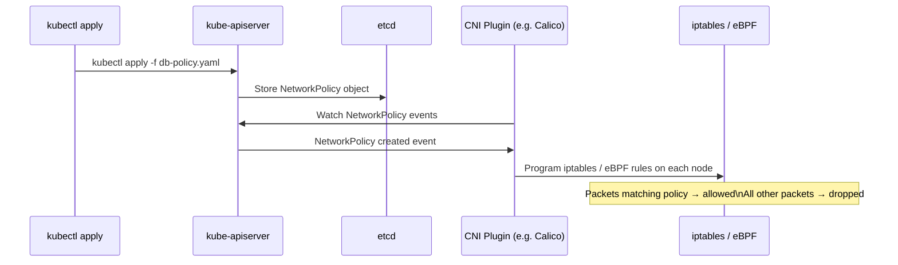

---

## 10. Common Mistakes & Gotchas

### Mistake 1: Forgetting policyTypes

```yaml
# ❌ WRONG: policyTypes omitted — ingress rules are IGNORED!
spec:
  podSelector:
    matchLabels:
      role: db
  ingress:
  - from:
    - podSelector:
        matchLabels:
          name: api-pod

# ✅ CORRECT: policyTypes explicitly declared
spec:
  podSelector:
    matchLabels:
      role: db
  policyTypes:
  - Ingress
  ingress:
  - from:
    - podSelector:
        matchLabels:
          name: api-pod
```

### Mistake 2: AND vs OR Selector Confusion

Already covered in §7 — use a dash (`-`) for OR, no dash for AND.

### Mistake 3: Forgetting DNS Egress Rule

```yaml
# ❌ WRONG: This breaks DNS resolution for the pod
egress:
- to:
  - podSelector:
      matchLabels:
        role: db
  ports:
  - protocol: TCP
    port: 3306

# ✅ CORRECT: Include DNS
egress:
- to:
  - podSelector:
      matchLabels:
        role: db
  ports:
  - protocol: TCP
    port: 3306
- to:                     # Allow DNS
  ports:
  - protocol: UDP
    port: 53
  - protocol: TCP
    port: 53
```

### Mistake 4: Cross-Namespace Traffic Without namespaceSelector

```yaml
# ❌ WRONG: api-pod is in 'backend' namespace; policy is in 'data' namespace
#           podSelector alone only matches pods in the SAME namespace
ingress:
- from:
  - podSelector:
      matchLabels:
        name: api-pod       # Only matches api-pod in 'data' namespace, not 'backend'!

# ✅ CORRECT: Add namespaceSelector
ingress:
- from:
  - podSelector:
      matchLabels:
        name: api-pod
    namespaceSelector:
      matchLabels:
        kubernetes.io/metadata.name: backend
```

### Mistake 5: Unlabelled Namespaces

```bash
# Check if namespaces have labels
kubectl get namespace --show-labels

# If not labelled, namespaceSelector won't match!
kubectl label namespace backend kubernetes.io/metadata.name=backend
```

### Mistake 6: Policies Don't Stack — They UNION

Multiple NetworkPolicies selecting the same pod are combined with **OR (union)**:

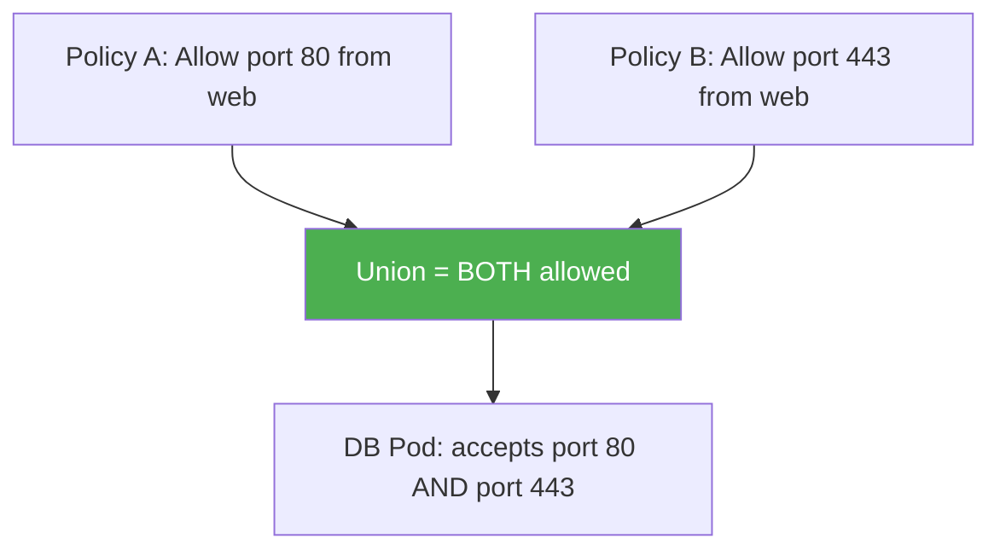

There is no "deny" rule in a NetworkPolicy — everything is additive. To deny, you rely on the **implicit deny** (nothing allowed unless explicitly listed).

---

## 11. Real-World Scenarios

### Scenario 1: Multi-Tier E-Commerce Application

**Setup:** frontend → order-api → payment-service → postgres DB

```yaml
# Payment service can only be called by order-api
apiVersion: networking.k8s.io/v1
kind: NetworkPolicy
metadata:
  name: payment-isolation
  namespace: ecommerce
spec:
  podSelector:
    matchLabels:
      app: payment-service
  policyTypes:
  - Ingress
  - Egress
  ingress:
  - from:
    - podSelector:
        matchLabels:
          app: order-api
    ports:
    - protocol: TCP
      port: 8080
  egress:
  - to:
    - podSelector:
        matchLabels:
          app: postgres
    ports:
    - protocol: TCP
      port: 5432
  - to:
    ports:
    - protocol: UDP
      port: 53
```

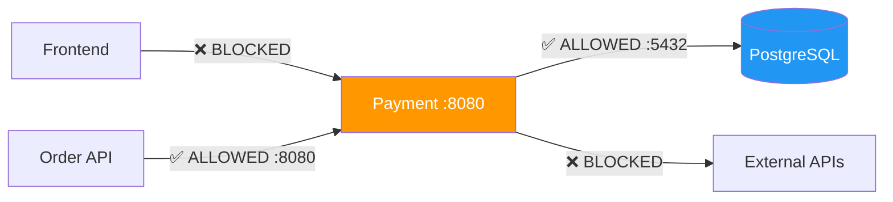

### Scenario 2: Monitoring Namespace Access

**Goal:** Prometheus in `monitoring` namespace can scrape metrics from all app pods, but app pods can't initiate connections to Prometheus.

```yaml
apiVersion: networking.k8s.io/v1
kind: NetworkPolicy
metadata:
  name: allow-prometheus-scrape
  namespace: production         # Applied in production namespace
spec:
  podSelector: {}               # All pods in production
  policyTypes:
  - Ingress
  ingress:
  - from:
    - namespaceSelector:
        matchLabels:
          kubernetes.io/metadata.name: monitoring
      podSelector:
        matchLabels:
          app: prometheus
    ports:
    - protocol: TCP
      port: 9090
    - protocol: TCP
      port: 8080
```

### Scenario 3: Namespace Isolation (Multi-Tenant)

**Goal:** Team A's namespace (`team-a`) and Team B's namespace (`team-b`) are completely isolated from each other, but both can access shared services in `shared` namespace.

```yaml
# Deny all cross-namespace traffic within team-a
apiVersion: networking.k8s.io/v1
kind: NetworkPolicy
metadata:
  name: deny-from-other-namespaces
  namespace: team-a
spec:
  podSelector: {}
  policyTypes:
  - Ingress
  ingress:
  - from:
    - podSelector: {}           # Only from pods in the SAME namespace (team-a)
---
# Allow team-a to access shared services
apiVersion: networking.k8s.io/v1
kind: NetworkPolicy
metadata:
  name: allow-shared-services
  namespace: shared
spec:
  podSelector: {}
  policyTypes:
  - Ingress
  ingress:
  - from:
    - namespaceSelector:
        matchLabels:
          team: team-a
    - namespaceSelector:
        matchLabels:
          team: team-b
```

### Scenario 4: CKS Exam Pattern — Verify Policy Works

After applying a NetworkPolicy, always verify with a test pod:

```bash
# Test that web can reach API (should succeed)
kubectl run test-web --image=busybox --rm -it \
  --labels="role=web" \
  -- wget -qO- http://api-service:5000/health

# Test that web CANNOT reach DB (should fail/timeout)
kubectl run test-web --image=busybox --rm -it \
  --labels="role=web" \
  -- nc -zv db-service 3306
# Expected: nc: db-service (10.x.x.x:3306): Connection refused or timeout

# Test that API CAN reach DB (should succeed)
kubectl run test-api --image=busybox --rm -it \
  --labels="name=api-pod" \
  -- nc -zv db-service 3306
# Expected: open
```

---

## 12. Concepts at a Glance

| Concept | Definition |
|---------|-----------|
| **NetworkPolicy** | Kubernetes object that controls pod-to-pod traffic using labels |
| **Ingress (policy)** | Rules for traffic **entering** the selected pod |
| **Egress (policy)** | Rules for traffic **leaving** the selected pod |
| **podSelector** | Selects which pods the policy applies to |
| **policyTypes** | Declares which traffic directions are being isolated |
| **from / to** | Sources (ingress) or destinations (egress) allowed |
| **namespaceSelector** | Matches pods in namespaces with specific labels |
| **ipBlock** | Matches IP CIDR ranges (external/internal) |
| **Default deny** | `podSelector: {}` with empty ingress/egress blocks = deny all |
| **CNI** | Container Network Interface — the plugin that **enforces** policies |
| **Flannel** | CNI that does NOT support NetworkPolicy enforcement |
| **Calico** | CNI with the richest NetworkPolicy support |
| **AND selector** | Two selectors in the same `-` list item (both must match) |
| **OR selector** | Two selectors in separate `-` list items (either can match) |
| **DNS port 53** | Must be explicitly allowed in egress-restricted pods |
| **Policy union** | Multiple policies on same pod = additive (no deny rules) |
| **Response traffic** | Automatically allowed — never needs an explicit rule |
| **Implicit deny** | If a pod is selected by a policy, unlisted traffic is dropped |

---

## 13. Commands Reference

### Apply & Inspect

```bash
# Apply a network policy
kubectl apply -f db-policy.yaml

# List all network policies in a namespace
kubectl get networkpolicy -n <namespace>
kubectl get netpol -n <namespace>           # Short alias

# Describe a policy (see selectors and rules)
kubectl describe networkpolicy db-policy -n <namespace>

# Get policy in YAML
kubectl get networkpolicy db-policy -o yaml

# Delete a policy
kubectl delete networkpolicy db-policy
```

### Label Management

```bash
# Label a namespace for namespaceSelector matching
kubectl label namespace monitoring kubernetes.io/metadata.name=monitoring
kubectl label namespace production env=production

# Verify namespace labels
kubectl get namespace --show-labels

# Label a pod (if not done via deployment)
kubectl label pod my-pod role=db
```

### Testing Connectivity

```bash
# Test TCP connectivity from inside a pod
kubectl exec -it <pod-name> -- nc -zv <target-service> <port>

# Test HTTP connectivity
kubectl exec -it <pod-name> -- wget -qO- http://<service>:<port>/

# Run a temporary test pod with specific labels
kubectl run test \
  --image=busybox \
  --labels="name=api-pod" \
  --rm -it \
  -- nc -zv db-service 3306

# Nmap scan from within cluster (if available)
kubectl run nmap --image=instrumentisto/nmap --rm -it \
  -- nmap -p 3306 <db-pod-ip>
```

### Debugging Network Policies

```bash
# Check if CNI supports NetworkPolicy (look for plugin name)
kubectl get pods -n kube-system | grep -E 'calico|weave|flannel|cilium'

# Check Calico node status (if using Calico)
kubectl get pods -n kube-system -l k8s-app=calico-node

# List all policies across all namespaces
kubectl get networkpolicy --all-namespaces

# Check if a pod has any NetworkPolicy selecting it
kubectl get networkpolicy -o json | jq '.items[] | select(.spec.podSelector.matchLabels.role=="db")'

# Quick connectivity test matrix
for target in web-service api-service db-service; do
  echo -n "Testing $target: "
  kubectl exec -it test-pod -- nc -zv $target 80 2>&1 | grep -E "open|refused|timed"
done
```

### Complete Default-Deny + Allow Setup

```bash
# Step 1: Label namespace
kubectl label namespace production env=production

# Step 2: Apply default deny all
kubectl apply -f - <<EOF
apiVersion: networking.k8s.io/v1
kind: NetworkPolicy
metadata:
  name: default-deny-all
  namespace: production
spec:
  podSelector: {}
  policyTypes:
  - Ingress
  - Egress
EOF

# Step 3: Apply specific allow rules
kubectl apply -f db-policy.yaml
kubectl apply -f api-policy.yaml
kubectl apply -f web-policy.yaml

# Step 4: Verify
kubectl get networkpolicy -n production
kubectl describe networkpolicy -n production
```

---

> 📝 **CKS Exam Checklist — Network Policies**
> - [ ] Know the difference between AND and OR selector syntax
> - [ ] Remember to add `policyTypes` — without it, rules don't apply
> - [ ] Add DNS (port 53) egress rule when restricting egress
> - [ ] Know Flannel doesn't support NetworkPolicy
> - [ ] Understand `podSelector: {}` = all pods in namespace
> - [ ] Know how to verify a policy works with `nc` or `wget` from a test pod
> - [ ] Label namespaces before using `namespaceSelector`
> - [ ] Default-deny + selective allow is the gold standard pattern
