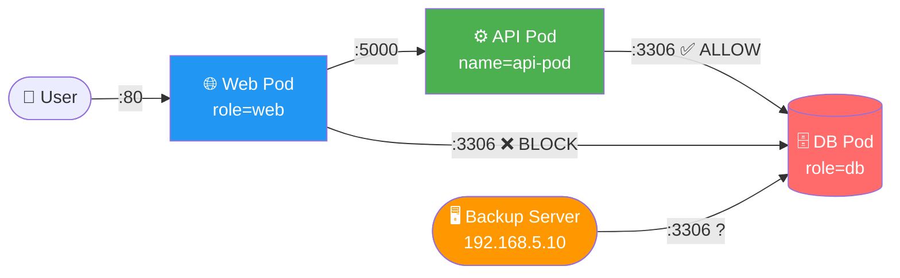
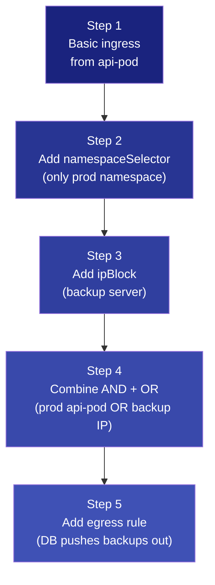
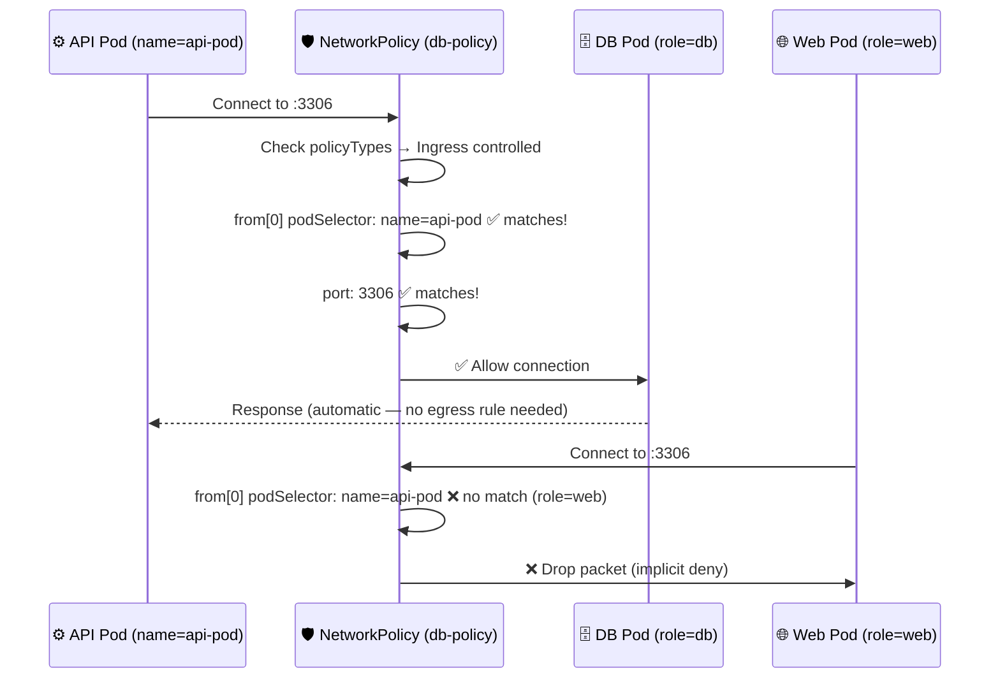
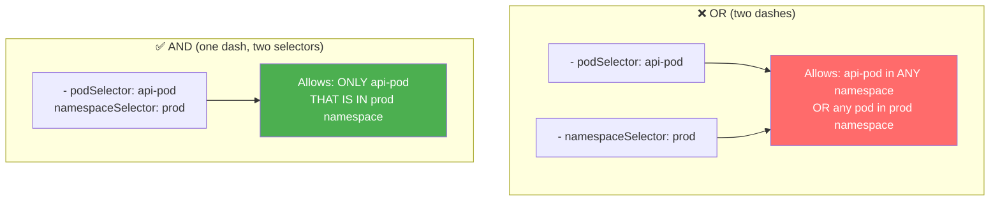
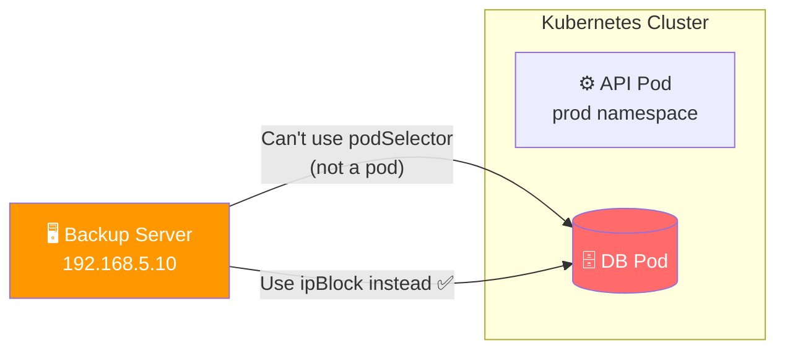
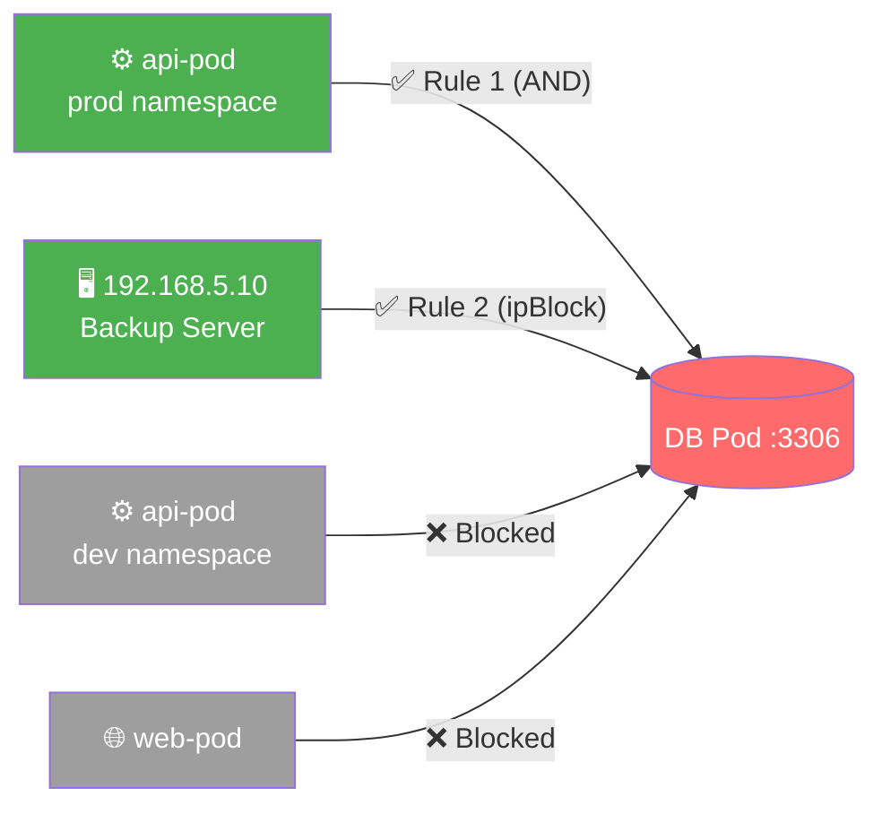
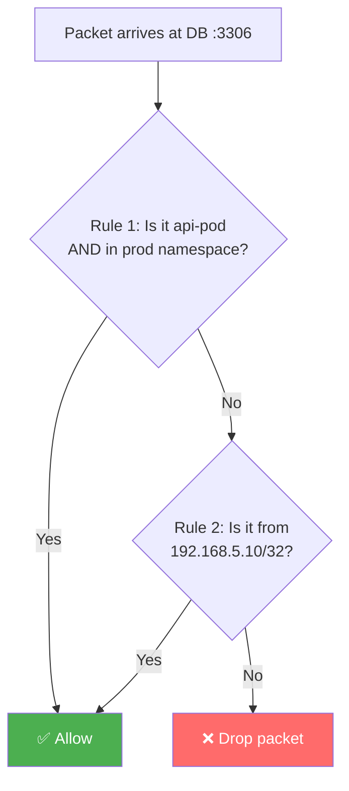
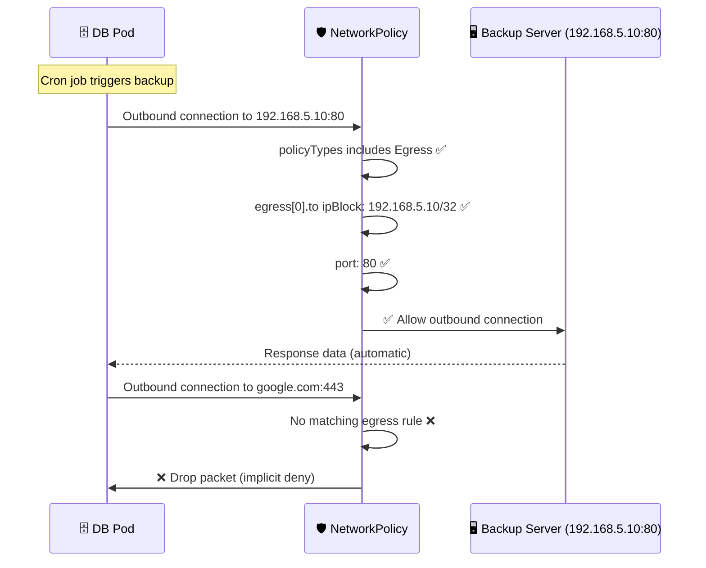
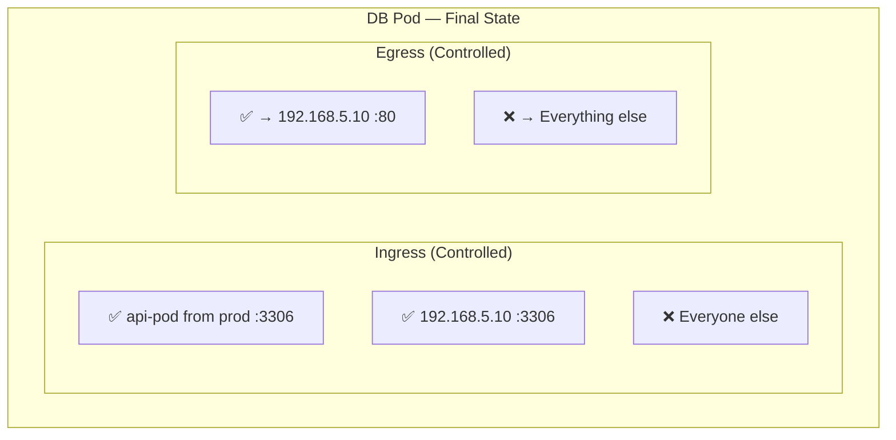
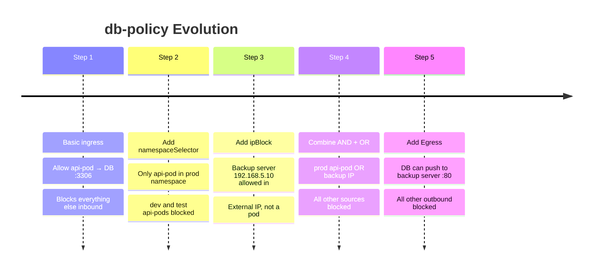

# 14.1 — Developing Network Policies

> **CKS Domain:** Cluster Setup & Hardening  
> **Weight:** High — lab-heavy topic; expect to write and debug NetworkPolicy YAML under exam conditions  
> **TL;DR:** Build network policies incrementally — start with the pod you're protecting, then add ingress/egress rules one selector at a time.

---

## Table of Contents

1. [The Scenario](#1-the-scenario)
2. [Step 1 — Basic Ingress-Only Policy](#2-step-1--basic-ingress-only-policy)
3. [Step 2 — Adding a Namespace Selector](#3-step-2--adding-a-namespace-selector)
4. [Step 3 — Allowing an External IP (ipBlock)](#4-step-3--allowing-an-external-ip-ipblock)
5. [Step 4 — Combining All Rules (AND + OR)](#5-step-4--combining-all-rules-and--or)
6. [Step 5 — Adding Egress Rules](#6-step-5--adding-egress-rules)
7. [Policy Evolution Summary](#7-policy-evolution-summary)
8. [Debugging Policies](#8-debugging-policies)
9. [Real-World Scenarios](#9-real-world-scenarios)
10. [Concepts at a Glance](#10-concepts-at-a-glance)
11. [Commands Reference](#11-commands-reference)

---

## 1. The Scenario

We have a classic 3-tier application with one hard requirement: **the database pod must only accept connections from the API pod on port 3306**. The web pod is free to communicate as needed and is out of scope for this policy.



**Pod labels in play:**

| Pod | Label | Namespace |
|-----|-------|-----------|
| Web Pod | `role: web` | default |
| API Pod | `name: api-pod` | prod |
| DB Pod | `role: db` | default |
| Backup Server | N/A (external IP) | `192.168.5.10/32` |

**What we'll build step by step:**



---

## 2. Step 1 — Basic Ingress-Only Policy

### Goal

Block all ingress to the DB pod, then explicitly allow only the API pod on port 3306.

### The YAML

```yaml
apiVersion: networking.k8s.io/v1
kind: NetworkPolicy
metadata:
  name: db-policy
  namespace: default          # DB pod lives here
spec:
  podSelector:                # ① Target: DB pod
    matchLabels:
      role: db
  policyTypes:
  - Ingress                   # ② Isolate incoming traffic only
  ingress:
  - from:
    - podSelector:            # ③ Allow from: api-pod
        matchLabels:
          name: api-pod
    ports:
    - protocol: TCP
      port: 3306              # ④ On this port only
```

### How it works — annotated flow



### What changes for the DB pod

| Traffic direction | Before policy | After policy |
|------------------|--------------|-------------|
| Ingress from api-pod :3306 | ✅ Allowed (default) | ✅ Allowed (explicit rule) |
| Ingress from web-pod :3306 | ✅ Allowed (default) | ❌ **Blocked** (implicit deny) |
| Ingress from anything else | ✅ Allowed (default) | ❌ **Blocked** (implicit deny) |
| Egress from DB pod | ✅ Allowed | ✅ **Still allowed** (policyTypes has no Egress) |

> 💡 **Egress is untouched.** Because `Egress` is not listed in `policyTypes`, the DB pod can still initiate outbound connections freely. Only ingress is now controlled.

> 💡 **Responses are automatic.** The API pod receives its query results back from the DB without any egress rule on the DB. The kernel tracks connection state and permits replies.

---

## 3. Step 2 — Adding a Namespace Selector

### The Problem

You have three namespaces: `dev`, `test`, and `prod`. Each has its own `api-pod`. The current policy (Step 1) allows **all three** api-pods to reach the DB, because `podSelector` alone only matches the **label** — it doesn't care which namespace the pod is in.

```mermaid
graph LR
    subgraph dev
        AP_DEV["api-pod\n(dev)"]
    end
    subgraph test
        AP_TEST["api-pod\n(test)"]
    end
    subgraph prod
        AP_PROD["api-pod\n(prod)"]
    end
    subgraph default
        DB[(DB Pod\nrole=db)]
    end

    AP_DEV  -->|"Step 1: ✅ (unintended!)"| DB
    AP_TEST -->|"Step 1: ✅ (unintended!)"| DB
    AP_PROD -->|"Step 1: ✅ (intended)"| DB

    style DB fill:#ff6b6b,color:#fff
    style AP_PROD fill:#4caf50,color:#fff
    style AP_DEV fill:#ff9800,color:#fff
    style AP_TEST fill:#ff9800,color:#fff
```

### The Fix — AND Logic with namespaceSelector

Add `namespaceSelector` **within the same list item** (no dash) as `podSelector`. This creates an **AND** condition: the pod must satisfy **both** selectors.

```yaml
apiVersion: networking.k8s.io/v1
kind: NetworkPolicy
metadata:
  name: db-policy
  namespace: default
spec:
  podSelector:
    matchLabels:
      role: db
  policyTypes:
  - Ingress
  ingress:
  - from:
    - podSelector:            # ┐ AND — both must be true
        matchLabels:          # │
          name: api-pod       # │ Pod label must match
      namespaceSelector:      # │ (NO dash = same list item = AND)
        matchLabels:          # │
          name: prod          # ┘ Namespace label must match
    ports:
    - protocol: TCP
      port: 3306
```

### Before Applying — Label Your Namespace!

```bash
# Namespaces don't have custom labels by default
kubectl get namespace prod --show-labels
# NAME   STATUS   AGE   LABELS
# prod   Active   5d    <none>

# Add the label that the namespaceSelector will match
kubectl label namespace prod name=prod

# Verify
kubectl get namespace prod --show-labels
# NAME   STATUS   AGE   LABELS
# prod   Active   5d    name=prod
```

### After Step 2 — Access Matrix

| Source | Namespace label | Pod label | Access |
|--------|----------------|-----------|--------|
| api-pod | `name=prod` | `name=api-pod` | ✅ Allowed |
| api-pod | `name=dev` | `name=api-pod` | ❌ Blocked |
| api-pod | `name=test` | `name=api-pod` | ❌ Blocked |
| web-pod | `name=prod` | `role=web` | ❌ Blocked |
| anything | any | any | ❌ Blocked |

### ⚠️ The OR Trap — Wrong YAML

One of the most common CKS mistakes. Adding a dash before `namespaceSelector` makes it a **separate rule (OR)**:

```yaml
# ❌ WRONG — OR logic (two separate list items)
ingress:
- from:
  - podSelector:              # Rule A: any api-pod in same namespace
      matchLabels:
        name: api-pod
  - namespaceSelector:        # ← dash here = new rule = OR
      matchLabels:
        name: prod            # Rule B: ANY pod in prod namespace

# This allows:
# - All api-pods regardless of namespace (Rule A)
# - ALL pods in prod namespace, even if not api-pod (Rule B)
```

```yaml
# ✅ CORRECT — AND logic (same list item, no dash before namespaceSelector)
ingress:
- from:
  - podSelector:              # ┐ Both must be true
      matchLabels:            # │
        name: api-pod         # │ Must be api-pod
    namespaceSelector:        # │ AND must be in prod namespace
      matchLabels:            # │
        name: prod            # ┘
```



---

## 4. Step 3 — Allowing an External IP (ipBlock)

### The Problem

A backup server at `192.168.5.10` lives **outside** the Kubernetes cluster. Pod selectors and namespace selectors only work for traffic originating inside the cluster. For external sources, you need `ipBlock`.



### The YAML — ipBlock Only

```yaml
apiVersion: networking.k8s.io/v1
kind: NetworkPolicy
metadata:
  name: db-policy
  namespace: default
spec:
  podSelector:
    matchLabels:
      role: db
  policyTypes:
  - Ingress
  ingress:
  - from:
    - ipBlock:
        cidr: 192.168.5.10/32   # Exact IP — /32 = single host
    ports:
    - protocol: TCP
      port: 3306
```

### ipBlock CIDR Reference

| CIDR | What it matches |
|------|----------------|
| `192.168.5.10/32` | Single IP: `192.168.5.10` |
| `192.168.5.0/24` | All 256 IPs in `192.168.5.x` |
| `10.0.0.0/8` | Entire `10.x.x.x` private range |
| `0.0.0.0/0` | All IPv4 addresses |

### Using `except` to Carve Out Exclusions

```yaml
ingress:
- from:
  - ipBlock:
      cidr: 192.168.0.0/16     # Allow entire 192.168.x.x range
      except:
      - 192.168.1.0/24         # ...except this subnet (untrusted VLAN)
      - 192.168.2.50/32        # ...and this specific IP
```

> ⚠️ **except ranges must be sub-ranges of the cidr.** You can't exclude an IP that wasn't included in the first place.

---

## 5. Step 4 — Combining All Rules (AND + OR)

Now we want both the prod api-pod **and** the backup server to reach the DB — but no one else.



### The YAML — Combined Policy

```yaml
apiVersion: networking.k8s.io/v1
kind: NetworkPolicy
metadata:
  name: db-policy
  namespace: default
spec:
  podSelector:
    matchLabels:
      role: db
  policyTypes:
  - Ingress
  ingress:
  - from:
    - podSelector:            # ┐ Rule 1 (AND): api-pod in prod namespace
        matchLabels:          # │
          name: api-pod       # │
      namespaceSelector:      # │ (no dash = AND)
        matchLabels:          # │
          name: prod          # ┘
    - ipBlock:                # Rule 2 (OR): backup server (dash = new rule = OR)
        cidr: 192.168.5.10/32
    ports:
    - protocol: TCP
      port: 3306
```

### Rule Evaluation Logic



### Complete Access Matrix After Step 4

| Source | Namespace | Matches Rule 1? | Matches Rule 2? | Access |
|--------|-----------|-----------------|-----------------|--------|
| api-pod | prod | ✅ Yes | ❌ No | ✅ Allowed |
| api-pod | dev | ❌ No | ❌ No | ❌ Blocked |
| api-pod | test | ❌ No | ❌ No | ❌ Blocked |
| web-pod | default | ❌ No | ❌ No | ❌ Blocked |
| 192.168.5.10 | external | ❌ N/A | ✅ Yes | ✅ Allowed |
| 192.168.5.11 | external | ❌ N/A | ❌ No | ❌ Blocked |
| Any other pod | any | ❌ No | ❌ No | ❌ Blocked |

---

## 6. Step 5 — Adding Egress Rules

### The New Requirement

The DB pod now needs to **push backups** to the external backup server (`192.168.5.10`) on port 80. This means the DB pod **initiates** the connection — that's egress traffic from the DB's perspective.



### The Complete Policy — Ingress + Egress

```yaml
apiVersion: networking.k8s.io/v1
kind: NetworkPolicy
metadata:
  name: db-policy
  namespace: default
spec:
  podSelector:
    matchLabels:
      role: db
  policyTypes:
  - Ingress
  - Egress                    # ← Added to control outbound traffic
  ingress:
  - from:
    - podSelector:            # AND: api-pod in prod namespace
        matchLabels:
          name: api-pod
      namespaceSelector:
        matchLabels:
          name: prod
    - ipBlock:                # OR: backup server
        cidr: 192.168.5.10/32
    ports:
    - protocol: TCP
      port: 3306
  egress:                     # ← New section
  - to:
    - ipBlock:
        cidr: 192.168.5.10/32 # Only to backup server
    ports:
    - protocol: TCP
      port: 80                # On port 80 (backup transfer)
```

### Before and After — DB Pod Traffic Summary



| Direction | Destination/Source | Port | Result |
|-----------|-------------------|------|--------|
| **Ingress** | api-pod (prod namespace) | 3306 | ✅ Allowed |
| **Ingress** | 192.168.5.10 | 3306 | ✅ Allowed |
| **Ingress** | api-pod (dev/test namespace) | 3306 | ❌ Blocked |
| **Ingress** | Web pod / anything else | any | ❌ Blocked |
| **Egress** | 192.168.5.10 | 80 | ✅ Allowed |
| **Egress** | Anywhere else | any | ❌ Blocked |

> ⚠️ **Note on DNS:** If the DB pod uses any hostname in its backup configuration (e.g., `backup-server.example.com`), you would also need to add a DNS egress rule:
> ```yaml
> egress:
> - to:
>   - ipBlock:
>       cidr: 192.168.5.10/32
>   ports:
>   - protocol: TCP
>     port: 80
> - to:                         # Add DNS rule if hostname resolution needed
>   ports:
>   - protocol: UDP
>     port: 53
>   - protocol: TCP
>     port: 53
> ```

---

## 7. Policy Evolution Summary

Here's the full progression from no policy to a complete bidirectional policy:



### All Versions Side by Side

```yaml
# ═══════════════════════════════════════════
# VERSION 1 — Ingress from api-pod only
# ═══════════════════════════════════════════
spec:
  podSelector:
    matchLabels: { role: db }
  policyTypes: [Ingress]
  ingress:
  - from:
    - podSelector:
        matchLabels: { name: api-pod }
    ports:
    - { protocol: TCP, port: 3306 }

---
# ═══════════════════════════════════════════
# VERSION 2 — Add namespace restriction (AND)
# ═══════════════════════════════════════════
spec:
  podSelector:
    matchLabels: { role: db }
  policyTypes: [Ingress]
  ingress:
  - from:
    - podSelector:
        matchLabels: { name: api-pod }
      namespaceSelector:             # Same item = AND
        matchLabels: { name: prod }
    ports:
    - { protocol: TCP, port: 3306 }

---
# ═══════════════════════════════════════════
# VERSION 3 — ipBlock only
# ═══════════════════════════════════════════
spec:
  podSelector:
    matchLabels: { role: db }
  policyTypes: [Ingress]
  ingress:
  - from:
    - ipBlock:
        cidr: 192.168.5.10/32
    ports:
    - { protocol: TCP, port: 3306 }

---
# ═══════════════════════════════════════════
# VERSION 4 — Combined: prod api-pod OR backup IP
# ═══════════════════════════════════════════
spec:
  podSelector:
    matchLabels: { role: db }
  policyTypes: [Ingress]
  ingress:
  - from:
    - podSelector:
        matchLabels: { name: api-pod }
      namespaceSelector:
        matchLabels: { name: prod }
    - ipBlock:
        cidr: 192.168.5.10/32
    ports:
    - { protocol: TCP, port: 3306 }

---
# ═══════════════════════════════════════════
# VERSION 5 — Full: Ingress + Egress (FINAL)
# ═══════════════════════════════════════════
spec:
  podSelector:
    matchLabels: { role: db }
  policyTypes: [Ingress, Egress]
  ingress:
  - from:
    - podSelector:
        matchLabels: { name: api-pod }
      namespaceSelector:
        matchLabels: { name: prod }
    - ipBlock:
        cidr: 192.168.5.10/32
    ports:
    - { protocol: TCP, port: 3306 }
  egress:
  - to:
    - ipBlock:
        cidr: 192.168.5.10/32
    ports:
    - { protocol: TCP, port: 80 }
```

---

## 8. Debugging Policies

### Step-by-Step Verification Workflow

```bash
# 1. Confirm the policy was created
kubectl get networkpolicy -n default
# NAME        POD-SELECTOR   AGE
# db-policy   role=db        30s

# 2. Inspect the policy details
kubectl describe networkpolicy db-policy -n default
# Gives a human-readable view of selectors and rules

# 3. Check the DB pod has the correct label
kubectl get pod db-pod --show-labels
# NAME     READY   STATUS    LABELS
# db-pod   1/1     Running   role=db

# 4. Check the prod namespace has the correct label
kubectl get namespace prod --show-labels
# NAME   LABELS
# prod   name=prod

# 5. Test that api-pod (prod) CAN reach DB
kubectl exec -n prod api-pod -- nc -zv db-service.default.svc.cluster.local 3306
# Connection to db-service.default.svc.cluster.local 3306 port [tcp/mysql] succeeded!

# 6. Test that api-pod (dev) CANNOT reach DB
kubectl exec -n dev api-pod -- nc -zv db-service.default.svc.cluster.local 3306
# nc: connect to db-service.default.svc.cluster.local port 3306 (tcp) timed out

# 7. Test DB egress to backup server
kubectl exec -n default db-pod -- nc -zv 192.168.5.10 80
# Connection to 192.168.5.10 80 port [tcp/http] succeeded!
```

### Run a Temporary Test Pod with Specific Labels

```bash
# Simulate api-pod in prod namespace
kubectl run test \
  --image=busybox \
  --labels="name=api-pod" \
  --namespace=prod \
  --rm -it \
  -- nc -zv db-service.default.svc.cluster.local 3306

# Simulate an unauthorized pod
kubectl run intruder \
  --image=busybox \
  --labels="role=web" \
  --namespace=default \
  --rm -it \
  -- nc -zv db-service 3306
# Should time out or be refused
```

### Common Symptoms & Fixes

| Symptom | Likely Cause | Fix |
|---------|-------------|-----|
| All traffic blocked (even allowed sources) | Namespace label missing | `kubectl label namespace prod name=prod` |
| Dev api-pod still reaches DB | OR instead of AND logic | Remove dash before `namespaceSelector` |
| Policy created but not enforced | CNI doesn't support NetworkPolicy | Switch to Calico, Weave, or Cilium |
| DB can't resolve backup hostname | DNS egress missing | Add port 53 UDP/TCP egress rule |
| `kubectl describe` shows correct rules but traffic blocked | Pod doesn't have expected label | `kubectl get pod --show-labels` to verify |
| New pods not covered by policy | Pod label missing | Ensure deployment template has correct labels |

### Verify CNI is Enforcing

```bash
# Calico
kubectl get pods -n kube-system -l k8s-app=calico-node
kubectl get pods -n kube-system -l k8s-app=calico-policy-controller

# Weave
kubectl get pods -n kube-system -l name=weave-net

# Cilium
kubectl get pods -n kube-system -l k8s-app=cilium

# Flannel (doesn't support NetworkPolicy!)
kubectl get pods -n kube-system -l app=flannel
# If this returns pods → NetworkPolicy won't work!
```

---

## 9. Real-World Scenarios

### Scenario A: Multi-Environment Namespace Isolation

You have three namespaces for the same app: `dev`, `staging`, `prod`. Each has an `api-pod`. The production DB should only accept traffic from the `prod` api-pod.

```yaml
apiVersion: networking.k8s.io/v1
kind: NetworkPolicy
metadata:
  name: prod-db-isolation
  namespace: prod
spec:
  podSelector:
    matchLabels:
      role: db
  policyTypes:
  - Ingress
  ingress:
  - from:
    - podSelector:
        matchLabels:
          name: api-pod
      namespaceSelector:
        matchLabels:
          env: prod           # Label your prod namespace: kubectl label ns prod env=prod
    ports:
    - protocol: TCP
      port: 5432             # PostgreSQL
```

```bash
# Setup
kubectl label namespace prod env=prod
kubectl label namespace staging env=staging
kubectl label namespace dev env=dev

# Verification
kubectl exec -n prod api-pod -- pg_isready -h db-service -p 5432   # Should pass
kubectl exec -n staging api-pod -- pg_isready -h prod-db-service -p 5432  # Should fail
```

### Scenario B: Database with Multiple Allowed Sources

A MySQL DB accepts traffic from:
- The backend API pod (same namespace)
- A DBA workstation (`10.100.50.25/32`)
- An on-prem monitoring system (`172.16.8.0/24`)

```yaml
apiVersion: networking.k8s.io/v1
kind: NetworkPolicy
metadata:
  name: mysql-access
  namespace: production
spec:
  podSelector:
    matchLabels:
      app: mysql
  policyTypes:
  - Ingress
  ingress:
  - from:
    - podSelector:              # Backend API pod (same namespace)
        matchLabels:
          app: backend-api
    - ipBlock:                  # DBA workstation
        cidr: 10.100.50.25/32
    - ipBlock:                  # On-prem monitoring subnet
        cidr: 172.16.8.0/24
    ports:
    - protocol: TCP
      port: 3306
```

### Scenario C: Egress Control — Pod Can Only Call Specific External APIs

A payment processing pod must only communicate with the payment gateway (`api.stripe.com` → `54.187.174.169`):

```yaml
apiVersion: networking.k8s.io/v1
kind: NetworkPolicy
metadata:
  name: payment-egress
  namespace: production
spec:
  podSelector:
    matchLabels:
      app: payment-processor
  policyTypes:
  - Egress
  egress:
  - to:
    - ipBlock:
        cidr: 54.187.174.169/32    # Stripe API IP
    ports:
    - protocol: TCP
      port: 443
  - to:                            # DNS resolution
    ports:
    - protocol: UDP
      port: 53
    - protocol: TCP
      port: 53
```

### Scenario D: Zero-Trust Base (Default Deny + Selective Allow)

Best practice for any production namespace:

```bash
# Step 1: Apply default deny for all pods
kubectl apply -f - <<EOF
apiVersion: networking.k8s.io/v1
kind: NetworkPolicy
metadata:
  name: default-deny-all
  namespace: production
spec:
  podSelector: {}
  policyTypes:
  - Ingress
  - Egress
EOF

# Step 2: Allow specific communication
kubectl apply -f db-policy.yaml
kubectl apply -f api-policy.yaml
kubectl apply -f web-policy.yaml

# Step 3: Allow DNS for all pods (required for name resolution)
kubectl apply -f - <<EOF
apiVersion: networking.k8s.io/v1
kind: NetworkPolicy
metadata:
  name: allow-dns
  namespace: production
spec:
  podSelector: {}
  policyTypes:
  - Egress
  egress:
  - to:
    ports:
    - protocol: UDP
      port: 53
    - protocol: TCP
      port: 53
EOF
```

---

## 10. Concepts at a Glance

| Concept | Key Detail |
|---------|-----------|
| **podSelector (spec)** | Selects which pods this policy protects — `{}` means all pods |
| **podSelector (from/to)** | Matches source/destination pods by label in the SAME namespace |
| **namespaceSelector** | Matches pods based on the namespace's labels — requires namespace to be labelled |
| **ipBlock + cidr** | Matches external IP ranges using CIDR notation |
| **ipBlock + except** | Excludes specific sub-ranges from an allowed CIDR |
| **AND logic** | Both selectors on the same `-` list item (no dash between them) |
| **OR logic** | Each selector has its own `-` prefix — any match is sufficient |
| **policyTypes: [Ingress]** | Isolates only incoming traffic; egress remains unrestricted |
| **policyTypes: [Egress]** | Isolates only outgoing traffic; ingress remains unrestricted |
| **policyTypes: [Ingress, Egress]** | Both directions controlled |
| **Empty ingress/egress section** | Denies all traffic in that direction (when policyTypes listed) |
| **Response traffic** | Always automatically allowed — never needs an explicit rule |
| **Policy union** | Multiple policies on same pod = additive (more policies = more permissions, never fewer) |
| **Namespace label** | Must manually add with `kubectl label namespace` before `namespaceSelector` works |
| **/32 CIDR** | Single IP address |
| **Port 53 egress** | Always add when restricting egress — required for DNS name resolution |

---

## 11. Commands Reference

### Policy Lifecycle

```bash
# Apply a policy
kubectl apply -f db-policy.yaml

# Create imperatively (limited — NetworkPolicy doesn't have full --dry-run generator)
# Use kubectl create for generating base YAML, then edit:
kubectl create networkpolicy db-policy \
  --pod-selector=role=db \
  --dry-run=client -o yaml > db-policy.yaml

# View all policies in a namespace
kubectl get networkpolicy -n default

# Describe a policy
kubectl describe networkpolicy db-policy

# Delete a policy
kubectl delete networkpolicy db-policy

# Edit in place
kubectl edit networkpolicy db-policy
```

### Label Management

```bash
# Label namespaces (required for namespaceSelector)
kubectl label namespace prod name=prod
kubectl label namespace dev name=dev
kubectl label namespace staging name=staging

# View namespace labels
kubectl get namespaces --show-labels

# Remove a label
kubectl label namespace dev name-

# View pod labels
kubectl get pods --show-labels -n prod
```

### Connectivity Testing

```bash
# Test TCP port from inside cluster
kubectl exec -it <pod> -- nc -zv <service> <port>

# Test with timeout (faster for blocked connections)
kubectl exec -it <pod> -- nc -zvw 3 <service> <port>

# HTTP test
kubectl exec -it <pod> -- wget -qO- --timeout=3 http://<service>:<port>/

# Test from a temporary pod with a specific label
kubectl run probe \
  --image=busybox \
  --labels="name=api-pod" \
  --namespace=prod \
  --rm -it \
  -- nc -zv db-service.default.svc.cluster.local 3306

# Scan multiple ports from within the cluster
for port in 3306 5432 6379 27017; do
  echo -n "Port $port: "
  kubectl exec test-pod -- nc -zvw 2 db-service $port 2>&1 | tail -1
done
```

### Policy Inspection

```bash
# Get raw YAML for a policy
kubectl get networkpolicy db-policy -o yaml

# List all NetworkPolicies across all namespaces
kubectl get networkpolicy --all-namespaces

# Check which policies select a specific pod
kubectl get networkpolicy -o json | \
  jq '.items[] | select(.spec.podSelector.matchLabels.role == "db") | .metadata.name'

# Describe all policies in a namespace
kubectl describe networkpolicy -n production
```

---

> 📝 **CKS Exam — Developing Network Policies Checklist**
> - [ ] Write `podSelector` first — decide which pod to protect
> - [ ] Add `policyTypes` explicitly — never omit it
> - [ ] Use AND (no dash) when you need BOTH pod label AND namespace label to match
> - [ ] Use OR (separate dashes) when either source is acceptable
> - [ ] For external IPs → always use `ipBlock` with `/32` for single hosts
> - [ ] Label namespaces before using `namespaceSelector`
> - [ ] When adding Egress → remember DNS port 53 UDP/TCP
> - [ ] Verify with `nc -zv` or `wget` from a test pod with the right labels
> - [ ] `podSelector: {}` in spec = policy applies to ALL pods
> - [ ] `from: []` in ingress = allow from nowhere = deny all ingress
