# 15 — Ingress

> **CKS Domain:** Cluster Setup & Hardening  
> **Weight:** High — Ingress security (TLS, default backends, controller hardening) is heavily tested  
> **TL;DR:** Ingress is Kubernetes-native Layer-7 load balancing. It routes external HTTP/HTTPS traffic to internal services by hostname or URL path — and is the primary place to enforce TLS termination in a cluster.

---

## Table of Contents

1. [Why Ingress? The Evolution Story](#1-why-ingress-the-evolution-story)
2. [Ingress Architecture: Controller vs Resource](#2-ingress-architecture-controller-vs-resource)
3. [Deploying an NGINX Ingress Controller](#3-deploying-an-nginx-ingress-controller)
4. [Ingress Resources — Routing Rules](#4-ingress-resources--routing-rules)
5. [Path-Based Routing](#5-path-based-routing)
6. [Host-Based Routing](#6-host-based-routing)
7. [Default Backend](#7-default-backend)
8. [TLS / SSL Termination](#8-tls--ssl-termination)
9. [Modern API: networking.k8s.io/v1](#9-modern-api-networkingk8siov1)
10. [Ingress Controllers Comparison](#10-ingress-controllers-comparison)
11. [Security Hardening](#11-security-hardening)
12. [Real-World Scenarios](#12-real-world-scenarios)
13. [Concepts at a Glance](#13-concepts-at-a-glance)
14. [Commands Reference](#14-commands-reference)

---

## 1. Why Ingress? The Evolution Story

### Stage 1 — NodePort (Development Only)

You deploy your app and expose it with a `NodePort` service. Users access it via `http://<node-IP>:38080`.

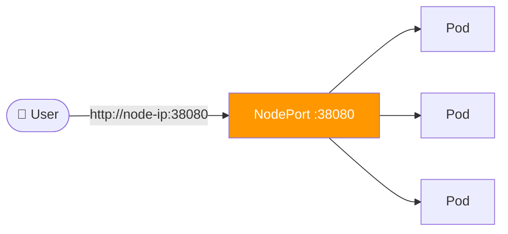

**Problems:**
- Users must remember a port number
- High port (30000–32767) looks unprofessional
- No SSL
- No path-based routing
- No hostname routing

---

### Stage 2 — External Load Balancer (Cloud)

Switch from `NodePort` to `LoadBalancer`. The cloud provider provisions a network load balancer with a stable external IP.

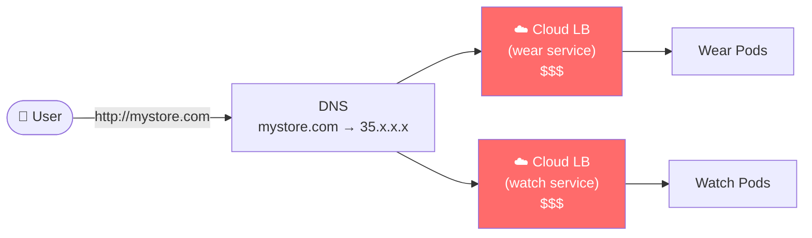


**Problems:**
- Each new service = a new cloud load balancer = more cost
- No unified SSL termination
- No path-based routing (`/wear` vs `/watch` = two LBs)
- URL routing requires external proxy config outside Kubernetes

---

### Stage 3 — Ingress (Production)

One external entry point. All routing logic lives inside Kubernetes as native objects.


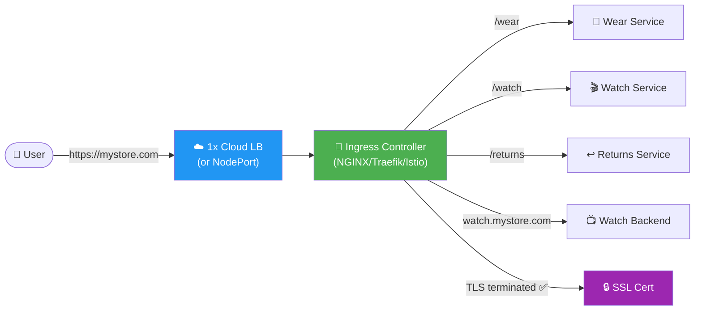

### Cost Comparison

| Approach | External LBs needed | SSL management | Path routing | Cost |
|----------|-------------------|----------------|-------------|------|
| NodePort | 0 (manual DNS) | Manual | Manual | 💰 Low infra, high ops |
| LoadBalancer | 1 per service | Per-LB | No | 💰💰💰 High |
| Ingress | **1 total** | Centralized | ✅ Built-in | 💰 Low |

---

## 2. Ingress Architecture: Controller vs Resource

Ingress has **two separate components**. Confusing them is the #1 source of Ingress errors.

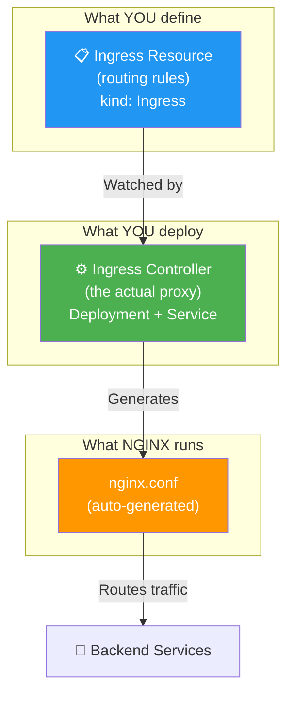

| Component | What it is | Who creates it | Example |
|-----------|-----------|----------------|---------|
| **Ingress Controller** | A running pod/deployment that proxies traffic | You (deploy once) | nginx-ingress-controller pod |
| **Ingress Resource** | A Kubernetes object defining routing rules | You (per app) | `kind: Ingress` YAML |

> ⚠️ **Critical:** Kubernetes does **not** ship with a built-in Ingress controller. You must deploy one. Creating `Ingress` resources without a controller does **nothing** — no error, no routing.

### How They Work Together

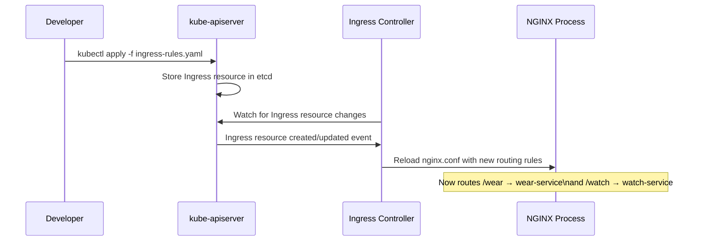

---

## 3. Deploying an NGINX Ingress Controller

Deploying an Ingress controller requires four Kubernetes objects working together.

### Object 1 — ConfigMap (configuration store)

```yaml
apiVersion: v1
kind: ConfigMap
metadata:
  name: nginx-configuration
  namespace: ingress-nginx
# Add NGINX-specific settings here as key-value pairs:
# data:
#   proxy-connect-timeout: "10"
#   proxy-read-timeout: "120"
#   ssl-protocols: "TLSv1.2 TLSv1.3"
```

> ConfigMap decouples NGINX configuration from the container image. Change settings without rebuilding the image.

---

### Object 2 — ServiceAccount + RBAC (permissions)

The controller needs permission to watch Ingress resources, read Secrets (TLS certs), and update status.

```yaml
apiVersion: v1
kind: ServiceAccount
metadata:
  name: nginx-ingress-serviceaccount
  namespace: ingress-nginx
---
# ClusterRole granting necessary permissions
apiVersion: rbac.authorization.k8s.io/v1
kind: ClusterRole
metadata:
  name: nginx-ingress-clusterrole
rules:
- apiGroups: [""]
  resources: ["configmaps", "endpoints", "nodes", "pods", "secrets"]
  verbs: ["list", "watch"]
- apiGroups: [""]
  resources: ["services"]
  verbs: ["get", "list", "watch"]
- apiGroups: ["networking.k8s.io"]
  resources: ["ingresses", "ingressclasses"]
  verbs: ["get", "list", "watch"]
- apiGroups: ["networking.k8s.io"]
  resources: ["ingresses/status"]
  verbs: ["update"]
```

---

### Object 3 — Deployment (the controller pod)

```yaml
apiVersion: apps/v1
kind: Deployment
metadata:
  name: nginx-ingress-controller
  namespace: ingress-nginx
spec:
  replicas: 1
  selector:
    matchLabels:
      name: nginx-ingress
  template:
    metadata:
      labels:
        name: nginx-ingress
    spec:
      serviceAccountName: nginx-ingress-serviceaccount
      containers:
      - name: nginx-ingress-controller
        image: quay.io/kubernetes-ingress-controller/nginx-ingress-controller:0.21.0
        args:
        - /nginx-ingress-controller
        - --configmap=$(POD_NAMESPACE)/nginx-configuration  # ConfigMap reference
        env:
        - name: POD_NAME                    # Required by controller for leader election
          valueFrom:
            fieldRef:
              fieldPath: metadata.name
        - name: POD_NAMESPACE               # Used to locate the ConfigMap
          valueFrom:
            fieldRef:
              fieldPath: metadata.namespace
        ports:
        - name: http
          containerPort: 80
        - name: https
          containerPort: 443
```

---

### Object 4 — Service (expose the controller)

```yaml
apiVersion: v1
kind: Service
metadata:
  name: nginx-ingress
  namespace: ingress-nginx
spec:
  type: NodePort              # Use LoadBalancer in cloud environments
  ports:
  - port: 80
    targetPort: 80
    protocol: TCP
    name: http
  - port: 443
    targetPort: 443
    protocol: TCP
    name: https
  selector:
    name: nginx-ingress
```

### Complete Architecture After Deployment

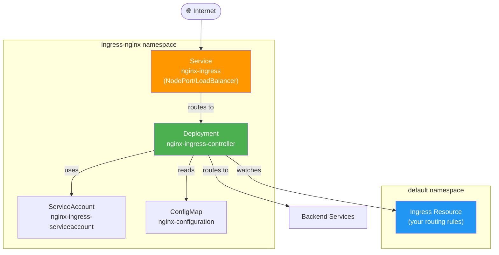

---

## 4. Ingress Resources — Routing Rules

### Basic Single-Backend Ingress

All traffic → one service. No rules, no paths — just a default backend.

```yaml
# ⚠️ Deprecated API shown for reference. Use networking.k8s.io/v1 (see §9)
apiVersion: networking.k8s.io/v1
kind: Ingress
metadata:
  name: ingress-wear
  namespace: default
spec:
  defaultBackend:
    service:
      name: wear-service
      port:
        number: 80
```

```bash
kubectl apply -f ingress-wear.yaml
kubectl describe ingress ingress-wear
```

---

## 5. Path-Based Routing

Route traffic to different services based on the URL path. All traffic comes in on the same hostname.


```yaml
apiVersion: networking.k8s.io/v1
kind: Ingress
metadata:
  name: ingress-wear-watch
  namespace: default
  annotations:
    nginx.ingress.kubernetes.io/rewrite-target: /    # Strip path prefix before forwarding
spec:
  ingressClassName: nginx
  rules:
  - http:
      paths:
      - path: /wear
        pathType: Prefix               # Match /wear, /wear/shirts, /wear/anything
        backend:
          service:
            name: wear-service
            port:
              number: 80
      - path: /watch
        pathType: Prefix
        backend:
          service:
            name: watch-service
            port:
              number: 80
      - path: /returns
        pathType: Prefix
        backend:
          service:
            name: returns-service
            port:
              number: 80
```

### How Traffic is Routed

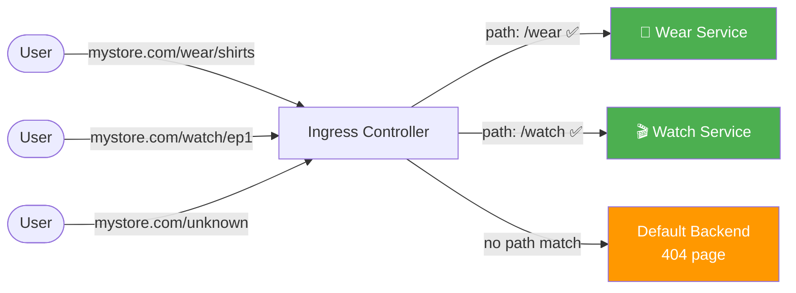

### pathType Options

| pathType | Behaviour | Example match |
|----------|-----------|---------------|
| `Prefix` | Match path prefix, case-sensitive | `/wear` matches `/wear`, `/wear/`, `/wear/shirts` |
| `Exact` | Exact match only | `/wear` matches ONLY `/wear` — not `/wear/` |
| `ImplementationSpecific` | Behaviour depends on IngressClass | Varies by controller |

### kubectl describe Output

```bash
kubectl describe ingress ingress-wear-watch

# Name:             ingress-wear-watch
# Namespace:        default
# Address:          35.120.45.10
# Default backend:  default-http-backend:80 (10.244.0.5:8080)
# Rules:
#   Host        Path    Backends
#   ----        ----    --------
#   *
#               /wear    wear-service:80   (10.244.1.3:80,10.244.2.4:80)
#               /watch   watch-service:80  (10.244.1.5:80,10.244.2.6:80)
# Annotations:  nginx.ingress.kubernetes.io/rewrite-target: /
# Events:
#   Type    Reason  Age   From                      Message
#   ----    ------  ----  ----                      -------
#   Normal  CREATE  30s   nginx-ingress-controller  Ingress default/ingress-wear-watch
```

---

## 6. Host-Based Routing

Route traffic to different services based on the **hostname** (subdomain). Ideal when each service has its own domain/subdomain.


```yaml
apiVersion: networking.k8s.io/v1
kind: Ingress
metadata:
  name: ingress-wear-watch
  namespace: default
spec:
  ingressClassName: nginx
  rules:
  - host: wear.my-online-store.com        # ← Rule 1: match this hostname
    http:
      paths:
      - path: /
        pathType: Prefix
        backend:
          service:
            name: wear-service
            port:
              number: 80
  - host: watch.my-online-store.com       # ← Rule 2: different hostname
    http:
      paths:
      - path: /
        pathType: Prefix
        backend:
          service:
            name: watch-service
            port:
              number: 80
```

### Traffic Flow with Host-Based Routing

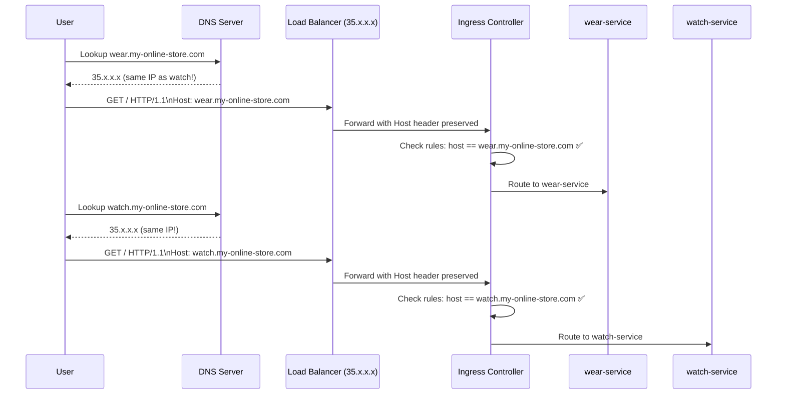

> 💡 **Both subdomains resolve to the same external IP.** The Ingress controller reads the HTTP `Host` header to decide where to route — that's what makes it Layer 7.

### Path-Based vs Host-Based — When to Use Which

| Routing type | Use when | Example |
|-------------|----------|---------|
| **Path-based** | One domain, multiple services | `mystore.com/wear`, `mystore.com/watch` |
| **Host-based** | Separate subdomains per service | `wear.mystore.com`, `watch.mystore.com` |
| **Combined** | Complex multi-tenant setup | `tenant1.mystore.com/api`, `tenant2.mystore.com/api` |

### Combined Host + Path

```yaml
spec:
  rules:
  - host: my-online-store.com
    http:
      paths:
      - path: /wear
        pathType: Prefix
        backend:
          service:
            name: wear-service
            port:
              number: 80
      - path: /watch
        pathType: Prefix
        backend:
          service:
            name: watch-service
            port:
              number: 80
  - host: support.my-online-store.com
    http:
      paths:
      - path: /
        pathType: Prefix
        backend:
          service:
            name: support-service
            port:
              number: 80
```


---

## 7. Default Backend

When a request doesn't match any rule, it falls through to the **default backend** — typically a pod that serves a custom 404 page or error message.

```yaml
apiVersion: networking.k8s.io/v1
kind: Ingress
metadata:
  name: ingress-store
spec:
  ingressClassName: nginx
  defaultBackend:                   # ← Catch-all for unmatched requests
    service:
      name: error-page-service      # Custom 404 service
      port:
        number: 80
  rules:
  - host: wear.my-online-store.com
    http:
      paths:
      - path: /
        pathType: Prefix
        backend:
          service:
            name: wear-service
            port:
              number: 80
```

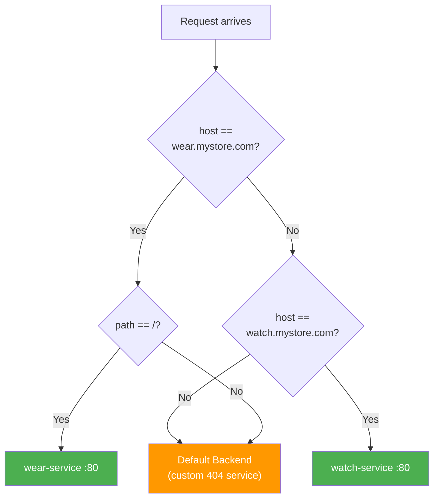

> ⚠️ **Always define a default backend in production.** Without one, unmatched requests return a generic NGINX 404 that leaks the controller version — a security issue.

---

## 8. TLS / SSL Termination

Ingress is the standard place to terminate TLS in Kubernetes. The controller decrypts HTTPS traffic, then forwards plain HTTP to backend services.

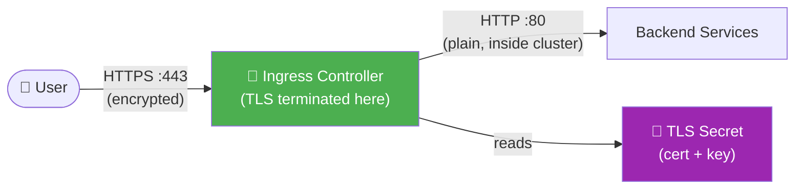

### Step 1 — Create the TLS Secret

```bash
# Option A: From existing cert files
kubectl create secret tls mystore-tls \
  --cert=path/to/tls.crt \
  --key=path/to/tls.key

# Option B: Self-signed cert (dev/testing only)
openssl req -x509 -nodes -days 365 -newkey rsa:2048 \
  -keyout tls.key \
  -out tls.crt \
  -subj "/CN=my-online-store.com/O=my-online-store"

kubectl create secret tls mystore-tls \
  --cert=tls.crt \
  --key=tls.key
```

### Step 2 — Reference the Secret in the Ingress

```yaml
apiVersion: networking.k8s.io/v1
kind: Ingress
metadata:
  name: ingress-store-tls
  namespace: default
  annotations:
    nginx.ingress.kubernetes.io/ssl-redirect: "true"    # Force HTTP → HTTPS redirect
spec:
  ingressClassName: nginx
  tls:
  - hosts:
    - my-online-store.com
    - wear.my-online-store.com
    secretName: mystore-tls                               # TLS Secret name
  rules:
  - host: wear.my-online-store.com
    http:
      paths:
      - path: /
        pathType: Prefix
        backend:
          service:
            name: wear-service
            port:
              number: 80
```

### TLS Secret Structure

```yaml
# What kubectl create secret tls creates internally:
apiVersion: v1
kind: Secret
metadata:
  name: mystore-tls
type: kubernetes.io/tls
data:
  tls.crt: <base64-encoded certificate>
  tls.key: <base64-encoded private key>
```

---

## 9. Modern API: networking.k8s.io/v1

The KodeKloud source uses `extensions/v1beta1` — this API was **removed in Kubernetes 1.22**. The current API is `networking.k8s.io/v1` and has slightly different field structure.

### Old vs New YAML Comparison

```yaml
# ❌ OLD (removed in K8s 1.22) — extensions/v1beta1
apiVersion: extensions/v1beta1
kind: Ingress
metadata:
  name: ingress-wear-watch
spec:
  rules:
  - http:
      paths:
      - path: /wear
        backend:
          serviceName: wear-service   # ← Old field
          servicePort: 80             # ← Old field
```

```yaml
# ✅ NEW (required since K8s 1.22) — networking.k8s.io/v1
apiVersion: networking.k8s.io/v1
kind: Ingress
metadata:
  name: ingress-wear-watch
spec:
  ingressClassName: nginx             # ← New: specify which controller
  rules:
  - http:
      paths:
      - path: /wear
        pathType: Prefix              # ← New: required field
        backend:
          service:                    # ← New: nested service block
            name: wear-service
            port:
              number: 80
```

### Key Differences Table

| Field | extensions/v1beta1 | networking.k8s.io/v1 |
|-------|-------------------|----------------------|
| API version | `extensions/v1beta1` | `networking.k8s.io/v1` |
| `pathType` | Optional | **Required** |
| Backend service | `serviceName` / `servicePort` | `service.name` / `service.port.number` |
| IngressClass | Annotation | `spec.ingressClassName` |
| Default backend | `spec.backend` | `spec.defaultBackend.service` |
| Status since | Removed in 1.22 | Available since 1.19, stable in 1.19 |

### IngressClass

With multiple controllers deployed (e.g., both NGINX and Traefik), `ingressClassName` tells Kubernetes which controller should handle this Ingress:

```yaml
# Create an IngressClass for NGINX
apiVersion: networking.k8s.io/v1
kind: IngressClass
metadata:
  name: nginx
  annotations:
    ingressclass.kubernetes.io/is-default-class: "true"  # Make this the default
spec:
  controller: k8s.io/ingress-nginx
```

```bash
# List available IngressClasses
kubectl get ingressclass
```

---

## 10. Ingress Controllers Comparison

| Controller | Maintainer | Best for | Supports NetworkPolicy | Notes |
|-----------|-----------|---------|----------------------|-------|
| **NGINX** | Kubernetes community | General purpose | Via annotations | Most widely used; two versions (community vs nginx-inc) |
| **GCE** | Google | GKE clusters | Native GCP integration | Automatically provisions GCP LBs |
| **Traefik** | Traefik Labs | Dynamic envs / microservices | Yes | Auto-discovers services; great dashboard |
| **HAProxy** | HAProxy Tech | High performance | Yes | Best raw performance |
| **Contour** | VMware | Envoy-based | Yes | More modern; supports HTTPProxy CRD |
| **Istio** | Google/IBM/Lyft | Service mesh + ingress | Full mTLS | Full service mesh features |
| **Cilium** | Isovalent | eBPF-based | Deep L7 policies | Best for NetworkPolicy + Ingress together |
| **AWS ALB** | Amazon | EKS clusters | AWS WAF integration | Provisions ALB per Ingress |

> 🎓 **CKS Exam:** Questions almost always use NGINX Ingress Controller. Know its annotations well.

---

## 11. Security Hardening

### NGINX Annotations for Security

```yaml
metadata:
  annotations:
    # Force HTTPS — redirect all HTTP to HTTPS
    nginx.ingress.kubernetes.io/ssl-redirect: "true"
    nginx.ingress.kubernetes.io/force-ssl-redirect: "true"

    # Rate limiting — prevent DDoS / brute-force
    nginx.ingress.kubernetes.io/limit-rps: "10"
    nginx.ingress.kubernetes.io/limit-connections: "5"

    # Whitelist specific IPs only
    nginx.ingress.kubernetes.io/whitelist-source-range: "10.0.0.0/8,203.0.113.0/24"

    # Minimum TLS version — reject TLS 1.0/1.1
    nginx.ingress.kubernetes.io/ssl-protocols: "TLSv1.2 TLSv1.3"

    # Security headers
    nginx.ingress.kubernetes.io/configuration-snippet: |
      add_header X-Frame-Options "SAMEORIGIN";
      add_header X-Content-Type-Options "nosniff";
      add_header X-XSS-Protection "1; mode=block";
      add_header Strict-Transport-Security "max-age=31536000; includeSubDomains";

    # Authentication — Basic Auth
    nginx.ingress.kubernetes.io/auth-type: basic
    nginx.ingress.kubernetes.io/auth-secret: basic-auth-secret
    nginx.ingress.kubernetes.io/auth-realm: "Authentication Required"

    # OAuth2 / OIDC proxy
    nginx.ingress.kubernetes.io/auth-url: "https://oauth2-proxy/oauth2/auth"
    nginx.ingress.kubernetes.io/auth-signin: "https://oauth2-proxy/oauth2/sign_in"
```

### Restrict Ingress with NetworkPolicy

Combine Ingress with NetworkPolicy so only the Ingress controller can reach backend pods:

```yaml
apiVersion: networking.k8s.io/v1
kind: NetworkPolicy
metadata:
  name: allow-ingress-controller-only
  namespace: default
spec:
  podSelector:
    matchLabels:
      app: wear-app
  policyTypes:
  - Ingress
  ingress:
  - from:
    - namespaceSelector:
        matchLabels:
          kubernetes.io/metadata.name: ingress-nginx
      podSelector:
        matchLabels:
          name: nginx-ingress
    ports:
    - protocol: TCP
      port: 80
```

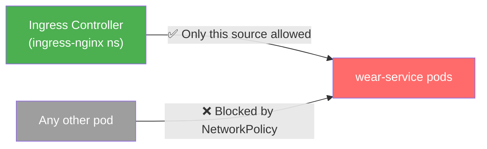

### Security Checklist

| Control | How | Why |
|---------|-----|-----|
| Force HTTPS | `ssl-redirect: "true"` annotation | Prevent cleartext credential theft |
| Strong TLS only | `ssl-protocols: TLSv1.2 TLSv1.3` | Remove vulnerable TLS 1.0/1.1 |
| Security headers | `configuration-snippet` annotation | Prevent XSS, clickjacking |
| IP allowlisting | `whitelist-source-range` annotation | Restrict admin paths |
| Custom 404 page | `defaultBackend` in Ingress spec | Hide controller version info |
| NetworkPolicy | Restrict ingress to controller pods only | Prevent direct pod access |
| TLS cert rotation | cert-manager + Let's Encrypt | Avoid expired cert outages |
| Rate limiting | `limit-rps` annotation | Prevent DDoS |

---

## 12. Real-World Scenarios

### Scenario 1: Multi-Service SaaS App

Routing strategy: path-based within one hostname, with HTTPS enforced.

```yaml
apiVersion: networking.k8s.io/v1
kind: Ingress
metadata:
  name: saas-ingress
  namespace: production
  annotations:
    nginx.ingress.kubernetes.io/ssl-redirect: "true"
    nginx.ingress.kubernetes.io/rewrite-target: /$2
spec:
  ingressClassName: nginx
  tls:
  - hosts:
    - app.mycompany.com
    secretName: mycompany-tls
  rules:
  - host: app.mycompany.com
    http:
      paths:
      - path: /api(/|$)(.*)
        pathType: Prefix
        backend:
          service:
            name: api-service
            port:
              number: 8080
      - path: /dashboard(/|$)(.*)
        pathType: Prefix
        backend:
          service:
            name: dashboard-service
            port:
              number: 3000
      - path: /(.*)
        pathType: Prefix
        backend:
          service:
            name: frontend-service
            port:
              number: 80
```

### Scenario 2: Multi-Tenant Platform (Namespace per Tenant)

Each tenant gets their own subdomain routing to services in their own namespace. Since Ingress is namespace-scoped, each tenant has their own Ingress object.

```yaml
# Tenant A — namespace: tenant-a
apiVersion: networking.k8s.io/v1
kind: Ingress
metadata:
  name: tenant-a-ingress
  namespace: tenant-a
spec:
  ingressClassName: nginx
  tls:
  - hosts:
    - tenant-a.platform.com
    secretName: tenant-a-tls
  rules:
  - host: tenant-a.platform.com
    http:
      paths:
      - path: /
        pathType: Prefix
        backend:
          service:
            name: tenant-a-app
            port:
              number: 80
```

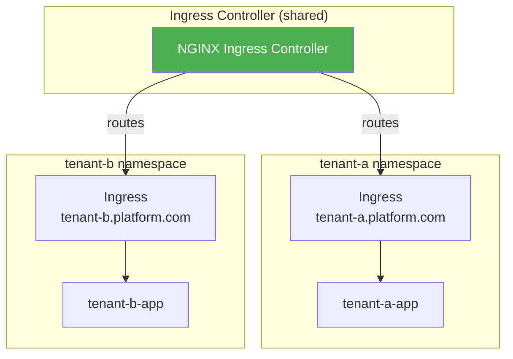

### Scenario 3: Securing Admin Endpoints

The `/admin` path should only be accessible from corporate IPs:

```yaml
apiVersion: networking.k8s.io/v1
kind: Ingress
metadata:
  name: admin-ingress
  namespace: default
  annotations:
    nginx.ingress.kubernetes.io/whitelist-source-range: "10.0.0.0/8,203.0.113.0/24"
    nginx.ingress.kubernetes.io/ssl-redirect: "true"
spec:
  ingressClassName: nginx
  tls:
  - hosts:
    - mystore.com
    secretName: mystore-tls
  rules:
  - host: mystore.com
    http:
      paths:
      - path: /admin
        pathType: Prefix
        backend:
          service:
            name: admin-service
            port:
              number: 8080
      - path: /
        pathType: Prefix
        backend:
          service:
            name: frontend-service
            port:
              number: 80
```

---

## 13. Concepts at a Glance

| Concept | Definition |
|---------|-----------|
| **Ingress** | Kubernetes API object that defines HTTP/HTTPS routing rules |
| **Ingress Controller** | Pod that implements the routing; must be deployed separately |
| **IngressClass** | Links an Ingress resource to a specific controller |
| **Layer 7 LB** | Routes based on HTTP content (host header, URL path) vs Layer 4 (TCP/IP) |
| **Path-based routing** | Routes based on URL path (`/wear`, `/watch`) on a single hostname |
| **Host-based routing** | Routes based on HTTP Host header (`wear.mystore.com`) |
| **defaultBackend** | Catch-all service for requests matching no rule |
| **pathType: Prefix** | Matches the path and all sub-paths |
| **pathType: Exact** | Matches only the exact path |
| **TLS termination** | HTTPS decrypted at Ingress; HTTP forwarded to backends |
| **TLS Secret** | `kubernetes.io/tls` Secret containing `tls.crt` and `tls.key` |
| **ssl-redirect** | NGINX annotation to force HTTP → HTTPS redirect |
| **rewrite-target** | NGINX annotation to strip path prefix before forwarding |
| **whitelist-source-range** | NGINX annotation to restrict access by IP |
| **extensions/v1beta1** | Removed in K8s 1.22 — use `networking.k8s.io/v1` |
| **networking.k8s.io/v1** | Current Ingress API since K8s 1.19 (stable) |
| **NodePort vs LoadBalancer** | How the Ingress Controller Service is exposed externally |
| **ConfigMap** | Stores NGINX global configuration decoupled from the container |
| **ServiceAccount** | Provides the controller with RBAC permissions to watch Ingress resources |

---

## 14. Commands Reference

### Controller Management

```bash
# Deploy NGINX Ingress Controller (Helm — recommended for production)
helm repo add ingress-nginx https://kubernetes.github.io/ingress-nginx
helm install ingress-nginx ingress-nginx/ingress-nginx \
  --namespace ingress-nginx \
  --create-namespace

# Check the controller is running
kubectl get pods -n ingress-nginx
kubectl get service -n ingress-nginx

# Get the external IP / NodePort of the controller
kubectl get service nginx-ingress -n ingress-nginx

# View controller logs (shows routing decisions)
kubectl logs -n ingress-nginx \
  -l app.kubernetes.io/name=ingress-nginx \
  --tail=50 -f
```

### Ingress Resource Operations

```bash
# Apply an Ingress resource
kubectl apply -f ingress-rules.yaml

# List all Ingress resources
kubectl get ingress
kubectl get ingress --all-namespaces

# Describe an Ingress (shows rules, backend IPs, events)
kubectl describe ingress ingress-wear-watch

# Get Ingress in YAML
kubectl get ingress ingress-wear-watch -o yaml

# Delete an Ingress
kubectl delete ingress ingress-wear-watch

# Edit in place
kubectl edit ingress ingress-wear-watch
```

### Create Ingress Imperatively

```bash
# Create a basic ingress (kubernetes 1.19+)
kubectl create ingress ingress-wear \
  --rule="mystore.com/wear=wear-service:80" \
  --rule="mystore.com/watch=watch-service:80"

# With TLS
kubectl create ingress ingress-tls \
  --rule="mystore.com/*=frontend-service:80,tls=mystore-tls"

# Dry-run to get YAML template
kubectl create ingress my-ingress \
  --rule="mystore.com/wear=wear-service:80" \
  --dry-run=client -o yaml > ingress.yaml
```

### TLS Secret Management

```bash
# Create TLS secret from cert files
kubectl create secret tls mystore-tls \
  --cert=tls.crt \
  --key=tls.key \
  --namespace=default

# View secret (certs are base64-encoded)
kubectl get secret mystore-tls -o yaml

# Decode the certificate to inspect it
kubectl get secret mystore-tls -o jsonpath='{.data.tls\.crt}' | \
  base64 --decode | \
  openssl x509 -text -noout
```

### IngressClass

```bash
# List IngressClasses
kubectl get ingressclass

# Check which is default
kubectl get ingressclass -o yaml | grep -A2 "is-default-class"
```

### Testing Ingress

```bash
# Test path routing with curl (host header required for host-based routing)
curl -H "Host: wear.my-online-store.com" http://<node-ip>:<node-port>/

# Test HTTPS (if using self-signed cert, use -k)
curl -k https://wear.my-online-store.com/

# Test from inside the cluster
kubectl run curl-test --image=curlimages/curl --rm -it -- \
  curl -H "Host: wear.my-online-store.com" http://nginx-ingress.ingress-nginx/

# Verbose — see what headers are returned
curl -v -H "Host: wear.my-online-store.com" http://<ingress-ip>/
```

---

> 📝 **CKS Exam Checklist — Ingress**
> - [ ] Know the difference between Ingress Controller and Ingress Resource
> - [ ] Use `networking.k8s.io/v1` — NOT `extensions/v1beta1` (removed in 1.22)
> - [ ] `pathType` is required in the modern API — always specify `Prefix` or `Exact`
> - [ ] Know how to create a TLS Secret (`kubectl create secret tls`)
> - [ ] Know the `ssl-redirect` and `whitelist-source-range` annotations
> - [ ] Understand `defaultBackend` and why a custom 404 matters for security
> - [ ] Know that Kubernetes has no built-in Ingress controller — you must deploy one
> - [ ] Combine NetworkPolicy with Ingress to restrict direct pod access
> - [ ] Know how to `kubectl describe ingress` and read the rules output
> - [ ] `ingressClassName: nginx` is needed when multiple controllers exist
