# 16 — Docker Service Configuration

> **CKS Domain:** Cluster Setup & Hardening  
> **Weight:** Medium — Docker daemon security is tested in the context of protecting the container runtime  
> **TL;DR:** Docker's daemon (`dockerd`) is the backbone of all container operations. Misconfiguring its network exposure is one of the most common critical vulnerabilities in container environments. Understand how to lock it down.

---

## Table of Contents

1. [Docker Daemon Architecture](#1-docker-daemon-architecture)
2. [Managing the Docker Service with systemd](#2-managing-the-docker-service-with-systemd)
3. [Running dockerd in the Foreground](#3-running-dockerd-in-the-foreground)
4. [Unix Socket — Local CLI Communication](#4-unix-socket--local-cli-communication)
5. [Remote Access via TCP](#5-remote-access-via-tcp)
6. [Securing Remote Access with TLS](#6-securing-remote-access-with-tls)
7. [daemon.json — The Configuration File](#7-daemonjson--the-configuration-file)
8. [Common daemon.json Settings](#8-common-daemonjson-settings)
9. [Conflict: daemon.json vs CLI Flags](#9-conflict-daemonjson-vs-cli-flags)
10. [Security Hardening](#10-security-hardening)
11. [Real-World Scenarios](#11-real-world-scenarios)
12. [Concepts at a Glance](#12-concepts-at-a-glance)
13. [Commands Reference](#13-commands-reference)

---

## 1. Docker Daemon Architecture

Before configuring Docker, understand what runs where.

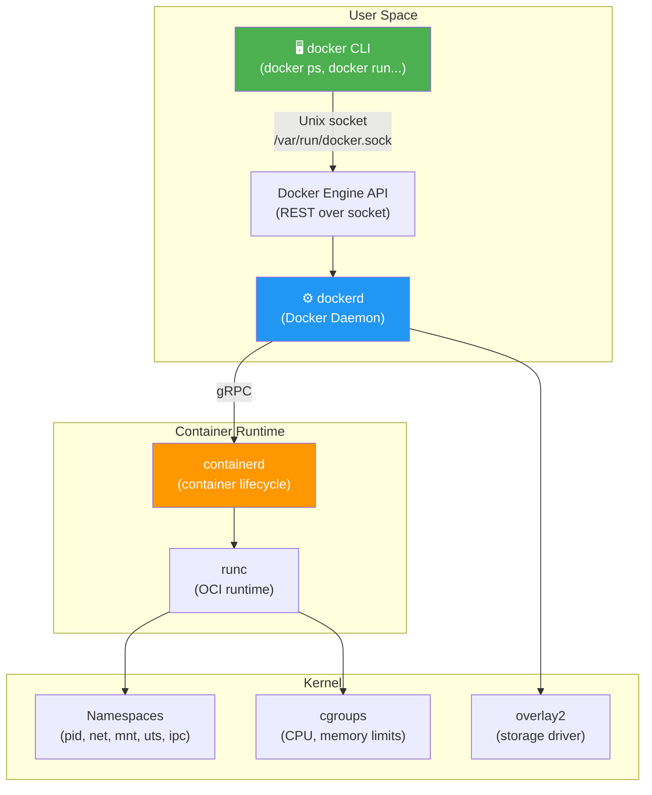

### Component Responsibilities

| Component | Role | Binary | Default socket |
|-----------|------|--------|----------------|
| **docker CLI** | User-facing command interface | `/usr/bin/docker` | N/A (client only) |
| **dockerd** | Daemon: image management, API server, networking | `/usr/bin/dockerd` | `/var/run/docker.sock` |
| **containerd** | Container lifecycle (start/stop/exec) | `/usr/bin/containerd` | `/run/containerd/containerd.sock` |
| **runc** | Low-level OCI container runtime | `/usr/sbin/runc` | N/A |

---

## 2. Managing the Docker Service with systemd

Docker runs as a **systemd service** on most Linux distributions. systemd ensures it starts on boot and restarts if it crashes.

### Checking Status

```bash
systemctl status docker
```

**Sample output — healthy running service:**

```
● docker.service - Docker Application Container Engine
   Loaded: loaded (/lib/systemd/system/docker.service; enabled; vendor preset: enabled)
   Active: active (running) since Wed 2020-10-21 04:21:01 UTC; 3 days ago
     Docs: https://docs.docker.com
 Main PID: 4197 (dockerd)
    Tasks: 13
   Memory: 129.7M
      CPU: 9min 6.980s
   CGroup: /system.slice/docker.service
           └─4197 /usr/bin/dockerd -H fd:// -H tcp://0.0.0.0 --containerd=/run/containerd/containerd.sock
```

**Reading the status output:**

| Field | Meaning |
|-------|---------|
| `Loaded:` | Whether the unit file was found and parsed |
| `enabled` | Service starts automatically at boot |
| `Active: active (running)` | Process is currently running |
| `Main PID` | PID of the `dockerd` process |
| `CGroup` | The exact command line `dockerd` was started with |

> 💡 **The CGroup line** shows the actual flags Docker was started with — useful for auditing whether `--tls` or an unexpected `-H tcp://` is active.

### Service Control Commands

```bash
# Start the Docker service
systemctl start docker

# Stop the Docker service
systemctl stop docker

# Restart (stops then starts)
systemctl restart docker

# Reload configuration without stopping (daemon.json changes)
systemctl reload docker         # Note: not all changes support reload; restart is safer

# Enable auto-start at boot
systemctl enable docker

# Disable auto-start at boot
systemctl disable docker

# Check if enabled
systemctl is-enabled docker

# View recent logs
journalctl -u docker --since "1 hour ago"
journalctl -u docker -n 50 -f          # Follow last 50 lines
```

### systemd Service Lifecycle

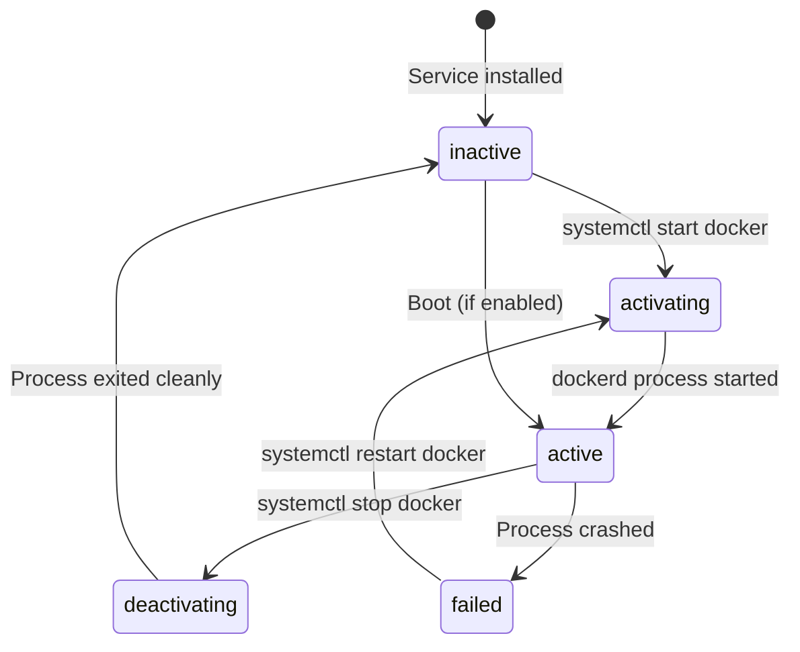

---

## 3. Running dockerd in the Foreground

For troubleshooting, you can run the Docker daemon **directly** in your terminal instead of as a background service. Logs print to stdout in real time.

> ⚠️ **Stop the systemd service first** to avoid conflicts:
> ```bash
> systemctl stop docker
> ```

### Basic Foreground Mode

```bash
dockerd
```

### Debug Mode

```bash
dockerd --debug
```

**Sample debug output:**

```
INFO[2020-10-24T08:20:40.372653436Z] Starting up
INFO[2020-10-24T08:20:40.375298351Z] parsed scheme: "unix"
INFO[2020-10-24T08:20:40.375510773Z] scheme "unix" not registered, fallback to default scheme  module=grpc
INFO[2020-10-24T08:20:40.375657667Z] ccResolverWrapper: sending update to cc: [{unix:///run/containerd/containerd.sock 0 <nil>}]  module=grpc
INFO[2020-10-24T08:20:40.375973480Z] ClientConn switching balancer to "pick_first"  module=grpc
INFO[2020-10-24T08:20:40.381198263Z] [graphdriver] using prior storage driver: overlay2
WARN[2020-10-24T08:20:40.572888603Z] Your kernel does not support swap memory limit
WARN[2020-10-24T08:20:40.573141192Z] Your kernel does not support cgroup rt period
WARN[2020-10-24T08:20:40.573408479Z] Your kernel does not support cgroup rt runtime
```

**Reading the log levels:**

| Prefix | Meaning |
|--------|---------|
| `INFO` | Normal operational messages |
| `DEBU` | Debug detail — only shown with `--debug` |
| `WARN` | Non-fatal issue (e.g., kernel feature not available) |
| `ERRO` | Error — something went wrong |
| `FATA` | Fatal — daemon will exit |

### What the WARN messages mean

```
WARN: Your kernel does not support swap memory limit
```
→ The kernel was compiled without `CONFIG_MEMCG_SWAP`. Container `--memory-swap` limits won't work.

```
WARN: Your kernel does not support cgroup rt period/runtime
```
→ Real-time CPU scheduling for containers is unavailable.

These are **non-fatal** — Docker still runs; only specific features are disabled.

---

## 4. Unix Socket — Local CLI Communication

When `dockerd` starts, it creates a **Unix domain socket** at `/var/run/docker.sock`. This is the default communication channel between the CLI and daemon.

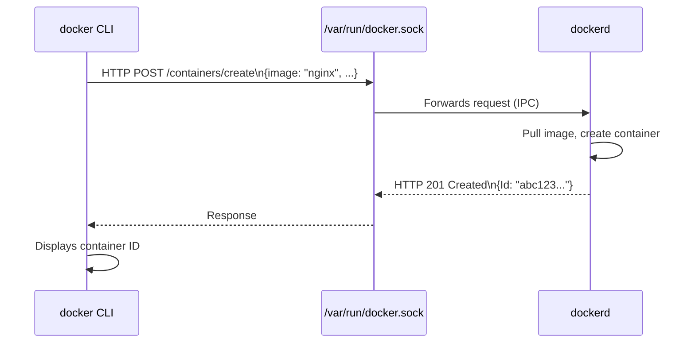

### Why a Unix Socket?

| Property | Unix Socket | TCP Socket |
|----------|------------|------------|
| **Speed** | Kernel IPC — very fast | Network stack overhead |
| **Security** | File permissions control access | Needs firewall/TLS |
| **Scope** | Local machine only | Can be remote |
| **Default** | ✅ Always active | ❌ Must be explicitly enabled |

### Who can access the socket?

```bash
# Check socket permissions
ls -la /var/run/docker.sock
# srw-rw---- 1 root docker 0 Oct 21 04:21 /var/run/docker.sock
#            ^   ^    ^
#            |   |    └── Group: docker
#            |   └── Owner: root
#            └── s = socket file type

# Only root or members of 'docker' group can access it
# Adding a user to the docker group = effectively giving them root!
usermod -aG docker <username>  # ⚠️ Security-sensitive operation
```

> ⚠️ **Security Note:** The `docker` group grants root-equivalent access. Anyone in this group can mount host filesystems, escape containers, and gain full host control. Treat docker group membership like sudo access.

---

## 5. Remote Access via TCP

By default, Docker only listens on the local Unix socket. To manage Docker from a **remote machine**, you must add a TCP listener.

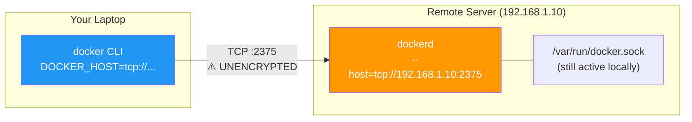

### Starting dockerd with TCP listener

```bash
# On the remote Docker host — add TCP listener alongside Unix socket
dockerd --debug \
  --host=unix:///var/run/docker.sock \    # Keep local socket active
  --host=tcp://192.168.1.10:2375          # Add TCP listener (⚠️ no TLS = dangerous)
```

### Connecting from your local machine

```bash
# Set the environment variable to point to the remote host
export DOCKER_HOST="tcp://192.168.1.10:2375"

# All subsequent docker commands go to the remote host
docker ps
docker images
docker run nginx
```

> ⚠️ **CRITICAL SECURITY WARNING:** Port `2375` is **unencrypted and unauthenticated**. Anyone who can reach this port gets **full root access to the host**. Never expose this port on the internet or untrusted networks.

### The Danger of an Open Docker TCP Port

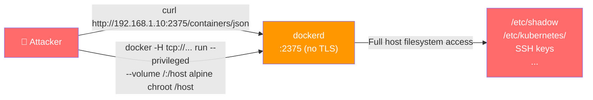

**Real exploit — escaping to host with unprotected Docker API:**

```bash
# Attacker runs this from any machine that can reach port 2375:
docker -H tcp://192.168.1.10:2375 run \
  --privileged \
  --volume /:/hostfs \
  alpine \
  chroot /hostfs /bin/sh
# Now the attacker has a root shell on the host
```

---

## 6. Securing Remote Access with TLS

Port `2376` is the **TLS-secured** Docker API port (by convention). With TLS, Docker performs **mutual TLS (mTLS)** — both client and server authenticate each other with certificates.

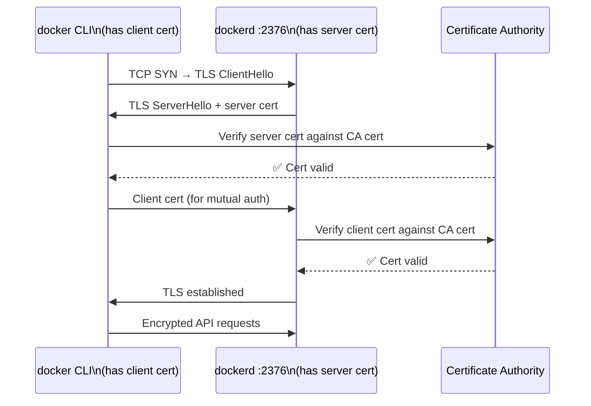

### Step 1 — Generate TLS Certificates

```bash
# Create a CA (Certificate Authority)
openssl genrsa -aes256 -out ca-key.pem 4096
openssl req -new -x509 -days 365 \
  -key ca-key.pem \
  -sha256 \
  -out ca.pem \
  -subj "/CN=Docker CA"

# Generate server key and certificate (for dockerd)
openssl genrsa -out server-key.pem 4096
openssl req -subj "/CN=192.168.1.10" \
  -sha256 -new \
  -key server-key.pem \
  -out server.csr

# Sign the server cert with the CA
openssl x509 -req -days 365 \
  -sha256 \
  -in server.csr \
  -CA ca.pem \
  -CAkey ca-key.pem \
  -CAcreateserial \
  -out server-cert.pem

# Generate client key and certificate (for docker CLI)
openssl genrsa -out key.pem 4096
openssl req -subj '/CN=client' \
  -new \
  -key key.pem \
  -out client.csr

openssl x509 -req -days 365 \
  -sha256 \
  -in client.csr \
  -CA ca.pem \
  -CAkey ca-key.pem \
  -CAcreateserial \
  -out cert.pem

# Set restrictive permissions on keys
chmod 0400 ca-key.pem key.pem server-key.pem
chmod 0444 ca.pem server-cert.pem cert.pem
```

### Step 2 — Start dockerd with TLS

```bash
dockerd --debug \
  --host=tcp://192.168.1.10:2376 \
  --tls=true \
  --tlscacert=/var/docker/ca.pem \        # CA cert to verify client certs
  --tlscert=/var/docker/server-cert.pem \ # Server's own cert
  --tlskey=/var/docker/server-key.pem     # Server's private key
```

### Step 3 — Connect from Client with TLS

```bash
export DOCKER_HOST="tcp://192.168.1.10:2376"
export DOCKER_TLS_VERIFY=1

docker --tlscacert=~/.docker/ca.pem \
       --tlscert=~/.docker/cert.pem \
       --tlskey=~/.docker/key.pem \
       ps
```

Or place certs in `~/.docker/` and Docker CLI picks them up automatically:

```bash
mkdir -p ~/.docker
cp ca.pem cert.pem key.pem ~/.docker/
export DOCKER_HOST="tcp://192.168.1.10:2376"
export DOCKER_TLS_VERIFY=1
docker ps     # Uses ~/.docker/*.pem automatically
```

### Port Convention

| Port | Protocol | Security | Use case |
|------|----------|----------|----------|
| `2375` | TCP (plain) | ❌ None | Dev/testing only — never production |
| `2376` | TCP + TLS | ✅ mTLS | Secure remote access |

---

## 7. daemon.json — The Configuration File

Instead of passing flags every time you start `dockerd`, persist configuration in `/etc/docker/daemon.json`.

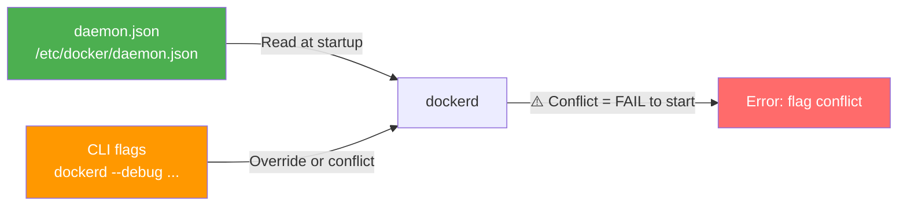

> The file is **not created by default** — you must create it manually.

### Equivalent: CLI flags → daemon.json

| CLI flag | daemon.json key |
|----------|----------------|
| `--debug` | `"debug": true` |
| `--host=tcp://...` | `"hosts": ["tcp://..."]` |
| `--tls=true` | `"tls": true` |
| `--tlscacert=/path` | `"tlscacert": "/path"` |
| `--tlscert=/path` | `"tlscert": "/path"` |
| `--tlskey=/path` | `"tlskey": "/path"` |
| `--log-driver=json-file` | `"log-driver": "json-file"` |
| `--storage-driver=overlay2` | `"storage-driver": "overlay2"` |

### Complete Secured daemon.json Example

```json
{
  "debug": true,
  "hosts": [
    "unix:///var/run/docker.sock",
    "tcp://192.168.1.10:2376"
  ],
  "tls": true,
  "tlscacert": "/var/docker/ca.pem",
  "tlscert": "/var/docker/server-cert.pem",
  "tlskey": "/var/docker/server-key.pem",
  "log-driver": "json-file",
  "log-opts": {
    "max-size": "100m",
    "max-file": "3"
  },
  "storage-driver": "overlay2",
  "default-ulimits": {
    "nofile": {
      "Name": "nofile",
      "Hard": 64000,
      "Soft": 64000
    }
  }
}
```

### Applying daemon.json Changes

```bash
# After editing /etc/docker/daemon.json:
systemctl restart docker

# Verify the new settings took effect
systemctl status docker
# Check the CGroup line for updated flags

# Or inspect the daemon info
docker info | grep -E "Debug|Logging Driver|Storage Driver"
```

---

## 8. Common daemon.json Settings

### Logging

```json
{
  "log-driver": "json-file",
  "log-opts": {
    "max-size": "100m",
    "max-file": "5",
    "labels": "production_status",
    "env": "os,customer"
  }
}
```

| Log driver | Description | Use when |
|-----------|-------------|----------|
| `json-file` | Default; writes JSON to disk | Local dev / simple setups |
| `syslog` | Sends to syslog daemon | Centralized syslog server |
| `journald` | Sends to systemd journal | systemd-based systems |
| `fluentd` | Sends to Fluentd | Centralized log aggregation |
| `none` | Disables logging | Performance-critical containers |

### Storage

```json
{
  "storage-driver": "overlay2",
  "storage-opts": [
    "overlay2.override_kernel_check=true"
  ],
  "data-root": "/mnt/docker-data"    // Move Docker data off the OS disk
}
```

### Security-Relevant Settings

```json
{
  "no-new-privileges": true,         // Prevent privilege escalation via setuid
  "userns-remap": "default",         // Enable user namespace remapping
  "live-restore": true,              // Keep containers running during daemon restart
  "icc": false,                      // Disable inter-container communication by default
  "default-address-pools": [
    {"base": "172.30.0.0/16", "size": 24}
  ]
}
```

---

## 9. Conflict: daemon.json vs CLI Flags

Docker **cannot** start if the same option is set both in `daemon.json` and as a CLI flag. This is a common source of startup failures.

### The Conflict Error

```bash
systemctl start docker
# Job for docker.service failed.

journalctl -u docker -n 20
# unable to configure the Docker daemon with file /etc/docker/daemon.json:
# the following directives are specified both as a flag and in the configuration file:
# debug: (from flag: false, from file: true)
```

### Common Conflict: --debug in systemd unit

On many systems, the systemd unit file passes default flags:

```bash
# View the systemd unit
cat /lib/systemd/system/docker.service | grep ExecStart
# ExecStart=/usr/bin/dockerd -H fd:// --containerd=/run/containerd/containerd.sock
```

The `-H fd://` flag conflicts with adding `"hosts"` to `daemon.json`. The fix:

```bash
# Create a systemd override to remove the -H flag from the unit file
mkdir -p /etc/systemd/system/docker.service.d
cat > /etc/systemd/system/docker.service.d/override.conf << 'EOF'
[Service]
ExecStart=
ExecStart=/usr/bin/dockerd --containerd=/run/containerd/containerd.sock
EOF

systemctl daemon-reload
systemctl restart docker
```

Now `daemon.json` controls the `hosts` setting without conflict.

### Conflict Resolution Flowchart

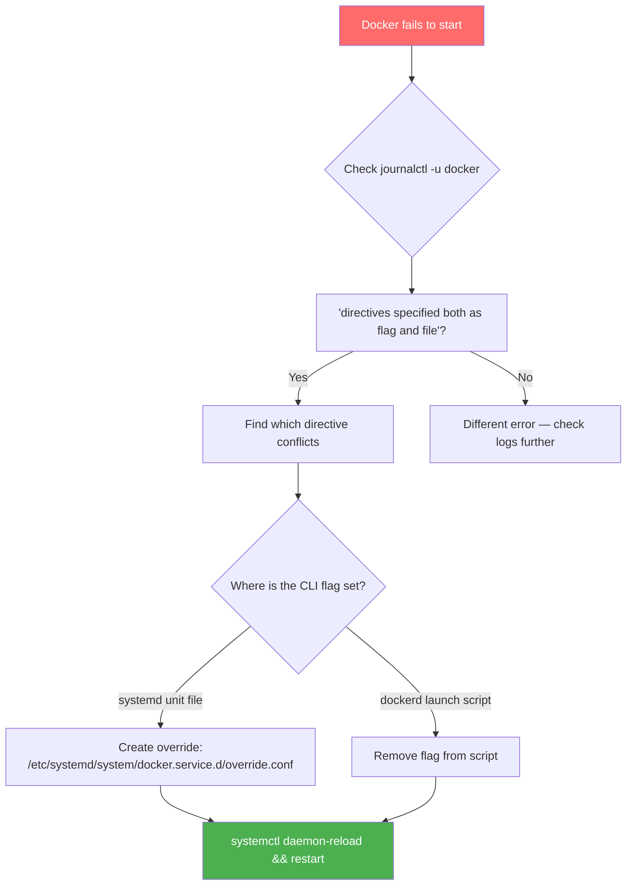

---

## 10. Security Hardening

### The Docker Daemon Attack Surface

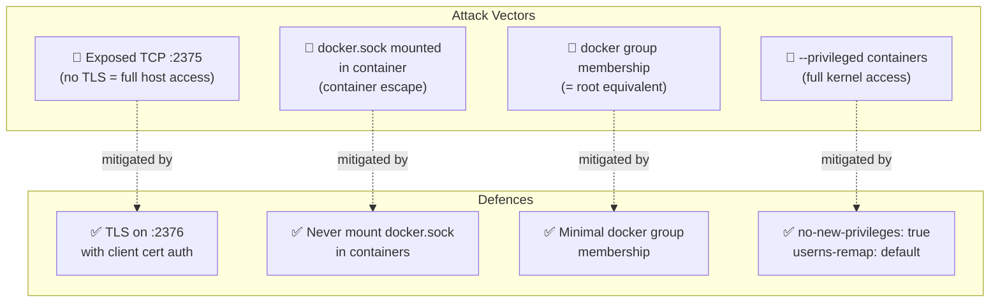

### Hardened daemon.json (CKS Reference)

```json
{
  "icc": false,
  "no-new-privileges": true,
  "userns-remap": "default",
  "live-restore": true,
  "userland-proxy": false,
  "tls": true,
  "tlsverify": true,
  "tlscacert": "/etc/docker/certs/ca.pem",
  "tlscert": "/etc/docker/certs/server-cert.pem",
  "tlskey": "/etc/docker/certs/server-key.pem",
  "hosts": [
    "unix:///var/run/docker.sock",
    "tcp://192.168.1.10:2376"
  ],
  "log-driver": "json-file",
  "log-opts": {
    "max-size": "50m",
    "max-file": "5"
  }
}
```

### docker.sock — The Most Dangerous Mount

```yaml
# ❌ NEVER DO THIS in production
volumes:
- /var/run/docker.sock:/var/run/docker.sock

# Why it's dangerous: The container can now:
# - List all containers: docker ps
# - Run new containers: docker run --privileged ...
# - Mount the host filesystem: docker run -v /:/host ...
# - Escape to root on the host in seconds
```

### Security Audit Checklist

```bash
# 1. Check if TCP port is exposed
ss -tlnp | grep dockerd
netstat -tlnp | grep 2375   # Should return nothing (no unencrypted port)

# 2. Check if TLS is enforced
docker info | grep "TLS"

# 3. Check docker group membership
getent group docker

# 4. Check for docker.sock mounts in running containers
docker ps -q | xargs docker inspect \
  --format '{{.Name}}: {{range .Mounts}}{{.Source}} {{end}}' \
  | grep docker.sock

# 5. Verify daemon.json settings
cat /etc/docker/daemon.json
docker info | grep -E "Insecure|Debug|Logging|Storage"

# 6. Check systemd unit for unexpected flags
systemctl cat docker | grep ExecStart

# 7. Verify no unauthenticated remote access
curl http://192.168.1.10:2375/info 2>&1 | grep -i "connection refused"
# Should show: Connection refused (meaning port is not open)
```

---

## 11. Real-World Scenarios

### Scenario 1: Tesla Cryptomining Attack (2018)

Attackers found an **unsecured Kubernetes dashboard** that allowed them to deploy containers. The containers accessed Docker API endpoints and ran a Monero cryptominer. The root cause: no authentication on management interfaces.

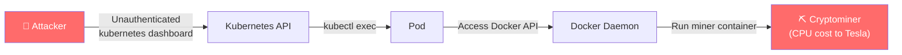

**Lesson:** Always authenticate management interfaces. Docker's TCP API is especially dangerous without TLS.

---

### Scenario 2: Developer Workflow — Remote Docker Host

A developer wants to build and test containers on a powerful remote server from their laptop.

```bash
# On the remote server — configure TLS in daemon.json
cat > /etc/docker/daemon.json << 'EOF'
{
  "tls": true,
  "tlsverify": true,
  "tlscacert": "/etc/docker/certs/ca.pem",
  "tlscert": "/etc/docker/certs/server-cert.pem",
  "tlskey": "/etc/docker/certs/server-key.pem",
  "hosts": ["unix:///var/run/docker.sock", "tcp://0.0.0.0:2376"]
}
EOF
systemctl restart docker

# On the developer's laptop
export DOCKER_HOST="tcp://build-server.company.com:2376"
export DOCKER_TLS_VERIFY=1
cp ca.pem cert.pem key.pem ~/.docker/

# Now all docker commands run on the remote server
docker build -t myapp:v1 .
docker run -d myapp:v1
```

---

### Scenario 3: Debugging a Docker Startup Failure

Docker fails to start after editing `daemon.json`.

```bash
# Step 1: Check what went wrong
systemctl status docker
# ● docker.service - Docker Application Container Engine
#    Active: failed (Result: exit-code)

# Step 2: Read the actual error
journalctl -u docker -n 30
# unable to configure the Docker daemon with file /etc/docker/daemon.json:
# the following directives are specified both as a flag and in the configuration file:
# hosts: (from flag: [fd://], from file: [tcp://...])

# Step 3: Validate JSON syntax
python3 -m json.tool /etc/docker/daemon.json
# If JSON is malformed, you'll see a syntax error

# Step 4: Fix the systemd unit conflict
mkdir -p /etc/systemd/system/docker.service.d
cat > /etc/systemd/system/docker.service.d/override.conf << 'EOF'
[Service]
ExecStart=
ExecStart=/usr/bin/dockerd --containerd=/run/containerd/containerd.sock
EOF

# Step 5: Reload and restart
systemctl daemon-reload
systemctl start docker
systemctl status docker    # Verify it's running
```

---

### Scenario 4: CI/CD Pipeline with Remote Docker

A CI/CD runner (e.g., GitLab CI) needs to build Docker images on a dedicated build host:

```yaml
# .gitlab-ci.yml
variables:
  DOCKER_HOST: "tcp://docker-builder.internal:2376"
  DOCKER_TLS_VERIFY: "1"
  DOCKER_CERT_PATH: "/certs"     # Mounted volume with ca.pem, cert.pem, key.pem

build:
  stage: build
  script:
  - docker build -t $CI_REGISTRY_IMAGE:$CI_COMMIT_SHA .
  - docker push $CI_REGISTRY_IMAGE:$CI_COMMIT_SHA
```

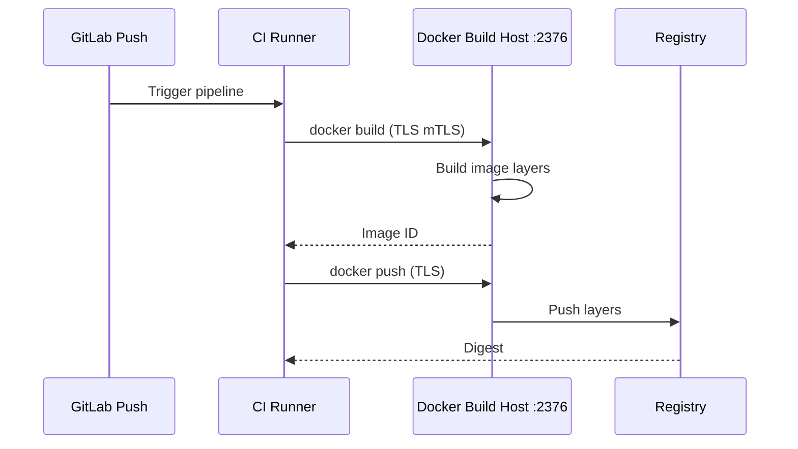

---

## 12. Concepts at a Glance

| Concept | Key Detail |
|---------|-----------|
| **dockerd** | The Docker daemon process; manages all container operations |
| **systemd service** | Docker runs as `docker.service`; controls auto-start and restart |
| **Unix socket** | `/var/run/docker.sock` — default local IPC between CLI and daemon |
| **TCP :2375** | Unencrypted remote API — never expose publicly |
| **TCP :2376** | TLS-encrypted remote API — safe for remote access with certs |
| **DOCKER_HOST** | Env var telling CLI where to connect (`unix://` or `tcp://`) |
| **DOCKER_TLS_VERIFY** | Set to `1` to require TLS verification when using TCP |
| **daemon.json** | `/etc/docker/daemon.json` — persistent config file; not created by default |
| **`--debug`** | Enables verbose logging; useful for troubleshooting startup |
| **mTLS** | Mutual TLS — both client and server present certificates |
| **`--tlsverify`** | Enables TLS and requires client certificates (stronger than `--tls`) |
| **docker group** | Users in this group have root-equivalent Docker access |
| **docker.sock mount** | Mounting socket in a container = container escape risk |
| **`no-new-privileges`** | Prevents container processes from gaining additional privileges |
| **`userns-remap`** | Maps container root to an unprivileged host user |
| **`icc: false`** | Disables default inter-container communication |
| **`live-restore`** | Keeps containers running when dockerd restarts |
| **Conflict error** | Same option in daemon.json AND CLI flag = daemon won't start |
| **systemd override** | `/etc/systemd/system/docker.service.d/override.conf` — modify unit without editing originals |

---

## 13. Commands Reference

### Service Management

```bash
# Status, start, stop, restart
systemctl status docker
systemctl start docker
systemctl stop docker
systemctl restart docker

# Enable/disable auto-start at boot
systemctl enable docker
systemctl disable docker

# View service logs
journalctl -u docker -n 50
journalctl -u docker --since "1 hour ago" -f

# View systemd unit configuration
systemctl cat docker
```

### Foreground / Debug

```bash
# Stop the service first, then run in foreground
systemctl stop docker
dockerd                    # Basic foreground
dockerd --debug            # Verbose debug output

# Start with specific host listeners
dockerd --host=unix:///var/run/docker.sock \
        --host=tcp://0.0.0.0:2376 \
        --tls \
        --tlscert=/certs/server-cert.pem \
        --tlskey=/certs/server-key.pem \
        --tlscacert=/certs/ca.pem
```

### daemon.json

```bash
# Create/edit the configuration file
nano /etc/docker/daemon.json
vim /etc/docker/daemon.json

# Validate JSON syntax before applying
python3 -m json.tool /etc/docker/daemon.json

# Apply changes (restart required for most settings)
systemctl restart docker

# Verify settings took effect
docker info
docker info | grep -E "Debug|Logging|Storage|TLS"
```

### Remote Access

```bash
# Connect to remote Docker host (no TLS)
export DOCKER_HOST="tcp://192.168.1.10:2375"
docker ps

# Connect to remote Docker host (with TLS)
export DOCKER_HOST="tcp://192.168.1.10:2376"
export DOCKER_TLS_VERIFY=1
# Place ca.pem, cert.pem, key.pem in ~/.docker/
docker ps

# Use flags instead of env vars
docker --host=tcp://192.168.1.10:2376 \
       --tls \
       --tlscacert=~/.docker/ca.pem \
       --tlscert=~/.docker/cert.pem \
       --tlskey=~/.docker/key.pem \
       ps

# Reset to local Docker
unset DOCKER_HOST
unset DOCKER_TLS_VERIFY
docker ps    # Now uses local /var/run/docker.sock
```

### Security Audit

```bash
# Check open ports on Docker host
ss -tlnp | grep dockerd
netstat -tlnp | grep -E '2375|2376'

# List docker group members
getent group docker

# Find containers with docker.sock mounted
docker ps -q | xargs docker inspect \
  --format '{{.Name}}: {{range .Mounts}}{{.Source}} {{end}}' \
  | grep docker.sock

# Check TLS is configured
docker info 2>/dev/null | grep -i tls
cat /etc/docker/daemon.json | python3 -m json.tool

# Check systemd unit for hardcoded flags
systemctl cat docker | grep ExecStart
```

### systemd Override (Fix host conflict)

```bash
# Create override directory
mkdir -p /etc/systemd/system/docker.service.d

# Write override to clear ExecStart and remove -H flag
cat > /etc/systemd/system/docker.service.d/override.conf << 'EOF'
[Service]
ExecStart=
ExecStart=/usr/bin/dockerd --containerd=/run/containerd/containerd.sock
EOF

# Apply the override
systemctl daemon-reload
systemctl restart docker
```

---

> 📝 **CKS Exam Checklist — Docker Service Configuration**
> - [ ] Know `systemctl start/stop/status/restart docker`
> - [ ] Know `dockerd --debug` for foreground troubleshooting
> - [ ] Know the Unix socket location: `/var/run/docker.sock`
> - [ ] Know port `2375` = unencrypted (dangerous), `2376` = TLS (secure)
> - [ ] Know how to set `DOCKER_HOST` and `DOCKER_TLS_VERIFY`
> - [ ] Know that `/etc/docker/daemon.json` is not created by default
> - [ ] Know that daemon.json + CLI flag conflict = Docker fails to start
> - [ ] Know how to fix the conflict with a systemd override file
> - [ ] Know the `--tlsverify` flag requires client certificate authentication
> - [ ] Understand why docker.sock mounts in containers are dangerous
> - [ ] Know `docker info` to inspect current daemon settings
