# 18 — Securing Node Metadata in Kubernetes

> **CKS Domain:** Cluster Setup & Hardening  
> **Weight:** Medium — cloud metadata endpoint attacks are a classic CKS scenario  
> **TL;DR:** Every cloud node has an internal metadata API (IMDS) accessible at `169.254.169.254`. A compromised pod can query it to steal IAM credentials and escape to the cloud control plane. Block it with NetworkPolicy and enforce IMDSv2.

---

## Table of Contents

1. [What is Node Metadata?](#1-what-is-node-metadata)
2. [Node Metadata Components — Deep Dive](#2-node-metadata-components--deep-dive)
3. [Reasons to Secure Node Metadata](#3-reasons-to-secure-node-metadata)
4. [Why Node Metadata is a Security Risk](#4-why-node-metadata-is-a-security-risk)
5. [The Cloud Metadata Attack — IMDS](#5-the-cloud-metadata-attack--imds)
6. [Protecting the Metadata Endpoint with NetworkPolicy](#6-protecting-the-metadata-endpoint-with-networkpolicy)
7. [Cloud Provider IMDS Security — IMDSv2](#7-cloud-provider-imds-security--imdsv2)
8. [RBAC — Restricting Access to Node Objects](#8-rbac--restricting-access-to-node-objects)
9. [Monitoring and Auditing Node Metadata Access](#9-monitoring-and-auditing-node-metadata-access)
10. [Real-World Attack Scenarios](#10-real-world-attack-scenarios)
11. [Concepts at a Glance](#11-concepts-at-a-glance)
12. [Commands Reference](#12-commands-reference)

---

## 1. What is Node Metadata?

### The Hotel Analogy

Think of a Kubernetes cluster as a **hotel**. Each node is a room. Just as a hotel room has a room number, floor, occupancy status, amenities, and maintenance history, a Kubernetes **node** carries rich metadata that describes its identity, capabilities, and current state.

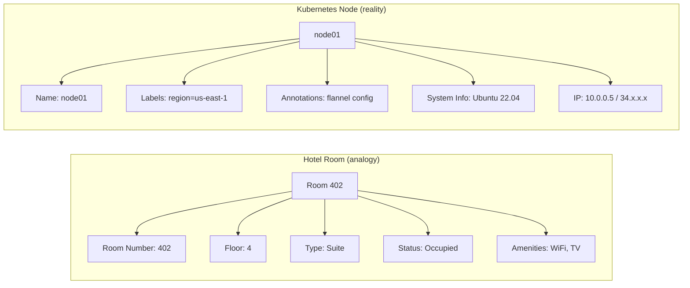

### Why Metadata Matters

Node metadata serves two masters — **operations** and **security**:

| Purpose | Examples |
|---------|----------|
| **Scheduling** | Labels tell the scheduler where to place pods (`region=us-east-1`) |
| **Networking** | Annotations carry CNI config (Flannel VNI, VTEP MAC) |
| **Monitoring** | System info feeds observability tools (Prometheus node exporter) |
| **Auto-scaling** | Cloud provider IDs enable cloud controllers to scale node groups |
| **Security** | Kubelet version reveals patch level; kernel version reveals CVE exposure |
| **Compliance** | Labels/annotations used for policy enforcement (OPA Gatekeeper) |

---

## 2. Node Metadata Components — Deep Dive


### Component 1 — Node Name & Unique Identity

Every node has a unique name used to identify it across the cluster:

```bash
kubectl get nodes
# NAME       STATUS   ROLES           AGE   VERSION
# node01     Ready    worker          10d   v1.30.0
# node02     Ready    worker          10d   v1.30.0
# control    Ready    control-plane   10d   v1.30.0
```

### Component 2 — Labels

Key-value pairs that categorize nodes. Used heavily by `nodeSelector` and `nodeAffinity` in pod specs.

```yaml
Labels:
  beta.kubernetes.io/arch: amd64
  beta.kubernetes.io/os: linux
  kubernetes.io/arch: amd64
  kubernetes.io/hostname: node01
  kubernetes.io/os: linux
  region: us-east-1                      # Custom label — geographic placement
  node.kubernetes.io/instance-type: t3.large  # Cloud instance type
  topology.kubernetes.io/zone: us-east-1a
```

**Security risk:** Labels can reveal cloud provider, region, instance type, and infrastructure topology to anyone who can query node objects.

### Component 3 — Annotations

Unstructured metadata used by tools, operators, and controllers. More verbose than labels.

```yaml
Annotations:
  flannel.alpha.coreos.com/backend-data: '{"VNI":1,"VtepMAC":"a2:bd:8e:41:63:65"}'
  flannel.alpha.coreos.com/backend-type: vxlan
  flannel.alpha.coreos.com/public-ip: 192.168.87.255          # Node's public IP
  kubeadm.alpha.kubernetes.io/cri-socket: unix:///var/run/containerd/containerd.sock
  node.alpha.kubernetes.io/ttl: "0"
  volumes.kubernetes.io/controller-managed-attach-detach: "true"
```

**Security risk:** Annotations can expose internal network topology, CRI socket paths, and tool-specific config that aids lateral movement.

### Component 4 — System Info


```yaml
System Info:
  Machine ID:               69ee5c89434f4d5baea262a6ecc698fe
  System UUID:              8ab83d3f-465d-36a9-6ec2-b7e9e7ad6a45
  Boot ID:                  8059e764-a637-45f0-abd9-36e9a366e719
  Kernel Version:           5.15.0-1065-gcp
  OS Image:                 Ubuntu 22.04.4 LTS
  Operating System:         linux
  Architecture:             amd64
  Container Runtime Version: containerd://1.6.26
  Kubelet Version:          v1.30.0
  Kube-Proxy Version:       v1.30.0
```

**Security risk of each field:**

| Field | Why it's sensitive |
|-------|-------------------|
| **Machine ID** | Unique hardware identifier — used for fingerprinting and licensing attacks |
| **System UUID** | Same as above — uniquely identifies the VM across reboots |
| **Kernel Version** | Reveals which kernel CVEs the node is vulnerable to |
| **Container Runtime Version** | Reveals containerd/runc version — maps to known escapes |
| **Kubelet Version** | Maps to specific Kubernetes CVEs |
| **OS Image** | Reveals distribution — used to target known vulnerabilities |

### Component 5 — Addresses

```yaml
Addresses:
  - type: InternalIP
    address: 10.0.0.5        # Private LAN IP (within the cluster VPC)
  - type: ExternalIP
    address: 34.123.45.67    # Public IP (internet-facing)
  - type: Hostname
    address: node01
```

### Component 6 — Conditions, Capacity, and More


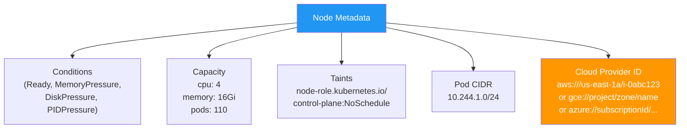

**Cloud Provider IDs — the most sensitive field:**

| Cloud | Provider ID format | What it reveals |
|-------|-------------------|-----------------|
| **AWS** | `aws:///us-east-1a/i-0abc123def` | Region, AZ, EC2 instance ID |
| **GCP** | `gce://project-name/us-central1-a/node-name` | Project name, zone, instance name |
| **Azure** | `azure:///subscriptions/SUB-ID/resourceGroups/RG/providers/...` | Subscription ID, resource group |

---

## 3. Reasons to Secure Node Metadata

### The Hotel Analogy — VIP Guests and Secure Rooms

Think of a Kubernetes cluster as a hotel with different classes of guests:

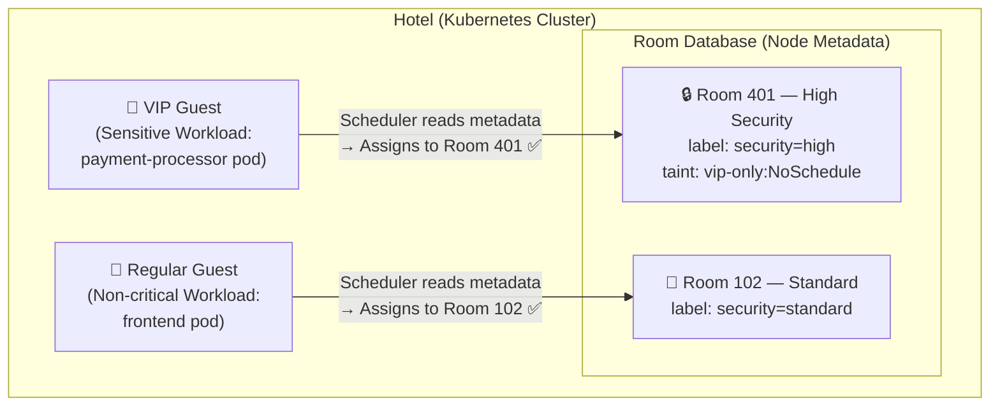

**If metadata is tampered:**

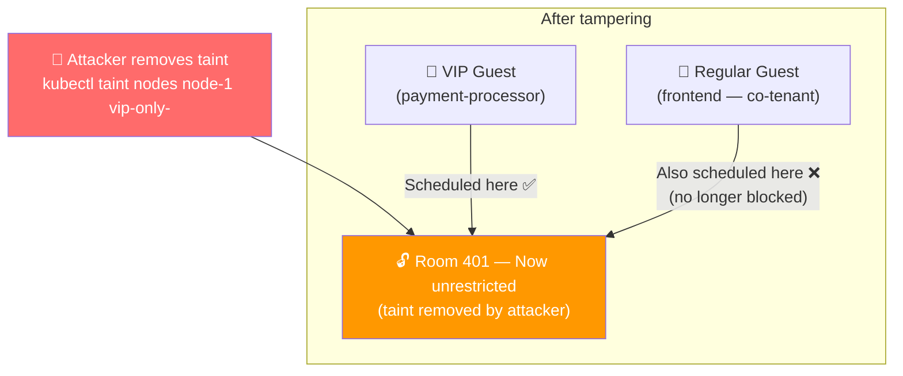


> 💡 Tampered node metadata (such as removed taints or modified security labels) can cause **sensitive workloads to be scheduled on insecure nodes** — directly violating your isolation guarantees.

---

### Risk 1 — Improper Workload Scheduling

**What can go wrong:** If an attacker removes a critical taint from a production node, non-production workloads can land on that node — causing resource contention, noisy-neighbour effects, or data co-mingling.

```bash
# Attacker removes a taint that was protecting a sensitive node
kubectl taint nodes node-1 key=value:NoSchedule-
# node/node-1 untainted

# Now any pod that previously couldn't schedule here CAN run here
# Including untrusted, low-privilege workloads co-located with payment data
```

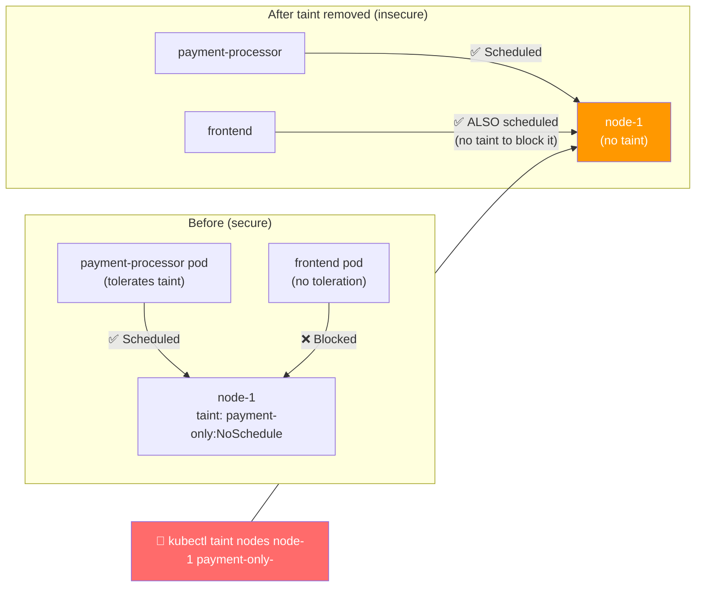

**Fix — prevent unauthorized label/taint changes:**

```yaml
# OPA Gatekeeper / Kyverno policy: prevent removal of critical taints
# Example Kyverno rule:
apiVersion: kyverno.io/v1
kind: ClusterPolicy
metadata:
  name: protect-node-taints
spec:
  rules:
  - name: block-taint-removal
    match:
      resources:
        kinds: ["Node"]
    validate:
      message: "Removal of payment-only taint is not permitted"
      deny:
        conditions:
        - key: "{{ request.object.spec.taints[?key=='payment-only'] | length(@) }}"
          operator: LessThan
          value: "{{ request.oldObject.spec.taints[?key=='payment-only'] | length(@) }}"
```

---

### Risk 2 — Unauthorized Data Exposure (Version-Specific Exploits)

**What can go wrong:** Anyone with `get nodes` RBAC permission can extract the kubelet version of every node. Attackers use this to identify which CVEs apply to your cluster and launch targeted exploits.

```bash
# An attacker with basic kubectl access discovers kubelet versions
kubectl get nodes -o jsonpath='{.items[*].status.nodeInfo.kubeletVersion}'
# v1.24.0  v1.24.0  v1.23.5
# ↑ These versions may be vulnerable to known CVEs!
```

**Example CVEs exposed by version disclosure:**

| Kubelet Version | Known CVE | Impact |
|----------------|-----------|--------|
| < 1.28.4 | CVE-2023-5528 | Node privilege escalation via hostPath |
| < 1.27.8 | CVE-2023-3955 | Windows node privilege escalation |
| < 1.25.0 | CVE-2022-3172 | Aggregated API server SSRF |
| < 1.24.0 | CVE-2021-25741 | Symlink exchange host filesystem access |

```bash
# Attacker also extracts kernel versions
kubectl get nodes -o jsonpath='{.items[*].status.nodeInfo.kernelVersion}'
# 5.4.0-1041-aws  4.15.0-142-generic  5.8.0-53-generic
# ↑ 4.15 kernel → vulnerable to Dirty COW, Spectre, Meltdown variants

# Container runtime versions
kubectl get nodes -o jsonpath='{.items[*].status.nodeInfo.containerRuntimeVersion}'
# containerd://1.6.1  containerd://1.6.1
# ↑ containerd 1.6.1 → CVE-2022-23648 (container escape)
```

**Fix:**

```yaml
# Restrict node read access via RBAC — most workloads don't need it
apiVersion: rbac.authorization.k8s.io/v1
kind: ClusterRole
metadata:
  name: limited-node-reader
rules:
- apiGroups: [""]
  resources: ["nodes"]
  verbs: ["list"]           # list only (no get = no -o yaml detail)
  # Do NOT add "get" — that exposes full nodeInfo including versions
```

---

### Risk 3 — Network Mapping and DDoS Attacks

**What can go wrong:** Node IP addresses extracted from Kubernetes metadata give an attacker a complete internal network map — identifying targets for DDoS, lateral movement, or scanning.

```bash
# List all internal node IPs — instant internal network map
kubectl get nodes -o jsonpath='{.items[*].status.addresses[?(@.type=="InternalIP")].address}'
# 10.0.1.10  10.0.1.11  10.0.1.12  10.0.2.5

# List all external IPs
kubectl get nodes -o jsonpath='{.items[*].status.addresses[?(@.type=="ExternalIP")].address}'
# 34.123.45.67  34.123.45.68  34.123.45.69
```

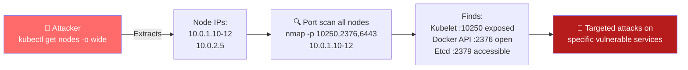

**Pod CIDR exposure:**

```bash
# Pod CIDRs reveal the entire container network layout
kubectl get nodes -o jsonpath='{.items[*].spec.podCIDR}'
# 10.244.0.0/24  10.244.1.0/24  10.244.2.0/24
# Now attacker knows every IP range where pods can exist
```

**Fix:**

```bash
# Restrict who can list nodes
# Use Kubernetes audit logging to detect bulk node listing
# Alert on: any non-system user running kubectl get nodes -o wide or -o json
```

---

### Risk 4 — Compliance Violations (GDPR, HIPAA, PCI-DSS)

**What can go wrong:** Regulatory frameworks require organisations to demonstrate control over who accesses infrastructure details. Exposed kernel versions, machine IDs, and system UUIDs can constitute a reportable data exposure.

```bash
# These outputs may constitute sensitive infrastructure data under compliance frameworks:
kubectl get nodes -o jsonpath='{.items[*].status.nodeInfo.kernelVersion}'
# GDPR: Infrastructure data about processing systems

kubectl get nodes -o jsonpath='{.items[*].status.nodeInfo.machineID}'
# HIPAA: System identifiers used in audit trails must be protected

kubectl get nodes -o jsonpath='{.items[*].spec.providerID}'
# PCI-DSS: Cloud resource IDs reveal cardholder data environment scope
```

| Regulation | What it requires | Node metadata risk |
|-----------|-----------------|-------------------|
| **GDPR** | Protect personal data processing infrastructure | Machine IDs, system UUIDs identify specific systems |
| **HIPAA** | Audit trails and system access control | Kernel/runtime versions enable targeted exploits against PHI systems |
| **PCI-DSS** | Network segmentation evidence | Pod CIDRs, node IPs reveal cardholder data environment topology |
| **SOC 2** | Change management controls | Unauthorised taint/label changes violate change management |

**Fix — Compliance-oriented RBAC:**

```yaml
# Log all node access for compliance audit trail
# In kube-apiserver audit policy:
- level: Metadata          # Log who, when, what — not the full response body
  resources:
  - group: ""
    resources: ["nodes"]
  verbs: ["get", "list", "watch", "patch", "update"]
```

---

### Summary — The Four Reasons at a Glance

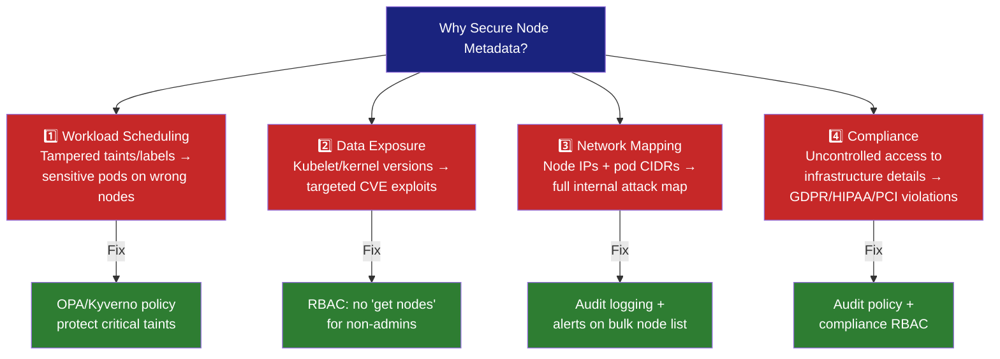

> ⚠️ **Improper handling of node metadata can expose your Kubernetes environment to critical vulnerabilities. Always enforce strict access controls and regularly audit metadata for unauthorized changes.**

---

## 4. Why Node Metadata is a Security Risk

Node metadata exists in two places:

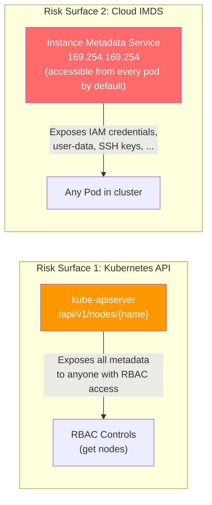

### Risk 1: Kubernetes API — Node Objects

```bash
# Anyone with 'get nodes' RBAC permission can see all metadata:
kubectl get node node01 -o yaml

# Including: kernel version, containerd version, cloud provider ID,
# internal/external IPs, labels, annotations, machine UUID
```

### Risk 2: Cloud IMDS — The Bigger Threat

The **Instance Metadata Service (IMDS)** is a special HTTP endpoint at `169.254.169.254` (a link-local address) that every cloud VM can reach. It provides the instance with information about itself — including **temporary IAM/service account credentials**.

```bash
# From inside ANY pod on AWS EC2 node (by default, no auth needed):
curl http://169.254.169.254/latest/meta-data/
# ami-id
# hostname
# iam/                          ← Contains temporary AWS credentials!
# instance-id
# instance-type
# public-ipv4
# local-ipv4

# Steal the IAM role credentials:
curl http://169.254.169.254/latest/meta-data/iam/security-credentials/
# MyEC2Role                     ← role name

curl http://169.254.169.254/latest/meta-data/iam/security-credentials/MyEC2Role
# {
#   "AccessKeyId": "ASIA...",
#   "SecretAccessKey": "...",
#   "Token": "...",
#   "Expiration": "2024-..."
# }
```

**With these credentials, the attacker can:**

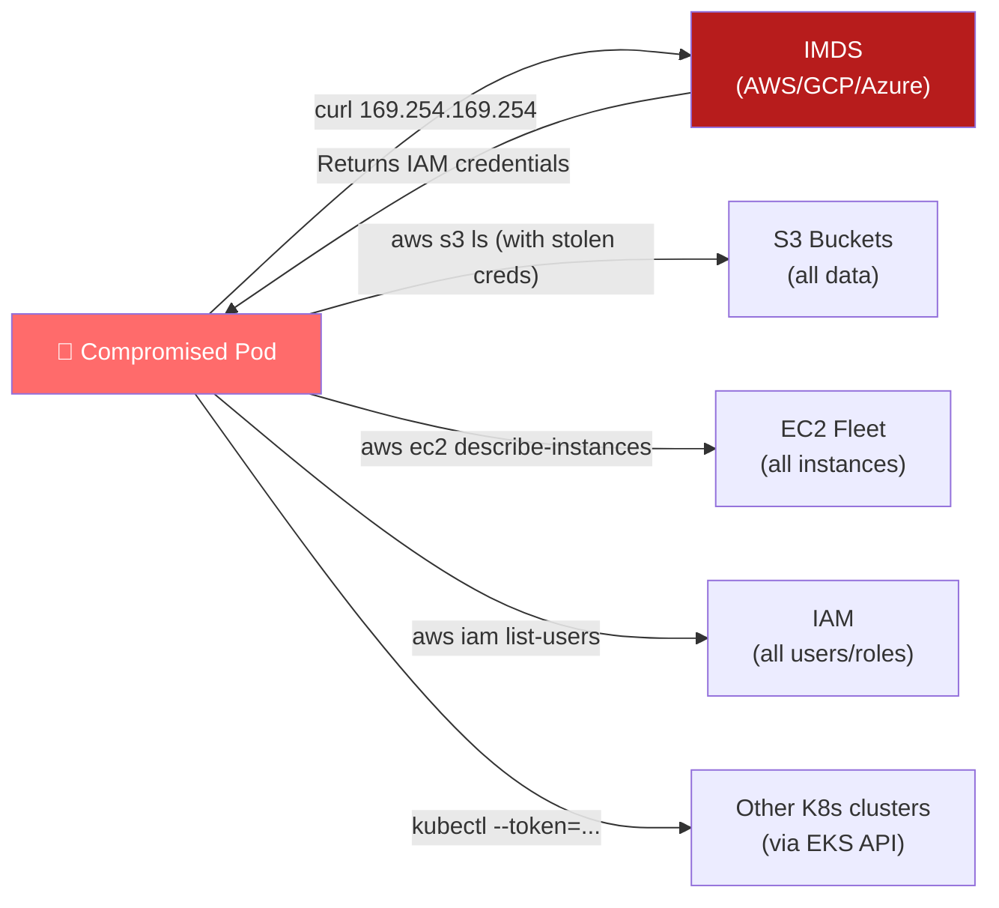

---

## 5. The Cloud Metadata Attack — IMDS

### Full Attack Chain: SSRF → IMDS → Cloud Takeover

**SSRF (Server-Side Request Forgery):** An attacker tricks an application running in a pod into making HTTP requests to internal endpoints — like `169.254.169.254`.

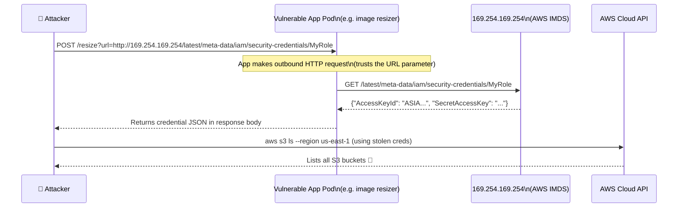

### IMDS Endpoints by Cloud Provider

| Cloud | Base URL | Credential endpoint |
|-------|----------|---------------------|
| **AWS** | `http://169.254.169.254/latest/meta-data/` | `/iam/security-credentials/<role-name>` |
| **GCP** | `http://metadata.google.internal/computeMetadata/v1/` | `/instance/service-accounts/default/token` |
| **Azure** | `http://169.254.169.254/metadata/instance` | `http://169.254.169.254/metadata/identity/oauth2/token` |

### What Each Cloud Exposes

```bash
# ─── AWS ───────────────────────────────────────────────────────────
curl http://169.254.169.254/latest/meta-data/iam/security-credentials/
# Returns role name

curl http://169.254.169.254/latest/meta-data/iam/security-credentials/RoleName
# Returns: AccessKeyId, SecretAccessKey, Token, Expiration

curl http://169.254.169.254/latest/user-data
# Returns: user-data script (may contain passwords, bootstrap secrets)

# ─── GCP ───────────────────────────────────────────────────────────
curl -H "Metadata-Flavor: Google" \
  http://metadata.google.internal/computeMetadata/v1/instance/service-accounts/default/token
# Returns: OAuth2 access token for the node's service account

curl -H "Metadata-Flavor: Google" \
  http://metadata.google.internal/computeMetadata/v1/project/attributes/
# Returns: project-level attributes (may contain SSH keys, secrets)

# ─── Azure ─────────────────────────────────────────────────────────
curl -H "Metadata: true" \
  "http://169.254.169.254/metadata/identity/oauth2/token?api-version=2018-02-01&resource=https://management.azure.com/"
# Returns: access_token for Azure Resource Manager
```

---

## 6. Protecting the Metadata Endpoint with NetworkPolicy

The most direct Kubernetes-native defence: **block pods from reaching `169.254.169.254`** using a NetworkPolicy with an `ipBlock` rule.

### Default Deny + Allow-list Pattern

```yaml
# ─── Step 1: Default deny all egress for all pods ───────────────────
apiVersion: networking.k8s.io/v1
kind: NetworkPolicy
metadata:
  name: default-deny-egress
  namespace: production
spec:
  podSelector: {}           # All pods in namespace
  policyTypes:
  - Egress
  egress:
  - to:
    ports:
    - protocol: UDP
      port: 53              # Always allow DNS
    - protocol: TCP
      port: 53
```

```yaml
# ─── Step 2: Block IMDS specifically (apply cluster-wide) ───────────
apiVersion: networking.k8s.io/v1
kind: NetworkPolicy
metadata:
  name: block-metadata-endpoint
  namespace: production
spec:
  podSelector: {}           # All pods in namespace
  policyTypes:
  - Egress
  egress:
  - to:
    - ipBlock:
        cidr: 0.0.0.0/0     # Allow all outbound...
        except:
        - 169.254.169.254/32  # ...except the IMDS endpoint
```

```yaml
# ─── Step 3: Allow only specific pods that legitimately need IMDS ───
apiVersion: networking.k8s.io/v1
kind: NetworkPolicy
metadata:
  name: allow-imds-for-node-exporter
  namespace: kube-system
spec:
  podSelector:
    matchLabels:
      app: node-exporter      # Only Prometheus node-exporter needs IMDS
  policyTypes:
  - Egress
  egress:
  - to:
    - ipBlock:
        cidr: 169.254.169.254/32
    ports:
    - protocol: TCP
      port: 80
```

### Verification

```bash
# Apply policies
kubectl apply -f block-metadata-endpoint.yaml

# Test from a regular pod — should FAIL (timeout)
kubectl run test --image=busybox --rm -it -- \
  wget -qO- --timeout=3 http://169.254.169.254/latest/meta-data/
# wget: download timed out (NetworkPolicy blocking egress) ✅

# Test from node-exporter pod — should succeed
kubectl exec -n kube-system $(kubectl get pod -n kube-system -l app=node-exporter -o name | head -1) -- \
  wget -qO- http://169.254.169.254/latest/meta-data/instance-id
# i-0abc123def456 ✅
```

### Architecture After NetworkPolicy

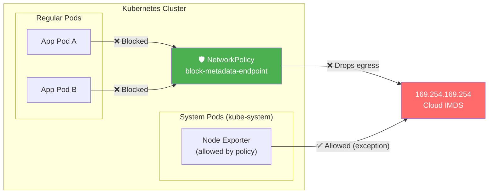

---

## 7. Cloud Provider IMDS Security — IMDSv2

NetworkPolicy alone isn't enough if the CNI doesn't enforce it, or if there are privileged pods. Cloud providers offer their own metadata endpoint hardening.

### AWS — IMDSv1 vs IMDSv2

**IMDSv1** (legacy): Simple GET request, no authentication required — any code that makes an HTTP request can steal credentials.

**IMDSv2** (token-based): Requires a PUT request to get a session token first. SSRF attacks (which typically only follow redirects or make GET requests) cannot obtain the token.

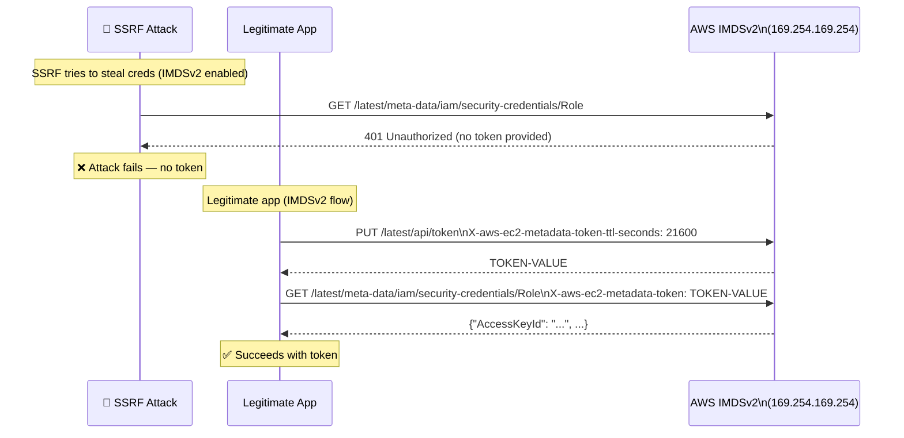

### Enforcing IMDSv2 on AWS

```bash
# For new instances — enforce IMDSv2 at launch
aws ec2 run-instances \
  --image-id ami-xxx \
  --metadata-options "HttpTokens=required,HttpPutResponseHopLimit=1"

# For existing instances — modify metadata options
aws ec2 modify-instance-metadata-options \
  --instance-id i-0abc123 \
  --http-tokens required \
  --http-put-response-hop-limit 1    # 1 hop = pod cannot reach IMDS (only the node itself)

# Verify
aws ec2 describe-instances \
  --instance-ids i-0abc123 \
  --query 'Reservations[].Instances[].MetadataOptions'
# {
#   "State": "applied",
#   "HttpTokens": "required",       ← IMDSv2 enforced ✅
#   "HttpPutResponseHopLimit": 1,   ← Only the node itself can reach IMDS ✅
# }
```

> 💡 **Hop limit of 1** is critical for Kubernetes. Containers run in network namespaces with a TTL of 1 by default. Setting the hop limit to 1 means only the node's primary network namespace (not pods) can reach IMDS. This is the **strongest protection** available.

### GCP — Metadata Concealment

```bash
# Disable legacy metadata endpoints on GKE nodes
gcloud container clusters update CLUSTER_NAME \
  --workload-metadata=GKE_METADATA

# Or per node pool:
gcloud container node-pools update POOL_NAME \
  --cluster CLUSTER_NAME \
  --workload-metadata=GKE_METADATA

# GKE_METADATA: Nodes use Workload Identity — pods get per-pod service accounts
# instead of the node's service account. Limits blast radius.
```

### Azure — Managed Identity Scoping

```bash
# Use pod-managed identity (Azure AD Workload Identity)
# instead of node-level managed identity
# This gives each pod its own scoped Azure AD token
# rather than inheriting the node's full managed identity permissions
```

### Cloud Provider IMDS Protection Comparison

| Cloud | Native Protection | Kubernetes Integration |
|-------|------------------|----------------------|
| **AWS** | IMDSv2 with hop limit=1 | EKS: IRSA (IAM Roles for Service Accounts) |
| **GCP** | Workload Identity | GKE: per-pod Google service accounts |
| **Azure** | Pod-level Managed Identity | AKS: Azure AD Workload Identity |

> ✅ **Best Practice:** Use pod-level cloud identities (IRSA/Workload Identity) instead of relying on node-level credentials from IMDS. Each pod gets scoped credentials — a compromised pod can only access what its own service account permits, not the full node IAM role.

---

## 8. RBAC — Restricting Access to Node Objects

Node metadata in the **Kubernetes API** (`kubectl get node -o yaml`) is also sensitive. Control who can read it.

### Principle: Limit Node Read Access

```yaml
# ❌ WRONG: Giving developers broad node access
apiVersion: rbac.authorization.k8s.io/v1
kind: ClusterRole
metadata:
  name: developer-role
rules:
- apiGroups: [""]
  resources: ["nodes"]
  verbs: ["get", "list", "watch"]   # Full node metadata visible to all devs
```

```yaml
# ✅ BETTER: Restrict to node status only (not full spec)
apiVersion: rbac.authorization.k8s.io/v1
kind: ClusterRole
metadata:
  name: node-reader-limited
rules:
- apiGroups: [""]
  resources: ["nodes/status"]       # Status only — no labels, annotations, system info
  verbs: ["get", "list"]
- apiGroups: [""]
  resources: ["nodes"]
  verbs: ["list"]                   # List names only — no -o yaml
```

```yaml
# ✅ BEST for most workloads: No node access at all
# Workloads should use pod/service APIs, not node APIs
# Only monitoring tools and cluster admins need node access
```

### Audit Who Has Node Access

```bash
# Find all ClusterRoles that can read nodes
kubectl get clusterroles -o json | \
  jq '.items[] | select(.rules[]? | select(.resources[]? == "nodes") | select(.verbs[]? | contains("get"))) | .metadata.name'

# Find all ClusterRoleBindings for those roles
kubectl get clusterrolebindings -o json | \
  jq '.items[] | select(.roleRef.name == "system:node-reader") | .subjects'

# Check your own permissions
kubectl auth can-i get nodes
kubectl auth can-i get nodes --as=developer-user
```

### Node Authorization Mode

Kubernetes has a built-in **Node Authorizer** (`--authorization-mode=Node`) that restricts what the kubelet (running as `system:node:<name>` in the `system:nodes` group) can access. This prevents a compromised kubelet on one node from reading secrets or pods on other nodes.

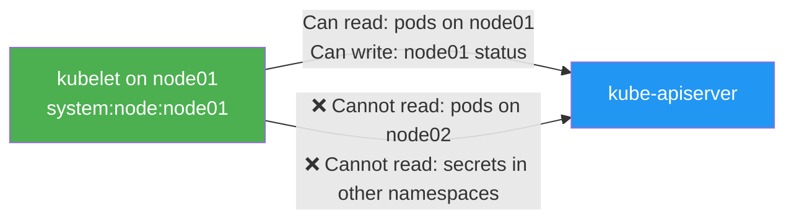

---

## 9. Monitoring and Auditing Node Metadata Access

### Enable Kubernetes Audit Logging for Node Access

```yaml
# /etc/kubernetes/audit-policy.yaml
apiVersion: audit.k8s.io/v1
kind: Policy
rules:
# Log all access to node objects at RequestResponse level
- level: RequestResponse
  resources:
  - group: ""
    resources: ["nodes", "nodes/status", "nodes/proxy"]
  verbs: ["get", "list", "watch"]

# Log any modifications to node labels/annotations
- level: RequestResponse
  resources:
  - group: ""
    resources: ["nodes"]
  verbs: ["patch", "update"]
```

```bash
# Enable audit logging on the API server
# /etc/kubernetes/manifests/kube-apiserver.yaml:
# - --audit-log-path=/var/log/kubernetes/audit.log
# - --audit-policy-file=/etc/kubernetes/audit-policy.yaml
# - --audit-log-maxage=30
# - --audit-log-maxbackup=10
# - --audit-log-maxsize=100
```

### Detecting IMDS Access from Pods

```bash
# On AWS — enable CloudTrail to detect IMDS credential usage from unexpected sources
aws cloudtrail create-trail \
  --name k8s-node-metadata-trail \
  --s3-bucket-name my-audit-bucket

# Alert on: AssumedRole events from EC2 instance profiles
# where the source IP is a pod IP (not the node IP)
# This indicates a pod successfully accessed IMDS credentials

# Simple detection: Compare IAM API calls
# If source IP is in pod CIDR range (e.g., 10.244.0.0/16) → pod accessed IMDS
```

### Falco Rules for IMDS Access Detection

[Falco](https://falco.org/) is a runtime security tool that can detect unexpected metadata endpoint access:

```yaml
# Falco rule: Alert if any process contacts the metadata endpoint
- rule: Contact Cloud Metadata Service From Container
  desc: Detect attempts to contact the cloud metadata service from a container
  condition: >
    evt.type = connect and
    container and
    fd.sip = "169.254.169.254"
  output: >
    Metadata service contacted from container
    (user=%user.name command=%proc.cmdline container=%container.name
    image=%container.image.repository:%container.image.tag
    pod=%k8s.pod.name ns=%k8s.ns.name)
  priority: WARNING
  tags: [network, mitre_discovery]
```

---

## 10. Real-World Attack Scenarios

### Scenario 1: Capital One Breach (2019) — SSRF + IMDS = $80M Fine

The most famous cloud metadata attack. A WAF (Web Application Firewall) running on AWS EC2 was misconfigured to follow SSRF requests. An attacker exploited this to:

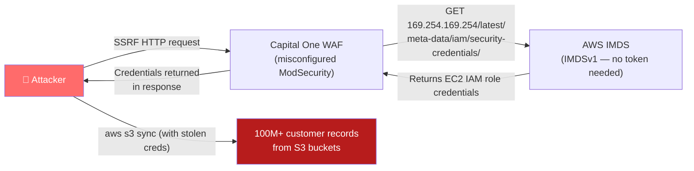

**What would have stopped it:**
- IMDSv2 enforced (token required — SSRF can't do PUT requests)
- `HttpPutResponseHopLimit=1` (pods/containers can't reach IMDS)
- NetworkPolicy blocking `169.254.169.254` from the WAF pod

---

### Scenario 2: Pod Compromise → Node Metadata → Cluster Takeover

A pod with a remote code execution vulnerability:

```bash
# Attacker gains shell in pod via RCE
# Step 1: Check if IMDS is reachable
curl -s --max-time 2 http://169.254.169.254/latest/meta-data/
# Returns data → IMDS accessible!

# Step 2: Get IAM role name
curl -s http://169.254.169.254/latest/meta-data/iam/security-credentials/
# EKSNodeRole

# Step 3: Steal credentials
CREDS=$(curl -s http://169.254.169.254/latest/meta-data/iam/security-credentials/EKSNodeRole)
export AWS_ACCESS_KEY_ID=$(echo $CREDS | jq -r '.AccessKeyId')
export AWS_SECRET_ACCESS_KEY=$(echo $CREDS | jq -r '.SecretAccessKey')
export AWS_SESSION_TOKEN=$(echo $CREDS | jq -r '.Token')

# Step 4: Discover the cluster
aws eks list-clusters --region us-east-1

# Step 5: Get kubeconfig and take over the cluster
aws eks update-kubeconfig --name prod-cluster --region us-east-1
kubectl get secrets --all-namespaces   # Access all secrets
kubectl create clusterrolebinding pwn --clusterrole=cluster-admin --serviceaccount=default:default
```

**Fix — Apply all three defences together:**

```bash
# Defence 1: NetworkPolicy (immediate, no cloud dependency)
kubectl apply -f block-imds-policy.yaml

# Defence 2: IMDSv2 with hop limit (node-level protection)
aws ec2 modify-instance-metadata-options \
  --instance-id $(curl -s http://169.254.169.254/latest/meta-data/instance-id) \
  --http-tokens required \
  --http-put-response-hop-limit 1

# Defence 3: Use IRSA instead of node-level IAM role (least privilege)
# Pods get only the permissions they need — not the full EKSNodeRole
```

### Scenario 3: Sensitive Labels Leaked via kubectl

A developer with read-only access to nodes discovers infrastructure details:

```bash
kubectl get nodes -o yaml | grep -A 20 "labels:"
# Reveals:
#   node.kubernetes.io/instance-type: r5.4xlarge    ← Reveals cost tier
#   topology.kubernetes.io/zone: us-east-1a          ← Single AZ → SLA risk
#   kops.k8s.io/instancegroup: spot-nodes             ← Using spot instances
#   eks.amazonaws.com/nodegroup: prod-critical         ← Internal naming
```

**Fix:**

```yaml
# Limit RBAC — don't give developers ClusterRole with node get/list
# Create a scoped role for what they actually need:
apiVersion: rbac.authorization.k8s.io/v1
kind: ClusterRole
metadata:
  name: developer-read
rules:
- apiGroups: [""]
  resources: ["pods", "services", "configmaps"]   # No nodes
  verbs: ["get", "list", "watch"]
```

---

## 11. Concepts at a Glance

| Concept | Key Detail |
|---------|-----------|
| **Node Metadata** | Rich set of attributes on a Kubernetes node: labels, annotations, system info, IPs, cloud provider ID |
| **Labels** | Key-value pairs used for scheduling, topology, and grouping — can reveal cloud region, instance type |
| **Annotations** | Unstructured tool-specific data — can expose network config, CRI socket paths |
| **System Info** | Kernel version, OS, container runtime, kubelet version — maps directly to CVEs |
| **Machine ID / System UUID** | Unique VM identifiers — used for fingerprinting |
| **Cloud Provider ID** | AWS instance ID / GCP instance name / Azure resource ID embedded in node spec |
| **IMDS** | Instance Metadata Service — HTTP endpoint at `169.254.169.254` accessible from all pods by default |
| **IMDSv1** | Legacy IMDS — GET-based, no auth required, trivial to exploit via SSRF |
| **IMDSv2** | Token-based IMDS — PUT request required first; SSRF-resistant |
| **Hop limit** | `HttpPutResponseHopLimit=1` on AWS — prevents containers (TTL=0 after one hop) from reaching IMDS |
| **SSRF** | Server-Side Request Forgery — tricks app into making requests to `169.254.169.254` |
| **ipBlock NetworkPolicy** | Blocks pod egress to `169.254.169.254/32` — most direct Kubernetes protection |
| **Node Authorizer** | Kubernetes authorization mode limiting kubelet to only its own node's resources |
| **IRSA** | IAM Roles for Service Accounts (AWS) — pod-level cloud credentials, no IMDS needed |
| **Workload Identity** | GCP equivalent of IRSA — per-pod Google service accounts |
| **Falco** | Runtime security tool — detects unexpected metadata endpoint access in real time |
| **169.254.169.254** | Link-local IP address of the IMDS endpoint (same on AWS and Azure) |
| **metadata.google.internal** | GCP's IMDS hostname (resolves to 169.254.169.254) |
| **`Metadata-Flavor: Google`** | Required header for GCP IMDS requests (partial SSRF protection) |

---

## 12. Commands Reference

### Viewing Node Metadata

```bash
# Full node metadata (YAML)
kubectl get node <node-name> -o yaml

# Just labels
kubectl get node <node-name> --show-labels

# Just annotations
kubectl get node <node-name> -o jsonpath='{.metadata.annotations}' | jq

# System info
kubectl get node <node-name> -o jsonpath='{.status.nodeInfo}' | jq

# Cloud provider ID
kubectl get node <node-name> -o jsonpath='{.spec.providerID}'

# All node IPs
kubectl get node <node-name> -o jsonpath='{.status.addresses}' | jq

# Conditions
kubectl describe node <node-name> | grep -A 10 "Conditions:"

# All nodes with their versions
kubectl get nodes -o custom-columns=\
NAME:.metadata.name,\
KUBELET:.status.nodeInfo.kubeletVersion,\
KERNEL:.status.nodeInfo.kernelVersion,\
OS:.status.nodeInfo.osImage
```

### IMDS Access Testing

```bash
# Test IMDS reachability from a pod (should fail if NetworkPolicy applied)
kubectl run imds-test --image=busybox --rm -it -- \
  wget -qO- --timeout=3 http://169.254.169.254/latest/meta-data/
# Should timeout ✅ (policy working) or return data ❌ (policy missing)

# Test from node directly (should still work — node legitimately needs IMDS)
ssh node01 curl -s http://169.254.169.254/latest/meta-data/instance-id

# AWS: Check IMDS options on an instance
aws ec2 describe-instances \
  --instance-ids <instance-id> \
  --query 'Reservations[].Instances[].MetadataOptions'
```

### NetworkPolicy for IMDS Protection

```bash
# Apply block policy
kubectl apply -f - <<EOF
apiVersion: networking.k8s.io/v1
kind: NetworkPolicy
metadata:
  name: block-metadata-endpoint
  namespace: default
spec:
  podSelector: {}
  policyTypes:
  - Egress
  egress:
  - to:
    - ipBlock:
        cidr: 0.0.0.0/0
        except:
        - 169.254.169.254/32
  - to:
    ports:
    - protocol: UDP
      port: 53
    - protocol: TCP
      port: 53
EOF

# Verify the policy exists
kubectl get networkpolicy block-metadata-endpoint

# Test that it works
kubectl run test --image=busybox --rm -it -- \
  sh -c "wget -qO- --timeout=3 http://169.254.169.254/latest/meta-data/ && echo REACHABLE || echo BLOCKED"
```

### AWS IMDSv2 Enforcement

```bash
# Enforce IMDSv2 on a running instance
aws ec2 modify-instance-metadata-options \
  --instance-id <instance-id> \
  --http-tokens required \
  --http-put-response-hop-limit 1

# Enforce on all instances in an EKS node group
aws eks update-nodegroup-config \
  --cluster-name prod \
  --nodegroup-name workers \
  --update-config maxUnavailable=1

# Verify
aws ec2 describe-instances \
  --instance-ids <instance-id> \
  --query 'Reservations[].Instances[].MetadataOptions.HttpTokens'
# "required" ✅

# Check via IMDSv2 token flow (legitimate use)
TOKEN=$(curl -s -X PUT "http://169.254.169.254/latest/api/token" \
  -H "X-aws-ec2-metadata-token-ttl-seconds: 21600")
curl -s -H "X-aws-ec2-metadata-token: $TOKEN" \
  http://169.254.169.254/latest/meta-data/instance-id
```

### RBAC Audit

```bash
# Find all principals that can read node objects
kubectl get clusterrolebindings -o json | \
  jq -r '.items[] | select(.roleRef.name | test("node|admin|cluster")) | "\(.metadata.name): \(.subjects[]?.name)"'

# Check if a user can read node system info
kubectl auth can-i get nodes --as=developer@company.com

# Remove overly broad node access from a role
kubectl edit clusterrole developer-role
# Remove the 'nodes' resource from the rules
```

---

> 📝 **CKS Exam Checklist — Securing Node Metadata**
> - [ ] Know what `169.254.169.254` is and why it's dangerous
> - [ ] Know how to write a NetworkPolicy `ipBlock` that blocks the IMDS endpoint
> - [ ] Know the difference between IMDSv1 (GET-based) and IMDSv2 (token-based PUT first)
> - [ ] Know that `HttpPutResponseHopLimit=1` prevents pods from reaching IMDS on AWS
> - [ ] Know what data IMDS exposes: IAM credentials, user-data, instance ID, etc.
> - [ ] Know the SSRF → IMDS → credential theft attack chain
> - [ ] Know that labels, annotations, and system info can reveal CVE-exploitable versions
> - [ ] Know how to use `kubectl auth can-i` to audit node access permissions
> - [ ] Know that the Node Authorizer restricts kubelets to their own node's resources
> - [ ] Know IRSA (AWS) and Workload Identity (GCP) as alternatives to IMDS-based auth
