# 19 — Protection Strategies

> **CKS Domain:** Cluster Setup & Hardening  
> **Weight:** High — this chapter ties together RBAC, NetworkPolicy, audit logging, and node hardening into a unified defence-in-depth model  
> **TL;DR:** No single control secures a Kubernetes cluster. Layer RBAC + node isolation + network policies + audit logging + regular patching to create overlapping defences where breaking one layer doesn't break all.

---

## Table of Contents

1. [Defence in Depth — The Hotel Model](#1-defence-in-depth--the-hotel-model)
2. [Strategy 1 — RBAC (Role-Based Access Control)](#2-strategy-1--rbac-role-based-access-control)
3. [Strategy 2 — Node Isolation](#3-strategy-2--node-isolation)
4. [Strategy 3 — Network Policies](#4-strategy-3--network-policies)
5. [Strategy 4 — Audit Logging](#5-strategy-4--audit-logging)
6. [Strategy 5 — Regular Updates and Patches](#6-strategy-5--regular-updates-and-patches)
7. [Combining All Strategies — Layered Defence](#7-combining-all-strategies--layered-defence)
8. [Real-World Scenarios](#8-real-world-scenarios)
9. [Concepts at a Glance](#9-concepts-at-a-glance)
10. [Commands Reference](#10-commands-reference)

---

## 1. Defence in Depth — The Hotel Model

### Why One Lock Is Never Enough

A hotel doesn't secure guests with just a front door. It layers multiple controls:

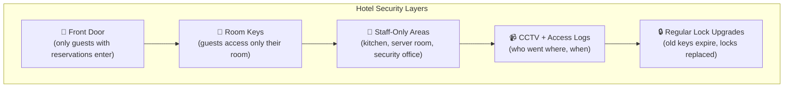

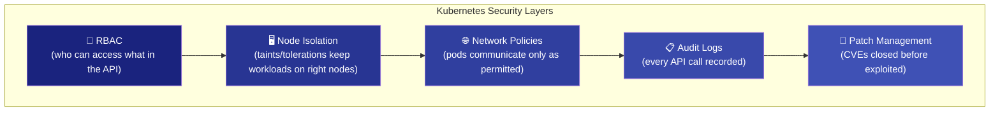

### The Five Strategies at a Glance

| Strategy | Hotel Analogy | Kubernetes Reality | Protects Against |
|----------|-------------|-------------------|-----------------|
| **RBAC** | Staff access badges (manager vs housekeeper) | ClusterRole + Bindings on node metadata | Unauthorised API access |
| **Node Isolation** | VIP floors vs standard rooms | Taints, tolerations, nodeAffinity | Workload co-mingling |
| **Network Policies** | Staff-only areas, VIP-only corridors | `kind: NetworkPolicy` | East-west lateral movement |
| **Audit Logging** | CCTV + access log book | `--audit-policy-file` on API server | Detection & forensics |
| **Patch Management** | Upgrading locks, cameras, alarms | `kubeadm upgrade`, OS patching | CVE exploitation |

---

## 2. Strategy 1 — RBAC (Role-Based Access Control)

### The Hotel Analogy

In a hotel, a **manager** has a master key to every room, the server room, and the security office. A **housekeeper** can only enter guest rooms — and only when assigned. An **auditor** can read access logs but cannot enter any room.

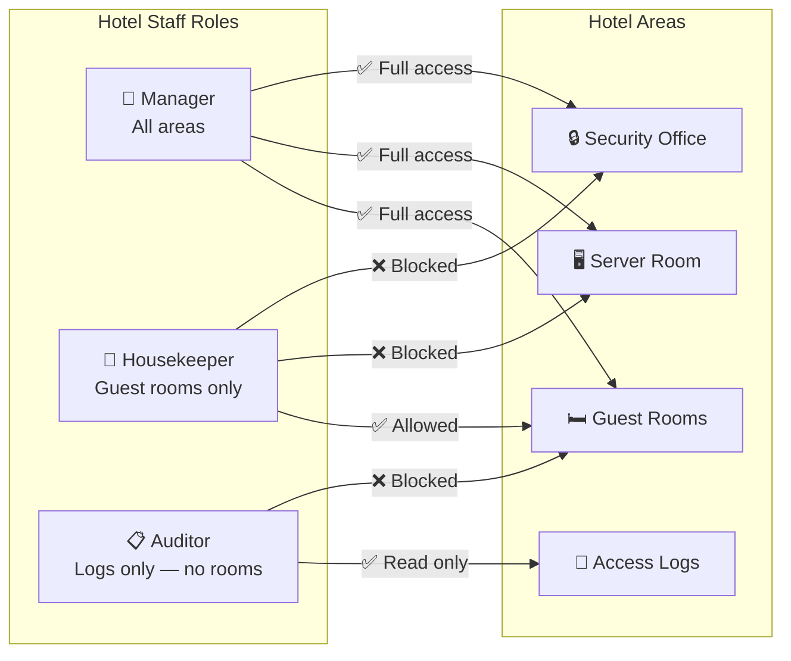


### How Kubernetes RBAC Mirrors This

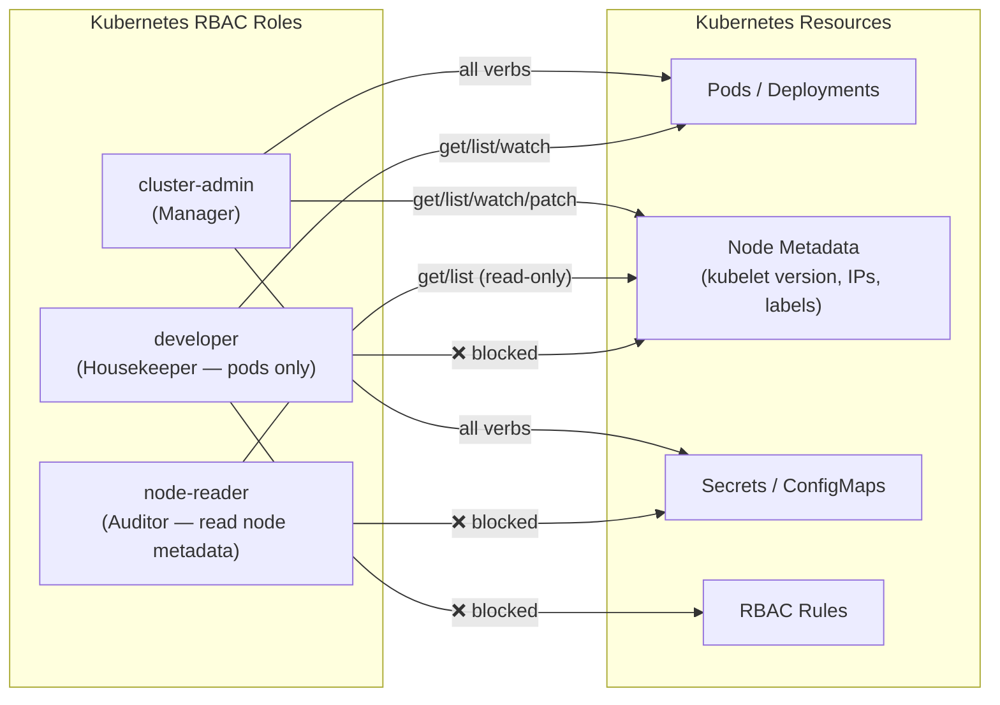

### RBAC Configuration for Node Metadata Protection

```yaml
# ─── Role 1: Cluster Admin (full access) ────────────────────────────────────
# Built-in — cluster-admin ClusterRole already exists
# Bind sparingly — only SRE/ops team

---
# ─── Role 2: Node Auditor (read-only node metadata) ─────────────────────────
apiVersion: rbac.authorization.k8s.io/v1
kind: ClusterRole
metadata:
  name: node-auditor
rules:
- apiGroups: [""]
  resources: ["nodes"]
  verbs: ["get", "list", "watch"]   # Read — cannot modify labels, taints, annotations
- apiGroups: [""]
  resources: ["nodes/status"]
  verbs: ["get"]

---
# ─── Role 3: Developer (pods/services only — NO node access) ─────────────────
apiVersion: rbac.authorization.k8s.io/v1
kind: ClusterRole
metadata:
  name: developer
rules:
- apiGroups: ["", "apps", "batch"]
  resources: ["pods", "deployments", "services", "configmaps", "jobs"]
  verbs: ["get", "list", "watch", "create", "update", "patch"]
# Deliberately omits: nodes, secrets, rbac resources

---
# ─── Bind auditor role to the monitoring team ────────────────────────────────
apiVersion: rbac.authorization.k8s.io/v1
kind: ClusterRoleBinding
metadata:
  name: node-auditor-binding
subjects:
- kind: Group
  name: monitoring-team
  apiGroup: rbac.authorization.k8s.io
roleRef:
  kind: ClusterRole
  name: node-auditor
  apiGroup: rbac.authorization.k8s.io

---
# ─── Bind developer role (namespace-scoped via RoleBinding) ──────────────────
apiVersion: rbac.authorization.k8s.io/v1
kind: RoleBinding
metadata:
  name: developer-binding
  namespace: production
subjects:
- kind: Group
  name: dev-team
  apiGroup: rbac.authorization.k8s.io
roleRef:
  kind: ClusterRole
  name: developer
  apiGroup: rbac.authorization.k8s.io
```

### The Principle of Least Privilege Applied to Nodes

| User/Group | Can `get nodes`? | Can `patch nodes`? | Can modify taints? | Can read secrets? |
|-----------|-----------------|-------------------|-------------------|-------------------|
| `cluster-admin` | ✅ | ✅ | ✅ | ✅ |
| `node-auditor` | ✅ | ❌ | ❌ | ❌ |
| `developer` | ❌ | ❌ | ❌ | ❌ |
| Default ServiceAccount | ❌ | ❌ | ❌ | ❌ |

### Audit RBAC for Node Access

```bash
# Who can modify node labels/taints? (dangerous permissions)
kubectl auth can-i patch nodes --as=developer@company.com
# no ✅

kubectl auth can-i patch nodes --as=admin@company.com
# yes — verify this is intentional

# List all subjects with patch/update nodes permission
kubectl get clusterrolebindings -o json | jq -r '
  .items[] |
  select(.roleRef.name == "cluster-admin") |
  "ClusterRoleBinding: \(.metadata.name) → \(.subjects[]?.name)"'
```

---

## 3. Strategy 2 — Node Isolation

### The Hotel Analogy

A luxury hotel doesn't mix VIP guests with conference guests on the same floor. VIP guests get dedicated floors with stricter security. Regular guests cannot access the VIP floor — they simply lack the key.

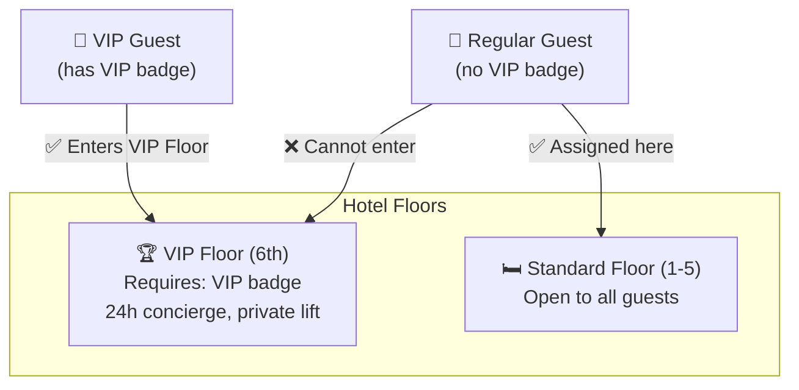


### Kubernetes Equivalent — Taints, Tolerations, and NodeAffinity

The Kubernetes mechanisms that implement node isolation are **taints** (on nodes — "only specific pods allowed") and **tolerations** (on pods — "I am allowed on tainted nodes").

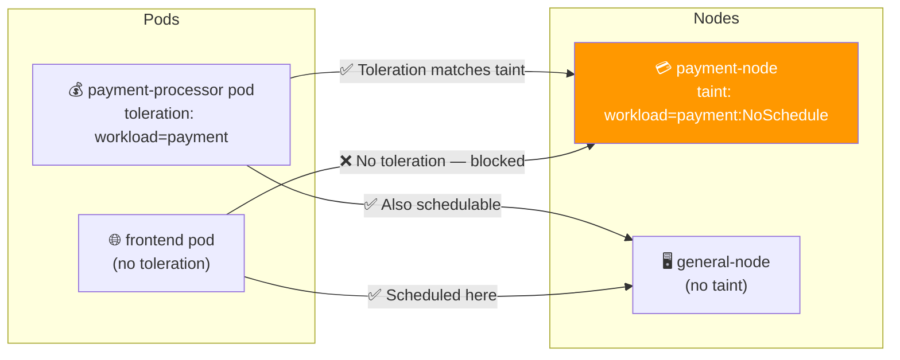

### Complete Node Isolation Setup

```bash
# ─── Step 1: Taint the sensitive node ────────────────────────────────────────
kubectl taint nodes payment-node workload=payment:NoSchedule
# node/payment-node tainted

# Verify
kubectl describe node payment-node | grep -A 5 "Taints:"
# Taints: workload=payment:NoSchedule
```

```yaml
# ─── Step 2: Add toleration to the payment pod ───────────────────────────────
apiVersion: apps/v1
kind: Deployment
metadata:
  name: payment-processor
  namespace: production
spec:
  replicas: 2
  selector:
    matchLabels:
      app: payment-processor
  template:
    metadata:
      labels:
        app: payment-processor
    spec:
      tolerations:
      - key: "workload"           # Must match the taint key
        operator: "Equal"
        value: "payment"          # Must match the taint value
        effect: "NoSchedule"      # Must match the taint effect
      nodeSelector:
        workload: payment         # Additional guarantee: only run on payment nodes
      containers:
      - name: payment-processor
        image: payment-processor:v1.2
```

```bash
# ─── Step 3: Label the node for nodeSelector ─────────────────────────────────
kubectl label node payment-node workload=payment
```

### NodeAffinity — Fine-Grained Placement Rules

For more complex scenarios than `nodeSelector`:

```yaml
spec:
  affinity:
    nodeAffinity:
      requiredDuringSchedulingIgnoredDuringExecution:    # Hard requirement
        nodeSelectorTerms:
        - matchExpressions:
          - key: workload
            operator: In
            values: ["payment", "financial"]             # Either label value
          - key: security-zone
            operator: In
            values: ["high"]                             # AND security-zone=high
      preferredDuringSchedulingIgnoredDuringExecution:   # Soft preference
      - weight: 100
        preference:
          matchExpressions:
          - key: topology.kubernetes.io/zone
            operator: In
            values: ["us-east-1a"]                       # Prefer this AZ
```

### Taint Effects Reference

| Effect | What it does |
|--------|-------------|
| `NoSchedule` | New pods without toleration cannot be scheduled; existing pods stay |
| `PreferNoSchedule` | Scheduler avoids this node but will use it if no alternative |
| `NoExecute` | No new pods AND existing pods without toleration are evicted |

### Node Isolation Security Matrix

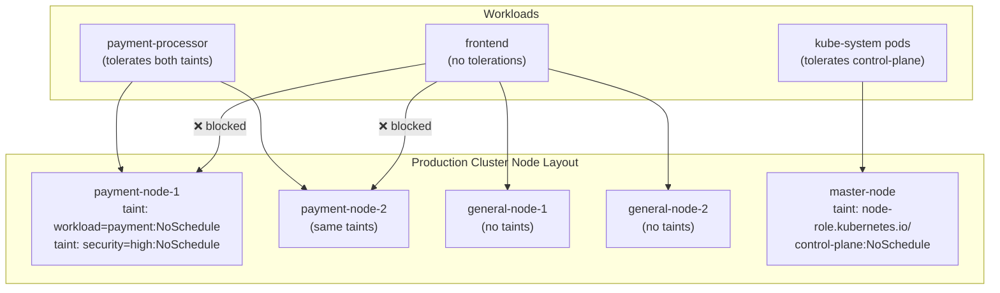

---

## 4. Strategy 3 — Network Policies

### The Hotel Analogy

In a hotel, the **kitchen** is staff-only — guests cannot enter. The **VIP lounge** on floor 6 is accessible only to VIP guests and their assigned concierge — not regular staff. These restrictions exist independently of who has room keys.

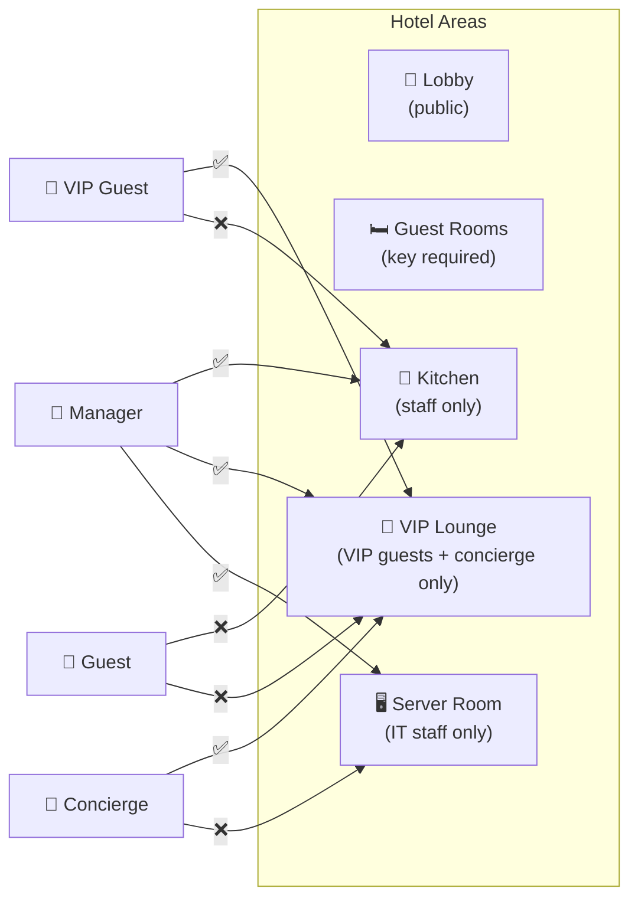


### Kubernetes Network Policy — Controlling Pod Communication

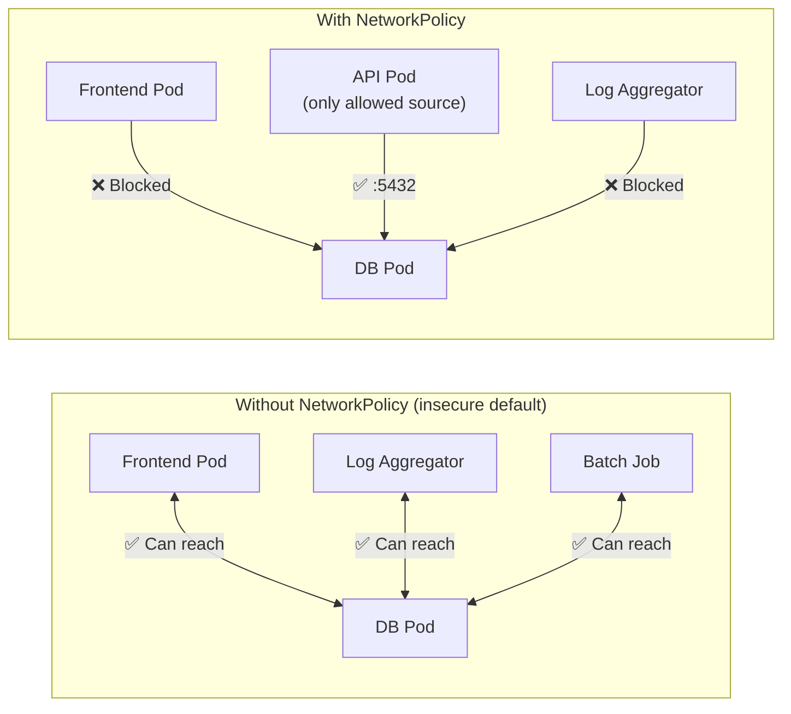

### Three-Tier App — Complete Network Policy Set

```yaml
# ─── Policy 1: Database — only API pod can connect ───────────────────────────
apiVersion: networking.k8s.io/v1
kind: NetworkPolicy
metadata:
  name: db-isolation
  namespace: production
spec:
  podSelector:
    matchLabels:
      tier: database
  policyTypes:
  - Ingress
  - Egress
  ingress:
  - from:
    - podSelector:
        matchLabels:
          tier: api              # Only API tier pods
      namespaceSelector:
        matchLabels:
          env: production        # AND only in production namespace
    ports:
    - protocol: TCP
      port: 5432
  egress:
  - to:
    ports:
    - protocol: UDP
      port: 53                   # DNS only — DB initiates nothing else
---
# ─── Policy 2: API tier — receives from frontend, sends to DB ────────────────
apiVersion: networking.k8s.io/v1
kind: NetworkPolicy
metadata:
  name: api-isolation
  namespace: production
spec:
  podSelector:
    matchLabels:
      tier: api
  policyTypes:
  - Ingress
  - Egress
  ingress:
  - from:
    - podSelector:
        matchLabels:
          tier: frontend
    ports:
    - protocol: TCP
      port: 8080
  egress:
  - to:
    - podSelector:
        matchLabels:
          tier: database
    ports:
    - protocol: TCP
      port: 5432
  - to:
    ports:
    - protocol: UDP
      port: 53
---
# ─── Policy 3: Block cloud IMDS from all pods ────────────────────────────────
apiVersion: networking.k8s.io/v1
kind: NetworkPolicy
metadata:
  name: block-metadata-endpoint
  namespace: production
spec:
  podSelector: {}               # All pods
  policyTypes:
  - Egress
  egress:
  - to:
    - ipBlock:
        cidr: 0.0.0.0/0
        except:
        - 169.254.169.254/32    # Block cloud IMDS
  - to:
    ports:
    - protocol: UDP
      port: 53
    - protocol: TCP
      port: 53
```

### Namespace Isolation — Tenant Separation

```yaml
# Prevent any cross-namespace traffic (multi-tenant isolation)
apiVersion: networking.k8s.io/v1
kind: NetworkPolicy
metadata:
  name: deny-cross-namespace
  namespace: tenant-a
spec:
  podSelector: {}
  policyTypes:
  - Ingress
  ingress:
  - from:
    - podSelector: {}           # Only from pods in the SAME namespace
    # No namespaceSelector → only same namespace traffic allowed
```

---

## 5. Strategy 4 — Audit Logging

### The Hotel Analogy

Every hotel maintains a **front desk log** and **CCTV footage**. If a guest's valuables go missing, the hotel reviews who accessed that floor, at what time, and with which keycard. The log is the source of truth for investigations.

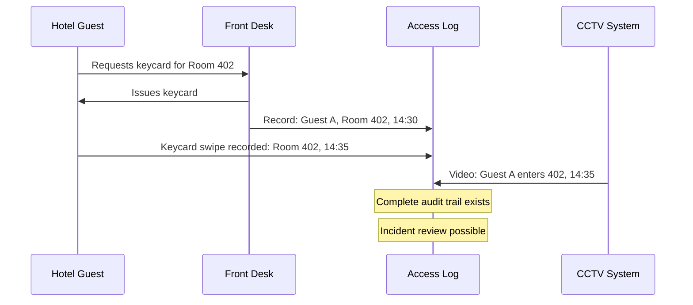


### Kubernetes Audit Logging Architecture

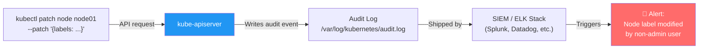

### Audit Policy Configuration

The audit policy defines **what** to log and **how much detail**:

```yaml
# /etc/kubernetes/audit-policy.yaml
apiVersion: audit.k8s.io/v1
kind: Policy
rules:
# ─── Level 1: Log all node modifications in detail ───────────────────────────
- level: RequestResponse        # Log request body + response body
  resources:
  - group: ""
    resources: ["nodes"]
  verbs: ["patch", "update", "delete"]
  # Captures: who changed what label/taint, what it changed to

# ─── Level 2: Log node reads at metadata level (lighter) ────────────────────
- level: Metadata               # Log who/when/what — not the response body
  resources:
  - group: ""
    resources: ["nodes", "nodes/status"]
  verbs: ["get", "list", "watch"]

# ─── Level 3: Log secret access at RequestResponse (sensitive) ───────────────
- level: RequestResponse
  resources:
  - group: ""
    resources: ["secrets"]
  verbs: ["get", "list", "create", "patch", "delete"]

# ─── Level 4: Log all other requests at Metadata level ───────────────────────
- level: Metadata
  omitStages:
  - RequestReceived             # Skip the duplicate "received" event

# ─── Level 5: Skip high-volume read-only noise ───────────────────────────────
- level: None
  users: ["system:kube-proxy"]
  verbs: ["watch"]
  resources:
  - group: ""
    resources: ["endpoints", "services"]
```

### Enabling Audit Logging on the API Server

```yaml
# /etc/kubernetes/manifests/kube-apiserver.yaml
spec:
  containers:
  - name: kube-apiserver
    command:
    - kube-apiserver
    - --audit-log-path=/var/log/kubernetes/audit.log
    - --audit-policy-file=/etc/kubernetes/audit-policy.yaml
    - --audit-log-maxage=30          # Retain 30 days
    - --audit-log-maxbackup=10       # Keep 10 rotated files
    - --audit-log-maxsize=100        # Rotate at 100 MB
    - --audit-log-compress           # Compress rotated files
    volumeMounts:
    - name: audit-log
      mountPath: /var/log/kubernetes
    - name: audit-policy
      mountPath: /etc/kubernetes/audit-policy.yaml
      readOnly: true
  volumes:
  - name: audit-log
    hostPath:
      path: /var/log/kubernetes
  - name: audit-policy
    hostPath:
      path: /etc/kubernetes/audit-policy.yaml
```

### Reading Audit Log Entries

```bash
# View raw audit log (JSON format)
tail -f /var/log/kubernetes/audit.log | jq .

# Sample audit event — node label patch
{
  "kind": "Event",
  "apiVersion": "audit.k8s.io/v1",
  "level": "RequestResponse",
  "auditID": "a1b2c3d4-...",
  "stage": "ResponseComplete",
  "requestURI": "/api/v1/nodes/node01",
  "verb": "patch",
  "user": {
    "username": "developer@company.com",    # Who made the request
    "groups": ["dev-team", "system:authenticated"]
  },
  "sourceIPs": ["10.0.0.5"],               # From where
  "requestReceivedTimestamp": "2024-01-15T14:32:01Z",
  "responseStatus": {
    "code": 200                             # Succeeded or failed
  },
  "requestObject": {
    "metadata": {
      "labels": {"security-zone": "low"}   # What changed
    }
  }
}
```

```bash
# Search for unauthorized node modifications
grep '"verb":"patch"' /var/log/kubernetes/audit.log | \
  grep '"nodes"' | \
  jq 'select(.user.username != "admin@company.com") | {user: .user.username, time: .requestReceivedTimestamp, verb: .verb}'

# Find all secret access in the last hour
grep '"secrets"' /var/log/kubernetes/audit.log | \
  jq 'select(.requestReceivedTimestamp > "2024-01-15T13:00:00Z") | {user: .user.username, verb: .verb, ns: .objectRef.namespace}'

# Alert on failed access attempts (403 responses)
grep '"code":403' /var/log/kubernetes/audit.log | \
  jq '{user: .user.username, uri: .requestURI, time: .requestReceivedTimestamp}'
```

### Audit Levels Reference

| Level | What is logged | Use for |
|-------|---------------|---------|
| `None` | Nothing | High-volume noise (kube-proxy watches) |
| `Metadata` | User, time, resource, verb — no body | Normal read operations |
| `Request` | Metadata + request body | Writes to sensitive resources |
| `RequestResponse` | Metadata + request + response body | Node changes, secret access |

---

## 6. Strategy 5 — Regular Updates and Patches

### The Hotel Analogy

A hotel doesn't buy one lock for all eternity. As lock-picking techniques evolve, locks are replaced. Cameras get upgraded when vendors release firmware patches. Fire suppression systems are tested quarterly. Security is a **continuous process**, not a one-time event.


### What Needs Patching in Kubernetes

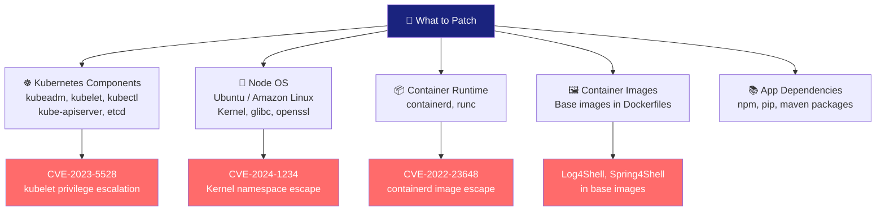

### Kubernetes Component Upgrade

```bash
# ─── Phase 1: Upgrade control plane ──────────────────────────────────────────

# Check available versions
kubeadm upgrade plan
# [upgrade/config] Making sure the configuration is correct...
# COMPONENT            CURRENT   AVAILABLE
# kube-apiserver       v1.29.0   v1.30.0
# kube-controller-mgr  v1.29.0   v1.30.0
# kube-scheduler       v1.29.0   v1.30.0
# kubelet              v1.29.0   v1.30.0

# Upgrade kubeadm first (always before applying)
apt-get update && apt-get install -y kubeadm=1.30.0-00

# Apply the upgrade
kubeadm upgrade apply v1.30.0

# Upgrade kubelet on the control plane node
apt-get install -y kubelet=1.30.0-00 kubectl=1.30.0-00
systemctl daemon-reload
systemctl restart kubelet

# ─── Phase 2: Upgrade worker nodes (one at a time) ───────────────────────────

# Drain the node (moves workloads off)
kubectl drain node01 \
  --ignore-daemonsets \
  --delete-emptydir-data \
  --force

# SSH to the worker node
ssh node01

# Upgrade on the worker
apt-get update && apt-get install -y kubeadm=1.30.0-00
kubeadm upgrade node             # Workers use 'node' not 'apply'

apt-get install -y kubelet=1.30.0-00 kubectl=1.30.0-00
systemctl daemon-reload
systemctl restart kubelet

# Back on the control plane — restore the node
kubectl uncordon node01

# Verify
kubectl get nodes
# NAME      STATUS   VERSION
# master    Ready    v1.30.0   ← Updated
# node01    Ready    v1.30.0   ← Updated
```

### OS and Kernel Patching

```bash
# Ubuntu — patch OS (from the node or via SSH)
apt-get update
apt-get upgrade -y              # All packages
apt-get dist-upgrade -y         # Kernel + critical updates

# Check if reboot is required
cat /var/run/reboot-required 2>/dev/null && echo "REBOOT REQUIRED" || echo "No reboot needed"

# Reboot the node (drain first!)
kubectl drain node01 --ignore-daemonsets --delete-emptydir-data
ssh node01 sudo reboot
# Wait for node to come back up
kubectl wait --for=condition=Ready node/node01 --timeout=120s
kubectl uncordon node01
```

### Container Image Scanning and Updates

```bash
# Scan images for CVEs with Trivy (open source)
trivy image nginx:1.24
# nginx:1.24 (debian 11.9)
# Total: 45 (CRITICAL: 3, HIGH: 12, MEDIUM: 20, LOW: 10)
# ┌──────────┬────────────────┬──────────┬───────────────┐
# │ Library  │ Vulnerability  │ Severity │ Fixed Version │
# ├──────────┼────────────────┼──────────┼───────────────┤
# │ openssl  │ CVE-2024-xxxx  │ CRITICAL │ 3.0.14       │

# Scan your own images
trivy image my-app:v1.2.3 --exit-code 1 --severity CRITICAL,HIGH
# Returns exit code 1 if critical/high CVEs found (use in CI pipeline)
```

### Patch Cadence Recommendations

| Component | Frequency | Urgency for Critical CVE |
|-----------|-----------|--------------------------|
| Kubernetes components | Every minor release (~3 months) | Within 48 hours |
| OS/Kernel | Monthly | Within 24 hours (if exploitable) |
| Container runtime | On release | Within 72 hours |
| Base images | Weekly rebuild | Immediately |
| App dependencies | On PR / weekly | On severity assessment |

### Automating Patch Detection

```yaml
# Kubernetes version check — add to monitoring
# Prometheus alert rule:
groups:
- name: kubernetes-version
  rules:
  - alert: KubeletVersionOutdated
    expr: |
      kube_node_info{kubelet_version!~"v1\\.30\\..+"} == 1
    for: 1h
    labels:
      severity: warning
    annotations:
      summary: "Node {{ $labels.node }} is running outdated kubelet"
      description: "Kubelet version {{ $labels.kubelet_version }} is below the minimum required v1.30.x"
```

---

## 7. Combining All Strategies — Layered Defence

The true power of these strategies is in how they **layer** — each one compensates for the gaps in the others.

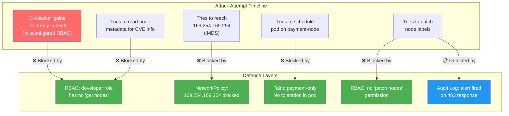

### Defence Matrix

| Threat | RBAC | Node Isolation | Network Policy | Audit Log | Patching |
|--------|------|---------------|----------------|-----------|---------|
| CVE exploitation via old kubelet | ❌ | ❌ | ❌ | ⚠️ Detects | ✅ Prevents |
| Pod on wrong node (taint removal) | ✅ (can't patch) | ✅ (taint present) | ❌ | ✅ Detects | ❌ |
| Pod reaches cloud IMDS | ❌ | ❌ | ✅ Blocks | ✅ Detects | ❌ |
| Dev reads kernel versions | ✅ (no get nodes) | ❌ | ❌ | ✅ Detects | ❌ |
| Lateral movement between pods | ❌ | ⚠️ Partial | ✅ Blocks | ✅ Detects | ❌ |
| Compromised container escape | ❌ | ⚠️ Partial | ⚠️ Partial | ✅ Detects | ✅ Prevents |

> ✅ = Primary defence  ⚠️ = Partial protection  ❌ = Does not address this threat

---

## 8. Real-World Scenarios

### Scenario 1: Financial Services — PCI-DSS Compliance

A bank's Kubernetes cluster processes credit card transactions. Requirements: strict workload isolation, full audit trail, no lateral movement.

```bash
# Implement all 5 strategies in sequence:

# 1. RBAC — developers cannot read node metadata
kubectl apply -f developer-rbac.yaml       # No nodes in rules

# 2. Node Isolation — PCI nodes dedicated to payment workloads
kubectl taint nodes pci-node-{1,2,3} pci-scope=cardholder-data:NoSchedule
kubectl label nodes pci-node-{1,2,3} pci-scope=in-scope

# 3. NetworkPolicy — payment pods only talk to payment DB
kubectl apply -f pci-network-policies.yaml

# 4. Audit Logging — RequestResponse level for all PCI namespace resources
# audit-policy.yaml:
# - level: RequestResponse
#   namespaces: ["pci-production"]

# 5. Patching — monthly OS + Kubernetes updates during maintenance window
# + Trivy scans on every image push to registry
```

### Scenario 2: Multi-Tenant SaaS Platform

Multiple customers share the same cluster but must be completely isolated from each other.

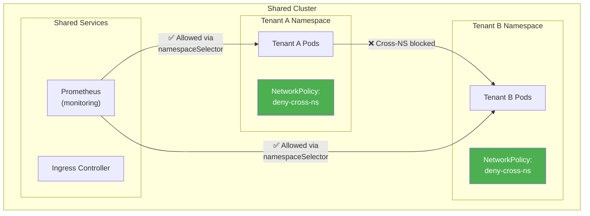

### Scenario 3: Incident Response — Audit Log Investigation

A production outage occurs. Audit logs reveal the root cause:

```bash
# Investigate: who modified the payment node taint?
grep '"nodes"' /var/log/kubernetes/audit.log | \
  grep '"verb":"patch"\|"verb":"update"' | \
  jq '{
    user: .user.username,
    time: .requestReceivedTimestamp,
    node: .objectRef.name,
    change: .requestObject
  }'

# Output reveals:
# {
#   "user": "ci-bot@company.com",
#   "time": "2024-01-15T03:22:15Z",
#   "node": "payment-node-1",
#   "change": {"spec": {"taints": []}}   ← CI bot accidentally removed all taints!
# }

# Recovery:
kubectl taint nodes payment-node-1 workload=payment:NoSchedule
kubectl taint nodes payment-node-1 pci-scope=cardholder-data:NoSchedule

# Fix: RBAC — remove taint modification permission from ci-bot
kubectl edit clusterrolebinding ci-bot-binding
# Remove patch/update verb from nodes resource
```

---

## 9. Concepts at a Glance

| Concept | Key Detail |
|---------|-----------|
| **Defence in Depth** | Multiple overlapping security layers — breaking one doesn't break all |
| **RBAC** | Role-Based Access Control — defines who can read/modify which Kubernetes resources |
| **Least Privilege** | Users/pods get only the minimum permissions they need |
| **Taint** | A repeller on a node — pods without matching toleration cannot be scheduled |
| **Toleration** | A pod property that allows it to be scheduled on a tainted node |
| **NoSchedule** | Taint effect: new pods without toleration blocked; existing pods unaffected |
| **NoExecute** | Taint effect: new pods blocked AND existing pods without toleration evicted |
| **nodeSelector** | Simple pod-to-node assignment by label |
| **nodeAffinity** | Advanced pod-to-node rules (required vs preferred, multiple labels) |
| **NetworkPolicy** | Kubernetes firewall rules for pod-to-pod and pod-to-external traffic |
| **ipBlock** | NetworkPolicy selector that matches external IP CIDR ranges |
| **Audit Logging** | kube-apiserver records every API request with user, time, resource, verb |
| **Audit Level: None** | No logging (use for high-volume noise) |
| **Audit Level: Metadata** | Log who/when/what — no request/response body |
| **Audit Level: RequestResponse** | Full logging including request and response bodies |
| **`--audit-log-path`** | kube-apiserver flag to specify audit log file location |
| **`--audit-policy-file`** | kube-apiserver flag to specify what to log |
| **`kubeadm upgrade apply`** | Upgrades control plane components |
| **`kubeadm upgrade node`** | Upgrades worker node configuration |
| **kubectl drain** | Safely evicts all pods from a node before maintenance |
| **kubectl uncordon** | Makes a node schedulable again after maintenance |
| **Trivy** | Open-source container image CVE scanner |
| **SIEM** | Security Information and Event Management — central log analysis platform |

---

## 10. Commands Reference

### RBAC

```bash
# Check permissions
kubectl auth can-i get nodes
kubectl auth can-i patch nodes --as=developer@company.com
kubectl auth can-i list nodes --as=system:serviceaccount:default:default

# List roles with node access
kubectl get clusterroles -o json | jq '.items[] |
  select(.rules[]? |
    select(.resources[]? == "nodes")) |
  .metadata.name'

# Apply RBAC
kubectl apply -f node-rbac.yaml
kubectl describe clusterrole node-auditor
```

### Node Isolation

```bash
# Add taints
kubectl taint nodes node01 key=value:NoSchedule
kubectl taint nodes node01 key=value:NoExecute

# Remove taints (the trailing - removes it)
kubectl taint nodes node01 key=value:NoSchedule-

# List taints on all nodes
kubectl get nodes -o custom-columns=\
NODE:.metadata.name,\
TAINTS:.spec.taints

# Verify pod placement (which node is it on?)
kubectl get pod payment-pod -o wide

# Label node for nodeSelector
kubectl label node node01 workload=payment security-zone=high

# Remove label
kubectl label node node01 workload-
```

### Network Policies

```bash
# Apply policies
kubectl apply -f network-policies/

# List all policies
kubectl get networkpolicy --all-namespaces

# Describe a policy
kubectl describe networkpolicy db-isolation -n production

# Test connectivity (should fail after policy applied)
kubectl run test --image=busybox --rm -it -- \
  nc -zv db-service 5432
```

### Audit Logging

```bash
# View audit log
tail -f /var/log/kubernetes/audit.log | jq .

# Find all node patches
grep '"nodes"' /var/log/kubernetes/audit.log | \
  grep '"patch"\|"update"' | jq .

# Find failed access attempts (403)
grep '"code":403' /var/log/kubernetes/audit.log | \
  jq '{user: .user.username, uri: .requestURI}'

# Count events by user
grep '"ResponseComplete"' /var/log/kubernetes/audit.log | \
  jq -r '.user.username' | sort | uniq -c | sort -rn

# Validate audit policy file
kubectl --dry-run=client apply -f audit-policy.yaml
```

### Patching

```bash
# Check current versions
kubectl get nodes -o custom-columns=\
NODE:.metadata.name,\
KUBELET:.status.nodeInfo.kubeletVersion,\
KERNEL:.status.nodeInfo.kernelVersion

# Plan upgrade
kubeadm upgrade plan

# Drain before patching
kubectl drain node01 --ignore-daemonsets --delete-emptydir-data --force

# OS patch (Ubuntu)
apt-get update && apt-get upgrade -y

# Kubernetes component upgrade
apt-get install -y kubeadm=1.30.0-00 kubelet=1.30.0-00 kubectl=1.30.0-00
systemctl daemon-reload && systemctl restart kubelet

# Restore node to scheduling
kubectl uncordon node01

# Scan image for CVEs
trivy image nginx:latest --severity CRITICAL,HIGH
trivy image my-app:v1.0 --exit-code 1 --severity CRITICAL
```

---

> 📝 **CKS Exam Checklist — Protection Strategies**
> - [ ] Know all 5 strategies: RBAC, node isolation, NetworkPolicy, audit logging, patching
> - [ ] Know taint effects: `NoSchedule`, `PreferNoSchedule`, `NoExecute`
> - [ ] Know how to add and remove taints (`kubectl taint nodes ... key-`)
> - [ ] Know the difference between `nodeSelector` and `nodeAffinity`
> - [ ] Know `NetworkPolicy` `ipBlock` to block `169.254.169.254`
> - [ ] Know audit log levels: None → Metadata → Request → RequestResponse
> - [ ] Know the 4 kube-apiserver audit flags: `--audit-log-path`, `--audit-policy-file`, `--audit-log-maxage`, `--audit-log-maxbackup`
> - [ ] Know `kubectl drain --ignore-daemonsets` before node maintenance
> - [ ] Know `kubeadm upgrade apply` (control plane) vs `kubeadm upgrade node` (workers)
> - [ ] Know how to verify RBAC with `kubectl auth can-i --as=<user>`
