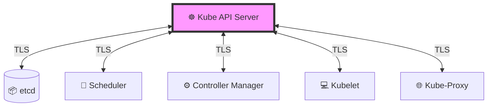

# 🛡️ Phase 2: Kubernetes Security Primitives

Welcome to the guide on **Kubernetes Security Primitives**. If Phase 1 was about auditing and benchmarks, Phase 2 is about the actual "building blocks" of security. 

Security primitives are the fundamental mechanisms provided by Kubernetes (and the underlying OS) to protect the cluster. Think of these as the locks, keys, and fences that you must install before you can claim your cluster is secure.

---

## 🏗️ Layer 0: Securing the Cluster Hosts

Before we can secure Kubernetes, we must secure the machines it runs on. If an attacker gains root access to a worker or master node, the Kubernetes security layers (like RBAC or Network Policies) can be completely bypassed.

### 📋 Host Hardening Checklist
To ensure a secure foundation, every node in the cluster should adhere to these primitives:

| Security Measure | Action | Why it matters |
| :--- | :--- | :--- |
| **Root Access** | ❌ Disable direct root login | Prevents attackers from gaining immediate total control. |
| **Authentication** | ❌ Disable password-based SSH | Passwords can be brute-forced; SSH keys are far more secure. |
| **SSH Keys** | ✅ Enable Key-based Auth | Ensures only authorized administrators with private keys can access nodes. |
| **Infra Protection** | ✅ Physical/Virtual Isolation | Protects the underlying VM or hardware from unauthorized physical access. |

---

## 🔑 The Gatekeeper: Kubernetes API Server

The `kube-apiserver` is the central hub of the cluster. Every single action—from deploying a pod to deleting a namespace—must pass through this API. Because it is the **entry point**, security here is non-negotiable.

The API server manages security by asking two critical questions:
1. **Authentication:** *"Who are you?"*
2. **Authorization:** *"What are you allowed to do?"*

### 1. Authentication (AuthN) 👤
Authentication verifies the identity of the requester. Kubernetes is flexible and supports multiple identity providers:

*   **X.509 Client Certificates:** The most common method for internal component communication.
*   **Service Accounts:** Special accounts designed for pods/machines to talk to the API server.
*   **Bearer Tokens:** Static or dynamic tokens used by users and CI/CD pipelines.
*   **External Providers:** Integration with enterprise identity systems like **LDAP**, Active Directory, or OIDC (Okta, Google, Azure AD).

### 2. Authorization (AuthZ) 📜
Once the identity is proven, the API server checks if that identity has permission to perform the requested action.

*   **RBAC (Role-Based Access Control):** The gold standard. It uses `Roles` and `ClusterRoles` to grant specific permissions to users or groups.
*   **ABAC (Attribute-Based Access Control):** A legacy system that uses policies based on attributes (less common today).
*   **Node Authorization:** Limits the `kubelet` so it can only access secrets and pods assigned to its specific node.
*   **Webhook Mode:** Allows the cluster to call an external service to make an authorization decision.

---

## 🔒 Securing Intra-Cluster Communications

Kubernetes is a distributed system. Components are constantly talking to each other. Without encryption, an attacker who has entered the network could "sniff" this traffic to steal tokens or modify cluster state.

### 🛡️ The Role of TLS
To prevent this, Kubernetes uses **Mutual TLS (mTLS)**. This means that not only does the client trust the server, but the server also verifies the client.

**Key components secured by TLS:**
*   **API Server $\leftrightarrow$ etcd:** Protects the cluster's most sensitive data.
*   **API Server $\leftrightarrow$ Kubelet:** Ensures only the API server can give commands to the nodes.
*   **Component $\leftrightarrow$ Component:** Prevents spoofing and eavesdropping within the control plane.

---

## 🌐 Network Policies: Pod Isolation

By default, Kubernetes employs a **"Flat Network"** model. This means any pod in any namespace can talk to any other pod in the cluster. In a production environment, this is a massive security risk (Lateral Movement).

### 🚫 From "Default Allow" to "Zero Trust"
**Network Policies** act as the firewall for your pods. They allow you to define exactly which traffic is permitted based on:
*   **Pod Selectors:** Which pods are affected.
*   **Ingress:** Which traffic is allowed *into* the pod.
*   **Egress:** Which traffic is allowed *out of* the pod.
*   **Namespace Selectors:** Restricting traffic to specific namespaces.

> [!IMPORTANT]
> **Best Practice:** Always implement a **"Default Deny"** policy for all ingress and egress traffic in a namespace, and then explicitly "whitelist" only the connections that are required for the application to function.

---

## 🎯 Summary Table: Security Primitives

| Primitive | Layer | Primary Goal | Key Tool/Mechanism |
| :--- | :--- | :--- | :--- |
| **Host Hardening** | OS/Infra | Prevent Node Takeover | SSH Keys, sudo, disabling root |
| **Authentication** | API Server | Identity Verification | Certs, Tokens, OIDC, Service Accounts |
| **Authorization** | API Server | Permission Control | **RBAC**, Node Auth, Webhooks |
| **Intra-Cluster TLS** | Network | Data Privacy/Integrity | mTLS Certificates |
| **Network Policies** | Pod Network | Prevent Lateral Movement | L3/L4 Firewall Rules |
