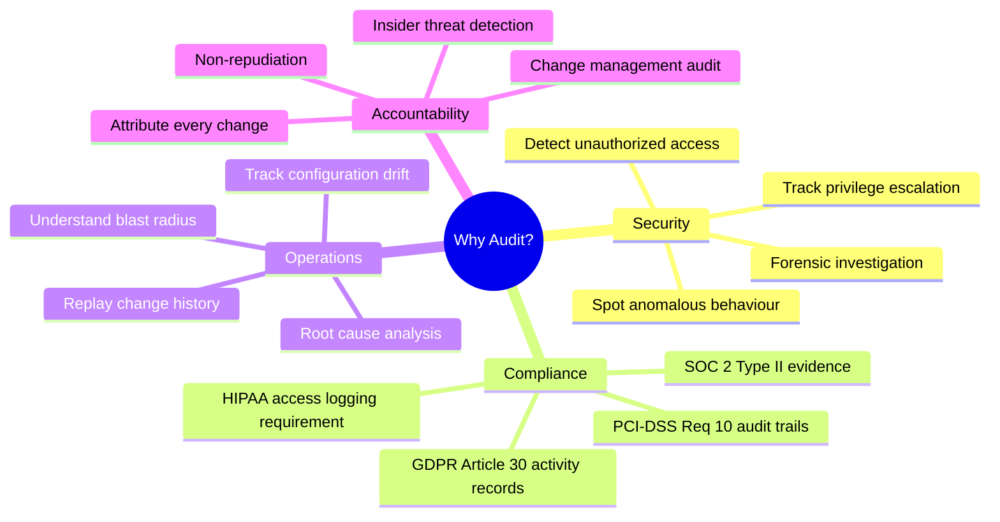
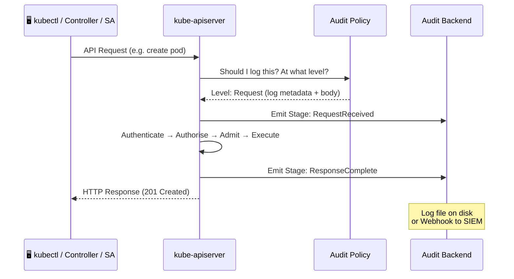
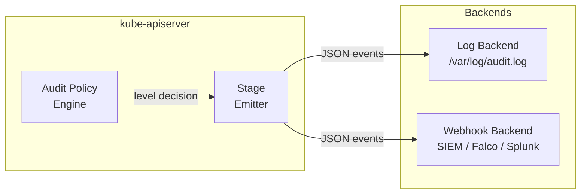
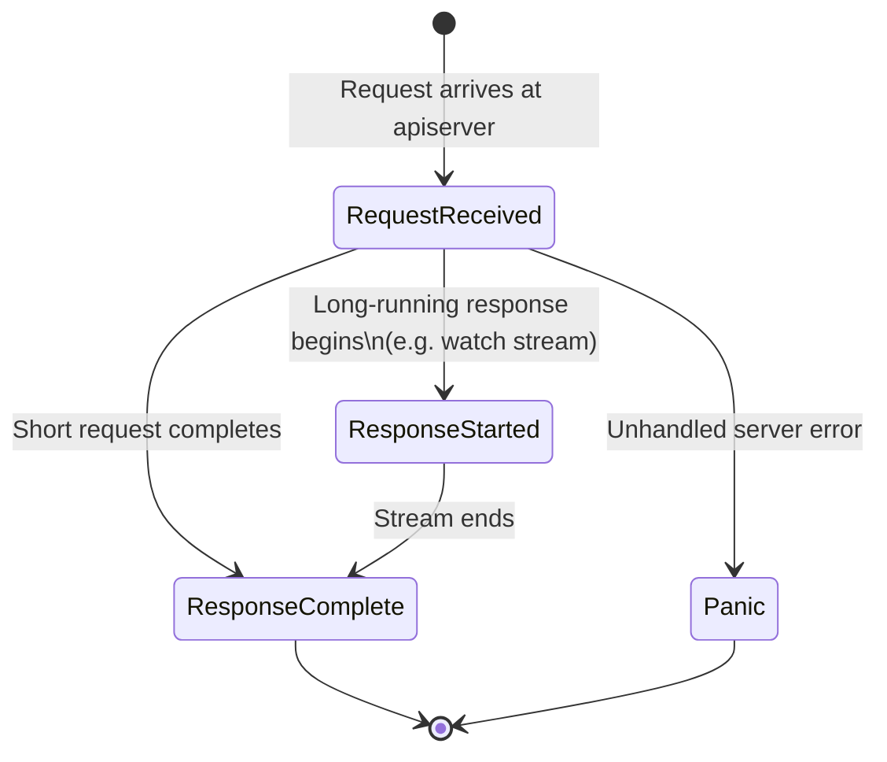
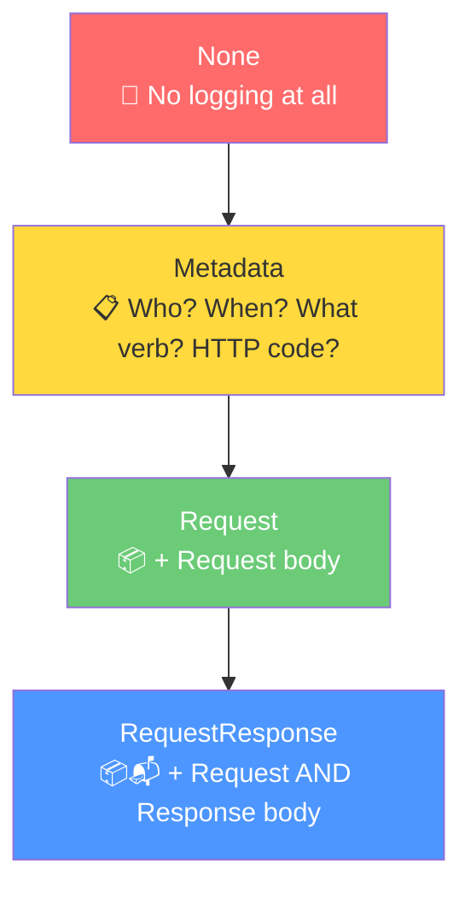
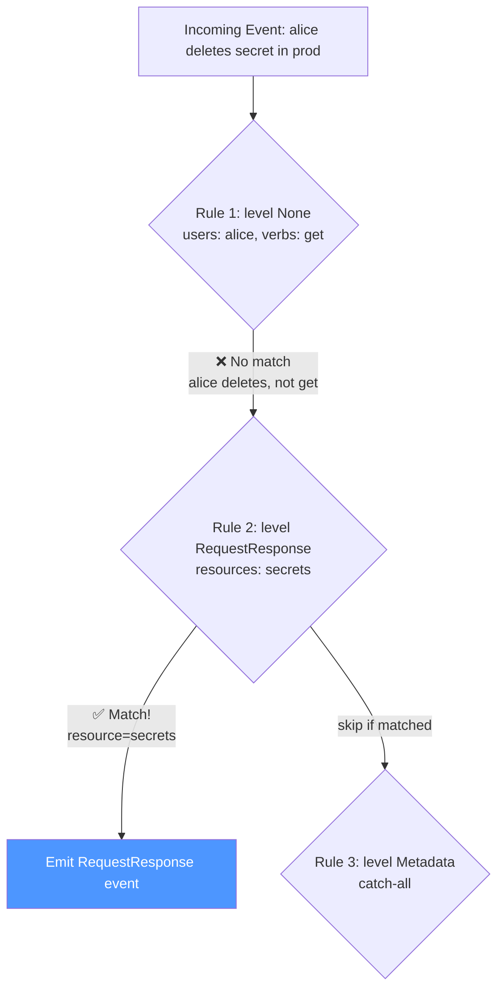
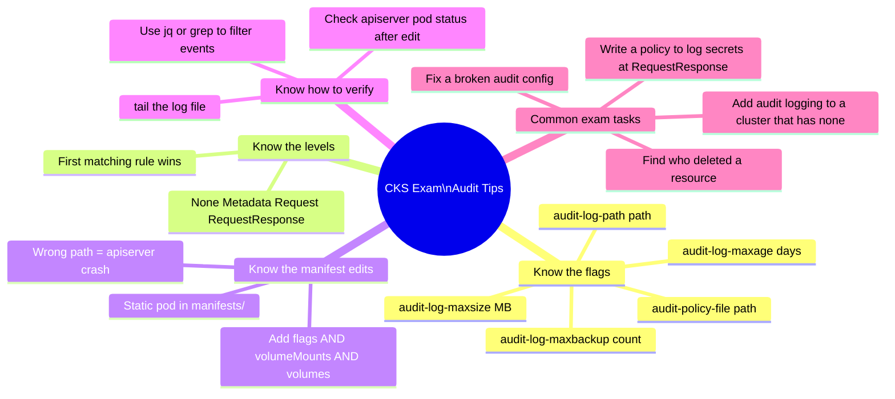
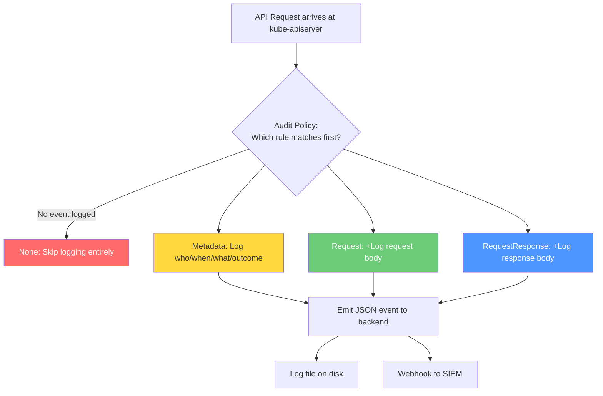

# 20 — Auditing in Kubernetes

> **What you'll learn:** What audit logs are, why every production cluster needs them, how the kube-apiserver generates them, how to write audit policies, configure backends, and analyse logs like a security engineer.

---

## Table of Contents

1. [What is Kubernetes Auditing?](#1-what-is-kubernetes-auditing)
2. [Why Audit? The Business and Security Case](#2-why-audit-the-business-and-security-case)
3. [How Auditing Works — Architecture Overview](#3-how-auditing-works--architecture-overview)
4. [The Four Audit Stages](#4-the-four-audit-stages)
5. [Audit Policy Levels](#5-audit-policy-levels)
6. [Writing Audit Policies](#6-writing-audit-policies)
7. [Configuring the kube-apiserver for Auditing](#7-configuring-the-kube-apiserver-for-auditing)
8. [Audit Backends — Where Logs Go](#8-audit-backends--where-logs-go)
9. [Anatomy of an Audit Event](#9-anatomy-of-an-audit-event)
10. [Advanced Audit Policy Patterns](#10-advanced-audit-policy-patterns)
11. [Analysing Audit Logs](#11-analysing-audit-logs)
12. [Real-World Scenarios](#12-real-world-scenarios)
13. [Common Mistakes & Gotchas](#13-common-mistakes--gotchas)
14. [CKS Exam Tips](#14-cks-exam-tips)

---

## 1. What is Kubernetes Auditing?

Imagine your Kubernetes cluster as a large office building. Hundreds of people walk in and out every day — employees, contractors, visitors. Without a visitor log at the front desk, if something goes missing you have **no idea who was there, when they arrived, or what they touched**.

Kubernetes auditing is that visitor log — except for every API call made to the cluster.

> **Definition:** Kubernetes auditing is the process by which the **kube-apiserver** records a chronological, structured log of every request it processes, capturing *who* made the request, *what* they requested, *when* it happened, and *what the outcome was*.

### What Gets Recorded?

Every request passing through the kube-apiserver — whether from `kubectl`, a controller, a service account, or external tooling — can be captured:

| Field Category | Examples |
|---|---|
| **Identity** | Username, groups, UID, service account |
| **Source** | Source IP, user agent (kubectl version) |
| **Action** | Verb (get/create/delete/patch/watch/list) |
| **Target** | Resource type, namespace, resource name |
| **Timing** | Request received timestamp, stage timestamp |
| **Outcome** | HTTP response code, error message |
| **Payload** | Request body (optional), response body (optional) |

### A Real Audit Event at a Glance

This is what an audit event looks like when an admin creates an Nginx deployment:

```json
{
  "kind": "Event",
  "apiVersion": "audit.k8s.io/v1",
  "level": "Metadata",
  "auditID": "f4d9a5c1-5f4d-48cb-bd27-2f66c9d9c7c6",
  "stage": "ResponseComplete",
  "requestURI": "/apis/apps/v1/namespaces/default/deployments",
  "verb": "create",
  "user": {
    "username": "admin",
    "groups": [
      "system:masters",
      "system:authenticated"
    ]
  },
  "sourceIPs": ["192.168.1.10"],
  "userAgent": "kubectl/v1.20.0 (linux/amd64) kubernetes/af46c47",
  "objectRef": {
    "resource": "deployments",
    "namespace": "default",
    "name": "nginx-deployment",
    "apiVersion": "apps/v1"
  },
  "responseStatus": {
    "metadata": {},
    "code": 201
  },
  "requestReceivedTimestamp": "2024-07-29T07:50:04.123456Z",
  "stageTimestamp": "2024-07-29T07:50:04.223456Z",
  "annotations": {
    "authorization.k8s.io/decision": "allow",
    "authorization.k8s.io/reason": "RBAC: allowed by ClusterRoleBinding \"cluster-admin\" of ClusterRole \"cluster-admin\" to User \"admin\""
  }
}
```

Every field is meaningful:

| Field | What it Tells You |
|---|---|
| `auditID` | Unique ID — correlate request across distributed logs |
| `stage` | Where in the request lifecycle this event was emitted |
| `verb` | HTTP verb mapped to Kubernetes action |
| `user.username` | Who made the request |
| `sourceIPs` | From which machine |
| `userAgent` | With which tool (and version!) |
| `objectRef` | Exactly which resource was targeted |
| `responseStatus.code` | 201 = created, 403 = forbidden, 404 = not found, etc. |
| `annotations` | RBAC decision + the exact ClusterRoleBinding that allowed it |

---

## 2. Why Audit? The Business and Security Case


Without audit logs you are **flying blind**. With them you gain four superpowers:



### The Stakes Are Real

| Without Auditing | With Auditing |
|---|---|
| "Something deleted our production namespace — we have no idea who" | `verb: delete, user: dev-jenkins-sa, timestamp: ...` |
| "The secret was changed — but when and by whom?" | Full request + response body in the log |
| "We failed our SOC 2 audit — no access logs" | Exportable JSON audit trail |
| "Someone escalated privileges — we only noticed after the breach" | Alert on `clusterrolebindings create` at Metadata level |

---

## 3. How Auditing Works — Architecture Overview

The kube-apiserver is the **single chokepoint** through which all Kubernetes control-plane requests flow. This makes it the perfect place to intercept and log everything.



### Key Components



| Component | Role |
|---|---|
| **Audit Policy** | YAML rules that decide *which* events are logged and *at what level* |
| **Audit Stage Emitter** | The code inside kube-apiserver that emits events at each lifecycle stage |
| **Log Backend** | Writes JSON lines to a file on the control-plane node |
| **Webhook Backend** | Sends events to an external HTTP endpoint in real time |

---

## 4. The Four Audit Stages

A single API request passes through up to **four lifecycle stages**. Each stage can emit a separate audit event:



| Stage | When Emitted | Use Case |
|---|---|---|
| **RequestReceived** | As soon as the request arrives, before any processing | Detect requests that never complete (hung connections, DDoS) |
| **ResponseStarted** | After headers sent, before body — only for long-running requests (watch, exec, portforward) | Detect long-lived privileged watches |
| **ResponseComplete** | After full response is sent | The most common and useful stage — captures outcome |
| **Panic** | When the apiserver panics handling a request | Rare; useful for debugging apiserver bugs |

> **CKS Tip:** In most audit policies you only care about `ResponseComplete`. Log `RequestReceived` for high-risk verbs (e.g. `exec`, `portforward`) when you want to catch the *attempt* even if it fails before completion.

---

## 5. Audit Policy Levels


There are four levels of verbosity for audit events:



### Detailed Comparison

| Level | Metadata | Request Body | Response Body | Storage Impact | Use For |
|---|---|---|---|---|---|
| `None` | ❌ | ❌ | ❌ | None | Noisy low-value events (e.g. health checks) |
| `Metadata` | ✅ | ❌ | ❌ | Low | Default for most resources — who did what |
| `Request` | ✅ | ✅ | ❌ | Medium | Write operations — see what was sent |
| `RequestResponse` | ✅ | ✅ | ✅ | High | Secrets, RBAC changes — see exact data |

### What "Metadata" Captures

```json
{
  "level": "Metadata",
  "user": { "username": "alice" },
  "verb": "get",
  "objectRef": { "resource": "secrets", "name": "db-password" },
  "responseStatus": { "code": 200 }
}
```
→ You know **Alice read** the `db-password` secret. You don't know what the secret contained.

### What "RequestResponse" Adds

```json
{
  "level": "RequestResponse",
  "requestObject": {
    "data": { "password": "BASE64_ENCODED_VALUE" }
  },
  "responseObject": {
    "data": { "password": "BASE64_ENCODED_VALUE" }
  }
}
```
→ You now see the **actual secret value** (base64 encoded). Use sparingly — this is sensitive data in your logs.

---

## 6. Writing Audit Policies

An audit policy is a YAML file with an ordered list of rules. The **first matching rule wins** — order matters.

### Policy Structure

```yaml
apiVersion: audit.k8s.io/v1
kind: Policy

# Optional: omitStages prevents events from these stages entirely
omitStages:
  - "RequestReceived"

rules:
  # Rule 1: Never log health/readiness probe calls
  - level: None
    users: ["system:kube-proxy"]
    verbs: ["watch"]
    resources:
      - group: ""
        resources: ["endpoints", "services", "services/status"]

  # Rule 2: Never log node status updates (very noisy)
  - level: None
    users:
      - kubelet
      - system:node-problem-detector
    verbs: ["get", "list", "watch"]
    resources:
      - group: ""
        resources: ["nodes", "nodes/status"]

  # Rule 3: Full detail for secrets and RBAC (most important!)
  - level: RequestResponse
    resources:
      - group: ""
        resources: ["secrets", "configmaps"]
      - group: "rbac.authorization.k8s.io"
        resources: ["clusterroles", "clusterrolebindings", "roles", "rolebindings"]

  # Rule 4: Request level for pod creation/deletion
  - level: Request
    verbs: ["create", "update", "patch", "delete"]
    resources:
      - group: ""
        resources: ["pods"]
      - group: "apps"
        resources: ["deployments", "replicasets", "daemonsets", "statefulsets"]

  # Rule 5: Metadata for everything else
  - level: Metadata
    omitStages:
      - "RequestReceived"
```

### Rule Fields Reference

| Field | Description | Example |
|---|---|---|
| `level` | Audit level for matching events | `Metadata`, `Request`, `RequestResponse`, `None` |
| `users` | List of user principals to match | `["admin", "alice"]` |
| `userGroups` | List of groups to match | `["system:masters"]` |
| `verbs` | HTTP verbs to match | `["create", "delete"]` |
| `resources` | Resource types (with optional API group) | `group: "apps", resources: ["deployments"]` |
| `namespaces` | Limit to specific namespaces | `["production", "finance"]` |
| `nonResourceURLs` | Non-resource endpoints like `/healthz` | `["/healthz", "/metrics"]` |
| `omitStages` | Skip specific stages for this rule | `["RequestReceived"]` |

### The "First Match Wins" Rule — A Critical Trap



> ⚠️ **Gotcha:** If you put a broad `level: None` rule early, it will swallow events that should be logged. Always put `None` rules at the top for *specific, intentional* suppressions, and catch-alls at the bottom.

### Minimal KodeKloud-Style Examples

**Metadata policy for pods:**

```yaml
apiVersion: audit.k8s.io/v1
kind: Policy
rules:
- level: Metadata
  verbs: ["get", "list", "create", "delete", "update"]
  resources:
  - group: ""
    resources: ["pods"]
```

**Request policy for pod write operations:**

```yaml
apiVersion: audit.k8s.io/v1
kind: Policy
rules:
- level: Request
  verbs: ["create", "delete", "update"]
  resources:
  - group: ""
    resources: ["pods"]
```

---

## 7. Configuring the kube-apiserver for Auditing

Auditing is configured by passing flags to the `kube-apiserver` process. On kubeadm clusters this means editing the **static pod manifest**.

### The Key Flags

| Flag | Purpose | Example Value |
|---|---|---|
| `--audit-log-path` | Where to write log file | `/var/log/kubernetes/audit/audit.log` |
| `--audit-policy-file` | Path to your audit policy YAML | `/etc/kubernetes/audit-policy.yaml` |
| `--audit-log-maxage` | Days to retain old log files | `30` |
| `--audit-log-maxbackup` | Number of old log files to keep | `10` |
| `--audit-log-maxsize` | Max size (MB) per log file before rotation | `100` |
| `--audit-webhook-config-file` | Path to webhook backend config | `/etc/kubernetes/audit-webhook.yaml` |
| `--audit-webhook-batch-max-size` | Max events per webhook batch | `400` |

### Step-by-Step: Enabling Auditing on a kubeadm Cluster

#### Step 1 — Create the audit policy file

```bash
sudo mkdir -p /etc/kubernetes/audit
sudo tee /etc/kubernetes/audit/policy.yaml <<'EOF'
apiVersion: audit.k8s.io/v1
kind: Policy
omitStages:
  - "RequestReceived"
rules:
  # Don't log routine read operations on non-sensitive resources
  - level: None
    verbs: ["get", "watch", "list"]
    resources:
      - group: ""
        resources: ["events"]

  # Full detail for secrets and RBAC changes
  - level: RequestResponse
    resources:
      - group: ""
        resources: ["secrets"]
      - group: "rbac.authorization.k8s.io"
        resources: ["clusterroles", "clusterrolebindings", "roles", "rolebindings"]

  # Request body for pod/deployment mutations
  - level: Request
    verbs: ["create", "update", "patch", "delete"]
    resources:
      - group: ""
        resources: ["pods", "pods/exec", "pods/portforward"]
      - group: "apps"
        resources: ["deployments", "daemonsets", "statefulsets"]

  # Metadata for everything else
  - level: Metadata
EOF
```

#### Step 2 — Create the log directory

```bash
sudo mkdir -p /var/log/kubernetes/audit
```

#### Step 3 — Edit the kube-apiserver static pod manifest

```bash
sudo vi /etc/kubernetes/manifests/kube-apiserver.yaml
```

Add these flags to the `command` section:

```yaml
spec:
  containers:
  - command:
    - kube-apiserver
    # ... existing flags ...
    - --audit-policy-file=/etc/kubernetes/audit/policy.yaml
    - --audit-log-path=/var/log/kubernetes/audit/audit.log
    - --audit-log-maxage=30
    - --audit-log-maxbackup=10
    - --audit-log-maxsize=100
```

#### Step 4 — Mount the policy file and log directory into the pod

```yaml
    volumeMounts:
    - mountPath: /etc/kubernetes/audit
      name: audit-policy
      readOnly: true
    - mountPath: /var/log/kubernetes/audit
      name: audit-logs

  volumes:
  - hostPath:
      path: /etc/kubernetes/audit
      type: DirectoryOrCreate
    name: audit-policy
  - hostPath:
      path: /var/log/kubernetes/audit
      type: DirectoryOrCreate
    name: audit-logs
```

> ⚠️ **Critical:** If you only add the flags but forget to mount the directories, the apiserver will **crash on startup** with a "no such file or directory" error. Always add both the command flags AND the volumeMounts/volumes.

#### Step 5 — Verify the apiserver restarted correctly

```bash
# Watch for the pod to come back
kubectl get pod kube-apiserver-controlplane -n kube-system -w

# Check audit log is being written
sudo tail -f /var/log/kubernetes/audit/audit.log | head -5

# Trigger a test event
kubectl get pods -n kube-system

# Confirm it was logged
sudo grep '"username":"kubernetes-admin"' /var/log/kubernetes/audit/audit.log | tail -1 | python3 -m json.tool
```

### Full Annotated kube-apiserver Manifest Snippet

```yaml
apiVersion: v1
kind: Pod
metadata:
  name: kube-apiserver
  namespace: kube-system
spec:
  containers:
  - name: kube-apiserver
    image: registry.k8s.io/kube-apiserver:v1.29.0
    command:
    - kube-apiserver
    - --advertise-address=192.168.56.10
    - --allow-privileged=true
    - --authorization-mode=Node,RBAC
    # ── Audit flags ──────────────────────────────────────
    - --audit-policy-file=/etc/kubernetes/audit/policy.yaml
    - --audit-log-path=/var/log/kubernetes/audit/audit.log
    - --audit-log-maxage=30        # keep 30 days of rotated files
    - --audit-log-maxbackup=10     # keep at most 10 rotated files
    - --audit-log-maxsize=100      # rotate when file exceeds 100 MB
    # ─────────────────────────────────────────────────────
    volumeMounts:
    - mountPath: /etc/kubernetes/audit
      name: audit-policy
      readOnly: true
    - mountPath: /var/log/kubernetes/audit
      name: audit-logs
  volumes:
  - hostPath:
      path: /etc/kubernetes/audit
      type: DirectoryOrCreate
    name: audit-policy
  - hostPath:
      path: /var/log/kubernetes/audit
      type: DirectoryOrCreate
    name: audit-logs
```

---

## 8. Audit Backends — Where Logs Go

The apiserver supports two backends simultaneously:

```mermaid
flowchart LR
    APISRV[kube-apiserver\nAudit Event]

    subgraph Log Backend
        F[/var/log/kubernetes/audit/audit.log\nJSON lines on disk]
        FR[Rotated files\naudit.log.1, .2 ...]
        F -->|rotation| FR
    end

    subgraph Webhook Backend
        W[HTTP POST\nJSON batch]
        SIEM[SIEM / Splunk / ELK]
        FALCO[Falco]
        GCP[Cloud Logging\nGCP / AWS CloudTrail]
        W --> SIEM
        W --> FALCO
        W --> GCP
    end

    APISRV -->|--audit-log-path| F
    APISRV -->|--audit-webhook-config-file| W
```

### Log Backend

- Writes one JSON object per line (NDJSON format)
- Lives on the **control-plane node's filesystem**
- Automatically rotated based on `maxage`, `maxbackup`, `maxsize`
- Simple to set up, but requires scraping by a log shipper (Fluentd, Filebeat, etc.)

### Webhook Backend

Create a webhook config file:

```yaml
apiVersion: v1
kind: Config
clusters:
- name: audit-webhook
  cluster:
    server: https://my-siem.example.com/audit
    certificate-authority: /etc/kubernetes/pki/siem-ca.crt
users:
- name: audit-webhook-user
  user:
    client-certificate: /etc/kubernetes/pki/audit-client.crt
    client-key: /etc/kubernetes/pki/audit-client.key
contexts:
- context:
    cluster: audit-webhook
    user: audit-webhook-user
  name: webhook
current-context: webhook
```

Then add to kube-apiserver:

```bash
--audit-webhook-config-file=/etc/kubernetes/audit/webhook-config.yaml
--audit-webhook-batch-max-size=400
--audit-webhook-batch-max-wait=5s
```

| Backend | Pros | Cons |
|---|---|---|
| **Log file** | Simple, always works, no network dependency | Needs log shipper, disk fills up |
| **Webhook** | Real-time, integrates with SIEM | Network latency, webhook must be HA |

---

## 9. Anatomy of an Audit Event

Let's dissect a complete audit event field by field.

### Metadata Level Event — Pod Get

```json
{
  "kind": "Event",
  "apiVersion": "audit.k8s.io/v1",
  "level": "Metadata",
  "timestamp": "2024-10-11T12:34:56Z",
  "user": {
    "username": "system:serviceaccount:kube-system:default",
    "groups": ["system:serviceaccounts", "system:serviceaccounts:kube-system"]
  },
  "verb": "get",
  "namespace": "default",
  "resource": "pods",
  "stage": "ResponseComplete",
  "objectRef": {
    "resource": "pods",
    "namespace": "default",
    "name": "example-pod"
  }
}
```

### Request Level Event — Pod Create

```json
{
  "kind": "Event",
  "apiVersion": "audit.k8s.io/v1",
  "level": "Request",
  "timestamp": "2024-10-11T12:34:56Z",
  "user": {
    "username": "system:serviceaccount:kube-system:default",
    "groups": ["system:serviceaccounts", "system:serviceaccounts:kube-system"]
  },
  "verb": "create",
  "namespace": "default",
  "resource": "pods",
  "stage": "ResponseComplete",
  "objectRef": {
    "resource": "pods",
    "namespace": "default",
    "name": "example-pod"
  },
  "requestObject": {
    "metadata": {
      "name": "example-pod",
      "namespace": "default"
    },
    "spec": {
      "containers": [
        {
          "name": "example-container",
          "image": "nginx"
        }
      ]
    }
  }
}
```

### Field Reference Table

| Field | Type | Description |
|---|---|---|
| `kind` | string | Always `"Event"` for audit events |
| `apiVersion` | string | Always `"audit.k8s.io/v1"` |
| `level` | string | The audit level at which this was captured |
| `auditID` | UUID | Unique per request — correlate start/end stages |
| `stage` | string | `RequestReceived`, `ResponseStarted`, `ResponseComplete`, `Panic` |
| `requestURI` | string | The full API path that was called |
| `verb` | string | `get`, `list`, `create`, `update`, `patch`, `delete`, `watch`, `proxy` |
| `user.username` | string | The authenticated user or service account |
| `user.groups` | []string | Groups the user belongs to |
| `sourceIPs` | []string | Client IP addresses (may include proxy chain) |
| `userAgent` | string | The client tool — `kubectl/v1.x`, `controller-manager`, etc. |
| `objectRef.resource` | string | Resource type (pods, secrets, etc.) |
| `objectRef.namespace` | string | Namespace (empty for cluster-scoped resources) |
| `objectRef.name` | string | Resource name |
| `responseStatus.code` | int | HTTP status code |
| `requestObject` | object | Present at `Request`/`RequestResponse` level — what was sent |
| `responseObject` | object | Present at `RequestResponse` level — what the server returned |
| `requestReceivedTimestamp` | RFC3339Nano | When the request first arrived |
| `stageTimestamp` | RFC3339Nano | When this stage event was emitted |
| `annotations` | map | RBAC decision, admission webhook results |

---

## 10. Advanced Audit Policy Patterns

### Pattern 1 — Production-Grade Policy

```yaml
apiVersion: audit.k8s.io/v1
kind: Policy
omitStages:
  - "RequestReceived"

rules:
  # ── Silence high-volume noise ──────────────────────────
  - level: None
    users:
      - system:kube-proxy
      - system:kube-scheduler
      - system:kube-controller-manager
    verbs: ["watch", "list", "get"]
    resources:
      - group: ""
        resources: ["endpoints", "services", "nodes", "pods"]

  - level: None
    nonResourceURLs:
      - /healthz
      - /livez
      - /readyz
      - /metrics

  - level: None
    users: ["system:apiserver"]
    verbs: ["get"]
    resources:
      - group: ""
        resources: ["namespaces"]

  # ── Critical: Maximum detail for secrets and auth ──────
  - level: RequestResponse
    resources:
      - group: ""
        resources: ["secrets", "configmaps", "serviceaccounts/token"]
      - group: "rbac.authorization.k8s.io"
        resources:
          - clusterroles
          - clusterrolebindings
          - roles
          - rolebindings

  # ── High detail for namespace and service account changes
  - level: Request
    verbs: ["create", "update", "patch", "delete"]
    resources:
      - group: ""
        resources: ["namespaces", "serviceaccounts", "persistentvolumes"]
      - group: "certificates.k8s.io"
        resources: ["certificatesigningrequests"]

  # ── Medium detail for workload mutations ────────────────
  - level: Request
    verbs: ["create", "update", "patch", "delete"]
    resources:
      - group: ""
        resources: ["pods", "pods/exec", "pods/portforward", "pods/attach"]
      - group: "apps"
        resources: ["deployments", "daemonsets", "statefulsets", "replicasets"]
      - group: "batch"
        resources: ["jobs", "cronjobs"]

  # ── Catch-all: at minimum log who/when/what for everything
  - level: Metadata
```

### Pattern 2 — Namespace-Scoped Policy (PCI Zone)

```yaml
apiVersion: audit.k8s.io/v1
kind: Policy
rules:
  # Log everything in PCI namespace at highest detail
  - level: RequestResponse
    namespaces: ["pci-zone", "payment-services"]

  # Silence dev/test noise
  - level: None
    namespaces: ["dev", "test", "staging"]
    verbs: ["get", "list", "watch"]

  # Default
  - level: Metadata
```

### Pattern 3 — Alert-Oriented Policy (Security Focus)

```yaml
apiVersion: audit.k8s.io/v1
kind: Policy
rules:
  # CRITICAL: exec into pods is a huge red flag
  - level: RequestResponse
    resources:
      - group: ""
        resources: ["pods/exec", "pods/attach", "pods/portforward"]

  # Privilege escalation: ClusterRoleBinding creation
  - level: RequestResponse
    verbs: ["create", "update", "patch"]
    resources:
      - group: "rbac.authorization.k8s.io"
        resources: ["clusterrolebindings", "rolebindings"]

  # Secret access by non-system accounts
  - level: RequestResponse
    userGroups: ["system:authenticated"]
    resources:
      - group: ""
        resources: ["secrets"]

  # Everything else minimal
  - level: Metadata
```

### Omitting Managed Fields (Reduce Noise in Request Body)

Kubernetes adds `managedFields` to every object. This bloats audit logs. You can strip it:

```yaml
apiVersion: audit.k8s.io/v1
kind: Policy
rules:
- level: Request
  omitManagedFields: true   # Available from Kubernetes 1.28+
  resources:
  - group: "apps"
    resources: ["deployments"]
```

---

## 11. Analysing Audit Logs

The audit log is a stream of JSON objects, one per line (NDJSON). You can query it with standard Linux tools.

### Setup: Pretty-Print a Single Event

```bash
# Read one event nicely formatted
sudo tail -1 /var/log/kubernetes/audit/audit.log | python3 -m json.tool

# Or with jq (install if needed: apt install jq)
sudo tail -1 /var/log/kubernetes/audit/audit.log | jq .
```

### Common Queries

```bash
# Find all secret access events
sudo grep '"resource":"secrets"' /var/log/kubernetes/audit/audit.log \
  | jq '{user: .user.username, verb: .verb, secret: .objectRef.name, time: .stageTimestamp}'

# Find all pod exec events (high-risk!)
sudo grep '"pods/exec"' /var/log/kubernetes/audit/audit.log \
  | jq '{user: .user.username, pod: .objectRef.name, ns: .objectRef.namespace, time: .stageTimestamp}'

# Find all events from a specific user
sudo grep '"username":"alice"' /var/log/kubernetes/audit/audit.log \
  | jq '{verb: .verb, resource: .objectRef.resource, name: .objectRef.name}'

# Find all delete operations
sudo grep '"verb":"delete"' /var/log/kubernetes/audit/audit.log \
  | jq '{user: .user.username, resource: .objectRef.resource, name: .objectRef.name}'

# Find all 403 Forbidden responses (who is being denied?)
sudo grep '"code":403' /var/log/kubernetes/audit/audit.log \
  | jq '{user: .user.username, verb: .verb, resource: .objectRef.resource}'

# Count events by user (top talkers)
sudo cat /var/log/kubernetes/audit/audit.log \
  | jq -r '.user.username' \
  | sort | uniq -c | sort -rn | head -20

# Find ClusterRoleBinding creations (privilege escalation attempts)
sudo grep '"clusterrolebindings"' /var/log/kubernetes/audit/audit.log \
  | grep '"verb":"create"' \
  | jq '{user: .user.username, binding: .objectRef.name, time: .stageTimestamp}'

# Events in the last 5 minutes
SINCE=$(date -u -d '5 minutes ago' '+%Y-%m-%dT%H:%M:%S' 2>/dev/null || \
        date -u -v-5M '+%Y-%m-%dT%H:%M:%S')
sudo grep "\"stageTimestamp\"" /var/log/kubernetes/audit/audit.log \
  | awk -v since="$SINCE" -F'"stageTimestamp":"' '{split($2,a,"\""); if(a[1]>since) print}' \
  | jq '{user: .user.username, verb: .verb, resource: .objectRef.resource}'
```

### Shipping Logs to ELK / Splunk

```mermaid
flowchart LR
    LOG[/var/log/kubernetes/audit/audit.log]
    FB[Filebeat\nor Fluentd\non control plane]
    ES[Elasticsearch\nor Splunk / Loki]
    KB[Kibana / Grafana\nDashboard & Alerts]

    LOG -->|tail -f| FB
    FB -->|JSON over TLS| ES
    ES --> KB
```

A minimal Filebeat config for Kubernetes audit logs:

```yaml
filebeat.inputs:
- type: log
  enabled: true
  paths:
    - /var/log/kubernetes/audit/audit.log
  json.keys_under_root: true
  json.add_error_key: true
  fields:
    log_type: kubernetes-audit
  fields_under_root: true

output.elasticsearch:
  hosts: ["https://elasticsearch:9200"]
  username: "elastic"
  password: "${ELASTIC_PASSWORD}"
  ssl.certificate_authorities: ["/etc/certs/ca.crt"]
```

---

## 12. Real-World Scenarios

### Scenario 1 — Detecting a Compromised Service Account

**Situation:** A CI/CD service account (`deploy-sa`) suddenly starts reading secrets in the `production` namespace. The security team gets an alert and needs to investigate.

**Step 1 — Query audit log for service account activity:**

```bash
sudo grep '"deploy-sa"' /var/log/kubernetes/audit/audit.log \
  | grep '"secrets"' \
  | jq '{verb: .verb, secret: .objectRef.name, time: .stageTimestamp, ip: .sourceIPs}'
```

**Step 2 — Check what secrets were accessed:**

```bash
sudo grep '"deploy-sa"' /var/log/kubernetes/audit/audit.log \
  | grep '"verb":"get"' \
  | jq -r '.objectRef.name' | sort | uniq -c | sort -rn
```

**Step 3 — Find source IPs:**

```bash
sudo grep '"deploy-sa"' /var/log/kubernetes/audit/audit.log \
  | jq -r '.sourceIPs[]' | sort | uniq -c
# If an unexpected IP appears, that's your attack vector
```

**Step 4 — Check if SA token was exported:**

```bash
sudo grep '"serviceaccounts/token"' /var/log/kubernetes/audit/audit.log \
  | grep '"create"' \
  | jq '{user: .user.username, sa: .objectRef.name, time: .stageTimestamp}'
```

**Audit Policy Needed:**

```yaml
- level: RequestResponse
  resources:
  - group: ""
    resources: ["secrets", "serviceaccounts/token"]
```

---

### Scenario 2 — GDPR Compliance Audit for Healthcare Company

**Situation:** A healthcare SaaS provider must demonstrate to auditors that only authorised personnel accessed patient data stored in Kubernetes secrets.

**Audit Policy for Compliance:**

```yaml
apiVersion: audit.k8s.io/v1
kind: Policy
rules:
  # PII data (patient records in secrets) — full request+response
  - level: RequestResponse
    namespaces: ["patient-data", "hipaa-zone"]
    resources:
      - group: ""
        resources: ["secrets", "configmaps", "persistentvolumeclaims"]

  # Track all user authentication events
  - level: Metadata
    nonResourceURLs: ["/apis/authentication.k8s.io/*"]

  # Everything else: who/when/what
  - level: Metadata
```

**Compliance Report Query:**

```bash
# Who accessed patient secrets, when, and from where?
sudo grep '"namespace":"patient-data"' /var/log/kubernetes/audit/audit.log \
  | grep '"secrets"' \
  | jq -r '[.stageTimestamp, .user.username, .verb, .objectRef.name, (.sourceIPs|join(","))] | @csv' \
  > /tmp/patient-secret-access-report.csv

echo "Generated compliance report:"
wc -l /tmp/patient-secret-access-report.csv
```

---

### Scenario 3 — Investigating a Deleted Namespace Incident

**Situation:** The `staging` namespace was deleted overnight. No one admitted to it. The team needs to find out who did it and whether it was accidental or malicious.

```bash
# Find the deletion event
sudo grep '"namespaces"' /var/log/kubernetes/audit/audit.log \
  | grep '"verb":"delete"' \
  | grep '"name":"staging"' \
  | jq '{
      user: .user.username,
      groups: .user.groups,
      sourceIP: .sourceIPs[0],
      userAgent: .userAgent,
      time: .stageTimestamp,
      authzReason: .annotations["authorization.k8s.io/reason"]
    }'
```

**Expected output:**

```json
{
  "user": "jenkins-deploy",
  "groups": ["system:authenticated"],
  "sourceIP": "10.0.1.15",
  "userAgent": "kubectl/v1.29.0 (linux/amd64)",
  "time": "2024-10-14T02:17:33.449Z",
  "authzReason": "RBAC: allowed by ClusterRoleBinding \"jenkins-admin\" of ClusterRole \"cluster-admin\""
}
```

**Findings:** The Jenkins CI/CD service account had `cluster-admin` rights and accidentally deleted the namespace during a cleanup job. The fix: reduce Jenkins to a scoped role with no namespace delete permission, and add RBAC deny for namespace deletion.

---

## 13. Common Mistakes & Gotchas

| Mistake | Consequence | Fix |
|---|---|---|
| Forgetting to mount the audit policy file into the apiserver pod | apiserver crashes on restart | Add `volumeMounts` + `volumes` for the policy path |
| Forgetting to mount the log directory | apiserver crashes — can't open log file | Same — mount the log directory as a hostPath volume |
| Putting broad `None` rule at bottom | It never fires — all events logged | `None` rules must come before the broad `Metadata` catch-all |
| Using `RequestResponse` for everything | Log files grow to gigabytes in minutes | Use `RequestResponse` only for secrets, RBAC, and critical resources |
| No `omitStages: [RequestReceived]` at policy level | Duplicate events for every request | Set `omitStages` at top level unless you specifically need `RequestReceived` |
| Logging `/metrics` and `/healthz` endpoints | Massive noise from Prometheus scrapes | Add `level: None` for `nonResourceURLs: [/healthz, /metrics, /readyz]` |
| Not rotating log files | Disk fills up, apiserver can crash | Always set `--audit-log-maxage`, `--audit-log-maxbackup`, `--audit-log-maxsize` |
| Relying only on log backend | Logs lost if control-plane disk fails | Add webhook backend to ship logs to external SIEM |

---

## 14. CKS Exam Tips



### Quick Reference — Exam Cheat Sheet

```bash
# 1. Policy file location (common exam convention)
/etc/kubernetes/audit/policy.yaml

# 2. Log file location (common exam convention)
/var/log/kubernetes/audit/audit.log

# 3. Manifest location
/etc/kubernetes/manifests/kube-apiserver.yaml

# 4. Minimum viable audit flags
--audit-policy-file=/etc/kubernetes/audit/policy.yaml
--audit-log-path=/var/log/kubernetes/audit/audit.log

# 5. After editing the manifest, watch for recovery
kubectl get pod kube-apiserver-controlplane -n kube-system -w

# 6. If apiserver doesn't restart in ~60s, check for errors
sudo crictl logs $(sudo crictl ps -a --name kube-apiserver -q | head -1)

# 7. Verify audit log is being written
sudo tail -5 /var/log/kubernetes/audit/audit.log | python3 -m json.tool
```

### Minimum Policy You Must Memorise

```yaml
apiVersion: audit.k8s.io/v1
kind: Policy
rules:
- level: RequestResponse
  resources:
  - group: ""
    resources: ["secrets"]
- level: Metadata
```

This two-rule policy is the most common exam pattern: **maximum detail for secrets, metadata for everything else**.

---

## Summary



| Concept | Key Point |
|---|---|
| **What is auditing** | kube-apiserver records every API request as structured JSON events |
| **Why audit** | Security detection, compliance (GDPR/HIPAA/PCI-DSS), incident forensics |
| **Audit stages** | RequestReceived → ResponseStarted → ResponseComplete → Panic |
| **Audit levels** | None < Metadata < Request < RequestResponse |
| **Audit policy** | YAML rules, first match wins, ordered from specific to broad |
| **Configuration** | Static pod flags + volumeMounts for policy file and log directory |
| **Backends** | Log file (disk) and/or Webhook (SIEM) |
| **Analyse logs** | `grep` + `jq` on NDJSON file, or ship to ELK/Splunk |
| **CKS focus** | Write policies, configure apiserver, verify logs, find events |
