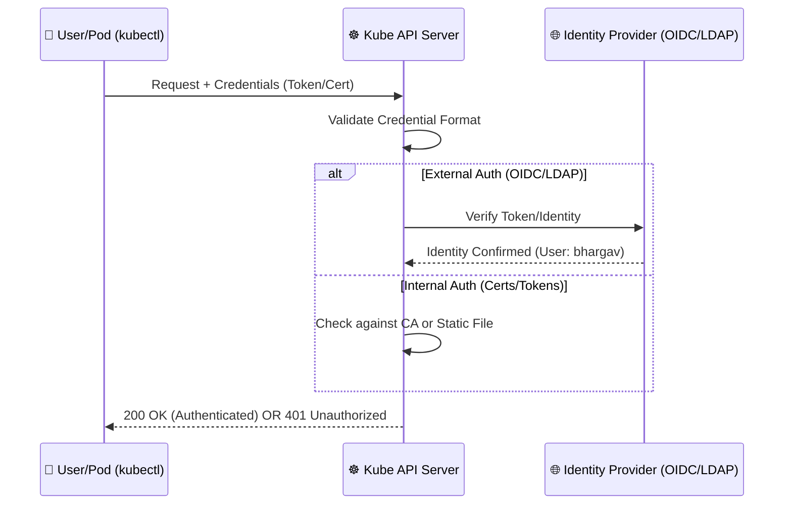

# 🔑 3 -- Authentication in Kubernetes

Welcome to the deep dive into **Kubernetes Authentication**. In the previous section, we discussed security primitives; now, we focus on the first critical gate of the API Server: **Authentication (AuthN)**.

---

## ❓ What is Kubernetes Authentication?

**Authentication (AuthN)** is the process of verifying the identity of a user, a process, or a device attempting to access the Kubernetes API server. 

In simpler terms, while **Authorization** asks *"What are you allowed to do?"*, **Authentication** asks **"Who are you?"**

When you run a command like `kubectl get pods`, you are sending a request to the API server. Before the server checks if you have permission to see pods, it must first verify that you are who you claim to be.

### 🚨 Why is Authentication Critical?
The `kube-apiserver` is the brain of the cluster. If authentication is weak or misconfigured:
1.  **Unauthorized Access:** Anyone with network access to the API could potentially control your entire infrastructure.
2.  **Privilege Escalation:** An attacker could spoof a high-privileged identity (like `cluster-admin`) to delete namespaces or steal secrets.
3.  **Lack of Accountability:** Without strong identity verification, audit logs become useless because you cannot tell which real person performed a destructive action.

---

## 🛠️ How Kubernetes Authenticates: The Flow

Kubernetes does not have a built-in "User Database" (it doesn't store users in a table like a traditional app). Instead, it trusts certificates, tokens, or external identity providers.

### 📊 The Authentication Flow Diagram

---

## 📋 Types of Authentication Mechanisms

Kubernetes supports a variety of methods to authenticate users and services.

### 1. X.509 Client Certificates 📜
Commonly used for internal components (like the Scheduler or Controller Manager) and cluster administrators.
*   **How it works:** The API server is configured with a Cluster Root CA. If a user presents a certificate signed by that CA, they are authenticated.
*   **Pros:** Extremely secure, no passwords to leak.
*   **Cons:** Hard to revoke certificates without rotating the entire CA.

### 2. Service Accounts 🤖
Designed specifically for **machines and pods** running inside the cluster.
*   **How it works:** Every namespace has a `default` service account. K8s automatically mounts a token into the pod at `/var/run/secrets/kubernetes.io/serviceaccount/token`.
*   **Pros:** Automated, native to K8s.
*   **Cons:** If a pod is compromised, the attacker can use this token to attack the API server.

### 3. Bearer Tokens 🎟️
Static or dynamic strings passed in the HTTP header.
*   **How it works:** The user provides a token; the API server verifies it.
*   **Pros:** Easy to use for CI/CD pipelines (e.g., GitHub Actions).
*   **Cons:** If stolen, they provide access until they expire.

### 4. External Identity Providers (The Industry Standard) 🌐
Integrating K8s with systems like **Okta, Azure AD, Google, or LDAP** via **OIDC (OpenID Connect)**.
*   **How it works:** The user authenticates with the external provider $\rightarrow$ Provider gives a JWT (JSON Web Token) $\rightarrow$ User sends JWT to K8s API $\rightarrow$ K8s verifies the JWT signature.
*   **Pros:** Centralized user management, supports Multi-Factor Authentication (MFA).
*   **Cons:** Adds a dependency on an external service.

---

## ⚖️ Comparison Matrix: Which one to use?

| Method | Target User | Security Level | Management Effort | Recommended for Production? |
| :--- | :--- | :--- | :--- | :--- |
| **Certs** | Admins / Components | High | Medium | ✅ Yes (for Admin) |
| **Service Accounts** | Pods / Apps | Medium | Low | ✅ Yes (for Pods) |
| **Static Tokens** | Legacy Scripts | Low | Low | ❌ No |
| **OIDC / LDAP** | Human Users | Very High | High (Initial Setup) | ✅ Yes (Best Practice) |

---

## 🌟 Industry Best Practices

To secure authentication in a production-grade cluster, follow these gold standards:

### 1. 🚫 Avoid Static Password Files
Never use static password/token files. They are stored in plain text on the master node and are a massive security risk.

### 2. 🔑 Use OIDC for Human Users
Never create individual certificates for every employee. Use an OIDC provider (Okta, Keycloak, etc.). This allows you to:
*   Enable **MFA (Multi-Factor Authentication)**.
*   Instantly revoke access when an employee leaves the company.

### 3. 🛡️ Harden Service Accounts
*   **Disable Auto-mounting:** If a pod doesn't need to talk to the API, set `automountServiceAccountToken: false` in the PodSpec.
*   **Least Privilege:** Never give a Service Account `cluster-admin` permissions.

### 4. 🔄 Rotate Credentials Regularly
Implement a rotation policy for certificates and tokens to minimize the impact of a potential leak.

---

## 🎯 Summary Checklist for CKS
- [ ] Understand the difference between AuthN and AuthZ.
- [ ] Know how to identify the authentication method used in a request.
- [ ] Be able to configure a Service Account and disable token automounting.
- [ ] Understand the flow of OIDC authentication.
