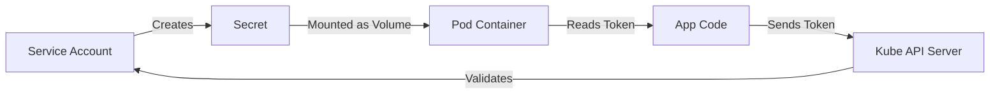

# 🤖 4 -- Service Accounts

In the previous chapter, we learned that the Kubernetes API server needs to know **who** is making a request. While humans use User Accounts, applications and processes use **Service Accounts**.

---

## 👥 User Accounts vs. Service Accounts

Kubernetes distinguishes between identities based on who (or what) is performing the action.

| Feature | User Account | Service Account |
| :--- | :--- | :--- |
| **Primary User** | Humans (Admins, Developers) | Applications, Pods, CI/CD Tools |
| **Management** | Managed externally (OIDC, LDAP, Certs) | Managed natively inside Kubernetes |
| **Lifecycle** | Long-lived, tied to a person | Tied to a Namespace and a Pod's lifecycle |
| **Authentication** | Certificates, Tokens, MFA | Secret-based Bearer Tokens |

**Real-world Example:**
Imagine you deploy a **Prometheus** monitoring tool. Prometheus needs to query the Kubernetes API to find all pods in the cluster to scrape their metrics. Since Prometheus is a piece of software (not a human), it uses a **Service Account** to authenticate itself to the API server.

---

## 🛠️ Hands-on: Creating and Managing Service Accounts

Let's walk through the lifecycle of a service account using a hypothetical "Dashboard" application.

### 1. Creating the Service Account
To create a service account named `dashboard-sa`, use the following command:

```bash
kubectl create serviceaccount dashboard-sa
```

To verify that the service account was created in your current namespace:

```bash
kubectl get serviceaccount
```

**Expected Output:**
```text
NAME           SECRETS   AGE
default        1         218d
dashboard-sa   1         4d
```

### 2. Inspecting the Service Account
To see the details of the account, including which secret is associated with its token:

```bash
kubectl describe serviceaccount dashboard-sa
```

**Key Output to Note:**
```text
Name:                dashboard-sa
Namespace:           default
Labels:              <none>
Annotations:         <none>
Image pull secrets:  <none>
Mountable secrets:   dashboard-sa-token-kbbdm
Tokens:              dashboard-sa-token-kbbdm  <-- This is the secret name
Events:              <none>
```

### 3. Extracting the Authentication Token
The token is not stored in the Service Account object itself, but in a **Secret**. To view the token:

```bash
kubectl describe secret dashboard-sa-token-kbbdm
```

**Output Analysis:**
```text
Name:         dashboard-sa-token-kbbdm
Namespace:    default
Labels:       <none>
Type:         kubernetes.io/service-account-token

Data
====
ca.crt:     1025 bytes
namespace:  7 bytes
token:      eyJhbGciOiJSUzI1NiIsImtpZCI6Ij... <-- This is your Bearer Token
```

---

## 🔌 Using the Token for API Access

Once you have the token, you can use it as a **Bearer Token** in any HTTP request to the Kubernetes API.

### Example: Manual API Call via `curl`
If you wanted to manually list resources using the token we just extracted:

```bash
curl https://<api-server-ip>:6443/api -insecure \
  --header "Authorization: Bearer eyJhbgG..."
```

---

## 📦 Automation: The Pod Mounting Mechanism

In a real production scenario, you don't manually copy-paste tokens into your code. Kubernetes automates this process.

### How it works:
When a pod is created, Kubernetes automatically mounts the service account token as a volume inside the container.

**The Path:**
The token is always mounted at:
` /var/run/secrets/kubernetes.io/serviceaccount/token`



### ⚠️ Default Service Account Behavior
Every Kubernetes namespace contains a `default` service account. If you do not specify a service account in your Pod definition, Kubernetes **automatically** mounts the token of the `default` account.

**Example Pod Definition:**
```yaml
apiVersion: v1
kind: Pod
metadata:
  name: my-kubernetes-dashboard
spec:
  containers:
    - name: my-kubernetes-dashboard
      image: my-kubernetes-dashboard
```

#### Verifying the Default Mount:
You can check if a pod is using the default service account by describing the pod:

```bash
kubectl describe pod my-kubernetes-dashboard
```

**Look for the Mounts section in the output:**
```text
Mounts:
  /var/run/secrets/kubernetes.io/serviceaccount from default-token-j4hkv (ro)
Volumes:
  default-token-j4hkv:
    Type:        Secret (a volume populated by a Secret)
    SecretName:  default-token-j4hkv
```

#### Inspecting the Token Inside the Container:
To see the files actually present inside the running container, use `kubectl exec`:

```bash
# 1. List the files in the secret directory
kubectl exec -it my-kubernetes-dashboard -- ls /var/run/secrets/kubernetes.io/serviceaccount

# Expected Output:
# ca.crt  namespace  token

# 2. View the actual token string
kubectl exec -it my-kubernetes-dashboard -- cat /var/run/secrets/kubernetes.io/serviceaccount/token
```

---

## 🚀 Modern Kubernetes (v1.22+ to v1.34): The Shift to Bound Tokens

**Important Update for Modern Environments:**

While the steps above describe how the system works logically and how you will encounter it in many CKS exam scenarios, modern Kubernetes (v1.22 and beyond, including **v1.34**) has evolved the way tokens are handled to improve security.

### 🛑 Why the Secret-based Approach was Dangerous
1.  **Infinite Life:** Secret-based tokens never expired. If a token was leaked, the attacker had permanent access until the secret was manually deleted.
2.  **Static Storage:** The token was stored in `etcd` as a static Secret, increasing the blast radius if `etcd` was compromised.

### ✅ The Modern Way: Bound Service Account Tokens
Kubernetes now uses the **TokenRequest API**. Instead of a static Secret, the `kubelet` requests a short-lived token from the API server on behalf of the pod.

#### Key Differences in v1.34:

| Feature | Legacy (Secret-based) | Modern (Bound Tokens) |
| :--- | :--- | :--- |
| **Storage** | Stored as a `Secret` object in etcd | Projected as a volume (not stored as a Secret) |
| **Expiration** | Never expires (Long-lived) | **Time-bound** (Expires and rotates automatically) |
| **Scope** | Valid for any pod using that SA | **Pod-bound** (Tied to the specific pod instance) |
| **Security** | High risk of theft/misuse | Low risk; token dies when pod dies |

### 🛠️ Handling Tokens in v1.34
In modern clusters, `kubectl get secrets` will no longer show tokens for new Service Accounts by default.

**If you actually need a long-lived token for an external system (like Jenkins), you must now create the secret manually:**

```yaml
apiVersion: v1
kind: Secret
type: kubernetes.io/service-account-token
metadata:
  name: manual-sa-token
  annotations:
    kubernetes.io/service-account.name: "dashboard-sa"
```

---

## 🛡️ Security Warning: The Danger of Auto-mounting

Regardless of the token version, if an attacker gains a shell inside your pod, they can still read the token from the file system.

### 🚫 Best Practice: Disable Auto-mounting
If your pod **does not** need to talk to the Kubernetes API, you should always disable the token mount in your Pod specification:

```yaml
apiVersion: v1
kind: Pod
metadata:
  name: secure-pod
spec:
  automountServiceAccountToken: false # <--- ALWAYS DISABLE THIS if not needed
  containers:
  - name: my-app
    image: nginx
```

> [!IMPORTANT]
> **CKS Tip:** Always follow the **Principle of Least Privilege (PoLP)**. Create a specific service account for each application and grant it only the minimum RBAC permissions it needs to function. Never use the `default` service account for production apps.
