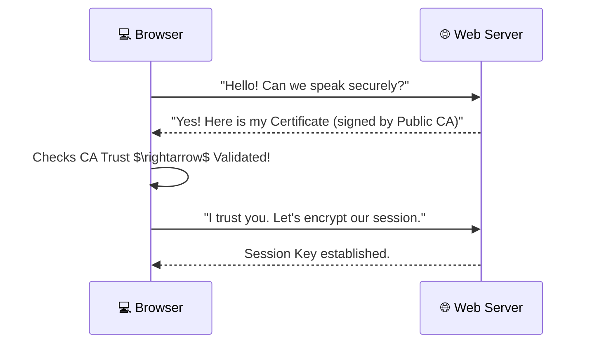
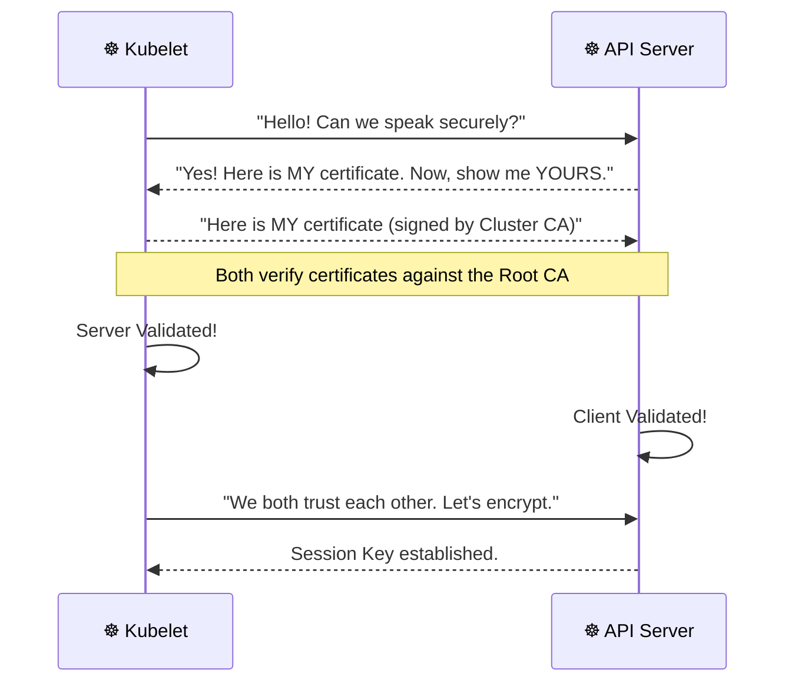

# 🔒 5 -- TLS Introduction

Welcome to the world of **Transport Layer Security (TLS)**. In this module, we move from identifying "who" is calling the API (Authentication) to ensuring that the conversation between those entities is **private, encrypted, and untampered with**.

---

## 🌐 What is TLS? (General Overview)

**TLS (Transport Layer Security)** is the successor to SSL (Secure Sockets Layer). It is the cryptographic protocol that provides security over a computer network. When you see the padlock icon 🔒 in your browser next to `https://`, you are using TLS.

### How "Normal" TLS Works (The Public Web)
In the general web (like visiting Google or Amazon), TLS primarily focuses on **Server Authentication**.

1.  **The Handshake:** Your browser asks the server for its certificate.
2.  **The Trust:** The server sends a certificate signed by a **Public Certificate Authority (CA)** (e.g., DigiCert, Let's Encrypt).
3.  **The Verification:** Your browser already has a list of trusted Public CAs. If the server's certificate is signed by one of them, your browser trusts the server.
4.  **Encryption:** A symmetric session key is created, and all further data is encrypted.

**Key Characteristic:** Usually **One-Way TLS**. The client trusts the server, but the server doesn't necessarily need to know who the client is (it just wants to provide the website to anyone).

---

## ☸️ TLS in the Context of Kubernetes

Kubernetes doesn't rely on public CAs (like Let's Encrypt) for its internal operations. Instead, it uses a **Private Internal CA**.

### How K8s TLS Differs from Web TLS
While the math is the same, the implementation is different:

| Feature | Normal Web TLS | Kubernetes Internal TLS |
| :--- | :--- | :--- |
| **CA Trust** | Public CAs (Trusted by all browsers) | Internal Cluster CA (Trusted only by cluster nodes) |
| **Authentication** | One-Way (Client trusts Server) | **Mutual TLS (mTLS)** (Both trust each other) |
| **Purpose** | Privacy for the end-user | Component-to-Component identity and security |
| **Certificate Life** | Often 90 days to 1 year | Often 1 year (or managed by K8s certificates) |

### 🤝 Mutual TLS (mTLS) in Kubernetes
In Kubernetes, it is not enough for the Kubelet to trust the API Server; the **API Server must also trust the Kubelet**. 

In **mTLS**, both the client and the server present certificates to each other. If either certificate is invalid or not signed by the Cluster Root CA, the connection is immediately dropped. This prevents "Impersonation" attacks.

### 🛠️ Visualizing the TLS Workflow

#### A. One-Way TLS (Web Browsing)

#### B. Mutual TLS (Kubernetes Internal)

---

## 🎯 Module Goals: What We Will Learn

Based on our security roadmap, we will tackle the following objectives step-by-step in the coming lessons:

### 1. 📜 What are TLS Certificates?
We will dive into the anatomy of a certificate:
*   **Private Keys:** The secret used to sign data.
*   **Public Keys:** The key shared with others to verify signatures.
*   **CSR (Certificate Signing Request):** How a component asks the CA for a certificate.
*   **Root CA:** The "Source of Truth" that signs everything else.

### 2. ⚙️ How does Kubernetes use Certificates?
We will map out every encrypted path in the cluster:
*   `API Server` $\leftrightarrow$ `etcd`
*   `API Server` $\leftrightarrow$ `Kubelet`
*   `API Server` $\leftrightarrow$ `Scheduler/Controller Manager`

### 3. 🛠️ How to generate them?
We will learn the tools used to create these certificates, including:
*   `openssl` (The industry standard tool).
*   `cfssl` (Cloudflare's tool, often used in K8s setups).
*   The Kubernetes built-in Certificate Signing Request (CSR) API.

### 4. 🔧 How to configure them?
Learning where the certificates live on the disk (e.g., `/etc/kubernetes/pki`) and how to point the API server configuration to the correct files.

### 5. 🔍 How to view them?
Using commands like `openssl x509 -in <cert> -text -noout` to check:
*   Expiration dates (Is the cert expired?).
*   Common Name (CN) and Subject Alternative Names (SANs).
*   Which CA signed the certificate.

### 6. 🚑 How to troubleshoot Certificate issues?
Learning to identify common errors like:
*   `x509: certificate signed by unknown authority`
*   `x509: certificate has expired or is not yet valid`
*   `hostname mismatch` (The cert is valid, but not for this specific IP/DNS).

---

## 🚀 Quick Summary for CKS

| Concept | Key Takeaway |
| :--- | :--- |
| **TLS** | Encryption $\rightarrow$ Integrity $\rightarrow$ Authenticity. |
| **Private CA** | Kubernetes uses its own root of trust, not a public one. |
| **mTLS** | Both sides must prove their identity. |
| **SANs** | A certificate must list all valid IP addresses/DNS names it covers. |
