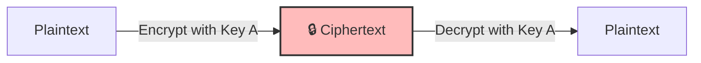
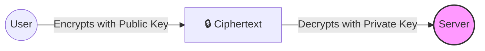
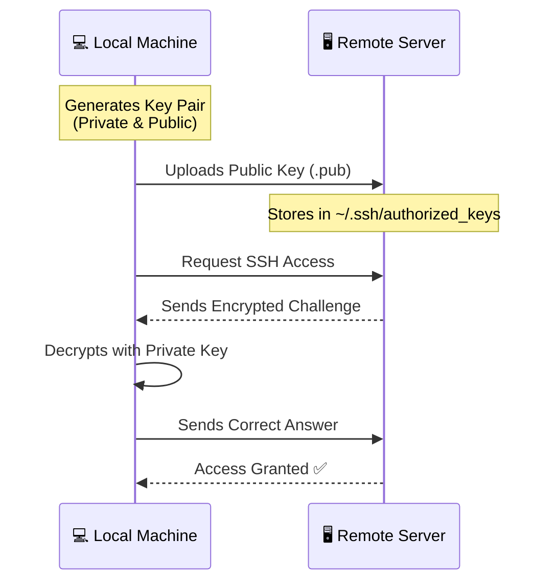
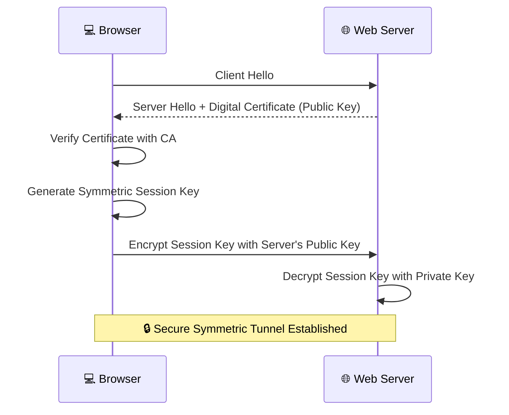
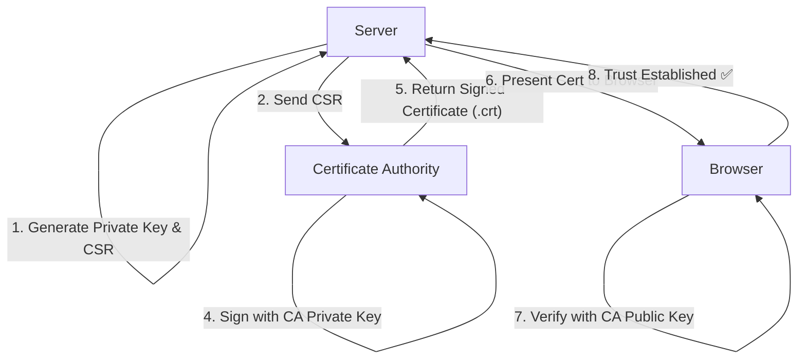

# 📜 5.1 -- TLS Basics

Following our introduction to TLS, this lesson dives deep into the cryptographic foundations that make secure communication possible. We will explore the difference between symmetric and asymmetric encryption, how SSH keys work, and the role of Certificate Authorities (CAs) in establishing trust.

---

## 🔐 Encryption Fundamentals

At its core, TLS is about transforming readable data (**plaintext**) into an unreadable format (**ciphertext**) so that if data is intercepted, it remains useless to the attacker.

### 1. Symmetric Encryption
In symmetric encryption, a **single key** is used for both encryption and decryption.
*   **The Process:** Sender encrypts with Key A $\rightarrow$ Receiver decrypts with Key A.
*   **The Problem:** How do you share Key A with the receiver securely? If an attacker intercepts the key during transmission, they can decrypt everything.



### 2. Asymmetric Encryption (Public Key Cryptography)
To solve the "key exchange" problem, asymmetric encryption uses a **Key Pair**:
*   **Public Key:** Can be shared with anyone. It is used to **encrypt** data.
*   **Private Key:** Must be kept secret. It is the only key that can **decrypt** data encrypted by the public key.

**The Logic:** If I want you to send me a secret message, I give you my Public Key. You encrypt the message with it. Now, even if you (or an attacker) see the encrypted message, only I can read it because only I have the Private Key.



---

## 🔑 Securing SSH with Key Pairs

One of the most common real-world applications of asymmetric encryption is **SSH (Secure Shell)** access to servers.

### 🛠️ The Workflow
Instead of using passwords (which can be brute-forced), we use key pairs:
1.  **Generate Keys:** The user creates a public/private key pair.
2.  **Distribute Public Key:** The public key is placed on the server in the `~/.ssh/authorized_keys` file.
3.  **Authentication:** When the user connects, the server uses the public key to "challenge" the user. Only the holder of the matching private key can answer the challenge.



### 💻 Practical Commands
**Generate a key pair:**
```bash
ssh-keygen -t rsa -b 4096
```
*   `id_rsa`: Your **Private Key** (NEVER share this).
*   `id_rsa.pub`: Your **Public Key** (Share this with the server).

**Access the server using your private key:**
```bash
ssh -i ~/.ssh/id_rsa user@server-ip
```

---

## 🌐 Securing Web Servers (HTTPS)

Web servers use a hybrid approach: **Asymmetric encryption** to securely exchange a **Symmetric key**, which is then used for the rest of the session (because symmetric encryption is much faster).

### The HTTPS Handshake Process:
1.  **The Certificate:** The server sends its **Public Key** to the browser inside a Digital Certificate.
2.  **The Session Key:** The browser generates a random **Symmetric Session Key**.
3.  **The Secure Exchange:** The browser encrypts this Session Key using the server's **Public Key** and sends it back.
4.  **The Decryption:** The server uses its **Private Key** to decrypt the Session Key.
5.  **Secure Tunnel:** Both now have the same Symmetric Key and use it to encrypt all further traffic.



---

## 📄 Digital Certificates & The Role of CAs

A public key by itself doesn't prove identity. Anyone can generate a key pair and claim to be "google.com". This is where **Digital Certificates** and **Certificate Authorities (CAs)** come in.

### 🔍 Anatomy of a Certificate
A certificate is essentially a "Digital ID Card" that contains:
*   **Subject:** Who the certificate belongs to (e.g., `CN=my-bank.com`).
*   **Issuer:** Who signed the certificate (e.g., `CN=DigiCert`).
*   **Validity:** "Not Before" and "Not After" dates.
*   **SANs (Subject Alternative Names):** Other domains the cert covers (e.g., `i-bank.com`, `we-bank.com`).
*   **Public Key:** The actual public key of the server.

### 🏛️ The Trust Chain (CA Process)
1.  **CSR (Certificate Signing Request):** The server generates a private key and a **CSR**. The CSR contains the public key and identity info.
2.  **Validation:** The server sends the CSR to a trusted **CA** (e.g., Symantec, GlobalSign). The CA verifies that the requester actually owns the domain.
3.  **Signing:** The CA signs the certificate with its own **Private Key**.
4.  **Trust:** Browsers come pre-installed with the **Public Keys** of these CAs. When the browser sees a certificate signed by a trusted CA, it trusts the server.



**Command to generate a CSR:**
```bash
openssl req -new -key my-bank.key -out my-bank.csr -subj "/C=US/ST=CA/O=MyOrg, Inc./CN=my-bank.com"
```

---

## 🔄 TLS Communication Recap

| Step | Action | Tool/Key Used |
| :--- | :--- | :--- |
| **1** | Key Generation | `openssl genrsa` $\rightarrow$ Private/Public Pair |
| **2** | Request Signing | CSR $\rightarrow$ Sent to CA |
| **3** | Issuance | CA signs CSR $\rightarrow$ Returns `.crt` file |
| **4** | Distribution | Server sends `.crt` to Client during handshake |
| **5** | Validation | Client checks CA signature using CA Public Key |
| **6** | Key Exchange | Client encrypts Session Key with Server Public Key |
| **7** | Session | Secure communication via Symmetric Session Key |

---

## 📁 PKI & Naming Conventions

Everything described above—CAs, Certificates, Keys, and Trust—is collectively known as **PKI (Public Key Infrastructure)**.

### 🏷️ Common File Extensions
To avoid accidentally sharing your private keys, follow these naming standards:

| Extension | Content | Privacy Level | Example |
| :--- | :--- | :--- | :--- |
| `.key` | Private Key | 🔴 **Top Secret** | `server.key` |
| `.crt` | Certificate (Public) | 🟢 Public | `server.crt` |
| `.pem` | Privacy Enhanced Mail (can be either) | ⚠️ Check contents | `fullchain.pem` |
| `.csr` | Certificate Signing Request | 🟢 Public | `request.csr` |

> [!IMPORTANT]
> **Security Warning:** If a `.key` file is ever accidentally pushed to GitHub or shared, it must be considered compromised. You must revoke the certificate and generate a brand new key pair immediately.
