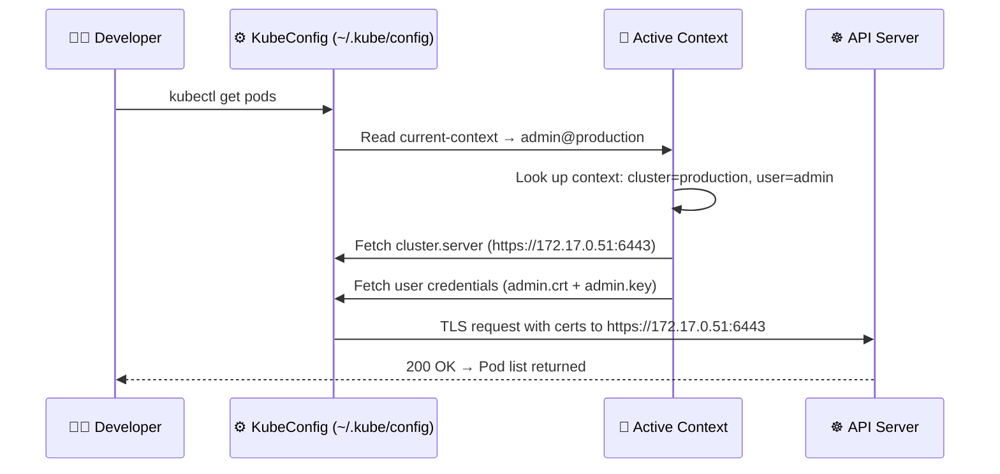
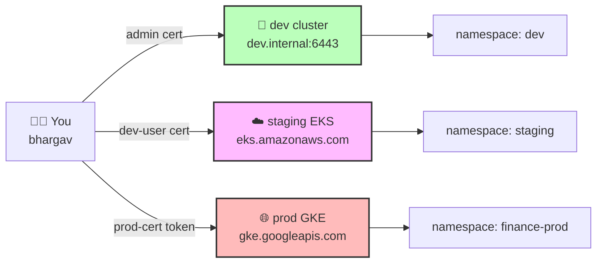
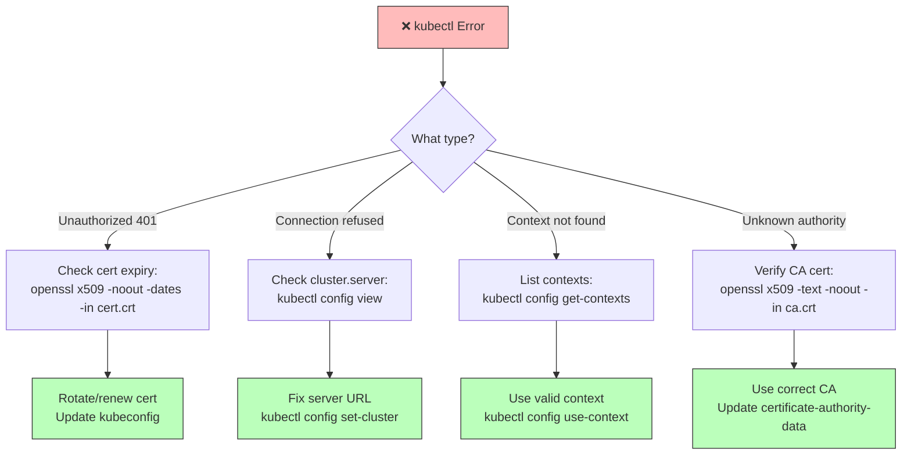

# ⚙️ 6 -- KubeConfig

> **Series:** Cluster Setup & Hardening | **Phase 2: Identity & Access Management**  
> **Prerequisites:** Authentication (Ch. 3), TLS in Kubernetes (Ch. 5.x)

---

## 📌 Table of Contents

1. [The Problem: Life Without KubeConfig](#-the-problem-life-without-kubeconfig)
2. [What is a KubeConfig File?](#-what-is-a-kubeconfig-file)
3. [The Three Pillars: Clusters, Users & Contexts](#-the-three-pillars-clusters-users--contexts)
4. [Full KubeConfig File Structure](#-full-kubeconfig-file-structure)
5. [Essential kubectl config Commands](#-essential-kubectl-config-commands)
6. [Namespaces in KubeConfig](#-namespaces-in-kubeconfig)
7. [Certificate Handling: File Path vs Embedded](#-certificate-handling-file-path-vs-embedded)
8. [Real-World Scenario: Multi-Environment Access](#-real-world-scenario-multi-environment-access)
9. [Security Best Practices](#-security-best-practices)
10. [Troubleshooting KubeConfig Issues](#-troubleshooting-kubeconfig-issues)
11. [Quick Reference Cheat Sheet](#-quick-reference-cheat-sheet)
12. [CKS Exam Tips](#-cks-exam-tips)

---

## ❓ The Problem: Life Without KubeConfig

### Why Does KubeConfig Exist?

In previous chapters, we learned how to authenticate to the Kubernetes API server using TLS certificates. Every API request must carry credentials — the client key, certificate, and the CA certificate that proves the server is trusted.

Without KubeConfig, every single `curl` call and `kubectl` command would look like this:

```bash
# Raw curl — every single time
curl https://my-kube-playground:6443/api/v1/pods \
  --key admin.key \
  --cert admin.crt \
  --cacert ca.crt
```

```bash
# kubectl — equally painful, every single time
kubectl get pods \
  --server my-kube-playground:6443 \
  --client-key admin.key \
  --client-certificate admin.crt \
  --certificate-authority ca.crt
```

### The Pain Points

| Problem | Impact |
|:---|:---|
| **Repetition** | You must type or script credentials with every command |
| **Error-prone** | Typos in paths cause confusing auth errors |
| **Not scalable** | Managing 5+ clusters means 5 sets of flags to remember |
| **Security risk** | Credentials exposed in shell history (`~/.bash_history`) |
| **No context switching** | No clean way to say "I'm now working on prod" |

> **KubeConfig solves all of this** by consolidating credentials, server addresses, and context preferences into a single, structured YAML file that `kubectl` reads automatically.

---

## 🗂️ What is a KubeConfig File?

A **KubeConfig file** is a YAML configuration file that stores:
- The addresses of Kubernetes clusters you want to access
- The credentials (certificates/tokens) of users who can access them
- **Context** definitions that link a user to a cluster (and optionally a namespace)

### Default Location

```
$HOME/.kube/config
```

`kubectl` automatically reads this file. No flags needed.

```bash
# Once kubeconfig is in place, this is all you need:
kubectl get pods
```

### Custom Location

```bash
# Use a specific config file
kubectl get pods --kubeconfig=/path/to/my-custom-config

# Or set the environment variable
export KUBECONFIG=/path/to/my-custom-config
kubectl get pods
```

---

## 🏛️ The Three Pillars: Clusters, Users & Contexts

The KubeConfig file is organized around three core concepts:

```mermaid
graph TD
    KC[⚙️ KubeConfig File]
    KC --> CL[🖥️ Clusters]
    KC --> US[👤 Users]
    KC --> CT[🔗 Contexts]
    KC --> CC[📌 current-context]

    CL --> C1[development\ndev.company.com:6443]
    CL --> C2[production\nprod.company.com:6443]
    CL --> C3[google-gke\ngke.googleapis.com]

    US --> U1[admin\nadmin.crt / admin.key]
    US --> U2[dev-user\ndev.crt / dev.key]
    US --> U3[prod-user\nprod.crt / prod.key]

    CT --> X1[admin@production\nadmin ➜ production]
    CT --> X2[dev-user@google\ndev-user ➜ google-gke]
    CT --> X3[prod-user@production\nprod-user ➜ production]

    CC --> X1

    style KC fill:#f9f,stroke:#333,stroke-width:3px
    style CT fill:#bbf,stroke:#333,stroke-width:2px
    style CC fill:#ff9,stroke:#333,stroke-width:2px
```

### 1. 🖥️ Clusters

A **Cluster** entry stores the API server endpoint and the CA certificate used to verify it.

```yaml
clusters:
- name: production
  cluster:
    server: https://172.17.0.51:6443          # API server address
    certificate-authority: /etc/kubernetes/pki/ca.crt  # CA cert to verify server
```

### 2. 👤 Users

A **User** entry stores the identity credentials — the client certificate and key that prove who you are.

```yaml
users:
- name: admin
  user:
    client-certificate: /home/bhargav/.certs/admin.crt
    client-key: /home/bhargav/.certs/admin.key
```

### 3. 🔗 Contexts

A **Context** is the glue. It binds a **User** to a **Cluster** and optionally sets a default **Namespace**.

```yaml
contexts:
- name: admin@production
  context:
    cluster: production      # ← points to a cluster name
    user: admin              # ← points to a user name
    namespace: kube-system   # ← optional default namespace
```

### Visual Overview


*The diagram above shows how clusters, contexts, and users interrelate in a KubeConfig file.*

---

## 📄 Full KubeConfig File Structure

Here is a complete, annotated KubeConfig file managing access to multiple environments:

```yaml
# ~/.kube/config
apiVersion: v1
kind: Config

# 📌 The active context kubectl uses by default
current-context: admin@production

# ─────────────────────────────────────────────
# 🖥️ CLUSTERS — The servers you talk to
# ─────────────────────────────────────────────
clusters:
- name: my-kube-playground
  cluster:
    certificate-authority: ca.crt
    server: https://my-kube-playground:6443

- name: development
  cluster:
    certificate-authority: /etc/kubernetes/pki/ca.crt
    server: https://dev.internal:6443

- name: production
  cluster:
    certificate-authority: /etc/kubernetes/pki/ca.crt
    server: https://172.17.0.51:6443

- name: google
  cluster:
    certificate-authority-data: LS0tLS1CRUdJTi...  # base64-encoded CA cert
    server: https://34.105.12.99:6443

# ─────────────────────────────────────────────
# 🔗 CONTEXTS — User + Cluster pairings
# ─────────────────────────────────────────────
contexts:
- name: my-kube-admin@my-kube-playground
  context:
    cluster: my-kube-playground
    user: my-kube-admin

- name: dev-user@google
  context:
    cluster: google
    user: dev-user
    namespace: development        # default namespace for this context

- name: admin@production
  context:
    cluster: production
    user: admin
    namespace: default

- name: prod-user@production
  context:
    cluster: production
    user: prod-user
    namespace: finance

# ─────────────────────────────────────────────
# 👤 USERS — The credentials you authenticate with
# ─────────────────────────────────────────────
users:
- name: my-kube-admin
  user:
    client-certificate: admin.crt
    client-key: admin.key

- name: admin
  user:
    client-certificate: /home/bhargav/.certs/admin.crt
    client-key: /home/bhargav/.certs/admin.key

- name: dev-user
  user:
    client-certificate: /home/bhargav/.certs/dev-user.crt
    client-key: /home/bhargav/.certs/dev-user.key

- name: prod-user
  user:
    client-certificate: /home/bhargav/.certs/prod-user.crt
    client-key: /home/bhargav/.certs/prod-user.key
```

### How kubectl Resolves a Request



---

## 🛠️ Essential kubectl config Commands

### Viewing Configuration

```bash
# View the currently active kubeconfig
kubectl config view

# View a specific kubeconfig file (not the default)
kubectl config view --kubeconfig=my-custom-config

# Show only the active (merged) context
kubectl config current-context

# List all available contexts
kubectl config get-contexts

# List all clusters defined in kubeconfig
kubectl config get-clusters

# List all users defined in kubeconfig
kubectl config get-users
```

**Sample output of `kubectl config view`:**

```yaml
apiVersion: v1
kind: Config
current-context: admin@production
clusters:
- cluster:
    certificate-authority: /etc/kubernetes/pki/ca.crt
    server: https://172.17.0.51:6443
  name: production
contexts:
- context:
    cluster: production
    user: admin
  name: admin@production
users:
- name: admin
  user:
    client-certificate: /home/bhargav/.certs/admin.crt
    client-key: /home/bhargav/.certs/admin.key
```

### Switching Contexts

```bash
# Switch to a different context
kubectl config use-context prod-user@production

# After the switch, current-context in the file is updated:
# current-context: prod-user@production
```

### Setting Context Properties

```bash
# Set the namespace for the current context
kubectl config set-context --current --namespace=finance

# Create a completely new context
kubectl config set-context dev-context \
  --cluster=development \
  --user=dev-user \
  --namespace=dev-namespace

# Rename a context
kubectl config rename-context old-name new-name

# Delete a context you no longer need
kubectl config delete-context old-context
```

### Modifying Entries

```bash
# Update a cluster's server address
kubectl config set-cluster production \
  --server=https://new-ip:6443

# Add a new user credential
kubectl config set-credentials new-user \
  --client-certificate=/path/to/new-user.crt \
  --client-key=/path/to/new-user.key

# Remove a user from kubeconfig
kubectl config delete-user old-user
```

### Working With Multiple Kubeconfig Files

```bash
# Merge multiple kubeconfig files temporarily
export KUBECONFIG=~/.kube/config:~/.kube/dev-config:~/.kube/prod-config
kubectl config view --merge --flatten

# Save the merged result permanently
kubectl config view --merge --flatten > ~/.kube/merged-config
```

---

## 🌐 Namespaces in KubeConfig

By default, `kubectl` operates in the `default` namespace. Without a configured namespace, you must add `--namespace=finance` to every command — another form of repetitive typing that KubeConfig eliminates.

### Without Namespace in Context

```yaml
contexts:
- name: admin@production
  context:
    cluster: production
    user: admin
    # No namespace → defaults to "default" namespace
```

```bash
# Must specify namespace every time
kubectl get pods --namespace=finance
kubectl get services --namespace=finance
kubectl get deployments --namespace=finance
```

### With Namespace in Context

```yaml
contexts:
- name: admin@production
  context:
    cluster: production
    user: admin
    namespace: finance        # ← Set once, used automatically
```

```bash
# kubectl now targets the "finance" namespace automatically
kubectl get pods          # → lists pods in "finance"
kubectl get services      # → lists services in "finance"
```

### Namespace per Context Strategy

This is a powerful pattern for teams managing multiple namespaces:

```yaml
contexts:
- name: admin-default@production
  context:
    cluster: production
    user: admin
    namespace: default

- name: admin-finance@production
  context:
    cluster: production
    user: admin
    namespace: finance

- name: admin-monitoring@production
  context:
    cluster: production
    user: admin
    namespace: monitoring
```

```bash
# Switch to finance team's context
kubectl config use-context admin-finance@production
kubectl get pods       # automatically in "finance" namespace

# Switch to monitoring context
kubectl config use-context admin-monitoring@production
kubectl get pods       # automatically in "monitoring" namespace
```

---

## 🔐 Certificate Handling: File Path vs Embedded

There are two ways to provide certificate data in a KubeConfig file. Each has trade-offs:

### Method 1: File Path Reference

```yaml
clusters:
- name: production
  cluster:
    server: https://172.17.0.51:6443
    certificate-authority: /etc/kubernetes/pki/ca.crt   # ← path on disk

users:
- name: admin
  user:
    client-certificate: /home/bhargav/.certs/admin.crt  # ← path on disk
    client-key: /home/bhargav/.certs/admin.key
```

**Pros:** Files can be rotated without touching the kubeconfig  
**Cons:** File paths are machine-specific; breaks when moved to another machine

### Method 2: Embedded Base64 Data

```yaml
clusters:
- name: production
  cluster:
    server: https://172.17.0.51:6443
    certificate-authority-data: LS0tLS1CRUdJTiBDRVJUSUZJQ0FURS0tLS0t...  # base64

users:
- name: admin
  user:
    client-certificate-data: LS0tLS1CRUdJTiBDRVJUSUZJQ0FURS0tLS0t...     # base64
    client-key-data: LS0tLS1CRUdJTiBSU0EgUFJJVkFURSBLRVktLS0tLQ...       # base64
```

**Pros:** Fully portable; works on any machine without needing cert files  
**Cons:** Rotating certs requires updating the kubeconfig itself

### How to Convert Between the Two

```bash
# Encode a certificate file to base64 (for embedding)
cat ca.crt | base64 -w 0
# → LS0tLS1CRUdJTiBDRVJUSUZJQ0FURS0tLS0t...

# Decode embedded base64 data back to a readable cert
echo "LS0tLS1CRUdJTiBDRVJUSUZJQ0FURS0tLS0t..." | base64 --decode

# Verify the decoded certificate
echo "LS0tLS1..." | base64 --decode | openssl x509 -text -noout
```

### Comparison Table

| Feature | File Path (`certificate-authority`) | Embedded (`certificate-authority-data`) |
|:---|:---:|:---:|
| **Portability** | ❌ Machine-specific | ✅ Works anywhere |
| **Cert rotation** | ✅ Update file only | ❌ Must update kubeconfig |
| **Readability** | ✅ Easy to inspect | ❌ Base64 blob |
| **Production use** | ✅ Common | ✅ Common (especially CI/CD) |
| **Security** | ✅ File perms control access | ⚠️ Encoded in the config file |

> [!TIP]
> **Best Practice:** Use **full absolute file paths** in local/developer environments (easier to rotate), and use **embedded base64 data** in CI/CD pipelines or containerized environments where the filesystem is ephemeral.

```yaml
# Production cluster config — best of both (absolute path for CA, embedded for user certs)
clusters:
- name: production
  cluster:
    certificate-authority: /etc/kubernetes/pki/ca.crt   # stable, use path
    certificate-authority-data: LS0tLS1CRUdJTiBDRVJU...  # fallback / override

users:
- name: admin
  user:
    client-certificate-data: LS0tLS1CRUdJTiBDRVJUSUZJQ0FURS0tLS0t...
    client-key-data: LS0tLS1CRUdJTiBSU0EgUFJJVkFURSBLRVktLS0tLQ...
```

> [!IMPORTANT]
> Note: If both `certificate-authority` and `certificate-authority-data` are present, `certificate-authority-data` takes precedence.

---

## 🌍 Real-World Scenario: Multi-Environment Access

### The Scenario

You are a **DevSecOps engineer** at a fintech company managing three Kubernetes clusters:
- `dev` — development cluster in a local data center
- `staging` — staging cluster on AWS EKS
- `prod` — production cluster on GKE (Google Kubernetes Engine)

Each cluster has different users and namespaces. You need to switch between them efficiently and securely throughout your workday.



### The KubeConfig for This Setup

```yaml
apiVersion: v1
kind: Config
current-context: admin@dev    # Start in dev by default

clusters:
- name: dev
  cluster:
    server: https://dev.internal:6443
    certificate-authority: /etc/kubernetes/pki/dev/ca.crt

- name: staging
  cluster:
    server: https://eks-staging.amazonaws.com
    certificate-authority-data: LS0tLS1CRUdJTiBDRVJU...

- name: prod
  cluster:
    server: https://gke.googleapis.com/proj/prod
    certificate-authority-data: LS0tLS1CRUdJTiBDRVJU...

contexts:
- name: admin@dev
  context:
    cluster: dev
    user: admin
    namespace: dev

- name: bhargav@staging
  context:
    cluster: staging
    user: dev-user
    namespace: staging

- name: bhargav@prod
  context:
    cluster: prod
    user: prod-user
    namespace: finance-prod

users:
- name: admin
  user:
    client-certificate: /home/bhargav/.certs/admin.crt
    client-key: /home/bhargav/.certs/admin.key

- name: dev-user
  user:
    client-certificate-data: LS0tLS1CRUdJTiBDRVJUSUZJQ0FURS0t...
    client-key-data: LS0tLS1CRUdJTiBSU0EgUFJJVkFURSBLRVkt...

- name: prod-user
  user:
    client-certificate-data: LS0tLS1CRUdJTiBDRVJUSUZJQ0FURS0t...
    client-key-data: LS0tLS1CRUdJTiBSU0EgUFJJVkFURSBLRVkt...
```

### Daily Workflow

```bash
# Morning: Review dev cluster
kubectl config use-context admin@dev
kubectl get pods           # targets dev namespace automatically

# Afternoon: Deploy to staging
kubectl config use-context bhargav@staging
kubectl apply -f deployment.yaml   # applies to staging namespace

# Evening: Read-only audit of prod
kubectl config use-context bhargav@prod
kubectl get pods           # prod, finance-prod namespace — read only

# Always check where you are before any destructive action!
kubectl config current-context
```

### ⚠️ Real Incident: Tesla Kubernetes Dashboard Breach (2018)

> **What happened:** Attackers discovered Tesla's Kubernetes dashboard was exposed to the public internet **without authentication**. The kubeconfig for the dashboard pod had overly broad permissions.  
> **How it was exploited:** The attackers accessed the dashboard, found AWS credentials in environment variables (Secrets mounted into pods), and used those credentials to access Tesla's S3 buckets — running a cryptomining operation at Tesla's expense.  
> **What this teaches us:**  
> - Never expose the K8s dashboard without authentication  
> - KubeConfig files and credentials inside pods are just as sensitive as root passwords  
> - Always use the Principle of Least Privilege in kubeconfig user credentials

---

## 🛡️ Security Best Practices

### 1. Protect the KubeConfig File

```bash
# The kubeconfig file contains private keys — lock it down
chmod 600 ~/.kube/config
ls -la ~/.kube/config
# -rw------- 1 bhargav bhargav 5432 May 11 10:00 /home/bhargav/.kube/config
```

### 2. Never Commit KubeConfig to Git

```bash
# Add to .gitignore
echo ".kube/config" >> ~/.gitignore
echo "*.kubeconfig" >> ~/.gitignore
echo "kubeconfig*" >> ~/.gitignore
```

### 3. Use Separate KubeConfig Files per Environment

```bash
# Keep prod config separate with tighter permissions
~/.kube/dev-config      # chmod 600
~/.kube/staging-config  # chmod 600
~/.kube/prod-config     # chmod 600, only accessible to senior engineers

# Merge only when needed
export KUBECONFIG=~/.kube/dev-config:~/.kube/staging-config
```

### 4. Validate Your Context Before Destructive Operations

```bash
# Build a safety alias
alias kctx='kubectl config current-context'

# Use before any delete or scale-down
kctx && kubectl delete deployment my-app   # Always confirm context first
```

### 5. Use Short-lived Tokens Instead of Long-lived Certs for Production

```yaml
# For production users, prefer token-based auth (from OIDC / service accounts)
users:
- name: bhargav-prod
  user:
    token: eyJhbGciOiJSUzI1NiIsImtpZCI6Ij...   # Short-lived OIDC token
```

### Security Posture Summary

| Practice | Risk Mitigated | Priority |
|:---|:---|:---:|
| `chmod 600 ~/.kube/config` | Prevents local user theft of credentials | 🔴 Critical |
| Separate prod kubeconfig | Limits blast radius of dev credential leak | 🔴 Critical |
| Never git-commit kubeconfig | Prevents credential exposure in repos | 🔴 Critical |
| Use OIDC tokens (not static certs) for humans | Short-lived, revocable credentials | 🟠 High |
| Validate context before destructive ops | Prevents accidental prod deletions | 🟠 High |
| Embed certs in CI/CD, use paths locally | Portability vs. rotatability balance | 🟡 Medium |

---

## 🚑 Troubleshooting KubeConfig Issues

### Common Errors and Fixes

```bash
# Error: "no such file or directory" for a cert path
# Cause: certificate-authority path doesn't exist on this machine
kubectl config view   # check paths
ls -la /etc/kubernetes/pki/ca.crt   # verify the file exists

# Error: "certificate signed by unknown authority"
# Cause: Wrong CA cert in kubeconfig, or cert-authority-data is corrupted
openssl x509 -in /etc/kubernetes/pki/ca.crt -text -noout | grep Issuer

# Error: "Unauthorized" (401)
# Cause: Expired client cert, or wrong cert for this cluster
openssl x509 -in ~/.certs/admin.crt -noout -dates
# Check: "Not After" date must be in the future

# Error: "context not found"
# Cause: context name in current-context doesn't match any defined context
kubectl config get-contexts   # list all defined contexts
kubectl config use-context <valid-context-name>

# Error: "connection refused"
# Cause: Wrong server address in the cluster config
kubectl config view   # check cluster.server value
curl -k https://<cluster-server>:6443/healthz   # test connectivity
```

### Diagnostic Workflow



---

## 📋 Quick Reference Cheat Sheet

```bash
# ── VIEWING ──────────────────────────────────────────────────
kubectl config view                          # Show active kubeconfig
kubectl config view --minify                 # Show only current context config
kubectl config current-context               # Show active context name
kubectl config get-contexts                  # List all contexts
kubectl config get-clusters                  # List all clusters
kubectl config get-users                     # List all users

# ── SWITCHING ────────────────────────────────────────────────
kubectl config use-context <context-name>    # Switch active context

# ── SETTING / CREATING ───────────────────────────────────────
kubectl config set-context --current --namespace=<ns>     # Change namespace
kubectl config set-context <name> \
  --cluster=<cluster> \
  --user=<user> \
  --namespace=<ns>                           # Create new context
kubectl config set-cluster <name> --server=<url>          # Add/update cluster
kubectl config set-credentials <name> \
  --client-certificate=<path> \
  --client-key=<path>                        # Add/update user

# ── DELETING ─────────────────────────────────────────────────
kubectl config delete-context <name>         # Remove a context
kubectl config delete-cluster <name>         # Remove a cluster
kubectl config delete-user <name>            # Remove a user

# ── MULTI-FILE ───────────────────────────────────────────────
export KUBECONFIG=~/.kube/config:~/.kube/other-config       # Merge on the fly
kubectl config view --merge --flatten > merged.kubeconfig   # Save merged config

# ── CERT UTILITIES ───────────────────────────────────────────
cat cert.crt | base64 -w 0                  # Encode cert for embedding
echo "<base64>" | base64 --decode           # Decode embedded cert
openssl x509 -in cert.crt -noout -dates    # Check cert expiry
openssl x509 -in cert.crt -text -noout    # Full cert inspection
```

---

## 🎯 CKS Exam Tips

| Topic | What to Know | Likely Exam Task |
|:---|:---|:---|
| **Default location** | `~/.kube/config` | Find and use the default kubeconfig |
| **Context switching** | `kubectl config use-context` | Switch to a specific cluster/user |
| **Custom kubeconfig** | `--kubeconfig=` flag | Use a non-default config file |
| **Namespace in context** | `context.namespace` field | Set a default namespace for a context |
| **Embedded certs** | `certificate-authority-data` vs `certificate-authority` | Recognize and decode base64 certs |
| **Troubleshooting** | 401 = bad cert, connection refused = wrong server | Diagnose and fix a broken kubeconfig |

### CKS Exam Checklist

- [ ] Know the three sections: `clusters`, `users`, `contexts`
- [ ] Know how to switch context with `kubectl config use-context`
- [ ] Know how to view and modify the current kubeconfig
- [ ] Understand `certificate-authority` (file path) vs `certificate-authority-data` (base64)
- [ ] Be able to set a default namespace in a context
- [ ] Know where the default kubeconfig lives (`~/.kube/config`)
- [ ] Be able to use `--kubeconfig` flag for non-default files
- [ ] Know how to merge multiple kubeconfig files using `KUBECONFIG` env var

---

> [!NOTE]
> **What's Next?** Now that we can securely authenticate to the cluster and manage our access configuration, the next logical step is **Authorization** — controlling what each authenticated identity is allowed to do. Chapter 7 covers **RBAC (Role-Based Access Control)** in depth.

---

*Part of the [Certified Kubernetes Security Specialist (CKS)](../CKS.md) study series.*
