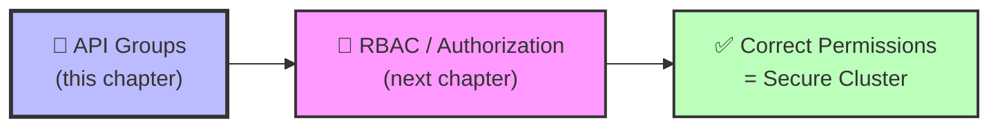
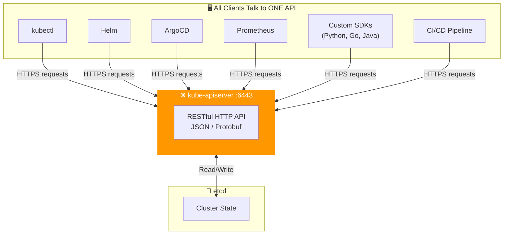
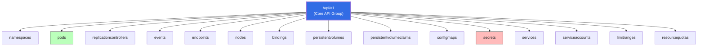
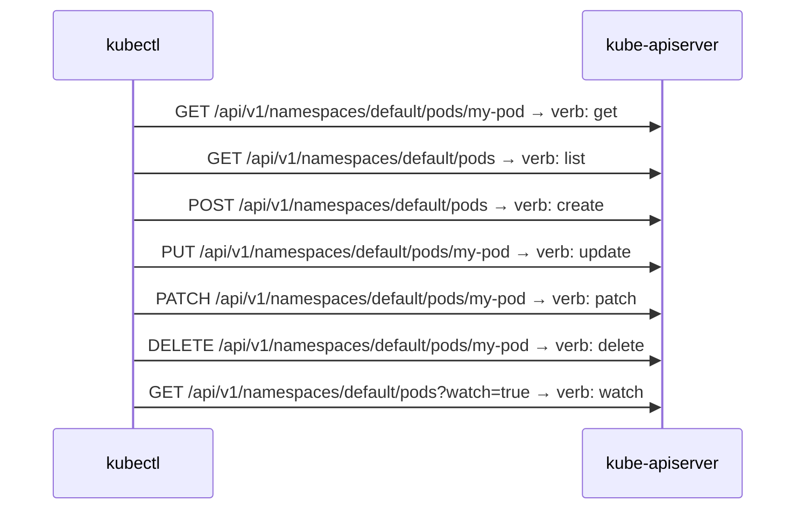
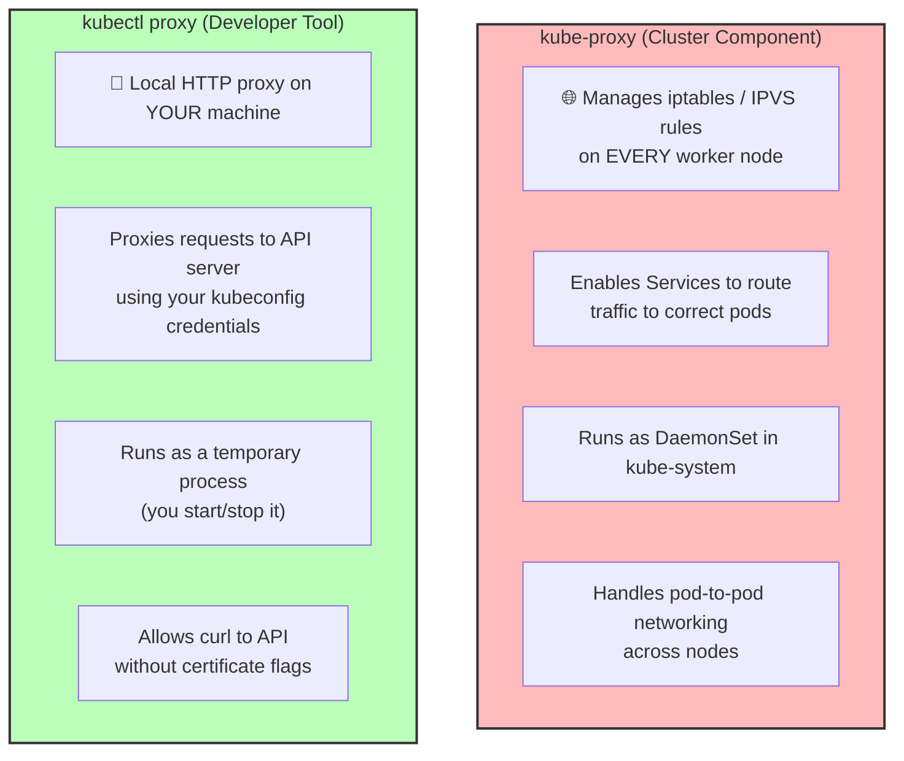

# 🔌 7 -- API Groups

> **Series:** Cluster Setup & Hardening | **Phase 2: Identity & Access Management**  
> **Prerequisites:** Authentication (Ch. 3), KubeConfig (Ch. 6)  
> **Next Up:** Authorization & RBAC (Ch. 8)

---

## 📌 Table of Contents

1. [Why API Groups Matter](#-why-api-groups-matter)
2. [What is the Kubernetes API?](#-what-is-the-kubernetes-api)
3. [The API Endpoint Landscape](#-the-api-endpoint-landscape)
4. [Core API Group — `/api`](#-core-api-group--api)
5. [Named API Groups — `/apis`](#-named-api-groups--apis)
6. [API Verbs — The Actions on Resources](#-api-verbs--the-actions-on-resources)
7. [Exploring the API Server Live](#-exploring-the-api-server-live)
8. [kubectl proxy vs kube-proxy](#-kubectl-proxy-vs-kube-proxy)
9. [Real-World Scenarios](#-real-world-scenarios)
10. [Security Implications of API Groups](#-security-implications-of-api-groups)
11. [API Groups → RBAC Connection](#-api-groups--rbac-connection)
12. [Quick Reference Cheat Sheet](#-quick-reference-cheat-sheet)
13. [CKS Exam Tips](#-cks-exam-tips)

---

## ❓ Why API Groups Matter

Before you can understand **Authorization (RBAC)**, you must first understand the **structure of what you are authorizing against**. RBAC rules are written in terms of:

```
Who  +  What API Group  +  What Resource  +  What Verb  =  Permission
```

For example: *"The developer `bhargav` can `get` and `list` `pods` in the `core` API group."*

If you don't know what API groups and verbs exist, you cannot write correct RBAC policies — which means either **over-permissioning** (security risk) or **under-permissioning** (application breaks).



### Real-World Consequence

> In 2022, a misconfigured RBAC policy at a Fortune 500 company gave a developer service account access to `secrets` in the `core` API group cluster-wide. An attacker who compromised the pod used this to read database credentials from every namespace. The root cause: the engineer didn't understand API groups and used `"*"` as the API group wildcard.

---

## 🌐 What is the Kubernetes API?

The **Kubernetes API** is the single interface through which **everything** in a Kubernetes cluster is created, read, updated, and deleted. There is no back-channel — every operation, from every tool, goes through the API server.



### Checking the API Server Version

The simplest API call — check what version the cluster is running:

```bash
# Direct curl (from master node)
curl https://kube-master:6443/version
```

**Response:**

```json
{
  "major": "1",
  "minor": "13",
  "gitVersion": "v1.13.0",
  "gitCommit": "ddf47ac13c1a9483ea035a79cd7c1005ff21a6d",
  "gitTreeState": "clean",
  "buildDate": "2018-12-03T20:56:12Z",
  "goVersion": "go1.11.2",
  "compiler": "gc",
  "platform": "linux/amd64"
}
```

```bash
# The easier kubectl equivalent
kubectl version --short

# Or with full JSON output
kubectl version -o json
```

---

## 🗺️ The API Endpoint Landscape

When you hit the root of the API server, Kubernetes returns all available top-level endpoints. These are the major categories that the API is divided into:

```bash
curl http://localhost:6443 -k
```

```json
{
  "paths": [
    "/api",
    "/api/v1",
    "/apis",
    "/apis/",
    "/healthz",
    "/logs",
    "/metrics",
    "/openapi/v2",
    "/swagger-2.0.0.json"
  ]
}
```

### The Top-Level API Endpoints


*The six primary endpoint categories of the Kubernetes API.*

| Endpoint | Purpose | Example Use |
|:---|:---|:---|
| `/version` | Returns cluster version info | Checking K8s version |
| `/healthz` | Returns cluster health status | Used by load balancers, monitoring |
| `/metrics` | Prometheus-format cluster metrics | Scraped by Prometheus/Datadog |
| `/logs` | Integration with external logging | Connects to EFK/ELK stacks |
| `/api` | **Core API Group** — foundational resources | Pods, Nodes, Services, Secrets |
| `/apis` | **Named API Groups** — extended resources | Deployments, NetworkPolicies, CRDs |

```bash
# Check cluster health (used in readiness probes for the API server itself)
curl https://kube-master:6443/healthz -k
# → ok

# Check detailed health of individual components
curl https://kube-master:6443/healthz?verbose -k
# → [+]ping ok
# → [+]log ok
# → [+]etcd ok
# → [+]informer-sync ok
# → healthz check passed
```

---

## 📦 Core API Group — `/api`

The **Core API Group** (also called the **Legacy API Group**) lives at `/api/v1`. It contains the most fundamental Kubernetes resources — the building blocks that existed from the very beginning of Kubernetes.

### Visual Structure of the Core API


*The hierarchy of the Core API Group showing `/api/v1` and its resources.*

### Core API Resources



### Core API Resources Reference

| Resource | Short Name | Namespaced? | Description |
|:---|:---:|:---:|:---|
| `namespaces` | `ns` | ❌ No | Logical cluster partitions |
| `pods` | `po` | ✅ Yes | The smallest deployable unit |
| `services` | `svc` | ✅ Yes | Stable networking endpoint for pods |
| `nodes` | `no` | ❌ No | Physical/virtual machines in cluster |
| `secrets` | — | ✅ Yes | Sensitive data (passwords, tokens, keys) |
| `configmaps` | `cm` | ✅ Yes | Non-sensitive configuration data |
| `persistentvolumes` | `pv` | ❌ No | Cluster-wide storage resource |
| `persistentvolumeclaims` | `pvc` | ✅ Yes | Request for storage by a pod |
| `serviceaccounts` | `sa` | ✅ Yes | Identity for pods |
| `events` | `ev` | ✅ Yes | Cluster activity log entries |
| `replicationcontrollers` | `rc` | ✅ Yes | Legacy pod replication (use Deployments) |
| `resourcequotas` | `quota` | ✅ Yes | Limits on resource consumption |
| `limitranges` | — | ✅ Yes | Default resource limits per namespace |
| `endpoints` | `ep` | ✅ Yes | Lists of pod IPs behind a Service |
| `bindings` | — | ✅ Yes | Assigns pods to nodes (used by scheduler) |

```bash
# Explore the core API group directly
curl http://localhost:8001/api/v1

# List all resources in the core group
kubectl api-resources --api-group=""
# NAME                     SHORTNAMES  APIVERSION  NAMESPACED  KIND
# bindings                             v1          true        Binding
# configmaps               cm          v1          true        ConfigMap
# endpoints                ep          v1          true        Endpoints
# events                   ev          v1          true        Event
# namespaces               ns          v1          false       Namespace
# nodes                    no          v1          false       Node
# pods                     po          v1          true        Pod
# secrets                               v1          true        Secret
# services                 svc         v1          true        Service
# ...

# Query pods via REST (core API path)
curl http://localhost:8001/api/v1/pods
curl http://localhost:8001/api/v1/namespaces/default/pods
curl http://localhost:8001/api/v1/namespaces/production/services
```

---

## 🗂️ Named API Groups — `/apis`

The **Named API Groups** (also called the **Extension API Groups**) live under `/apis`. They were introduced to organize newer Kubernetes features into logical categories and allow independent versioning of each group.

### Named API Groups Structure

```mermaid
graph TD
    APIS["/apis\n(Named API Groups)"]

    APIS --> APP["/apis/apps"]
    APIS --> NET["/apis/networking.k8s.io"]
    APIS --> STOR["/apis/storage.k8s.io"]
    APIS --> AUTH["/apis/authentication.k8s.io"]
    APIS --> AUTHZ["/apis/authorization.k8s.io"]
    APIS --> CERT["/apis/certificates.k8s.io"]
    APIS --> RBAC["/apis/rbac.authorization.k8s.io"]
    APIS --> BATCH["/apis/batch"]
    APIS --> ADMIS["/apis/admissionregistration.k8s.io"]
    APIS --> APIEXT["/apis/apiextensions.k8s.io"]
    APIS --> POLICY["/apis/policy"]
    APIS --> HPA["/apis/autoscaling"]

    APP --> D["deployments"]
    APP --> RS["replicasets"]
    APP --> SS["statefulsets"]
    APP --> DS["daemonsets"]

    NET --> NP["networkpolicies"]
    NET --> ING["ingresses"]
    NET --> IC["ingressclasses"]

    RBAC --> ROLE["roles"]
    RBAC --> CR["clusterroles"]
    RBAC --> RB["rolebindings"]
    RBAC --> CRB["clusterrolebindings"]

    CERT --> CSR["certificatesigningrequests"]

    style APIS fill:#326CE5,color:#fff,stroke-width:3px
    style RBAC fill:#fbb,stroke:#333,stroke-width:2px
    style NET fill:#fbf,stroke:#333
```



### Complete Named API Groups Reference

| API Group | Path | Key Resources | Version |
|:---|:---|:---|:---:|
| **Apps** | `/apis/apps` | Deployments, ReplicaSets, StatefulSets, DaemonSets | `v1` |
| **Batch** | `/apis/batch` | Jobs, CronJobs | `v1` |
| **Autoscaling** | `/apis/autoscaling` | HorizontalPodAutoscaler | `v2` |
| **Networking** | `/apis/networking.k8s.io` | NetworkPolicies, Ingresses, IngressClasses | `v1` |
| **Storage** | `/apis/storage.k8s.io` | StorageClasses, VolumeAttachments, CSI drivers | `v1` |
| **RBAC** | `/apis/rbac.authorization.k8s.io` | Roles, ClusterRoles, RoleBindings, ClusterRoleBindings | `v1` |
| **Certificates** | `/apis/certificates.k8s.io` | CertificateSigningRequests | `v1` |
| **Authentication** | `/apis/authentication.k8s.io` | TokenReviews, TokenRequests | `v1` |
| **Authorization** | `/apis/authorization.k8s.io` | SubjectAccessReviews, LocalSubjectAccessReviews | `v1` |
| **Admission** | `/apis/admissionregistration.k8s.io` | MutatingWebhooks, ValidatingWebhooks | `v1` |
| **API Extensions** | `/apis/apiextensions.k8s.io` | CustomResourceDefinitions (CRDs) | `v1` |
| **Policy** | `/apis/policy` | PodDisruptionBudgets | `v1` |

```bash
# List all available named API groups
curl http://localhost:8001/apis

# Explore the apps group
curl http://localhost:8001/apis/apps/v1

# List all resources in the apps group
kubectl api-resources --api-group="apps"
# NAME                  SHORTNAMES  APIVERSION  NAMESPACED  KIND
# controllerrevisions               apps/v1     true        ControllerRevision
# daemonsets            ds          apps/v1     true        DaemonSet
# deployments           deploy      apps/v1     true        Deployment
# replicasets           rs          apps/v1     true        ReplicaSet
# statefulsets          sts         apps/v1     true        StatefulSet

# Query deployments via REST API directly
curl http://localhost:8001/apis/apps/v1/deployments
curl http://localhost:8001/apis/apps/v1/namespaces/default/deployments

# Query network policies
curl http://localhost:8001/apis/networking.k8s.io/v1/networkpolicies
```

### API Versioning — Why It Matters

Named groups support **multiple API versions simultaneously** — allowing safe evolution of the API:

| Version Label | Stability | Use Case |
|:---:|:---|:---|
| `v1alpha1` | Unstable — may change or disappear | Experimental features |
| `v1beta1` | More stable — some breaking changes possible | Testing in non-prod |
| `v1` | **Stable** — guaranteed backward compatibility | Production workloads |

```bash
# See all versions available for a resource
kubectl explain deployment --api-version=apps/v1

# Check what deprecated APIs you're using (critical before upgrades!)
kubectl api-resources --verbs=list -o wide | grep -v "v1$"
```

---

## ⚡ API Verbs — The Actions on Resources

Every resource in every API group supports a set of **verbs** (HTTP methods mapped to semantic actions). These verbs are the exact permission tokens used in RBAC rules.

### API Groups, Resources, and Verbs Together


*How API Groups, Resources, and Verbs interact to form the permission model.*

### Pod v1 Core — Real API Documentation Example


*The official Kubernetes API reference for "Pod v1 core" showing group details and available API actions.*

### Complete Verb Reference

| Verb | HTTP Method | What it Does | Example |
|:---|:---:|:---|:---|
| `get` | GET | Retrieve a single named resource | `kubectl get pod my-pod` |
| `list` | GET | Retrieve a collection of resources | `kubectl get pods` |
| `watch` | GET + `?watch=true` | Stream changes to resources in real time | `kubectl get pods --watch` |
| `create` | POST | Create a new resource | `kubectl apply -f pod.yaml` |
| `update` | PUT | Replace the entire resource | `kubectl replace -f pod.yaml` |
| `patch` | PATCH | Apply a partial update | `kubectl patch pod my-pod ...` |
| `delete` | DELETE | Delete a single resource | `kubectl delete pod my-pod` |
| `deletecollection` | DELETE (collection) | Delete multiple resources at once | `kubectl delete pods --all` |
| `exec` | POST | Execute a command in a container | `kubectl exec -it pod -- bash` |
| `portforward` | POST | Forward ports to a pod | `kubectl port-forward pod 8080:80` |
| `proxy` | GET | Proxy HTTP to a pod | `kubectl proxy` |
| `bind` | POST | Bind a pod to a node (scheduler only) | Internal scheduler use |
| `escalate` | POST | Allow users to escalate roles | Dangerous — restrict tightly |
| `impersonate` | POST | Act as another user/group/SA | Used by `kubectl --as=` |

### Verbs Mapped to HTTP



```bash
# See which verbs a resource supports
kubectl api-resources -o wide | grep pods
# NAME  SHORTNAMES  APIVERSION  NAMESPACED  KIND  VERBS
# pods  po          v1          true        Pod   create,delete,deletecollection,get,list,patch,update,watch

# Check all supported verbs for ALL resources
kubectl api-resources -o wide

# Test if YOU can perform a specific verb
kubectl auth can-i get pods -n production
kubectl auth can-i create deployments -n staging
kubectl auth can-i delete secrets --all-namespaces

# Test what another user/SA can do
kubectl auth can-i list pods --as=dev-user -n production
kubectl auth can-i create secrets --as=system:serviceaccount:default:my-sa
```

---

## 🔍 Exploring the API Server Live

### Method 1: Direct curl with Certificate Auth

When accessing the API directly without `kubectl proxy`, you must present certificates:

```bash
# Without auth — likely restricted (only /version, /healthz accessible)
curl https://kube-master:6443 -k

# With certificate authentication — full access
curl https://kube-master:6443 -k \
  --key admin.key \
  --cert admin.crt \
  --cacert /etc/kubernetes/pki/ca.crt

# List all pods in default namespace via REST
curl https://kube-master:6443/api/v1/namespaces/default/pods \
  --key admin.key \
  --cert admin.crt \
  --cacert /etc/kubernetes/pki/ca.crt
```

### Method 2: kubectl proxy (Recommended)

`kubectl proxy` starts a local HTTP proxy that uses credentials from your kubeconfig — no need to pass certificates with every request:

```bash
# Start the proxy (runs in foreground — use & to background it)
kubectl proxy
# Starting to serve on 127.0.0.1:8001

# In another terminal — now access API without any auth flags
curl http://localhost:8001/api
curl http://localhost:8001/api/v1/pods
curl http://localhost:8001/apis/apps/v1/deployments

# Custom port
kubectl proxy --port=9090

# Background the proxy
kubectl proxy &
# Then kill it when done
kill %1
```

**Full API exploration via proxy:**

```bash
# Start proxy first
kubectl proxy &

# Then explore the full API structure
curl http://localhost:8001/                          # All top-level paths
curl http://localhost:8001/api                       # Core group version info
curl http://localhost:8001/api/v1                    # All core resources
curl http://localhost:8001/apis                      # All named groups
curl http://localhost:8001/apis/apps/v1              # Apps group resources
curl http://localhost:8001/apis/apps/v1/deployments  # All deployments (cluster-wide)
curl http://localhost:8001/apis/apps/v1/namespaces/default/deployments  # In namespace
curl http://localhost:8001/apis/networking.k8s.io/v1/networkpolicies    # Net policies
curl http://localhost:8001/apis/rbac.authorization.k8s.io/v1/clusterroles # ClusterRoles

# Pretty print JSON output
curl -s http://localhost:8001/api/v1 | python3 -m json.tool
curl -s http://localhost:8001/apis | jq '.groups[].name'
```

**Sample response from `/api/v1`:**

```json
{
  "kind": "APIResourceList",
  "groupVersion": "v1",
  "resources": [
    {
      "name": "pods",
      "singularName": "",
      "namespaced": true,
      "kind": "Pod",
      "verbs": ["create", "delete", "deletecollection", "get", "list", "patch", "update", "watch"],
      "shortNames": ["po"],
      "categories": ["all"]
    },
    {
      "name": "secrets",
      "singularName": "",
      "namespaced": true,
      "kind": "Secret",
      "verbs": ["create", "delete", "deletecollection", "get", "list", "patch", "update", "watch"]
    }
  ]
}
```

### Method 3: kubectl Built-in API Exploration

```bash
# Discover all API resources across all groups
kubectl api-resources
kubectl api-resources --namespaced=true     # Only namespace-scoped resources
kubectl api-resources --namespaced=false    # Only cluster-scoped resources

# Discover API versions in use
kubectl api-versions
# Output includes:
# admissionregistration.k8s.io/v1
# apiextensions.k8s.io/v1
# apps/v1
# authentication.k8s.io/v1
# authorization.k8s.io/v1
# autoscaling/v1
# autoscaling/v2
# batch/v1
# certificates.k8s.io/v1
# networking.k8s.io/v1
# rbac.authorization.k8s.io/v1
# storage.k8s.io/v1
# v1   ← This is the core API group

# Get detailed schema for any resource
kubectl explain pods
kubectl explain pods.spec
kubectl explain pods.spec.containers
kubectl explain deployment.spec.strategy
kubectl explain networkpolicy.spec.ingress
```

---

## ⚠️ kubectl proxy vs kube-proxy

These two sound almost identical but serve completely **different purposes**. This is a common source of confusion — and a CKS exam favorite.


*kube-proxy ≠ kubectl proxy — they are fundamentally different components.*

### Side-by-Side Comparison



| Feature | `kube-proxy` | `kubectl proxy` |
|:---|:---|:---|
| **What it is** | A cluster daemon (DaemonSet) | A developer tool / command |
| **Runs on** | Every worker node | Your local machine |
| **Purpose** | Pod-to-Service networking | Secure API server access |
| **Who manages it** | Kubernetes (automatically) | You (manually start/stop) |
| **Network scope** | Cluster-wide iptables/IPVS | Local HTTP on `127.0.0.1:8001` |
| **Authentication** | Node identity | Uses your kubeconfig credentials |
| **Lives in** | `kube-system` namespace | Terminal session |
| **Failure impact** | Services stop routing | You lose local API access only |

```bash
# kube-proxy — check status (cluster component)
kubectl -n kube-system get pods -l k8s-app=kube-proxy
kubectl -n kube-system logs -l k8s-app=kube-proxy

# kubectl proxy — developer tool (run locally)
kubectl proxy                         # Starts on port 8001
kubectl proxy --port=9090             # Custom port
kubectl proxy --address='0.0.0.0'    # Bind to all interfaces (use carefully)
curl http://localhost:8001/healthz    # Access API through the proxy
```

---

## 🌍 Real-World Scenarios

### Scenario 1: Debugging API Access Issues

A developer reports that their application can't connect to the Kubernetes API. You need to understand which API group the resource belongs to and verify access.

```bash
# Step 1: Find out which API group the resource is in
kubectl api-resources | grep "networkpolicies"
# NAME              SHORTNAMES  APIVERSION               NAMESPACED  KIND
# networkpolicies   netpol      networking.k8s.io/v1     true        NetworkPolicy

# Step 2: Check if the service account can access it
kubectl auth can-i list networkpolicies \
  --as=system:serviceaccount:production:my-app \
  --namespace=production
# no

# Step 3: Identify the correct API group for the RBAC rule
# API Group: networking.k8s.io
# Resource: networkpolicies
# Verb: list

# Step 4: Now you know exactly what RBAC role to create
cat << EOF | kubectl apply -f -
apiVersion: rbac.authorization.k8s.io/v1
kind: Role
metadata:
  name: netpol-reader
  namespace: production
rules:
- apiGroups: ["networking.k8s.io"]    # ← The API group we discovered
  resources: ["networkpolicies"]       # ← The resource name
  verbs: ["get", "list", "watch"]     # ← The required verbs
EOF
```

### Scenario 2: Discovering Custom Resource Definitions (CRDs)

In companies using ArgoCD, Istio, or Cert-Manager, there are custom API groups beyond the standard ones:

```bash
# List all API groups including CRDs
kubectl api-versions | sort

# Example output including CRDs:
# argoproj.io/v1alpha1         ← ArgoCD
# cert-manager.io/v1           ← Cert-Manager
# networking.istio.io/v1alpha3 ← Istio
# monitoring.coreos.com/v1     ← Prometheus Operator
# karpenter.sh/v1beta1         ← Karpenter

# Query ArgoCD Applications via REST
curl http://localhost:8001/apis/argoproj.io/v1alpha1/applications

# Check what CRDs are installed
kubectl get crds
kubectl get crds | grep "cert-manager"
```

### Scenario 3: API Group Deprecation During Upgrades

Before a Kubernetes version upgrade, you must check for deprecated APIs:

```bash
# Check what deprecated API versions your manifests use
# (Critical before upgrading from K8s 1.24 → 1.25+)
kubectl api-resources -o wide | grep "networking.k8s.io"

# Use kubent (Kubernetes No-Trouble) to scan for deprecated APIs
kubent   # Checks all cluster resources against deprecated API list

# Check what API version a live resource is using
kubectl get deployment my-app -o yaml | head -5
# apiVersion: apps/v1   ← Good: stable version

# Check ingress API version (changed in K8s 1.22)
kubectl get ingress my-ingress -o yaml | head -3
# apiVersion: networking.k8s.io/v1   ← Good
# (was: extensions/v1beta1 — removed in K8s 1.22)
```

### Scenario 4: Using the API to Build an Internal Tool

A DevSecOps engineer builds a Python script that monitors for privileged pods using the API directly:

```python
# api-security-monitor.py
# Monitors Kubernetes API for privileged containers using the core API group

import requests
import json
import sys

# Using kubectl proxy — no auth needed
BASE_URL = "http://localhost:8001"

def get_all_pods():
    """GET /api/v1/pods — list verb on pods resource, core API group"""
    resp = requests.get(f"{BASE_URL}/api/v1/pods")
    resp.raise_for_status()
    return resp.json()["items"]

def check_privileged(pods):
    """Find containers running with privileged: true"""
    findings = []
    for pod in pods:
        ns = pod["metadata"]["namespace"]
        name = pod["metadata"]["name"]
        containers = pod["spec"].get("containers", [])
        for container in containers:
            sc = container.get("securityContext", {})
            if sc.get("privileged") == True:
                findings.append({
                    "namespace": ns,
                    "pod": name,
                    "container": container["name"],
                    "severity": "CRITICAL"
                })
    return findings

if __name__ == "__main__":
    pods = get_all_pods()
    findings = check_privileged(pods)
    if findings:
        print("🚨 PRIVILEGED CONTAINERS FOUND:")
        for f in findings:
            print(f"  {f['namespace']}/{f['pod']}:{f['container']} — {f['severity']}")
        sys.exit(1)
    else:
        print("✅ No privileged containers found")
```

---

## 🔐 Security Implications of API Groups

Understanding API groups is not just an operational concern — it has direct security implications:

### 1. Over-Permissive API Group Wildcards

```yaml
# ❌ DANGEROUS — wildcard API group gives access to EVERYTHING
rules:
- apiGroups: ["*"]          # All API groups
  resources: ["*"]          # All resources
  verbs: ["*"]              # All verbs — this is cluster-admin!
```

```yaml
# ✅ CORRECT — explicit, minimal API group access
rules:
- apiGroups: [""]           # Core API group only
  resources: ["pods", "configmaps"]
  verbs: ["get", "list"]
- apiGroups: ["apps"]       # Named group for deployments
  resources: ["deployments"]
  verbs: ["get", "list", "watch"]
```

### 2. Sensitive Resources by API Group

| API Group | Sensitive Resource | Why It's Dangerous |
|:---|:---|:---|
| `""` (core) | `secrets` | Contains passwords, API keys, tokens |
| `""` (core) | `serviceaccounts` | Identity theft for pods |
| `rbac.authorization.k8s.io` | `clusterroles` | Can grant any permission |
| `rbac.authorization.k8s.io` | `clusterrolebindings` | Privilege escalation vector |
| `certificates.k8s.io` | `certificatesigningrequests` | Can issue cluster-admin certs |
| `authentication.k8s.io` | `tokenreviews` | Can verify any token |
| `authorization.k8s.io` | `subjectaccessreviews` | Can check any permission |

### 3. Dangerous Verb Combinations

| Verb | Resource | Risk |
|:---|:---|:---|
| `create` | `clusterrolebindings` | Attacker can grant themselves cluster-admin |
| `update` | `clusterroles` | Attacker can add permissions to an existing role |
| `get` | `secrets` | Exfiltrate all passwords and API keys |
| `exec` | `pods` | Remote code execution in any pod |
| `list` + `get` | `secrets` | Read all secrets across namespace |
| `create` | `pods` | Can create privileged pods for container escape |
| `bind` | `clusterroles` | Can bind any role to any user |
| `escalate` | `clusterroles` | Bypass privilege escalation restrictions |
| `impersonate` | `users` | Act as any user including cluster-admin |

```bash
# Audit which RBAC rules touch the most dangerous API groups
kubectl get clusterroles -o json | jq -r '
  .items[] |
  select(.rules[]?.apiGroups[]? == "rbac.authorization.k8s.io") |
  .metadata.name'

# Find who can create/modify secrets
kubectl get rolebindings,clusterrolebindings -A -o json | jq -r '
  .items[] |
  select(.roleRef.name | test("admin|edit")) |
  "\(.metadata.namespace // "cluster-wide"): \(.subjects[]?.name)"'
```

---

## 🔗 API Groups → RBAC Connection

This is the direct bridge between this chapter and the next. Every RBAC rule is expressed in terms of:
- **`apiGroups`** — Which API group (core `""`, `apps`, `networking.k8s.io`, etc.)
- **`resources`** — Which resource within that group (`pods`, `deployments`, etc.)
- **`verbs`** — What action (`get`, `list`, `create`, etc.)

### Quick Mapping: Resource → API Group

```mermaid
graph LR
    subgraph RULES["RBAC Rule Examples"]
        R1["apiGroups: [\"\"] ← empty string\nresources: [\"pods\"]\nverbs: [\"get\", \"list\"]"]
        R2["apiGroups: [\"apps\"]\nresources: [\"deployments\"]\nverbs: [\"create\", \"update\"]"]
        R3["apiGroups: [\"networking.k8s.io\"]\nresources: [\"networkpolicies\"]\nverbs: [\"get\", \"list\"]"]
        R4["apiGroups: [\"rbac.authorization.k8s.io\"]\nresources: [\"roles\", \"rolebindings\"]\nverbs: [\"get\", \"list\"]"]
    end
```

### Complete Resource → API Group Quick Reference

| Resource | API Group String (for RBAC) |
|:---|:---|
| `pods`, `secrets`, `services`, `configmaps`, `nodes` | `""` (empty string = core) |
| `deployments`, `replicasets`, `statefulsets`, `daemonsets` | `"apps"` |
| `jobs`, `cronjobs` | `"batch"` |
| `horizontalpodautoscalers` | `"autoscaling"` |
| `networkpolicies`, `ingresses` | `"networking.k8s.io"` |
| `storageclasses`, `volumeattachments` | `"storage.k8s.io"` |
| `roles`, `clusterroles`, `rolebindings`, `clusterrolebindings` | `"rbac.authorization.k8s.io"` |
| `certificatesigningrequests` | `"certificates.k8s.io"` |
| `poddisruptionbudgets` | `"policy"` |
| Custom Resources (e.g., ArgoCD) | `"argoproj.io"` (the CRD group) |

```bash
# Golden tip: When writing RBAC rules, always look up the correct API group first
kubectl api-resources | grep <resource-name>

# Example: What API group is "ingresses" in?
kubectl api-resources | grep ingress
# NAME            SHORTNAMES   APIVERSION                 NAMESPACED   KIND
# ingressclasses               networking.k8s.io/v1       false        IngressClass
# ingresses       ing          networking.k8s.io/v1       true         Ingress
# So apiGroups: ["networking.k8s.io"]  ← use this in your RBAC rule
```

---

## 📋 Quick Reference Cheat Sheet

```bash
# ═══════════════════════════════════════════════════════
#  DISCOVERING API GROUPS & RESOURCES
# ═══════════════════════════════════════════════════════
kubectl api-resources                          # All resources + their API groups
kubectl api-resources -o wide                  # Include supported verbs
kubectl api-resources --namespaced=true        # Namespace-scoped only
kubectl api-resources --namespaced=false       # Cluster-scoped only
kubectl api-resources --api-group="apps"       # Resources in a specific group
kubectl api-resources | grep <resource>        # Find a specific resource's group
kubectl api-versions                           # All API versions available

# ═══════════════════════════════════════════════════════
#  EXPLORING THE API DIRECTLY
# ═══════════════════════════════════════════════════════
kubectl proxy &                                # Start proxy on :8001
curl http://localhost:8001/                    # All top-level paths
curl http://localhost:8001/api                 # Core group info
curl http://localhost:8001/api/v1              # Core resources list
curl http://localhost:8001/apis                # All named groups
curl http://localhost:8001/apis/apps/v1        # Apps group resources
curl http://localhost:8001/apis/<group>/<ver>/namespaces/<ns>/<resource>

# With cert auth (no proxy)
curl https://kube-master:6443/<path> \
  --key admin.key \
  --cert admin.crt \
  --cacert /etc/kubernetes/pki/ca.crt

# ═══════════════════════════════════════════════════════
#  CHECKING API VERSIONS & DEPRECATIONS
# ═══════════════════════════════════════════════════════
kubectl explain <resource>                     # Resource schema + API group
kubectl explain <resource>.<field>.<subfield>  # Deep field inspection
kubectl get <resource> -o yaml | head -5       # Check apiVersion of live object

# ═══════════════════════════════════════════════════════
#  PERMISSION TESTING (uses verb + API group knowledge)
# ═══════════════════════════════════════════════════════
kubectl auth can-i <verb> <resource>           # Test your own permissions
kubectl auth can-i <verb> <resource> --as=<user>  # Test another user
kubectl auth can-i --list -n <namespace>       # List all your permissions
kubectl auth can-i --list --as=<user>          # List user's permissions
kubectl auth can-i create pods --all-namespaces # Cluster-wide check
```

---

## 🎯 CKS Exam Tips

| Topic | Key Point | Likely Exam Task |
|:---|:---|:---|
| **Core API group** | The API group string is `""` (empty string), not `"v1"` or `"core"` | Write a correct RBAC rule for pods/secrets |
| **Named API groups** | Know at least: `apps`, `networking.k8s.io`, `rbac.authorization.k8s.io`, `certificates.k8s.io` | Fix a broken RBAC rule by providing the correct group |
| **Finding API groups** | Use `kubectl api-resources \| grep <resource>` to find the group | Look up which group `ingresses` or `networkpolicies` belongs to |
| **kubectl proxy** | It's a local tool, NOT kube-proxy; uses your kubeconfig | Use proxy to explore the API server |
| **Verb awareness** | Know: get, list, watch, create, update, patch, delete, exec, bind, escalate, impersonate | Identify what a CertificateSigningRequest workflow needs |
| **Security** | `"*"` in apiGroups or verbs = cluster-admin equivalent | Spot over-permissive RBAC rules |

### CKS Exam Checklist

- [ ] Know the two main API group categories: **Core** (`/api`) and **Named** (`/apis`)
- [ ] Remember: the RBAC apiGroup for core resources is `""` (empty string)
- [ ] Know which resources live in which API groups (especially `apps`, `networking.k8s.io`, `rbac.authorization.k8s.io`)
- [ ] Understand API verbs and which ones are most security-sensitive (`exec`, `escalate`, `impersonate`, `bind`)
- [ ] Know how to use `kubectl proxy` to explore the API without certificate flags
- [ ] Know the critical difference: `kube-proxy` (cluster networking) ≠ `kubectl proxy` (dev API access)
- [ ] Be able to use `kubectl api-resources | grep <resource>` to find any resource's API group
- [ ] Understand why wildcard `"*"` in API groups/verbs is dangerous in RBAC

---

> [!NOTE]
> **What's Next?** Now that you understand the structure of the Kubernetes API — its groups, resources, and verbs — you have everything you need to understand **Authorization**. Chapter 8 covers **RBAC (Role-Based Access Control)** in depth: how to write Roles and ClusterRoles using exactly the API group knowledge from this chapter, and how to bind them to users and service accounts securely.

---

*Part of the [Certified Kubernetes Security Specialist (CKS)](../CKS.md) study series.*
