# 🔐 8 -- Authorization in Kubernetes

> **Series:** Cluster Setup & Hardening | **Phase 2: Identity & Access Management**  
> **Chapter Goal:** Understand every authorization mechanism Kubernetes supports — how they work, when to use them, and how to configure multiple modes to chain together a secure authorization pipeline.

---

## 📌 Table of Contents

1. [Authentication vs Authorization — The Critical Distinction](#-authentication-vs-authorization--the-critical-distinction)
2. [Why Authorization Matters](#-why-authorization-matters)
3. [The Six Authorization Modes](#-the-six-authorization-modes)
4. [Node Authorization](#-node-authorization)
5. [Attribute-Based Authorization (ABAC)](#-attribute-based-authorization-abac)
6. [Role-Based Access Control (RBAC)](#-role-based-access-control-rbac)
7. [Webhook-Based Authorization](#-webhook-based-authorization)
8. [AlwaysAllow and AlwaysDeny](#-alwaysallow-and-alwaysdeny)
9. [Configuring Multiple Authorization Modes](#-configuring-multiple-authorization-modes)
10. [How the Authorization Chain Works](#-how-the-authorization-chain-works)
11. [Real-World Scenarios](#-real-world-scenarios)
12. [Commands Reference](#-commands-reference)
13. [Concepts at a Glance](#-concepts-at-a-glance)

---

## 🔄 Authentication vs Authorization — The Critical Distinction

Before diving into authorization mechanisms, it's essential to understand how authorization fits into the broader Kubernetes security model. People often confuse these two steps — they are completely different gates.

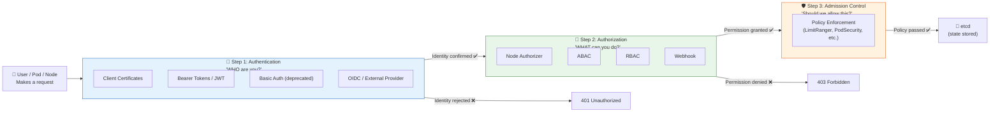

| | **Authentication** | **Authorization** |
|:---|:---|:---|
| **Question asked** | "Who are you?" | "What are you allowed to do?" |
| **Happens when** | First — before anything else | Second — after identity is confirmed |
| **Failure response** | `401 Unauthorized` | `403 Forbidden` |
| **Mechanism** | Certificates, tokens, OIDC | Node, ABAC, RBAC, Webhook |
| **Analogy** | Showing your ID badge at the door | Being allowed into only certain rooms |

> **Think of it like a hospital:**  
> - **Authentication** = Your employee ID gets you through the front door (proves you work there)  
> - **Authorization** = Your role determines which wards you can enter (doctor vs. janitor vs. admin)

---

## 🤔 Why Authorization Matters

### The Problem Without Authorization

Imagine you hire a new developer named Alex for your team. You create a Kubernetes user for Alex and give access to the cluster. Without proper authorization policies, Alex could accidentally (or intentionally):

- Delete production pods
- Modify cluster configurations
- Read secrets containing database passwords
- Delete entire namespaces
- Drain nodes and cause outages

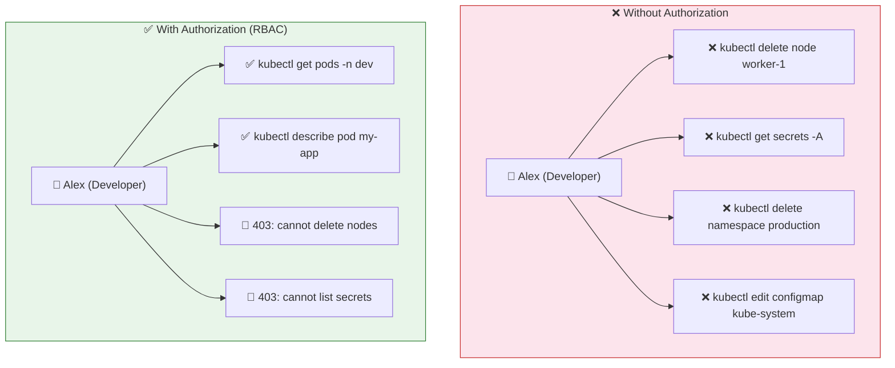

### Real Permission Examples

**As an admin — full access:**

```bash
kubectl get pods
# NAME    READY   STATUS    RESTARTS   AGE

kubectl get nodes
# NAME        STATUS   ROLES     AGE     VERSION
# worker-1    Ready    <none>    5d21h   v1.13.0

kubectl delete node worker-2
# Node worker-2 Deleted!
```

**As a restricted developer — limited access:**

```bash
kubectl get pods
# (works — they have pod read access)

kubectl get nodes
# Error from server (Forbidden): nodes is forbidden:
# User "developer" cannot list resource "nodes" in API group ""
# at the cluster scope

kubectl delete node worker-2
# Error from server (Forbidden): nodes "worker-2" is forbidden:
# User "developer" cannot delete resource "nodes"
# in API group "" at the cluster scope
```

The 403 error tells you exactly: **who** tried, **what** they tried, and **why** it was denied.

### Use Cases That Demand Fine-Grained Authorization

| Scenario | Who Gets What |
|:---|:---|
| Multi-team cluster | Dev team: pods in `dev` namespace only; Ops team: full cluster access |
| Jenkins CI/CD | Jenkins SA: deploy to `staging` only; cannot touch `production` |
| Monitoring (Prometheus) | Read-only access to pods, nodes, metrics; no write permissions |
| Multi-tenant SaaS | Each customer's SA is confined to their own namespace |
| Security team | Read access to all namespaces; approve CSRs; cannot delete pods |
| External auditors | Read-only; cannot modify anything |

---

## 🗂️ The Six Authorization Modes

Kubernetes supports six authorization modes. You configure them on the kube-apiserver:

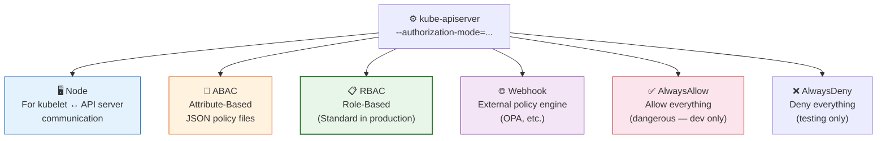

| Mode | Best For | Scalability | Ease of Management |
|:---|:---:|:---:|:---:|
| **Node** | kubelet access only | N/A (built-in) | Auto |
| **ABAC** | Simple, static setups | ❌ Poor | ❌ Hard (requires restart) |
| **RBAC** | Production clusters | ✅ Excellent | ✅ Easy (kubectl) |
| **Webhook** | Complex, dynamic policies | ✅ Excellent | ⚠️ Requires external service |
| **AlwaysAllow** | Development / testing | N/A | ⚠️ Dangerous |
| **AlwaysDeny** | Testing / emergencies | N/A | ⚠️ Blocks everything |

---

## 🖥️ Node Authorization

### What Is It?

Node Authorization is a **special-purpose authorizer** built specifically to handle requests from **kubelets** — the agents running on each worker node. Kubelets need to talk to the API server constantly to do their job, and Node Authorization controls exactly what they're allowed to do.


### What Does a Kubelet Need to Read and Write?

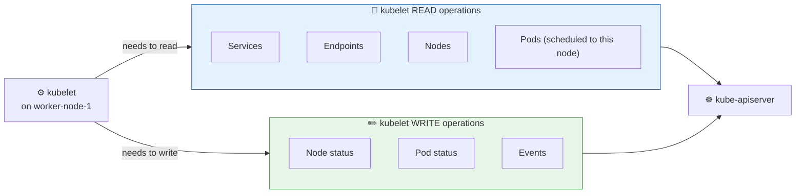

**Read permissions** (kubelet needs to know what to run):
- **Services & Endpoints** — to configure networking for pods
- **Nodes** — to understand cluster topology
- **Pods** — to know which pods are scheduled on this node

**Write permissions** (kubelet needs to report back):
- **Node status** — "I'm healthy, my CPU usage is X%"
- **Pod status** — "This pod is Running / Failed / Pending"
- **Events** — "The image pull failed because..."

### How Node Authorization Identifies Kubelets

The Node Authorizer uses a very specific credential pattern to identify kubelets:


Kubelets must authenticate with:
- **Username prefix:** `system:node:<node-name>`
- **Group membership:** `system:nodes`

```bash
# The certificate a kubelet uses looks like this (inside the cert's Subject field):
# CN=system:node:worker-1
# O=system:nodes

# You can verify a node's certificate:
openssl x509 -in /var/lib/kubelet/pki/kubelet-client-current.pem \
  -noout -subject
# subject=O=system:nodes, CN=system:node:worker-1
```

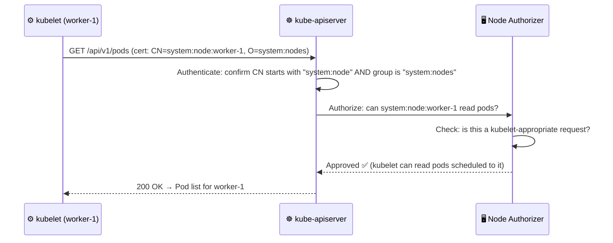

### Why a Separate Authorizer for Kubelets?

Because kubelets have a unique, tightly scoped set of needs that don't fit RBAC well. Kubelets should **only** be able to read pods assigned to **their node** — not pods on other nodes. Node Authorization enforces this node-scoped restriction automatically, which RBAC would require complex policy to replicate.

> **Security note:** If an attacker compromises one worker node and steals its kubelet certificate, they can only access data for that specific node — not the entire cluster. This is defense-in-depth at the authorization layer.

---

## 📄 Attribute-Based Authorization (ABAC)

### What Is It?

ABAC (Attribute-Based Access Control) is the predecessor to RBAC. Instead of roles, you define **JSON policy objects** in a file, where each line is a policy granting specific access to a specific user or group.

### How It Works

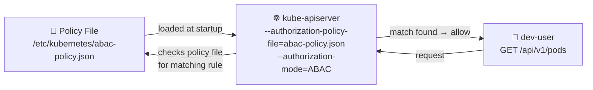

### Example Policy File

Each line is a complete, standalone JSON policy:

```json
{"kind": "Policy", "spec": {"user": "dev-user", "namespace": "*", "resource": "pods", "apiGroup": "*"}}
{"kind": "Policy", "spec": {"user": "dev-user-2", "namespace": "*", "resource": "pods", "apiGroup": "*"}}
{"kind": "Policy", "spec": {"group": "dev-users", "namespace": "*", "resource": "pods", "apiGroup": "*"}}
{"kind": "Policy", "spec": {"user": "security-1", "namespace": "*", "resource": "csr", "apiGroup": "*"}}
```

**Policy fields explained:**

| Field | Description | Example |
|:---|:---|:---|
| `user` | The specific username this policy applies to | `"dev-user"` |
| `group` | Applies to all users in this group | `"dev-users"` |
| `namespace` | Which namespace (use `"*"` for all) | `"default"` or `"*"` |
| `resource` | The Kubernetes resource type | `"pods"`, `"secrets"`, `"csr"` |
| `apiGroup` | Which API group (use `"*"` for all) | `""` or `"apps"` or `"*"` |

### The Critical Problem with ABAC

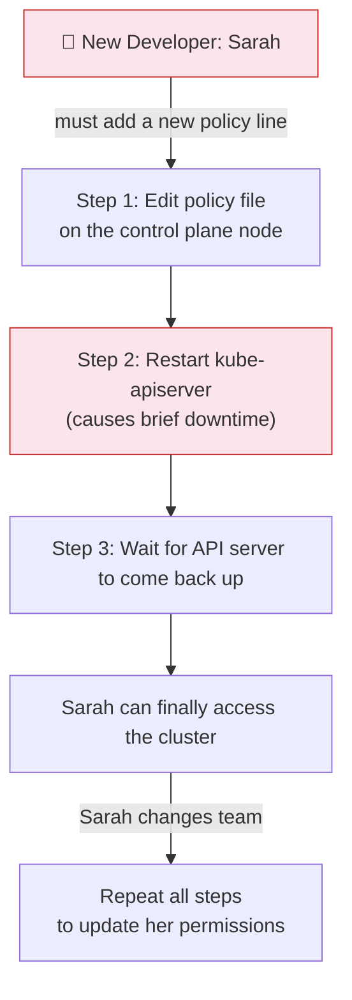

**Why ABAC doesn't scale:**

- **Every change requires a restart** of kube-apiserver — this is disruptive
- **No `kubectl` commands** — you edit raw JSON files on the control plane node
- **Hard to audit** — one long file with no structured tooling
- **No grouping of permissions** — each user needs their own lines repeated
- **Error-prone** — JSON typos are silent failures

> **Bottom line:** ABAC is considered legacy. Use RBAC instead. You may still encounter ABAC in older clusters or exam questions, but you should never configure it for a new production cluster.

---

## 📋 Role-Based Access Control (RBAC)

### What Is It?

RBAC is the **standard authorization mechanism** in production Kubernetes. Instead of writing policies per user, you define **Roles** (sets of permissions) and **bind** them to users or service accounts.


### Why RBAC is Better Than ABAC

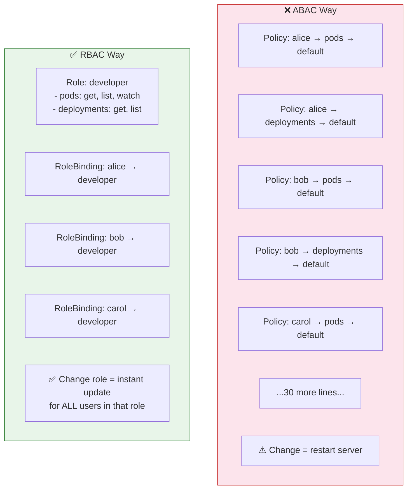

**When you update a Role's permissions, every user bound to that Role instantly gets the new permissions — no restart required.**

### The 4 RBAC Objects

| Object | Scope | Purpose |
|:---|:---:|:---|
| **Role** | One namespace | Defines permissions within a namespace |
| **ClusterRole** | All namespaces | Defines permissions cluster-wide |
| **RoleBinding** | One namespace | Assigns a Role/ClusterRole to users in one namespace |
| **ClusterRoleBinding** | All namespaces | Assigns a ClusterRole cluster-wide |

### Quick RBAC Example

```yaml
# Role — "What can be done"
apiVersion: rbac.authorization.k8s.io/v1
kind: Role
metadata:
  name: developer
  namespace: default
rules:
- apiGroups: [""]         # Core group (pods, services, secrets)
  resources: ["pods"]
  verbs: ["get", "list", "watch", "create", "update"]
- apiGroups: ["apps"]     # Named group (deployments)
  resources: ["deployments"]
  verbs: ["get", "list"]
```

```yaml
# RoleBinding — "Who gets that Role"
apiVersion: rbac.authorization.k8s.io/v1
kind: RoleBinding
metadata:
  name: developer-binding
  namespace: default
subjects:
- kind: User
  name: alex              # ← the developer
  apiGroup: rbac.authorization.k8s.io
roleRef:
  kind: Role
  name: developer
  apiGroup: rbac.authorization.k8s.io
```

> **RBAC is covered in depth in Chapter 8.1.** This chapter focuses on the authorization framework; RBAC configuration details, ClusterRoles, and advanced patterns are in the next chapter.

---

## 🌐 Webhook-Based Authorization

### What Is It?

Webhook authorization lets you **outsource authorization decisions to an external HTTP service**. When a user makes a request, Kubernetes calls your external service with the request details. Your service replies: allow or deny.

### Why Use Webhook Authorization?

RBAC is powerful but has limits:
- RBAC can't enforce time-based access (e.g., "only during business hours")
- RBAC can't enforce context-based rules (e.g., "only from this IP range")
- RBAC can't enforce complex business logic (e.g., "deny if budget is exceeded")

Webhook authorization handles all of these by delegating to a service that can run arbitrary logic.

### How Webhook Authorization Works

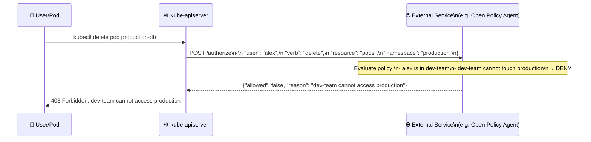

### Open Policy Agent (OPA) — Most Common Webhook Target

[Open Policy Agent](https://www.openpolicyagent.org/) is the de facto standard for Kubernetes webhook authorization. It uses a policy language called **Rego** to define rules:

```rego
# OPA Rego policy: Block any request to the "production" namespace
# unless the user is in the "ops-team" group

package kubernetes.admission

deny[msg] {
    input.request.namespace == "production"
    not input.request.userInfo.groups[_] == "ops-team"
    msg := "Only ops-team members can access the production namespace"
}
```

**Capabilities that Webhook/OPA adds beyond RBAC:**

| Capability | RBAC | Webhook/OPA |
|:---|:---:|:---:|
| Allow list verbs on resources | ✅ | ✅ |
| Restrict by namespace | ✅ | ✅ |
| Restrict by time of day | ❌ | ✅ |
| Restrict by IP address | ❌ | ✅ |
| Enforce label requirements | ❌ | ✅ |
| Enforce image registry policies | ❌ | ✅ |
| Prevent privileged containers | ❌ | ✅ |
| Custom business logic | ❌ | ✅ |

### Configuring Webhook Authorization

```yaml
# /etc/kubernetes/webhook-config.yaml
apiVersion: v1
kind: Config
clusters:
- name: opa-webhook
  cluster:
    server: https://opa.company.com/authorize    # ← Your external service
    certificate-authority: /etc/kubernetes/pki/opa-ca.crt
users:
- name: kube-apiserver
  user:
    client-certificate: /etc/kubernetes/pki/webhook-client.crt
    client-key: /etc/kubernetes/pki/webhook-client.key
current-context: webhook
contexts:
- context:
    cluster: opa-webhook
    user: kube-apiserver
  name: webhook
```

```bash
# kube-apiserver startup flag to enable webhook:
--authorization-mode=Node,RBAC,Webhook \
--authorization-webhook-config-file=/etc/kubernetes/webhook-config.yaml
```

---

## ✅❌ AlwaysAllow and AlwaysDeny

These are the two simplest authorization modes — and the least safe.

### AlwaysAllow

```
--authorization-mode=AlwaysAllow
```

**What it does:** Every request from every user is approved — no checks at all. This is the **default mode** if you don't specify `--authorization-mode`.

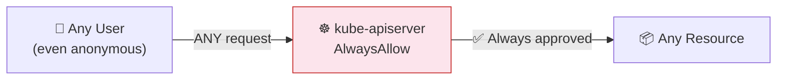

**When to use:** Development clusters on your local machine (minikube, kind) where you're the only user and you want quick access without setting up RBAC. **Never in production.**

**Risk:** A single compromised token or misconfigured service account gives full cluster access to anyone.

### AlwaysDeny

```
--authorization-mode=AlwaysDeny
```

**What it does:** Every request from every user is denied — no exceptions.

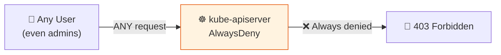

**When to use:** Testing your authorization pipeline — you set AlwaysDeny first to confirm all requests fail, then layer other modes to verify they work. Also useful for temporary emergency lockdown.

### Comparing All Modes

| Mode | Use Case | Production Safe? | Requires Config? |
|:---|:---|:---:|:---:|
| **Node** | kubelet ↔ API server | ✅ Yes | No (built-in) |
| **ABAC** | Legacy / simple setups | ⚠️ Avoid | Yes (JSON file) |
| **RBAC** | Standard production | ✅ Yes | Yes (kubectl) |
| **Webhook** | Complex / dynamic policies | ✅ Yes | Yes (external service) |
| **AlwaysAllow** | Local dev only | ❌ No | No |
| **AlwaysDeny** | Testing / lockdown | ⚠️ Blocks all | No |

---

## ⚙️ Configuring Multiple Authorization Modes

### The `--authorization-mode` Flag

The kube-apiserver takes a comma-separated list of modes. The order matters — requests are evaluated left to right.

```bash
ExecStart=/usr/local/bin/kube-apiserver \
  --advertise-address=${INTERNAL_IP} \
  --allow-privileged=true \
  --apiserver-count=3 \
  --authorization-mode=Node,RBAC,Webhook \    # ← Order matters!
  --bind-address=0.0.0.0 \
  --etcd-cafile=/var/lib/kubernetes/ca.pem \
  --etcd-certfile=/var/lib/kubernetes/apiserver-etcd-client.crt \
  --etcd-keyfile=/var/lib/kubernetes/apiserver-etcd-client.key \
  --etcd-servers=https://127.0.0.1:2379 \
  --event-ttl=1h \
  --kubelet-certificate-authority=/var/lib/kubernetes/ca.pem \
  --kubelet-client-certificate=/var/lib/kubernetes/apiserver-etcd-client.crt \
  --kubelet-client-key=/var/lib/kubernetes/apiserver-etcd-client.key \
  --service-node-port-range=30000-32767 \
  --client-ca-file=/var/lib/kubernetes/ca.crt \
  --tls-cert-file=/var/lib/kubernetes/apiserver.crt \
  --tls-private-key-file=/var/lib/kubernetes/apiserver.key \
  --v=2
```

### Checking the Current Mode on a kubeadm Cluster

```bash
# On the control plane node:
cat /etc/kubernetes/manifests/kube-apiserver.yaml | grep authorization-mode
# - --authorization-mode=Node,RBAC

# Or check the running process:
ps aux | grep kube-apiserver | grep authorization-mode
```

### AlwaysAllow (Default if Unset)

```bash
ExecStart=/usr/local/bin/kube-apiserver \
  --advertise-address=${INTERNAL_IP} \
  --authorization-mode=AlwaysAllow \          # ← All requests pass — dev only!
  ...
```

> **Default behaviour:** If you omit `--authorization-mode` entirely, Kubernetes defaults to `AlwaysAllow`. Always explicitly set this flag in production.

---

## 🔗 How the Authorization Chain Works

This is one of the most important concepts to understand for the CKS exam.

### The Rule: First Approval Wins, First Explicit Denial Passes to Next

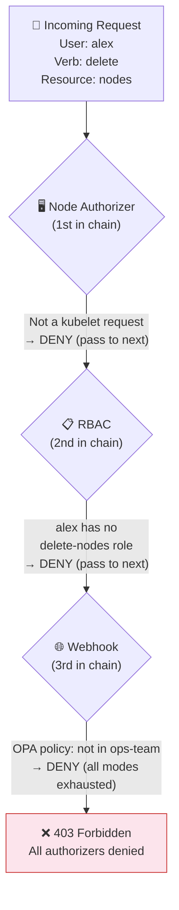

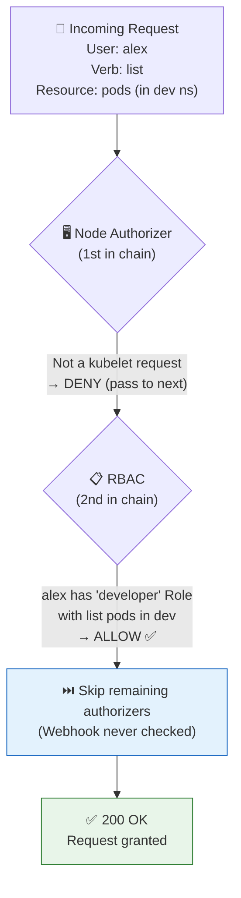

### The Decision Matrix

| Authorizer Returns | Result |
|:---|:---|
| **Allow** | Request is granted immediately — remaining authorizers are **skipped** |
| **Deny** | Move to the **next authorizer** in the chain |
| **No opinion** | Same as Deny — move to the **next authorizer** |
| **All authorizers deny** | Request is rejected with **403 Forbidden** |

> **Critical exam point:** A "deny" from one authorizer does NOT immediately reject the request. It just moves to the next one. Only when ALL authorizers have been exhausted without any granting the request does Kubernetes return 403.

### The Standard Production Chain: `Node,RBAC,Webhook`

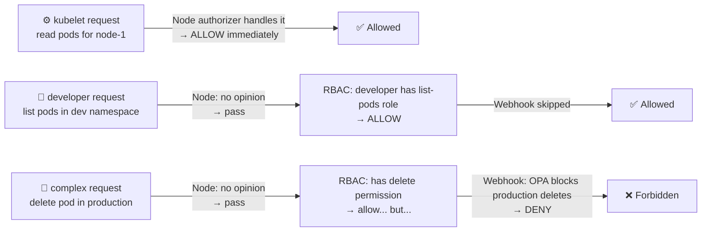

---

## 🏭 Real-World Scenarios

### Scenario 1 — Tesla Kubernetes Cryptomining Attack (2018)

**What happened:** Tesla's Kubernetes dashboard was exposed without authentication (AlwaysAllow effectively). Attackers discovered it, gained full cluster access, deployed cryptomining containers in pods, and used Tesla's cloud compute resources to mine cryptocurrency for weeks without detection.

**Root cause:** No proper authorization — the dashboard had no auth, meaning `AlwaysAllow` for all dashboard users.

**What should have been in place:**

```bash
# kube-apiserver with proper authorization chain
--authorization-mode=Node,RBAC \

# kube-dashboard configured with a restricted service account
# (Not with cluster-admin role, which is the insecure default)
```

**Lesson:** Default to `Node,RBAC` and never expose the dashboard with elevated permissions.

---

### Scenario 2 — Accidental Production Deletion by a Developer

**What happened:** A developer ran `kubectl delete namespace production` by mistake while thinking they were in the staging context. Because their account had cluster-admin privileges (assigned for "convenience"), the entire production namespace was deleted.

**Root cause:** Violating the Principle of Least Privilege — developers given cluster-admin instead of a scoped Role.

**Correct setup:**

```yaml
# Developer Role — ONLY in dev namespace
apiVersion: rbac.authorization.k8s.io/v1
kind: Role
metadata:
  name: developer
  namespace: development    # ← Scoped to dev only
rules:
- apiGroups: ["", "apps"]
  resources: ["pods", "deployments", "services"]
  verbs: ["get", "list", "watch", "create", "update", "patch"]
  # Note: NO "delete" on namespaces; NO access to production
```

---

### Scenario 3 — CI/CD Pipeline Breach

**What happened:** A CI/CD system (Jenkins) was given cluster-admin via ClusterRoleBinding for convenience. An attacker compromised the Jenkins server and used its service account token to exfiltrate secrets and backdoor deployments.

**Correct authorization design:**

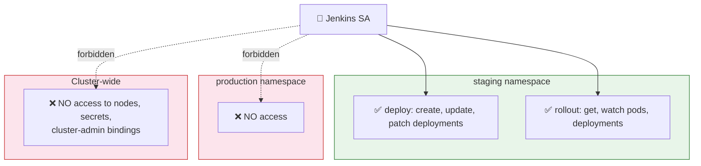

---

### Scenario 4 — Multi-Team Shared Cluster

**Setup:** One cluster shared between: Frontend team, Backend team, Data Engineering team, and Security team.

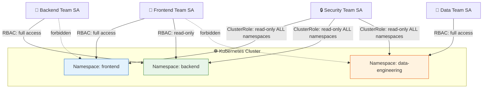

---

## 📋 Commands Reference

### Checking Current Authorization Mode

```bash
# On a kubeadm cluster — read the apiserver manifest
sudo cat /etc/kubernetes/manifests/kube-apiserver.yaml | grep authorization

# Check the running process
ps aux | grep kube-apiserver | tr ' ' '\n' | grep authorization

# Using kubectl (if you have access)
kubectl describe pod kube-apiserver-controlplane -n kube-system \
  | grep authorization
```

### RBAC Commands (Quick Reference for this Chapter)

```bash
# Check YOUR own permissions
kubectl auth can-i list pods
kubectl auth can-i delete nodes
kubectl auth can-i --list              # list all your permissions

# Check ANOTHER user's permissions (admin only)
kubectl auth can-i list pods --as=alex
kubectl auth can-i delete nodes --as=alex -n production
kubectl auth can-i --list --as=system:serviceaccount:default:jenkins

# Check what RBAC objects exist
kubectl get roles -A                   # all Roles in all namespaces
kubectl get clusterroles               # all ClusterRoles
kubectl get rolebindings -A            # all RoleBindings
kubectl get clusterrolebindings        # all ClusterRoleBindings

# See who has a specific role
kubectl describe clusterrolebinding cluster-admin

# Quick Role creation (imperative)
kubectl create role developer \
  --verb=get,list,watch,create,update \
  --resource=pods,deployments \
  -n default

# Quick RoleBinding creation (imperative)
kubectl create rolebinding dev-binding \
  --role=developer \
  --user=alex \
  -n default

# Create ClusterRole (cluster-wide)
kubectl create clusterrole node-reader \
  --verb=get,list,watch \
  --resource=nodes

# Create ClusterRoleBinding
kubectl create clusterrolebinding node-reader-binding \
  --clusterrole=node-reader \
  --user=monitoring-sa
```

### Verifying Authorization Mode Configuration

```bash
# Check if RBAC is enabled (common exam question)
kubectl api-versions | grep rbac
# rbac.authorization.k8s.io/v1   ← RBAC is available

# View kube-apiserver config on kubeadm cluster
sudo cat /etc/kubernetes/manifests/kube-apiserver.yaml

# Look for this line in the YAML output:
# - --authorization-mode=Node,RBAC

# Change authorization mode (edit the manifest — apiserver auto-restarts):
sudo vi /etc/kubernetes/manifests/kube-apiserver.yaml
# Change: --authorization-mode=Node,RBAC
# Save and exit — kubelet will restart the apiserver pod automatically
```

### Viewing Authorization-Related Audit Logs

```bash
# If audit logging is enabled, authorization decisions are logged
# Look for "authorization.k8s.io" entries
sudo grep "authorization" /var/log/kubernetes/audit.log | tail -20

# Or check the apiserver container logs for auth errors
kubectl logs kube-apiserver-controlplane -n kube-system | grep -i "forbidden\|unauthorized"
```

---

## 🧩 Concepts at a Glance

| Concept | What It Is | Key Point |
|:---|:---|:---|
| **Authentication** | "Who are you?" — proves identity | Happens BEFORE authorization |
| **Authorization** | "What can you do?" — controls access | Happens AFTER authentication |
| **401 Unauthorized** | Authentication failed | Bad/missing token or certificate |
| **403 Forbidden** | Authorization failed | Valid identity but no permission |
| **Node Authorization** | Special authorizer for kubelets | kubelet cert must have `system:node:<name>` CN + `system:nodes` group |
| **ABAC** | Policy files on disk | Requires server restart on every change — legacy |
| **RBAC** | Role + RoleBinding objects | Standard for production; dynamic; `kubectl`-managed |
| **Webhook** | External policy service (e.g. OPA) | For complex rules RBAC can't express |
| **AlwaysAllow** | No authorization checks — everything passes | Default if no mode specified; **never use in production** |
| **AlwaysDeny** | No authorization checks — everything blocked | Useful for testing authorization pipeline |
| **`--authorization-mode`** | kube-apiserver flag to set mode(s) | Comma-separated; evaluated left to right |
| **First Approval Wins** | Once any authorizer approves, request is granted | Remaining authorizers in chain are skipped |
| **Pass on Deny** | A "deny" from one authorizer doesn't block the request | Moves to the NEXT authorizer in the chain |
| **All-Deny = 403** | Only when ALL authorizers deny does K8s return 403 | The final outcome after exhausting the chain |
| **`Node,RBAC,Webhook`** | Standard production authorization chain | Node first for kubelets; RBAC for users/SAs; Webhook for complex rules |
| **Open Policy Agent (OPA)** | Popular webhook authorization backend | Uses Rego policy language; supports complex business rules |

---

### The Full Authorization Pipeline

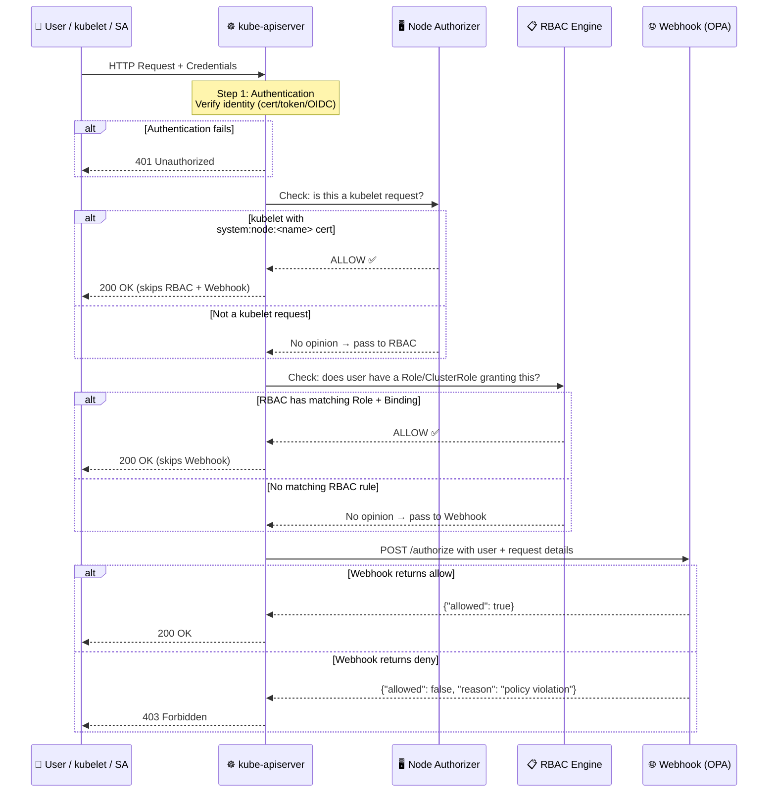

---

*Part of the [Certified Kubernetes Security Specialist (CKS)](../CKS.md) study series.*  
*Next: [Chapter 8.1 — RBAC Deep Dive](./8.1%20--%20RBAC.md) — Roles, ClusterRoles, RoleBindings, and advanced RBAC patterns.*
