# 📋 9 -- Role-Based Access Control (RBAC)

> **Series:** Cluster Setup & Hardening | **Phase 2: Identity & Access Management**  
> **Chapter Goal:** Master RBAC — the standard authorization system in Kubernetes. Learn to create Roles and ClusterRoles, bind them to users and service accounts, verify permissions, and restrict access to specific named resources.

---

## 📌 Table of Contents

1. [What is RBAC and Why Does It Exist?](#-what-is-rbac-and-why-does-it-exist)
2. [The Four RBAC Objects](#-the-four-rbac-objects)
3. [Creating a Role](#-creating-a-role)
4. [Binding a Role to a User (RoleBinding)](#-binding-a-role-to-a-user-rolebinding)
5. [Verifying Roles and Bindings](#-verifying-roles-and-bindings)
6. [Checking Permissions — `kubectl auth can-i`](#-checking-permissions--kubectl-auth-can-i)
7. [Restricting Access to Specific Resources (`resourceNames`)](#-restricting-access-to-specific-resources-resourcenames)
8. [ClusterRole and ClusterRoleBinding](#-clusterrole-and-clusterrolebinding)
9. [Common Mistakes and Pitfalls](#-common-mistakes-and-pitfalls)
10. [Real-World Scenarios](#-real-world-scenarios)
11. [RBAC Commands Reference](#-rbac-commands-reference)
12. [Concepts at a Glance](#-concepts-at-a-glance)

---

## 🧠 What is RBAC and Why Does It Exist?

### The Problem RBAC Solves

Before RBAC, Kubernetes used ABAC (Attribute-Based Access Control) — you wrote one JSON policy line per user, stored in a file on the control plane, and **restarted the kube-apiserver every time you needed to change anything**.

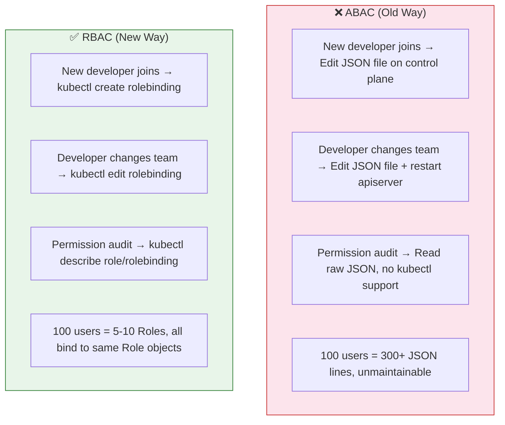

### How RBAC Works (The Core Idea)

RBAC introduces an **indirection layer** between a user and their permissions:

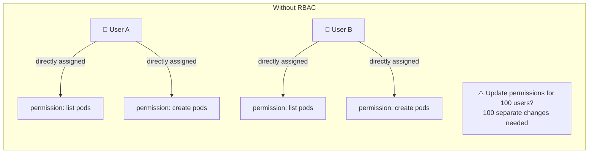

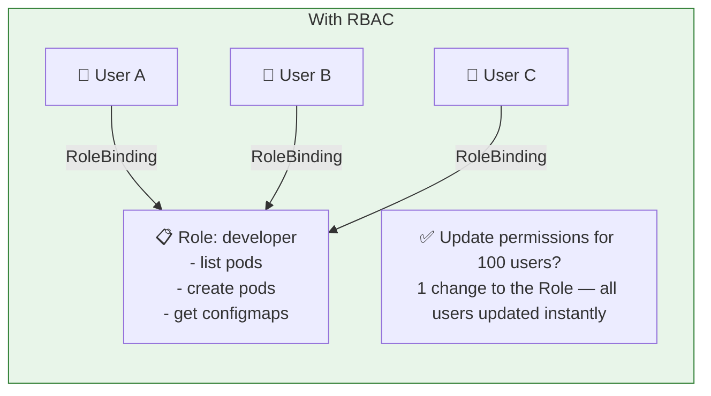

**The key insight:** Users don't have permissions directly. They have **roles**, and roles have permissions. Change the role → everyone bound to it gets the updated permissions immediately.

### RBAC in the Kubernetes Request Flow

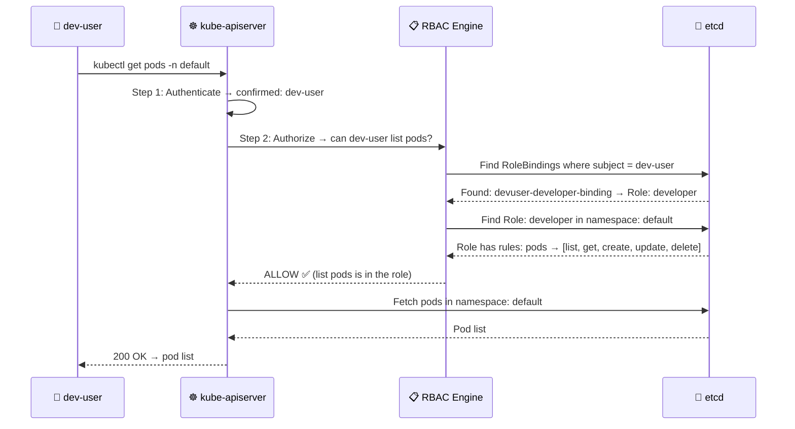

---

## 🗂️ The Four RBAC Objects

RBAC uses four Kubernetes objects. Understanding when to use each is critical for the CKS exam.

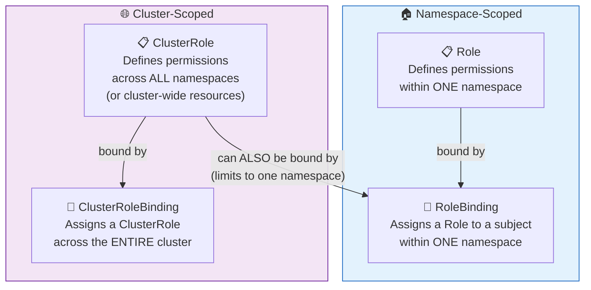

| Object | Scope | What It Does | When to Use |
|:---|:---:|:---|:---|
| **Role** | Namespace | Defines permissions for resources in ONE namespace | Developer access to `dev` namespace only |
| **RoleBinding** | Namespace | Binds a Role (or ClusterRole) to a subject in ONE namespace | Giving `alex` the `developer` Role in `default` |
| **ClusterRole** | Cluster | Defines permissions across ALL namespaces or cluster-wide resources | Prometheus reading pods across all namespaces |
| **ClusterRoleBinding** | Cluster | Binds a ClusterRole to a subject cluster-wide | Giving `ops-team` admin access to all namespaces |

> **Tip:** A **ClusterRole** can be bound with a **RoleBinding** — this limits the ClusterRole's permissions to just the namespace where the RoleBinding lives. This is useful when you want to reuse the same permission set across multiple namespaces without redefining a Role every time.

---

## 🏗️ Creating a Role

### The Role YAML — Field by Field

```yaml
apiVersion: rbac.authorization.k8s.io/v1   # ← RBAC lives in this named API group
kind: Role                                  # ← We're creating a Role object
metadata:
  name: developer                           # ← Name of this Role
  namespace: default                        # ← This role ONLY works in this namespace
                                            #   (omit namespace → goes in current context ns)
rules:                                      # ← List of permission rules
- apiGroups: [""]                           # ← Core API group (pods, services, secrets, configmaps)
  resources: ["pods"]                       # ← Resource type (lowercase, plural)
  verbs: ["list", "get", "create", "update", "delete"]   # ← Allowed actions

- apiGroups: [""]                           # ← Same core group
  resources: ["ConfigMap"]                  # ← A different resource type
  verbs: ["create"]                         # ← Only allow creating configmaps (not get/list/delete)
```

### Deep Dive — Understanding Each Field

#### `apiGroups` — Which API Group Owns This Resource?

This is the most commonly confused field. Every Kubernetes resource belongs to an API group. You must match the correct group for your rules to work.

```
kubectl api-resources
NAME                    SHORTNAMES   APIVERSION                            NAMESPACED   KIND
pods                    po           v1                                    true         Pod
services                svc          v1                                    true         Service
secrets                              v1                                    true         Secret
configmaps              cm           v1                                    true         ConfigMap
deployments             deploy       apps/v1                               true         Deployment
replicasets             rs           apps/v1                               true         ReplicaSet
statefulsets            sts          apps/v1                               true         StatefulSet
daemonsets              ds           apps/v1                               true         DaemonSet
jobs                                 batch/v1                              true         Job
cronjobs                cj           batch/v1                              true         CronJob
ingresses               ing          networking.k8s.io/v1                  true         Ingress
networkpolicies         netpol       networking.k8s.io/v1                  true         NetworkPolicy
roles                                rbac.authorization.k8s.io/v1          true         Role
clusterroles                         rbac.authorization.k8s.io/v1          false        ClusterRole
nodes                                v1                                    false        Node
persistentvolumes       pv           v1                                    false        PersistentVolume
```

**The rule:** Look at the APIVERSION column. Everything before `/v1` is the `apiGroup` name:

| APIVERSION | apiGroups value in RBAC |
|:---|:---|
| `v1` | `""` (empty string = core group) |
| `apps/v1` | `"apps"` |
| `batch/v1` | `"batch"` |
| `networking.k8s.io/v1` | `"networking.k8s.io"` |
| `rbac.authorization.k8s.io/v1` | `"rbac.authorization.k8s.io"` |

```bash
# Quick way to check which apiGroup a resource belongs to:
kubectl api-resources | grep deployments
# deployments    deploy    apps/v1    true    Deployment
#                                ↑
#                          apps = the apiGroup

# In RBAC rules: apiGroups: ["apps"]
```

#### `resources` — What Resource Type?

Always **lowercase and plural** — same as what you type after `kubectl get`:

```yaml
# What you type in kubectl          What you put in resources[]
# kubectl get pods               →  "pods"
# kubectl get deployments        →  "deployments"
# kubectl get configmaps         →  "configmaps"
# kubectl get secrets            →  "secrets"
# kubectl get nodes              →  "nodes"
# kubectl get serviceaccounts    →  "serviceaccounts"
# kubectl get persistentvolumes  →  "persistentvolumes"
```

#### `verbs` — What Actions Are Allowed?

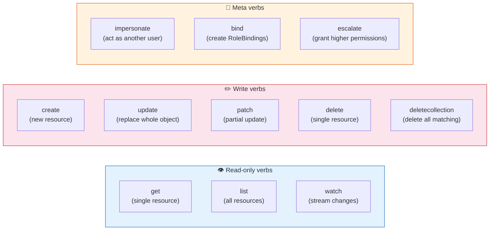

| Verb | kubectl equivalent | HTTP Method | What It Does |
|:---|:---|:---:|:---|
| `get` | `kubectl get pod my-pod` | GET | Fetch a single specific resource by name |
| `list` | `kubectl get pods` | GET | Fetch all resources of a type |
| `watch` | `kubectl get pods -w` | GET (streaming) | Receive real-time change events |
| `create` | `kubectl create -f pod.yaml` | POST | Create a new resource |
| `update` | `kubectl replace -f pod.yaml` | PUT | Replace the entire resource object |
| `patch` | `kubectl edit pod my-pod` | PATCH | Update specific fields only |
| `delete` | `kubectl delete pod my-pod` | DELETE | Delete a single resource |
| `deletecollection` | `kubectl delete pods --all` | DELETE | Delete multiple resources at once |

**Common verb combinations:**

```yaml
# Read-only (monitoring, viewers)
verbs: ["get", "list", "watch"]

# Full pod management (developers)
verbs: ["get", "list", "watch", "create", "update", "patch", "delete"]

# Create only (CI/CD that deploys but doesn't manage)
verbs: ["create"]

# Wildcard — all verbs (admin role)
verbs: ["*"]
```

### Multiple Rules in One Role

A Role can have multiple rules — one per resource type:

```yaml
apiVersion: rbac.authorization.k8s.io/v1
kind: Role
metadata:
  name: developer
  namespace: default
rules:
  # Rule 1: Full pod management
- apiGroups: [""]
  resources: ["pods"]
  verbs: ["list", "get", "create", "update", "delete"]

  # Rule 2: Create ConfigMaps only
- apiGroups: [""]
  resources: ["configmaps"]
  verbs: ["create"]

  # Rule 3: Read-only on deployments
- apiGroups: ["apps"]
  resources: ["deployments"]
  verbs: ["get", "list", "watch"]

  # Rule 4: Full access to services
- apiGroups: [""]
  resources: ["services"]
  verbs: ["get", "list", "create", "update", "patch", "delete"]
```

### Creating the Role

```bash
# From a YAML file (recommended — version-controllable)
kubectl create -f developer-role.yaml
# role.rbac.authorization.k8s.io/developer created

# OR apply (idempotent — safe to run multiple times)
kubectl apply -f developer-role.yaml

# OR imperative (quick, for CKS exam speed)
kubectl create role developer \
  --verb=list,get,create,update,delete \
  --resource=pods \
  --namespace=default
# role.rbac.authorization.k8s.io/developer created

# Add ConfigMap rule imperatively (separate command — can't add multiple in one)
kubectl create role developer-v2 \
  --verb=list,get,create,update,delete \
  --resource=pods,configmaps,services \
  --namespace=default
```

> **Exam tip:** The imperative `kubectl create role` is faster for single-resource roles during the CKS exam. For complex multi-rule roles, generate a YAML template and edit it:

```bash
# Generate YAML template without creating (great for exam)
kubectl create role developer \
  --verb=list,get,create,update,delete \
  --resource=pods \
  --namespace=default \
  --dry-run=client -o yaml > developer-role.yaml

# Edit the YAML to add more rules, then apply
kubectl apply -f developer-role.yaml
```

---

## 🔗 Binding a Role to a User (RoleBinding)

### The RoleBinding YAML — Field by Field

```yaml
apiVersion: rbac.authorization.k8s.io/v1   # ← Same RBAC API group
kind: RoleBinding                           # ← This is a binding object
metadata:
  name: devuser-developer-binding           # ← Name of this binding (descriptive)
  namespace: default                        # ← Binding is also namespaced!
                                            #   It ONLY applies in this namespace

subjects:                                  # ← WHO gets the permissions
- kind: User                               # ← Type: User (can be Group or ServiceAccount)
  name: dev-user                           # ← The exact username (case-sensitive)
  apiGroup: rbac.authorization.k8s.io      # ← Required for User and Group kinds

roleRef:                                   # ← WHAT permissions they get
  kind: Role                               # ← Pointing to a Role (not ClusterRole)
  name: developer                          # ← Must match the Role's metadata.name exactly
  apiGroup: rbac.authorization.k8s.io      # ← Always this value for roleRef
```

### Understanding `subjects` — Who Can You Bind To?

```yaml
# ── Bind to a specific USER ─────────────────────────────────
subjects:
- kind: User
  name: dev-user                           # ← Username from the TLS cert's CN field
  apiGroup: rbac.authorization.k8s.io

# ── Bind to a GROUP of users ────────────────────────────────
subjects:
- kind: Group
  name: developers                         # ← Group from the cert's O field
  apiGroup: rbac.authorization.k8s.io

# ── Bind to a SERVICE ACCOUNT ───────────────────────────────
subjects:
- kind: ServiceAccount
  name: my-service-account                 # ← SA name
  namespace: default                       # ← SA's namespace (required for SA)
  # Note: no apiGroup for ServiceAccount

# ── Bind to MULTIPLE subjects at once ───────────────────────
subjects:
- kind: User
  name: dev-user
  apiGroup: rbac.authorization.k8s.io
- kind: User
  name: dev-user-2
  apiGroup: rbac.authorization.k8s.io
- kind: ServiceAccount
  name: jenkins-sa
  namespace: ci
```

### Understanding `roleRef` — The Immutable Link

```yaml
roleRef:
  kind: Role         # ← "Role" or "ClusterRole"
  name: developer    # ← The exact name of the Role/ClusterRole
  apiGroup: rbac.authorization.k8s.io
```

> **⚠️ Critical:** `roleRef` is **immutable** — once a RoleBinding is created, you **cannot change** which Role it points to. If you need to change the role, delete the RoleBinding and create a new one.

### Creating the RoleBinding

```bash
# From YAML file
kubectl create -f devuser-developer-binding.yaml
# rolebinding.rbac.authorization.k8s.io/devuser-developer-binding created

# Imperative (exam-friendly — faster)
kubectl create rolebinding devuser-developer-binding \
  --role=developer \
  --user=dev-user \
  --namespace=default
# rolebinding.rbac.authorization.k8s.io/devuser-developer-binding created

# Bind to a service account
kubectl create rolebinding jenkins-binding \
  --role=developer \
  --serviceaccount=ci:jenkins-sa \
  --namespace=default

# Bind to a group
kubectl create rolebinding devteam-binding \
  --role=developer \
  --group=developers \
  --namespace=default

# Dry-run to generate YAML (for editing before applying)
kubectl create rolebinding devuser-developer-binding \
  --role=developer \
  --user=dev-user \
  --namespace=default \
  --dry-run=client -o yaml > rolebinding.yaml
```

### How Role + RoleBinding Connect

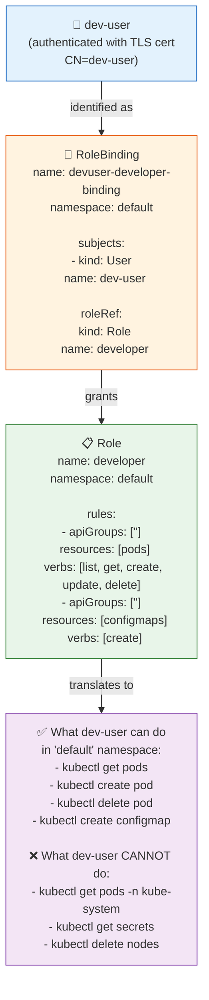

---

## 🔍 Verifying Roles and Bindings

### Listing RBAC Objects

```bash
# List all Roles in the current namespace
kubectl get roles
# NAME         CREATED AT
# developer    2025-05-12T10:00:00Z

# List all Roles in a specific namespace
kubectl get roles -n kube-system

# List all Roles across all namespaces
kubectl get roles -A
# NAMESPACE    NAME            CREATED AT
# default      developer       2025-05-12T10:00:00Z
# kube-system  extension-...   2025-01-01T00:00:00Z

# List all RoleBindings in current namespace
kubectl get rolebindings
# NAME                        ROLE              AGE
# devuser-developer-binding   Role/developer    30s

# List all RoleBindings across all namespaces
kubectl get rolebindings -A
```

### Inspecting a Role in Detail

```bash
kubectl describe role developer
```

**Output:**

```
Name:         developer
Labels:       <none>
Annotations:  <none>
PolicyRule:
  Resources   Non-Resource URLs   Resource Names   Verbs
  ---------   -----------------   --------------   -----
  ConfigMap   []                  []               [create]
  pods        []                  []               [list get create update delete]
```

**Output explained:**

```
PolicyRule:
  Resources  → What resource type this rule applies to (ConfigMap, pods)
  Non-Resource URLs → For non-resource HTTP paths like /healthz (empty = N/A)
  Resource Names → Specific resource names this applies to (empty = all)
  Verbs → What actions are allowed
```

### Inspecting a RoleBinding in Detail

```bash
kubectl describe rolebinding devuser-developer-binding
```

**Output:**

```
Name:         devuser-developer-binding
Labels:       <none>
Annotations:  <none>
Role:
  Kind:       Role
  Name:       developer        ← Which Role is being granted
Subjects:
  Kind   Name       Namespace
  ----   ----       ---------
  User   dev-user              ← Who receives the Role (empty namespace = cluster-level user)
```

### Getting Raw YAML for Editing

```bash
# Get Role as YAML (for backup / editing)
kubectl get role developer -o yaml
kubectl get role developer -o yaml > developer-role-backup.yaml

# Get RoleBinding as YAML
kubectl get rolebinding devuser-developer-binding -o yaml

# Get all Roles in a namespace as YAML
kubectl get roles -n default -o yaml
```

---

## ✅ Checking Permissions — `kubectl auth can-i`

### Checking Your Own Permissions

```bash
# Check if YOU can create deployments
kubectl auth can-i create deployments
# yes

# Check if YOU can delete nodes
kubectl auth can-i delete nodes
# no

# Check in a specific namespace
kubectl auth can-i list pods -n production
# no

# List ALL your permissions in current namespace
kubectl auth can-i --list
# Resources  Non-Resource URLs   Resource Names   Verbs
# *.*        []                  []               [*]   ← if you're cluster-admin
```

### Impersonating Another User (`--as` flag)

The `--as` flag lets you check permissions **as another user** — without actually switching accounts. Only admins can use this flag.

```bash
# Check if dev-user can create deployments
kubectl auth can-i create deployments --as=dev-user
# no

# Check if dev-user can create pods
kubectl auth can-i create pods --as=dev-user
# yes

# Check in a specific namespace
kubectl auth can-i create pods --as=dev-user -n default
# yes

kubectl auth can-i create pods --as=dev-user -n kube-system
# no  (Role is only in 'default' namespace)

# Check as a service account
kubectl auth can-i list pods --as=system:serviceaccount:default:my-service-account
# yes (if the SA has the right role binding)

# List ALL permissions for another user
kubectl auth can-i --list --as=dev-user
kubectl auth can-i --list --as=dev-user -n default
```

### The `--as` Flag Breakdown

```
kubectl auth can-i create pods --as=dev-user --namespace=default
│              │      │      │      │          │
│              │      │      │      │          └── Namespace to check in
│              │      │      │      └── Impersonate this user
│              │      │      └── Resource type
│              │      └── Verb to check
│              └── auth can-i = permission check subcommand
└── kubectl
```

**For Service Account impersonation:**

```
--as=system:serviceaccount:default:my-service-account
      │                    │       │
      │                    │       └── SA name
      │                    └── Namespace where the SA lives
      └── Kubernetes prefix for SA identities
```

### Quick Permission Test Matrix

```bash
#!/bin/bash
# Run this to see what dev-user can and can't do

echo "=== dev-user permissions in default namespace ==="
echo -n "list pods:        "; kubectl auth can-i list pods --as=dev-user -n default
echo -n "create pods:      "; kubectl auth can-i create pods --as=dev-user -n default
echo -n "delete pods:      "; kubectl auth can-i delete pods --as=dev-user -n default
echo -n "list secrets:     "; kubectl auth can-i list secrets --as=dev-user -n default
echo -n "delete nodes:     "; kubectl auth can-i delete nodes --as=dev-user
echo -n "list deployments: "; kubectl auth can-i list deployments --as=dev-user -n default

# Expected output:
# list pods:        yes
# create pods:      yes
# delete pods:      yes
# list secrets:     no
# delete nodes:     no
# list deployments: no
```

---

## 🎯 Restricting Access to Specific Resources (`resourceNames`)

### What is `resourceNames`?

By default, a Role applies to **all resources of that type** in the namespace. The `resourceNames` field lets you restrict a rule to **only specific named instances** of a resource.

### Without `resourceNames` — Access to ALL pods

```yaml
apiVersion: rbac.authorization.k8s.io/v1
kind: Role
metadata:
  name: developer
  namespace: default
rules:
- apiGroups: [""]
  resources: ["pods"]
  verbs: ["get", "create", "update"]
  # No resourceNames → can access ANY pod in the namespace
```

```bash
kubectl get pod blue   --as=dev-user   # ✅ allowed
kubectl get pod orange --as=dev-user   # ✅ allowed
kubectl get pod red    --as=dev-user   # ✅ allowed (all pods accessible)
```

### With `resourceNames` — Access to ONLY Named Pods

```yaml
apiVersion: rbac.authorization.k8s.io/v1
kind: Role
metadata:
  name: developer
  namespace: default
rules:
- apiGroups: [""]
  resources: ["pods"]
  verbs: ["get", "create", "update"]
  resourceNames: ["blue", "orange"]    # ← ONLY these specific pod names
```

```bash
kubectl get pod blue   --as=dev-user   # ✅ allowed (in resourceNames)
kubectl get pod orange --as=dev-user   # ✅ allowed (in resourceNames)
kubectl get pod red    --as=dev-user   # ❌ 403 Forbidden (not in resourceNames)
kubectl get pods       --as=dev-user   # ❌ 403 Forbidden (list = no specific name, not allowed)
```

### Important Limitation of `resourceNames`

```
⚠️ resourceNames does NOT work with:
  - "list" verb (lists all resources — no specific name in the request)
  - "watch" verb (watches all resources)
  - "create" verb (new resources don't have names yet when the request is made)

✅ resourceNames WORKS with:
  - "get"    (fetch one specific named resource)
  - "update" (update a named resource)
  - "patch"  (patch a named resource)
  - "delete" (delete a named resource)
```

**Correct pattern for resourceNames:**

```yaml
rules:
  # Rule 1: Allow listing ALL pods (no resourceNames — needed for list)
- apiGroups: [""]
  resources: ["pods"]
  verbs: ["list", "watch"]

  # Rule 2: Allow managing SPECIFIC pods only
- apiGroups: [""]
  resources: ["pods"]
  verbs: ["get", "update", "patch", "delete"]
  resourceNames: ["blue", "orange"]
```

### Real Use Cases for `resourceNames`

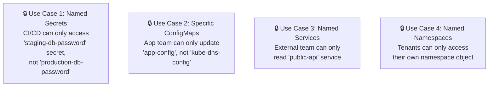

```yaml
# Example: CI/CD can only read specific secrets
apiVersion: rbac.authorization.k8s.io/v1
kind: Role
metadata:
  name: cicd-secrets-reader
  namespace: staging
rules:
- apiGroups: [""]
  resources: ["secrets"]
  verbs: ["get"]
  resourceNames: ["staging-db-password", "staging-api-key"]
  # Cannot access: production-db-password, or any other secret
```

---

## 🌐 ClusterRole and ClusterRoleBinding

### When to Use ClusterRole

Use ClusterRole when you need:

1. **Permissions that span all namespaces** (e.g., Prometheus reading pods from every namespace)
2. **Cluster-scoped resources** (e.g., nodes, persistent volumes, namespaces themselves — these have no namespace)

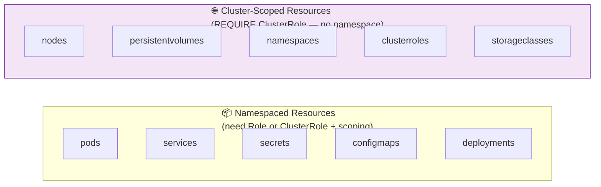

### ClusterRole Example

```yaml
apiVersion: rbac.authorization.k8s.io/v1
kind: ClusterRole            # ← Note: ClusterRole, not Role
metadata:
  name: cluster-monitor      # ← No namespace field — it's cluster-scoped
rules:
  # Access to cluster-scoped resources (only possible with ClusterRole)
- apiGroups: [""]
  resources: ["nodes"]
  verbs: ["get", "list", "watch"]

- apiGroups: [""]
  resources: ["persistentvolumes"]
  verbs: ["get", "list", "watch"]

  # Access to namespaced resources across ALL namespaces
- apiGroups: [""]
  resources: ["pods", "services", "endpoints"]
  verbs: ["get", "list", "watch"]

- apiGroups: ["apps"]
  resources: ["deployments", "daemonsets", "statefulsets"]
  verbs: ["get", "list", "watch"]
```

### ClusterRoleBinding — Cluster-Wide Assignment

```yaml
apiVersion: rbac.authorization.k8s.io/v1
kind: ClusterRoleBinding     # ← Cluster-wide binding
metadata:
  name: monitor-binding      # ← No namespace field
subjects:
- kind: ServiceAccount
  name: prometheus-sa
  namespace: monitoring      # ← SA still belongs to a namespace
roleRef:
  kind: ClusterRole          # ← Must be ClusterRole for ClusterRoleBinding
  name: cluster-monitor
  apiGroup: rbac.authorization.k8s.io
```

### The Hybrid Pattern: ClusterRole + RoleBinding

You can use a ClusterRole with a regular RoleBinding to **reuse a common permission set across different namespaces without redefining it each time:**

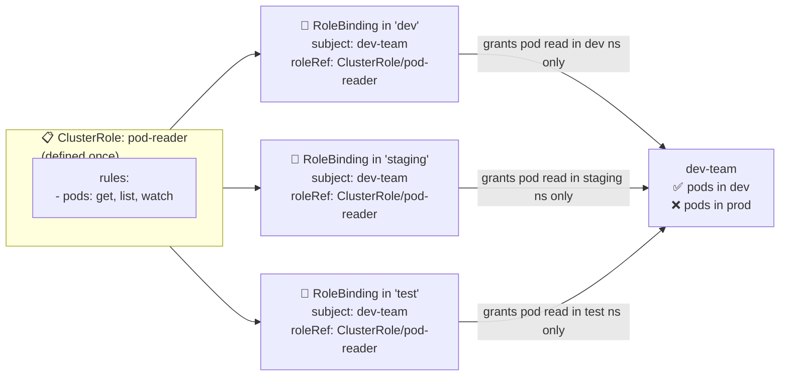

```bash
# Create the ClusterRole once
kubectl create clusterrole pod-reader \
  --verb=get,list,watch \
  --resource=pods

# Bind it in each namespace via RoleBinding (not ClusterRoleBinding!)
kubectl create rolebinding pod-reader-dev \
  --clusterrole=pod-reader \
  --group=dev-team \
  -n dev

kubectl create rolebinding pod-reader-staging \
  --clusterrole=pod-reader \
  --group=dev-team \
  -n staging
```

### Role vs ClusterRole — Decision Matrix

| Situation | Use |
|:---|:---|
| Developer access to `dev` namespace only | Role + RoleBinding |
| Prometheus reading pods from all namespaces | ClusterRole + ClusterRoleBinding |
| Same role needed in 5 namespaces | ClusterRole + RoleBinding (per namespace) |
| Access to nodes (cluster-scoped resource) | ClusterRole + ClusterRoleBinding |
| Security team read-only across all namespaces | ClusterRole + ClusterRoleBinding |
| CI/CD deploy to `staging` only | Role + RoleBinding (in staging namespace) |

---

## ⚠️ Common Mistakes and Pitfalls

### Mistake 1 — Wrong `apiGroups` Value

```yaml
# ❌ WRONG — trying to grant deployment access but using wrong apiGroup
rules:
- apiGroups: [""]         # Empty string = core group (no deployments there!)
  resources: ["deployments"]
  verbs: ["list", "get"]
# Result: Permission exists but does nothing — deployments are in "apps" group

# ✅ CORRECT
rules:
- apiGroups: ["apps"]     # Deployments live in the "apps" group
  resources: ["deployments"]
  verbs: ["list", "get"]
```

### Mistake 2 — Forgetting Namespace Scope

```yaml
# ❌ Role in "default" namespace
apiVersion: rbac.authorization.k8s.io/v1
kind: Role
metadata:
  name: developer
  namespace: default    # ← Only works in "default"

# User tries to list pods in "production" namespace → DENIED
kubectl get pods -n production --as=dev-user
# Error: pods is forbidden: User "dev-user" cannot list resource "pods"
# in API group "" in the namespace "production"
```

### Mistake 3 — `resourceNames` with `list` Verb

```yaml
# ❌ This doesn't work as expected
rules:
- apiGroups: [""]
  resources: ["pods"]
  verbs: ["list", "get"]       # ← "list" + resourceNames is problematic
  resourceNames: ["blue"]      # list sends no specific name → always denied

# ✅ Correct approach: separate rules
rules:
- apiGroups: [""]
  resources: ["pods"]
  verbs: ["list", "watch"]     # ← list/watch WITHOUT resourceNames
- apiGroups: [""]
  resources: ["pods"]
  verbs: ["get", "update"]     # ← get/update WITH resourceNames
  resourceNames: ["blue"]
```

### Mistake 4 — Editing roleRef After Creation

```bash
# ❌ This will fail — roleRef is immutable
kubectl edit rolebinding devuser-developer-binding
# (change roleRef.name from "developer" to "senior-developer")
# Error: RoleBinding.rbac.authorization.k8s.io "devuser-developer-binding" is invalid:
# roleRef: Invalid value: ...: roleRef is immutable

# ✅ Correct: Delete and recreate
kubectl delete rolebinding devuser-developer-binding
kubectl create rolebinding devuser-developer-binding \
  --role=senior-developer \
  --user=dev-user \
  -n default
```

### Mistake 5 — Wildcard Overuse

```yaml
# ❌ Dangerous: wildcard grants everything
rules:
- apiGroups: ["*"]
  resources: ["*"]
  verbs: ["*"]
# This is equivalent to cluster-admin — violates least privilege

# ✅ Better: explicit resources and verbs
rules:
- apiGroups: [""]
  resources: ["pods", "services"]
  verbs: ["get", "list", "watch"]
- apiGroups: ["apps"]
  resources: ["deployments"]
  verbs: ["get", "list"]
```

---

## 🏭 Real-World Scenarios

### Scenario 1 — Developer Access (Most Common)

**Requirement:** Developer `alex` can manage pods and read deployments in the `dev` namespace, but cannot touch `production`.

```yaml
# developer-role.yaml
apiVersion: rbac.authorization.k8s.io/v1
kind: Role
metadata:
  name: developer
  namespace: dev         # ← Scoped to dev only
rules:
- apiGroups: [""]
  resources: ["pods", "pods/log", "pods/exec"]   # pods/log for kubectl logs
  verbs: ["get", "list", "watch", "create", "update", "patch", "delete"]
- apiGroups: ["apps"]
  resources: ["deployments"]
  verbs: ["get", "list", "watch"]
- apiGroups: [""]
  resources: ["services", "configmaps"]
  verbs: ["get", "list", "watch", "create", "update"]
---
apiVersion: rbac.authorization.k8s.io/v1
kind: RoleBinding
metadata:
  name: alex-developer
  namespace: dev
subjects:
- kind: User
  name: alex
  apiGroup: rbac.authorization.k8s.io
roleRef:
  kind: Role
  name: developer
  apiGroup: rbac.authorization.k8s.io
```

```bash
# Verify alex's access
kubectl auth can-i create pods --as=alex -n dev
# yes
kubectl auth can-i create pods --as=alex -n production
# no ✅ (scoped correctly)
```

---

### Scenario 2 — Read-Only Auditor

**Requirement:** Security auditor `auditor` needs read-only access to every namespace.

```bash
# Create ClusterRole for read-only access
kubectl create clusterrole cluster-viewer \
  --verb=get,list,watch \
  --resource=pods,services,deployments,secrets,configmaps,nodes,namespaces

# Bind it cluster-wide
kubectl create clusterrolebinding auditor-binding \
  --clusterrole=cluster-viewer \
  --user=auditor
```

```bash
# Verify auditor cannot modify anything
kubectl auth can-i list pods --as=auditor -n production
# yes ✅
kubectl auth can-i delete pods --as=auditor -n production
# no ✅ (read-only)
```

---

### Scenario 3 — CI/CD Pipeline (Jenkins)

**Requirement:** Jenkins SA in `ci` namespace can deploy to `staging` namespace (create/update deployments and services) but nothing else.

```yaml
# jenkins-role.yaml
apiVersion: rbac.authorization.k8s.io/v1
kind: Role
metadata:
  name: ci-deployer
  namespace: staging
rules:
- apiGroups: ["apps"]
  resources: ["deployments"]
  verbs: ["get", "list", "create", "update", "patch"]
- apiGroups: [""]
  resources: ["services", "configmaps"]
  verbs: ["get", "list", "create", "update", "patch"]
- apiGroups: [""]
  resources: ["pods"]
  verbs: ["get", "list", "watch"]
---
apiVersion: rbac.authorization.k8s.io/v1
kind: RoleBinding
metadata:
  name: jenkins-deployer
  namespace: staging
subjects:
- kind: ServiceAccount
  name: jenkins-sa
  namespace: ci           # ← Jenkins SA lives in 'ci' namespace
roleRef:
  kind: Role
  name: ci-deployer
  apiGroup: rbac.authorization.k8s.io
```

---

### Scenario 4 — Multi-Tenant Namespace Isolation

**Requirement:** Each team gets a namespace and full access to it, but cannot see other teams' namespaces.

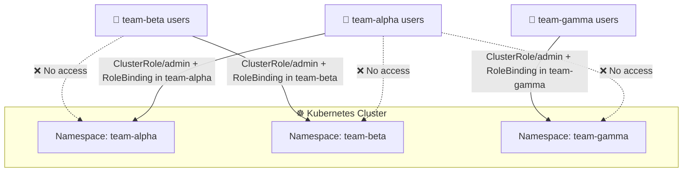

```bash
# Kubernetes has a built-in "admin" ClusterRole — reuse it per namespace
kubectl create rolebinding team-alpha-admin \
  --clusterrole=admin \
  --group=team-alpha \
  -n team-alpha

kubectl create rolebinding team-beta-admin \
  --clusterrole=admin \
  --group=team-beta \
  -n team-beta
```

---

## 📋 RBAC Commands Reference

### Roles

```bash
# ── CREATE ─────────────────────────────────────────────────
kubectl create -f developer-role.yaml
kubectl apply -f developer-role.yaml

# Imperative
kubectl create role developer \
  --verb=get,list,create,update,delete \
  --resource=pods \
  -n default

# With multiple resources
kubectl create role developer \
  --verb=get,list,create \
  --resource=pods,configmaps,services \
  -n default

# Dry run (generate YAML without creating)
kubectl create role developer \
  --verb=get,list,create \
  --resource=pods \
  --dry-run=client -o yaml

# ── READ ───────────────────────────────────────────────────
kubectl get roles                             # List in current namespace
kubectl get roles -n kube-system              # List in specific namespace
kubectl get roles -A                          # List across all namespaces
kubectl describe role developer               # Full details
kubectl describe role developer -n default    # In specific namespace
kubectl get role developer -o yaml            # As YAML

# ── UPDATE ─────────────────────────────────────────────────
kubectl edit role developer                   # Open in editor
kubectl apply -f developer-role.yaml          # Apply changes from file

# ── DELETE ─────────────────────────────────────────────────
kubectl delete role developer
kubectl delete role developer -n default
kubectl delete -f developer-role.yaml
```

### RoleBindings

```bash
# ── CREATE ─────────────────────────────────────────────────
kubectl create -f devuser-developer-binding.yaml

# Bind to a user
kubectl create rolebinding dev-binding \
  --role=developer \
  --user=dev-user \
  -n default

# Bind to a service account
kubectl create rolebinding jenkins-binding \
  --role=developer \
  --serviceaccount=ci:jenkins-sa \
  -n staging

# Bind to a group
kubectl create rolebinding devteam-binding \
  --role=developer \
  --group=developers \
  -n default

# Bind a ClusterRole (not a Role) via RoleBinding
kubectl create rolebinding pod-reader-dev \
  --clusterrole=pod-reader \
  --user=alex \
  -n dev

# ── READ ───────────────────────────────────────────────────
kubectl get rolebindings                      # List in current namespace
kubectl get rolebindings -A                   # Across all namespaces
kubectl describe rolebinding dev-binding      # Full details
kubectl get rolebinding dev-binding -o yaml   # As YAML

# ── DELETE ─────────────────────────────────────────────────
kubectl delete rolebinding dev-binding
kubectl delete rolebinding dev-binding -n default
```

### ClusterRoles and ClusterRoleBindings

```bash
# ── CREATE ─────────────────────────────────────────────────
kubectl create clusterrole cluster-viewer \
  --verb=get,list,watch \
  --resource=pods,nodes,namespaces,deployments

kubectl create clusterrolebinding viewer-binding \
  --clusterrole=cluster-viewer \
  --user=auditor

# ── READ ───────────────────────────────────────────────────
kubectl get clusterroles                      # List all ClusterRoles
kubectl describe clusterrole cluster-admin    # Inspect built-in admin role
kubectl get clusterrolebindings               # List all ClusterRoleBindings
kubectl describe clusterrolebinding cluster-admin
```

### Permission Checks

```bash
# Your own permissions
kubectl auth can-i create pods
kubectl auth can-i delete nodes
kubectl auth can-i list secrets -n production
kubectl auth can-i --list                     # All your permissions
kubectl auth can-i --list -n default          # In a specific namespace

# Another user's permissions (admin only)
kubectl auth can-i create pods --as=dev-user
kubectl auth can-i create pods --as=dev-user -n default
kubectl auth can-i --list --as=dev-user -n default

# Service account permissions
kubectl auth can-i list pods \
  --as=system:serviceaccount:default:my-service-account \
  -n default

# Group permissions
kubectl auth can-i create pods --as-group=developers
```

### Built-in ClusterRoles

Kubernetes ships with several useful ClusterRoles:

```bash
kubectl get clusterroles | grep -v "system:"
# NAME                    CREATED AT
# admin                   ...     ← Full namespace access (no RBAC management)
# cluster-admin           ...     ← Superuser — full cluster access
# edit                    ...     ← Like admin but cannot manage RBAC
# view                    ...     ← Read-only access to most resources
```

| Built-in ClusterRole | What It Allows |
|:---|:---|
| `cluster-admin` | Everything — superuser. Use for break-glass access only |
| `admin` | Full access to a namespace — can manage RBAC within the namespace |
| `edit` | Create/update/delete most resources — cannot manage RBAC |
| `view` | Read-only access to non-sensitive resources (not secrets) |

```bash
# Use built-in roles to save time:
kubectl create rolebinding alex-admin \
  --clusterrole=admin \
  --user=alex \
  -n dev

kubectl create rolebinding viewer-binding \
  --clusterrole=view \
  --user=auditor \
  -n production
```

---

## 🧩 Concepts at a Glance

| Concept | What It Is | Key Point |
|:---|:---|:---|
| **Role** | Permission set scoped to ONE namespace | Cannot access cluster-scoped resources (nodes, PVs) |
| **ClusterRole** | Permission set for ALL namespaces OR cluster-scoped resources | Required for nodes, PVs, namespaces |
| **RoleBinding** | Assigns a Role to a user/SA in ONE namespace | Can also bind a ClusterRole to limit it to one namespace |
| **ClusterRoleBinding** | Assigns a ClusterRole cluster-wide | Grants access to all namespaces simultaneously |
| **`apiGroups: [""]`** | Core API group | Pods, services, secrets, configmaps, nodes |
| **`apiGroups: ["apps"]`** | Named API group | Deployments, replicasets, statefulsets, daemonsets |
| **`verbs: ["get"]`** | Fetch one specific named resource | `kubectl get pod my-pod` |
| **`verbs: ["list"]`** | Fetch all resources of a type | `kubectl get pods` |
| **`verbs: ["watch"]`** | Stream real-time change events | `kubectl get pods -w` |
| **`resourceNames`** | Restrict rule to specific named instances | Doesn't work with `list` or `create` verbs |
| **`kubectl auth can-i`** | Test authorization for a verb+resource | Essential for verifying RBAC is correct |
| **`--as=`** | Impersonate a user for permission checks | Format for SA: `system:serviceaccount:<ns>:<name>` |
| **`roleRef` is immutable** | Cannot change which Role a Binding points to | Delete + recreate if you need to change it |
| **Least Privilege** | Grant only the minimum permissions needed | Default deny — only grant what's explicitly needed |
| **`--dry-run=client -o yaml`** | Generate YAML without creating | Best way to build complex YAML in exams |
| **`cluster-admin`** | Built-in superuser ClusterRole | Never bind to regular users — break-glass only |
| **`admin`** | Built-in namespace-admin ClusterRole | Full namespace access without cluster-wide risk |
| **`view`** | Built-in read-only ClusterRole | Read most resources — doesn't include secrets |

---

### The Complete RBAC Flow

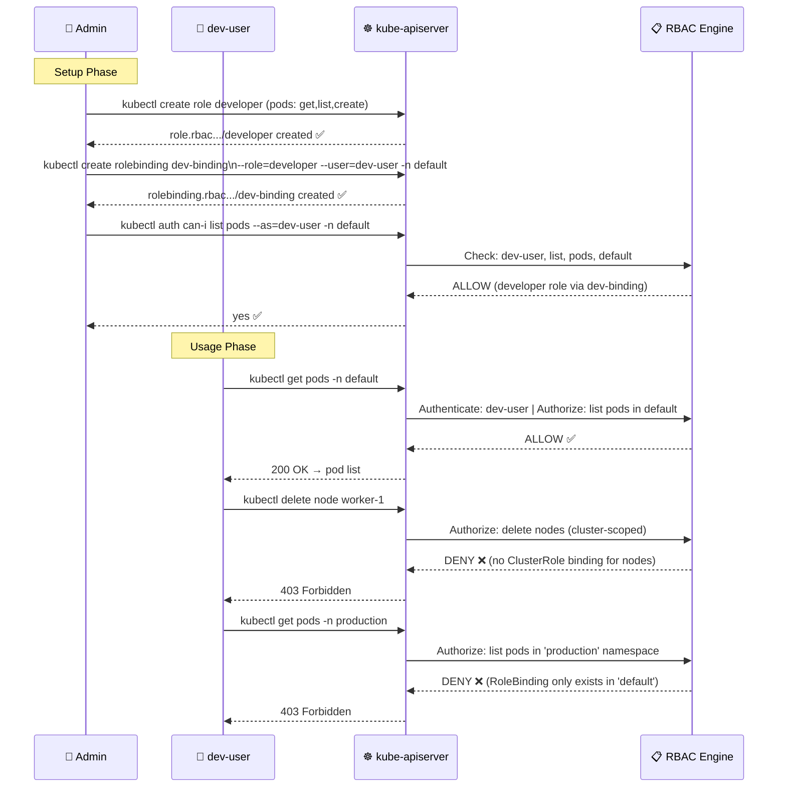

---

*Part of the [Certified Kubernetes Security Specialist (CKS)](../CKS.md) study series.*  
*Previous: [Chapter 8 — Authorization](./8%20--%20Authorization.md) | Next: [Chapter 9.1 — RBAC Lab](./9.1%20--%20RBAC%20Test%20Examples.md)*
