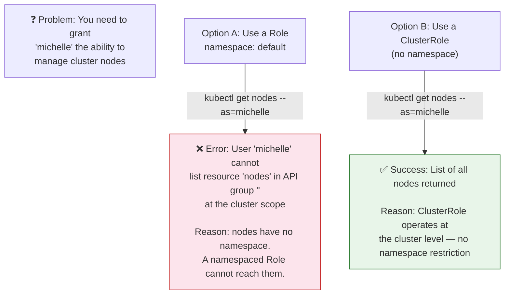
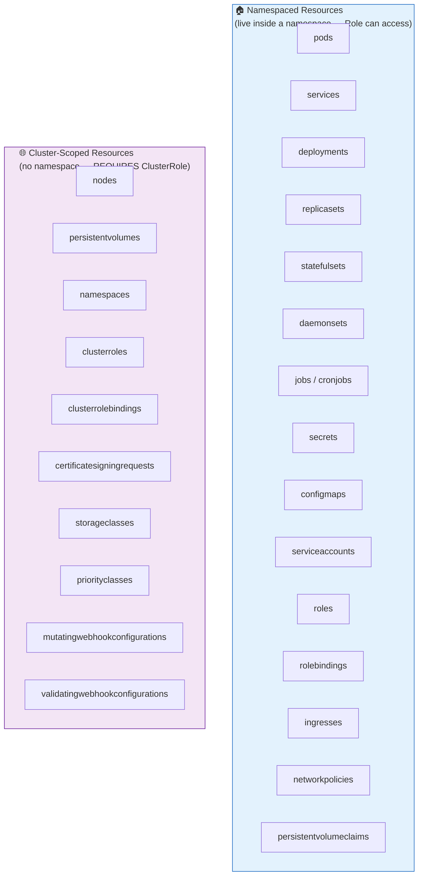
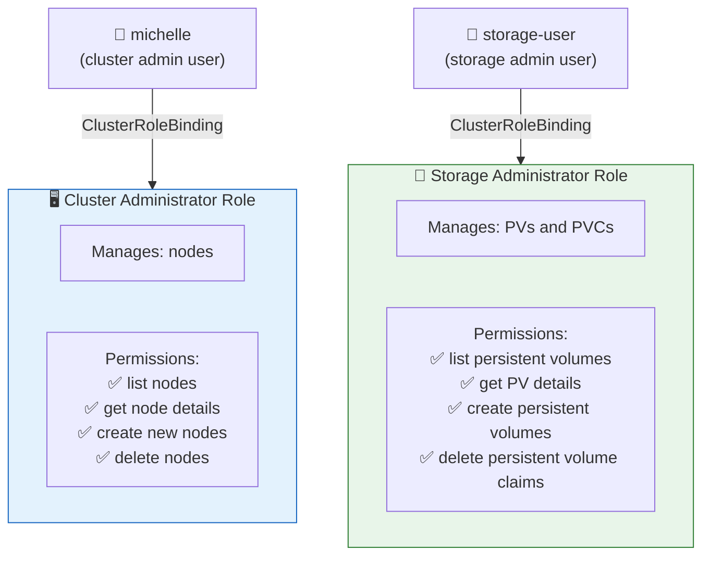
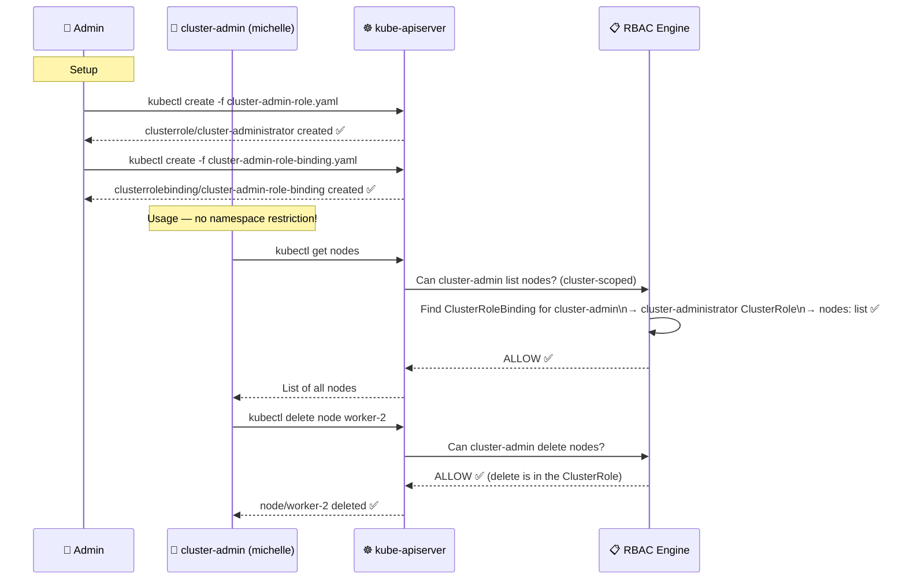
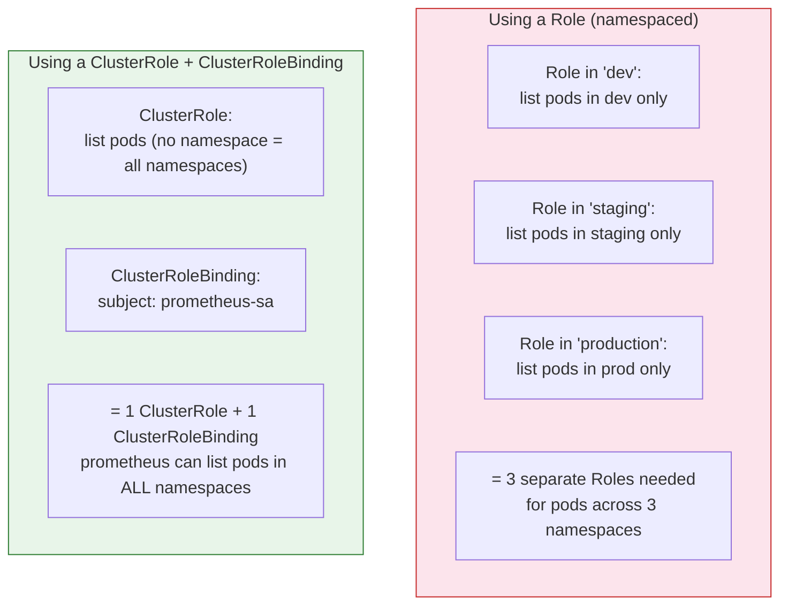
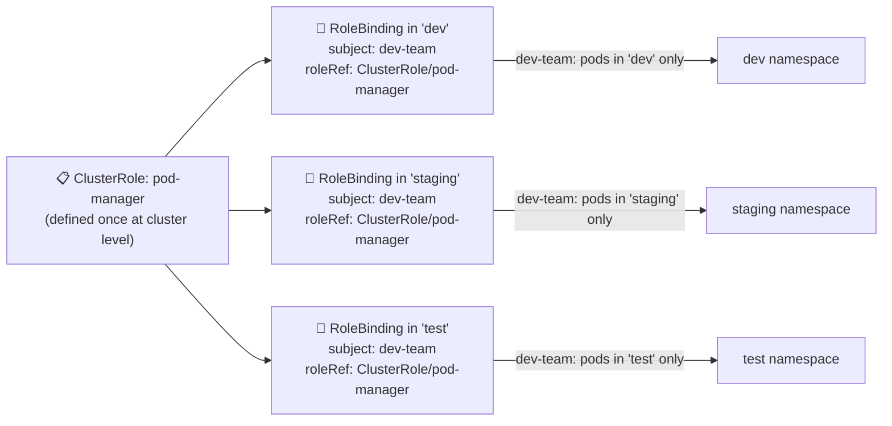
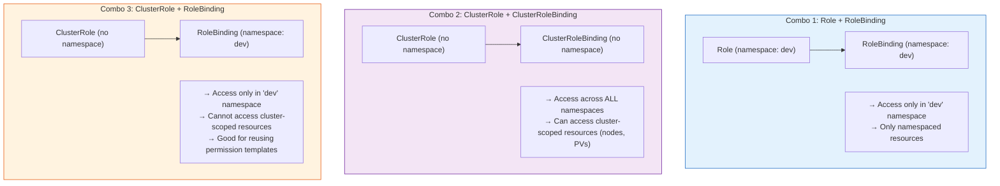
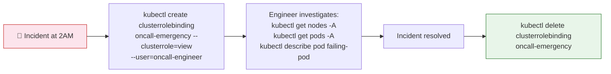
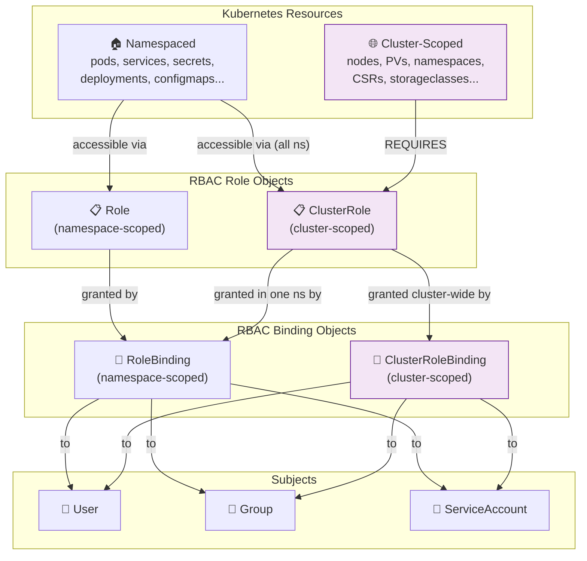

# 🌐 9.1 -- Cluster Roles and Cluster Role Bindings

> **Series:** Cluster Setup & Hardening | **Phase 2: Identity & Access Management**  
> **Chapter Goal:** Understand the difference between namespaced and cluster-scoped resources, why ClusterRoles exist, how to create them, and when to use ClusterRoleBinding vs RoleBinding.

---

## 📌 Table of Contents

1. [Why ClusterRoles Exist — The Problem They Solve](#-why-clusterroles-exist--the-problem-they-solve)
2. [Kubernetes Resource Classification](#-kubernetes-resource-classification)
3. [Namespaced vs Cluster-Scoped — Full Resource List](#-namespaced-vs-cluster-scoped--full-resource-list)
4. [Use Case: Cluster-Wide Roles](#-use-case-cluster-wide-roles)
5. [Defining a ClusterRole](#-defining-a-clusterrole)
6. [Binding a ClusterRole to a User (ClusterRoleBinding)](#-binding-a-clusterrole-to-a-user-clusterrolebinding)
7. [ClusterRole for Namespaced Resources](#-clusterrole-for-namespaced-resources)
8. [The Hybrid Pattern — ClusterRole + RoleBinding](#-the-hybrid-pattern--clusterrole--rolebinding)
9. [Kubernetes Built-in ClusterRoles](#-kubernetes-built-in-clusterroles)
10. [Real-World Scenarios](#-real-world-scenarios)
11. [Commands Reference](#-commands-reference)
12. [Concepts at a Glance](#-concepts-at-a-glance)

---

## 🤔 Why ClusterRoles Exist — The Problem They Solve

In Chapter 9, we used **Roles** to grant permissions within a specific namespace. But what happens when you need to give someone access to something that doesn't belong to any namespace at all?



**The core reason:** Some resources in Kubernetes are not scoped to any namespace. They exist at the **cluster level**. A namespaced Role simply cannot reach them — it's architecturally impossible. ClusterRoles exist to grant permissions on these cluster-level resources.

---

## 🗂️ Kubernetes Resource Classification

Every Kubernetes resource is either **namespaced** (it lives inside a namespace) or **cluster-scoped** (it exists at the cluster level, independent of any namespace).




### How to Tell the Difference

```bash
# List ALL namespaced resources
kubectl api-resources --namespaced=true

# Sample output:
# NAME                    SHORTNAMES   APIVERSION                   NAMESPACED   KIND
# bindings                             v1                           true         Binding
# configmaps              cm           v1                           true         ConfigMap
# endpoints               ep           v1                           true         Endpoints
# pods                    po           v1                           true         Pod
# secrets                              v1                           true         Secret
# serviceaccounts         sa           v1                           true         ServiceAccount
# services                svc          v1                           true         Service
# deployments             deploy       apps/v1                      true         Deployment
# ingresses               ing          networking.k8s.io/v1         true         Ingress
# networkpolicies         netpol       networking.k8s.io/v1         true         NetworkPolicy
```

```bash
# List ALL cluster-scoped (non-namespaced) resources
kubectl api-resources --namespaced=false

# Sample output:
# NAME                              SHORTNAMES   APIVERSION                 NAMESPACED   KIND
# componentstatuses                 cs           v1                         false        ComponentStatus
# namespaces                        ns           v1                         false        Namespace
# nodes                             no           v1                         false        Node
# persistentvolumes                 pv           v1                         false        PersistentVolume
# clusterroles                                   rbac.../v1                 false        ClusterRole
# clusterrolebindings                            rbac.../v1                 false        ClusterRoleBinding
# certificatesigningrequests        csr           certificates.../v1        false        CertificateSigningRequest
# storageclasses                    sc           storage.../v1              false        StorageClass
# priorityclasses                   pc           scheduling.../v1           false        PriorityClass
```

**The `NAMESPACED` column is the key:** `true` = namespaced, `false` = cluster-scoped.

---

## 📊 Namespaced vs Cluster-Scoped — Full Resource List

| Resource | Type | RBAC Object Needed | Common Example |
|:---|:---:|:---|:---|
| pods | Namespaced | Role or ClusterRole | Workload containers |
| services | Namespaced | Role or ClusterRole | Load balancers, ClusterIP |
| deployments | Namespaced | Role or ClusterRole | Stateless apps |
| secrets | Namespaced | Role or ClusterRole | Passwords, API keys |
| configmaps | Namespaced | Role or ClusterRole | App configuration |
| serviceaccounts | Namespaced | Role or ClusterRole | Pod identities |
| persistentvolumeclaims | Namespaced | Role or ClusterRole | Storage requests |
| roles | Namespaced | Role or ClusterRole | RBAC roles themselves |
| rolebindings | Namespaced | Role or ClusterRole | RBAC bindings |
| **nodes** | **Cluster-Scoped** | **ClusterRole required** | Worker nodes |
| **persistentvolumes** | **Cluster-Scoped** | **ClusterRole required** | Actual storage |
| **namespaces** | **Cluster-Scoped** | **ClusterRole required** | Namespace management |
| **clusterroles** | **Cluster-Scoped** | **ClusterRole required** | RBAC cluster roles |
| **certificatesigningrequests** | **Cluster-Scoped** | **ClusterRole required** | TLS cert approval |
| **storageclasses** | **Cluster-Scoped** | **ClusterRole required** | Dynamic provisioning |

> **Rule of thumb:** If you can run `kubectl get <resource> -n default`, it's namespaced. If `-n` has no effect (like `kubectl get nodes`), it's cluster-scoped and needs a ClusterRole.

---

## 💡 Use Case: Cluster-Wide Roles

Two of the most common use cases for ClusterRoles are the **Cluster Administrator** and the **Storage Administrator:**




---

## 🏗️ Defining a ClusterRole

### ClusterRole YAML — Field by Field

```yaml
apiVersion: rbac.authorization.k8s.io/v1   # ← Same RBAC API group as Role
kind: ClusterRole                           # ← Note: ClusterRole, NOT Role
metadata:
  name: cluster-administrator              # ← Name of this ClusterRole
  # ⚠️ No 'namespace' field! ClusterRoles are cluster-scoped objects.
  # Adding a namespace field here would be IGNORED.
rules:
- apiGroups: [""]                          # ← Core API group (nodes live here)
  resources: ["nodes"]                     # ← The resource type
  verbs: ["list", "get", "create", "delete"]  # ← Allowed actions
```

**Key difference from a regular Role:**

| Field | Role | ClusterRole |
|:---|:---|:---|
| `kind` | `Role` | `ClusterRole` |
| `metadata.namespace` | Required (or defaults to current) | **Not set — cluster-scoped** |
| Resource scope | Only in its namespace | Any namespace OR cluster-level |
| Can access nodes, PVs | ❌ No | ✅ Yes |

### The Cluster Administrator Role (Full Example)

```yaml
# cluster-admin-role.yaml
apiVersion: rbac.authorization.k8s.io/v1
kind: ClusterRole
metadata:
  name: cluster-administrator
rules:
  # Node management — cluster-scoped resource
- apiGroups: [""]
  resources: ["nodes"]
  verbs: ["list", "get", "create", "delete", "patch", "update"]

  # Namespace management — cluster-scoped resource
- apiGroups: [""]
  resources: ["namespaces"]
  verbs: ["list", "get", "create", "delete"]

  # PersistentVolume management — cluster-scoped resource
- apiGroups: [""]
  resources: ["persistentvolumes"]
  verbs: ["list", "get", "create", "delete"]
```

### The Storage Administrator Role

```yaml
# storage-admin-role.yaml
apiVersion: rbac.authorization.k8s.io/v1
kind: ClusterRole
metadata:
  name: storage-admin
rules:
  # Manage PersistentVolumes (cluster-scoped — requires ClusterRole)
- apiGroups: [""]
  resources: ["persistentvolumes"]
  verbs: ["list", "get", "create", "delete", "patch"]

  # Manage PersistentVolumeClaims (namespaced — ClusterRole applies across all namespaces)
- apiGroups: [""]
  resources: ["persistentvolumeclaims"]
  verbs: ["list", "get", "create", "delete"]

  # Manage StorageClasses (cluster-scoped)
- apiGroups: ["storage.k8s.io"]
  resources: ["storageclasses"]
  verbs: ["list", "get", "create", "delete"]
```

### Creating the ClusterRole

```bash
# From YAML file
kubectl create -f cluster-admin-role.yaml
# clusterrole.rbac.authorization.k8s.io/cluster-administrator created

# OR with apply (idempotent)
kubectl apply -f cluster-admin-role.yaml

# Imperative — fastest for CKS exam
kubectl create clusterrole cluster-administrator \
  --verb=list,get,create,delete \
  --resource=nodes
# clusterrole.rbac.authorization.k8s.io/cluster-administrator created

# Storage admin imperative
kubectl create clusterrole storage-admin \
  --verb=list,get,create,delete \
  --resource=persistentvolumes,persistentvolumeclaims

# Dry run — generate YAML to edit before applying
kubectl create clusterrole storage-admin \
  --verb=list,get,create,delete \
  --resource=persistentvolumes,persistentvolumeclaims \
  --dry-run=client -o yaml > storage-admin.yaml
# Edit to add more rules, then: kubectl apply -f storage-admin.yaml
```

---

## 🔗 Binding a ClusterRole to a User (ClusterRoleBinding)

### ClusterRoleBinding YAML — Field by Field

```yaml
apiVersion: rbac.authorization.k8s.io/v1   # ← RBAC API group
kind: ClusterRoleBinding                   # ← Cluster-wide binding (not RoleBinding)
metadata:
  name: cluster-admin-role-binding         # ← Name of this binding
  # ⚠️ No 'namespace' field! ClusterRoleBindings are cluster-scoped too.
subjects:
- kind: User                               # ← The type: User, Group, or ServiceAccount
  name: cluster-admin                      # ← The username (must match cert CN exactly)
  apiGroup: rbac.authorization.k8s.io      # ← Required for User and Group

roleRef:
  kind: ClusterRole                        # ← Must be ClusterRole (not Role)
  name: cluster-administrator             # ← Must match the ClusterRole's metadata.name
  apiGroup: rbac.authorization.k8s.io     # ← Always this value
```

### Storage Admin Binding

```yaml
# storage-admin-binding.yaml
apiVersion: rbac.authorization.k8s.io/v1
kind: ClusterRoleBinding
metadata:
  name: storage-admin-binding
subjects:
- kind: User
  name: storage-user
  apiGroup: rbac.authorization.k8s.io
roleRef:
  kind: ClusterRole
  name: storage-admin
  apiGroup: rbac.authorization.k8s.io
```

### Creating the ClusterRoleBinding

```bash
# From YAML
kubectl create -f cluster-admin-role-binding.yaml
# clusterrolebinding.rbac.authorization.k8s.io/cluster-admin-role-binding created

# Imperative — bind user to ClusterRole
kubectl create clusterrolebinding cluster-admin-role-binding \
  --clusterrole=cluster-administrator \
  --user=cluster-admin
# clusterrolebinding.rbac.authorization.k8s.io/cluster-admin-role-binding created

# Bind a service account
kubectl create clusterrolebinding storage-sa-binding \
  --clusterrole=storage-admin \
  --serviceaccount=storage:storage-sa

# Bind a group
kubectl create clusterrolebinding ops-cluster-binding \
  --clusterrole=cluster-administrator \
  --group=ops-team

# Dry run — generate YAML
kubectl create clusterrolebinding cluster-admin-role-binding \
  --clusterrole=cluster-administrator \
  --user=cluster-admin \
  --dry-run=client -o yaml
```

### How ClusterRole + ClusterRoleBinding Connect



---

## 🌍 ClusterRole for Namespaced Resources

A ClusterRole isn't only for cluster-scoped resources. You can also use it to grant access to **namespaced resources across ALL namespaces at once**.



**Example: Prometheus monitoring all namespaces:**

```yaml
# prometheus-clusterrole.yaml
apiVersion: rbac.authorization.k8s.io/v1
kind: ClusterRole
metadata:
  name: prometheus-reader
rules:
  # Read pods, services, endpoints across ALL namespaces
- apiGroups: [""]
  resources: ["pods", "services", "endpoints", "nodes"]
  verbs: ["get", "list", "watch"]

  # Read deployments, daemonsets across ALL namespaces
- apiGroups: ["apps"]
  resources: ["deployments", "daemonsets", "statefulsets"]
  verbs: ["get", "list", "watch"]
---
# prometheus-clusterrolebinding.yaml
apiVersion: rbac.authorization.k8s.io/v1
kind: ClusterRoleBinding
metadata:
  name: prometheus-reader-binding
subjects:
- kind: ServiceAccount
  name: prometheus-sa
  namespace: monitoring
roleRef:
  kind: ClusterRole
  name: prometheus-reader
  apiGroup: rbac.authorization.k8s.io
```

```bash
# Apply both
kubectl apply -f prometheus-clusterrole.yaml

# Verify Prometheus SA can list pods in any namespace
kubectl auth can-i list pods \
  --as=system:serviceaccount:monitoring:prometheus-sa \
  -n production
# yes ✅ (works across all namespaces)

kubectl auth can-i list pods \
  --as=system:serviceaccount:monitoring:prometheus-sa \
  -n kube-system
# yes ✅
```

---

## 🔀 The Hybrid Pattern — ClusterRole + RoleBinding

There is one more combination: using a **ClusterRole with a regular RoleBinding** (not a ClusterRoleBinding). This lets you **reuse a permission set** across multiple namespaces without granting full cluster-wide access.



**Why use this?** Avoid repeating the same Role YAML in every namespace. Define it once as a ClusterRole, then scope it per namespace via RoleBindings.

```bash
# Create the ClusterRole (reusable template)
kubectl create clusterrole pod-manager \
  --verb=get,list,watch,create,update,delete \
  --resource=pods

# Bind it only to 'dev' namespace (using RoleBinding, not ClusterRoleBinding)
kubectl create rolebinding pod-manager-dev \
  --clusterrole=pod-manager \      # ← references a ClusterRole
  --group=dev-team \
  -n dev                           # ← BUT scoped to 'dev' namespace only

# Bind it to 'staging' namespace separately
kubectl create rolebinding pod-manager-staging \
  --clusterrole=pod-manager \
  --group=dev-team \
  -n staging

# Verify: dev-team can access pods in 'dev' but NOT in 'production'
kubectl auth can-i list pods --as-group=dev-team --as=dev-member -n dev
# yes ✅
kubectl auth can-i list pods --as-group=dev-team --as=dev-member -n production
# no ✅ (no RoleBinding in production)
```

### All Four Combinations Summarized



---

## 🎁 Kubernetes Built-in ClusterRoles

Kubernetes automatically creates several default ClusterRoles during cluster setup. You don't need to define these from scratch.

```bash
# View all built-in ClusterRoles
kubectl get clusterroles
```

### The Most Important Built-in ClusterRoles

| ClusterRole | What It Allows | When to Use |
|:---|:---|:---|
| `cluster-admin` | **Everything** — superuser access to all resources, all namespaces | Break-glass access; cluster bootstrapping only |
| `admin` | Full access to most resources in a namespace (including RBAC management within it) | Namespace owners, team leads |
| `edit` | Create, update, delete most resources — **cannot** manage RBAC | Developers |
| `view` | Read-only access to most resources — **excludes** secrets | Auditors, read-only monitoring |
| `system:node` | kubelet permissions — read pods, write status | Auto-assigned to kubelets via Node Authorizer |
| `system:kube-scheduler` | Scheduler permissions — read pods, write pod bindings | Auto-assigned to the scheduler |
| `system:kube-controller-manager` | Controller manager — broad permissions to manage all resources | Auto-assigned to controller manager |

```bash
# Inspect what cluster-admin can do
kubectl describe clusterrole cluster-admin
# Name:         cluster-admin
# Labels:       kubernetes.io/bootstrapping=rbac-defaults
# PolicyRule:
#   Resources   Non-Resource URLs   Resource Names   Verbs
#   ---------   -----------------   --------------   -----
#   *.*         []                  []               [*]       ← Everything
#               [*]                 []               [*]       ← All HTTP paths too

# Inspect what 'view' role allows
kubectl describe clusterrole view
# Resources include: pods, services, deployments, configmaps...
# Does NOT include: secrets (by design — view should not see sensitive data)

# See all ClusterRoleBindings (who is bound to what)
kubectl get clusterrolebindings -o wide
```

### Using Built-in ClusterRoles (Best Practice)

```bash
# Give a user full admin access to a specific namespace (not cluster-wide!)
kubectl create rolebinding alex-namespace-admin \
  --clusterrole=admin \
  --user=alex \
  -n dev

# Give a user read-only access across all namespaces
kubectl create clusterrolebinding auditor-view-all \
  --clusterrole=view \
  --user=auditor

# Give a developer write access (no RBAC management) to a namespace
kubectl create rolebinding developer-edit \
  --clusterrole=edit \
  --user=dev-user \
  -n staging
```

---

## 🏭 Real-World Scenarios

### Scenario 1 — Cluster Administrator: Node Management

**Requirement:** `michelle` is a cluster admin who needs to manage all nodes (add, remove, inspect).

```yaml
# Step 1: Define the ClusterRole
apiVersion: rbac.authorization.k8s.io/v1
kind: ClusterRole
metadata:
  name: cluster-administrator
rules:
- apiGroups: [""]
  resources: ["nodes"]
  verbs: ["list", "get", "create", "delete", "patch", "update"]
```

```bash
# Step 2: Create the ClusterRoleBinding
kubectl create clusterrolebinding michelle-cluster-admin \
  --clusterrole=cluster-administrator \
  --user=michelle

# Step 3: Verify
kubectl auth can-i list nodes --as=michelle
# yes ✅
kubectl auth can-i delete nodes --as=michelle
# yes ✅
kubectl auth can-i list pods --as=michelle -n default
# no ❌ (we only granted node access, not pod access)
```

---

### Scenario 2 — Storage Administrator: PV and PVC Management

**Requirement:** `storage-user` manages persistent volumes across the cluster and can approve/delete PVCs from any namespace.

```yaml
apiVersion: rbac.authorization.k8s.io/v1
kind: ClusterRole
metadata:
  name: storage-admin
rules:
  # PersistentVolumes are cluster-scoped
- apiGroups: [""]
  resources: ["persistentvolumes"]
  verbs: ["list", "get", "create", "delete", "patch"]

  # PersistentVolumeClaims are namespaced, but ClusterRole applies across all namespaces
- apiGroups: [""]
  resources: ["persistentvolumeclaims"]
  verbs: ["list", "get", "delete"]

  # StorageClasses are cluster-scoped
- apiGroups: ["storage.k8s.io"]
  resources: ["storageclasses"]
  verbs: ["list", "get", "create", "delete"]
---
apiVersion: rbac.authorization.k8s.io/v1
kind: ClusterRoleBinding
metadata:
  name: storage-admin-binding
subjects:
- kind: User
  name: storage-user
  apiGroup: rbac.authorization.k8s.io
roleRef:
  kind: ClusterRole
  name: storage-admin
  apiGroup: rbac.authorization.k8s.io
```

```bash
# Apply and verify
kubectl apply -f storage-admin.yaml

kubectl auth can-i list persistentvolumes --as=storage-user
# yes ✅ (cluster-scoped PV access)

kubectl auth can-i delete persistentvolumeclaims --as=storage-user -n production
# yes ✅ (ClusterRole spans all namespaces)

kubectl auth can-i delete pods --as=storage-user -n default
# no ✅ (storage admin shouldn't touch pods)
```

---

### Scenario 3 — DevOps On-call: Emergency Node Access

**Requirement:** The on-call DevOps engineer needs temporary read access to all nodes and pods across all namespaces during an incident.

```bash
# Grant temporary cluster-wide read access (remove after incident!)
kubectl create clusterrolebinding oncall-emergency \
  --clusterrole=view \
  --user=oncall-engineer

# After incident: remove the binding
kubectl delete clusterrolebinding oncall-emergency
```



---

### Scenario 4 — Security Audit Trail: Who Can Delete Nodes?

```bash
# Find all ClusterRoleBindings that reference cluster-admin role
kubectl get clusterrolebindings -o json | \
  jq '.items[] | select(.roleRef.name=="cluster-admin") | .metadata.name'

# Find who has node delete permission (check all ClusterRoles)
kubectl get clusterroles -o json | \
  jq '.items[] | select(.rules[]?.resources[]? == "nodes") | .metadata.name'

# Find all subjects bound to a specific ClusterRole
kubectl describe clusterrolebinding cluster-admin
# Shows: Name → Subjects (who has this powerful role)

# Complete RBAC audit — who can do what across the cluster
kubectl get clusterrolebindings -o wide
```

---

## 📋 Commands Reference

### ClusterRole Commands

```bash
# ── CREATE ─────────────────────────────────────────────────
kubectl create -f cluster-admin-role.yaml
kubectl apply -f cluster-admin-role.yaml

# Imperative
kubectl create clusterrole cluster-administrator \
  --verb=list,get,create,delete \
  --resource=nodes

kubectl create clusterrole storage-admin \
  --verb=list,get,create,delete \
  --resource=persistentvolumes,persistentvolumeclaims

kubectl create clusterrole prometheus-reader \
  --verb=get,list,watch \
  --resource=pods,services,nodes,endpoints

# Dry run → YAML
kubectl create clusterrole cluster-administrator \
  --verb=list,get,create,delete \
  --resource=nodes \
  --dry-run=client -o yaml

# ── READ ───────────────────────────────────────────────────
kubectl get clusterroles                        # List all ClusterRoles
kubectl get clusterroles | grep -v "^system:"  # Exclude system roles
kubectl describe clusterrole cluster-admin      # Inspect built-in cluster-admin
kubectl describe clusterrole cluster-administrator  # Your custom role
kubectl get clusterrole cluster-administrator -o yaml  # Raw YAML

# ── UPDATE ─────────────────────────────────────────────────
kubectl edit clusterrole cluster-administrator
kubectl apply -f cluster-admin-role.yaml       # Re-apply changed YAML

# ── DELETE ─────────────────────────────────────────────────
kubectl delete clusterrole cluster-administrator
kubectl delete -f cluster-admin-role.yaml
```

### ClusterRoleBinding Commands

```bash
# ── CREATE ─────────────────────────────────────────────────
kubectl create -f cluster-admin-role-binding.yaml

# Bind to a user
kubectl create clusterrolebinding michelle-cluster-admin \
  --clusterrole=cluster-administrator \
  --user=michelle

# Bind to a service account
kubectl create clusterrolebinding prometheus-binding \
  --clusterrole=prometheus-reader \
  --serviceaccount=monitoring:prometheus-sa

# Bind to a group
kubectl create clusterrolebinding ops-cluster-admin \
  --clusterrole=cluster-administrator \
  --group=ops-team

# Use built-in ClusterRoles
kubectl create clusterrolebinding auditor-view \
  --clusterrole=view \
  --user=auditor

# ── READ ───────────────────────────────────────────────────
kubectl get clusterrolebindings                    # List all
kubectl describe clusterrolebinding michelle-cluster-admin
kubectl get clusterrolebinding michelle-cluster-admin -o yaml

# ── DELETE ─────────────────────────────────────────────────
kubectl delete clusterrolebinding michelle-cluster-admin
kubectl delete -f cluster-admin-role-binding.yaml
```

### Verification Commands

```bash
# Check user can list nodes
kubectl auth can-i list nodes --as=michelle
# yes

# Check user can delete nodes
kubectl auth can-i delete nodes --as=michelle
# yes

# List ALL permissions of a user (cluster-wide)
kubectl auth can-i --list --as=michelle

# Check specific permission in a namespace
kubectl auth can-i list pods --as=storage-user -n production
# yes (if storage-user has a ClusterRole for pods)

# Find which ClusterRoles grant access to nodes
kubectl get clusterroles -o json | \
  python3 -c "
import json,sys
data = json.load(sys.stdin)
for item in data['items']:
    for rule in item.get('rules', []):
        if 'nodes' in rule.get('resources', []):
            print(item['metadata']['name'])
"

# Discover cluster-scoped resources
kubectl api-resources --namespaced=false

# Discover namespaced resources
kubectl api-resources --namespaced=true
```

---

## 🧩 Concepts at a Glance

| Concept | What It Is | Key Point |
|:---|:---|:---|
| **Namespaced resource** | Lives inside a namespace | Pod, service, deployment, secret, configmap |
| **Cluster-scoped resource** | Exists at cluster level, no namespace | Node, PersistentVolume, Namespace, ClusterRole |
| **`kubectl api-resources --namespaced=false`** | List all cluster-scoped resources | The definitive way to know what needs a ClusterRole |
| **ClusterRole** | Permission set with no namespace restriction | Can access both namespaced AND cluster-scoped resources |
| **ClusterRoleBinding** | Assigns a ClusterRole cluster-wide | No namespace field — grants access everywhere |
| **ClusterRole + ClusterRoleBinding** | Full cluster-wide access | Use for nodes, PVs, Prometheus-style cross-namespace |
| **ClusterRole + RoleBinding** | Reuse permission template, scope to one namespace | Best of both worlds — define once, scope many times |
| **`cluster-admin`** | Built-in superuser ClusterRole | `verbs: ["*"], resources: ["*"]` — use sparingly |
| **`admin`** | Built-in namespace admin ClusterRole | Full namespace access including RBAC within it |
| **`edit`** | Built-in developer ClusterRole | Like admin but cannot manage RBAC |
| **`view`** | Built-in read-only ClusterRole | Excludes secrets by design |
| **Reusability** | ClusterRole as a template | Bind to different namespaces via separate RoleBindings |
| **No namespace in ClusterRole metadata** | ClusterRoles are cluster-scoped objects | Adding `namespace:` to a ClusterRole is ignored |
| **`system:` prefix** | Built-in system ClusterRoles | Don't modify these — they're auto-managed by K8s |

---

### The Complete Picture — All Role Combinations



---

*Part of the [Certified Kubernetes Security Specialist (CKS)](../CKS.md) study series.*  
*Previous: [Chapter 9 — RBAC](./9%20--%20RBAC.md) | Next: [Chapter 10 — Kubelet Security](./10%20--%20Kubelet%20Security.md)*
