# ☸️ Kubernetes — Complete Introduction for DevSecOps Engineers

> **Audience:** DevSecOps Engineers, Platform Engineers, Security Architects  
> **Goal:** Deep understanding of every Kubernetes component — what it is, how it works, what breaks if it fails, and how to secure it.

---

## 📌 Table of Contents

1. [Why Kubernetes?](#-why-kubernetes)
2. [The Big Picture — Cluster Architecture](#-the-big-picture--cluster-architecture)
3. [Control Plane Components](#-control-plane-components)
   - [kube-apiserver](#1-kube-apiserver--the-gatekeeper)
   - [etcd](#2-etcd--the-brain)
   - [kube-scheduler](#3-kube-scheduler--the-placement-engine)
   - [kube-controller-manager](#4-kube-controller-manager--the-autopilot)
   - [cloud-controller-manager](#5-cloud-controller-manager--the-cloud-bridge)
4. [Worker Node Components](#-worker-node-components)
   - [kubelet](#1-kubelet--the-node-agent)
   - [kube-proxy](#2-kube-proxy--the-network-wizard)
   - [Container Runtime](#3-container-runtime--the-engine)
5. [Essential Add-ons](#-essential-add-ons)
6. [Real-World Architectures](#-real-world-architectures)
   - [AWS EKS](#-aws-eks-elastic-kubernetes-service)
   - [Azure AKS](#-azure-aks-azure-kubernetes-service)
7. [Common Commands — Origins & Usage](#-common-commands--origins--usage)
8. [DevSecOps Daily Tasks](#-devsecops-daily-tasks-in-real-life)
9. [Security Best Practices Per Component](#-security-best-practices-per-component)
10. [Quick Reference Cheat Sheet](#-quick-reference-cheat-sheet)

---

## ❓ Why Kubernetes?

### The Problem Before Kubernetes

In the early days of microservices, companies managed containers manually using plain Docker. This created a nightmare at scale:

```
Docker on 500 servers = 500 places to manage
500 places to check health
500 places to restart crashed containers
500 configurations to keep in sync
```

| Problem | Docker Alone | With Kubernetes |
|:---|:---:|:---:|
| Container crashes → auto-restart | ❌ Manual | ✅ Automatic |
| Traffic spikes → auto-scale | ❌ Manual | ✅ HPA/VPA |
| Rolling deployments | ❌ Painful | ✅ Built-in |
| Service discovery | ❌ Manual DNS hacks | ✅ Built-in CoreDNS |
| Secret management | ❌ Env files on servers | ✅ Secrets + Vault integration |
| Multi-cloud portability | ❌ Locked in | ✅ Standard API everywhere |

### Real-World Scale

> **Spotify** runs ~10 million containers per week on Kubernetes.  
> **Google** (inventor of Kubernetes' predecessor Borg) launches **2 billion containers per week** internally.  
> **Airbnb** migrated 1,000+ microservices to Kubernetes, cutting deployment time from hours to minutes.

---

## 🏗️ The Big Picture — Cluster Architecture

### Official Kubernetes Architecture


*Source: kubernetes.io — Official cluster architecture diagram*

### Annotated Architecture Diagram

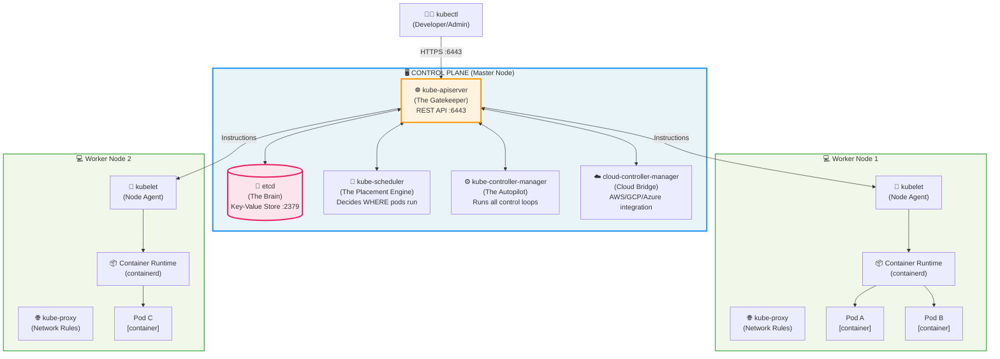

### The Two Planes at a Glance

| | Control Plane | Worker Nodes |
|:---|:---|:---|
| **Purpose** | Brain — makes decisions | Muscles — runs workloads |
| **Components** | API Server, etcd, Scheduler, Controller Manager | kubelet, kube-proxy, Container Runtime |
| **What runs here** | Cluster management processes | Your application pods |
| **Access** | Restricted (only admins) | Where your app traffic flows |
| **Failure impact** | Cluster becomes unmanageable | Application pods may be unreachable |

---

## 🧠 Control Plane Components

---

### 1. kube-apiserver — The Gatekeeper

#### What Is It?

The **kube-apiserver** is the **central hub** of the entire Kubernetes cluster. Every single operation — from deploying a pod to reading a secret — goes through the API server. It is a RESTful HTTP server that exposes the Kubernetes API.

```
Think of it as: The reception desk of a large building.
Everyone who wants to do ANYTHING must check in here first.
```

#### What Does It Do?

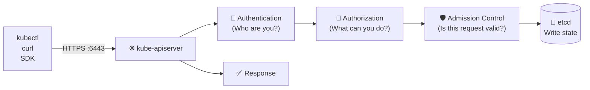

| Function | Description |
|:---|:---|
| **Authentication** | Verifies identity via certs, tokens, or OIDC |
| **Authorization** | Checks RBAC permissions |
| **Admission Control** | Validates and mutates requests (OPA, PSA) |
| **State Storage** | Reads/writes cluster state to etcd |
| **Watch API** | Components subscribe to changes via long-poll |
| **Metrics** | Exposes Prometheus metrics at `/metrics` |

#### How It Works (Request Lifecycle)

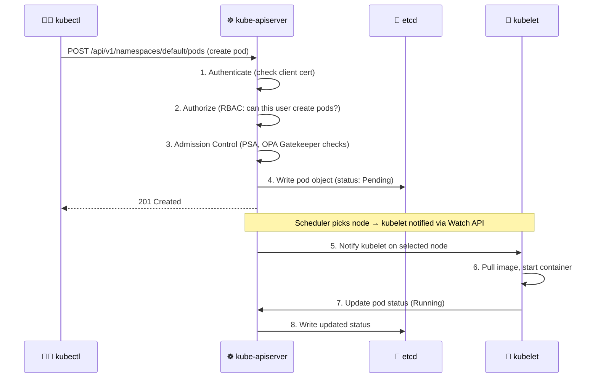

#### What Happens If It Fails?

| Impact | Details |
|:---|:---|
| ❌ No new deployments | No pods can be created, updated, or deleted |
| ❌ kubectl stops working | All `kubectl` commands return connection errors |
| ✅ Running pods continue | Already-running pods keep running (kubelet is independent) |
| ❌ No HPA/autoscaling | Controllers can't read metrics or make scaling decisions |
| ❌ No cluster visibility | Cannot inspect state, logs, or events |

#### Security Best Practices

```yaml
# kube-apiserver flags for hardening (in /etc/kubernetes/manifests/kube-apiserver.yaml)
- --anonymous-auth=false                          # Disable anonymous access
- --authorization-mode=Node,RBAC                 # Use RBAC (never AlwaysAllow)
- --enable-admission-plugins=NodeRestriction,PodSecurityAdmission
- --audit-log-path=/var/log/kubernetes/audit.log # Enable audit logging
- --audit-log-maxage=30                           # Retain logs 30 days
- --tls-min-version=VersionTLS12                 # Disable TLS 1.0/1.1
- --insecure-port=0                               # Disable HTTP (NEVER use insecure port)
- --etcd-certfile=/etc/kubernetes/pki/apiserver-etcd-client.crt
- --etcd-keyfile=/etc/kubernetes/pki/apiserver-etcd-client.key
```

#### Common Commands

```bash
# Check if the API server is healthy
kubectl get componentstatuses
curl -k https://localhost:6443/healthz

# View API server manifest (kubeadm clusters)
cat /etc/kubernetes/manifests/kube-apiserver.yaml

# See all API groups and versions
kubectl api-versions
kubectl api-resources

# Watch API server logs (static pod)
kubectl logs -n kube-system kube-apiserver-<node-name>

# Check API server audit logs
tail -f /var/log/kubernetes/audit.log | jq .
```

---

### 2. etcd — The Brain

#### What Is It?

**etcd** is a distributed, consistent key-value store. It is the **single source of truth** for the entire Kubernetes cluster. Everything Kubernetes knows — every pod, every node, every secret, every config — lives in etcd.

```
Think of it as: The DNA of your cluster.
Everything the cluster is, it is because of what's in etcd.
```

#### What Does It Store?

```
/registry/pods/default/my-app-pod
/registry/deployments/production/frontend
/registry/secrets/kube-system/bootstrap-token
/registry/nodes/worker-node-1
/registry/namespaces/finance
/registry/services/default/kubernetes
```

#### How It Works (Raft Consensus)

etcd uses the **Raft consensus algorithm** to ensure consistency across multiple nodes. For production, always run **3 or 5 etcd nodes** (odd numbers for quorum).

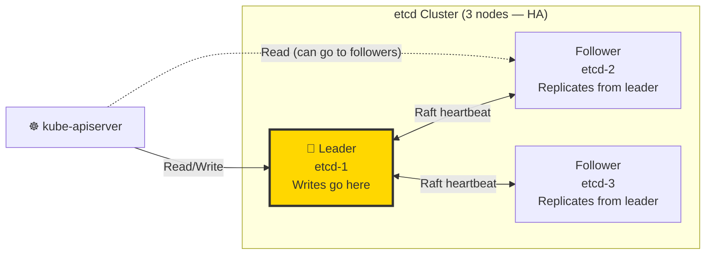

| Cluster Size | Fault Tolerance | Quorum Needed |
|:---:|:---:|:---:|
| 1 node | 0 (no HA) | 1 |
| 3 nodes | 1 node failure | 2 |
| 5 nodes | 2 node failures | 3 |
| 7 nodes | 3 node failures | 4 |

#### What Happens If It Fails?

| Impact | Details |
|:---|:---|
| ❌ Cluster brain-dead | API server cannot read or write state |
| ❌ No new scheduling | Scheduler cannot see what nodes are available |
| ✅ Running pods survive | Pods already running continue (kubelet is autonomous) |
| ❌ No recovery without backup | If all etcd nodes die without a backup, the cluster is lost |
| 🚨 **Data loss = Cluster loss** | No etcd = No cluster state = Start from scratch |

#### Security Best Practices

```bash
# etcd should ONLY be accessible by the API server
# Restrict access with firewall rules
iptables -A INPUT -p tcp --dport 2379 -s <api-server-ip> -j ACCEPT
iptables -A INPUT -p tcp --dport 2379 -j DROP

# Enable encryption at rest for etcd secrets
# /etc/kubernetes/encryption-config.yaml
apiVersion: apiserver.config.k8s.io/v1
kind: EncryptionConfiguration
resources:
  - resources:
      - secrets
    providers:
      - aescbc:
          keys:
            - name: key1
              secret: <base64-encoded-32-byte-key>
      - identity: {}  # fallback for unencrypted
```

#### Common Commands

```bash
# Check etcd health (from control plane node)
etcdctl endpoint health \
  --endpoints=https://127.0.0.1:2379 \
  --cacert=/etc/kubernetes/pki/etcd/ca.crt \
  --cert=/etc/kubernetes/pki/etcd/server.crt \
  --key=/etc/kubernetes/pki/etcd/server.key

# Backup etcd (critical — do this daily in production!)
ETCDCTL_API=3 etcdctl snapshot save /backup/etcd-snapshot-$(date +%Y%m%d).db \
  --endpoints=https://127.0.0.1:2379 \
  --cacert=/etc/kubernetes/pki/etcd/ca.crt \
  --cert=/etc/kubernetes/pki/etcd/server.crt \
  --key=/etc/kubernetes/pki/etcd/server.key

# Restore etcd from backup
ETCDCTL_API=3 etcdctl snapshot restore /backup/etcd-snapshot.db \
  --data-dir=/var/lib/etcd-restored

# Verify a snapshot
etcdctl snapshot status /backup/etcd-snapshot.db --write-out=table

# Read a key directly from etcd (dangerous — avoid in prod)
etcdctl get /registry/secrets/default/my-secret --print-value-only | base64 --decode
```

---

### 3. kube-scheduler — The Placement Engine

#### What Is It?

The **kube-scheduler** watches for newly created pods that have no node assigned, and selects the **best available worker node** to run them.

```
Think of it as: A smart hotel concierge.
A guest (pod) arrives. The concierge checks all rooms (nodes),
considers the guest's requirements (CPU, memory, affinity rules),
and assigns the best available room.
```

#### How It Decides (Two-Phase Process)

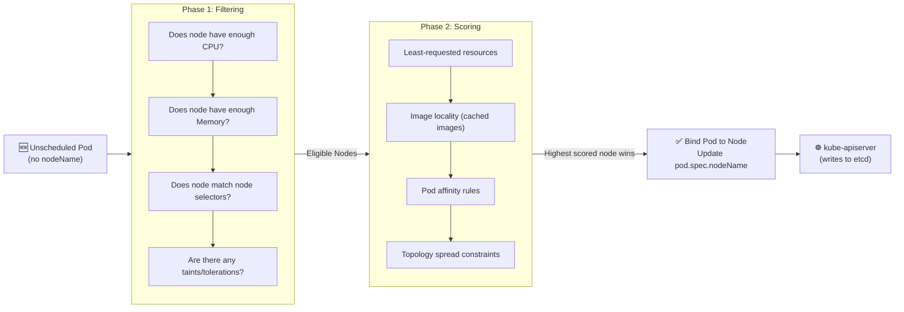

#### What Happens If It Fails?

| Impact | Details |
|:---|:---|
| ❌ New pods stay `Pending` | Pods are created in etcd but never assigned a node |
| ✅ Running pods unaffected | Already-running pods continue normally |
| ❌ Autoscaling breaks | New pods from HPA scale-ups never get scheduled |
| ❌ Deployments hang | Rolling updates stall with new pods stuck `Pending` |

#### Security Best Practices

```bash
# Scheduler should use its own kubeconfig (not cluster-admin)
# Verify scheduler's service account permissions
kubectl get clusterrolebinding system:kube-scheduler -o yaml

# Scheduler should authenticate with a dedicated client cert
# Flags in /etc/kubernetes/manifests/kube-scheduler.yaml:
- --kubeconfig=/etc/kubernetes/scheduler.conf
- --authentication-kubeconfig=/etc/kubernetes/scheduler.conf
- --authorization-kubeconfig=/etc/kubernetes/scheduler.conf
- --bind-address=127.0.0.1   # Don't expose scheduler on all interfaces
```

#### Common Commands

```bash
# Check scheduler health
kubectl get componentstatuses
kubectl -n kube-system get pod -l component=kube-scheduler

# View scheduler logs
kubectl -n kube-system logs kube-scheduler-<node> --tail=50

# Check why a pod is stuck Pending (scheduler decision)
kubectl describe pod <pending-pod-name>
# Look for: "Events" section — shows scheduler messages

# Force pod to a specific node (bypass scheduler)
kubectl patch pod <pod> -p '{"spec":{"nodeName":"worker-node-1"}}'

# Check node taints (affects scheduling)
kubectl describe nodes | grep -A5 Taints

# View custom scheduler config
cat /etc/kubernetes/manifests/kube-scheduler.yaml
```

---

### 4. kube-controller-manager — The Autopilot

#### What Is It?

The **kube-controller-manager** is a single binary that runs dozens of **control loops** (controllers). Each controller watches the cluster state via the API server and works to reconcile the **actual state** with the **desired state**.

```
Think of it as: An aircraft autopilot system.
You set altitude (desired state), the autopilot continuously
adjusts (reconcile loop) to maintain it regardless of turbulence.
```

#### Key Controllers and What They Do

| Controller | What It Watches | What It Does |
|:---|:---|:---|
| **ReplicaSet Controller** | ReplicaSets | Ensures exact pod count is always running |
| **Deployment Controller** | Deployments | Manages rolling updates and rollbacks |
| **Node Controller** | Node heartbeats | Marks nodes NotReady, evicts pods after timeout |
| **Job Controller** | Jobs/CronJobs | Creates pods for batch tasks, marks complete |
| **Endpoints Controller** | Services + Pods | Updates Service endpoint lists as pods come/go |
| **Namespace Controller** | Namespaces | Cleans up resources when namespace is deleted |
| **ServiceAccount Controller** | Namespaces | Creates default service accounts in new namespaces |
| **Token Controller** | ServiceAccounts | Creates/deletes API tokens for service accounts |

#### The Reconciliation Loop (The Core Concept)

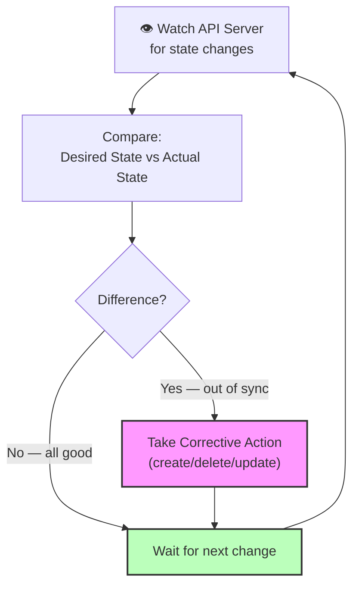

**Example:** You have a Deployment with `replicas: 3`. A worker node crashes, killing 1 pod.

```
Desired state: 3 pods running
Actual state:  2 pods running (1 died)
Action:        Create 1 new pod on a healthy node
Result:        3 pods running ✅
```

#### What Happens If It Fails?

| Impact | Details |
|:---|:---|
| ❌ No self-healing | Crashed pods are NOT restarted |
| ❌ No rolling updates | Deployments stop progressing |
| ❌ Node failures ignored | Dead nodes not evicted, pods not rescheduled |
| ❌ No autoscaling | HPA cannot adjust replica counts |
| ✅ Running pods survive | Already-running pods continue working |

#### Security Best Practices

```bash
# In kube-controller-manager flags:
- --use-service-account-credentials=true     # Each controller uses its own SA
- --service-account-private-key-file=/etc/kubernetes/pki/sa.key
- --cluster-signing-cert-file=/etc/kubernetes/pki/ca.crt
- --cluster-signing-key-file=/etc/kubernetes/pki/ca.key
- --root-ca-file=/etc/kubernetes/pki/ca.crt
- --bind-address=127.0.0.1   # Restrict metrics endpoint to localhost
```

#### Common Commands

```bash
# Check controller manager health
kubectl -n kube-system get pod -l component=kube-controller-manager
kubectl -n kube-system logs kube-controller-manager-<node> --tail=100

# View the manifest
cat /etc/kubernetes/manifests/kube-controller-manager.yaml

# See a ReplicaSet reconciling in action
kubectl get events --sort-by='.lastTimestamp' -A | grep -i "replicaset"

# Manually trigger a rollout (tests controller)
kubectl rollout restart deployment/my-app
kubectl rollout status deployment/my-app
```

---

### 5. cloud-controller-manager — The Cloud Bridge

#### What Is It?

The **cloud-controller-manager** allows Kubernetes to integrate with cloud provider APIs (AWS, GCP, Azure). It abstracts cloud-specific logic away from the core Kubernetes components.

#### What It Controls

| Controller | Cloud Action |
|:---|:---|
| **Node Controller** | Checks cloud provider when a node is deleted; removes it if the VM is gone |
| **Route Controller** | Sets up routes in the cloud network for pod CIDR |
| **Service Controller** | Creates/updates/deletes cloud Load Balancers (ELB, ALB on AWS) |

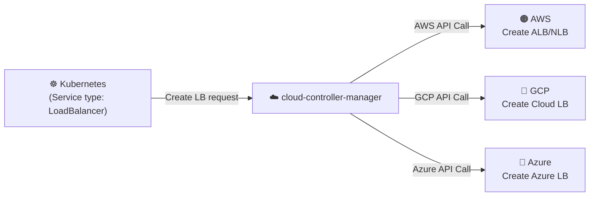

---

## ⚙️ Worker Node Components

---

### 1. kubelet — The Node Agent

#### What Is It?

The **kubelet** is an agent that runs on every worker node. It is the bridge between the Kubernetes control plane and the actual container runtime. It is responsible for ensuring that containers described in PodSpecs are running and healthy.

```
Think of it as: The manager of a factory floor.
HQ (control plane) sends instructions. The manager (kubelet) 
executes them on the shop floor (the node) using the machines 
(container runtime).
```

#### How It Works

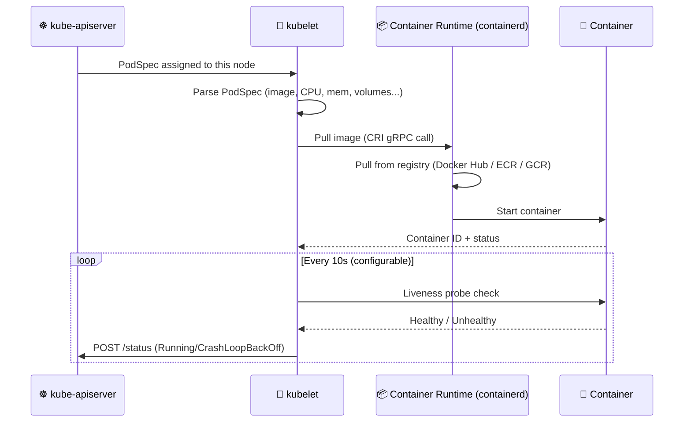

#### What Happens If kubelet Fails?

| Impact | Details |
|:---|:---|
| ❌ Node goes `NotReady` | API server marks node as unreachable after ~40s |
| ❌ Pod health unknown | No liveness/readiness probes running |
| ❌ New pods rejected | Cannot start new workloads on this node |
| ✅ Running containers survive briefly | containerd keeps containers alive independently |
| ❌ Eventual eviction | After 5 min (default), pods evicted from this node |

#### Security Best Practices

```bash
# In /var/lib/kubelet/config.yaml
authentication:
  anonymous:
    enabled: false          # Disable anonymous API access to kubelet
  webhook:
    enabled: true
authorization:
  mode: Webhook             # Use API server for authorization (not AlwaysAllow)

# Disable read-only port (exposes pod/node info without auth)
readOnlyPort: 0             # Set to 0 to disable

# Rotate kubelet certificates automatically
rotateCertificates: true

# Protect kernel defaults
protectKernelDefaults: true

# Enable seccomp by default
seccompDefault: true
```

#### Common Commands

```bash
# Check kubelet status on a node
systemctl status kubelet
journalctl -u kubelet --since "1 hour ago"

# View kubelet config
cat /var/lib/kubelet/config.yaml

# View kubelet logs
journalctl -xeu kubelet -f

# Check node conditions (controlled by kubelet)
kubectl describe node <node-name>
# Look for: Conditions (Ready, MemoryPressure, DiskPressure, PIDPressure)

# Force kubelet to re-read config
systemctl daemon-reload && systemctl restart kubelet

# Check kubelet API directly (requires auth)
curl -sk https://localhost:10250/pods | jq '.items[].metadata.name'
```

---

### 2. kube-proxy — The Network Wizard

#### What Is It?

**kube-proxy** runs on every node and manages the network rules that allow pods to communicate across nodes. It implements the Kubernetes **Service** concept by maintaining network rules (iptables/IPVS) that route traffic to the correct pod.

```
Think of it as: A smart telephone exchange.
When you call a Service (like calling a department), kube-proxy
routes your call to an actual available person (pod) behind it.
```

#### How Services Work With kube-proxy

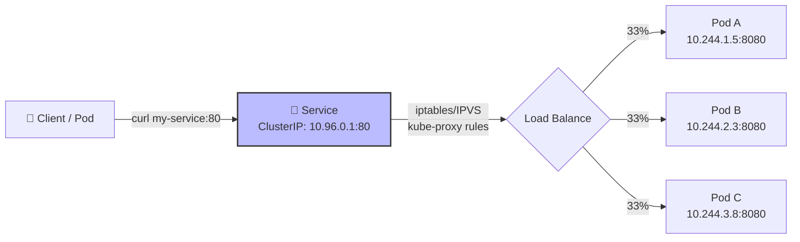

#### Service Types

| Type | Accessibility | Use Case |
|:---|:---|:---|
| `ClusterIP` | Internal only | Microservice-to-microservice |
| `NodePort` | External via `<NodeIP>:<Port>` | Dev/testing (30000-32767) |
| `LoadBalancer` | External via cloud LB | Production external access |
| `ExternalName` | DNS CNAME alias | External service abstraction |

#### What Happens If kube-proxy Fails?

| Impact | Details |
|:---|:---|
| ❌ Services stop routing | New connections to Services fail (existing connections may survive briefly in iptables) |
| ❌ New pods unreachable | Endpoints for new pods not added to iptables rules |
| ✅ Pod-to-Pod IP still works | Direct pod IP communication still works |
| ❌ DNS resolution for Services breaks | Service IPs exist but routing disappears |

#### Security Best Practices

```bash
# kube-proxy should use its own kubeconfig (not cluster-admin)
kubectl -n kube-system get configmap kube-proxy -o yaml

# Use IPVS mode instead of iptables for better performance and security
kubectl -n kube-system edit configmap kube-proxy
# Set: mode: "ipvs"

# Restrict kube-proxy binding
bindAddress: 0.0.0.0   # Change to specific interface if possible
metricsBindAddress: "127.0.0.1:10249"  # Restrict metrics
```

#### Common Commands

```bash
# Check kube-proxy is running
kubectl -n kube-system get pods -l k8s-app=kube-proxy

# View kube-proxy logs
kubectl -n kube-system logs -l k8s-app=kube-proxy --tail=50

# Check iptables rules managed by kube-proxy
iptables -t nat -L KUBE-SERVICES -n --line-numbers

# Check IPVS rules (if using IPVS mode)
ipvsadm -ln

# Test service routing
kubectl run test-client --image=busybox --rm -it -- wget -qO- my-service:80
```

---

### 3. Container Runtime — The Engine

#### What Is It?

The **Container Runtime** is the software that actually runs containers. Kubernetes uses the **Container Runtime Interface (CRI)** to communicate with any compatible runtime.

| Runtime | Status | Used By |
|:---|:---|:---|
| **containerd** | ✅ Default (most clusters) | AWS EKS, GKE, Docker Desktop |
| **CRI-O** | ✅ Lightweight alternative | Red Hat OpenShift, some EKS |
| **Docker** | ❌ Deprecated in K8s (removed in v1.24) | Legacy systems only |

#### Runtime Architecture

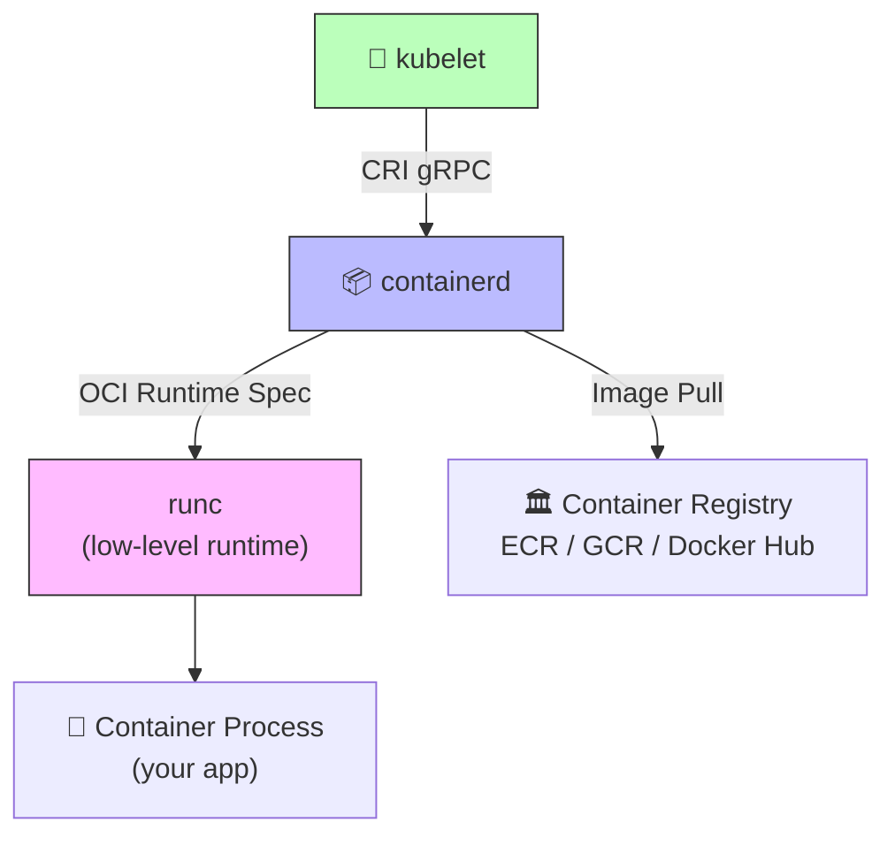

#### What Happens If It Fails?

| Impact | Details |
|:---|:---|
| ❌ No containers can start | New pods remain in `ContainerCreating` |
| ❌ Running containers may die | If runtime crashes mid-run, containers terminate |
| ❌ kubelet cannot function | kubelet requires the runtime to manage pod lifecycle |

#### Common Commands

```bash
# Using crictl (the CRI-compatible CLI — works with any runtime)
crictl ps                              # List running containers
crictl pods                            # List pods managed by kubelet
crictl images                          # List local container images
crictl pull nginx:latest               # Pull an image
crictl logs <container-id>             # View container logs
crictl inspect <container-id>          # Inspect container details
crictl exec -it <container-id> sh      # Shell into a running container
crictl stats                           # Live resource usage

# containerd-specific (via nerdctl or ctr)
nerdctl ps
nerdctl images
ctr --namespace=k8s.io containers list

# Check containerd health
systemctl status containerd
journalctl -u containerd --since "30 min ago"
```

---

## 🔌 Essential Add-ons

### Component Overview

| Add-on | Purpose | Critical? |
|:---|:---|:---:|
| **CoreDNS** | Service discovery (DNS for pods) | 🔴 Yes |
| **Metrics Server** | CPU/Memory metrics for HPA/VPA | 🟠 High |
| **Ingress Controller** | External HTTP/HTTPS routing | 🟠 High |
| **CNI Plugin** | Pod networking (Calico/Flannel/Cilium) | 🔴 Yes |
| **Dashboard** | Web UI for cluster management | 🟡 Optional |
| **Cert-Manager** | Automated TLS certificate management | 🟠 High |

### CoreDNS — Service Discovery

```bash
# Every pod has DNS configured pointing to CoreDNS
kubectl exec -it my-pod -- cat /etc/resolv.conf
# nameserver 10.96.0.10    ← CoreDNS ClusterIP
# search default.svc.cluster.local svc.cluster.local cluster.local

# DNS resolution hierarchy:
# my-service               → my-service.default.svc.cluster.local
# my-service.finance       → my-service.finance.svc.cluster.local
# my-service.finance.svc   → my-service.finance.svc.cluster.local

# Debug DNS issues
kubectl run dnsutils --image=busybox --rm -it -- nslookup kubernetes
kubectl -n kube-system logs -l k8s-app=kube-dns --tail=30
```

---

## 🌍 Real-World Architectures

---

### 🟠 AWS EKS (Elastic Kubernetes Service)

#### What Is EKS?

AWS EKS is a **fully managed Kubernetes control plane**. AWS operates, maintains, and patches the master nodes. You only manage the worker nodes (or use Fargate for serverless pods).

#### EKS Architecture


*Source: AWS — Amazon EKS Architecture Overview*

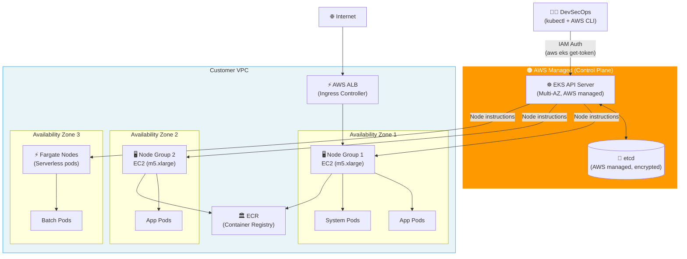

#### EKS vs Self-Managed K8s

| Feature | EKS | Self-Managed |
|:---|:---:|:---:|
| Control plane management | AWS | You |
| etcd management | AWS | You |
| Master node patching | AWS | You |
| Worker node management | You | You |
| HA control plane | ✅ Built-in | Manual setup |
| Cost | $0.10/hour per cluster | EC2 costs for masters |
| IAM integration | ✅ Native (IRSA) | Manual |

#### EKS-Specific Commands

```bash
# Authenticate to EKS cluster
aws eks update-kubeconfig --region us-east-1 --name my-cluster

# Create a managed node group
aws eks create-nodegroup \
  --cluster-name my-cluster \
  --nodegroup-name production-nodes \
  --node-role arn:aws:iam::123456789:role/NodeRole \
  --subnets subnet-xxx subnet-yyy \
  --instance-types m5.xlarge \
  --scaling-config minSize=2,maxSize=10,desiredSize=3

# IAM Roles for Service Accounts (IRSA) — pods assume AWS roles
eksctl create iamserviceaccount \
  --name my-service-account \
  --namespace production \
  --cluster my-cluster \
  --attach-policy-arn arn:aws:iam::aws:policy/AmazonS3ReadOnlyAccess \
  --approve

# Check EKS add-ons
aws eks list-addons --cluster-name my-cluster
aws eks describe-addon --cluster-name my-cluster --addon-name vpc-cni

# Run kube-bench for EKS CIS compliance
kubectl apply -f https://raw.githubusercontent.com/aquasecurity/kube-bench/main/job-eks.yaml
kubectl logs job/kube-bench
```

---

### 🔷 Azure AKS (Azure Kubernetes Service)

#### What Is AKS?

Azure AKS is Microsoft's managed Kubernetes service. Like EKS, the control plane is fully managed by Azure at no charge (you pay only for worker nodes).

#### AKS Architecture


*Source: Microsoft Learn — AKS cluster architecture*

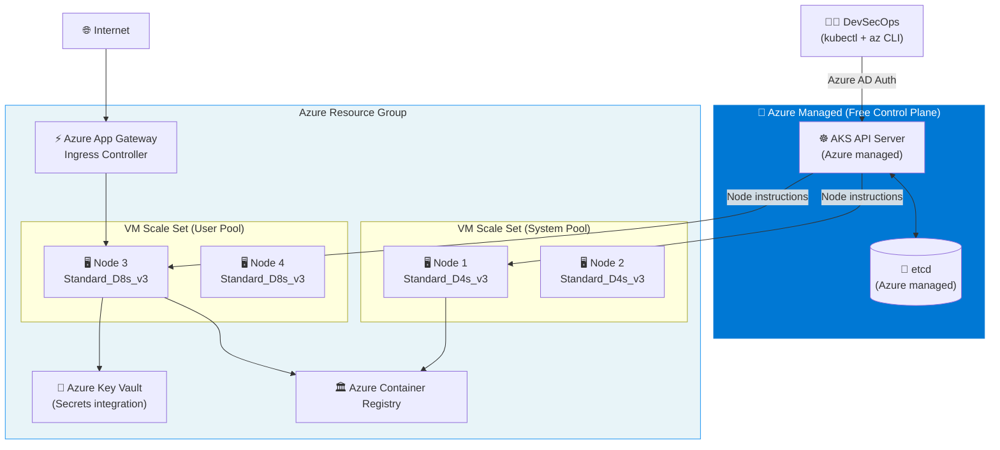

#### AKS-Specific Commands

```bash
# Login and get credentials
az login
az aks get-credentials --resource-group myRG --name myAKSCluster

# Create an AKS cluster with Azure AD integration
az aks create \
  --resource-group myRG \
  --name myAKSCluster \
  --node-count 3 \
  --node-vm-size Standard_D4s_v3 \
  --enable-aad \
  --enable-azure-rbac \
  --network-plugin azure \
  --enable-addons monitoring

# Add a new node pool
az aks nodepool add \
  --resource-group myRG \
  --cluster-name myAKSCluster \
  --name gpupool \
  --node-count 2 \
  --node-vm-size Standard_NC6s_v3

# Enable Azure Key Vault secrets integration
az aks addon enable \
  --resource-group myRG \
  --name myAKSCluster \
  --addon azure-keyvault-secrets-provider \
  --enable-secret-rotation

# Scale a node pool
az aks scale \
  --resource-group myRG \
  --name myAKSCluster \
  --node-count 5 \
  --nodepool-name nodepool1

# Upgrade AKS cluster
az aks upgrade --resource-group myRG --name myAKSCluster --kubernetes-version 1.29.0
```

---

## 💻 Common Commands — Origins & Usage

Understanding where commands come from helps you use the right tool at the right layer.

### Command Tool Origins

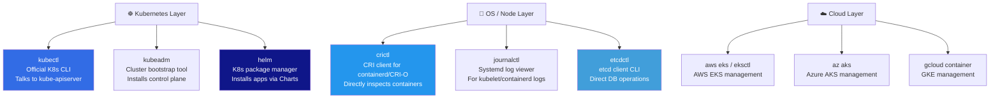

### kubectl — The Main Interface

```bash
# ─── Cluster Info ─────────────────────────────────────────
kubectl cluster-info                       # Cluster API server address
kubectl get nodes -o wide                  # All nodes with IPs and OS
kubectl get componentstatuses              # Health of control plane components
kubectl version --short                    # Client and server versions

# ─── Pods ─────────────────────────────────────────────────
kubectl get pods -A                        # All pods in all namespaces
kubectl get pods -n production -o wide     # Pods with node placement
kubectl describe pod <name>                # Full pod details + events
kubectl logs <pod> -c <container> --tail=100 --follow  # Stream logs
kubectl exec -it <pod> -- /bin/bash        # Interactive shell
kubectl top pods --sort-by=memory          # Live resource usage

# ─── Deployments ──────────────────────────────────────────
kubectl create deployment nginx --image=nginx --replicas=3
kubectl scale deployment nginx --replicas=5
kubectl rollout status deployment/nginx
kubectl rollout history deployment/nginx
kubectl rollout undo deployment/nginx                    # Rollback
kubectl rollout undo deployment/nginx --to-revision=2   # Rollback to v2

# ─── Services & Networking ────────────────────────────────
kubectl expose deployment nginx --port=80 --type=LoadBalancer
kubectl get svc -A
kubectl port-forward pod/<pod-name> 8080:80              # Local port forwarding
kubectl port-forward svc/<service> 8080:80

# ─── Config & Secrets ─────────────────────────────────────
kubectl create configmap app-config --from-file=config.properties
kubectl create secret generic db-creds \
  --from-literal=username=admin \
  --from-literal=password=s3cr3t
kubectl get secret db-creds -o jsonpath='{.data.password}' | base64 -d

# ─── Debugging ────────────────────────────────────────────
kubectl get events --sort-by='.lastTimestamp' -A
kubectl run debug-pod --image=busybox --rm -it -- sh   # Throwaway debug pod
kubectl debug node/<node-name> -it --image=ubuntu       # Node-level debug
kubectl api-resources                                    # All available resource types
```

### kubeadm — Cluster Bootstrap

```bash
# Initialize a new control plane
kubeadm init \
  --pod-network-cidr=10.244.0.0/16 \
  --apiserver-advertise-address=192.168.1.100

# Generate a join token for worker nodes
kubeadm token create --print-join-command

# Join a worker node to the cluster
kubeadm join 192.168.1.100:6443 \
  --token <token> \
  --discovery-token-ca-cert-hash sha256:<hash>

# Certificate management
kubeadm certs check-expiration     # Check all cert expiry dates
kubeadm certs renew all            # Renew all certificates
kubeadm certs renew apiserver      # Renew API server cert only

# Upgrade a cluster
kubeadm upgrade plan               # Check upgrade options
kubeadm upgrade apply v1.30.0      # Apply the upgrade
```

### Helm — Application Package Manager

```bash
# Add a chart repository
helm repo add stable https://charts.helm.sh/stable
helm repo add prometheus-community https://prometheus-community.github.io/helm-charts
helm repo update

# Install an application
helm install my-prometheus prometheus-community/prometheus \
  --namespace monitoring \
  --create-namespace \
  -f custom-values.yaml

# List installed releases
helm list -A

# Upgrade a release
helm upgrade my-prometheus prometheus-community/prometheus \
  --namespace monitoring \
  --set alertmanager.enabled=true

# Rollback
helm rollback my-prometheus 1

# View rendered templates (dry run)
helm template my-prometheus prometheus-community/prometheus -f values.yaml
```

---

## 🔐 DevSecOps Daily Tasks in Real Life

### A Day in the Life of a Kubernetes DevSecOps Engineer

```mermaid
gantt
    title DevSecOps Daily Workflow
    dateFormat HH:mm
    axisFormat %H:%M

    section Morning Checks
    Cluster health & alerts     :09:00, 30m
    Review Falco security events :09:30, 20m
    Check overnight CVE scans   :09:50, 20m

    section Core Work
    Review & merge IaC PRs      :10:30, 60m
    Incident investigation      :11:30, 45m
    RBAC audit & cleanup        :13:00, 45m

    section Deployments
    Staging deployment review   :14:00, 45m
    Production deploy (canary)  :15:00, 60m
    Post-deploy validation      :16:00, 30m

    section Security Tasks
    Rotate expiring certs       :16:30, 30m
    Network policy review       :17:00, 30m
```

### Daily Task Breakdown with Commands

#### 🌅 Morning: Cluster Health Check

```bash
#!/bin/bash
# morning-healthcheck.sh — run every morning

echo "=== 1. Node Status ==="
kubectl get nodes -o wide

echo "=== 2. Control Plane Health ==="
kubectl get componentstatuses 2>/dev/null || \
  kubectl -n kube-system get pods -l tier=control-plane

echo "=== 3. Failed/Crashing Pods ==="
kubectl get pods -A --field-selector=status.phase!=Running,status.phase!=Succeeded \
  | grep -v Completed

echo "=== 4. Recent Events (Warnings only) ==="
kubectl get events -A --field-selector=type=Warning \
  --sort-by='.lastTimestamp' | tail -20

echo "=== 5. Certificate Expiry ==="
kubeadm certs check-expiration 2>/dev/null || \
  openssl x509 -in /etc/kubernetes/pki/apiserver.crt -noout -dates

echo "=== 6. Node Resource Pressure ==="
kubectl describe nodes | grep -E "(Name:|Pressure|Allocatable)" | head -30

echo "=== 7. Pending PVCs ==="
kubectl get pvc -A | grep -v Bound
```

#### 🔍 Security Monitoring Tasks

```bash
# Review Falco runtime security alerts
kubectl -n falco logs -l app=falco --tail=100 | grep -E "Warning|Error|Critical"

# Scan running images for CVEs with Trivy
kubectl get pods -A -o jsonpath='{range .items[*]}{.spec.containers[*].image}{"\n"}{end}' \
  | sort -u \
  | xargs -I {} trivy image --severity HIGH,CRITICAL {}

# Check for pods running as root
kubectl get pods -A -o json | jq -r '
  .items[] |
  select(.spec.securityContext.runAsUser == 0 or
         .spec.containers[].securityContext.runAsUser == 0) |
  "\(.metadata.namespace)/\(.metadata.name)"'

# Check for privileged containers
kubectl get pods -A -o json | jq -r '
  .items[] |
  select(.spec.containers[].securityContext.privileged == true) |
  "\(.metadata.namespace)/\(.metadata.name)"'

# Audit service accounts with cluster-admin
kubectl get clusterrolebindings -o json | jq -r '
  .items[] |
  select(.roleRef.name == "cluster-admin") |
  "\(.metadata.name): \(.subjects[].name)"'

# Check for pods without resource limits (security + stability risk)
kubectl get pods -A -o json | jq -r '
  .items[] |
  select(.spec.containers[].resources.limits == null) |
  "\(.metadata.namespace)/\(.metadata.name)"'
```

#### 🚀 Deployment Tasks

```bash
# Safe production deployment workflow
# Step 1: Check deployment history
kubectl rollout history deployment/my-app -n production

# Step 2: Deploy with a canary (10% traffic)
kubectl apply -f canary-deployment.yaml

# Step 3: Monitor the canary
watch kubectl get pods -n production -l version=canary

# Step 4: Check error rate (requires Prometheus)
kubectl -n monitoring port-forward svc/prometheus 9090:9090 &
# → Query: rate(http_requests_total{status=~"5.*", version="canary"}[5m])

# Step 5: Promote or rollback
# Promote:
kubectl set image deployment/my-app app=my-image:v2.0 -n production
# Rollback:
kubectl rollout undo deployment/my-app -n production

# Step 6: Verify rollout
kubectl rollout status deployment/my-app -n production
kubectl get pods -n production -o wide
```

#### 🔑 RBAC & Access Management

```bash
# Weekly RBAC audit
# Who has cluster-admin?
kubectl get clusterrolebindings -o wide | grep cluster-admin

# What can a user do?
kubectl auth can-i --list --as=dev-user --namespace=production

# Check what a service account can do
kubectl auth can-i --list \
  --as=system:serviceaccount:production:my-app-sa \
  --namespace=production

# Find overly permissive roles (using wildcards)
kubectl get clusterroles -o json | jq -r '
  .items[] |
  select(.rules[].verbs[] == "*") |
  .metadata.name'

# Audit: who can create pods in production?
kubectl auth can-i create pods \
  --namespace=production \
  --as=system:serviceaccount:ci-cd:deploy-bot
```

#### 📊 Resource & Capacity Management

```bash
# Check resource usage across the cluster
kubectl top nodes
kubectl top pods -A --sort-by=memory | head -20

# Find pods without resource requests (causes scheduling issues)
kubectl get pods -A -o json | jq -r '
  .items[] |
  select(.spec.containers[].resources.requests == null) |
  "\(.metadata.namespace)/\(.metadata.name)"'

# Check namespace resource quotas
kubectl get resourcequota -A
kubectl describe resourcequota -n production

# Find nodes under memory pressure
kubectl get nodes -o custom-columns=\
'NAME:.metadata.name,STATUS:.status.conditions[-1].type,\
MEMORY:.status.allocatable.memory,CPU:.status.allocatable.cpu'

# etcd backup (daily task!)
ETCDCTL_API=3 etcdctl snapshot save \
  /backup/etcd-$(date +%F-%H%M).db \
  --endpoints=https://127.0.0.1:2379 \
  --cacert=/etc/kubernetes/pki/etcd/ca.crt \
  --cert=/etc/kubernetes/pki/etcd/server.crt \
  --key=/etc/kubernetes/pki/etcd/server.key
echo "✅ etcd backup complete"
```

---

## 🛡️ Security Best Practices Per Component

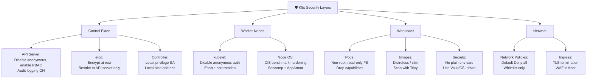

### Full Security Checklist

| Category | Best Practice | Priority |
|:---|:---|:---:|
| **API Server** | Disable anonymous auth | 🔴 Critical |
| **API Server** | Use RBAC (not AlwaysAllow) | 🔴 Critical |
| **API Server** | Enable audit logging | 🔴 Critical |
| **API Server** | Disable insecure port (8080) | 🔴 Critical |
| **etcd** | Encrypt secrets at rest | 🔴 Critical |
| **etcd** | Restrict to API server only | 🔴 Critical |
| **etcd** | Daily backups | 🔴 Critical |
| **kubelet** | Disable anonymous auth | 🔴 Critical |
| **kubelet** | Enable certificate rotation | 🟠 High |
| **Pods** | Run as non-root | 🟠 High |
| **Pods** | Drop ALL capabilities | 🟠 High |
| **Pods** | Read-only root filesystem | 🟠 High |
| **Pods** | Set resource limits | 🟠 High |
| **Images** | Use distroless/slim images | 🟠 High |
| **Images** | Scan with Trivy in CI/CD | 🟠 High |
| **Network** | Default-deny Network Policies | 🟠 High |
| **Secrets** | Use external secrets (Vault) | 🟡 Medium |
| **Certificates** | Rotate before expiry | 🟡 Medium |
| **Dashboard** | Never expose without auth | 🟠 High |

---

## 📋 Quick Reference Cheat Sheet

```bash
# ═══════════════════════════════════════════════════════
#  CLUSTER HEALTH
# ═══════════════════════════════════════════════════════
kubectl get nodes -o wide                    # Node status
kubectl get componentstatuses                # Control plane health
kubectl cluster-info                         # Cluster addresses
kubectl top nodes                            # CPU/Mem usage

# ═══════════════════════════════════════════════════════
#  PODS
# ═══════════════════════════════════════════════════════
kubectl get pods -A -o wide                  # All pods, all namespaces
kubectl get pods --field-selector=status.phase=Failed -A
kubectl describe pod <name> -n <ns>          # Events + spec details
kubectl logs <pod> --previous                # Logs from crashed container
kubectl exec -it <pod> -- bash               # Shell into pod
kubectl delete pod <pod> --force --grace-period=0  # Force delete stuck pod

# ═══════════════════════════════════════════════════════
#  DEPLOYMENTS
# ═══════════════════════════════════════════════════════
kubectl rollout status deployment/<name>     # Watch rollout
kubectl rollout undo deployment/<name>       # Emergency rollback
kubectl rollout history deployment/<name>    # Revision history
kubectl scale deployment/<name> --replicas=0 # Emergency shutdown

# ═══════════════════════════════════════════════════════
#  SECURITY
# ═══════════════════════════════════════════════════════
kubectl auth can-i create pods --as=<user>   # Test permissions
kubectl auth can-i --list --as=<user>        # All permissions for user
kubectl get clusterrolebindings | grep admin # Find admin users
kubeadm certs check-expiration               # Certificate expiry

# ═══════════════════════════════════════════════════════
#  ETCD
# ═══════════════════════════════════════════════════════
etcdctl endpoint health                      # etcd health
etcdctl snapshot save /backup/snap.db        # Backup
etcdctl snapshot restore /backup/snap.db     # Restore

# ═══════════════════════════════════════════════════════
#  NODE DEBUGGING
# ═══════════════════════════════════════════════════════
systemctl status kubelet                     # kubelet health
journalctl -u kubelet -f                     # kubelet live logs
crictl ps                                    # Running containers (via CRI)
crictl logs <container-id>                   # Container logs at OS level

# ═══════════════════════════════════════════════════════
#  AWS EKS
# ═══════════════════════════════════════════════════════
aws eks update-kubeconfig --name <cluster> --region <region>
aws eks list-clusters
eksctl get nodegroup --cluster <name>
eksctl upgrade cluster --name <name> --approve

# ═══════════════════════════════════════════════════════
#  AZURE AKS
# ═══════════════════════════════════════════════════════
az aks get-credentials -g <rg> -n <cluster>
az aks show -g <rg> -n <cluster>
az aks nodepool list -g <rg> --cluster-name <cluster>
az aks upgrade -g <rg> -n <cluster> --kubernetes-version <ver>
```

---

> [!NOTE]
> **What's Next?** Now that you understand the Kubernetes architecture from the ground up, dive into the **Cluster Setup & Hardening** series to learn how to secure each of these components in depth, starting with CIS Benchmarks.

---

*Part of the [Certified Kubernetes Security Specialist (CKS)](./CKS.md) study series.*
