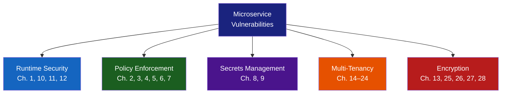

# Microservice Vulnerabilities — Module Introduction & Complete Reference

> **Module Position in CKS:** Microservice Vulnerabilities is one of the five core domains of the Certified Kubernetes Security Specialist exam. It accounts for approximately **20% of exam weight** and is the broadest domain — covering runtime security, policy enforcement, multi-tenancy, encryption, and modern CNI security. This intro file is your navigational anchor and study reference for all 28 chapters in this module.

---

## Module Overview

Modern applications are no longer monoliths. They are distributed systems of dozens — sometimes hundreds — of microservices communicating over a shared network inside a Kubernetes cluster. Each service boundary is a potential attack surface. Each inter-service call is an opportunity for interception, impersonation, or privilege escalation.

This module answers one core question from every angle:

> **"How do you run multiple workloads — potentially from different teams or tenants — safely inside a shared Kubernetes cluster?"**

The answer involves five interlocking pillars:



---

## Chapter Map — All 28 Chapters

### Pillar 1: Runtime Security (Chapters 1, 10, 11, 12)

| Chapter | Title | Core Concept | CKS Weight |
|---------|-------|-------------|------------|
| **Ch. 1** | Security Contexts | Pod/container-level Linux security settings — `runAsUser`, `runAsNonRoot`, `allowPrivilegeEscalation`, `readOnlyRootFilesystem`, `capabilities` (add/drop), `seccompProfile`, `appArmorProfile` | ⭐⭐⭐⭐⭐ |
| **Ch. 10** | Container Sandboxing | Why container isolation is not full VM isolation; kernel sharing risk; sandboxing approaches (gVisor, Kata, seccomp, AppArmor); RuntimeClass resource | ⭐⭐⭐⭐ |
| **Ch. 11** | gVisor | Google's userspace kernel (Sentry); intercepts syscalls before they reach the host; `RuntimeClass` with `handler: runsc`; trade-offs: compatibility vs isolation | ⭐⭐⭐ |
| **Ch. 12** | Kata Containers | Hardware VM isolation per pod (QEMU/firecracker); each pod has its own lightweight kernel; `handler: kata`; highest isolation, highest overhead | ⭐⭐⭐ |

**The key question these chapters answer:** *"What stops a compromised container from breaking out to the node?"*

---

### Pillar 2: Policy Enforcement (Chapters 2–7)

| Chapter | Title | Core Concept | CKS Weight |
|---------|-------|-------------|------------|
| **Ch. 2** | Admission Controllers | The Kubernetes API request lifecycle; built-in controllers (NamespaceLifecycle, LimitRanger, ResourceQuota, etc.); how `--enable-admission-plugins` works; order of execution | ⭐⭐⭐⭐ |
| **Ch. 3** | Validating and Mutating Admission Controllers | Mutating webhooks (modify objects before persist); Validating webhooks (allow/deny after mutation); `MutatingWebhookConfiguration` + `ValidatingWebhookConfiguration` CRDs; failure policy (`Fail` vs `Ignore`) | ⭐⭐⭐⭐⭐ |
| **Ch. 4** | Pod Security Policies | **Deprecated in K8s 1.21, removed in 1.25.** Historical context; why PSP had RBAC confusion and binding complexity; what replaced it (PSA + OPA) | ⭐⭐ (history only) |
| **Ch. 5** | Pod Security Admission and Pod Security Standards | PSA — the built-in replacement for PSP; three profiles: `privileged`, `baseline`, `restricted`; three modes: `enforce`, `audit`, `warn`; namespace label syntax | ⭐⭐⭐⭐⭐ |
| **Ch. 6** | Open Policy Agent (OPA) | Rego policy language; `allow` and `deny` rules; OPA standalone; policy-as-code philosophy; why OPA exists (general-purpose policy engine) | ⭐⭐⭐⭐ |
| **Ch. 7** | OPA in Kubernetes | OPA Gatekeeper; `ConstraintTemplate` (Rego in CRD) + `Constraint` (instance of the template); `K8sRequiredLabels`, `K8sNoPrivilegedContainers`, `K8sBlockNodePort` examples; dry-run mode | ⭐⭐⭐⭐⭐ |

**The key question these chapters answer:** *"How do you prevent teams from deploying insecure configurations in the first place?"*

---

### Pillar 3: Secrets Management (Chapters 8–9)

| Chapter | Title | Core Concept | CKS Weight |
|---------|-------|-------------|------------|
| **Ch. 8** | Manage Kubernetes Secrets | Secret types (`Opaque`, `kubernetes.io/tls`, `kubernetes.io/dockerconfigjson`); base64 encoding is NOT encryption; RBAC for Secrets; external secrets (Vault, AWS Secrets Manager, ESO) | ⭐⭐⭐⭐ |
| **Ch. 9** | Demo Encrypting Secret Data at Rest | `EncryptionConfiguration` API server flag; providers: `aescbc`, `aesgcm`, `secretbox`, `kms`; KMS plugin for cloud HSM integration; verifying encryption with `etcdctl get` | ⭐⭐⭐⭐⭐ |

**The key question these chapters answer:** *"Are your credentials actually secret, or just obscured?"*

---

### Pillar 4: Multi-Tenancy (Chapters 14–24)

| Chapter | Title | Core Concept | CKS Weight |
|---------|-------|-------------|------------|
| **Ch. 14** | Overview of Multi-Tenancy in Kubernetes | Noisy neighbour problem; anti-pattern of one cluster per tenant; 7-category threat matrix; isolation stack layers (control plane → data plane → infrastructure) | ⭐⭐⭐ |
| **Ch. 15** | Different Types of Multi-Tenancy | Multi-team (trusted) vs multi-customer (untrusted); "Kubernetes is invisible" principle; compliance matrix (GDPR/HIPAA/PCI/SOC2) | ⭐⭐⭐ |
| **Ch. 16** | Levels of Isolation — Namespace, Pod, Node | Control plane vs data plane vs infrastructure plane; namespace-scoped vs cluster-scoped resources; PSA restricted pod spec; threat-to-level mapping | ⭐⭐⭐⭐ |
| **Ch. 17** | Control Plane Isolation | RBAC — 4 binding combinations; `Role` + `RoleBinding` for namespace scoping; `ServiceAccount` with `automountServiceAccountToken: false`; etcd mTLS flags; API server hardening | ⭐⭐⭐⭐⭐ |
| **Ch. 18** | Understanding Resource Quotas | `ResourceQuota` anatomy (cpu/memory/storage/object count); `LimitRange` for per-pod defaults; quota bypass when LimitRange is missing; scoped quotas with `scopeSelector` | ⭐⭐⭐⭐ |
| **Ch. 19** | Data Plane Isolation | Three pillars — NetworkPolicy (network), PVC/StorageClass (storage), node pools (compute); what breaks when each pillar is missing | ⭐⭐⭐ |
| **Ch. 20** | Data Plane Isolation — Network | `NetworkPolicy` AND vs OR selector logic; CNI enforcement table (Flannel ❌, Calico ✅, Cilium ✅); 6 policy patterns; default-deny setup | ⭐⭐⭐⭐⭐ |
| **Ch. 21** | Data Plane Isolation — Storage | `reclaimPolicy: Delete` for multi-tenancy; access modes (RWO/ROX/RWX/RWOP); `claimRef` for static PV lock; OPA Gatekeeper to block `hostPath`; per-tenant StorageClass | ⭐⭐⭐⭐ |
| **Ch. 22** | Node Pools, Taints, and Tolerations | Taint effects (NoSchedule/PreferNoSchedule/NoExecute); toleration without `nodeSelector` = incomplete isolation; `NoExecute` emergency eviction; OPA to enforce required tolerations | ⭐⭐⭐⭐ |
| **Ch. 23** | API Priority and Fairness | `PriorityLevelConfiguration` + `FlowSchema` two-object model; `matchingPrecedence` (lower = first); `assuredConcurrencyShares`; `distinguisherMethod` (ByUser/ByNamespace); PriorityClass + preemption | ⭐⭐⭐ |
| **Ch. 24** | Quality of Service | Guaranteed (req==limits) vs Burstable vs BestEffort; eviction order; LimitRange prevents accidental BestEffort; CNI bandwidth annotations; QoS + Priority combined scoring | ⭐⭐⭐⭐ |

**The key question these chapters answer:** *"How do you share a cluster across teams or customers without them interfering with or accessing each other?"*

---

### Pillar 5: Encryption (Chapters 13, 25–28)

| Chapter | Title | Core Concept | CKS Weight |
|---------|-------|-------------|------------|
| **Ch. 13** | One-Way SSL vs Mutual SSL | mTLS 7-step handshake; ECDHE key exchange; PFS; Kubernetes PKI topology (`/etc/kubernetes/pki/`); `CertificateSigningRequest` API; all cert paths | ⭐⭐⭐⭐⭐ |
| **Ch. 25** | DNS in Multi-Tenant Environments | FQDN hierarchy; CoreDNS `fallthrough in-namespace` directive; cross-namespace enumeration threat; `dnsPolicy` options; NetworkPolicy DNS egress control | ⭐⭐⭐ |
| **Ch. 26** | Pod-to-Pod Encryption (Theory) | 5 attack scenarios; zero-trust model; compliance requirements; three approaches (mTLS/Istio, Cilium WireGuard, Cilium IPsec); approach comparison | ⭐⭐⭐ |
| **Ch. 27** | Implement mTLS with Istio | `PeerAuthentication` + `DestinationRule` two-resource model; STRICT vs PERMISSIVE modes; Istiod architecture; sidecar injection; SPIFFE identity; `istioctl proxy-config secret` | ⭐⭐⭐⭐⭐ |
| **Ch. 28** | Cilium — Architecture + Policies | eBPF foundations; cilium-agent + operator + Hubble; identity model; WireGuard vs IPsec; `CiliumNetworkPolicy` (`endpointSelector`, `toFQDNs`, L7 rules); `tcpdump` verification | ⭐⭐⭐⭐⭐ |

**The key question these chapters answer:** *"Even if an attacker gets onto your network, can they read your data?"*

---

## Learning Path — Recommended Study Order


**Dependencies to note:**
- Ch. 27 (Istio mTLS) requires Ch. 13 (mTLS theory) as foundation.
- Ch. 20–21 (NetworkPolicy) require Ch. 17 (RBAC) for complete isolation.
- Ch. 28 (Cilium) builds on Ch. 20 (NetworkPolicy concepts) and Ch. 26 (encryption theory).
- Ch. 9 (Secrets encryption) is independent but pairs with Ch. 8.

---

## Section 1: Key Topics for a DevSecOps / Kubernetes Security Engineer

As someone working in security or DevSecOps at an organization running Kubernetes in production, these are the areas you will engage with daily, in design reviews, incident response, and architecture decisions. They map to real job responsibilities — not just exam topics.

### 1.1 Shift-Left Security — Policy Before Deployment

The most impactful security work happens **before** a pod ever runs. Your job is to make insecure deployments impossible, not just detectable.

**What this looks like in practice:**
- OPA Gatekeeper policies in CI/CD (`gator test` in pre-commit hooks).
- PSA `warn` mode in staging, `enforce` in production.
- Admission webhook validating container images come from approved registries.
- `LimitRange` ensuring every pod has resource requests defined (prevents BestEffort QoS).

**Key skills to have:**
- Writing Rego policies from scratch (not just copying templates).
- Understanding `FailurePolicy: Fail` vs `Ignore` on webhooks — wrong choice here causes outages.
- Knowing which admission plugins are enabled by default in your Kubernetes version.

### 1.2 The Principle of Least Privilege — Applied Everywhere

Least privilege isn't just about RBAC. In this module it applies to:

| Layer | Least Privilege Mechanism |
|-------|--------------------------|
| Pod capabilities | `securityContext.capabilities.drop: ["ALL"]` + add only what's needed |
| File system | `readOnlyRootFilesystem: true` + specific `emptyDir` or `volumeMounts` |
| Syscalls | seccomp `RuntimeDefault` or custom profile |
| Network | NetworkPolicy default-deny + explicit allow |
| Secrets access | RBAC to specific Secret names, not wildcard `*` |
| Service Account | `automountServiceAccountToken: false` unless needed |
| Storage | RWO access mode, namespaced PVCs, `reclaimPolicy: Delete` |
| Node access | Taints + nodeSelector (both required for hard isolation) |

**Real-world failure:** Teams often apply a taint to a node but forget the `nodeSelector` on the deployment. Pods with the toleration but no selector *can* land on the tainted node, but *don't have to* — breaking the isolation guarantee.

### 1.3 Defense in Depth — No Single Point of Failure

Security in depth means: **assume every individual control will eventually fail**. Design your system so that compromising one layer does not compromise everything.

```
Threat: Container escape vulnerability in the container runtime

Defense layer 1: SecurityContext (drop capabilities, no privileged)
  → Makes escape harder

Defense layer 2: seccomp RuntimeDefault (blocks dangerous syscalls)
  → Makes escape even harder

Defense layer 3: gVisor/Kata RuntimeClass (userspace/VM kernel boundary)
  → Escape stays within the sandbox

Defense layer 4: NetworkPolicy (default deny)
  → Escaped container can't reach other pods

Defense layer 5: Node isolation (dedicated node pool)
  → Compromised node doesn't host other tenants

Defense layer 6: mTLS / Cilium encryption
  → Lateral movement traffic is unreadable by other pods
```

### 1.4 Encryption Strategy — What to Encrypt, Where

Many engineers know they need encryption but don't have a clear mental model:

```
Data at rest:
  ├── Kubernetes Secrets → EncryptionConfiguration (Ch. 9) — AES-GCM or KMS
  ├── PersistentVolumes → StorageClass encryption (EBS, GCS, Azure Disk encryption)
  └── etcd → etcd at-rest encryption (same EncryptionConfiguration)

Data in transit:
  ├── kubectl → API server → TLS (always on)
  ├── API server ↔ etcd → mTLS (Ch. 13 certs)
  ├── API server ↔ kubelet → TLS (kubelet-client cert)
  ├── Pod ↔ Pod (same node) → Cilium socket-level (optional)
  └── Pod ↔ Pod (cross-node) → Cilium WireGuard/IPsec OR Istio mTLS (Ch. 27, 28)

Data in use:
  └── Confidential Computing (Intel TDX, AMD SEV) — beyond current CKS scope
```

**The gap most teams have:** They have TLS on ingress and etcd encryption, but **nothing on pod-to-pod**. Internal traffic is often fully plaintext.

### 1.5 Multi-Tenancy Architecture Decisions

When a new team or customer needs to be onboarded to a shared cluster, you will be asked: *"How isolated do they need to be?"*

```
Decision tree for a DevSecOps engineer:

Q1: Is the tenant trusted (internal team) or untrusted (external customer)?
  └── Untrusted → go to Q2
  └── Trusted → namespace-per-team + RBAC + NetworkPolicy may be sufficient

Q2: Does the tenant need direct kubectl access?
  └── Yes → vCluster or dedicated cluster (Kubernetes is NOT invisible to them)
  └── No → namespace-per-customer + platform controller (Kubernetes IS invisible)

Q3: Does the tenant have compliance requirements (HIPAA, PCI, GDPR)?
  └── Yes → dedicated node pool + pod-to-pod encryption + strict NetworkPolicy
  └── No → namespace isolation + ResourceQuota may suffice

Q4: Can tenants tolerate shared fate (cluster outage affects all)?
  └── No → dedicated cluster or Cluster Mesh with separate control planes
  └── Yes → shared cluster with APF + QoS (Ch. 23, 24)
```

### 1.6 Incident Response — What to Check First

When a security incident is suspected in a Kubernetes cluster, your workflow should follow this order:

```bash
# Step 1: Identify what's running unexpectedly
kubectl get pods -A --sort-by=.metadata.creationTimestamp | tail -20
kubectl get pods -A -o jsonpath='{range .items[*]}{.metadata.name}{"\t"}{.spec.containers[*].image}{"\n"}{end}'

# Step 2: Check for privilege escalation
kubectl auth can-i --list --namespace=<ns> --as=system:serviceaccount:<ns>:<sa>
kubectl get clusterrolebindings -o json | jq '.items[] | select(.subjects[]?.name=="system:anonymous")'

# Step 3: Check network anomalies (with Cilium/Hubble)
hubble observe --verdict DROPPED --since 1h
hubble observe --namespace <ns> --follow | grep -v ALLOWED

# Step 4: Inspect container activity
kubectl exec <pod> -- ps aux
kubectl exec <pod> -- ss -tlnp   # Open ports
kubectl exec <pod> -- cat /proc/1/net/tcp   # Network connections

# Step 5: Check secret access audit logs
kubectl get events --sort-by=.lastTimestamp -A | grep Secret

# Step 6: Cordon the node if needed
kubectl cordon <node>
kubectl drain <node> --ignore-daemonsets --delete-emptydir-data
```

### 1.7 Secrets — What DevSecOps Engineers Always Get Wrong

Base64 ≠ encryption. This cannot be overstated:

```bash
echo -n "my-password" | base64
# bXktcGFzc3dvcmQ=

# ANYONE with kubectl get secret can reverse this:
echo "bXktcGFzc3dvcmQ=" | base64 -d
# my-password

# What you actually need:
# 1. EncryptionConfiguration with AES-GCM (Ch. 9) — encrypts in etcd
# 2. RBAC restricting which SA/user can get/list the Secret
# 3. External Secrets Operator + Vault/AWS SM for rotation + audit trail
# 4. Never mount secrets as env vars (prefer volume mounts — harder to leak via /proc)
```

---

## Section 2: Scenario-Based Interview Questions

These are the questions that separate candidates who memorised theory from those who have worked through real problems.

---

### Category A: Design & Architecture Questions

**Q1: A startup wants to run both SaaS and enterprise customers on the same Kubernetes cluster to reduce cost. The enterprise customers have PCI-DSS requirements. How do you design the isolation?**

*What the interviewer is testing:* Multi-tenancy architecture (Ch. 14–22), compliance understanding, trade-off reasoning.

*Strong answer framework:*
- Separate namespaces per customer (enterprise customers get dedicated namespaces).
- Dedicated node pools for PCI workloads with NoSchedule taints + nodeSelector.
- NetworkPolicy default-deny per namespace + explicit allow rules.
- Pod-to-pod encryption with Cilium WireGuard (transparent, no app changes).
- ResourceQuota + LimitRange per namespace.
- RBAC: enterprise team gets a Role scoped to their namespace, no ClusterRole.
- Separate StorageClass with `reclaimPolicy: Delete` and encryption at rest.
- APF: enterprise customers get a dedicated PriorityLevelConfiguration so a noisy SaaS tenant can't starve API server for enterprise.
- Audit logging enabled, Hubble for flow visibility.

---

**Q2: You discover that a developer has been running a pod with `privileged: true` in production for 3 months and no one noticed. How do you prevent this from happening again?**

*What the interviewer is testing:* Admission controllers (Ch. 2, 3, 5, 7), process thinking.

*Strong answer framework:*
- **Immediate:** Remove the pod, audit what it did (`kubectl logs`, audit logs, Hubble flows).
- **Short-term:** Enable PSA `enforce` mode with `restricted` profile in production namespaces.
- **Medium-term:** OPA Gatekeeper `K8sNoPrivilegedContainers` ConstraintTemplate as a second layer.
- **Long-term:** Shift left — add the same check to CI/CD with `kube-score` or `conftest` + Rego.
- **Process:** Add privileged pod detection to your alerting (Falco rule, audit log trigger).

---

**Q3: Your team wants to use Kubernetes Secrets to store database passwords, but your security team says "Secrets are not secure." Who is right, and how do you resolve the dispute?**

*What the interviewer is testing:* Ch. 8 and 9 — the distinction between Secrets as an API and Secret encryption.

*Strong answer framework:*
- Both are partially right. Kubernetes Secrets are base64-encoded by default — not encrypted. Anyone with `kubectl get secret` RBAC can read them.
- However, with `EncryptionConfiguration` + AES-GCM (Ch. 9), Secrets **are** encrypted in etcd. The RBAC layer still controls API access.
- True resolution: use External Secrets Operator with HashiCorp Vault or AWS Secrets Manager — this adds rotation, audit trails, and dynamic credentials.
- Mount Secrets as volumes, not environment variables — `/proc/<pid>/environ` leaks env vars to any process in the container.

---

**Q4: A new microservice team wants to deploy their application to the cluster. What security onboarding checklist do you give them?**

*What the interviewer is testing:* Breadth of understanding across the whole module.

*Checklist answer:*
```
Namespace: Created by platform team with ResourceQuota + LimitRange
RBAC: Team gets namespace-scoped Role (not ClusterRole)
ServiceAccount: Custom SA with automountServiceAccountToken: false
Pod Security: PSA restricted enforce on namespace
NetworkPolicy: Default-deny ingress/egress applied, team adds allow rules
SecurityContext: runAsNonRoot, readOnlyRootFilesystem, drop ALL capabilities
Image: From approved registry only (ImagePolicyWebhook or Gatekeeper)
Secrets: Stored in Vault, injected via ESO — not raw K8s Secrets
Resources: requests and limits required (enforced by LimitRange)
Runtime: seccomp RuntimeDefault minimum; gVisor if processing untrusted data
Encryption: Covered by cluster-wide Cilium WireGuard (transparent)
Logging: Application logs → stdout/stderr (Fluentd picks up)
Monitoring: Prometheus scraping → Grafana dashboard (or Hubble for network)
```

---

### Category B: Troubleshooting Questions

**Q5: A pod is failing to start with the error: "container has runAsNonRoot and image will run as root." What caused this and how do you fix it?**

*Answer:* The container image's `Dockerfile` has `USER root` or no `USER` directive (default is root). The pod spec has `securityContext.runAsNonRoot: true`. Fix: either change the `Dockerfile` to `USER 1001` and rebuild, or add `securityContext.runAsUser: 1001` in the pod spec (but check the image supports running as non-root). If the image genuinely requires root, escalate — do not disable `runAsNonRoot`.

---

**Q6: You applied a `NetworkPolicy` that should deny all egress from a namespace, but pods are still reaching the internet. What could be wrong?**

*Answer:* Most common causes:
1. **Wrong CNI:** The cluster uses Flannel, which doesn't enforce NetworkPolicy. Switch to Calico or Cilium.
2. **Selector error:** The policy's `podSelector` doesn't match the pods (labels mismatch).
3. **AND vs OR logic:** Multiple `from`/`to` entries on the same `-` bullet are ANDed — may be accidentally allowing more than intended.
4. **Missing default-deny:** NetworkPolicy is additive — you must have an explicit default-deny policy. If there's no policy at all for a pod, it's allowed everything.
5. **Namespace not labelled:** Cross-namespace selector requires the source namespace to have the correct label.
6. **System-level traffic:** CoreDNS (UDP 53) may appear as "internet traffic" — check if the policy allows DNS.

---

**Q7: After enabling Istio strict mTLS on the `production` namespace, all inter-service calls start returning 503. What happened?**

*Answer:*
1. Some pods don't have the `istio-proxy` sidecar (namespace label was added but pods weren't restarted → `kubectl rollout restart deployment -n production`).
2. Missing `DestinationRule` with `ISTIO_MUTUAL` — the client sidecar may still send plain HTTP.
3. A service in the namespace doesn't support mTLS (e.g., external dependency without sidecar) → use a workload-scoped `PeerAuthentication` with `PERMISSIVE` for that specific service.
4. System services (CoreDNS, etc.) — ensure `kube-system` namespace is excluded from strict policy.

---

**Q8: A tenant reports that their pods are being evicted frequently. How do you diagnose and fix it?**

*Answer:*
```bash
# 1. Check eviction events
kubectl get events -n <namespace> | grep -i evict

# 2. Check pod QoS class
kubectl get pod <pod> -n <namespace> -o jsonpath='{.status.qosClass}'
# BestEffort = evicted first, Burstable = evicted second

# 3. Check if LimitRange is missing (causing BestEffort by default)
kubectl get limitrange -n <namespace>

# 4. Check node pressure
kubectl describe node <node> | grep -A 10 "Conditions:"
# MemoryPressure / DiskPressure triggers evictions

# 5. Fix: Add resource requests/limits to pods
# Fix: Apply LimitRange to force defaults
# Fix: Upgrade to Guaranteed QoS (requests == limits for all containers)
# Fix: If multi-tenant, apply ResourceQuota to prevent noisy neighbours
```

---

**Q9: Security team reports that `tcpdump` on a cluster node shows plaintext HTTP traffic between pods. Cilium is the CNI. What do you do?**

*Answer:*
1. Confirm encryption status: `kubectl exec -n kube-system ds/cilium -- cilium status | grep -i encrypt` — if it shows nothing or "Disabled", encryption is not enabled.
2. Enable WireGuard: `helm upgrade cilium cilium/cilium --reuse-values --set encryption.enabled=true --set encryption.type=wireguard -n kube-system`
3. Wait for DaemonSet rollout: `kubectl rollout status ds/cilium -n kube-system`
4. Verify: Run `tcpdump` again — traffic should now appear as UDP on port 51871 (WireGuard) with unreadable binary content.
5. Apply CiliumNetworkPolicy to enforce authorized communication patterns.

---

### Category C: Policy & Code Questions

**Q10: Write an OPA Gatekeeper policy that blocks any pod from using `hostPath` volumes.**

```yaml
# ConstraintTemplate
apiVersion: templates.gatekeeper.sh/v1
kind: ConstraintTemplate
metadata:
  name: k8snohostpath
spec:
  crd:
    spec:
      names:
        kind: K8sNoHostPath
  targets:
  - target: admission.k8s.gatekeeper.sh
    rego: |
      package k8snohostpath
      violation[{"msg": msg}] {
        vol := input.review.object.spec.volumes[_]
        vol.hostPath
        msg := sprintf("Pod %v uses hostPath volume, which is not allowed", [input.review.object.metadata.name])
      }
---
# Constraint (applies the template)
apiVersion: constraints.gatekeeper.sh/v1beta1
kind: K8sNoHostPath
metadata:
  name: no-host-path
spec:
  match:
    kinds:
    - apiGroups: [""]
      kinds: ["Pod"]
```

---

**Q11: A NetworkPolicy needs to: (a) allow all pods in namespace `frontend` to call `backend` pods on port 8080, and (b) deny all other ingress to `backend`. Write it.**

```yaml
apiVersion: networking.k8s.io/v1
kind: NetworkPolicy
metadata:
  name: backend-allow-frontend
  namespace: backend
spec:
  podSelector:
    matchLabels:
      app: backend
  policyTypes:
  - Ingress
  ingress:
  - from:
    - namespaceSelector:
        matchLabels:
          kubernetes.io/metadata.name: frontend
    ports:
    - protocol: TCP
      port: 8080
# Note: policyTypes including Ingress with no matching default-deny
# means ALL other ingress is denied for matched pods.
# The absence of a second ingress rule = implicit deny for everything else.
```

---

**Q12: What's the difference between these two NetworkPolicy `from` blocks?**

```yaml
# Policy A
from:
- podSelector:
    matchLabels:
      app: frontend
- namespaceSelector:
    matchLabels:
      env: production

# Policy B
from:
- podSelector:
    matchLabels:
      app: frontend
  namespaceSelector:
    matchLabels:
      env: production
```

*Answer:* This is the single most common NetworkPolicy exam trap.

- **Policy A:** Two separate list items (two dashes) → **OR** logic. Allows pods with `app=frontend` from **ANY** namespace, OR any pod from namespaces with `env=production`. Much broader than intended.
- **Policy B:** Single list item with both selectors → **AND** logic. Allows only pods with `app=frontend` that are **also** in a namespace with `env=production`. Correct for cross-namespace allow.

---

### Category D: Open-Ended Thinking Questions

**Q13: Kubernetes has RBAC, NetworkPolicy, PSA, and OPA. Why do we need all of them? Isn't RBAC enough?**

*Answer:* Each control operates at a different plane:
- **RBAC:** Controls the *Kubernetes API* — who can create/modify/delete resources. Does not control what a running process does inside a container or on the network.
- **PSA/OPA:** Controls *what configurations* can be submitted to the API. Prevents insecure specs from being created.
- **NetworkPolicy:** Controls *network traffic* between running pods. RBAC has zero effect once a container is running.
- **SecurityContext:** Controls *OS-level permissions* inside the container. None of the above can limit syscalls or file system access within a running container.

You need all of them because a compromised container bypasses RBAC entirely — it doesn't use the API. It talks on the network directly and makes syscalls directly.

---

**Q14: A CISO asks: "We have TLS on our ingress controller. Why do we need pod-to-pod encryption too?" How do you explain it?**

*Answer:*

```
Ingress TLS terminates at the ingress controller.
From there to your backend pods: plain HTTP on the cluster network.

If any of these happens, your data is exposed:
  - A compromised node can tcpdump all pod traffic on that node
  - A rogue container uses ARP spoofing to intercept cross-pod traffic
  - A cloud provider support engineer has access to network TAP
  - A misconfigured CNI sends traffic to wrong pods

Pod-to-pod encryption (Ch. 26-28) closes the gap between
the ingress controller and your application. TLS on ingress 
protects external-to-cluster; mTLS/Cilium protects internal-to-internal.
```

---

## Section 3: CKS Exam — Topics to Prepare

The CKS (Certified Kubernetes Security Specialist) exam is 2 hours, fully hands-on (no multiple choice), performance-based in a live cluster environment. Microservice Vulnerabilities accounts for ~20% of the exam weight.

### 3.1 High-Frequency Exam Tasks (Must Master)

These tasks appear in almost every CKS exam sitting:

#### Task Type 1: SecurityContext Configuration

```bash
# Exam task: "Fix the pod so it: runs as user 1000, doesn't allow privilege escalation,
# has a read-only root filesystem, and drops all capabilities."

# Your answer:
spec:
  securityContext:
    runAsUser: 1000
    runAsNonRoot: true
    fsGroup: 2000
  containers:
  - name: app
    securityContext:
      allowPrivilegeEscalation: false
      readOnlyRootFilesystem: true
      capabilities:
        drop: ["ALL"]
```

**Time target:** Under 3 minutes.

#### Task Type 2: Pod Security Admission

```bash
# Exam task: "Enforce the restricted Pod Security Standard on namespace 'secure-ns'"

kubectl label namespace secure-ns \
  pod-security.kubernetes.io/enforce=restricted \
  pod-security.kubernetes.io/enforce-version=latest \
  pod-security.kubernetes.io/warn=restricted \
  pod-security.kubernetes.io/audit=restricted

# Know all three modes: enforce, warn, audit
# Know all three profiles: privileged, baseline, restricted
```

**Time target:** Under 2 minutes.

#### Task Type 3: NetworkPolicy

```bash
# Exam task: "Create a NetworkPolicy that denies all ingress to pods with label
# app=secure-app except from pods with label app=allowed-client on port 443"

apiVersion: networking.k8s.io/v1
kind: NetworkPolicy
metadata:
  name: allow-specific-client
  namespace: <given-namespace>
spec:
  podSelector:
    matchLabels:
      app: secure-app
  policyTypes:
  - Ingress
  ingress:
  - from:
    - podSelector:
        matchLabels:
          app: allowed-client
    ports:
    - protocol: TCP
      port: 443
```

**Time target:** Under 4 minutes.

#### Task Type 4: Encrypting Secrets at Rest

```bash
# Exam task: "Enable encryption of Secrets at rest in etcd using AES-CBC"

# 1. Generate key
head -c 32 /dev/urandom | base64

# 2. Create /etc/kubernetes/enc/enc.yaml
apiVersion: apiserver.config.k8s.io/v1
kind: EncryptionConfiguration
resources:
- resources: ["secrets"]
  providers:
  - aescbc:
      keys:
      - name: key1
        secret: <base64-key>
  - identity: {}   # fallback to read unencrypted existing secrets

# 3. Add to kube-apiserver static pod manifest
--encryption-provider-config=/etc/kubernetes/enc/enc.yaml

# 4. Verify
kubectl get secret -n default <name> -o yaml
etcdctl get /registry/secrets/default/<name> | hexdump -C | head
# Should show: /registry/secrets/default/<name>: k8s:enc:aescbc:v1:key1:...
```

**Time target:** Under 8 minutes.

#### Task Type 5: RuntimeClass (gVisor/Kata)

```bash
# Exam task: "Create a RuntimeClass for gVisor and apply it to pod 'sandboxed-pod'"

# RuntimeClass
apiVersion: node.k8s.io/v1
kind: RuntimeClass
metadata:
  name: gvisor
handler: runsc

# Pod spec
spec:
  runtimeClassName: gvisor
  containers:
  - name: app
    image: nginx
```

**Time target:** Under 3 minutes.

#### Task Type 6: OPA Gatekeeper

```bash
# Exam task: "Apply the provided ConstraintTemplate and create a Constraint that
# requires all pods in namespace 'production' to have a label 'owner'"

# Always check — template may already exist:
kubectl get constrainttemplate

# Apply template first, then constraint:
kubectl apply -f constraint-template.yaml
kubectl apply -f constraint.yaml

# Verify it's active:
kubectl get constraint
kubectl describe constraint <name> | grep "Total Violations"
```

**Time target:** Under 5 minutes.

#### Task Type 7: mTLS with Istio

```bash
# Exam task: "Enable strict mTLS for namespace 'production'"

# Step 1: Ensure injection is enabled
kubectl label namespace production istio-injection=enabled

# Step 2: Restart pods for sidecar injection
kubectl rollout restart deployment -n production

# Step 3: Apply PeerAuthentication
kubectl apply -f - <<EOF
apiVersion: security.istio.io/v1beta1
kind: PeerAuthentication
metadata:
  name: default
  namespace: production
spec:
  mtls:
    mode: STRICT
EOF

# Step 4: Apply DestinationRule
kubectl apply -f - <<EOF
apiVersion: networking.istio.io/v1alpha3
kind: DestinationRule
metadata:
  name: default
  namespace: production
spec:
  host: "*.production.svc.cluster.local"
  trafficPolicy:
    tls:
      mode: ISTIO_MUTUAL
EOF
```

**Time target:** Under 6 minutes.

#### Task Type 8: Cilium Encryption

```bash
# Exam task: "Enable WireGuard encryption for pod-to-pod traffic using Cilium"

helm upgrade cilium cilium/cilium \
  --namespace kube-system \
  --reuse-values \
  --set encryption.enabled=true \
  --set encryption.type=wireguard

kubectl rollout status ds/cilium -n kube-system

# Verify:
kubectl exec -n kube-system ds/cilium -- cilium status | grep Wireguard
kubectl exec -n kube-system ds/cilium -- wg show
```

**Time target:** Under 4 minutes.

---

### 3.2 Common Exam Traps

| Trap | Correct Behaviour |
|------|------------------|
| PSP is still in use | PSP is removed in K8s 1.25+. If cluster is ≥1.25, use PSA |
| NetworkPolicy AND vs OR | Two separate `-` items = OR; combined selectors under one `-` = AND |
| Toleration without nodeSelector | Pod CAN land on tainted node but isn't FORCED to — not hard isolation |
| `podSelector: {}` in NetworkPolicy | Matches ALL pods in the namespace, not "no pods" |
| Forgetting `policyTypes` | Without explicit `policyTypes`, only the directions with rules are enforced |
| Strict mTLS without sidecar rollout | Pods created before namespace label was added have no sidecar |
| Missing `DestinationRule` in Istio | Server enforces mTLS but client still sends plain HTTP → 503 |
| `endpointSelector` vs `podSelector` | CiliumNetworkPolicy uses `endpointSelector`, not `podSelector` |
| IPsec needs a Secret | `cilium-ipsec-keys` Secret in `kube-system` must exist |
| EncryptionConfiguration key format | Must be base64-encoded, exactly 32 bytes for AES-256 |

---

### 3.3 Tools You Must Be Comfortable With

```bash
# kubectl
kubectl auth can-i --list --as=<user> -n <ns>
kubectl explain pod.spec.securityContext --recursive
kubectl label namespace <ns> pod-security.kubernetes.io/enforce=restricted
kubectl rollout restart deployment/<name> -n <ns>

# openssl
openssl x509 -in /etc/kubernetes/pki/apiserver.crt -text -noout | grep -E "Subject|DNS"
openssl s_client -connect <host>:<port> -CAfile ca.crt

# etcdctl
ETCDCTL_API=3 etcdctl get /registry/secrets/default/<name> \
  --endpoints=https://127.0.0.1:2379 \
  --cacert=/etc/kubernetes/pki/etcd/ca.crt \
  --cert=/etc/kubernetes/pki/etcd/server.crt \
  --key=/etc/kubernetes/pki/etcd/server.key | hexdump -C | head

# istioctl
istioctl analyze -n <ns>
istioctl proxy-config listeners <pod>
istioctl proxy-config secret <pod> -n <ns>

# cilium
kubectl exec -n kube-system ds/cilium -- cilium status
kubectl exec -n kube-system ds/cilium -- cilium policy trace --src-k8s-pod ... --dst-k8s-pod ...
kubectl exec -n kube-system ds/cilium -- wg show

# tcpdump (for verifying encryption)
kubectl debug node/<node> -it --image=nicolaka/netshoot -- tcpdump -i eth0 -nn port 80 -A
```

---

## Section 4: New Threats and Challenges Brought by AI in Kubernetes

The rise of AI/ML workloads in Kubernetes introduces a new threat landscape that goes beyond what traditional CKS material covers. As a security engineer in 2025 and beyond, these are the emerging areas you need to understand.

---

### 4.1 AI Workloads as High-Value Attack Targets

AI training and inference pods are uniquely attractive to attackers:

```
Why AI pods are high-value targets:

1. GPU access → cryptocurrency mining
   - A compromised AI pod with GPU access can mine crypto at enormous profit
   - Attack vector: RCE in ML framework (TensorFlow, PyTorch supply chain)
   - Mitigation: GPU resource limits, separate node pools, RuntimeClass sandboxing

2. Model weights → IP theft
   - Trained models represent millions of dollars in compute investment
   - Stored in PVCs or object storage — treat like source code
   - Mitigation: Encrypted storage classes, RBAC on PVC access, network egress restrictions

3. Training data → privacy breach
   - Medical imaging, financial records, user data used in fine-tuning
   - Mitigation: Namespace isolation, PVC per-tenant, audit logging on data access

4. Inference endpoints → adversarial inputs
   - Prompt injection attacks reaching the serving pod
   - Mitigation: WAF at ingress, input validation, rate limiting
```

---

### 4.2 AI/ML Supply Chain Attacks

Model supply chain attacks are the ML equivalent of SolarWinds for Kubernetes:

```
Attack vectors:
  ├── Malicious pre-trained models (Hugging Face, model registries)
  │     Mitigation: Signed model artifacts, checksum verification
  │     Tool: sigstore/cosign for model files
  │
  ├── Poisoned Python packages in AI container images
  │     Attack: pip install transformers installs malicious dependency
  │     Mitigation: Private PyPI mirror, Syft SBOM generation per image
  │
  ├── Jupyter notebook as attack surface
  │     Notebooks run as privileged, install arbitrary packages
  │     Mitigation: JupyterHub with unprivileged user, network isolation
  │
  └── LLM-generated code with vulnerabilities
        Developers copy-paste from ChatGPT/Copilot without review
        Mitigation: SAST in CI/CD, security code review gates
```

**Kubernetes-specific mitigation for AI images:**
```yaml
# Enforce signed AI model images
apiVersion: constraints.gatekeeper.sh/v1beta1
kind: K8sAllowedRepos
metadata:
  name: ai-approved-registries
spec:
  parameters:
    repos:
    - "approved-registry.company.com/ai-models/"   # Internal signed registry only
    # NOT: "docker.io" or "ghcr.io" — community images are unaudited
  match:
    namespaceSelector:
      matchLabels:
        team: ai-platform
```

---

### 4.3 GPU Node Security — A New Attack Surface

AI clusters use GPU nodes (NVIDIA A100, H100, AMD MI300). GPU nodes introduce novel security concerns:

```
New GPU-specific threat model:

1. GPU memory persistence:
   - GPU VRAM is NOT cleared between container runs (unlike RAM)
   - Previous container's training data may be readable by next container
   - Mitigation: GPU memory isolation (NVIDIA MIG - Multi-Instance GPU)
   - Kubernetes resource: nvidia.com/gpu: 1 in resources.limits

2. nvidia-smi lateral movement:
   - If a container has GPU access, it can enumerate all GPU processes
   - Can see other containers' GPU memory from the same node
   - Mitigation: Dedicated GPU node pools (one tenant per GPU node)
   - NVIDIA MIG partitioning for hardware-level isolation

3. DCGM (Data Center GPU Manager) exposure:
   - DCGM runs as privileged DaemonSet for GPU telemetry
   - Compromise of DCGM pod = effective node compromise
   - Mitigation: Network isolation for DCGM, RBAC restriction

4. NVLink / NVSwitch attacks:
   - Multi-GPU communication fabric shared across node
   - Potential side-channel attacks between GPU workloads
   - Mitigation: Single tenant per GPU server (hardware isolation)
```

**NVIDIA MIG (Multi-Instance GPU) in Kubernetes:**
```yaml
# Request a specific MIG GPU partition (A100 can be split into 7× MIG slices)
resources:
  limits:
    nvidia.com/mig-3g.40gb: 1   # 3 GPU compute slices, 40GB VRAM
    # vs full GPU: nvidia.com/gpu: 1

# This provides hardware-level memory isolation between tenants
# No VRAM bleed between MIG instances
```

---

### 4.4 LLM Serving Infrastructure — New Attack Patterns

Kubernetes is the default deployment platform for LLM inference servers (vLLM, TGI, Triton). These expose new attack patterns:

```
Attack 1: Prompt Injection via API
  User → Ingress → LLM Pod
  Malicious prompt extracts system prompt, exfiltrates data
  Mitigation: Input sanitization layer (separate pod), rate limiting, audit all requests

Attack 2: Model Extraction via Membership Inference
  Attacker sends crafted queries to determine if specific data was in training set
  This is a compliance issue under GDPR (right to erasure)
  Mitigation: Query rate limiting, differential privacy in training

Attack 3: Sidecar Model Theft
  Attacker compromises a pod in the same namespace as the model server
  Copies model weights via shared PVC or network call
  Mitigation:
    - Model-specific PVC with RWO (ReadWriteOnce) — only one pod at a time
    - NetworkPolicy: only model-server pod can reach model storage service
    - Separate namespace for model weights with strict RBAC

Attack 4: RAG (Retrieval-Augmented Generation) Data Poisoning
  External documents fed to RAG pipeline are poisoned before ingestion
  Mitigation: Document signing/verification, separate ingestion namespace
```

**Kubernetes controls for LLM security:**
```yaml
# Isolate LLM serving pods strictly
apiVersion: networking.k8s.io/v1
kind: NetworkPolicy
metadata:
  name: llm-isolation
  namespace: ai-serving
spec:
  podSelector:
    matchLabels:
      app: llm-server
  policyTypes:
  - Ingress
  - Egress
  ingress:
  # Only allow from the API gateway pod
  - from:
    - podSelector:
        matchLabels:
          app: api-gateway
    ports:
    - port: 8080
  egress:
  # Only allow to model storage and DNS
  - toEndpoints:
    - podSelector:
        matchLabels:
          app: model-storage
    ports:
    - port: 8443
  # DNS
  - ports:
    - port: 53
      protocol: UDP
```

---

### 4.5 AI-Augmented Attacks on Kubernetes Clusters

AI is not just a workload in Kubernetes — it's also being weaponized against Kubernetes:

```
Threat 1: AI-Assisted RBAC Misconfiguration Discovery
  - Attackers use LLMs to analyse stolen kubeconfig/ServiceAccount tokens
  - Automatically identify privilege escalation paths
  - Mitigation: Regular `kubectl auth can-i --list` audits, least-privilege RBAC

Threat 2: AI-Powered Container Escape Detection Evasion
  - Malware uses ML models to detect when it's being sandboxed (gVisor/Kata)
  - Adjusts behaviour to appear benign during analysis
  - Mitigation: Runtime anomaly detection (Falco + ML baseline)

Threat 3: AI-Generated Malicious Admission Webhooks
  - Social engineering: attacker submits "helpful" Helm chart containing
    a ValidatingWebhookConfiguration that exfiltrates pod specs to attacker server
  - Mitigation: Audit all webhook registrations, sign Helm charts

Threat 4: Cryptomining with AI/ML Cover
  - Cryptomining disguised as legitimate GPU ML workloads
  - Standard CPU-based crypto detection misses GPU mining
  - Mitigation: GPU utilization alerts, network egress monitoring for mining pools
```

---

### 4.6 AI-Powered Kubernetes Security (The Defensive Side)

AI also brings powerful new defensive tools:

```
Tool 1: Falco + ML Anomaly Detection
  - Falco detects syscall anomalies at runtime
  - ML baseline: "this container normally calls open(), read(), write()"
  - Anomaly: unexpected execve() or network socket = alert
  - Integration: Falco → Slack/PagerDuty → auto-isolate pod

Tool 2: Hubble + Flow Analysis (Cilium)
  - Capture all pod-to-pod flows
  - Baseline "normal" communication graph with ML
  - Alert on new communication paths (e.g., pod suddenly connecting to external IP)

Tool 3: AI-Assisted Policy Generation
  - Tools like Otterize, Teldio, and Network Policy Advisor
  - Observe traffic for N days → auto-generate least-privilege NetworkPolicy
  - Dramatically reduces NetworkPolicy authoring burden

Tool 4: AI Code Review for Security
  - GitHub Copilot / Cursor with security rules
  - Detects hardcoded secrets, missing securityContext, privileged containers
  - Acts as a "shift-left" guardrail before OPA in admission

Tool 5: LLM-Assisted Incident Response
  - Feed audit logs + Hubble flows to an LLM
  - "Summarise what this pod did in the last hour before the alert"
  - Dramatically speeds up triage — the human decides, the AI summarises
```

---

### 4.7 Agentic AI and Kubernetes — The New Frontier

The most novel threat (2024–2025): **AI agents with `kubectl` access**.

```
Scenario: An AI coding agent (e.g., Claude, Cursor, Devin) is given
          a ServiceAccount token to "help with deployment tasks".

Risk 1: The agent's context window is poisoned via prompt injection
        → Agent runs `kubectl delete deployment --all` believing it's cleanup

Risk 2: Agent generates and applies a broad RBAC ClusterRoleBinding
        to "fix a permission error" → massive privilege escalation

Risk 3: Agent exfiltrates Secrets by reading them to "debug an env issue"
        → Sends secret values to an external API in a curl command

Mitigation architecture for AI agents:
  1. NEVER give an AI agent a ClusterRole — only namespace-scoped Role
  2. Use time-limited tokens (--duration=1h) via TokenRequest API
  3. Audit all kubectl commands from agent ServiceAccounts (audit logging)
  4. Network policy: AI agent pod can only reach the API server, not external IPs
  5. Admission webhook: block agents from creating ClusterRoleBindings
  6. Human-in-the-loop: require explicit approval for destructive operations

# Create a minimal AI agent ServiceAccount
kubectl create serviceaccount ai-agent -n dev-tools
kubectl create role ai-agent-role -n dev-tools \
  --verb=get,list,watch \
  --resource=pods,deployments,services,configmaps
# Notably: NO secrets access, NO create/delete/patch
kubectl create rolebinding ai-agent-binding -n dev-tools \
  --role=ai-agent-role \
  --serviceaccount=dev-tools:ai-agent
```

---

## Module Summary — The Mental Model

Every chapter in this module can be understood through one lens:

```
┌───────────────────────────────────────────────────────────────────┐
│                    The Adversary's Goal                           │
│   "Get data, persistence, or compute I'm not supposed to have"    │
└───────────────────────────────┬───────────────────────────────────┘
                                │
                    Four attack surfaces:
        ┌───────────┬───────────┬───────────┬─────────────┐
        │  API      │  Runtime  │  Network  │  Storage    │
        │  (RBAC,   │  (SC,PSA  │  (NetPol  │  (Secrets,  │
        │  Webhooks)│  Sandbox) │  mTLS)    │  PVC RBAC)  │
        └───────────┴───────────┴───────────┴─────────────┘
                                │
                    Your defence:
        ┌───────────┬───────────┬───────────┬─────────────┐
        │ Ch.2,3,5  │ Ch.1,10,  │ Ch.20,26, │ Ch.8,9,21  │
        │ 6,7,17    │ 11,12     │ 27,28     │             │
        └───────────┴───────────┴───────────┴─────────────┘
```

Security in Kubernetes is not a single control — it is the **composition of many controls**, each defending a different surface. Weakness in any one layer is acceptable if other layers compensate. Complete absence of a layer is where breaches happen.

---

## Quick Navigation

| Topic | Chapters |
|-------|---------|
| Running containers safely | 1, 10, 11, 12 |
| Stopping bad configs at deploy time | 2, 3, 5, 6, 7 |
| Secrets security | 8, 9 |
| TLS and certificate internals | 13 |
| Multi-tenancy design | 14, 15, 16 |
| Isolation implementation | 17, 18, 19, 20, 21, 22 |
| Cluster fairness | 23, 24 |
| DNS security | 25 |
| Pod encryption (theory + practice) | 26, 27, 28 |
| AI-era threats | This file, Section 4 |
| Interview preparation | This file, Section 2 |
| CKS exam tasks | This file, Section 3 |
