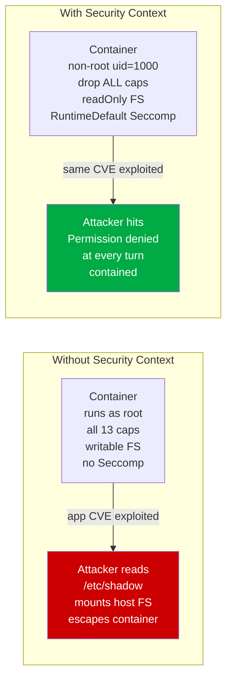
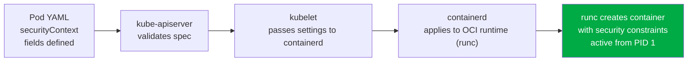
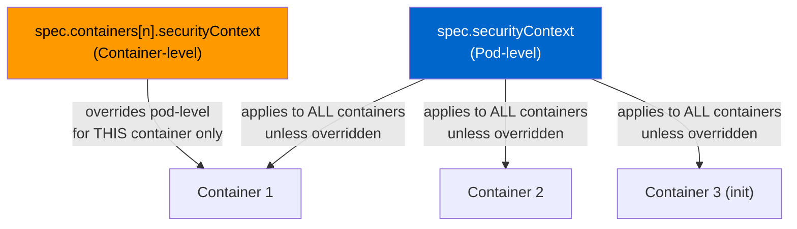
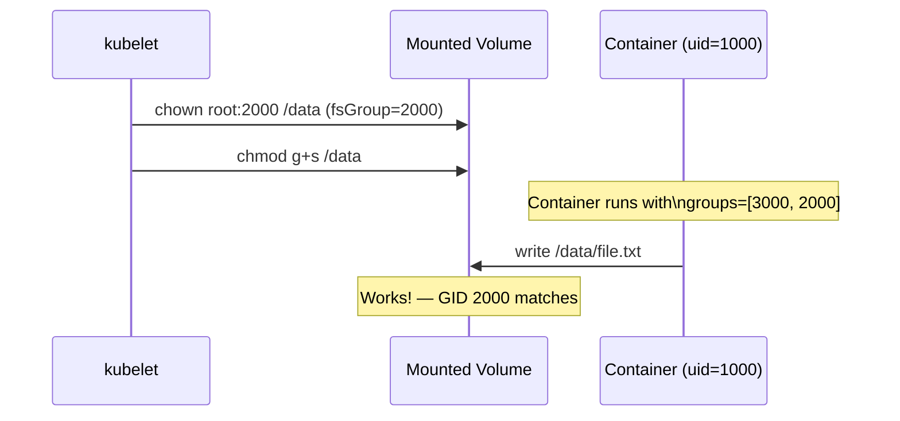
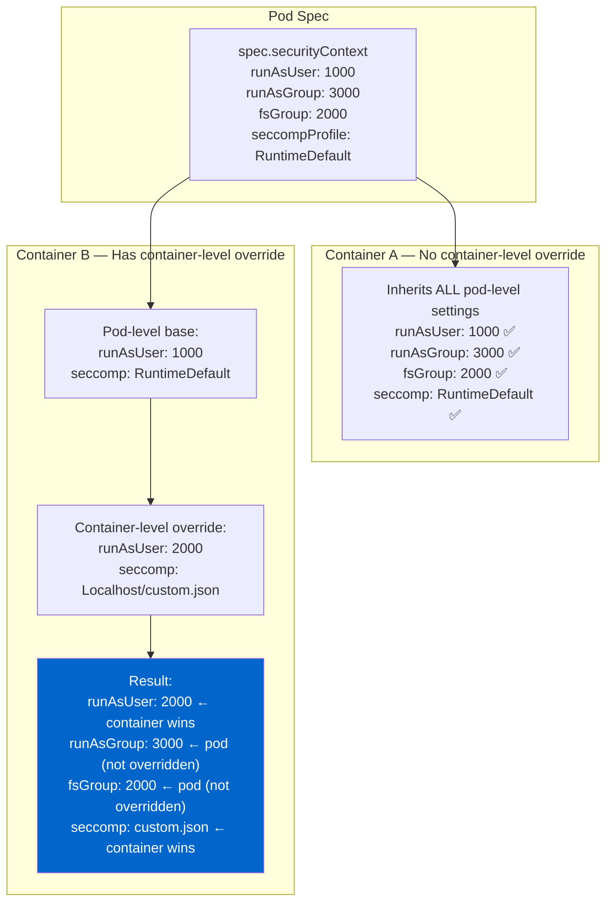
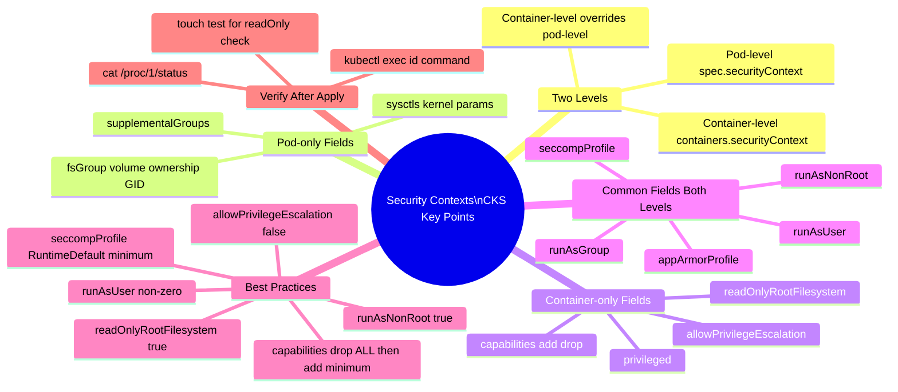

# 1 — Security Contexts

> **Domain:** Microservice Vulnerabilities | **CKS Exam Weight:** High  
> **Prerequisites:** System Hardening module (especially Ch. 12-13 Seccomp, Ch. 14-16 AppArmor, Ch. 17 Capabilities)  
> **Leads Into:** Ch. 2 (Admission Controllers), Ch. 3 (Validating & Mutating Admission Controllers)

---

## Why This Matters

When a container starts in Kubernetes, the question isn't just *what image does it run* — it's *what can that container do once it's running?* By default, containers run with too much privilege: as root, with 13 Linux capabilities, no syscall filtering, and a writable filesystem. Any vulnerability in your application code can be immediately exploited by an attacker who already has a foothold inside the container.

**Security Contexts** are Kubernetes's built-in mechanism for encoding your security requirements directly into the pod specification. They control:

- **Who** the container runs as (user ID, group ID, root or non-root)
- **What it can do** (Linux capabilities, privilege escalation)
- **What it can access** (read-only filesystem, volume permissions)
- **How the kernel filters it** (Seccomp profiles, AppArmor profiles)

Without security contexts, every pod in your cluster is a potential stepping stone for an attacker who compromises any workload. With them, a compromised container is contained — it can't escalate, it can't write persistence malware, and it can't reach sensitive system resources.



---

## What Is a Security Context?

A **Security Context** is a set of privilege and access control settings defined in a pod or container spec that the Kubernetes runtime passes to the container runtime (containerd/CRI-O) at pod creation time. These settings are applied **before the container's main process starts** — they define the security envelope the process operates in.



### Security Context at a Glance

| Field | Controls | Level |
|-------|---------|-------|
| `runAsUser` | Which UID the container process runs as | Pod or Container |
| `runAsGroup` | Which primary GID the container process runs as | Pod or Container |
| `runAsNonRoot` | Enforce that UID is never 0 (root) | Pod or Container |
| `fsGroup` | GID applied to mounted volumes for shared group access | Pod only |
| `fsGroupChangePolicy` | When to apply fsGroup ownership changes to volumes | Pod only |
| `supplementalGroups` | Additional GIDs for the container process | Pod only |
| `capabilities.add` | Add Linux capability tokens | Container only |
| `capabilities.drop` | Remove Linux capability tokens | Container only |
| `allowPrivilegeEscalation` | Whether a process can gain more privileges than its parent | Container only |
| `privileged` | Grant full host privileges (all caps + host namespaces) | Container only |
| `readOnlyRootFilesystem` | Make the container's root filesystem immutable | Container only |
| `seccompProfile` | Syscall filter profile to apply | Pod or Container |
| `appArmorProfile` | AppArmor profile to apply (K8s 1.30+) | Pod or Container |
| `seLinuxOptions` | SELinux label to apply | Pod or Container |
| `procMount` | Type of `/proc` mount (Default or Unmasked) | Container only |
| `sysctls` | Kernel parameter overrides for the pod | Pod only |

---

## Pod-Level vs Container-Level Security Context

This is one of the most important distinctions in the CKS exam. Security contexts can be set at **two places** in the pod spec, with different fields available at each level and a clear precedence rule.



### The Precedence Rule

```
Container-level securityContext > Pod-level securityContext
```

If a field is set at both levels, the **container-level value always wins** for that container.

### What's Available at Each Level

```yaml
spec:
  securityContext:             # ← POD LEVEL
    runAsUser: 1000            # ✅ Available
    runAsGroup: 3000           # ✅ Available
    runAsNonRoot: true         # ✅ Available
    fsGroup: 2000              # ✅ Pod-only — volume group ownership
    supplementalGroups: [4000] # ✅ Pod-only
    sysctls:                   # ✅ Pod-only
    - name: net.ipv4.tcp_syncookies
      value: "1"
    seccompProfile:            # ✅ Available
      type: RuntimeDefault
    appArmorProfile:           # ✅ Available (K8s 1.30+)
      type: RuntimeDefault
    # capabilities: ❌ NOT available at pod level

  containers:
  - name: app
    securityContext:           # ← CONTAINER LEVEL
      runAsUser: 2000          # ✅ Overrides pod-level
      runAsNonRoot: true       # ✅ Available
      allowPrivilegeEscalation: false  # ✅ Container-only
      privileged: false        # ✅ Container-only
      readOnlyRootFilesystem: true     # ✅ Container-only
      capabilities:            # ✅ Container-only
        drop: [ALL]
        add: [NET_BIND_SERVICE]
      seccompProfile:          # ✅ Overrides pod-level
        type: Localhost
        localhostProfile: profiles/custom.json
      appArmorProfile:         # ✅ Overrides pod-level
        type: Localhost
        localhostProfile: my-profile
```

---

## From Docker to Kubernetes Security Contexts

In Docker, security settings are passed as command-line flags. In Kubernetes, the same settings live inside the pod spec:

| Docker Flag | Kubernetes `securityContext` | Effect |
|------------|------------------------------|--------|
| `--user=1001` | `runAsUser: 1001` | Run as UID 1001 |
| `--group-add 3000` | `runAsGroup: 3000` | Primary GID 3000 |
| `--cap-add MAC_ADMIN` | `capabilities.add: [MAC_ADMIN]` | Add Linux capability |
| `--cap-drop ALL` | `capabilities.drop: [ALL]` | Drop all capabilities |
| `--read-only` | `readOnlyRootFilesystem: true` | Immutable container FS |
| `--privileged` | `privileged: true` | Full host privileges (avoid!) |
| `--security-opt seccomp=...` | `seccompProfile` | Syscall filter |
| `--security-opt apparmor=...` | `appArmorProfile` | AppArmor profile |

---

## Key Fields Deep Dive

### `runAsUser` and `runAsGroup`

Specifies the UID and primary GID for the container's main process. This directly maps to what `id` shows inside the container.

```yaml
spec:
  securityContext:
    runAsUser: 1000       # Container process runs as UID 1000
    runAsGroup: 3000      # Primary group is GID 3000
    fsGroup: 2000         # Mounted volumes are owned by GID 2000
```

```bash
# Verify inside the container
kubectl exec -it web-pod -- id
# uid=1000 gid=3000 groups=3000,2000
#    ↑          ↑             ↑
# runAsUser  runAsGroup    fsGroup
```

**Why `fsGroup` matters:** Without `fsGroup`, a volume mounted into a pod is owned by root. If the container runs as UID 1000, it can't write to the volume. `fsGroup` tells Kubernetes to `chown` the volume to that GID so the container process (which has that supplemental GID) can read and write it.



---

### `runAsNonRoot`

A safety net that prevents any container from running as root (UID 0), even if the image's `USER` directive is set to root:

```yaml
spec:
  securityContext:
    runAsNonRoot: true
```

```bash
# If the image runs as root, the pod fails with:
kubectl get pod web-pod
# Error: container has runAsNonRoot and image will run as root
# (pod: "web-pod", container: ubuntu)
```

**How it differs from `runAsUser`:**

| | `runAsNonRoot: true` | `runAsUser: 1000` |
|--|---------------------|-------------------|
| Action | Rejects the pod if UID would be 0 | Forces UID to 1000 |
| Flexibility | User can be any non-zero UID | User is pinned to exactly 1000 |
| Best practice | Use together — `runAsNonRoot: true` AND `runAsUser: 1000` |

---

### `allowPrivilegeEscalation`

Controls whether a process can gain **more privileges than its parent** — specifically via `setuid` binaries or `sudo`:

```yaml
containers:
- name: app
  securityContext:
    allowPrivilegeEscalation: false   # ← Prevents sudo, setuid escalation
```

**What it blocks:**

```bash
# Inside container with allowPrivilegeEscalation: false
sudo su                    # ← Blocked
chmod u+s /tmp/mybin       # ← setuid bit has no effect
/usr/bin/passwd            # ← Cannot change own password
```

**Default behaviour:** If not set, the default is `true` when the container runs as root (UID 0), and follows the container runtime's default otherwise. **Always set it to `false` explicitly.**

---

### `privileged`

The nuclear option — grants the container **all Linux capabilities plus access to host devices and namespaces**. Essentially runs the container as root on the host:

```yaml
containers:
- name: app
  securityContext:
    privileged: true   # ⛔ NEVER in production workloads
```

```bash
# Inside a privileged container:
mount /dev/sda1 /mnt    # ← Works — host disk accessible
nsenter -t 1 -m -u -i -n -p -- bash  # ← Escape to host namespace
```

**Legitimate uses:** Node-level DaemonSets (e.g., Fluentd reading host logs, node monitoring agents). Never for application workloads.

---

### `readOnlyRootFilesystem`

Mounts the container's root filesystem as read-only, preventing an attacker from writing malware, creating persistence mechanisms, or modifying binaries:

```yaml
containers:
- name: app
  securityContext:
    readOnlyRootFilesystem: true
```

```bash
# Inside container with readOnlyRootFilesystem: true
echo "malware" > /usr/local/bin/evil   # ← Read-only file system
touch /tmp/test                         # ← Read-only file system (even /tmp!)
```

**Important:** If your application needs to write files (logs, temp files, sockets), use `emptyDir` volumes mounted at the specific writable paths:

```yaml
containers:
- name: app
  securityContext:
    readOnlyRootFilesystem: true
  volumeMounts:
  - name: tmp-volume
    mountPath: /tmp          # ← Writable via emptyDir
  - name: log-volume
    mountPath: /var/log/app  # ← Writable via emptyDir
volumes:
- name: tmp-volume
  emptyDir: {}
- name: log-volume
  emptyDir: {}
```

---

### `capabilities`

Linux capability tokens — covered in depth in System Hardening Ch. 17. In security contexts:

```yaml
containers:
- name: app
  securityContext:
    capabilities:
      drop:
      - ALL                    # Drop all 13 Docker defaults first
      add:
      - NET_BIND_SERVICE       # Re-add only what's needed (bind port 80)
```

**Naming:** No `CAP_` prefix, UPPERCASE. `SYS_TIME` not `CAP_SYS_TIME`.

**Common legitimate `add` needs:**

| Capability to Add | Why an app might need it |
|-------------------|-------------------------|
| `NET_BIND_SERVICE` | Bind to ports < 1024 (HTTP/HTTPS) |
| `SYS_TIME` | NTP sync, adjust system clock |
| `SYS_NICE` | Adjust process scheduling priority |
| `AUDIT_WRITE` | Write to kernel audit log (auth services) |
| `DAC_OVERRIDE` | Bypass file permission checks (legacy apps) |

---

### `seccompProfile`

Syscall filtering — covered in depth in System Hardening Ch. 12-13:

```yaml
# Pod-level (applies to all containers)
spec:
  securityContext:
    seccompProfile:
      type: RuntimeDefault        # Use container runtime's built-in profile
      # type: Localhost           # Use custom profile
      # localhostProfile: profiles/custom.json  # Relative to /var/lib/kubelet/seccomp/
      # type: Unconfined          # No filtering — avoid
```

---

### `sysctls` — Kernel Parameter Tuning

Some applications need specific kernel parameters. `sysctls` allows safe namespace-scoped kernel tuning:

```yaml
spec:
  securityContext:
    sysctls:
    - name: net.ipv4.tcp_syncookies   # Safe — namespaced
      value: "1"
    - name: net.core.somaxconn        # Safe — namespaced
      value: "1024"
    # - name: kernel.dmesg_restrict   # ← Unsafe — not namespaced, requires allowedUnsafeSysctls
    #   value: "1"
```

**Safe (namespaced) sysctls** are isolated per pod. **Unsafe sysctls** affect the entire node and require explicit opt-in from the cluster administrator via `kubelet --allowed-unsafe-sysctls`.

---

## The Complete Hardened Pod Template

Combining all security context fields for a fully hardened application pod:

```yaml
apiVersion: v1
kind: Pod
metadata:
  name: web-pod
  namespace: production
spec:
  securityContext:
    runAsNonRoot: true               # ← Never allow root
    runAsUser: 1000                  # ← Specific non-root UID
    runAsGroup: 3000                 # ← Specific GID
    fsGroup: 2000                    # ← Volume ownership GID
    seccompProfile:
      type: RuntimeDefault           # ← Block dangerous syscalls
  containers:
  - name: ubuntu
    image: ubuntu
    command: ["sleep", "3600"]
    securityContext:
      runAsUser: 1000                # ← Can override pod-level per-container
      allowPrivilegeEscalation: false  # ← No sudo/setuid escalation
      readOnlyRootFilesystem: true   # ← Immutable container FS
      capabilities:
        drop:
        - ALL                        # ← Drop all 13 Docker defaults
        add:
        - MAC_ADMIN                  # ← Add only what this container needs
    volumeMounts:
    - name: tmp
      mountPath: /tmp                # ← Writable temp dir via emptyDir
  volumes:
  - name: tmp
    emptyDir: {}
```

This is the pattern the CKS exam expects — and the pattern that makes a container genuinely difficult to exploit.

---

## Verifying Security Context Settings

After deploying a pod, always verify the security settings are actually applied:

```bash
# Check the effective UID/GID inside the container
kubectl exec -it web-pod -- id
# uid=1000 gid=3000 groups=3000,2000

# Check if filesystem is read-only
kubectl exec -it web-pod -- touch /test-write
# touch: cannot touch '/test-write': Read-only file system ✅

# Check capability bounding set
kubectl exec -it web-pod -- cat /proc/1/status | grep Cap
# CapBnd: 0000000000000000   ← All zeros = no capabilities (after drop ALL)

# Decode capabilities with capsh
kubectl exec -it web-pod -- capsh --decode=0000000000000000
# 0x0000000000000000=

# Check if privilege escalation is blocked
kubectl exec -it web-pod -- cat /proc/1/status | grep NoNewPrivs
# NoNewPrivs: 1   ← 1 = allowPrivilegeEscalation is false

# Check Seccomp mode
kubectl exec -it web-pod -- cat /proc/1/status | grep Seccomp
# Seccomp: 2   ← Mode 2 = filter active
```

---

## Security Context Inheritance Diagram

Understanding exactly which container gets which settings when both pod-level and container-level are defined:



---

## Real-World Scenarios

### Scenario 1 — Enforcing Non-Root Across an Entire Namespace

**Situation:** A security audit finds 40% of pods in the `payments` namespace are running as root. You need to enforce non-root without manually editing every deployment.

**Solution 1 — PodSecurityAdmission (K8s 1.25+):**

```yaml
apiVersion: v1
kind: Namespace
metadata:
  name: payments
  labels:
    pod-security.kubernetes.io/enforce: restricted   # ← Enforces non-root + more
    pod-security.kubernetes.io/enforce-version: latest
```

Any new pod that doesn't set `runAsNonRoot: true` or tries to run as root is **rejected at admission**. Existing pods continue until redeployment.

**Solution 2 — Patch deployments directly:**

```bash
# Add security context to all deployments in the namespace
for deploy in $(kubectl get deploy -n payments -o name); do
  kubectl patch $deploy -n payments --type='json' -p='[
    {"op":"add","path":"/spec/template/spec/securityContext","value":{
      "runAsNonRoot":true,
      "runAsUser":1000,
      "fsGroup":2000,
      "seccompProfile":{"type":"RuntimeDefault"}
    }},
    {"op":"add","path":"/spec/template/spec/containers/0/securityContext","value":{
      "allowPrivilegeEscalation":false,
      "readOnlyRootFilesystem":true,
      "capabilities":{"drop":["ALL"]}
    }}
  ]'
done

kubectl rollout status deploy -n payments
```

---

### Scenario 2 — Container That Needs to Write Logs with a Read-Only Filesystem

**Situation:** A Go API service needs `readOnlyRootFilesystem: true` for security, but it writes logs to `/var/log/app/` and uses `/tmp` for request processing.

**Wrong approach:** Remove `readOnlyRootFilesystem` to let the app write. ❌

**Correct approach:** Keep read-only FS, use `emptyDir` volumes for writable paths:

```yaml
apiVersion: apps/v1
kind: Deployment
metadata:
  name: go-api
spec:
  template:
    spec:
      securityContext:
        runAsNonRoot: true
        runAsUser: 1000
        fsGroup: 2000
        seccompProfile:
          type: RuntimeDefault
      containers:
      - name: go-api
        image: mycompany/go-api:v2
        securityContext:
          allowPrivilegeEscalation: false
          readOnlyRootFilesystem: true      # ← Keep this!
          capabilities:
            drop: [ALL]
        volumeMounts:
        - name: tmp-dir
          mountPath: /tmp                   # ← App writes temp files here
        - name: log-dir
          mountPath: /var/log/app           # ← App writes logs here
        - name: cache-dir
          mountPath: /home/appuser/.cache   # ← Go toolchain cache
      volumes:
      - name: tmp-dir
        emptyDir: {}
      - name: log-dir
        emptyDir: {}
      - name: cache-dir
        emptyDir: {}
```

**Result:** The container filesystem is immutable (no persistence for malware), but the app works normally because its specific write paths are served by ephemeral `emptyDir` volumes.

---

### Scenario 3 — Diagnosing a "Permission Denied" After Adding Security Context

**Situation:** After adding `runAsUser: 1000` to a pod, it starts crashing. The init logs show `permission denied` when trying to read the application config mounted from a ConfigMap.

**Diagnosis:**

```bash
kubectl describe pod broken-pod
# Events:
#   Warning BackOff ... Back-off restarting failed container

kubectl logs broken-pod
# Error: open /etc/myapp/config.yaml: permission denied

# Check the ConfigMap mount permissions
kubectl exec -it broken-pod -- ls -la /etc/myapp/
# -rw-r--r-- 1 root root 512 Jan 15 config.yaml
#            ↑ owned by root, readable by all (r--) ← should work...

# Check the actual UID the process is running as
kubectl exec -it broken-pod -- id
# uid=1000 gid=0 groups=0
# ← runAsUser 1000 set, but runAsGroup NOT set → gid=0 (root group)
# Actually uid=1000 with r-- should work — let's check deeper

# Check if it's a directory permission issue
kubectl exec -it broken-pod -- ls -la /etc/
# drwxr-x--- 3 root 2000 /etc/myapp/
#            ↑ directory is only accessible by GID 2000!
# But container's GID is 0 (not 2000)
```

**Fix:** Add `fsGroup: 2000` or `runAsGroup: 2000` to match the directory's GID:

```yaml
spec:
  securityContext:
    runAsUser: 1000
    runAsGroup: 2000      # ← Match directory GID
    fsGroup: 2000         # ← Also ensures volume ownership
```

---

## Common Mistakes and Pitfalls

| Mistake | Consequence | Fix |
|---------|------------|-----|
| Setting `capabilities` at pod level | YAML validation error — not allowed | Move `capabilities` to `containers[].securityContext` |
| `runAsNonRoot: true` without `runAsUser` | Pod fails if image has `USER root` | Set both: `runAsNonRoot: true` AND `runAsUser: <non-zero>` |
| `readOnlyRootFilesystem: true` without `emptyDir` volumes | App crashes — can't write temp files | Mount `emptyDir` volumes at every path the app writes to |
| Using `privileged: true` for capabilities | Grants ALL capabilities + host access | Grant only the specific capabilities needed |
| Not setting `allowPrivilegeEscalation: false` | App can use setuid to gain caps back | Always set explicitly to `false` |
| Assuming pod-level sets capabilities | Pod-level doesn't support `capabilities` | Only container-level `securityContext` has `capabilities` |
| `fsGroup` on pods with no mounted volumes | Harmless but confusing — `fsGroup` is ignored | Only set when volumes are mounted |

---

## CKS Exam Quick Reference

```yaml
# ── POD-LEVEL securityContext ────────────────────────────────────────
spec:
  securityContext:
    runAsUser: 1000
    runAsGroup: 3000
    runAsNonRoot: true
    fsGroup: 2000
    seccompProfile:
      type: RuntimeDefault          # or Localhost / Unconfined

# ── CONTAINER-LEVEL securityContext ─────────────────────────────────
  containers:
  - name: app
    securityContext:
      runAsUser: 1000               # Overrides pod-level if set
      allowPrivilegeEscalation: false  # ← Always set this
      readOnlyRootFilesystem: true     # ← Always set this
      privileged: false                # ← Never true in production
      capabilities:
        drop: [ALL]                    # ← Always drop ALL first
        add: [NET_BIND_SERVICE]        # ← Add only what's needed

# ── VERIFICATION COMMANDS ───────────────────────────────────────────
kubectl exec -it <pod> -- id                           # UID/GID/groups
kubectl exec -it <pod> -- cat /proc/1/status | grep -E "Cap|Seccomp|NoNew"
kubectl exec -it <pod> -- touch /test                  # Test readOnly FS
```

---

## CKS Exam Tips



**Critical exam facts:**
- `capabilities` is **container-level only** — setting it at pod level is a YAML error
- Container-level **overrides** pod-level (doesn't merge — it replaces for that field)
- `runAsNonRoot: true` rejects the pod if image user is root — combine with explicit `runAsUser`
- `fsGroup` only affects **mounted volumes**, not the container filesystem
- `allowPrivilegeEscalation: false` sets the `no_new_privs` flag — blocks setuid/sudo escalation
- `privileged: true` should **never** appear in a production workload spec

---

## Chapter Summary

| Field | Location | Key Takeaway |
|-------|----------|-------------|
| `runAsUser` | Pod or Container | Forces process to run as this UID |
| `runAsGroup` | Pod or Container | Forces primary GID |
| `runAsNonRoot` | Pod or Container | Rejects pod if UID would be 0 |
| `fsGroup` | Pod only | Mounted volumes owned by this GID |
| `capabilities.drop/add` | Container only | Drop ALL, add only what's needed |
| `allowPrivilegeEscalation` | Container only | Always `false` — blocks sudo/setuid |
| `readOnlyRootFilesystem` | Container only | Immutable FS — use emptyDir for writes |
| `privileged` | Container only | Never `true` in production |
| `seccompProfile` | Pod or Container | Syscall filter — use `RuntimeDefault` minimum |

---

## What's Next

- **Chapter 2 — Admission Controllers:** Security contexts define *what* security settings apply. Admission controllers are the gatekeepers that *enforce* those settings are present and correct before pods are ever created in the cluster.
- **Chapter 3 — Validating and Mutating Admission Controllers:** How to automatically reject pods without security contexts or inject default security settings into every pod automatically.

---

*Sources: Kubernetes Security Context Documentation, KodeKloud CKS Course, OCI Runtime Spec, Linux Capabilities man page*
