# 10 — Container Sandboxing

---

## Why This Matters

Every security control covered so far — Security Contexts, PSA, OPA Gatekeeper, Seccomp, AppArmor, Capabilities — operates at the **Kubernetes/OS API layer**. They restrict what a containerized process is *allowed to request*. But they share a fundamental assumption: the host Linux kernel is trustworthy, and containers are prevented from abusing it.

That assumption breaks under kernel exploits.

A single unpatched kernel vulnerability — like Dirty COW (CVE-2016-5195), runc escape (CVE-2019-5736), or a future zero-day — can allow a container process to break out of all namespace, cgroup, seccomp, and AppArmor restrictions simultaneously, because those controls are *implemented by the same kernel the attacker just compromised*.

**Container sandboxing** addresses this by asking: *what if we reduce or eliminate the shared kernel surface itself?* Instead of just restricting what system calls a container can make to the host kernel, sandbox technologies interpose an additional isolation layer between the container and the host kernel — either a **user-space kernel** (gVisor) or a **lightweight VM** (Kata Containers, Firecracker).

For CKS, container sandboxing is the conceptual bridge between kernel-level hardening (Seccomp, AppArmor — System Hardening module) and the advanced runtime isolation technologies (gVisor, Kata — Chapters 11 and 12). This chapter lays the architectural foundation.

---

## What Is Container Sandboxing?

Container sandboxing is a collection of techniques that **reduce the attack surface between a containerized process and the host kernel**, ranging from syscall filtering to full kernel-level interposition.

| Technique | Layer | Mechanism | Strength |
|---|---|---|---|
| **Namespaces** | Kernel | Logical isolation of resources (PID, net, mnt, user) | Low-Medium |
| **cgroups** | Kernel | Resource limits (CPU, memory, I/O) | Low (resource only) |
| **Capability drops** | Kernel | Remove specific Linux capabilities | Medium |
| **Seccomp** | Kernel | Syscall allowlist/denylist filter | Medium-High |
| **AppArmor / SELinux** | Kernel LSM | Path and capability MAC enforcement | Medium-High |
| **gVisor** | User-space | User-space kernel intercepts all syscalls | High |
| **Kata Containers** | Hypervisor | Each container in its own lightweight VM | Very High |
| **Firecracker** | Hypervisor | Minimal microVM for serverless workloads | Very High |

The key insight: these techniques form a **defence-in-depth stack**. They are not alternatives — they complement each other.

---

## The Shared Kernel Problem

### Virtual Machines vs Containers

The fundamental architectural difference that defines the container security model:

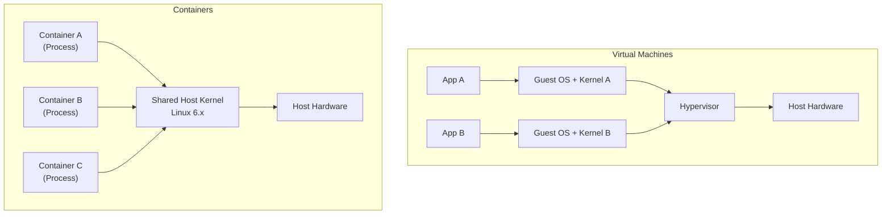

| Isolation Aspect | Virtual Machines | Containers |
|---|---|---|
| Kernel per workload | Yes — dedicated guest kernel | No — shared host kernel |
| Isolation mechanism | Hypervisor hardware virtualisation | Namespaces, cgroups, LSMs |
| Typical use case | Strong multi-tenant isolation | Lightweight microservices, higher density |
| Kernel compromise blast radius | Contained to guest VM | Affects host and ALL containers |
| Startup time | Seconds to minutes | Milliseconds |
| Density | Low (full OS per VM) | High (shared kernel) |
| Escape risk if kernel is exploited | Low — attacker still in guest kernel | **High — host is directly reachable** |

### Why the Shared Kernel Is a Security Boundary Problem

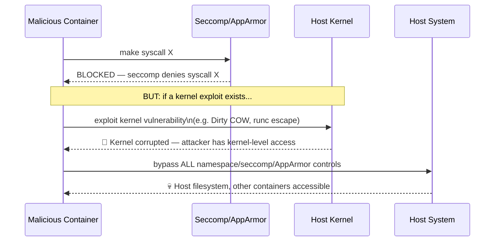

Seccomp and AppArmor *prevent the container from asking the kernel to do dangerous things* — but they cannot protect against vulnerabilities in the kernel's own code that an attacker exploits directly.

---

## PID Namespaces — Isolation Illustrated

PID namespaces are the clearest illustration of how container isolation works and where its limits are:

### Inside the Container

```bash
# Run a container that sleeps
docker run -d --name sleeping-container busybox sleep 1000
# e2fd5090c9a51eb7cc91a466cf2e18c5468871f84adbb55c2e6c1cf4ea0028a8

# Inside the container: sleep appears as PID 1
docker exec -ti sleeping-container ps -ef
# PID   USER     TIME  COMMAND
# 1     root     0:00  sleep 1000    ← PID 1 inside the container namespace
# 11    root     0:00  ps -ef
```

### On the Host

```bash
# On the HOST: the same sleep process has a completely different PID
ps -ef | grep sleep | grep -v grep
# root     7902  7871  0 21:39 ?  00:00:00 sleep 1000
#           ↑
#     Host PID 7902 — visible and killable from the host

# Killing host PID 7902 terminates the container's PID 1
kill 7902
# Container stops immediately
```

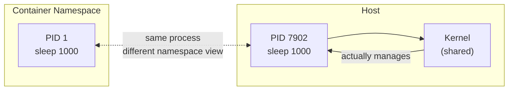

**The lesson:** The container sees PID 1 (isolated view). The host sees PID 7902 (real). The kernel manages the real PID 7902. If the kernel is compromised, the attacker can see and control all processes on the host regardless of their container namespace.

---

## The Container-to-Kernel Attack Surface

Every system call a container makes goes directly to the host kernel. The kernel must handle it correctly for isolation to hold:

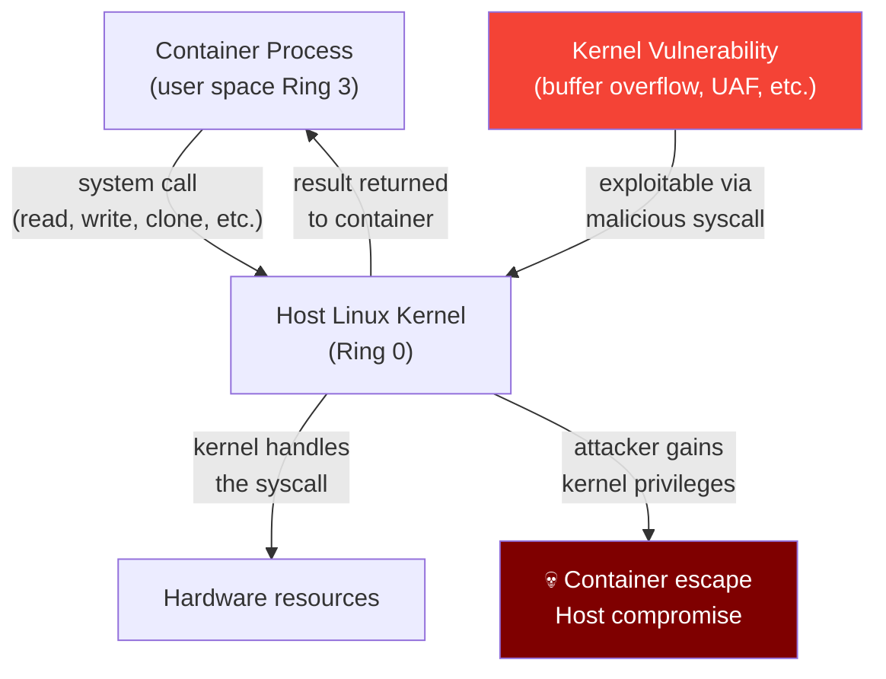

The kernel exposes **~300-400 system calls** on Linux. Each one is a potential attack vector. Sandboxing reduces this surface.

---

## Layer 1: Kernel-Level Sandboxing Controls

### Namespaces — Logical Isolation

Linux namespaces partition kernel resources so containers see isolated views:

| Namespace | Isolates | Risk if shared |
|---|---|---|
| `pid` | Process IDs | Container processes can see/signal host processes |
| `net` | Network interfaces, routing | Container can sniff host network traffic |
| `mnt` | Filesystem mount points | Container can access host filesystem |
| `uts` | Hostname, domain name | Container can change host hostname |
| `ipc` | System V IPC, POSIX message queues | Container can access host IPC channels |
| `user` | User and group IDs | UID 0 in container = UID 0 on host |
| `cgroup` | cgroup hierarchy view | Container sees host cgroup structure |

Docker and Kubernetes enable most namespaces by default. Key risks:
- `hostPID: true` — container can see all host processes (System Hardening Ch.17 → Capabilities)
- `hostNetwork: true` — container shares host network stack
- `hostIPC: true` — container can communicate via host IPC

### Capabilities — Drop Unnecessary Power

Linux capabilities subdivide root's privileges into ~41 tokens. Dropping capabilities removes specific dangerous abilities without requiring the process to run as non-root:

```bash
# What capabilities a container has by default (Docker)
docker run --rm ubuntu capsh --print | grep "Current:"
# Current: cap_chown,cap_dac_override,cap_fowner,cap_fsetid,
#          cap_kill,cap_setgid,cap_setuid,cap_setpcap,
#          cap_net_bind_service,cap_net_raw,cap_sys_chroot,
#          cap_mknod,cap_audit_write,cap_setfcap=ep

# Fully hardened — drop all capabilities
docker run --rm --cap-drop=ALL ubuntu capsh --print | grep "Current:"
# Current: =    ← No capabilities at all
```

```yaml
# Kubernetes — drop all, add only what's needed
securityContext:
  capabilities:
    drop: ["ALL"]
    add: ["NET_BIND_SERVICE"]   # Only if the service binds to port <1024
```

### Seccomp — Syscall Filter

Seccomp (Secure Computing Mode) filters which system calls a process may invoke:

```json
{
  "defaultAction": "SCMP_ACT_ERRNO",
  "architectures": ["SCMP_ARCH_X86_64", "SCMP_ARCH_X86", "SCMP_ARCH_X32"],
  "syscalls": [
    {
      "names": ["read", "write", "open", "close", "stat", "fstat",
                "lstat", "poll", "lseek", "mmap", "mprotect", "munmap",
                "brk", "rt_sigaction", "rt_sigprocmask", "rt_sigreturn",
                "ioctl", "access", "execve", "exit", "getcwd",
                "clone", "fork", "wait4", "getpid", "getuid", "geteuid"],
      "action": "SCMP_ACT_ALLOW"
    }
  ]
}
```

**Whitelist (deny-by-default):** Most secure — only explicitly listed syscalls work. Requires profiling the application to discover its syscall needs.

**Blacklist (allow-by-default):** Less strict — only explicitly listed syscalls are blocked. Easier to implement but may miss dangerous syscalls.

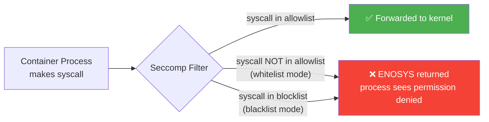

### AppArmor — Path-Based MAC

AppArmor enforces Mandatory Access Control at the kernel LSM layer, restricting file paths, network access, and capabilities:

```
# Whitelist-style: allow only what's needed
profile myapp flags=(attach_disconnected) {
  #include <abstractions/base>
  /usr/bin/myapp ixr,          # execute the binary
  /etc/myapp/** r,             # read config
  /var/log/myapp/** w,         # write logs
  deny /proc/** w,             # deny writes to /proc
  deny /sys/** w,              # deny writes to /sys
  deny /etc/shadow r,          # deny reading shadow passwords
}
```

```
# Blacklist-style snippet: deny writes to /proc
profile apparmor-deny-write flags=(attach_disconnected) {
  #include <abstractions/base>
  /usr/bin/your-binary ixr,
  /lib/** r,
  /usr/lib/** r,
  /etc/** r,
  deny /proc/** w,             # Block all writes to /proc
}
```

### Whitelist vs Blacklist Comparison

| Approach | Pattern | Strength | Trade-off | Best Used When |
|---|---|---|---|---|
| **Whitelist** (seccomp) | Default deny; allow specific syscalls | Minimal surface, strongest security | Requires app profiling; may miss syscalls | Small, well-understood services |
| **Blacklist** (AppArmor snippet) | Default allow; block specific paths/actions | Easier compatibility | May miss attack vectors | Large/complex apps; incremental hardening |

---

## Layer 2: Advanced Sandboxing — Interposing on the Kernel

When the shared kernel model is unacceptable for your threat model, these technologies replace or insulate the shared kernel:

### gVisor — User-Space Kernel

gVisor (Google) implements a **user-space kernel in Go** that sits between the container and the host kernel. Container syscalls are intercepted by gVisor's "Sentry" component and translated — most are handled in user space without ever reaching the host kernel:

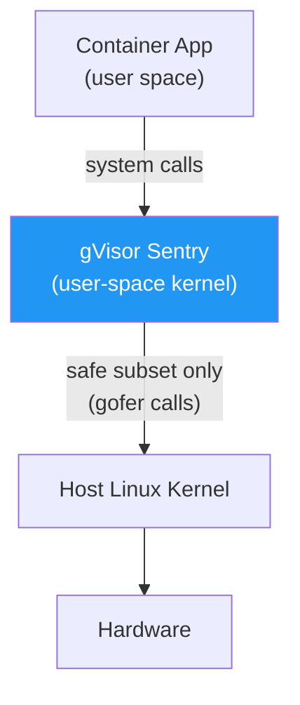

**What this protects against:** A kernel exploit in the container's syscall path hits gVisor's user-space code, not the real kernel. Breaking gVisor still requires escaping to the host kernel as a second step — a much harder bar.

**Trade-offs:** ~20-50% performance overhead; not all syscalls supported; requires `runsc` runtime class in Kubernetes.

→ Covered in detail in **Chapter 11 — gVisor**.

### Kata Containers — VM-Level Isolation

Kata Containers runs each container (or pod) inside a **lightweight virtual machine** with its own kernel. The container process sees a dedicated kernel; the host sees only a VM:

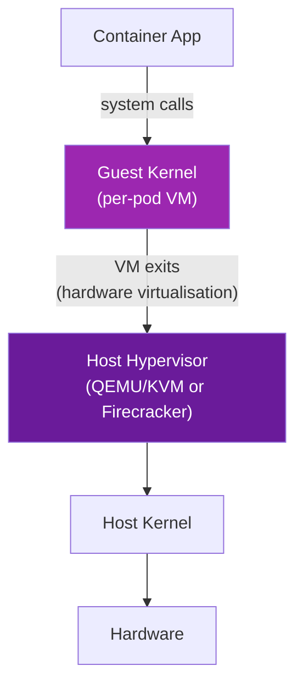

**What this protects against:** Even if the container exploits its guest kernel, the host hypervisor is a separate, hardened boundary. VM escape is dramatically harder than container escape.

**Trade-offs:** Higher resource usage (separate kernel per pod); slightly longer startup; requires hardware virtualisation support (`/dev/kvm`).

→ Covered in detail in **Chapter 12 — Kata Containers**.

### Firecracker — MicroVMs for Serverless

AWS Firecracker is a lightweight VMM optimised for fast startup and minimal overhead, used by AWS Lambda and Fargate:

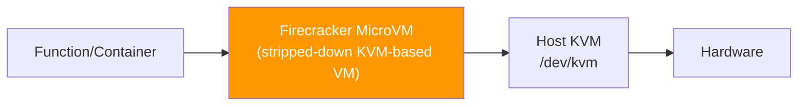

**Key properties:** <125ms startup, ~5MB memory overhead per VM, minimal device model (no USB, no BIOS, no legacy PCI). Optimised for ephemeral, untrusted workloads.

**Trade-offs:** Less compatible with complex workloads than Kata; primarily used in managed serverless platforms.

### Comparison: Advanced Sandboxing Technologies

| Technology | Isolation Mechanism | Kernel Shared? | Performance Overhead | Startup Time | K8s Integration |
|---|---|---|---|---|---|
| **Default containers** | Namespaces + cgroups | Yes (host kernel) | Minimal | ~10ms | Native |
| **gVisor** | User-space kernel (Sentry) | Partial (controlled) | ~20-50% | ~50ms | `RuntimeClass: gvisor` |
| **Kata Containers** | Lightweight VM per pod | No (guest kernel) | ~5-15% | ~100-200ms | `RuntimeClass: kata` |
| **Firecracker** | MicroVM | No (guest kernel) | ~3-5% | ~125ms | Via Kata+Firecracker |

---

## Defence-in-Depth: Layering Sandbox Controls

No single control is sufficient. The recommended production approach layers multiple mechanisms:

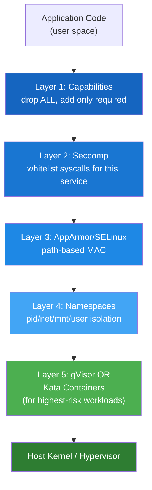

### Practical Guidance by Fleet Type

**Small, homogeneous fleet (e.g., many identical Nginx or MySQL containers):**
- Create tight, application-specific seccomp and AppArmor profiles
- Drop all capabilities; add only what the service specifically needs
- Run seccomp in `RuntimeDefault` at minimum; custom profile if workload is well-understood
- Strong ROI: effort is amortised across many identical containers

**Large, heterogeneous fleet (mixed services, many teams):**
- Start with namespaces + cgroups + capability drops (zero effort — default behaviour)
- Apply `RuntimeDefault` seccomp across all namespaces via PSA or OPA Gatekeeper
- Add AppArmor profiles for high-value services
- Use gVisor or Kata for specific high-risk workloads (payment processing, user-submitted code execution, third-party integrations)
- Automate profile generation with Tracee or `amicontained`

**High-security / multi-tenant workloads (e.g., executing user code, CI/CD sandboxes):**
- Kata Containers or gVisor mandatory — shared kernel model is not acceptable
- Combine with network policies and service meshes (mTLS)
- Consider Firecracker for ephemeral execution environments

---

## Sandboxing Controls in Kubernetes — Quick Mapping

| Sandboxing Layer | Kubernetes Mechanism | Where Configured |
|---|---|---|
| Namespace isolation | Default (always on) | Pod spec `hostPID`, `hostNetwork`, `hostIPC` |
| Capability drops | `securityContext.capabilities` | Container-level securityContext |
| Seccomp | `securityContext.seccompProfile` | Pod or container-level; profile in `/var/lib/kubelet/seccomp/` |
| AppArmor | Annotation (legacy) or `securityContext.appArmorProfile` | Container-level; profile must be loaded on node |
| gVisor | `RuntimeClass: gvisor` | Pod-level `runtimeClassName` field |
| Kata Containers | `RuntimeClass: kata` | Pod-level `runtimeClassName` field |
| PSA enforcement | Namespace labels | Namespace labels (prevents disabling controls) |

---

## Real-World Scenarios

### Scenario 1 — Hardening a Payment Service

**Context:** A PCI-DSS-regulated payment processing service running in Kubernetes. Must prevent both container escape and data exfiltration.

**Layered approach:**

```yaml
apiVersion: v1
kind: Pod
metadata:
  name: payment-api
  annotations:
    # AppArmor profile (legacy format)
    container.apparmor.security.beta.kubernetes.io/payment-api: localhost/payment-strict
spec:
  runtimeClassName: kata               # Layer 5: Kata VM isolation
  securityContext:
    runAsNonRoot: true
    runAsUser: 1000
    seccompProfile:
      type: Localhost
      localhostProfile: profiles/payment-api.json   # Layer 2: Custom syscall whitelist
    fsGroup: 2000
  containers:
  - name: payment-api
    image: registry.company.com/payment-api:v3.1
    securityContext:
      allowPrivilegeEscalation: false
      readOnlyRootFilesystem: true
      capabilities:
        drop: ["ALL"]                  # Layer 1: No Linux capabilities
```

**Reasoning:** Kata provides VM-level boundary against kernel exploits (most critical for PCI data); custom seccomp whitelist reduces syscall surface; no capabilities eliminates kernel ability abuse; AppArmor blocks unexpected file access; `readOnlyRootFilesystem` prevents runtime modification.

### Scenario 2 — CI/CD Build Sandbox

**Context:** A CI/CD platform executes user-submitted build scripts. These are fundamentally untrusted workloads — the code could be malicious.

**Problem:** Traditional containers share the kernel — a malicious build script could exploit a kernel vulnerability and escape to the host, stealing secrets from other build jobs.

**Solution: gVisor**

```yaml
apiVersion: v1
kind: Pod
metadata:
  name: build-job-user123
spec:
  runtimeClassName: gvisor            # gVisor intercepts all syscalls
  securityContext:
    runAsNonRoot: true
    runAsUser: 65534                  # nobody
    seccompProfile:
      type: RuntimeDefault
  containers:
  - name: builder
    image: registry.company.com/build-sandbox:latest
    securityContext:
      allowPrivilegeEscalation: false
      readOnlyRootFilesystem: false   # builds need to write files
      capabilities:
        drop: ["ALL"]
    resources:
      limits:
        cpu: "2"
        memory: "4Gi"
```

**Reasoning:** gVisor means even if user code exploits a gVisor bug, it still needs to escape gVisor itself before reaching the host kernel — a two-step escape vs one-step for normal containers.

### Scenario 3 — Identifying the Right Sandboxing Level

**Decision tree for choosing sandboxing intensity:**

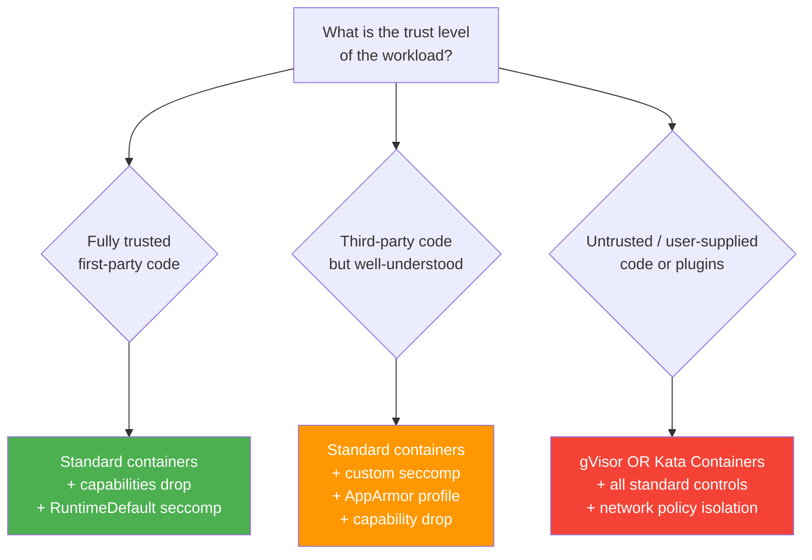

---

## Common Mistakes

| Mistake | Consequence | Fix |
|---|---|---|
| Treating namespaces as full isolation | Assuming containers can't affect each other or the host — they can via shared kernel exploits | Layer additional controls (seccomp, AppArmor, gVisor/Kata) |
| Using `privileged: true` for convenience | Full host access — all namespace/cgroup isolation bypassed | Find the specific capability needed; use `capabilities.add` instead |
| Skipping Seccomp entirely | All ~300+ syscalls exposed to container process | At minimum use `RuntimeDefault`; for high-security workloads use custom profiles |
| Blacklist-only approach without whitelist | Attackers find syscalls not on the denylist | Complement blacklist AppArmor with whitelist seccomp |
| Not monitoring for runtime violations | Policies in place but violations go undetected | Use Falco, Tracee, or audit logs to monitor AppArmor/seccomp denials |
| Using gVisor/Kata for everything | Performance overhead for workloads that don't need it | Reserve VM/user-space kernel isolation for high-risk workloads |
| Not testing profiles before enforcement | Production workloads break when profiles go from complain to enforce | Use complain mode (AppArmor) or audit mode (seccomp LOG action) first |

---

## Quick Reference

### Sandboxing Control Summary

```
KERNEL-LEVEL (layered, always combine):
  Namespaces      — logical resource isolation (default in K8s)
  cgroups         — resource limits (default in K8s)
  Capabilities    — drop ALL, add only required
  Seccomp         — whitelist syscalls (RuntimeDefault at minimum)
  AppArmor/SELinux — path-based MAC (node-level profile required)

ADVANCED (for high-risk workloads):
  gVisor          — user-space kernel; runtimeClassName: gvisor
  Kata Containers — lightweight VM per pod; runtimeClassName: kata
  Firecracker     — microVM; primarily in managed platforms
```

### Defence-in-Depth Checklist

```bash
# ✅ Drop all capabilities
securityContext.capabilities.drop: [ALL]

# ✅ Apply seccomp
securityContext.seccompProfile.type: RuntimeDefault  # minimum
# or: type: Localhost, localhostProfile: <custom>    # preferred

# ✅ Enable AppArmor
container.apparmor.security.beta.kubernetes.io/<name>: localhost/<profile>

# ✅ Prevent privilege escalation
securityContext.allowPrivilegeEscalation: false

# ✅ Run as non-root
securityContext.runAsNonRoot: true

# ✅ Read-only root filesystem (where possible)
securityContext.readOnlyRootFilesystem: true

# ✅ No host namespace sharing
spec.hostPID: false
spec.hostIPC: false
spec.hostNetwork: false

# ✅ For high-risk workloads: use gVisor or Kata
spec.runtimeClassName: gvisor  # or kata
```

---

## CKS Exam Tips

> 💡 **The shared kernel is the fundamental container security limitation.** Seccomp and AppArmor *reduce* the attack surface but cannot *eliminate* the shared-kernel risk. gVisor and Kata eliminate or dramatically reduce it. Know where each fits.

> 💡 **Whitelist = default deny (seccomp); blacklist = default allow (AppArmor deny rules).** Whitelist is stronger; blacklist is more compatible. The exam may test knowing which approach a given profile uses.

> 💡 **PID namespace example is a favourite conceptual question.** Container sees PID 1, host sees PID 7902 — same process, different namespace view. Host can kill the process; kernel manages both views.

> 💡 **Layering is the answer.** No exam question asking "what's the best sandboxing approach" has a single-control answer. The correct answer is always multiple layers: capabilities + seccomp + AppArmor + (gVisor/Kata for high-risk).

> 💡 **gVisor and Kata are covered in Chapters 11 and 12** — this chapter is the conceptual foundation. Understand *why* they exist before learning *how* to configure them.

> 💡 **`RuntimeClass`** is the Kubernetes mechanism for selecting gVisor or Kata. A pod uses a RuntimeClass by setting `spec.runtimeClassName`. Know the object and the field.

> 💡 **Capability drops are the cheapest win.** `drop: [ALL]` removes ~13 default Docker capabilities and significantly reduces the kernel attack surface with zero performance cost.

---

## Summary

Container sandboxing is the set of techniques that reduce the attack surface between containerized processes and the host kernel. The shared-kernel model that makes containers lightweight also makes them potentially risky: a kernel exploit in one container can affect the entire host and all co-located containers.

Sandboxing addresses this through a defence-in-depth stack:

- **Namespaces and cgroups** provide logical isolation (always on)
- **Capability drops** remove specific kernel-privilege tokens (zero cost)
- **Seccomp** filters which system calls reach the kernel (whitelist is strongest)
- **AppArmor/SELinux** add path-based and capability-based MAC (node profile required)
- **gVisor** interposes a user-space kernel — syscalls hit gVisor first, not the host kernel
- **Kata Containers / Firecracker** run containers in lightweight VMs — each pod gets its own kernel

The right combination depends on the threat model, performance requirements, and operational maturity. For most production workloads: drop all capabilities + RuntimeDefault seccomp + AppArmor. For high-risk workloads (user-submitted code, payment processing, multi-tenant CI): add gVisor or Kata.

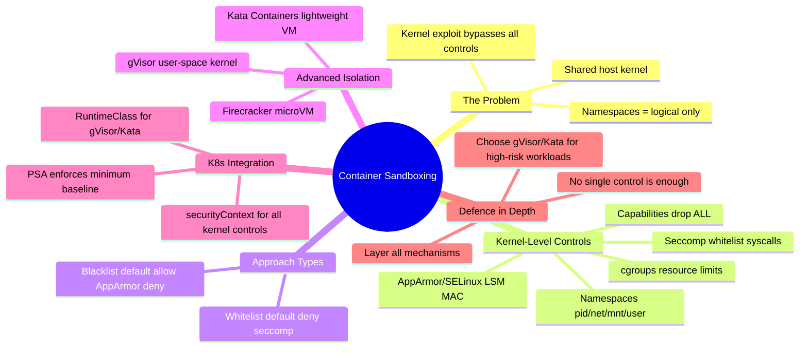

---

## What's Next

**Chapter 11 — gVisor** covers the installation, configuration, and Kubernetes integration of gVisor in depth. You will learn how the Sentry component implements a Go user-space kernel, how to install the `runsc` runtime, how to create a `RuntimeClass` object, and how to assign specific pods to run under gVisor — and what the compatibility and performance trade-offs look like in practice.

---

*Chapter 10 of 30 — Microservice Vulnerabilities | Kubernetes Security Study Guide*
