# 11 — gVisor


---

## Why This Matters

Chapter 10 established the core problem: containers share the host Linux kernel. Every system call a container makes is a direct interaction with the same kernel that runs the host OS and every other container on the node. A single kernel vulnerability exploited from within a container can compromise the entire host.

Seccomp and AppArmor reduce the syscall attack surface — they filter what a container can *ask* the kernel. But they cannot protect against bugs in the kernel's own handling of permitted syscalls. If `read()` has a buffer overflow, a seccomp whitelist that allows `read()` still allows the exploit.

**gVisor** takes a fundamentally different approach: it intercepts syscalls *before* they reach the host kernel and handles most of them in user space using a Go-written, container-specific kernel implementation called **Sentry**. The host kernel sees only a narrow, controlled set of operations — not the full syscall stream from the container.

For CKS, understanding gVisor's architecture (Sentry, Gofer, the network stack) and how to configure it in Kubernetes via `RuntimeClass` is essential. It's the first of two advanced sandboxing options (alongside Kata Containers in Chapter 12).

---

## What Is gVisor?

gVisor is an **application kernel written in Go** that provides an additional isolation boundary between containerized applications and the host Linux kernel. Developed by Google and open-sourced in 2018, it runs as a sandbox runtime (`runsc` — "run sandbox container") that integrates with container runtimes like containerd.

| Attribute | Detail |
|---|---|
| **Created by** | Google (open-sourced 2018) |
| **Language** | Go |
| **Runtime binary** | `runsc` (run sandbox container) |
| **CNCF status** | Sandbox project |
| **Website** | [gvisor.dev](https://gvisor.dev) |
| **Key component** | Sentry (user-space kernel) + Gofer (file proxy) |
| **Kubernetes integration** | `RuntimeClass` with handler `runsc` |
| **Performance overhead** | ~20–50% depending on syscall intensity |
| **Compatibility** | Most containerized apps; some syscalls not implemented |

### What gVisor Is NOT

| Misconception | Reality |
|---|---|
| "gVisor is a VM" | gVisor is a user-space process, not a hypervisor. No hardware virtualisation required. |
| "gVisor is a seccomp replacement" | gVisor provides stronger isolation, not just syscall filtering. Seccomp still applies to gVisor itself. |
| "gVisor is 100% compatible" | Some syscalls are not implemented or have limited support — test your app. |
| "gVisor eliminates the host kernel" | gVisor still calls the host kernel for some operations (via Gofer), but through a narrow interface. |
| "gVisor is free of performance cost" | There is a measurable overhead, especially for syscall-heavy or I/O-heavy workloads. |

---

## The Core Problem gVisor Solves

The Linux kernel is enormous — millions of lines of C code supporting thousands of syscalls, dozens of subsystems, decades of accumulated complexity. This complexity is both a strength (runs everything) and a security liability (larger attack surface, more potential bugs):

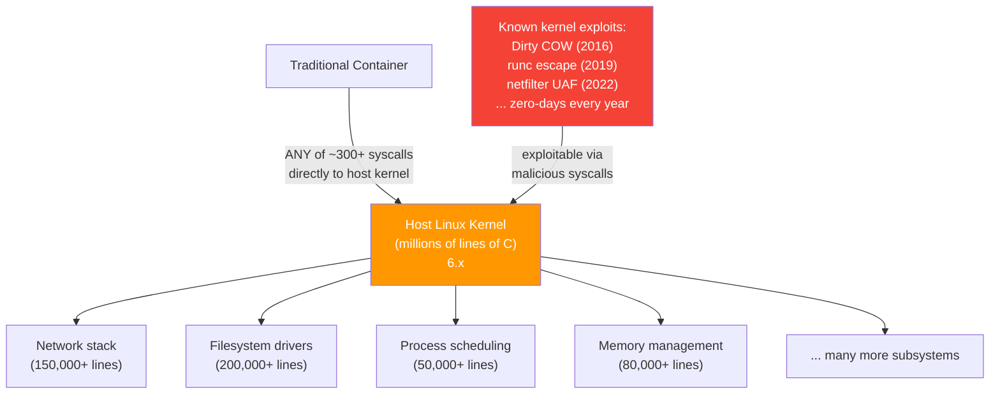

gVisor reduces this by interposing a smaller, purpose-built kernel between the container and the host:

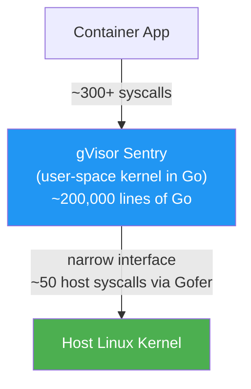

The host kernel's exposed surface drops from "whatever the container app calls" to "whatever gVisor itself needs to call" — a dramatically smaller interface.

---

## gVisor Architecture — Deep Dive

gVisor consists of two primary components that work together to provide isolated execution:

### Component 1: Sentry


**Sentry** is the heart of gVisor — a self-contained application-level kernel written entirely in Go that runs in user space:

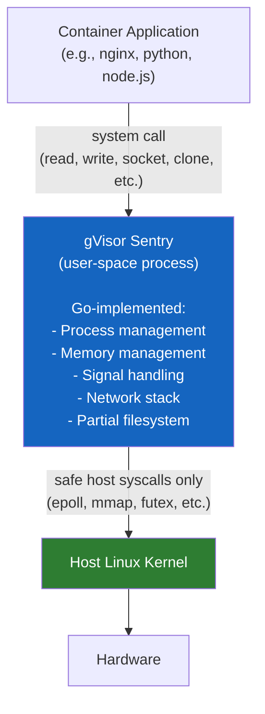

**What Sentry implements in user space:**
- Process and thread management (`fork`, `clone`, `waitpid`, `exit`)
- Memory management (`mmap`, `mprotect`, `munmap`, `brk`)
- Signal handling
- A complete TCP/IP network stack (written in Go — no host network code)
- Partial filesystem operations (delegated to Gofer for actual I/O)
- Timer and clock syscalls
- Most standard POSIX syscalls

**What Sentry does NOT implement:**
- Kernel module loading
- Raw socket access (limited)
- Some obscure or platform-specific syscalls
- Certain `/proc` and `/sys` entries (limited compatibility)

**Why Sentry being in Go matters:**

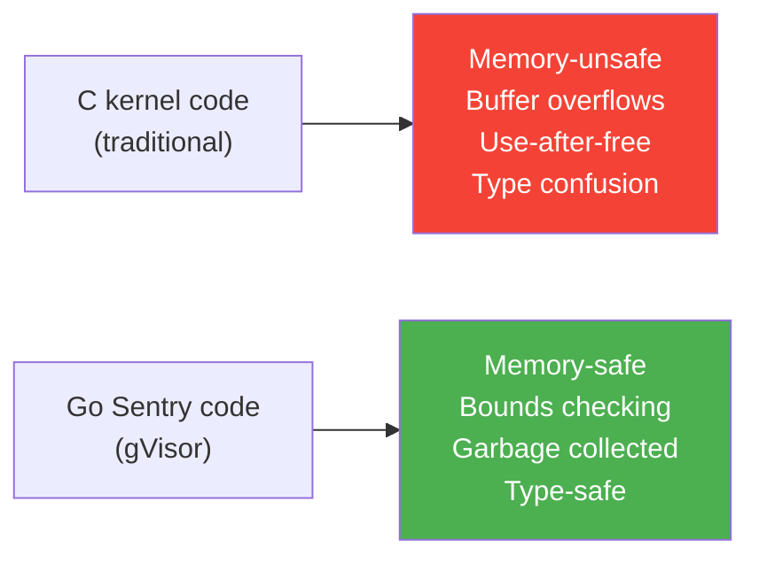

Go's memory safety eliminates entire classes of vulnerabilities (buffer overflows, use-after-free) that dominate kernel CVE lists. Even if Sentry has a bug, it's less likely to be exploitable in the same way as C kernel bugs.

### Component 2: Gofer

**Gofer** is a file access proxy that mediates between Sentry and the host filesystem:

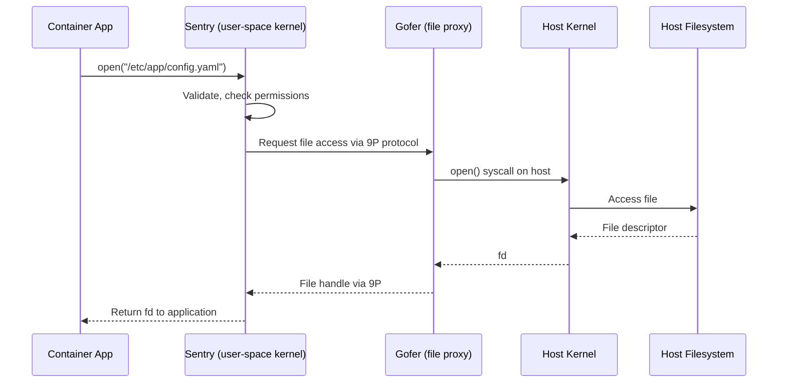

**Why Gofer exists:**

Direct filesystem access from Sentry would require Sentry to make many complex filesystem-related syscalls to the host, expanding the host kernel surface. Instead, Gofer acts as a dedicated, privilege-separated process that:

- Runs with minimal permissions
- Communicates with Sentry over the 9P protocol (a network-like file protocol)
- Is isolated from Sentry — a compromise of Sentry doesn't automatically compromise the Gofer process

**Key properties of the Gofer:**
- Runs as a separate process (not inside Sentry's address space)
- Communicates via socket-based 9P protocol
- Has read access to the container image layers
- Has no network access (isolated from the container's network namespace)

### The Network Stack

For network operations, gVisor implements its own complete TCP/IP stack in Go — the container's network traffic never passes through the host's `netfilter`, `iptables`, or network driver code:

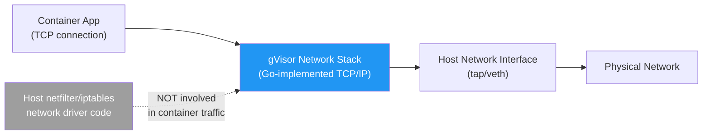

This means bugs in the host's network code (e.g., `netfilter` CVEs) cannot be exploited from within a gVisor container.

### The Complete gVisor Picture

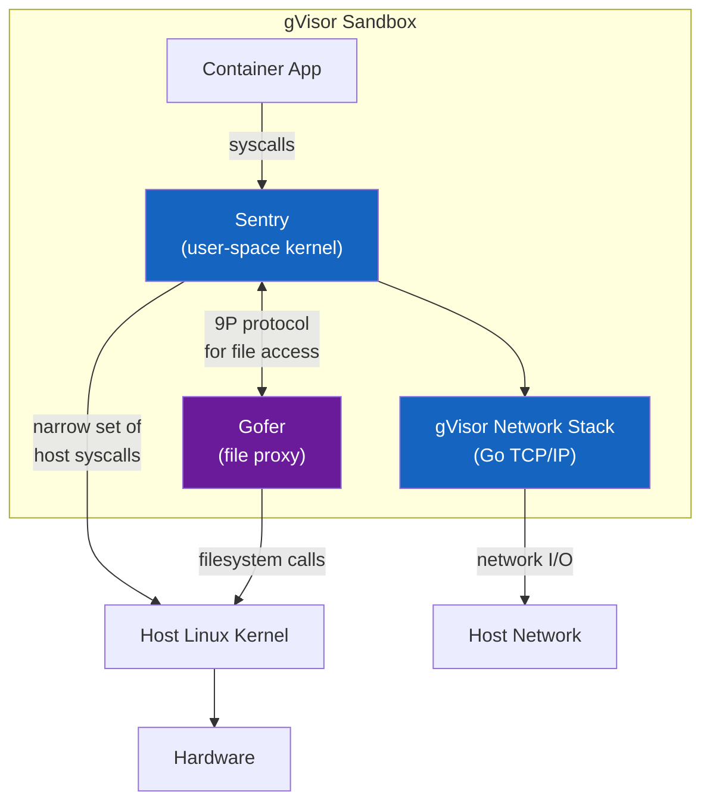

---

## gVisor in Kubernetes — RuntimeClass

In Kubernetes, gVisor is selected at the pod level using a **RuntimeClass** object. The RuntimeClass tells the kubelet which OCI runtime to use for the pod.

### Step 1: Install the `runsc` Binary on Nodes

```bash
# On each worker node that will run gVisor pods:

# Add the gVisor apt repository
curl -fsSL https://gvisor.dev/archive.key | gpg --dearmor -o /usr/share/keyrings/gvisor-archive-keyring.gpg
echo "deb [arch=$(dpkg --print-architecture) signed-by=/usr/share/keyrings/gvisor-archive-keyring.gpg] https://storage.googleapis.com/gvisor/releases release main" | tee /etc/apt/sources.list.d/gvisor.list

apt-get update
apt-get install -y runsc

# Verify installation
runsc --version
# runsc version release-20240115.0
```

### Step 2: Configure containerd to Use `runsc`

Edit `/etc/containerd/config.toml`:

```toml
[plugins."io.containerd.grpc.v1.cri".containerd.runtimes.runsc]
  runtime_type = "io.containerd.runsc.v1"

[plugins."io.containerd.grpc.v1.cri".containerd.runtimes.runsc.options]
  TypeUrl = "io.containerd.runsc.v1.options"
  ConfigPath = "/etc/containerd/runsc.toml"
```

Create `/etc/containerd/runsc.toml` (optional gVisor config):

```toml
# gVisor runtime options
[runsc_config]
  platform = "systrap"    # ptrace or systrap — systrap is faster on modern kernels
  network = "sandbox"     # sandbox (isolated) or host
  debug = false
```

Restart containerd:

```bash
systemctl restart containerd
```

### Step 3: Create the RuntimeClass Object

```yaml
# gvisor-runtimeclass.yaml
apiVersion: node.k8s.io/v1
kind: RuntimeClass
metadata:
  name: gvisor
handler: runsc            # Must match the containerd runtime name
scheduling:
  nodeSelector:
    kubernetes.io/arch: amd64   # gVisor only supports amd64
  tolerations:
  - key: "gvisor"
    operator: "Exists"
    effect: "NoSchedule"
```

```bash
kubectl apply -f gvisor-runtimeclass.yaml

# Verify
kubectl get runtimeclass
# NAME     HANDLER   AGE
# gvisor   runsc     5s
```

### Step 4: Assign Pods to gVisor

```yaml
apiVersion: v1
kind: Pod
metadata:
  name: sandboxed-app
spec:
  runtimeClassName: gvisor        # ← This is the only addition needed
  containers:
  - name: app
    image: registry.company.com/myapp:v1
    securityContext:
      allowPrivilegeEscalation: false
      runAsNonRoot: true
      capabilities:
        drop: ["ALL"]
```

gVisor is transparent to the application — no code changes required. The container runs exactly as it would normally, but all its syscalls are intercepted by Sentry.

---

## Verifying gVisor is Active

```bash
# Deploy a test pod
kubectl run gvisor-test \
  --image=busybox \
  --overrides='{"spec":{"runtimeClassName":"gvisor"}}' \
  -- sleep 600

# Verify via uname — gVisor reports itself
kubectl exec gvisor-test -- uname -r
# 4.4.0   ← gVisor's internal kernel version string (not the host kernel)

# Compare with a normal pod
kubectl run normal-test --image=busybox -- sleep 600
kubectl exec normal-test -- uname -r
# 6.1.75-1-MANJARO   ← actual host kernel version

# The difference confirms gVisor is intercepting the uname syscall
```

```bash
# Check the process from the node perspective
# gVisor containers appear as the 'runsc' process on the host
ps aux | grep runsc
# root  12345  ... runsc boot --bundle /run/containerd/...

# The container's PID 1 (sleep) is inside gVisor's user-space
# It does NOT appear as a normal process on the host's PID namespace
```

---

## gVisor Architecture — Isolation Properties

### Per-Container Kernel

Each gVisor container (or pod in Kubernetes) gets its own **isolated Sentry instance**:

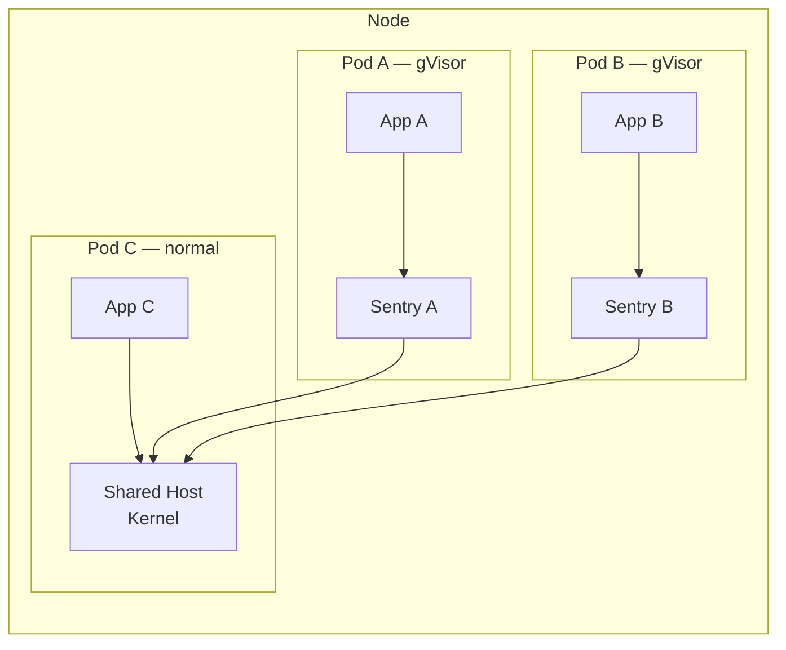

If Sentry A is compromised, it cannot affect Sentry B — they are separate processes with no shared memory. This is a significant improvement over normal containers where all containers share the same kernel state.

### The Two-Step Escape Problem for Attackers

With normal containers:
```
Container exploit → Kernel exploit → Host compromised
(1 step)
```

With gVisor:
```
Container exploit → Sentry exploit → Kernel exploit → Host compromised
(2 steps, dramatically harder)
```

An attacker must first find a bug in gVisor's Sentry (Go, memory-safe, purpose-built, smaller surface), then find a bug in the narrow interface between Sentry and the host kernel (only ~50 syscalls vs ~300+). Both steps are significantly harder than escaping from a normal container.

---

## Compatibility and Limitations

gVisor does not implement every Linux syscall. Applications that use unusual, low-level, or platform-specific syscalls may fail or behave unexpectedly:

| Application Type | Compatibility | Notes |
|---|---|---|
| Web servers (nginx, Apache) | ✅ Excellent | Standard HTTP workloads work well |
| Python, Node.js, Go apps | ✅ Good | Most language runtimes work |
| Java applications | ✅ Good | JVM works; some JVM flags may need adjustment |
| Databases (PostgreSQL, MySQL) | ⚠️ Partial | Performance impact; some ops may be slow |
| Machine learning (PyTorch, TF) | ⚠️ Mixed | GPU passthrough not supported |
| Raw socket applications | ⚠️ Limited | Some raw socket syscalls not implemented |
| Applications using `/proc` heavily | ⚠️ Limited | Some `/proc` entries not fully emulated |
| Applications needing kernel modules | ❌ Not supported | Kernel modules require direct kernel access |
| eBPF programs | ❌ Not supported | gVisor doesn't support eBPF in containers |

```bash
# Test your application for compatibility before production deployment
# Run the container with gVisor and check for errors:
kubectl logs <pod-name>

# Check for "unimplemented syscall" messages
kubectl exec <pod-name> -- dmesg 2>/dev/null | grep -i "unimplemented"

# Or check gVisor's own logs
# On the node: journalctl -u containerd | grep runsc
```

---

## Performance Characteristics

gVisor's overhead comes from syscall interception overhead:

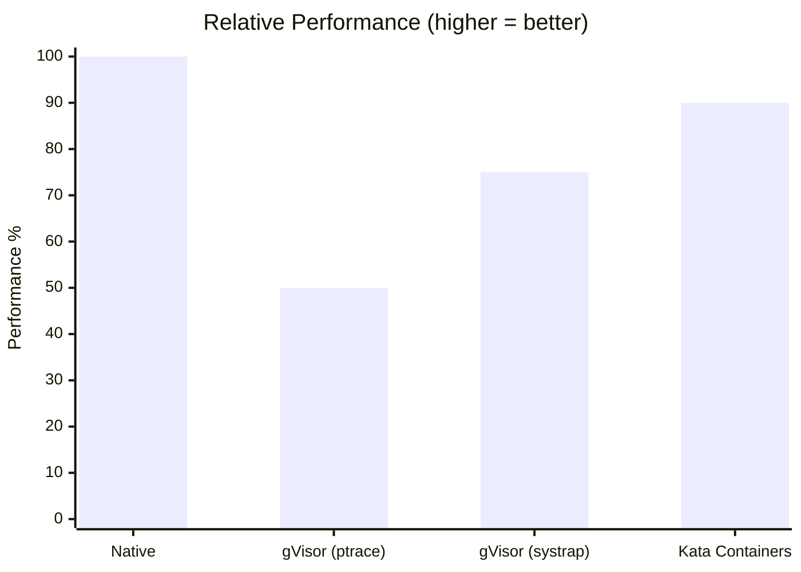

| Workload Type | gVisor Overhead | Reason |
|---|---|---|
| CPU-bound (math, compression) | ~5-10% | Few syscalls — Sentry rarely invoked |
| Network-intensive (HTTP, gRPC) | ~20-40% | Custom network stack + syscall interception |
| I/O-intensive (database, log writing) | ~30-50% | Gofer proxying adds latency per file op |
| Syscall-heavy (fork-heavy builds) | ~50%+ | Each fork/exec hits Sentry overhead |

**Platform modes:**
- `ptrace`: Uses ptrace to intercept syscalls — universally compatible but ~2x slower
- `systrap`: Uses `SECCOMP_RET_TRAP` — faster, requires kernel ≥ 4.14 — preferred

---

## Real-World Scenarios

### Scenario 1 — Multi-Tenant Function Execution Platform

**Problem:** A company builds an internal "functions as a service" platform where engineers submit arbitrary Python/Node.js functions that execute on shared infrastructure. These are untrusted workloads — any function could be deliberately or accidentally malicious.

**Solution:**

```yaml
# All function execution pods use gVisor
apiVersion: v1
kind: Pod
metadata:
  name: function-exec-user123
  labels:
    workload-type: user-function
spec:
  runtimeClassName: gvisor          # Sentry intercepts all syscalls
  securityContext:
    runAsNonRoot: true
    runAsUser: 65534                 # nobody
    seccompProfile:
      type: RuntimeDefault          # Seccomp still applied to gVisor itself
  containers:
  - name: executor
    image: registry.company.com/function-runtime:python3.11
    resources:
      limits:
        cpu: "1"
        memory: "512Mi"
    securityContext:
      allowPrivilegeEscalation: false
      readOnlyRootFilesystem: true
      capabilities:
        drop: ["ALL"]
```

**Why gVisor over just seccomp:** The user can submit code that triggers known kernel CVEs via syscalls that seccomp allows (e.g., a `read()` exploit). gVisor means their code hits the Sentry first — the host kernel never sees the malicious syscall.

### Scenario 2 — Migrating a Web Application to gVisor

**Step 1: Test in staging with gVisor**

```bash
# Label staging nodes for gVisor
kubectl label node staging-node-1 runtime=gvisor

# Create RuntimeClass that only schedules on gVisor nodes
kubectl apply -f - <<EOF
apiVersion: node.k8s.io/v1
kind: RuntimeClass
metadata:
  name: gvisor
handler: runsc
scheduling:
  nodeSelector:
    runtime: gvisor
EOF

# Deploy staging version with gVisor
kubectl set image deployment/webapp \
  webapp=registry.company.com/webapp:v2 -n staging
kubectl patch deployment webapp -n staging \
  -p '{"spec":{"template":{"spec":{"runtimeClassName":"gvisor"}}}}'
```

**Step 2: Run load tests and check compatibility**

```bash
# Run your test suite
kubectl exec -it test-runner -n staging -- /run-tests.sh

# Check for gVisor-specific issues
kubectl logs -n staging deployment/webapp | grep -i "syscall\|permission\|denied"

# Check gVisor logs on the node
ssh staging-node-1 journalctl -u containerd | grep "runsc\|unimplemented"
```

**Step 3: Promote to production**

```bash
# If tests pass: apply runtimeClassName to production deployment
kubectl patch deployment webapp -n production \
  -p '{"spec":{"template":{"spec":{"runtimeClassName":"gvisor"}}}}'
```

### Scenario 3 — Debugging a gVisor Compatibility Issue

**Symptom:** An application fails to start under gVisor with:
```
open /proc/self/exe: no such file or directory
```

**Diagnosis:**

```bash
# Check if the app needs /proc features gVisor doesn't fully support
kubectl exec <failing-pod> -- ls /proc/self/ 2>&1

# Check gVisor's kernel log (inside the container)
kubectl exec <failing-pod> -- dmesg | tail -20

# Check containerd/runsc logs on the node
ssh <node> journalctl -u containerd | grep -A 5 "runsc"

# Compare: does the app work without gVisor?
# Temporarily remove runtimeClassName and test
kubectl patch pod <failing-pod> \
  --type=json \
  -p='[{"op":"remove","path":"/spec/runtimeClassName"}]'
```

**Common fixes:**

```bash
# Fix 1: Some apps need /proc/self/exe — configure gVisor to expose it
# In /etc/containerd/runsc.toml:
[runsc_config]
  overlay = true    # Enable overlay filesystem for /proc emulation

# Fix 2: Application uses raw sockets — needs privilege
# Can't fix with gVisor; use normal container with strict seccomp instead

# Fix 3: App uses ioctl for specific device — not supported in gVisor
# Consider Kata Containers (full VM, real kernel) instead of gVisor
```

---

## gVisor vs Kata Containers — Choosing the Right Tool

| Property | gVisor | Kata Containers |
|---|---|---|
| **Isolation mechanism** | User-space kernel (Sentry) | Lightweight VM (real kernel) |
| **Hardware virtualisation needed** | ❌ No | ✅ Yes (`/dev/kvm`) |
| **Kernel compatibility** | ~80-90% of syscalls | 100% (real kernel) |
| **Performance overhead** | 20-50% | 5-15% |
| **Memory per container** | Low (~10MB extra) | Higher (full kernel ~50-100MB) |
| **Startup time** | ~50ms | ~200ms |
| **Isolation strength** | High (Go user-space kernel) | Very High (VM boundary) |
| **Best for** | General untrusted workloads | Maximum compatibility + isolation |
| **eBPF support** | ❌ No | ✅ Yes |
| **GPU passthrough** | ❌ No | ✅ Possible |

**Decision guide:**

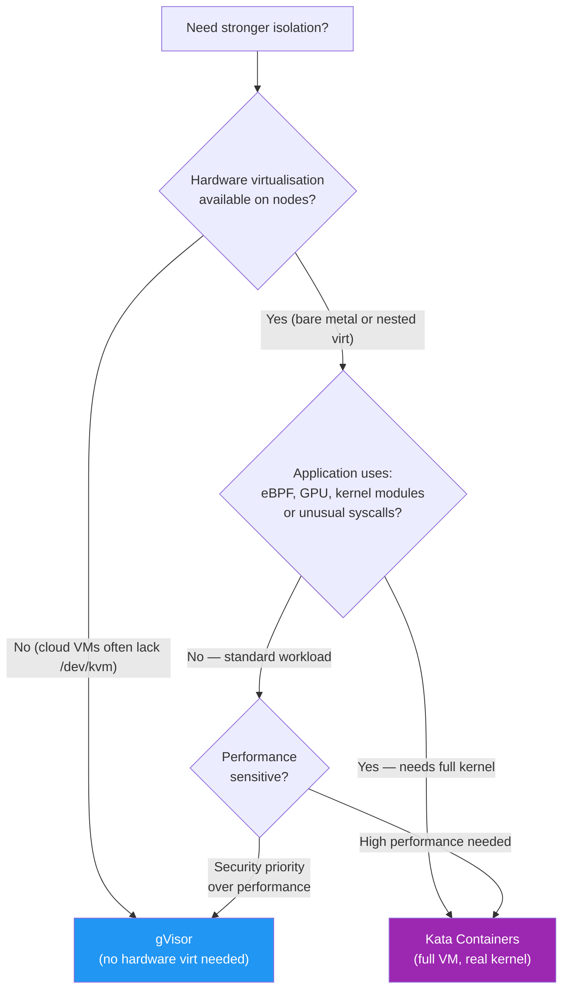

---

## Common Mistakes

| Mistake | Consequence | Fix |
|---|---|---|
| Assuming gVisor requires hardware virtualisation | Thinking it's unavailable on cloud VMs — gVisor works on VMs | gVisor uses ptrace/systrap — no `/dev/kvm` needed |
| Not testing app compatibility before production | Application fails or behaves incorrectly under gVisor | Test all workloads in gVisor in staging first |
| Using gVisor for all workloads | Unnecessary overhead on fully trusted workloads | Reserve gVisor for untrusted or high-risk workloads |
| Forgetting to install `runsc` on ALL nodes | Pods scheduled to nodes without `runsc` fail with ContainerCreateError | Use RuntimeClass `scheduling.nodeSelector` to pin gVisor pods to prepared nodes |
| Ignoring Sentry's own syscall exposure | Assuming gVisor is impenetrable — Sentry still calls the host kernel | Apply seccomp to gVisor itself (seccomp on the Sentry process reduces its host call surface) |
| Mixing gVisor and privileged containers | Privileged containers bypass gVisor isolation | Never use `privileged: true` with gVisor; enforce via PSA |

---

## Quick Reference

### Installation Summary

```bash
# 1. Install runsc on each node
apt-get install -y runsc

# 2. Configure containerd (/etc/containerd/config.toml)
# Add runsc runtime handler

# 3. Restart containerd
systemctl restart containerd

# 4. Create RuntimeClass
kubectl apply -f gvisor-runtimeclass.yaml

# 5. Use in pods
# spec.runtimeClassName: gvisor
```

### RuntimeClass YAML

```yaml
apiVersion: node.k8s.io/v1
kind: RuntimeClass
metadata:
  name: gvisor
handler: runsc
scheduling:
  nodeSelector:
    kubernetes.io/arch: amd64
```

### Pod with gVisor

```yaml
spec:
  runtimeClassName: gvisor          # ← only change needed
  containers:
  - name: app
    image: myapp:v1
    securityContext:
      allowPrivilegeEscalation: false
      runAsNonRoot: true
      capabilities:
        drop: ["ALL"]
```

### Verification Commands

```bash
# Check RuntimeClass exists
kubectl get runtimeclass

# Verify gVisor is active (uname shows gVisor kernel)
kubectl exec <pod> -- uname -r   # shows gVisor version, not host kernel

# Check pod is using gVisor
kubectl get pod <pod> -o jsonpath='{.spec.runtimeClassName}'
# gvisor

# On node: see runsc process
ps aux | grep runsc
```

---

## CKS Exam Tips

> 💡 **gVisor = Sentry (user-space kernel) + Gofer (file proxy).** Know both components and their roles. Sentry handles syscalls; Gofer handles file access via 9P protocol.

> 💡 **`RuntimeClass` is the Kubernetes integration point.** The object has `handler: runsc`; the pod uses `spec.runtimeClassName: gvisor`. Know both the object and the pod field.

> 💡 **No hardware virtualisation required.** gVisor uses ptrace or systrap — not KVM. This is the key difference from Kata Containers which requires `/dev/kvm`.

> 💡 **`uname -r` inside a gVisor pod returns gVisor's version, not the host kernel.** This is how you verify gVisor is active — it intercepts the `uname` syscall and returns its own version string.

> 💡 **Two-step escape.** gVisor doesn't make escape impossible — it makes it a two-step process (break Sentry, then break the host kernel via Sentry's narrow interface). Know this distinction from "impossible".

> 💡 **Compatibility limitation.** gVisor doesn't support all syscalls. Applications using eBPF, kernel modules, certain `/proc` entries, or raw sockets may not work. Kata Containers gives 100% compatibility (real kernel).

> 💡 **Per-container kernel.** Each gVisor pod gets its own Sentry instance — isolation between containers even at the user-space kernel level.

```yaml
# CKS exam pattern — minimal gVisor RuntimeClass + Pod
---
apiVersion: node.k8s.io/v1
kind: RuntimeClass
metadata:
  name: gvisor
handler: runsc
---
apiVersion: v1
kind: Pod
metadata:
  name: sandboxed
spec:
  runtimeClassName: gvisor
  containers:
  - name: app
    image: nginx:1.25
```

---

## Summary

gVisor is Google's user-space kernel that provides an additional isolation layer between containerized applications and the host Linux kernel. Its two core components — Sentry (the user-space kernel that intercepts all container syscalls) and Gofer (the file proxy that mediates filesystem access via 9P) — work together to ensure the host kernel sees only a narrow, controlled interface.

The key security property: instead of a container's syscalls going directly to the host kernel, they go to Sentry first. An attacker must compromise Sentry (Go, memory-safe, purpose-built) *and then* find a way to exploit the host kernel through Sentry's narrow interface — a two-step escape vs the one-step escape from normal containers.

gVisor is the right tool when:
- Hardware virtualisation is unavailable (cloud VMs often lack `/dev/kvm`)
- The workload is untrusted (user-submitted code, CI/CD sandboxes)
- Compatibility with most standard syscalls is needed (Kata provides 100% but requires KVM)
- Performance overhead of 20-50% is acceptable for the security benefit

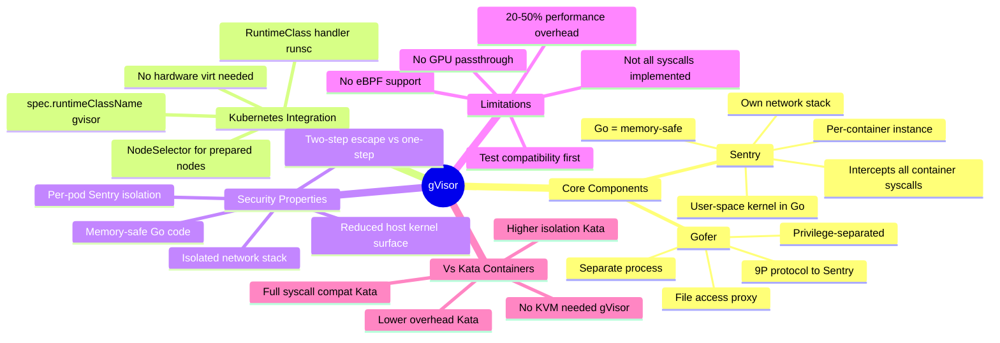

---

## What's Next

**Chapter 12 — Kata Containers** covers the alternative approach to strong container isolation: instead of a user-space kernel, Kata runs each container inside a lightweight virtual machine with its own real Linux kernel. Kata provides 100% syscall compatibility (it's a real kernel) and even stronger isolation (VM boundary vs user-space process boundary), but requires hardware virtualisation (`/dev/kvm`) and slightly higher resource overhead. Understanding when to choose Kata vs gVisor is a CKS exam topic.

---

*Chapter 11 of 30 — Microservice Vulnerabilities | Kubernetes Security Study Guide*
