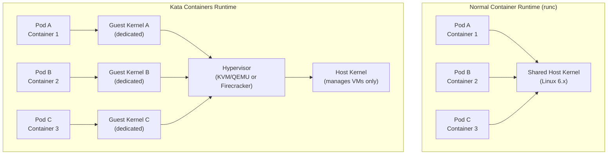
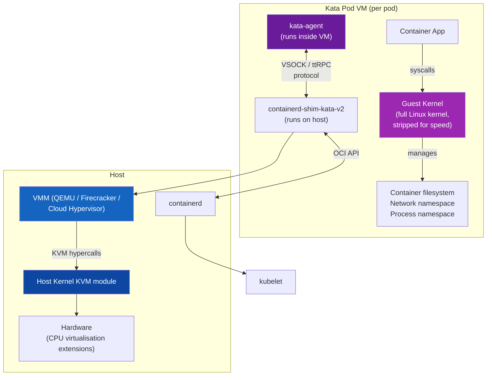
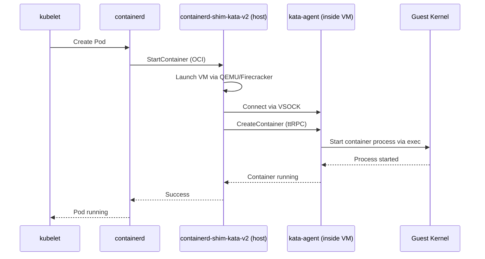
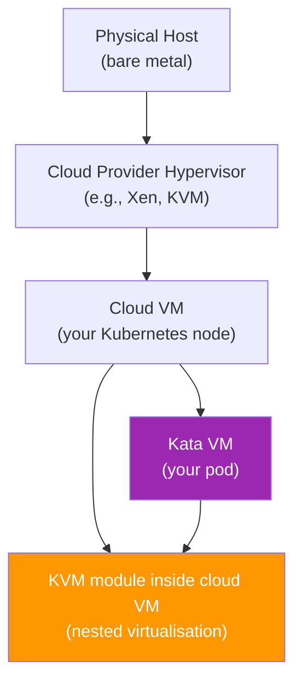
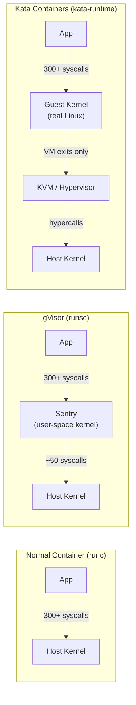
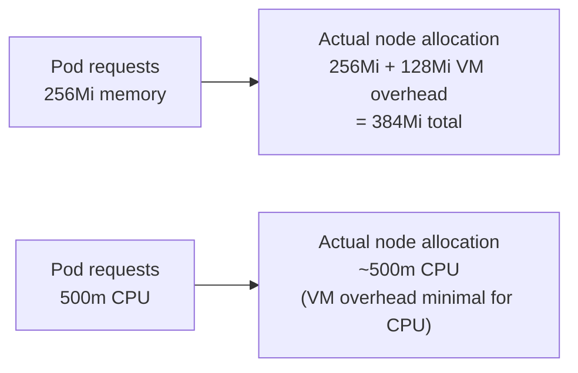
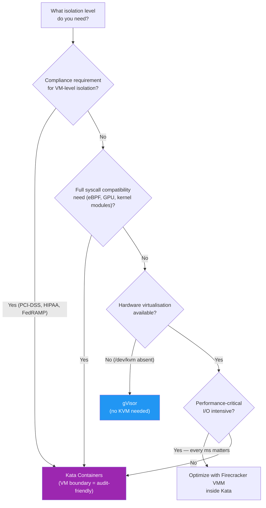
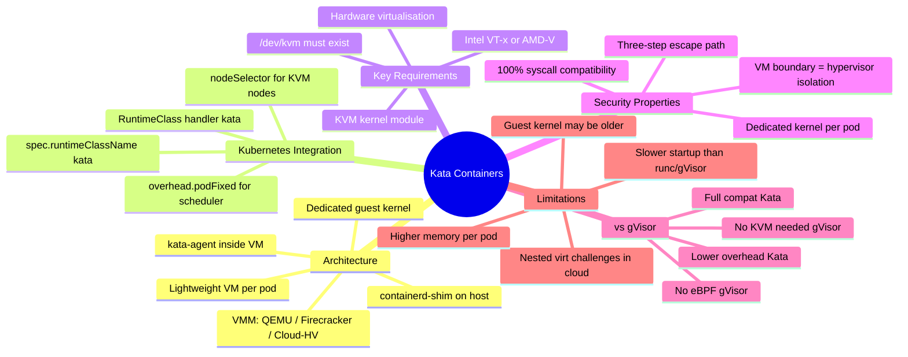

# 12 — Kata Containers

---

## Why This Matters

Chapter 11 covered gVisor — a user-space kernel that intercepts syscalls before they reach the host. gVisor's strength is that it requires no hardware virtualisation and has low memory overhead. Its weakness is partial syscall compatibility (~80-90%) and that it's still a user-space process on the host — a sufficiently motivated attacker who breaks the Go Sentry still has a path to the host kernel.

**Kata Containers** takes the opposite design tradeoff: instead of a user-space kernel, it puts each container inside a **real, dedicated lightweight VM with its own real Linux kernel**. The isolation boundary is now a hardware hypervisor — the strongest isolation primitive available outside physical machine separation.

An attacker who compromises a container in Kata Containers has compromised the guest kernel of that VM. To reach the host, they must escape the hypervisor — a significantly harder bar, requiring hypervisor-specific vulnerabilities (KVM/QEMU CVEs) rather than kernel CVEs, which are far more common.

The trade-off: Kata requires hardware virtualisation (`/dev/kvm`), carries a per-pod kernel overhead (~50–100MB RAM, ~200ms startup), and is constrained by nested virtualisation limitations in cloud environments. But for workloads demanding maximum isolation with 100% syscall compatibility — financial transactions, healthcare data, multi-tenant SaaS — it's the strongest Kubernetes-native option.

For CKS: know the Kata architecture (VM per pod, real guest kernel, kata-agent), the Kubernetes integration via `RuntimeClass`, and when to choose Kata vs gVisor.

---

## What Is Kata Containers?

Kata Containers is an **open-source container runtime** that runs each container (or Kubernetes pod) inside a lightweight virtual machine. The VM has its own dedicated Linux kernel — the container's syscalls never reach the host kernel directly.

| Attribute | Detail |
|---|---|
| **Project** | Kata Containers (merged Intel Clear Containers + Hyper.sh runV, 2017) |
| **Maintained by** | OpenStack Foundation / CNCF ecosystem |
| **Website** | [katacontainers.io](https://katacontainers.io) |
| **Isolation mechanism** | Lightweight VM per pod (real guest kernel) |
| **VMM options** | QEMU, Firecracker, Cloud Hypervisor (rust-vmm) |
| **Requires** | Hardware virtualisation (`/dev/kvm`) |
| **Runtime binary** | `kata-runtime` / `containerd-shim-kata-v2` |
| **Kubernetes integration** | `RuntimeClass` with handler `kata` |
| **Performance overhead** | ~5-15% CPU, ~50-100MB RAM per pod |
| **Syscall compatibility** | 100% — real Linux kernel |

### What Kata Containers Is NOT

| Misconception | Reality |
|---|---|
| "Kata is just a big VM" | Kata uses *lightweight* VMs — stripped-down, fast-boot, purpose-built |
| "Kata replaces Kubernetes" | Kata is a pod runtime; Kubernetes orchestrates Kata pods exactly like normal pods |
| "Kata works everywhere" | Requires hardware virtualisation — not available on most cloud VMs without nested virt |
| "Kata is always better than gVisor" | Depends on the use case — gVisor has lower overhead and no KVM requirement |
| "Each container gets a separate VM" | By default, all containers in a Kubernetes **pod** share one VM but each has its own namespace inside it |

---

## The Core Idea — A VM Per Pod

The fundamental architectural insight: instead of sharing the host kernel, each pod gets a dedicated thin VM:



**The key security property:** The container process's syscalls go to its **dedicated guest kernel**. The host kernel only handles VM-level operations (memory mapping, interrupt handling, VM exits) — it never sees the container's application-level syscalls directly.

For a malicious container to affect the host, it must:
1. Exploit a bug in the guest kernel
2. Then exploit the hypervisor interface (KVM/QEMU) to escape the VM
3. Then reach the host kernel

Steps 2 and 3 require finding hypervisor vulnerabilities — a much smaller, better-audited codebase than the full Linux kernel surface exposed to normal containers.

---

## Kata Containers Architecture



### Component Breakdown

| Component | Runs On | Role |
|---|---|---|
| **Container App** | Inside VM (guest user space) | The actual workload |
| **Guest Kernel** | Inside VM (guest kernel space) | Handles all container syscalls; isolated per pod |
| **kata-agent** | Inside VM (guest user space) | Manages container lifecycle inside the VM; communicates with host via VSOCK |
| **containerd-shim-kata-v2** | Host | Bridge between containerd and the VM; translates OCI calls to kata-agent API |
| **VMM (QEMU/Firecracker)** | Host user space | Creates and manages the VM; handles virtual device I/O |
| **KVM module** | Host kernel | Hardware virtualisation interface; provides CPU and memory isolation |

### The kata-agent

The kata-agent is a lightweight process running **inside the VM** that:
- Starts and manages containers within the VM
- Receives commands from the host-side shim via VSOCK (a host-to-VM socket)
- Mounts the container filesystem from the host into the VM
- Manages the container's lifecycle (start, exec, stop, kill)



### VMM Options

Kata supports multiple Virtual Machine Monitors:

| VMM | Description | Startup Time | Memory | Best For |
|---|---|---|---|---|
| **QEMU** | Full-featured, widely compatible | ~500ms | ~100MB | Maximum compatibility, legacy apps |
| **Firecracker** | AWS's MicroVM, minimal device model | ~125ms | ~20MB | Speed, serverless, high density |
| **Cloud Hypervisor** | rust-vmm based, modern and fast | ~150ms | ~30MB | Performance + security balance |
| **QEMU-lite** | Stripped QEMU for faster startup | ~200ms | ~60MB | Balance of compat + speed |

---

## Hardware Virtualisation Requirement

Kata Containers depends on CPU virtualisation extensions:
- **Intel VT-x** (Intel CPUs)
- **AMD-V** (AMD CPUs)
- **ARM VHE** (ARM64 CPUs)

These are exposed to the OS via the KVM kernel module as `/dev/kvm`.

```bash
# Check if hardware virtualisation is available
ls /dev/kvm
# /dev/kvm   ← present = virtualisation available

# If missing:
ls /dev/kvm
# ls: cannot access '/dev/kvm': No such file or directory
# Kata Containers cannot run

# Verify CPU supports virtualisation
grep -E 'vmx|svm' /proc/cpuinfo | head -5
# vmx = Intel VT-x
# svm = AMD-V

# Check KVM module is loaded
lsmod | grep kvm
# kvm_intel       372736  0
# kvm             1085440  1 kvm_intel
```

### The Cloud Nested Virtualisation Challenge

Most cloud instances are themselves VMs. Running Kata inside a cloud VM requires **nested virtualisation** — a VM inside a VM:



| Cloud Provider | Nested Virtualisation Support |
|---|---|
| **Google Cloud (GCE)** | ✅ Yes — explicit support, must enable per-instance |
| **AWS EC2 (metal instances)** | ✅ Yes — bare metal instances (`*.metal`) |
| **Azure** | ⚠️ Limited — some VM types support it |
| **Standard cloud VMs** | ❌ No — most `t3`, `n2`, `Standard_D` etc. don't support it |
| **Bare metal servers** | ✅ Yes — always available |

**For lab/exam environments:** Single-node clusters on physical hardware always support Kata. CKS exam environments typically use VM-based clusters — check if `/dev/kvm` exists.

---

## Kata Containers vs Normal Containers vs gVisor



| Property | Normal Container | gVisor | Kata Containers |
|---|---|---|---|
| **Host kernel exposure** | Direct — all syscalls | Indirect — via Sentry | Only VM exits — no app syscalls |
| **Isolation boundary** | Namespaces (logical) | User-space process | Hardware hypervisor |
| **Syscall compatibility** | 100% | ~85-90% | 100% (real kernel) |
| **Kernel per workload** | No — shared | Partial (Sentry not the real kernel) | Yes — dedicated guest kernel |
| **Hardware virt needed** | No | No | Yes (`/dev/kvm`) |
| **Performance overhead** | Baseline | 20-50% | 5-15% |
| **Memory per pod** | ~1-5MB overhead | ~10MB | ~50-100MB |
| **Startup time** | ~10ms | ~50ms | ~200-500ms |
| **Best escape bar** | Container → host (1 step) | Container → Sentry → host (2 steps) | Container → guest kernel → hypervisor → host (3+ steps) |

---

## Kata Containers in Kubernetes — RuntimeClass

The Kubernetes integration follows the same `RuntimeClass` pattern as gVisor.

### Step 1: Install Kata on Nodes

```bash
# On each node that will run Kata pods (requires /dev/kvm):

# Add Kata repository (Ubuntu/Debian)
ARCH=$(uname -m)
BRANCH="stable-2.0"
KATA_URL="https://github.com/kata-containers/kata-containers/releases"

# Download and install the Kata static tarball
VERSION="3.2.0"
curl -LO "${KATA_URL}/download/${VERSION}/kata-static-${VERSION}-${ARCH}.tar.xz"
tar xJf kata-static-${VERSION}-${ARCH}.tar.xz -C /
# Installs to /opt/kata/

# Or via snap (simpler for testing)
snap install kata-containers --classic

# Verify
/opt/kata/bin/kata-runtime kata-check
# System can currently create Kata Containers: YES ✅
```

### Step 2: Configure containerd

Edit `/etc/containerd/config.toml`:

```toml
[plugins."io.containerd.grpc.v1.cri".containerd.runtimes.kata]
  runtime_type = "io.containerd.kata.v2"

[plugins."io.containerd.grpc.v1.cri".containerd.runtimes.kata.options]
  ConfigPath = "/opt/kata/share/defaults/kata-containers/configuration.toml"
```

The Kata configuration file (`/opt/kata/share/defaults/kata-containers/configuration.toml`) controls VMM selection:

```toml
# Choose the VMM (hypervisor)
[hypervisor.qemu]
path = "/opt/kata/bin/qemu-system-x86_64"
kernel = "/opt/kata/share/kata-containers/vmlinux.container"
image = "/opt/kata/share/kata-containers/kata-containers.img"
machine_type = "q35"
default_vcpus = 1
default_memory = 128  # MB — minimum per VM
```

```bash
# Restart containerd
systemctl restart containerd
```

### Step 3: Create the RuntimeClass

```yaml
# kata-runtimeclass.yaml
apiVersion: node.k8s.io/v1
kind: RuntimeClass
metadata:
  name: kata
handler: kata                  # Must match containerd runtime name
scheduling:
  nodeSelector:
    kata-containers: "true"    # Only schedule on nodes with Kata installed
  tolerations:
  - key: "kata-containers"
    operator: "Exists"
    effect: "NoSchedule"
overhead:
  podFixed:
    memory: "120Mi"            # Account for VM overhead in scheduling
    cpu: "250m"
```

```bash
# Label nodes with Kata installed
kubectl label node worker-1 kata-containers=true

kubectl apply -f kata-runtimeclass.yaml

kubectl get runtimeclass
# NAME   HANDLER   AGE
# kata   kata      5s
```

### Step 4: Use Kata in Pods

```yaml
apiVersion: v1
kind: Pod
metadata:
  name: secure-payment-pod
spec:
  runtimeClassName: kata               # ← Select Kata runtime
  containers:
  - name: payment-service
    image: registry.company.com/payment-service:v2.1
    securityContext:
      allowPrivilegeEscalation: false
      runAsNonRoot: true
      runAsUser: 1000
      capabilities:
        drop: ["ALL"]
      seccompProfile:
        type: RuntimeDefault
    resources:
      requests:
        memory: "256Mi"
        cpu: "500m"
      limits:
        memory: "512Mi"
        cpu: "1"
```

---

## Verifying Kata is Active

```bash
# Deploy a test pod
kubectl run kata-test \
  --image=busybox \
  --overrides='{"spec":{"runtimeClassName":"kata"}}' \
  -- sleep 600

# Verify: uname shows the GUEST kernel version, not host
kubectl exec kata-test -- uname -r
# 5.15.55  ← Kata's embedded guest kernel (older than host — Kata ships its own)

# Compare to host kernel
uname -r
# 6.1.75-1   ← Host kernel — different from guest

# On the host node: see QEMU/Firecracker process for each Kata pod
ps aux | grep -E "qemu|firecracker" | grep -v grep
# root  12345 ... /opt/kata/bin/qemu-system-x86_64 ...

# Kata check on a node
/opt/kata/bin/kata-runtime kata-check
```

```bash
# From inside the VM (exec into container)
kubectl exec kata-test -- cat /proc/version
# Linux version 5.15.55 (root@kata) ...   ← Kata's guest kernel, not host

# Memory appears different inside VM (Kata allocates fixed VM memory)
kubectl exec kata-test -- free -m
# total: 128MB   ← VM's allocated memory, not node's total memory
```

---

## Memory and Resource Overhead

Kata's VM overhead must be accounted for in resource planning:



Use the `RuntimeClass.overhead` field to let the scheduler account for this:

```yaml
overhead:
  podFixed:
    memory: "120Mi"    # Kata VM kernel + kata-agent overhead
    cpu: "250m"        # Minimal CPU overhead for VM management
```

```bash
# The scheduler automatically adds overhead to pod resource requests
# when the pod uses a RuntimeClass with overhead defined

# Verify scheduling considers overhead
kubectl describe pod kata-test | grep -A5 "Limits:\|Requests:"
```

---

## Use Cases — When to Choose Kata



### Ideal Kata Use Cases

| Use Case | Why Kata | Notes |
|---|---|---|
| **Financial/payment processing** | VM boundary satisfies PCI-DSS isolation requirements | Combined with encrypted storage |
| **Healthcare data workloads** | HIPAA isolation between patient data pods | Each pod in its own VM |
| **Multi-tenant SaaS** | Customer A's code can't escape to Customer B's pod | VM boundary prevents cross-tenant escape |
| **CI/CD with user-submitted builds** | Untrusted build code in VM-isolated containers | Firecracker VMM for fast startup |
| **Workloads using eBPF or GPU** | gVisor doesn't support these; Kata uses real kernel | GPU passthrough needs VMM config |
| **Compliance-gated environments** | Auditors often accept "VM isolation" as equivalent to physical separation | Document RuntimeClass in runbook |

---

## Real-World Scenarios

### Scenario 1 — PCI-DSS Compliant Payment Processing

**Requirement:** PCI-DSS mandates network segmentation and isolation between payment processing components and other workloads.

```yaml
# Dedicated namespace for payment workloads
apiVersion: v1
kind: Namespace
metadata:
  name: payments
  labels:
    pod-security.kubernetes.io/enforce: restricted
---
# All payment pods use Kata
apiVersion: apps/v1
kind: Deployment
metadata:
  name: payment-processor
  namespace: payments
spec:
  replicas: 3
  template:
    spec:
      runtimeClassName: kata          # VM isolation per pod
      securityContext:
        runAsNonRoot: true
        runAsUser: 1000
        seccompProfile:
          type: RuntimeDefault
      containers:
      - name: payment-api
        image: registry.company.com/payment-api:v3.0
        securityContext:
          allowPrivilegeEscalation: false
          readOnlyRootFilesystem: true
          capabilities:
            drop: ["ALL"]
        resources:
          requests:
            memory: "256Mi"     # Application memory
            cpu: "500m"
          # Scheduler adds 120Mi overhead from RuntimeClass automatically
```

**Compliance documentation:** "Payment processing pods run in dedicated Kata Containers VMs, providing hardware-enforced isolation equivalent to separate virtual machines. Each pod has a dedicated Linux kernel instance; the host kernel never directly processes payment application syscalls."

### Scenario 2 — Handling the `/dev/kvm` Absent Problem

**Symptom:** Kata pods fail to start in a cloud environment.

```bash
# Error in pod events:
kubectl describe pod kata-test
# Events:
# Warning FailedCreatePodSandBox: Failed to create pod sandbox:
# rpc error: code = Unknown desc = failed to create containerd task:
# failed to create shim task: OCI runtime create failed:
# /opt/kata/bin/qemu-system-x86_64: ... /dev/kvm: No such file or directory

# Diagnosis: Check if KVM is available
ls /dev/kvm
# ls: cannot access '/dev/kvm': No such file or directory

# Check CPU virtualisation
grep -c vmx /proc/cpuinfo
# 0  ← No Intel VT-x

grep -c svm /proc/cpuinfo
# 0  ← No AMD-V either
```

**Options:**

```bash
# Option 1: Enable nested virtualisation (if cloud provider supports it)
# GCP: enable at instance creation or via metadata
gcloud compute instances create my-node \
  --enable-nested-virtualization \
  --zone=us-central1-a

# Option 2: Use bare metal instances (AWS .metal, GCP bare metal)
# These always have /dev/kvm available

# Option 3: Switch to gVisor (no KVM requirement)
kubectl patch deployment my-app \
  -p '{"spec":{"template":{"spec":{"runtimeClassName":"gvisor"}}}}'

# Option 4: For labs — use QEMU's emulation mode (slow, for testing only)
# In kata configuration.toml: machine_accelerators = ""  (removes kvm requirement)
```

### Scenario 3 — Running Both gVisor and Kata in the Same Cluster

A cluster can have multiple RuntimeClasses simultaneously — different pods use different runtimes based on their risk profile:

```yaml
# Trusted internal services — standard runtime (default)
apiVersion: apps/v1
kind: Deployment
metadata:
  name: internal-api
spec:
  template:
    spec:
      # No runtimeClassName → uses cluster default (runc)
      containers:
      - name: api
        image: registry.company.com/internal-api:v1
---
# Third-party integrations — gVisor (no KVM needed)
apiVersion: apps/v1
kind: Deployment
metadata:
  name: partner-integration
spec:
  template:
    spec:
      runtimeClassName: gvisor
      containers:
      - name: integration
        image: registry.company.com/partner-sdk:v2
---
# Payment processing — Kata (maximum isolation)
apiVersion: apps/v1
kind: Deployment
metadata:
  name: payment-service
spec:
  template:
    spec:
      runtimeClassName: kata
      containers:
      - name: payment
        image: registry.company.com/payment:v3
```

**Enforcing minimum runtime class by namespace** (via OPA Gatekeeper):

```rego
# Require payments namespace to use kata runtime
package k8srequiredruntime

violation[{"msg": msg}] {
    input.review.object.metadata.namespace == "payments"
    rt := input.review.object.spec.runtimeClassName
    rt != "kata"
    msg := sprintf("Pods in 'payments' namespace must use runtimeClassName 'kata', got: '%v'", [rt])
}
```

---

## Kata Containers + Firecracker — The Performance-Optimal Combination

For ephemeral, high-throughput workloads (CI pipelines, batch jobs), combining Kata with Firecracker instead of QEMU dramatically reduces overhead:

```toml
# /opt/kata/share/defaults/kata-containers/configuration-fc.toml
[hypervisor.firecracker]
path = "/opt/kata/bin/firecracker"
kernel = "/opt/kata/share/kata-containers/vmlinux-fc.bin"
rootfs_type = "initrd"
default_memory = 64     # MB — much less than QEMU
```

```yaml
# RuntimeClass using Firecracker VMM
apiVersion: node.k8s.io/v1
kind: RuntimeClass
metadata:
  name: kata-fc
handler: kata-fc
overhead:
  podFixed:
    memory: "70Mi"      # Much lower than QEMU overhead
    cpu: "100m"
```

| Metric | QEMU VMM | Firecracker VMM |
|---|---|---|
| Startup time | ~500ms | ~125ms |
| Memory overhead | ~100MB | ~20MB |
| Device compatibility | High | Low (minimal device model) |
| Production use | General purpose | High-density, ephemeral |

---

## Common Mistakes

| Mistake | Consequence | Fix |
|---|---|---|
| Deploying Kata on nodes without `/dev/kvm` | Pods fail with `No such file or directory: /dev/kvm` | Check `ls /dev/kvm` first; use RuntimeClass `scheduling.nodeSelector` to pin Kata pods to prepared nodes |
| Not setting `RuntimeClass.overhead` | Scheduler doesn't account for VM memory — node OOM evictions | Always define `overhead.podFixed` for Kata RuntimeClass |
| Using Kata in nested-virt environments without validation | Poor performance or failure | Benchmark nested virt performance; switch to gVisor or bare metal if unacceptable |
| Expecting Kata pod startup to be as fast as runc | Timeouts in health checks — Kata takes ~200-500ms vs ~10ms for runc | Increase `initialDelaySeconds` in liveness/readiness probes |
| Mixing Kata and `privileged: true` | Privileged containers in Kata can still modify the guest kernel — use thoughtfully | Even with Kata, avoid `privileged: true`; it's not needed for most workloads |
| Forgetting to label Kata-capable nodes | Kata pods scheduled to nodes without `runsc` fail | Use `scheduling.nodeSelector` in RuntimeClass to constrain pod placement |
| Assuming the Kata guest kernel = host kernel version | Guest kernel is Kata's embedded kernel (often older) — some newer kernel features unavailable | Check Kata's shipped kernel version; update Kata for newer guest kernel |

---

## Quick Reference

### Installation Checklist

```bash
# Prerequisites
ls /dev/kvm               # Must exist
grep -c 'vmx\|svm' /proc/cpuinfo  # Must be > 0

# Install Kata
/opt/kata/bin/kata-runtime kata-check   # Validate install

# Configure containerd
# Add kata handler in /etc/containerd/config.toml
systemctl restart containerd

# Create RuntimeClass
kubectl apply -f kata-runtimeclass.yaml

# Label nodes
kubectl label node <node> kata-containers=true
```

### RuntimeClass YAML

```yaml
apiVersion: node.k8s.io/v1
kind: RuntimeClass
metadata:
  name: kata
handler: kata
scheduling:
  nodeSelector:
    kata-containers: "true"
overhead:
  podFixed:
    memory: "120Mi"
    cpu: "250m"
```

### Pod Using Kata

```yaml
spec:
  runtimeClassName: kata      # ← only required change
  containers:
  - name: app
    image: myapp:v1
```

### Key Commands

```bash
# Check KVM availability
ls /dev/kvm

# Validate Kata installation
/opt/kata/bin/kata-runtime kata-check

# List RuntimeClasses
kubectl get runtimeclass

# Verify pod uses Kata
kubectl get pod <name> -o jsonpath='{.spec.runtimeClassName}'

# Check QEMU/Firecracker processes per pod on node
ps aux | grep -E "qemu|firecracker" | grep -v grep

# Verify guest kernel (different from host kernel)
kubectl exec <pod> -- uname -r
```

---

## CKS Exam Tips

> 💡 **Kata = VM per pod with a real dedicated Linux kernel.** The isolation boundary is the hypervisor, not namespaces or a user-space kernel. This is the most important conceptual distinction.

> 💡 **`/dev/kvm` is a hard prerequisite.** If it doesn't exist, Kata cannot run. gVisor doesn't need it. Know this difference.

> 💡 **`RuntimeClass` is the integration point** — same pattern as gVisor. `handler: kata` in the RuntimeClass; `spec.runtimeClassName: kata` in the pod. Know both.

> 💡 **Guest kernel ≠ host kernel.** `uname -r` inside a Kata pod shows the Kata-embedded guest kernel version (often older than the host). This proves VM isolation is active.

> 💡 **Three isolation levels in exam scenarios:**
> - Default (runc) → namespace isolation only
> - gVisor → user-space kernel interception (no KVM needed)
> - Kata → hardware VM boundary (KVM required)

> 💡 **`RuntimeClass.overhead`** tells the scheduler to add VM resource overhead to the pod's requests. Know this field — a Kata pod consuming `256Mi` actually needs `256Mi + 120Mi` on the node.

> 💡 **Nested virtualisation limitation** — Kata on standard cloud VMs (AWS `t3`, GCP `n2`) usually fails. Bare metal, GCE instances with nested virt enabled, or AWS metal instances work.

```yaml
# CKS exam pattern — minimal Kata RuntimeClass + Pod
---
apiVersion: node.k8s.io/v1
kind: RuntimeClass
metadata:
  name: kata
handler: kata
---
apiVersion: v1
kind: Pod
metadata:
  name: secure-pod
spec:
  runtimeClassName: kata
  containers:
  - name: app
    image: nginx:1.25
    securityContext:
      allowPrivilegeEscalation: false
      runAsNonRoot: true
      capabilities:
        drop: ["ALL"]
```

---

## Summary

Kata Containers provides the strongest container isolation available in Kubernetes by running each pod inside a dedicated lightweight virtual machine with its own real Linux kernel. The VM boundary — enforced by the hardware hypervisor (KVM) — means the host kernel never directly processes container application syscalls.

The three defining characteristics:
1. **Real dedicated guest kernel per pod** — 100% syscall compatibility, full Linux feature support
2. **Hardware hypervisor isolation** — the gold standard boundary, requiring multiple exploit steps to escape
3. **KVM dependency** — hardware virtualisation required, limiting use in standard cloud environments

The fundamental choice between Kata and gVisor:

| Criterion | Choose gVisor | Choose Kata |
|---|---|---|
| `/dev/kvm` available? | Not required | Required |
| Syscall compatibility needed? | ~85-90% coverage | 100% coverage |
| eBPF, GPU, kernel modules? | Not supported | Supported |
| Performance overhead tolerance? | 20-50% | 5-15% |
| Memory per pod budget? | ~10MB | ~50-100MB |
| Isolation priority? | High | Maximum |



---

## What's Next

**Chapter 13 — One Way SSL vs Mutual SSL (mTLS)** shifts from container runtime isolation to **transport-layer security** — how pods communicate with each other and with external services securely. Understanding the difference between one-way TLS (server authenticates to client) and mutual TLS (both sides authenticate to each other) is foundational for the multi-tenancy and pod-to-pod encryption chapters that follow (Chapters 26–27).

---

*Chapter 12 of 30 — Microservice Vulnerabilities | Kubernetes Security Study Guide*
