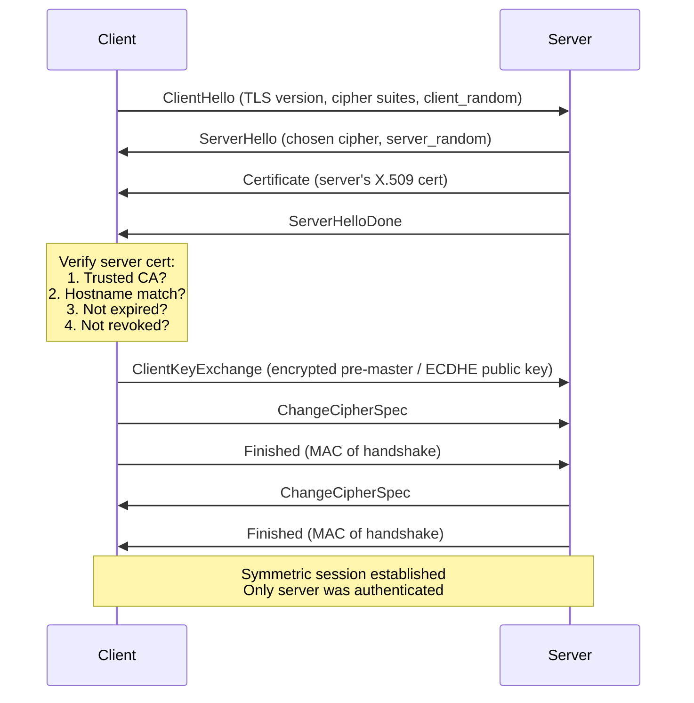
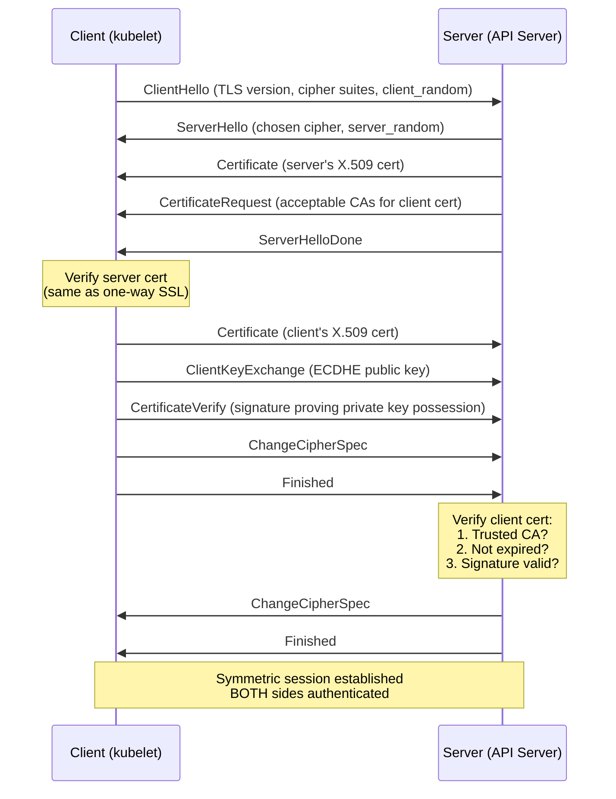

# Chapter 13 — One-Way SSL vs Mutual TLS (mTLS)

> **Section:** Microservice Vulnerabilities
> **Previous:** [Chapter 12 — Kata Containers](./12%20---%20Kata%20Containers.md)
> **Next:** [Chapter 14 — Overview of Multi-Tenancy in Kubernetes](./14%20---%20Overview%20of%20Multi%20Tenancy%20in%20Kubernetes.md)

---

## Why This Matters for CKS

Every secure Kubernetes cluster is built on a foundation of TLS. The API server, etcd, kubelets, ingress controllers, service meshes — they all speak TLS. But **not all TLS is equal**. One-way SSL proves only that the *server* is who it claims to be. Mutual TLS (mTLS) goes further: both sides present certificates, creating cryptographic proof of identity in *both directions*.

The CKS exam tests this distinction repeatedly:
- Understanding why Kubernetes components use mTLS (API server ↔ etcd, API server ↔ kubelet)
- Knowing when an Ingress uses one-way SSL vs when a service mesh enforces mTLS
- Configuring pod-to-pod encryption (Chapters 26–27) requires a solid grasp of the mTLS handshake
- Troubleshooting certificate errors on kubeadm clusters

If you don't understand the handshake, you'll make the wrong architectural decision and misconfigure certificates under exam pressure.

---

## What Is TLS?

**Transport Layer Security (TLS)** is the successor to SSL (SSL 3.0 → TLS 1.0 → 1.1 → 1.2 → 1.3). Despite "SSL" being colloquially used, modern systems run TLS 1.2 or 1.3. The protocol provides three guarantees:

| Property | Mechanism | What it prevents |
|---|---|---|
| **Confidentiality** | Symmetric encryption (AES-GCM, ChaCha20) | Eavesdropping |
| **Integrity** | HMAC / AEAD | Tampering in transit |
| **Authentication** | X.509 certificates + asymmetric crypto | Impersonation (MITM) |

TLS always starts with an **asymmetric handshake** (RSA, ECDHE) to establish a shared secret, then switches to faster **symmetric encryption** for the bulk of data transfer. This asymmetric-then-symmetric design is the key insight behind both one-way SSL and mTLS.

---

## One-Way SSL (Server Authentication Only)

### The Mental Model

In one-way SSL, only the **server proves its identity** to the client. The client remains anonymous. This is how every HTTPS website works: your browser verifies that `github.com` really is GitHub, but GitHub doesn't get a certificate from your browser in return.

```
Client (Browser)                    Server (github.com)
      |                                    |
      |---- ClientHello ------------------>|  "I speak TLS 1.3, here are my cipher suites"
      |                                    |
      |<--- ServerHello + Certificate -----| "Here's my cert (signed by DigiCert)"
      |                                    |
      | [Client verifies cert against      |
      |  its trusted CA store]             |
      |                                    |
      |---- ClientKeyExchange ------------>|  "Encrypted pre-master secret (with server's pub key)"
      |                                    |
      | [Both sides derive session keys]   |
      |                                    |
      |<==== Encrypted Application Data ==>|  Symmetric AES session begins
```

### Step-by-Step Handshake

**Step 1 — ClientHello**
The client advertises:
- Supported TLS versions (e.g., TLS 1.3)
- A random nonce (`client_random`)
- Supported cipher suites (e.g., `TLS_AES_256_GCM_SHA384`)
- Supported key-exchange groups (e.g., X25519)

**Step 2 — ServerHello + Certificate**
The server responds with:
- Chosen cipher suite
- A random nonce (`server_random`)
- Its **X.509 certificate** containing:
  - Server's public key
  - Server's identity (CN / SAN)
  - Digital signature from a Certificate Authority (CA)
  - Validity period (NotBefore / NotAfter)

**Step 3 — Client Verifies Server Certificate**
The client checks:
1. Is the cert signed by a trusted CA (in the client's trust store)?
2. Is the hostname in the cert's SAN/CN field matching the server hostname?
3. Is the cert within its validity period?
4. Is the cert revoked (CRL / OCSP)?

If any check fails → TLS handshake aborted, connection rejected.

**Step 4 — Key Exchange**
- With **RSA key exchange** (TLS 1.2): Client generates a pre-master secret, encrypts it with server's public key, sends it. Server decrypts with its private key. Both derive the symmetric session key from `pre_master_secret + client_random + server_random`.
- With **ECDHE** (TLS 1.3 default): Diffie-Hellman exchange — neither side sends the secret directly; instead they each contribute a value and independently compute the same shared secret (perfect forward secrecy).

**Step 5 — Symmetric Session**
From this point, all data is encrypted with a symmetric key (AES-256-GCM or ChaCha20-Poly1305). The asymmetric overhead is gone. The server's private key is never transmitted.

### Certificate Chain of Trust

```
Root CA (self-signed, in trust store)
    └── Intermediate CA (signed by Root CA)
            └── Server Certificate (signed by Intermediate CA)
```

The server usually sends its cert plus the intermediate CA cert(s) in the TLS handshake (the "certificate chain"). The client only needs the Root CA in its trust store — it can verify the chain step by step.

In Kubernetes, the **cluster CA** plays the role of the Root CA. `kubeadm init` generates `/etc/kubernetes/pki/ca.crt` and `ca.key`. Every component cert (API server, kubelet client, etc.) is signed by this cluster CA.

### One-Way SSL in Kubernetes

```yaml
# Ingress with TLS termination — classic one-way SSL
apiVersion: networking.k8s.io/v1
kind: Ingress
metadata:
  name: my-app-ingress
  namespace: production
spec:
  tls:
  - hosts:
    - my-app.example.com
    secretName: my-app-tls   # contains tls.crt and tls.key
  rules:
  - host: my-app.example.com
    http:
      paths:
      - path: /
        pathType: Prefix
        backend:
          service:
            name: my-app-svc
            port:
              number: 80
```

The TLS Secret:
```bash
# Create from existing cert/key
kubectl create secret tls my-app-tls \
  --cert=server.crt \
  --key=server.key \
  -n production

# What's inside
kubectl get secret my-app-tls -o yaml
# data:
#   tls.crt: <base64 PEM certificate>
#   tls.key: <base64 PEM private key>
```

Here the Ingress controller presents its certificate to the browser (one-way). The backend pod receives plain HTTP from the Ingress controller — it's TLS-terminated at the edge, not end-to-end.

---

## Mutual TLS (mTLS) — Both Sides Authenticate

### The Mental Model

In mTLS, **both the client and the server present certificates**. The server verifies the client's identity, and the client verifies the server's identity. This is the security model for all Kubernetes control plane communication.

```
Client (kubelet)                    Server (API Server)
      |                                    |
      |---- ClientHello ------------------>|
      |                                    |
      |<--- ServerHello + ServerCert ------| "Here's my API server cert"
      |     + CertificateRequest          | "I also need YOUR cert"
      |                                    |
      | [Client verifies server cert]      |
      |                                    |
      |---- ClientCertificate ------------>| "Here's my kubelet client cert"
      |---- ClientKeyExchange ------------>|
      |---- CertificateVerify ------------>| "Proof I hold the private key"
      |                                    |
      | [Server verifies client cert]      |
      |                                    |
      |<==== Encrypted Application Data ==>|  Symmetric session, both authenticated
```

### Step-by-Step mTLS Handshake

**Steps 1–3:** Same as one-way SSL (ClientHello, ServerHello + ServerCert, client verifies server cert).

**Step 4 — CertificateRequest**
The server sends an additional `CertificateRequest` message, listing:
- Acceptable CA names (which CAs it trusts for client certs)
- Acceptable certificate types

**Step 5 — Client Sends Its Certificate**
The client sends:
- Its X.509 certificate (signed by a CA the server trusts)
- A `CertificateVerify` message: a digital signature over the handshake transcript, signed with the client's private key

This proves the client **possesses the private key** matching the certificate's public key — it's not just replaying a stolen certificate.

**Step 6 — Server Verifies Client Certificate**
The server checks:
1. Is the client cert signed by a trusted CA?
2. Is the cert within validity period?
3. Is the cert revoked?
4. Does the `CertificateVerify` signature verify correctly?

If any check fails → connection rejected.

**Step 7 — Symmetric Session**
Both sides are now mutually authenticated. The symmetric session begins.

### mTLS in Kubernetes Control Plane

This is not optional — Kubernetes *requires* mTLS between its core components:

```
┌─────────────────────────────────────────────────────────────┐
│                    Kubernetes mTLS Topology                  │
├──────────────┬─────────────────────────┬────────────────────┤
│ Connection   │ Client Cert             │ Server Cert        │
├──────────────┼─────────────────────────┼────────────────────┤
│ kubectl →    │ ~/.kube/config          │ API server cert    │
│ API server   │ (client-certificate)    │ (server-side TLS)  │
├──────────────┼─────────────────────────┼────────────────────┤
│ API server → │ apiserver-etcd-         │ etcd server cert   │
│ etcd         │ client.crt              │                    │
├──────────────┼─────────────────────────┼────────────────────┤
│ API server → │ apiserver-kubelet-      │ kubelet server cert│
│ kubelet      │ client.crt              │                    │
├──────────────┼─────────────────────────┼────────────────────┤
│ kubelet →    │ kubelet.crt (node cert) │ API server cert    │
│ API server   │                         │                    │
├──────────────┼─────────────────────────┼────────────────────┤
│ scheduler →  │ scheduler.crt           │ API server cert    │
│ API server   │                         │                    │
├──────────────┼─────────────────────────┼────────────────────┤
│ controller-  │ controller-manager.crt  │ API server cert    │
│ manager →    │                         │                    │
│ API server   │                         │                    │
└──────────────┴─────────────────────────┴────────────────────┘
```

All these certs live in `/etc/kubernetes/pki/` on the control plane node:

```bash
ls /etc/kubernetes/pki/
# apiserver.crt                    # API server serving cert
# apiserver.key
# apiserver-etcd-client.crt        # API server → etcd client cert
# apiserver-etcd-client.key
# apiserver-kubelet-client.crt     # API server → kubelet client cert
# apiserver-kubelet-client.key
# ca.crt                           # Cluster CA (root of trust)
# ca.key
# etcd/
#   ca.crt                         # etcd CA (separate!)
#   server.crt
#   server.key
#   peer.crt                       # etcd peer-to-peer mTLS
#   peer.key
# front-proxy-ca.crt               # Aggregation layer CA
# front-proxy-client.crt
# sa.pub                           # Service Account signing key
# sa.key
```

### Inspecting Kubernetes mTLS Certificates

```bash
# View the API server certificate details
openssl x509 -in /etc/kubernetes/pki/apiserver.crt -text -noout
# Look for:
#   Subject: CN = kube-apiserver
#   X509v3 Subject Alternative Name:
#     DNS:kubernetes, DNS:kubernetes.default, DNS:kubernetes.default.svc,
#     DNS:kubernetes.default.svc.cluster.local, DNS:my-control-plane,
#     IP Address:10.96.0.1, IP Address:192.168.1.100

# Check cert expiry
kubeadm certs check-expiration

# Renew a specific cert
kubeadm certs renew apiserver

# View the kubelet client cert (used when API server calls kubelet)
openssl x509 -in /etc/kubernetes/pki/apiserver-kubelet-client.crt -text -noout
# Subject: O = system:masters, CN = kube-apiserver-kubelet-client
# The O= field is used for RBAC Group membership
```

---

## The Asymmetric → Symmetric Transition (Key Exchange Deep Dive)

Both one-way SSL and mTLS use the same fundamental key exchange mechanism. Understanding this is crucial for understanding *why* certificates use asymmetric crypto but sessions use symmetric:

```
┌────────────────────────────────────────────────────────────────┐
│              Why Two Types of Cryptography?                     │
├────────────────────────┬───────────────────────────────────────┤
│ Asymmetric (RSA/ECDHE) │ Symmetric (AES-256-GCM)               │
├────────────────────────┼───────────────────────────────────────┤
│ Key pair: public +     │ One shared secret key                  │
│ private key            │                                        │
├────────────────────────┼───────────────────────────────────────┤
│ ~1000x slower          │ Very fast (hardware-accelerated)       │
├────────────────────────┼───────────────────────────────────────┤
│ Used ONLY for          │ Used for ALL application data          │
│ handshake/key exchange │                                        │
├────────────────────────┼───────────────────────────────────────┤
│ Solves the key         │ Can't be used initially —              │
│ distribution problem   │ how do you share the key securely?     │
└────────────────────────┴───────────────────────────────────────┘
```

**ECDHE (Elliptic Curve Diffie-Hellman Ephemeral)** — the modern approach:

```
Client generates: private_c, public_c = private_c × G
Server generates: private_s, public_s = private_s × G

Client → Server:  public_c
Server → Client:  public_s

Client computes: shared_secret = private_c × public_s
Server computes: shared_secret = private_s × public_c
# Due to ECDH math: private_c × public_s = private_s × public_c = same shared secret!

# Neither side ever transmits the shared secret — it's computed independently.
# "Ephemeral" = new key pair generated per session → Perfect Forward Secrecy (PFS)
```

**Perfect Forward Secrecy (PFS):** Even if the server's long-term private key is compromised later, past sessions can't be decrypted because each session used a unique ephemeral key.

---

## Mermaid Diagrams

### One-Way SSL Flow



### Mutual TLS Flow



---

## One-Way SSL vs mTLS Comparison

```
┌────────────────────────┬────────────────────────┬──────────────────────────┐
│ Property               │ One-Way SSL            │ Mutual TLS (mTLS)        │
├────────────────────────┼────────────────────────┼──────────────────────────┤
│ Server authenticated   │ ✅ Yes                 │ ✅ Yes                   │
├────────────────────────┼────────────────────────┼──────────────────────────┤
│ Client authenticated   │ ❌ No (anonymous)       │ ✅ Yes                   │
├────────────────────────┼────────────────────────┼──────────────────────────┤
│ Certs needed           │ Server cert only       │ Server cert + client cert│
├────────────────────────┼────────────────────────┼──────────────────────────┤
│ Client identity        │ None (or app-level     │ Cryptographic — verified │
│                        │ auth: JWT, API key)    │ at transport layer       │
├────────────────────────┼────────────────────────┼──────────────────────────┤
│ MITM protection        │ Partial (server MITM   │ Full (both sides)        │
│                        │ prevented)             │                          │
├────────────────────────┼────────────────────────┼──────────────────────────┤
│ Complexity             │ Low                    │ Higher (cert mgmt for    │
│                        │                        │ all clients)             │
├────────────────────────┼────────────────────────┼──────────────────────────┤
│ Typical use cases      │ Public websites, APIs  │ Service-to-service,      │
│                        │ with JWT/API key auth  │ Kubernetes components,   │
│                        │                        │ zero-trust networks      │
├────────────────────────┼────────────────────────┼──────────────────────────┤
│ Kubernetes examples    │ Ingress TLS,           │ API server ↔ etcd,       │
│                        │ LoadBalancer TLS       │ API server ↔ kubelet,    │
│                        │                        │ Service mesh (Istio,     │
│                        │                        │ Linkerd, Cilium)         │
└────────────────────────┴────────────────────────┴──────────────────────────┘
```

---

## Real-World Kubernetes Scenarios

### Scenario 1: Ingress — One-Way SSL (TLS Termination)

The most common pattern for external-facing applications. The user's browser verifies the Ingress controller's certificate. The backend service receives plain HTTP.

```
Browser ──(HTTPS/one-way TLS)──► Ingress Controller ──(HTTP)──► Pod
                                  [TLS terminated here]
```

The backend pod doesn't need TLS configured at all. This is the simplest approach but means traffic inside the cluster is unencrypted.

### Scenario 2: Ingress — SSL Passthrough

Some Ingress controllers support passthrough — the TLS connection goes all the way to the pod. The pod itself terminates TLS (still one-way unless the app implements mTLS).

```
Browser ──(HTTPS)──► Ingress Controller ──(HTTPS passthrough)──► Pod
                     [no termination]                          [terminates TLS]
```

```yaml
# NGINX Ingress — SSL passthrough annotation
metadata:
  annotations:
    nginx.ingress.kubernetes.io/ssl-passthrough: "true"
```

### Scenario 3: Kubernetes API Server — mTLS Everywhere

The API server is configured with:
```yaml
# kube-apiserver static pod flags relevant to mTLS
--tls-cert-file=/etc/kubernetes/pki/apiserver.crt        # server cert
--tls-private-key-file=/etc/kubernetes/pki/apiserver.key # server key
--client-ca-file=/etc/kubernetes/pki/ca.crt              # CA to verify client certs
--etcd-certfile=/etc/kubernetes/pki/apiserver-etcd-client.crt  # client cert for etcd
--etcd-keyfile=/etc/kubernetes/pki/apiserver-etcd-client.key
--etcd-cafile=/etc/kubernetes/pki/etcd/ca.crt            # trust etcd's CA
--kubelet-client-certificate=/etc/kubernetes/pki/apiserver-kubelet-client.crt
--kubelet-client-key=/etc/kubernetes/pki/apiserver-kubelet-client.key
```

The `--client-ca-file` flag is what enables mTLS: the API server requests and verifies client certificates from anyone connecting to it.

### Scenario 4: Service Mesh mTLS (Istio)

Service meshes automate mTLS between pods at the sidecar level:

```yaml
# Istio PeerAuthentication — enforce mTLS for all pods in namespace
apiVersion: security.istio.io/v1beta1
kind: PeerAuthentication
metadata:
  name: default
  namespace: production
spec:
  mtls:
    mode: STRICT   # Reject any non-mTLS connection
```

Under the hood, Istio's Envoy sidecars:
1. Get issued short-lived X.509 certs (SPIFFE SVIDs) by Istiod CA
2. Automatically perform mTLS handshakes with all other sidecars
3. Rotate certs every 24 hours (configurable)

The application code knows nothing about TLS — it's transparent at the sidecar layer.

### Scenario 5: etcd Peer-to-Peer mTLS

In multi-control-plane HA clusters, etcd members communicate with each other via mTLS:

```bash
# etcd peer cert (used when etcd nodes communicate)
ls /etc/kubernetes/pki/etcd/
# ca.crt    ca.key
# peer.crt  peer.key      ← mTLS peer authentication
# server.crt server.key   ← etcd server cert
# healthcheck-client.crt  ← client cert for health checks
```

The `peer.crt` is used both as client cert (when connecting to other etcd members) and verified as server cert (when accepting connections). True mutual authentication.

---

## Common Mistakes and Exam Traps

### ❌ Mistake 1: Thinking HTTPS = mTLS

HTTPS in your browser is **one-way SSL**. The server is authenticated; you (the client) are not. mTLS requires explicit configuration of client certificates. Don't assume any TLS connection is mutual.

### ❌ Mistake 2: Confusing TLS termination with end-to-end encryption

When Ingress terminates TLS, the pod receives plain HTTP. If you need end-to-end encryption all the way to the pod, you either need SSL passthrough or the service mesh mTLS pattern.

### ❌ Mistake 3: Missing the `--client-ca-file` flag

The API server will serve TLS without `--client-ca-file` (one-way SSL), but to actually *verify* client certs (mTLS), this flag is required. Without it, kubectl connections authenticated by client certs will fail.

### ❌ Mistake 4: Forgetting the etcd CA is separate

The etcd cluster uses its own CA (`/etc/kubernetes/pki/etcd/ca.crt`), separate from the main cluster CA. The API server's etcd client cert must be signed by the etcd CA, not the cluster CA. Mixing them up breaks etcd connectivity.

### ❌ Mistake 5: Expired certificates

A common production failure. Know how to check:
```bash
kubeadm certs check-expiration
# Output shows expiration dates for all cluster certs

# Or manually
openssl x509 -in /etc/kubernetes/pki/apiserver.crt -noout -dates
# notBefore=Dec 1 00:00:00 2024 GMT
# notAfter=Dec 1 00:00:00 2025 GMT
```

### ❌ Mistake 6: SAN vs CN for hostname verification

Modern TLS ignores the `CN` (Common Name) field for hostname verification — only **Subject Alternative Names (SANs)** are checked. When generating certs, always specify SANs explicitly:

```bash
# Bad: only CN, no SANs
openssl req -new -key server.key -subj "/CN=my-service"

# Good: with SANs
openssl req -new -key server.key \
  -subj "/CN=my-service" \
  -addext "subjectAltName=DNS:my-service,DNS:my-service.default.svc.cluster.local,IP:10.96.100.50"
```

---

## Certificate Generation Quick Reference

```bash
# Step 1: Generate a CA (Certificate Authority)
openssl genrsa -out ca.key 2048
openssl req -x509 -new -nodes -key ca.key \
  -subj "/CN=my-ca" \
  -days 3650 \
  -out ca.crt

# Step 2: Generate server private key + CSR
openssl genrsa -out server.key 2048
openssl req -new -key server.key \
  -subj "/CN=my-service" \
  -out server.csr

# Step 3: Sign the server cert with the CA (include SANs)
cat > server-ext.cnf <<EOF
subjectAltName = DNS:my-service, DNS:my-service.default.svc.cluster.local
EOF
openssl x509 -req -in server.csr \
  -CA ca.crt -CAkey ca.key -CAcreateserial \
  -extfile server-ext.cnf \
  -days 365 \
  -out server.crt

# For mTLS: also generate a CLIENT cert (same CA or different)
openssl genrsa -out client.key 2048
openssl req -new -key client.key \
  -subj "/CN=my-client/O=my-group" \
  -out client.csr
openssl x509 -req -in client.csr \
  -CA ca.crt -CAkey ca.key -CAcreateserial \
  -days 365 \
  -out client.crt

# Verify the chain
openssl verify -CAfile ca.crt server.crt
openssl verify -CAfile ca.crt client.crt

# Test one-way SSL connection
openssl s_client -connect my-service:443 -CAfile ca.crt

# Test mTLS connection (provide client cert)
openssl s_client -connect my-service:443 \
  -CAfile ca.crt \
  -cert client.crt \
  -key client.key
```

---

## CertificateSigningRequest (CSR) in Kubernetes

Kubernetes has a built-in API for certificate signing — this is used for kubelet TLS bootstrapping and for issuing user certs:

```bash
# Generate key and CSR
openssl genrsa -out jane.key 2048
openssl req -new -key jane.key -subj "/CN=jane/O=developers" -out jane.csr

# Create a Kubernetes CSR object
cat <<EOF | kubectl apply -f -
apiVersion: certificates.k8s.io/v1
kind: CertificateSigningRequest
metadata:
  name: jane
spec:
  request: $(cat jane.csr | base64 | tr -d '\n')
  signerName: kubernetes.io/kube-apiserver-client
  expirationSeconds: 86400
  usages:
  - client auth
EOF

# Approve it
kubectl certificate approve jane

# Retrieve the signed cert
kubectl get csr jane -o jsonpath='{.status.certificate}' | base64 -d > jane.crt

# Now jane.crt + jane.key = a valid mTLS client cert for the Kubernetes API
```

The `signerName: kubernetes.io/kube-apiserver-client` tells Kubernetes to sign this as a client cert (for authenticating to the API server), creating mTLS capability for the `jane` user.

---

## Connection to Chapters 26–27 (Pod-to-Pod Encryption)

This chapter is the theoretical foundation for the pod-to-pod encryption chapters later in this section. Here's how it connects:

```
One-Way SSL / mTLS concepts (this chapter)
         ↓
Service Mesh mTLS patterns
         ↓
Chapter 26 — Pod-to-Pod Encryption (theory: how mTLS works between pods)
         ↓
Chapter 27 — Implementing mTLS with tools (Cilium, Istio, Linkerd)
```

Key concepts to remember:
- **SPIFFE (Secure Production Identity Framework for Everyone):** A standard for workload identity certificates used by service meshes. Each pod gets a SPIFFE Verifiable Identity Document (SVID) — an X.509 cert encoding its identity as `spiffe://cluster-name/ns/namespace/sa/service-account`.
- **SPIRE:** The reference SPIFFE implementation. Cilium and Istio have their own CA implementations compatible with SPIFFE.
- mTLS between pods replaces the network-level trust ("any pod in the cluster can talk to any other pod") with cryptographic identity-based trust.

---

## Quick Reference Summary

```
┌─────────────────────────────────────────────────────────────────────┐
│                    TLS Quick Reference                               │
├─────────────────┬───────────────────────────────────────────────────┤
│ One-Way SSL     │ Server cert only                                   │
│                 │ Client is anonymous                                │
│                 │ Used by: browsers, public APIs, Ingress TLS        │
├─────────────────┼───────────────────────────────────────────────────┤
│ Mutual TLS      │ Server cert + client cert                          │
│                 │ Both parties cryptographically verified            │
│                 │ Used by: K8s components, service meshes,           │
│                 │ zero-trust networks                                │
├─────────────────┼───────────────────────────────────────────────────┤
│ Handshake order │ 1. ClientHello                                     │
│                 │ 2. ServerHello + ServerCert                        │
│                 │ 3. [mTLS only] CertificateRequest                  │
│                 │ 4. [mTLS only] ClientCertificate + CertVerify      │
│                 │ 5. Key exchange (ECDHE)                            │
│                 │ 6. ChangeCipherSpec + Finished (both)              │
│                 │ 7. Symmetric session begins                        │
├─────────────────┼───────────────────────────────────────────────────┤
│ K8s cert paths  │ /etc/kubernetes/pki/                               │
│                 │   ca.crt, ca.key (cluster CA)                      │
│                 │   apiserver.crt, apiserver.key                     │
│                 │   apiserver-etcd-client.crt (mTLS to etcd)         │
│                 │   apiserver-kubelet-client.crt (mTLS to kubelet)   │
│                 │   etcd/ca.crt (separate etcd CA)                   │
├─────────────────┼───────────────────────────────────────────────────┤
│ Key commands    │ kubeadm certs check-expiration                     │
│                 │ kubeadm certs renew <cert-name>                    │
│                 │ openssl x509 -in cert.crt -text -noout             │
│                 │ openssl s_client -connect host:443 -CAfile ca.crt  │
│                 │ kubectl certificate approve <csr-name>             │
├─────────────────┼───────────────────────────────────────────────────┤
│ Enable mTLS on  │ --client-ca-file=/etc/kubernetes/pki/ca.crt        │
│ API server      │ (tells API server to request + verify client certs)│
└─────────────────┴───────────────────────────────────────────────────┘
```

---

## CKS Exam Tips

**Know this cold:**
- One-way SSL = server cert only. mTLS = both certs. This distinction appears in almost every TLS-related question.
- The API server's `--client-ca-file` flag is what makes connections to it use mTLS.
- etcd and the main cluster each have their own separate CA.

**Likely exam tasks:**
- Check certificate expiration: `kubeadm certs check-expiration`
- Renew an expired cert: `kubeadm certs renew apiserver`
- Identify what type of TLS a component is using from its configuration flags
- Approve a CertificateSigningRequest: `kubectl certificate approve <name>`
- Inspect a cert: `openssl x509 -in /etc/kubernetes/pki/apiserver.crt -text -noout | grep -A5 "Subject Alternative"`

**Gotcha:** `kubectl` uses client certificate authentication from `~/.kube/config` — this makes kubectl→API server an mTLS connection. The `client-certificate` and `client-key` in the kubeconfig are the client cert/key pair.

**Gotcha:** When you see a TLS handshake error mentioning "certificate signed by unknown authority", it means the CA cert is not in the trust store. Check that `--client-ca-file` or `--etcd-cafile` points to the correct CA file.

**Gotcha:** `NotBefore` violations happen when there's a clock skew between nodes. If cert expiry checks look fine but TLS still fails, check `date` on both nodes and ensure NTP is running.

---

## Summary

TLS secures Kubernetes at every layer. One-way SSL proves server identity — the client verifies the server's certificate but the server accepts any client anonymously. This is how public HTTPS works, and it's the pattern used by Kubernetes Ingress controllers for external traffic.

Mutual TLS extends this by requiring the client to also present a certificate, creating bidirectional cryptographic authentication. This is the foundation of all Kubernetes control plane security: every connection between API server, etcd, kubelet, scheduler, and controller-manager is an mTLS connection. The cluster CA at `/etc/kubernetes/pki/ca.crt` is the root of trust for most of these; etcd uses its own separate CA.

Understanding the handshake mechanics — asymmetric key exchange (ECDHE) → shared symmetric session key (AES-256-GCM) → encrypted application data — demystifies why certificates are needed and what each component is actually doing when it "does TLS". This foundation directly enables the pod-to-pod encryption patterns you'll see in Chapters 26 and 27, where service meshes like Cilium and Istio automate mTLS between every microservice using short-lived SPIFFE certificates.

---

## What's Next

**[Chapter 14 — Overview of Multi-Tenancy in Kubernetes →](./14%20---%20Overview%20of%20Multi%20Tenancy%20in%20Kubernetes.md)**

With the encryption and sandboxing layers covered, the next major topic is multi-tenancy: running multiple teams or customers on a shared Kubernetes cluster. Chapter 14 provides the conceptual overview — the threat model, the isolation goals, and the spectrum of approaches from namespace isolation all the way to separate clusters. This sets the stage for Chapters 15–25, which cover each isolation mechanism in depth.
