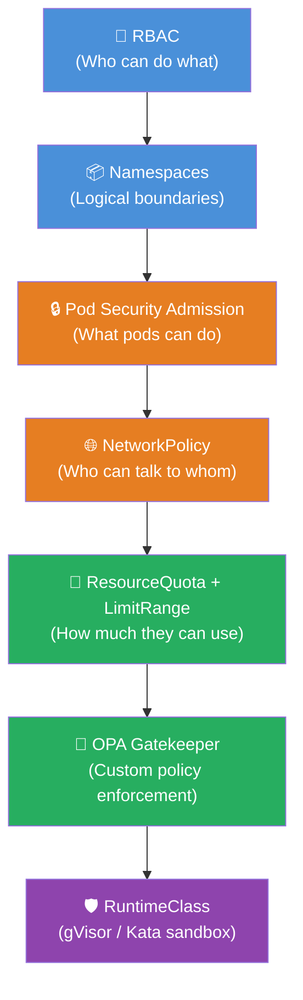

# Chapter 14 — Overview of Multi-Tenancy in Kubernetes

> **Section:** Microservice Vulnerabilities
> **Previous:** [Chapter 13 — One-Way SSL vs Mutual TLS](./13%20---%20One%20Way%20SSL%20vs%20Mutual%20SSL.md)
> **Next:** [Chapter 15 — Different Types of Multi-Tenancy in Kubernetes](./15%20---%20Different%20Types%20of%20Multi%20Tenancy%20in%20Kubernetes.md)

---

## Why This Matters for CKS

Multi-tenancy is one of the largest topic clusters in the CKS exam — Chapters 14 through 25 all orbit around it. The exam expects you to understand not just *what* the isolation tools are, but *why* they exist and *when* each one is appropriate. This chapter builds that conceptual foundation.

Real CKS tasks drawn from this topic include:
- Creating namespaces with ResourceQuota and LimitRange to prevent one team from starving another
- Writing NetworkPolicy rules to enforce tenant-level network isolation
- Configuring RBAC so tenants can only see and modify their own resources
- Identifying missing isolation controls in a given cluster configuration
- Understanding the threat model: what can a tenant do if isolation fails?

The multi-tenancy chapters connect back to almost everything covered earlier: admission controllers (Chapters 2–7) enforce policies; Pod Security Admission (Chapter 5) restricts what tenant pods can do; OPA Gatekeeper (Chapter 7) adds custom isolation rules; mTLS (Chapter 13) secures inter-tenant communication; and sandboxing (Chapters 10–12) prevents container escapes.

---

## What Is a Tenant?

In Kubernetes, a **tenant** is any distinct unit of work that needs to be isolated from other units. Tenants can be:

| Tenant Type | Example | Primary Isolation Concern |
|---|---|---|
| **Teams** | Frontend, Backend, Data teams in one org | Resource fairness, access control |
| **Environments** | dev, staging, production | Configuration and secret isolation |
| **Customers** | SaaS customers sharing one cluster | Security, data privacy, compliance |
| **Applications** | Microservices with different security profiles | Blast radius containment |
| **Departments** | Engineering, Finance, HR | RBAC and network segmentation |

The key defining property of a tenant: **its resources and data must be isolated from other tenants**, both for security (one tenant cannot access another's data) and for stability (one tenant cannot exhaust resources needed by others).

---

## The Anti-Pattern: One Cluster Per Tenant

The naive solution to tenant isolation is to give each tenant their own Kubernetes cluster. This seems safe — if clusters are completely separate, there's no isolation problem. But it doesn't scale:

```
❌ One Cluster Per Tenant (Anti-Pattern)
════════════════════════════════════════

Tenant A     Tenant B     Tenant C     Tenant D
┌────────┐   ┌────────┐   ┌────────┐   ┌────────┐
│Cluster │   │Cluster │   │Cluster │   │Cluster │
│   A    │   │   B    │   │   C    │   │   D    │
│        │   │        │   │        │   │        │
│3 nodes │   │3 nodes │   │3 nodes │   │3 nodes │
│ idle   │   │ idle   │   │ idle   │   │ idle   │
└────────┘   └────────┘   └────────┘   └────────┘

Problems:
• 4× the control plane overhead
• 4× the upgrade/patching work
• Idle nodes in every cluster (wasted capacity)
• 4 separate monitoring/logging stacks
• Certificate management multiplied
• No cross-tenant resource pooling
```

With 50 customers, you have 50 clusters to upgrade when a CVE drops. With 500 customers, it's operationally impossible.

```
✅ Multi-Tenant Cluster (Target Pattern)
════════════════════════════════════════

          Single Kubernetes Cluster
┌─────────────────────────────────────────┐
│ Namespace: tenant-a  Namespace: tenant-c│
│  [pods]  [services]   [pods]  [services]│
│                                         │
│ Namespace: tenant-b  Namespace: tenant-d│
│  [pods]  [services]   [pods]  [services]│
│                                         │
│ Shared Nodes (efficiently packed)       │
│ ┌──────┐  ┌──────┐  ┌──────┐           │
│ │Node 1│  │Node 2│  │Node 3│           │
│ └──────┘  └──────┘  └──────┘           │
└─────────────────────────────────────────┘

Benefits:
• 1 control plane to manage
• Higher node utilization (bin packing)
• Single upgrade/patch cycle
• Centralized observability
• Resource pooling (burst capacity)
```

---

## The Multi-Tenancy Threat Model

Before designing isolation, you must understand what you're defending against. In a multi-tenant Kubernetes cluster, the threats come from **within**:

```
Threat Matrix — Multi-Tenancy
══════════════════════════════

1. NOISY NEIGHBOR (Resource Starvation)
   Tenant A runs a memory leak → evicts Tenant B's pods
   Defense: ResourceQuota, LimitRange, Priority Classes

2. LATERAL MOVEMENT (Cross-Namespace Access)
   Tenant A pod calls Tenant B's Service ClusterIP directly
   Defense: NetworkPolicy (deny cross-namespace by default)

3. DATA EXFILTRATION (Secret/ConfigMap Access)
   Tenant A Service Account reads Tenant B's Secrets
   Defense: RBAC (namespace-scoped roles), PSA (no hostPath)

4. PRIVILEGE ESCALATION (Container Escape)
   Tenant A runs privileged container → escapes to host
   Defense: PSA restricted profile, RuntimeClass (gVisor/Kata)

5. DNS POISONING (Service Discovery Abuse)
   Tenant A floods kube-dns → degrades resolution for all
   Defense: DNS rate limiting, separate DNS zones

6. API SERVER ABUSE (Request Flooding)
   Tenant A sends 10,000 watch requests → starves API server
   Defense: API Priority and Fairness (APF), RBAC restrictions

7. CONTROL PLANE PRIVILEGE ABUSE
   Tenant A's workload mounts /etc/kubernetes or hostPID
   Defense: PSA, OPA Gatekeeper, admission controllers
```

Not all of these threats have the same likelihood or impact. Your isolation design should be proportional to the trust level between tenants:

```
Trust Spectrum
══════════════

High Trust ◄────────────────────────────► Low Trust

Same team,    Different    Different     Untrusted
dev/staging   teams,       business      external
separation    same org     units         customers
              
Namespace     RBAC +        Strong        VM-level
isolation     NetPol        isolation     isolation
alone may     usually       required      (Kata/gVisor)
suffice       sufficient                  may be needed
```

---

## The Multi-Tenancy Isolation Stack

Kubernetes provides a layered set of isolation mechanisms. Think of them as concentric rings of defense:



| Layer | Mechanism | Prevents |
|---|---|---|
| Identity | RBAC | Unauthorized API access |
| Boundary | Namespaces | Resource naming conflicts |
| Pod behavior | PSA / OPA | Privilege escalation, host access |
| Network | NetworkPolicy | Lateral movement |
| Resources | ResourceQuota / LimitRange | Noisy neighbor starvation |
| Custom | OPA Gatekeeper | Policy violations |
| Kernel | gVisor / Kata | Container escape to host |

No single layer is sufficient. Defense in depth — using all relevant layers together — is the correct approach.

---

## The Building Analogy

Kubernetes multi-tenancy maps cleanly to a shared office building:

```
┌─────────────────────────────────────────────────────────────────┐
│                      Office Building                             │
│                   (Kubernetes Cluster)                           │
│                                                                  │
│  ┌──────────────────┐    ┌──────────────────┐                   │
│  │   Floor 3        │    │   Floor 4        │                   │
│  │ (Namespace: HR)  │    │ (Namespace: Eng) │                   │
│  │                  │    │                  │                   │
│  │ Desks = Pods     │    │ Desks = Pods     │                   │
│  │ Files = Secrets  │    │ Files = Secrets  │                   │
│  │ Phone = Service  │    │ Phone = Service  │                   │
│  └──────────────────┘    └──────────────────┘                   │
│                                                                  │
│  Access Badge = RBAC (only HR can access Floor 3)               │
│  Fire Doors = NetworkPolicy (limit floor-to-floor traffic)      │
│  Power Circuit Breakers = ResourceQuota (no floor takes all)    │
│  Security Guard at Lobby = Admission Controllers                 │
│  Elevators/Parking = Cluster-wide resources (nodes, LBs)        │
│                                                                  │
│  Shared Infrastructure (Nodes):                                  │
│  ┌──────────┐  ┌──────────┐  ┌──────────┐                       │
│  │  Node 1  │  │  Node 2  │  │  Node 3  │                       │
│  │ (Floor 1)│  │ (Floor 2)│  │ (Parking)│                       │
│  └──────────┘  └──────────┘  └──────────┘                       │
└─────────────────────────────────────────────────────────────────┘
```

Just as office tenants share elevators and parking lots but have locked offices, Kubernetes tenants share nodes and networking infrastructure but have logically isolated namespaces with controlled access.

---

## Namespace Isolation — The Foundation

Namespaces are Kubernetes's primary multi-tenancy boundary. They provide:

1. **Naming scope**: Resources with the same name can exist in different namespaces (`frontend` pod in `tenant-a` and `tenant-b` don't conflict)
2. **RBAC scope**: A Role binds to a namespace; a ClusterRole binds cluster-wide
3. **ResourceQuota scope**: Quotas are per-namespace
4. **NetworkPolicy scope**: Policies apply within a namespace (and can control cross-namespace traffic)
5. **Secret isolation**: Secrets are namespace-scoped; a pod can only mount Secrets from its own namespace

However, namespaces alone are **not** sufficient isolation. Without additional controls, a pod in `tenant-a` can:
- Call the Kubernetes API (if its SA has permissions)
- Connect to pods in `tenant-b` via ClusterIP (no NetworkPolicy = open access)
- Consume all cluster memory (no ResourceQuota)

Namespaces are the *canvas* for isolation; RBAC, NetworkPolicy, and ResourceQuota are the actual *paint*.

### Creating Tenant Namespaces

```bash
# Create a namespace for each tenant
kubectl create namespace tenant-a
kubectl create namespace tenant-b
kubectl create namespace tenant-c

# Label namespaces for policy targeting
kubectl label namespace tenant-a \
  tenant=a \
  environment=production \
  pod-security.kubernetes.io/enforce=restricted \
  pod-security.kubernetes.io/enforce-version=latest

# View namespace labels (used by NetworkPolicy selectors)
kubectl get namespace tenant-a --show-labels
```

---

## RBAC for Multi-Tenancy

RBAC is the access control layer. Each tenant should have:
1. A dedicated namespace
2. A service account per application
3. Roles that grant only what's needed within the namespace
4. No ClusterRole bindings unless absolutely necessary

```yaml
# ── Tenant A: RBAC Setup ──────────────────────────────────────────

# Role: can manage their own pods, services, deployments
apiVersion: rbac.authorization.k8s.io/v1
kind: Role
metadata:
  name: tenant-a-developer
  namespace: tenant-a
rules:
- apiGroups: ["", "apps"]
  resources: ["pods", "pods/log", "services", "deployments", "configmaps"]
  verbs: ["get", "list", "watch", "create", "update", "patch", "delete"]
- apiGroups: [""]
  resources: ["secrets"]
  verbs: ["get", "list"]       # Read secrets, but not create/delete
---
# RoleBinding: bind a user or group to the role
apiVersion: rbac.authorization.k8s.io/v1
kind: RoleBinding
metadata:
  name: tenant-a-developer-binding
  namespace: tenant-a
subjects:
- kind: User
  name: alice@tenant-a.com    # authenticates via OIDC/cert
  apiGroup: rbac.authorization.k8s.io
- kind: Group
  name: tenant-a-team          # all members of this group
  apiGroup: rbac.authorization.k8s.io
roleRef:
  kind: Role
  name: tenant-a-developer
  apiGroup: rbac.authorization.k8s.io
```

Key RBAC principles for multi-tenancy:
- **Least privilege**: Only grant what each tenant actually needs
- **No cross-namespace roles**: Never bind `tenant-a`'s users to roles in `tenant-b`
- **Restrict SA permissions**: Default service accounts should have no permissions
- **No wildcard verbs**: Avoid `verbs: ["*"]` — be explicit

```bash
# Check what a tenant user can do
kubectl auth can-i list pods --namespace tenant-a --as alice@tenant-a.com
kubectl auth can-i list pods --namespace tenant-b --as alice@tenant-a.com
# Should be: yes / no

# Audit all RBAC bindings
kubectl get rolebindings,clusterrolebindings --all-namespaces \
  -o custom-columns='KIND:.kind,NAMESPACE:.metadata.namespace,NAME:.metadata.name,ROLE:.roleRef.name,SUBJECTS:.subjects'
```

---

## Resource Quotas — Preventing Noisy Neighbors

Without ResourceQuota, one tenant's workload can consume all cluster resources. ResourceQuota enforces per-namespace limits:

```yaml
# ResourceQuota for tenant-a namespace
apiVersion: v1
kind: ResourceQuota
metadata:
  name: tenant-a-quota
  namespace: tenant-a
spec:
  hard:
    # Compute resources
    requests.cpu: "10"          # Max 10 CPU cores requested
    requests.memory: 20Gi       # Max 20 GiB memory requested
    limits.cpu: "20"            # Max 20 CPU cores limited
    limits.memory: 40Gi         # Max 40 GiB memory limited
    # Object counts
    pods: "50"                  # Max 50 pods
    services: "20"              # Max 20 services
    persistentvolumeclaims: "10" # Max 10 PVCs
    secrets: "30"               # Max 30 secrets
    configmaps: "30"
    # LoadBalancer services are expensive
    services.loadbalancers: "2"
    services.nodeports: "0"     # No NodePort services allowed
```

```bash
# Check quota usage
kubectl describe resourcequota tenant-a-quota -n tenant-a
# Name:                    tenant-a-quota
# Namespace:               tenant-a
# Resource                 Used  Hard
# --------                 ---   ---
# limits.cpu               4     20
# limits.memory            8Gi   40Gi
# pods                     12    50
# requests.cpu             2     10
# requests.memory          4Gi   20Gi
```

**LimitRange** complements ResourceQuota by enforcing defaults and limits *per pod/container*, not just namespace-wide:

```yaml
# LimitRange: every pod must have resource requests/limits
apiVersion: v1
kind: LimitRange
metadata:
  name: tenant-a-limits
  namespace: tenant-a
spec:
  limits:
  - type: Container
    default:           # Applied if container doesn't specify limits
      cpu: "500m"
      memory: "512Mi"
    defaultRequest:    # Applied if container doesn't specify requests
      cpu: "100m"
      memory: "128Mi"
    max:               # Container cannot exceed these
      cpu: "4"
      memory: "8Gi"
    min:               # Container must request at least these
      cpu: "50m"
      memory: "64Mi"
  - type: PersistentVolumeClaim
    max:
      storage: "50Gi"
    min:
      storage: "1Gi"
```

Without LimitRange, a tenant could create a pod with no resource requests, making it invisible to the scheduler's resource accounting — it could consume unbounded memory.

---

## Network Policies — Traffic Isolation

Without NetworkPolicy, all pods in a cluster can communicate with all other pods. For multi-tenancy, you need default-deny policies:

```yaml
# ── Default Deny All in tenant-a ─────────────────────────────────
apiVersion: networking.k8s.io/v1
kind: NetworkPolicy
metadata:
  name: default-deny-all
  namespace: tenant-a
spec:
  podSelector: {}      # Selects ALL pods in namespace
  policyTypes:
  - Ingress
  - Egress
```

Then selectively allow what's needed:

```yaml
# Allow tenant-a pods to communicate within namespace
apiVersion: networking.k8s.io/v1
kind: NetworkPolicy
metadata:
  name: allow-intra-namespace
  namespace: tenant-a
spec:
  podSelector: {}
  policyTypes:
  - Ingress
  - Egress
  ingress:
  - from:
    - podSelector: {}       # Any pod in THIS namespace (tenant-a)
  egress:
  - to:
    - podSelector: {}       # Any pod in THIS namespace (tenant-a)
  # Also allow DNS
  - ports:
    - protocol: UDP
      port: 53
    - protocol: TCP
      port: 53
```

```yaml
# Allow egress to Kubernetes API server (if needed by tenant)
apiVersion: networking.k8s.io/v1
kind: NetworkPolicy
metadata:
  name: allow-apiserver-egress
  namespace: tenant-a
spec:
  podSelector: {}
  policyTypes:
  - Egress
  egress:
  - ports:
    - port: 443
      protocol: TCP
    - port: 6443
      protocol: TCP
```

The critical rule: **tenant-a pods should never be able to reach tenant-b pods** without an explicit NetworkPolicy allowing it:

```bash
# Verify cross-tenant traffic is blocked
# From a pod in tenant-a, try to reach tenant-b service
kubectl exec -n tenant-a debug-pod -- curl -m 3 http://tenant-b-service.tenant-b.svc.cluster.local
# Should time out: curl: (28) Connection timed out after 3000 milliseconds
```

---

## The Benefits of Multi-Tenancy (Structured)

Kubernetes multi-tenancy delivers measurable operational advantages:

```
┌─────────────────────────────────────────────────────────────────┐
│              Multi-Tenancy Benefits vs. Costs                    │
├──────────────────────────┬──────────────────────────────────────┤
│ BENEFITS                 │ COSTS / CHALLENGES                   │
├──────────────────────────┼──────────────────────────────────────┤
│ Cost Efficiency          │ Isolation complexity                  │
│ • Shared control plane   │ • More policies to write             │
│ • Higher node util.      │ • More RBAC to manage                │
│ • No duplicate infra     │ • Harder to debug cross-tenant issues│
├──────────────────────────┼──────────────────────────────────────┤
│ Operational Simplicity   │ Blast radius risk                    │
│ • Single upgrade path    │ • Control plane failures affect all  │
│ • Central monitoring     │ • Shared kernel = escape risk        │
│ • Unified policy mgmt    │ • Noisy neighbor if quotas missing   │
├──────────────────────────┼──────────────────────────────────────┤
│ Resource Efficiency      │ Compliance complexity                │
│ • Bin packing across     │ • Data residency requirements        │
│   tenants                │ • Regulatory isolation mandates      │
│ • Burst capacity pooling │ • Audit trail per tenant             │
└──────────────────────────┴──────────────────────────────────────┘
```

### When Multi-Tenancy Is Worth It

Multi-tenancy is the right choice when:
- You have **many tenants** (> 5) who are too small to justify dedicated clusters
- Tenants are **relatively trusted** (same organization, known customers)
- You have **strong operational maturity** to implement and monitor the isolation controls
- **Cost efficiency** is a primary driver
- **Regulatory requirements** don't mandate hard cluster separation

Multi-tenancy may be the wrong choice when:
- Tenants are **completely untrusted** (public, anonymous users)
- Tenants have **conflicting regulatory requirements** (e.g., HIPAA tenant + non-HIPAA tenant)
- Tenants run **wildly different resource profiles** (one tenant has GPU workloads, others don't)
- Your team **lacks expertise** to implement and maintain the isolation controls properly

---

## Multi-Tenancy Architecture Patterns

### Pattern 1: Namespace-per-Team (Soft Multi-Tenancy)

```
cluster/
  namespace: platform-team/
  namespace: backend-team/
  namespace: frontend-team/
  namespace: data-team/

Isolation: RBAC + NetworkPolicy + ResourceQuota
Trust: High (same organization)
Suitable for: Internal teams
```

### Pattern 2: Namespace-per-Customer (Soft Multi-Tenancy)

```
cluster/
  namespace: customer-acme/
  namespace: customer-globex/
  namespace: customer-initech/

Isolation: RBAC + NetworkPolicy + ResourceQuota + PSA restricted
Trust: Medium (known customers, contractual relationship)
Suitable for: B2B SaaS with dozens to hundreds of customers
```

### Pattern 3: Virtual Clusters (Hard Multi-Tenancy)

Tools like **vcluster** create a fully functional Kubernetes API server inside a namespace. Each tenant gets their own virtual cluster with its own API, RBAC, and resources, but all running on shared physical nodes.

```
cluster/
  namespace: vcluster-tenant-a/   (virtual cluster A)
  namespace: vcluster-tenant-b/   (virtual cluster B)

Isolation: Full virtual cluster isolation + host-level NetworkPolicy
Trust: Low (customers who need strong isolation guarantees)
Suitable for: Platform engineering products, "Kubernetes-as-a-service"
```

### Pattern 4: Dedicated Node Pools (Hard Multi-Tenancy)

Use node taints and tolerations to pin sensitive tenants to dedicated nodes:

```yaml
# Node taint — only tenant-a pods can run here
kubectl taint nodes node-1 node-2 tenant=a:NoSchedule

# Pod toleration — opt in to running on tenant-a nodes
spec:
  tolerations:
  - key: "tenant"
    operator: "Equal"
    value: "a"
    effect: "NoSchedule"
  nodeSelector:
    tenant: a
```

This prevents other tenants' pods from being scheduled on the same physical node, eliminating the shared-kernel risk at the node level (covered in depth in Chapter 22).

---

## Isolation Checklist by Threat

Use this as a pre-deployment audit:

```
┌─────────────────────────────────────────────────────────────────┐
│              Multi-Tenancy Isolation Checklist                   │
├─────────────────────────────────────────────────────────────────┤
│ IDENTITY & ACCESS                                               │
│ □ Separate namespace per tenant                                  │
│ □ RBAC Roles (not ClusterRoles) for tenant users                │
│ □ Default ServiceAccount has no permissions                     │
│ □ No wildcard permissions (verbs: ["*"])                        │
│ □ kubectl auth can-i tested for cross-tenant access             │
├─────────────────────────────────────────────────────────────────┤
│ POD SECURITY                                                    │
│ □ Pod Security Admission: enforce=restricted per tenant NS      │
│ □ No privileged containers                                      │
│ □ No hostPID / hostNetwork / hostIPC                           │
│ □ No hostPath volume mounts                                     │
│ □ Containers run as non-root                                    │
├─────────────────────────────────────────────────────────────────┤
│ NETWORK                                                         │
│ □ Default-deny NetworkPolicy in every tenant namespace          │
│ □ Intra-namespace traffic explicitly allowed                    │
│ □ Cross-namespace traffic blocked unless explicitly needed      │
│ □ Egress to external IPs restricted                            │
│ □ DNS egress (UDP/TCP port 53) explicitly allowed               │
├─────────────────────────────────────────────────────────────────┤
│ RESOURCES                                                       │
│ □ ResourceQuota on every tenant namespace                       │
│ □ LimitRange to enforce per-container defaults                  │
│ □ PriorityClass configured (high-priority system pods)         │
│ □ No NodePort or LoadBalancer without approval                  │
├─────────────────────────────────────────────────────────────────┤
│ DATA                                                            │
│ □ Secrets are namespace-scoped (verify no ClusterRole reads)   │
│ □ PersistentVolumes not shared across namespaces               │
│ □ etcd encryption at rest enabled (Chapter 9)                  │
├─────────────────────────────────────────────────────────────────┤
│ OBSERVABILITY                                                   │
│ □ Audit logging enabled (who did what in each namespace)       │
│ □ Metrics per namespace (resource consumption visible)          │
│ □ Alerts on ResourceQuota approaching limits                   │
└─────────────────────────────────────────────────────────────────┘
```

---

## Kubernetes Built-In Multi-Tenancy Primitives

A quick reference for all Kubernetes-native mechanisms that support multi-tenancy:

| Primitive | API | Scope | Purpose |
|---|---|---|---|
| Namespace | `v1/Namespace` | Cluster | Logical boundary |
| ResourceQuota | `v1/ResourceQuota` | Namespace | Limit resource consumption |
| LimitRange | `v1/LimitRange` | Namespace | Per-pod defaults + limits |
| NetworkPolicy | `networking.k8s.io/v1` | Namespace | Traffic isolation |
| Role | `rbac.authorization.k8s.io/v1` | Namespace | Access control (NS-scoped) |
| RoleBinding | `rbac.authorization.k8s.io/v1` | Namespace | Bind role to subject |
| PodDisruptionBudget | `policy/v1` | Namespace | Availability guarantee |
| PriorityClass | `scheduling.k8s.io/v1` | Cluster | Scheduling priority |
| RuntimeClass | `node.k8s.io/v1` | Cluster | Sandbox selection |
| Pod Security Admission | Built-in | Namespace | Pod security profiles |

---

## Common Mistakes and Exam Traps

### ❌ Mistake 1: Thinking namespaces alone are sufficient

A newly created namespace with no additional controls is nearly useless as an isolation boundary. Pods in it can still consume unlimited resources, talk to any other pod, and use privileged capabilities. Always pair namespaces with the full isolation stack.

### ❌ Mistake 2: Giving tenant service accounts ClusterRole bindings

If a tenant's service account has a ClusterRoleBinding (e.g., to `view` or `edit`), it can read resources in *all* namespaces. This is a common misconfiguration. Always audit:

```bash
kubectl get clusterrolebindings -o json | \
  jq '.items[] | select(.subjects[]?.namespace == "tenant-a") | .metadata.name'
```

### ❌ Mistake 3: Forgetting LimitRange means ResourceQuota is bypassed

ResourceQuota tracks `requests.cpu` — but if a pod has no resource requests (because no LimitRange enforces defaults), it gets scheduled without consuming quota. A tenant could run unlimited pods with no requests. Always deploy LimitRange alongside ResourceQuota.

### ❌ Mistake 4: Not labeling namespaces for NetworkPolicy

NetworkPolicy `namespaceSelector` matches on namespace labels. If your namespaces have no labels, you can't target them in policies. Always label namespaces consistently from creation.

### ❌ Mistake 5: Trusting the namespace boundary for security-sensitive workloads

For very sensitive workloads (processing credit card data, healthcare records), namespace isolation is not enough. You need node-level isolation (dedicated node pools + taints) and potentially VM-level isolation (Kata Containers). Match your isolation strength to your threat model.

---

## Quick Reference Summary

```
┌─────────────────────────────────────────────────────────────────┐
│              Multi-Tenancy in Kubernetes — Quick Reference       │
├─────────────────┬───────────────────────────────────────────────┤
│ Core concept    │ Multiple tenants share one cluster with        │
│                 │ strong isolation at logical layers             │
├─────────────────┼───────────────────────────────────────────────┤
│ Why not one     │ Operational overhead, cost, upgrade burden     │
│ cluster/tenant  │ grow linearly with tenant count               │
├─────────────────┼───────────────────────────────────────────────┤
│ Isolation       │ Namespaces → RBAC → PSA → NetworkPolicy →     │
│ stack           │ ResourceQuota → OPA → RuntimeClass            │
├─────────────────┼───────────────────────────────────────────────┤
│ Threat model    │ Noisy neighbor, lateral movement, privilege    │
│                 │ escalation, data exfiltration, API abuse       │
├─────────────────┼───────────────────────────────────────────────┤
│ Namespace       │ Soft (namespace) → namespace + node pool →     │
│ isolation types │ Hard (virtual cluster)                         │
├─────────────────┼───────────────────────────────────────────────┤
│ Key commands    │ kubectl create ns <name>                       │
│                 │ kubectl label ns <name> key=value              │
│                 │ kubectl describe resourcequota -n <ns>         │
│                 │ kubectl auth can-i <verb> <resource> --as user │
│                 │ kubectl get netpol -n <ns>                     │
├─────────────────┼───────────────────────────────────────────────┤
│ Benefits        │ Cost efficiency, operational simplicity,       │
│                 │ resource pooling, central management           │
├─────────────────┼───────────────────────────────────────────────┤
│ When to use     │ Many relatively-trusted tenants, cost focus    │
│ single cluster  │                                                │
├─────────────────┼───────────────────────────────────────────────┤
│ When to use     │ Untrusted tenants, conflicting regulations,    │
│ separate cluster│ extreme isolation needs                        │
└─────────────────┴───────────────────────────────────────────────┘
```

---

## CKS Exam Tips

**Understand the layering:** The exam won't ask you to memorize a definition — it'll give you a scenario and ask you to identify which isolation mechanism is missing or misconfigured. Know each layer's role.

**Likely exam tasks:**
- Create a ResourceQuota and LimitRange for a given namespace with specific limits
- Create a NetworkPolicy that denies all cross-namespace traffic
- Write an RBAC Role + RoleBinding that gives a user access within one namespace only
- Identify that a missing `--client-ca-file` or unlabeled namespace breaks isolation
- Recognize that namespace isolation alone is insufficient for a security-sensitive workload

**Key audit commands you should know:**
```bash
# Check ResourceQuota usage
kubectl describe resourcequota -n <namespace>

# Check all RBAC in a namespace
kubectl get roles,rolebindings -n <namespace>

# Check for ClusterRoleBindings for namespace SAs (privilege escalation path)
kubectl get clusterrolebindings -o wide | grep <namespace>

# Verify NetworkPolicy exists
kubectl get networkpolicy -n <namespace>

# Test connectivity (for exam scenarios)
kubectl run debug --image=busybox -n tenant-a --rm -it -- wget -qO- http://svc.tenant-b.svc.cluster.local
```

**Remember:** The CKS exam will often present a cluster that's "almost" isolated but missing one key control. Chapters 15–25 go deep on each layer — this chapter gives you the map to understand where each piece fits.

---

## Summary

Multi-tenancy is the practice of running multiple isolated workloads on a shared Kubernetes cluster. The alternative — a separate cluster per tenant — becomes operationally untenable at scale: every upgrade, patch, and certificate rotation multiplies by tenant count.

Kubernetes provides a rich set of isolation primitives that work in layers: namespaces provide logical boundaries, RBAC controls who can do what, Pod Security Admission restricts what pods can do, NetworkPolicy controls who can talk to whom, ResourceQuota prevents noisy neighbors, OPA Gatekeeper enforces custom policies, and RuntimeClass (gVisor/Kata) provides VM-level isolation for the most sensitive workloads.

No single mechanism is sufficient — defense in depth is the mandatory pattern. Your isolation design must match your threat model: high-trust internal teams need lighter isolation than untrusted external customers who might deliberately probe for weaknesses.

The upcoming chapters in this section drill into each isolation layer in depth: Chapter 15 covers the types of multi-tenancy, Chapters 16–17 examine namespace and control plane isolation, Chapters 18–21 cover resource and data isolation, and Chapters 22–25 address node pools, API fairness, QoS, and DNS.

---

## What's Next

**[Chapter 15 — Different Types of Multi-Tenancy in Kubernetes →](./15%20---%20Different%20Types%20of%20Multi%20Tenancy%20in%20Kubernetes.md)**

Chapter 15 classifies multi-tenancy approaches along two axes: **soft vs. hard isolation** and **Kubernetes-native vs. external tooling**. It covers the full spectrum from simple namespace isolation to virtual clusters (vcluster) to dedicated node pools, helping you choose the right approach for a given security posture.
