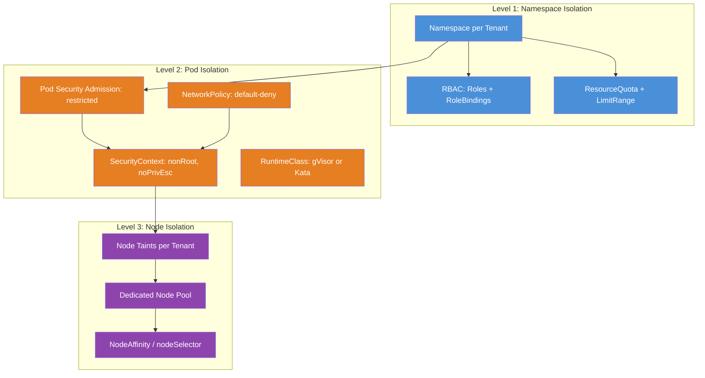

# Chapter 16 — Levels of Isolation: Namespace, Pod, Node

> **Section:** Microservice Vulnerabilities
> **Previous:** [Chapter 15 — Different Types of Multi-Tenancy in Kubernetes](./15%20---%20Different%20Types%20of%20Multi%20Tenancy%20in%20Kubernetes.md)
> **Next:** [Chapter 17 — Control Plane Isolation](./17%20---%20Control%20Plane%20Isolation.md)

---

## Why This Matters for CKS

The CKS exam regularly presents scenarios where you must identify *which level* of isolation is appropriate, or diagnose which level is missing. Understanding that Kubernetes isolation operates at three distinct planes — namespace, pod, and node — and that threats defeated at one level can leak through gaps at another, is foundational to answering these questions correctly.

This chapter is the architectural map for the entire multi-tenancy section. Every chapter that follows (17–25) is a deep-dive into one specific control that lives at one of these three levels. After reading this chapter, you will be able to look at a cluster configuration and immediately identify:
- What isolation is present at each level
- What threats each level mitigates
- What gaps remain
- Whether soft or hard isolation is appropriate for the scenario

---

## The Two Planes of Tenant Isolation

Kubernetes isolates tenants across two planes:

```
┌─────────────────────────────────────────────────────────────────────┐
│                   Kubernetes Isolation Planes                        │
│                                                                      │
│  CONTROL PLANE ISOLATION                                            │
│  "Who can see and change what?"                                     │
│  ┌──────────────────────────────────────────────────────────────┐   │
│  │  Namespaces  ←→  RBAC  ←→  Admission Controllers  ←→  API   │   │
│  └──────────────────────────────────────────────────────────────┘   │
│                                                                      │
│  DATA PLANE ISOLATION                                               │
│  "How do workloads behave and interact at runtime?"                 │
│  ┌──────────────────────────────────────────────────────────────┐   │
│  │  NetworkPolicy  ←→  Storage Isolation  ←→  Node Isolation   │   │
│  └──────────────────────────────────────────────────────────────┘   │
└─────────────────────────────────────────────────────────────────────┘
```

Control plane isolation answers API-level questions: "Can Team A see Team B's Secrets?" Data plane isolation answers runtime questions: "Can Team A's pod send traffic to Team B's pod?" Both planes must be secured — a perfect API control plane with no NetworkPolicy still allows lateral movement between tenants at runtime.

---

## Level 1 — Namespace Isolation (Control Plane)

### What Namespaces Provide

Namespaces are Kubernetes's primary logical isolation boundary. They act as a scoping mechanism for most API resources:

```
Namespace-scoped resources (isolated per namespace):
  Pods, Deployments, Services, ConfigMaps, Secrets, ServiceAccounts,
  PersistentVolumeClaims, NetworkPolicies, ResourceQuotas, LimitRanges,
  Roles, RoleBindings, Jobs, CronJobs, HorizontalPodAutoscalers

Cluster-scoped resources (NOT isolated by namespace):
  Nodes, PersistentVolumes, ClusterRoles, ClusterRoleBindings,
  StorageClasses, IngressClasses, RuntimeClasses, Namespaces themselves
```

Because most workload resources are namespace-scoped, creating a namespace per tenant gives each tenant a private space where their resources don't collide with others'. A Secret named `db-password` in `namespace: tenant-a` is entirely separate from a Secret named `db-password` in `namespace: tenant-b`.

### RBAC as the Namespace Enforcement Layer

Namespaces create the boundary; RBAC enforces it. Without RBAC, a user could access any namespace's resources by simply changing the `-n` flag in kubectl.

```
Namespace boundary alone (without RBAC):
  kubectl get secrets -n tenant-b   ← Anyone can do this!

Namespace + RBAC:
  kubectl get secrets -n tenant-b   ← Only tenant-b users can do this
  Error from server (Forbidden): secrets is forbidden: User "alice" cannot
  list resource "secrets" in API group "" in the namespace "tenant-b"
```

The RBAC principal types for namespace isolation:

```yaml
# Developers get namespace-scoped Roles (not ClusterRoles)
apiVersion: rbac.authorization.k8s.io/v1
kind: Role
metadata:
  name: tenant-developer
  namespace: tenant-a          # Scoped to THIS namespace only
rules:
- apiGroups: ["", "apps", "batch"]
  resources: ["pods", "pods/log", "deployments", "services",
              "configmaps", "jobs"]
  verbs: ["get", "list", "watch", "create", "update", "patch", "delete"]
---
# Bound to tenant-a users via RoleBinding (not ClusterRoleBinding)
apiVersion: rbac.authorization.k8s.io/v1
kind: RoleBinding
metadata:
  name: tenant-a-developer-binding
  namespace: tenant-a
subjects:
- kind: Group
  name: tenant-a-engineers
  apiGroup: rbac.authorization.k8s.io
roleRef:
  kind: Role
  name: tenant-developer
  apiGroup: rbac.authorization.k8s.io
```

Using a **Role** (not ClusterRole) + **RoleBinding** (not ClusterRoleBinding) means the permissions are strictly contained to `namespace: tenant-a`. The same user has zero access to `tenant-b`.

### What Namespace Isolation Does NOT Prevent

```
✅ Namespace isolation prevents:
   • Seeing another tenant's Secrets, ConfigMaps, Services
   • Deploying into another tenant's namespace
   • Reading another tenant's logs
   • Modifying another tenant's Deployments

❌ Namespace isolation alone does NOT prevent:
   • Pod-to-pod network traffic across namespaces (all pods can communicate
     by default — requires NetworkPolicy)
   • Resource exhaustion (one tenant consuming all cluster memory —
     requires ResourceQuota)
   • Container escapes to the host kernel (requires Pod Security / sandboxing)
   • Accessing cluster-wide resources (Nodes, PersistentVolumes)
```

This gap between what namespaces provide and what they don't is the root cause of most multi-tenancy misconfigurations.

### The Office Building Analogy

```
Namespace = Rented office floor in a shared building

Each floor has:
• A locked door (RBAC — only your keycard opens it)
• Your own filing cabinets (Secrets, ConfigMaps)
• Your own phone extensions (Services)
• Your own employee roster (ServiceAccounts)

But the building also has:
• A shared power grid (cluster nodes)
• Shared elevators (network fabric — pods can still call each other!)
• Shared parking (PersistentVolumes in some cases)

The floor boundary is real, but it only controls WHO CAN ENTER —
it doesn't prevent network calls from traveling between floors.
```

---

## Level 2 — Pod Isolation

### What Pod-Level Isolation Addresses

Even within a single namespace, containers and pods need isolation from each other and from the host. Pod-level isolation is about *what the process inside a container can do*:

```
Pod-level isolation controls:
  • Can this container run as root?
  • Can this container gain new privileges (setuid binaries)?
  • Can this container access the host's PID namespace?
  • Can this container access the host's network interfaces?
  • Can this container mount the host filesystem?
  • What Linux capabilities does this container have?
  • What system calls can this container make (seccomp)?
  • What files can this container access (AppArmor)?
  • Does this container use a sandboxed runtime (gVisor/Kata)?
```

None of these are controlled by namespaces or RBAC — they're controlled by pod security configurations at the container level.

### The Shared Desk Workspace Analogy

```
Pod = Shared desk workspace in the office

Employees at the same desk (containers in a pod):
• Share the same locker (pod's filesystem via emptyDir)
• Share the same phone line (pod network namespace — same IP)
• Can see each other's work (same IPC namespace by default)

But employees at different desks (different pods):
• Have separate lockers
• Have separate phone lines (different pod IPs)
• Cannot see each other's work

Risk: An employee at one desk who brings in a "crowbar" (privileged
container, hostPath mount) can break into the building's server room
(host filesystem, kernel) affecting EVERYONE in the building.
```

### Pod Security Admission (PSA) as the Enforcer

Chapter 5 covered PSA in depth. In the context of isolation levels:

```yaml
# Namespace label that enforces pod-level isolation
# Applied to every tenant namespace
metadata:
  labels:
    pod-security.kubernetes.io/enforce: restricted  # Strictest mode
    pod-security.kubernetes.io/enforce-version: latest
```

The `restricted` profile requires (at minimum) that pods:
1. Cannot run as root (`runAsNonRoot: true`)
2. Cannot allow privilege escalation (`allowPrivilegeEscalation: false`)
3. Drop all Linux capabilities (`capabilities.drop: ["ALL"]`)
4. Use a restricted set of volume types (no `hostPath`)
5. Cannot access `hostPID`, `hostIPC`, `hostNetwork`
6. Use a non-root user ID and group ID
7. Use `seccompProfile: RuntimeDefault` or `Localhost`

```yaml
# Pod spec that satisfies PSA restricted profile
apiVersion: v1
kind: Pod
metadata:
  name: compliant-app
  namespace: tenant-a
spec:
  securityContext:
    runAsNonRoot: true
    runAsUser: 1000
    runAsGroup: 3000
    fsGroup: 2000
    seccompProfile:
      type: RuntimeDefault
  containers:
  - name: app
    image: my-app:latest
    securityContext:
      allowPrivilegeEscalation: false
      readOnlyRootFilesystem: true
      capabilities:
        drop: ["ALL"]
    resources:
      requests:
        cpu: "100m"
        memory: "128Mi"
      limits:
        cpu: "500m"
        memory: "512Mi"
```

### Beyond PSA: Runtime Sandboxing

For the highest-isolation scenarios (multi-customer with untrusted code), Pod Security Admission is not enough — it restricts what the container process *requests*, but a container can still make arbitrary Linux system calls to the shared kernel.

The solution is runtime sandboxing (Chapters 10–12):

```yaml
# RuntimeClass — route pods through gVisor (user-space kernel)
apiVersion: node.k8s.io/v1
kind: RuntimeClass
metadata:
  name: gvisor
handler: runsc

---
# Pod using gVisor — kernel calls intercepted by Sentry
apiVersion: v1
kind: Pod
metadata:
  name: sandboxed-tenant-app
  namespace: customer-acme
spec:
  runtimeClassName: gvisor      # Use gVisor runtime
  securityContext:
    runAsNonRoot: true
    seccompProfile:
      type: RuntimeDefault
  containers:
  - name: app
    image: customer-app:latest
    securityContext:
      allowPrivilegeEscalation: false
      capabilities:
        drop: ["ALL"]
```

With gVisor or Kata Containers, even if a tenant's code exploits a kernel vulnerability, the sandbox intercepts the system calls — the tenant reaches the sandbox's kernel emulation, not the host kernel.

### Network Isolation at the Pod Level

NetworkPolicy is enforced at the pod level (by the CNI plugin), not the namespace level:

```yaml
# Allow frontend pods to reach backend pods — within tenant-a
apiVersion: networking.k8s.io/v1
kind: NetworkPolicy
metadata:
  name: frontend-to-backend
  namespace: tenant-a
spec:
  podSelector:
    matchLabels:
      role: backend             # Applies to backend pods
  policyTypes:
  - Ingress
  ingress:
  - from:
    - podSelector:
        matchLabels:
          role: frontend        # Only frontend pods can connect
    ports:
    - protocol: TCP
      port: 8080
```

NetworkPolicy rules are enforced at the veth (virtual ethernet) interface of each pod — traffic that doesn't match an allow rule is dropped by the kernel, not by the application. This makes it a strong enforcement point that application code cannot bypass.

---

## Level 3 — Node Isolation

### What Node-Level Isolation Provides

Even with perfect namespace and pod isolation, all pods on a shared node still:
- Use the same physical CPUs and memory (NUMA domains, CPU caches)
- Share the same OS kernel
- Share the same hardware (including DMA-capable devices)
- Are visible to each other via side-channel attacks (e.g., Spectre, Meltdown)

Node isolation dedicates entire Kubernetes nodes to specific tenants, eliminating co-location at the kernel level.

### The Floor Analogy

```
Node = Floor in the office building

In a multi-tenant node (default):
  Team A pods and Team B pods run side-by-side on Node 1
  They share the same CPU, memory, kernel
  A kernel exploit by Team A affects Team B on the same node

In node-isolated tenancy:
  Node 1 → Only Team A pods   (dedicated floor, only Team A has keycard)
  Node 2 → Only Team B pods   (dedicated floor, only Team B has keycard)

The "keycard" = taint on the node + toleration in the pod spec
```

### Implementing Node Isolation with Taints and Tolerations

```bash
# Step 1: Taint nodes so only tenant-a pods can schedule on them
kubectl taint nodes node-1 node-2 \
  dedicated=tenant-a:NoSchedule

# Step 2: Label the nodes for nodeSelector
kubectl label nodes node-1 node-2 tenant=tenant-a
```

```yaml
# Step 3: Tenant-a pods tolerate the taint and select the node
apiVersion: v1
kind: Pod
metadata:
  name: tenant-a-app
  namespace: tenant-a
spec:
  tolerations:
  - key: "dedicated"
    operator: "Equal"
    value: "tenant-a"
    effect: "NoSchedule"
  nodeSelector:
    tenant: tenant-a            # Also use nodeSelector for affinity
  containers:
  - name: app
    image: tenant-a-app:latest
```

Without both the taint (repels all other pods) and the nodeSelector/toleration (attracts tenant-a pods), other workloads could still schedule on those nodes.

### Node Isolation: Full Architecture

```
┌─────────────────────────────────────────────────────────────────┐
│                  Cluster with Node Isolation                     │
│                                                                  │
│  Tenant-A Node Pool          Tenant-B Node Pool                 │
│  ┌──────────────────┐        ┌──────────────────┐              │
│  │  Node-A-1        │        │  Node-B-1        │              │
│  │  taint: t=a:NS   │        │  taint: t=b:NS   │              │
│  │  ┌────┐ ┌────┐   │        │  ┌────┐ ┌────┐  │              │
│  │  │ Pa │ │ Pa │   │        │  │ Pb │ │ Pb │  │              │
│  │  └────┘ └────┘   │        │  └────┘ └────┘  │              │
│  └──────────────────┘        └──────────────────┘              │
│  ┌──────────────────┐        ┌──────────────────┐              │
│  │  Node-A-2        │        │  Node-B-2        │              │
│  │  taint: t=a:NS   │        │  taint: t=b:NS   │              │
│  │  ┌────┐ ┌────┐   │        │  ┌────┐ ┌────┐  │              │
│  │  │ Pa │ │ Pa │   │        │  │ Pb │ │ Pb │  │              │
│  │  └────┘ └────┘   │        │  └────┘ └────┘  │              │
│  └──────────────────┘        └──────────────────┘              │
│                                                                  │
│  System Node Pool (shared — platform workloads only)            │
│  ┌─────────────────────────────────────────────────────┐        │
│  │  Node-sys-1    Node-sys-2                           │        │
│  │  taint: sys:NS  taint: sys:NS                       │        │
│  │  [prometheus]  [ingress-controller]  [coredns]      │        │
│  └─────────────────────────────────────────────────────┘        │
└─────────────────────────────────────────────────────────────────┘

Pa = Tenant-A pods only (have the matching toleration)
Pb = Tenant-B pods only (have the matching toleration)
```

### Cost and Trade-offs of Node Isolation

```
Node Isolation: Cost vs. Security Trade-off
════════════════════════════════════════════

BENEFIT: Eliminates shared-kernel risk between tenants
         Prevents side-channel attacks (Spectre/Meltdown) across tenants
         Provides physical data separation for compliance (GDPR, HIPAA)
         Simplifies blast radius — node failure only affects one tenant

COST:    Nodes cannot be shared → lower utilization (idle capacity per tenant)
         More nodes = more cost
         Each tenant needs minimum viable node count (HA = 3+ nodes each)
         Cluster autoscaler must manage per-tenant node pools

WHEN WORTH IT:
  • Multi-customer tenancy for regulated industries
  • When contract SLA requires physical isolation
  • When tenants have conflicting security profiles
  • When side-channel attack risk is unacceptable (financial, healthcare)

WHEN NOT WORTH IT:
  • Multi-team tenancy with trusted internal users
  • Dev/staging environments
  • Small number of tenants where utilization drop is acceptable
  • When namespace + NetworkPolicy + PSA provides sufficient isolation
```

---

## Hard Isolation vs. Soft Isolation

These terms map directly to the node isolation question:

### Soft Isolation — Shared Nodes, Logical Boundaries

```
┌─────────────────────────────────────────────────────────────────┐
│  Soft Isolation — All tenants share the same nodes              │
│                                                                  │
│  Node 1                                                         │
│  ┌────────────────────────────────────────────────────────┐     │
│  │  ns: tenant-a            ns: tenant-b                  │     │
│  │  ┌──────────────────┐    ┌──────────────────┐          │     │
│  │  │ pod: app-a-1     │    │ pod: app-b-1     │          │     │
│  │  │ pod: app-a-2     │    │ pod: app-b-2     │          │     │
│  │  └──────────────────┘    └──────────────────┘          │     │
│  │           Same kernel, same CPUs, same memory           │     │
│  └────────────────────────────────────────────────────────┘     │
│                                                                  │
│  Isolation: RBAC + NetworkPolicy + PSA + ResourceQuota          │
│  Risk: Shared kernel — container escape affects all tenants     │
│  Cost: Low — high node utilization                              │
│  Use case: Multi-team tenancy, trusted tenants                  │
└─────────────────────────────────────────────────────────────────┘
```

### Hard Isolation — Dedicated Nodes Per Tenant

```
┌─────────────────────────────────────────────────────────────────┐
│  Hard Isolation — Each tenant on dedicated nodes                │
│                                                                  │
│  Node 1 (tenant-a only)          Node 2 (tenant-b only)        │
│  ┌────────────────────────┐      ┌────────────────────────┐    │
│  │  ns: tenant-a          │      │  ns: tenant-b          │    │
│  │  ┌──────────────────┐  │      │  ┌──────────────────┐  │    │
│  │  │ pod: app-a-1     │  │      │  │ pod: app-b-1     │  │    │
│  │  │ pod: app-a-2     │  │      │  │ pod: app-b-2     │  │    │
│  │  └──────────────────┘  │      │  └──────────────────┘  │    │
│  │   Dedicated kernel     │      │   Dedicated kernel     │    │
│  └────────────────────────┘      └────────────────────────┘    │
│                                                                  │
│  Isolation: All soft controls PLUS dedicated node pools         │
│  Risk: Container escape only affects tenant's own nodes         │
│  Cost: Higher — lower node utilization per tenant               │
│  Use case: Multi-customer tenancy, regulated industries         │
└─────────────────────────────────────────────────────────────────┘
```

### Semi-Hard Isolation — Sandboxed Runtime on Shared Nodes

A middle ground: keep nodes shared (soft isolation cost), but add a sandboxed runtime (gVisor/Kata) to intercept kernel calls:

```
┌─────────────────────────────────────────────────────────────────┐
│  Semi-Hard Isolation — gVisor/Kata on Shared Nodes             │
│                                                                  │
│  Node 1 (shared, but sandboxed)                                 │
│  ┌────────────────────────────────────────────────────────┐     │
│  │  ns: tenant-a               ns: tenant-b               │     │
│  │  ┌──────────────────────┐   ┌──────────────────────┐   │     │
│  │  │ pod: app-a           │   │ pod: app-b           │   │     │
│  │  │ runtimeClass: gvisor │   │ runtimeClass: gvisor │   │     │
│  │  │  ┌────────────────┐  │   │  ┌────────────────┐  │   │     │
│  │  │  │ Sentry (gVisor)│  │   │  │ Sentry (gVisor)│  │   │     │
│  │  │  │ (intercepting  │  │   │  │ (intercepting  │  │   │     │
│  │  │  │  syscalls)     │  │   │  │  syscalls)     │  │   │     │
│  │  │  └────────────────┘  │   │  └────────────────┘  │   │     │
│  │  └──────────────────────┘   └──────────────────────┘   │     │
│  │                  Host Kernel                             │     │
│  └────────────────────────────────────────────────────────┘     │
│                                                                  │
│  Isolation: Near-hard — kernel exploit is blocked by sandbox    │
│  Cost: Moderate overhead (~20-50%) but shared nodes = cheaper   │
│  Use case: When hard isolation is too expensive but needed      │
└─────────────────────────────────────────────────────────────────┘
```

---

## Full Isolation Stack — All Three Levels Together

For maximum multi-tenant security, all three levels are deployed together:



---

## Threat-to-Level Mapping

Use this to quickly determine which level to look at for a given threat:

```
┌─────────────────────────────────────┬───────────────────────────────────────┐
│ Threat                              │ Isolation Level That Defends          │
├─────────────────────────────────────┼───────────────────────────────────────┤
│ Tenant reads another tenant's       │ Level 1: RBAC (namespace-scoped Role) │
│ Secrets or ConfigMaps               │                                        │
├─────────────────────────────────────┼───────────────────────────────────────┤
│ Tenant deploys into wrong namespace │ Level 1: RBAC (no write permission)   │
├─────────────────────────────────────┼───────────────────────────────────────┤
│ Tenant's pod calls another          │ Level 2: NetworkPolicy (deny rule)    │
│ tenant's Service directly           │                                        │
├─────────────────────────────────────┼───────────────────────────────────────┤
│ Tenant consumes all cluster         │ Level 1: ResourceQuota                │
│ memory, starving others             │                                        │
├─────────────────────────────────────┼───────────────────────────────────────┤
│ Tenant runs privileged container    │ Level 2: PSA (restricted mode)        │
│ to mount host filesystem            │                                        │
├─────────────────────────────────────┼───────────────────────────────────────┤
│ Tenant exploits kernel CVE          │ Level 2: RuntimeClass (gVisor/Kata)   │
│ via syscall from container          │ Level 3: Dedicated node pool          │
├─────────────────────────────────────┼───────────────────────────────────────┤
│ Tenant's workload sees another      │ Level 3: Dedicated node pool          │
│ tenant's memory via side-channel    │                                        │
├─────────────────────────────────────┼───────────────────────────────────────┤
│ Tenant floods kube-dns              │ Level 1: ResourceQuota (pod count)    │
│                                     │ Level 2: NetworkPolicy (rate limiting) │
│                                     │ + API Priority and Fairness (Ch. 23)  │
├─────────────────────────────────────┼───────────────────────────────────────┤
│ Tenant's pod escapes container,     │ Level 3: Dedicated node pool          │
│ damages host → affects co-tenant   │ (limits blast radius to own nodes)    │
├─────────────────────────────────────┼───────────────────────────────────────┤
│ Tenant mounts another tenant's PVC  │ Level 1: RBAC (no PVC read in other  │
│                                     │ namespace) + StorageClass policy      │
└─────────────────────────────────────┴───────────────────────────────────────┘
```

---

## Practical Deployment: Layered Isolation Checklist

When provisioning a new tenant namespace (for either tenancy type), apply controls in this order:

```bash
# ── Step 1: Create and label the namespace ────────────────────────
kubectl create namespace tenant-foo

kubectl label namespace tenant-foo \
  tenant=foo \
  environment=production \
  pod-security.kubernetes.io/enforce=restricted \
  pod-security.kubernetes.io/enforce-version=latest \
  pod-security.kubernetes.io/warn=restricted \
  pod-security.kubernetes.io/audit=restricted

# ── Step 2: Apply ResourceQuota ───────────────────────────────────
kubectl apply -f - <<EOF
apiVersion: v1
kind: ResourceQuota
metadata:
  name: tenant-foo-quota
  namespace: tenant-foo
spec:
  hard:
    requests.cpu: "4"
    requests.memory: 8Gi
    limits.cpu: "8"
    limits.memory: 16Gi
    pods: "20"
    services: "10"
    persistentvolumeclaims: "5"
    services.loadbalancers: "1"
    services.nodeports: "0"
EOF

# ── Step 3: Apply LimitRange ──────────────────────────────────────
kubectl apply -f - <<EOF
apiVersion: v1
kind: LimitRange
metadata:
  name: tenant-foo-limits
  namespace: tenant-foo
spec:
  limits:
  - type: Container
    default:
      cpu: "500m"
      memory: "512Mi"
    defaultRequest:
      cpu: "100m"
      memory: "128Mi"
    max:
      cpu: "2"
      memory: "4Gi"
EOF

# ── Step 4: Apply default-deny NetworkPolicy ──────────────────────
kubectl apply -f - <<EOF
apiVersion: networking.k8s.io/v1
kind: NetworkPolicy
metadata:
  name: default-deny-all
  namespace: tenant-foo
spec:
  podSelector: {}
  policyTypes:
  - Ingress
  - Egress
---
apiVersion: networking.k8s.io/v1
kind: NetworkPolicy
metadata:
  name: allow-intra-namespace
  namespace: tenant-foo
spec:
  podSelector: {}
  ingress:
  - from:
    - podSelector: {}
  egress:
  - to:
    - podSelector: {}
  - ports:
    - port: 53
      protocol: UDP
    - port: 53
      protocol: TCP
EOF

# ── Step 5: Create RBAC ───────────────────────────────────────────
kubectl apply -f - <<EOF
apiVersion: rbac.authorization.k8s.io/v1
kind: Role
metadata:
  name: tenant-foo-developer
  namespace: tenant-foo
rules:
- apiGroups: ["", "apps"]
  resources: ["pods", "pods/log", "deployments", "services", "configmaps"]
  verbs: ["get", "list", "watch", "create", "update", "patch", "delete"]
---
apiVersion: rbac.authorization.k8s.io/v1
kind: RoleBinding
metadata:
  name: tenant-foo-binding
  namespace: tenant-foo
subjects:
- kind: Group
  name: tenant-foo-team
  apiGroup: rbac.authorization.k8s.io
roleRef:
  kind: Role
  name: tenant-foo-developer
  apiGroup: rbac.authorization.k8s.io
EOF

# ── Step 6 (hard isolation only): Taint nodes for tenant ─────────
# kubectl taint nodes <node-names> dedicated=tenant-foo:NoSchedule
# kubectl label nodes <node-names> tenant=tenant-foo
```

---

## Common Mistakes and Exam Traps

### ❌ Mistake 1: Confusing control plane and data plane isolation

RBAC is control plane isolation — it controls who can use the Kubernetes API. NetworkPolicy is data plane isolation — it controls runtime network traffic. You need both. A perfect RBAC configuration does not stop a pod in `tenant-a` from making an HTTP request to `tenant-b`'s Service.

### ❌ Mistake 2: Adding namespace isolation without NetworkPolicy

The default Kubernetes networking model allows all pods to communicate with all other pods cluster-wide. Without a NetworkPolicy, creating separate namespaces for tenants provides zero runtime network isolation.

### ❌ Mistake 3: Soft isolation where hard isolation is required

Regulated workloads (HIPAA, PCI) often require physical separation. Presenting namespace + RBAC + NetworkPolicy as sufficient for a healthcare SaaS is a gap an auditor will catch. Know when the threat model demands dedicated nodes or sandboxed runtimes.

### ❌ Mistake 4: Applying hard isolation everywhere

Hard isolation (dedicated node pools) is expensive. Applying it to internal dev/staging environments is wasteful. Calibrate the isolation level to the actual risk. Over-engineering creates cost and complexity with no security benefit for trusted internal users.

### ❌ Mistake 5: Forgetting that PSA labels must be on the namespace

Pod Security Admission is enforced via namespace labels. If you forget to label the namespace, PSA doesn't apply — pods can run as root, use hostPath, etc.

```bash
# Check if PSA is enforced on a namespace
kubectl get namespace tenant-foo -o jsonpath='{.metadata.labels}' | jq
# Must contain: "pod-security.kubernetes.io/enforce": "restricted"
```

---

## Quick Reference Summary

```
┌──────────────────────────────────────────────────────────────────┐
│              Isolation Levels — Quick Reference                   │
├────────────────┬─────────────────────────────────────────────────┤
│ Level 1        │ Namespace Isolation                              │
│ (Control Plane)│ Mechanisms: Namespaces + RBAC + ResourceQuota   │
│                │ Defends against: Unauthorized API access,        │
│                │   cross-namespace resource visibility            │
│                │   noisy neighbor resource consumption            │
├────────────────┼─────────────────────────────────────────────────┤
│ Level 2        │ Pod Isolation                                    │
│ (Data Plane)   │ Mechanisms: PSA + NetworkPolicy + SecurityContext│
│                │   + RuntimeClass (gVisor/Kata)                  │
│                │ Defends against: Lateral network movement,       │
│                │   privilege escalation, container escape,        │
│                │   host filesystem access                         │
├────────────────┼─────────────────────────────────────────────────┤
│ Level 3        │ Node Isolation                                   │
│ (Infrastructure│ Mechanisms: Taints/Tolerations + NodeAffinity   │
│  Plane)        │   + Dedicated node pools                         │
│                │ Defends against: Shared-kernel attacks,          │
│                │   side-channel attacks, blast radius from        │
│                │   kernel exploits                               │
├────────────────┼─────────────────────────────────────────────────┤
│ Soft isolation │ Levels 1 + 2 (shared nodes, logical boundaries)  │
│                │ For: trusted tenants, internal teams             │
├────────────────┼─────────────────────────────────────────────────┤
│ Hard isolation │ Levels 1 + 2 + 3 (dedicated nodes per tenant)   │
│                │ For: untrusted tenants, regulated workloads      │
└──────────────────────────────────────────────────────────────────┘
```

---

## CKS Exam Tips

**Expect "what's missing" scenarios.** The exam often presents a cluster with some isolation controls in place and asks you to identify the gap. Run through the three levels mentally: Is there RBAC scoped to the namespace? Is there a NetworkPolicy? Is there a ResourceQuota? Is PSA applied? Is there a RuntimeClass if the scenario demands it?

**Know the difference between control plane and data plane isolation.** RBAC/namespaces = control plane. NetworkPolicy/PSA/node taints = data plane. The exam distinguishes between these.

**Soft vs. hard isolation comes up in scenario questions.** "A SaaS company is hosting medical records for multiple hospitals" → hard isolation required. "Three engineering teams share a development cluster" → soft isolation is appropriate.

**Key commands:**
```bash
# Verify namespace isolation (PSA labels)
kubectl describe namespace tenant-a | grep pod-security

# Verify RBAC is namespace-scoped (not cluster-wide)
kubectl get rolebindings -n tenant-a
kubectl get clusterrolebindings | grep tenant-a   # Should be EMPTY

# Verify ResourceQuota exists
kubectl get resourcequota -n tenant-a

# Verify NetworkPolicy exists and is default-deny
kubectl get networkpolicy -n tenant-a

# Verify node taints (for hard isolation)
kubectl describe node node-1 | grep Taints
```

---

## Summary

Kubernetes isolation operates at three distinct levels. The first level — namespace isolation — is the control plane layer, using namespaces as logical boundaries enforced by RBAC, with ResourceQuota and LimitRange preventing resource starvation. This level answers "who can see and change what via the API."

The second level — pod isolation — is the data plane layer at the workload level. Pod Security Admission restricts what processes inside containers can do, NetworkPolicy controls which pods can communicate with which, and RuntimeClass (gVisor/Kata) sandboxes the container's kernel interactions. This level answers "what can running workloads do and talk to."

The third level — node isolation — dedicates physical or virtual nodes to specific tenants using taints, tolerations, and node selectors. This eliminates shared-kernel risk and side-channel attacks at the hardware level. This level answers "who shares the actual compute infrastructure."

Soft isolation (levels 1 + 2) is appropriate for trusted internal teams where the threat model is accidental misconfiguration. Hard isolation (all three levels) is mandatory for external customer tenancy, regulated workloads, or scenarios where tenants may be adversarial. The right answer is always "match your isolation strength to your threat model."

---

## What's Next

**[Chapter 17 — Control Plane Isolation →](./17%20---%20Control%20Plane%20Isolation.md)**

With the three isolation levels mapped out, the next chapters drill into each one. Chapter 17 begins with control plane isolation — how to lock down the Kubernetes API server, etcd, and related components to prevent tenant workloads from compromising cluster infrastructure. This covers API server hardening flags, etcd access controls, and audit logging as a control plane isolation mechanism.
