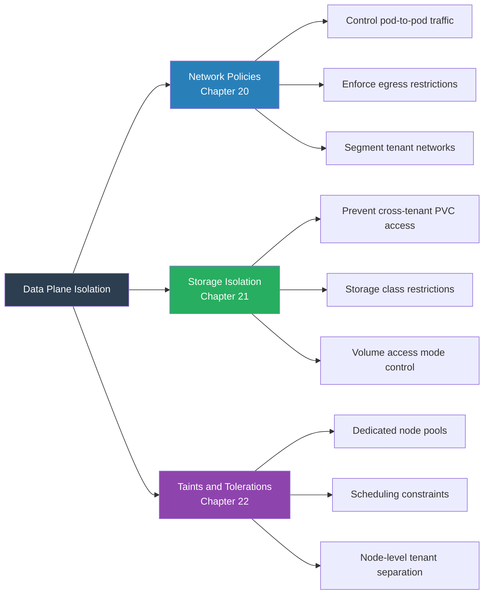

# Chapter 19 — Data Plane Isolation

> **Section:** Microservice Vulnerabilities
> **Previous:** [Chapter 18 — Understanding Resource Quotas](./18%20---%20Understanding%20Resource%20Quotas.md)
> **Next:** [Chapter 20 — Data Plane Isolation — Network](./20%20---%20Data%20Plane%20Isolation%20Network.md)

---

## Why This Matters for CKS

The control plane isolation chapters (17–18) secured the Kubernetes API layer — who can see what, and how much resource they can consume. But locking down the API is only half the battle. Once a pod is scheduled and running, a completely different set of risks emerges at the **data plane** level: the actual runtime execution of workloads.

Data plane isolation is what prevents:
- Tenant A's pod from sending network traffic to Tenant B's database
- Tenant A's pod from reading data from a PersistentVolume that belongs to Tenant B
- Tenant A's pod from running on nodes reserved for Tenant B
- A compromised container from reaching the internet to exfiltrate data

The CKS exam tests data plane isolation through hands-on tasks involving NetworkPolicy, storage access controls, and node scheduling. This chapter provides the conceptual overview. Chapters 20–22 then drill deep into each mechanism.

---

## What Is the Data Plane?

In Kubernetes, the **data plane** is everything that happens at runtime — the actual execution of workloads and the flow of data between them, as opposed to the control plane which manages the cluster's desired state.

```
┌─────────────────────────────────────────────────────────────────────┐
│              Control Plane vs. Data Plane                           │
├────────────────────────────┬────────────────────────────────────────┤
│ CONTROL PLANE              │ DATA PLANE                             │
│ (Management Layer)         │ (Execution Layer)                      │
├────────────────────────────┼────────────────────────────────────────┤
│ kube-apiserver             │ Container runtime (containerd/CRI-O)   │
│ etcd                       │ kubelet (manages pods on node)         │
│ kube-controller-manager    │ kube-proxy (networking rules)          │
│ kube-scheduler             │ CNI plugin (network enforcement)       │
│ RBAC / Admission           │ CSI plugin (storage)                   │
│                            │ Pod networking (veth, bridge)          │
│ Answers: "What should run?"│ Answers: "What IS running and how      │
│                            │ does it communicate?"                  │
├────────────────────────────┼────────────────────────────────────────┤
│ Isolated by:               │ Isolated by:                           │
│ • Namespaces               │ • NetworkPolicy                        │
│ • RBAC                     │ • Storage isolation                    │
│ • ResourceQuota            │ • Node taints/tolerations              │
│ • Admission controllers    │ • Pod security (seccomp, AppArmor)     │
│                            │ • RuntimeClass (gVisor/Kata)           │
└────────────────────────────┴────────────────────────────────────────┘
```

Even if you have perfect control plane isolation, the data plane is where things actually run — and where actual attacks happen: network probing, data theft via storage access, lateral movement between services.

---

## The Three Pillars of Data Plane Isolation

Data plane isolation in Kubernetes is implemented through three primary mechanisms:



### Pillar 1 — Network Policies (Traffic Control)

NetworkPolicy objects, enforced by the CNI plugin, define which pods can send traffic to which other pods. Without NetworkPolicy:

```
Default Kubernetes networking (no policy):
  Pod A (tenant-a) ──► Pod B (tenant-b) ✅ ALLOWED
  Pod B (tenant-b) ──► Pod A's database ✅ ALLOWED
  Any pod ──► Internet ✅ ALLOWED
  Any pod ──► Any pod in any namespace ✅ ALLOWED

This is the flat network model — everything talks to everything.
Fine for a single-tenant cluster. Dangerous for multi-tenancy.
```

NetworkPolicy switches the model to explicit allowlisting:
- Default: **deny all** (once any NetworkPolicy targets a pod)
- Allow rules: explicitly defined, narrowly scoped
- Enforcement: kernel-level via iptables/eBPF rules inserted by CNI plugin

Chapter 20 covers NetworkPolicy in depth, including default-deny patterns, cross-namespace rules, egress restrictions, and CNI plugin support requirements.

### Pillar 2 — Storage Isolation (Data Segregation)

Storage in Kubernetes is managed through PersistentVolumes (PVs) and PersistentVolumeClaims (PVCs). Without isolation controls:

```
Default storage model (no isolation):
  • A PV can be mounted by any pod in the cluster
    (if access mode is ReadWriteMany)
  • A PVC in namespace-a could reference a PV that holds namespace-b's data
  • hostPath volumes can read any file on the host filesystem
  • emptyDir volumes shared between containers in a pod expose data
    from one container to another
```

Storage isolation mechanisms:
- **PVC namespace scoping**: PVCs are namespace-scoped, but the underlying PV may be reusable
- **StorageClass restrictions**: Force tenants to use specific storage classes via ResourceQuota or OPA policies
- **Access mode enforcement**: `ReadWriteOnce` vs. `ReadWriteMany` controls who can mount a volume simultaneously
- **Volume type restrictions**: PSA `restricted` profile disallows `hostPath` volumes entirely

Chapter 21 covers storage isolation with StorageClass design, reclaim policies, and preventing hostPath abuse.

### Pillar 3 — Taints and Tolerations (Node Scheduling Control)

Node taints and pod tolerations control which pods land on which nodes. Without scheduling controls:

```
Default scheduling (no taints):
  Tenant A pods and Tenant B pods can schedule on ANY node
  → Shared kernel → shared hardware → side-channel attacks possible
  → A container escape by Tenant A affects nodes Tenant B uses

With taints:
  Node-1: taint=tenant-a:NoSchedule → ONLY Tenant A pods (with matching toleration)
  Node-2: taint=tenant-b:NoSchedule → ONLY Tenant B pods
  → Physical separation of tenant workloads
  → Container escape by Tenant A cannot reach Tenant B's nodes
```

Chapter 22 covers dedicated node pools with taints, tolerations, node affinity, and node selectors in detail.

---

## Why Each Pillar Is Necessary

No single pillar provides complete data plane isolation. Each addresses a different attack surface:

```
┌─────────────────────────────────────────────────────────────────┐
│          Data Plane Attack Surface vs. Defense Pillar           │
├──────────────────────────────────┬──────────────────────────────┤
│ Attack / Risk                    │ Defending Pillar              │
├──────────────────────────────────┼──────────────────────────────┤
│ Pod-to-pod network scanning /    │ NetworkPolicy                 │
│ lateral movement between tenants │                               │
├──────────────────────────────────┼──────────────────────────────┤
│ Tenant calls another tenant's    │ NetworkPolicy (egress to      │
│ database directly                │ specific pod/port only)       │
├──────────────────────────────────┼──────────────────────────────┤
│ Tenant pod exfiltrates data to   │ NetworkPolicy (egress         │
│ the internet                     │ default-deny + allowlist)     │
├──────────────────────────────────┼──────────────────────────────┤
│ Tenant mounts a PV containing    │ Storage isolation             │
│ another tenant's data            │ (PVC scoping, StorageClass)   │
├──────────────────────────────────┼──────────────────────────────┤
│ Tenant uses hostPath to read     │ PSA restricted profile        │
│ host filesystem secrets          │ (blocks hostPath volumes)     │
├──────────────────────────────────┼──────────────────────────────┤
│ Container escape → moves to      │ Node taints (other tenant's   │
│ co-located tenant's containers   │ pods on different nodes)      │
├──────────────────────────────────┼──────────────────────────────┤
│ Side-channel attacks between     │ Node taints + dedicated pools │
│ co-located workloads             │ (no co-location at all)       │
├──────────────────────────────────┼──────────────────────────────┤
│ Kernel exploit from container    │ RuntimeClass (gVisor/Kata)    │
│                                  │ + node taints (limit blast    │
│                                  │ radius)                       │
├──────────────────────────────────┼──────────────────────────────┤
│ DNS enumeration — discovering    │ NetworkPolicy (block DNS for  │
│ other tenants' services          │ non-cluster zones) + Ch. 25  │
└──────────────────────────────────┴──────────────────────────────┘
```

---

## Data Plane Isolation in Context: The Full Stack

Placing data plane isolation in the complete multi-tenancy picture:

```
┌─────────────────────────────────────────────────────────────────────┐
│                Complete Multi-Tenancy Isolation Stack               │
│                                                                      │
│  ┌─────────────────────────────────────────────────────────────┐   │
│  │  CONTROL PLANE ISOLATION (Chapters 17–18)                   │   │
│  │  • Namespaces — logical boundaries                          │   │
│  │  • RBAC — API access control                                │   │
│  │  • ResourceQuota + LimitRange — resource ceilings           │   │
│  └─────────────────────────────────────────────────────────────┘   │
│                           ↓ runtime boundary ↓                      │
│  ┌─────────────────────────────────────────────────────────────┐   │
│  │  DATA PLANE ISOLATION (Chapters 19–22)                      │   │
│  │  • NetworkPolicy — traffic segmentation                     │   │
│  │  • Storage isolation — data segregation                     │   │
│  │  • Taints/Tolerations — node-level separation               │   │
│  └─────────────────────────────────────────────────────────────┘   │
│                           ↓ additional controls ↓                   │
│  ┌─────────────────────────────────────────────────────────────┐   │
│  │  WORKLOAD ISOLATION (Chapters 10–12, 23–25)                 │   │
│  │  • Pod Security Admission — in-pod restrictions             │   │
│  │  • RuntimeClass (gVisor/Kata) — kernel sandboxing           │   │
│  │  • API Priority and Fairness — API server protection        │   │
│  │  • QoS classes — scheduler prioritization                   │   │
│  │  • DNS isolation — service discovery segmentation           │   │
│  └─────────────────────────────────────────────────────────────┘   │
└─────────────────────────────────────────────────────────────────────┘
```

Data plane isolation is the **runtime** complement to control plane isolation. The API server enforces control plane rules; the node's kernel, CNI, and CSI plugins enforce data plane rules. A gap in either plane leaves tenants exposed.

---

## Data Plane Isolation by Tenancy Type

The appropriate level of data plane isolation varies by tenancy type (Chapter 15):

```
Multi-Team Tenancy (internal, trusted):
  NetworkPolicy: Recommended — intra-namespace allow + cross-NS deny
  Storage isolation: Namespace-scoped PVCs + avoid hostPath
  Node isolation: Usually not needed
  
Multi-Customer Tenancy (external, untrusted):
  NetworkPolicy: Mandatory — strict default-deny, allowlisted only
  Storage isolation: Mandatory — per-tenant StorageClasses, no shared PVs
  Node isolation: Strongly recommended for regulated workloads
  RuntimeClass: Consider gVisor/Kata for highest-risk tenants
```

---

## The Layered Defence Model

Data plane isolation is most effective when all three pillars work together. Consider what happens if one layer is missing:

**Missing NetworkPolicy (only storage + node isolation):**
```
Tenant A pod can still reach Tenant B's Service ClusterIP and make HTTP
requests to it — data exfiltration via API calls is possible even if
the storage is isolated and they're on different nodes.
```

**Missing storage isolation (only network + node isolation):**
```
A misconfigured PV with ReclaimPolicy: Retain could be rebound to a new
PVC in a different tenant's namespace after the original tenant deletes
theirs — previous tenant's data exposed.
```

**Missing node isolation (only network + storage isolation):**
```
All tenant pods share the same physical nodes. A container escape by
Tenant A gives them access to the host, where they can read environment
variables and files of co-located Tenant B containers from the host's
/proc filesystem — even though the network and storage were isolated.
```

Defence in depth: each pillar catches what the others miss.

---

## Quick Orientation to Chapters 20–22

| Chapter | Topic | Key Kubernetes Objects | Key Threat Mitigated |
|---|---|---|---|
| **20** | Network Data Plane | `NetworkPolicy` | Lateral movement, exfiltration |
| **21** | Storage Data Plane | `PersistentVolume`, `PersistentVolumeClaim`, `StorageClass` | Cross-tenant data access |
| **22** | Node Data Plane | Node taints, Pod tolerations, `nodeSelector`, `nodeAffinity` | Shared-kernel co-location risk |

---

## Common Mistakes and Exam Traps

### ❌ Mistake 1: Thinking control plane isolation is sufficient

Getting RBAC and ResourceQuota right is necessary but not sufficient. A tenant who can't read another tenant's Secrets via the API can still send network traffic directly to their pods at runtime. Control plane and data plane isolation must both be present.

### ❌ Mistake 2: Implementing only one data plane pillar

Each pillar addresses a different attack vector. NetworkPolicy alone doesn't prevent a tenant from running on another tenant's nodes. Node isolation alone doesn't prevent network probing. All three are needed for robust multi-tenant data plane isolation.

### ❌ Mistake 3: Assuming the CNI plugin enforces NetworkPolicy automatically

NetworkPolicy objects are only enforced if the CNI plugin supports them. Kubenet (the basic CNI) does **not** enforce NetworkPolicy. You need Calico, Cilium, Weave, or another policy-aware CNI. Without a supporting CNI, NetworkPolicy objects are accepted by the API server but silently have no effect.

```bash
# Check if your CNI supports NetworkPolicy
kubectl get pods -n kube-system | grep -E "calico|cilium|weave|flannel"
# Flannel does NOT enforce NetworkPolicy
# Calico, Cilium, Weave DO enforce NetworkPolicy
```

### ❌ Mistake 4: Forgetting that node isolation must use BOTH taints AND tolerations correctly

A taint on a node repels pods without the matching toleration — but it doesn't attract the right pods. Without a `nodeSelector` or `nodeAffinity` in addition to the toleration, the tenant's pods *can* run on their dedicated nodes but may also run on untainted nodes. You need both repulsion (taint) and attraction (nodeSelector/affinity) to guarantee placement.

---

## Quick Reference Summary

```
┌─────────────────────────────────────────────────────────────────┐
│              Data Plane Isolation — Quick Reference              │
├─────────────────┬───────────────────────────────────────────────┤
│ What it is      │ Runtime isolation of workloads — network,      │
│                 │ storage, and compute scheduling controls        │
├─────────────────┼───────────────────────────────────────────────┤
│ Pillar 1        │ NetworkPolicy — controls pod-to-pod traffic    │
│ (Ch. 20)        │ enforced at kernel level by CNI plugin         │
│                 │ Requires policy-aware CNI (Calico, Cilium...)  │
├─────────────────┼───────────────────────────────────────────────┤
│ Pillar 2        │ Storage isolation — PVC namespace scoping,     │
│ (Ch. 21)        │ StorageClass restrictions, reclaim policies    │
│                 │ PSA blocks hostPath volumes                    │
├─────────────────┼───────────────────────────────────────────────┤
│ Pillar 3        │ Node isolation — taints + tolerations +        │
│ (Ch. 22)        │ nodeSelector/affinity for dedicated node pools │
│                 │ Prevents co-location of tenant workloads       │
├─────────────────┼───────────────────────────────────────────────┤
│ vs. Control     │ Control plane: API-level (RBAC, quota)         │
│ Plane           │ Data plane: Runtime-level (network, disk, CPU) │
│                 │ Both are required — neither is sufficient alone │
├─────────────────┼───────────────────────────────────────────────┤
│ CNI caveat      │ NetworkPolicy only works with policy-aware CNI │
│                 │ Flannel = no enforcement, Calico/Cilium = yes  │
└─────────────────┴───────────────────────────────────────────────┘
```

---

## CKS Exam Tips

**Data plane isolation spans several exam domains.** You'll encounter NetworkPolicy questions (write a policy that denies cross-namespace traffic), storage questions (configure a PVC correctly for a tenant), and scheduling questions (taint a node and write a tolerating pod spec). Each is a distinct skill.

**The CNI caveat is exam-critical.** If a question says "NetworkPolicy exists but traffic isn't being blocked," the first thing to check is whether the CNI plugin supports NetworkPolicy enforcement.

**Know the difference between the planes.** If the exam asks about "preventing a tenant from seeing another tenant's Secrets" — that's control plane (RBAC). If it asks about "preventing a tenant's pod from connecting to another tenant's database" — that's data plane (NetworkPolicy).

**Chapters 20–22 are where the hands-on exam tasks live.** This chapter is conceptual. The specific commands, YAML structures, and troubleshooting steps you'll need under exam time pressure are in the next three chapters.

---

## Summary

Data plane isolation is the runtime complement to control plane isolation. While RBAC and namespaces secure the Kubernetes API, data plane mechanisms secure what actually happens when workloads run. The data plane is responsible for executing workloads and managing the flow of network traffic, storage access, and compute scheduling — all of which become security concerns in multi-tenant environments.

Three pillars implement data plane isolation: NetworkPolicy controls the flow of traffic between pods, blocking lateral movement and preventing tenants from reaching each other's services; storage isolation controls which pods can access which data volumes, preventing cross-tenant data leakage; and node taints with tolerations control which pods schedule on which nodes, enabling dedicated node pools that eliminate the shared-kernel co-location risk.

Each pillar is necessary and not individually sufficient. A gap in any one creates an attack surface. The next three chapters examine each pillar in depth — the YAML structures, real-world patterns, common misconfigurations, and exam-relevant commands for each.

---

## What's Next

**[Chapter 20 — Data Plane Isolation — Network →](./20%20---%20Data%20Plane%20Isolation%20Network.md)**

Chapter 20 opens the deep-dive into data plane isolation, starting with the network pillar. It covers default-deny NetworkPolicy patterns, intra-namespace allowlisting, cross-namespace restrictions, egress controls, and the CNI plugin requirement — the most commonly tested data plane topic in the CKS exam.
