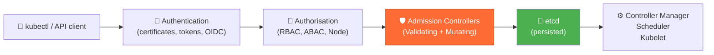
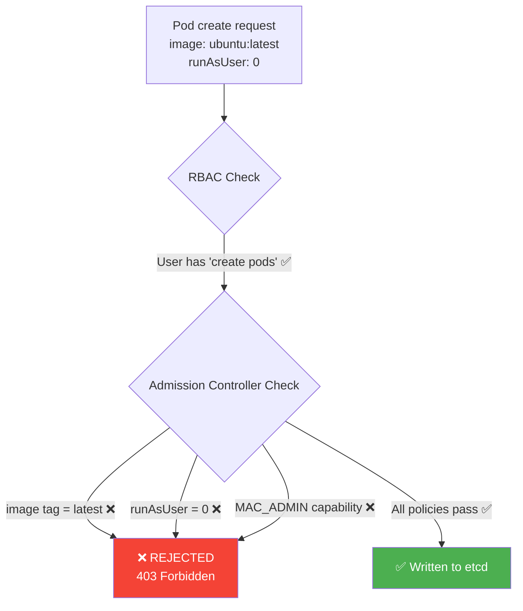
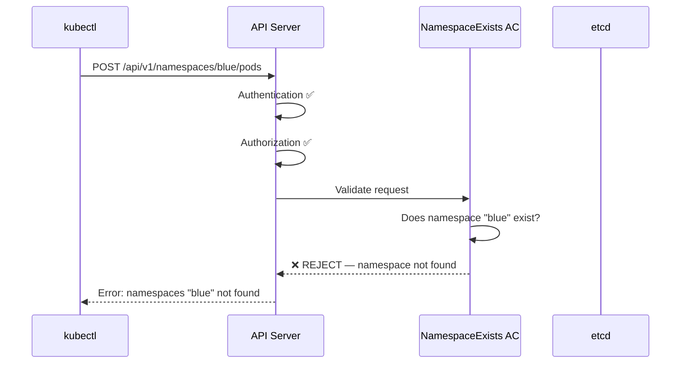
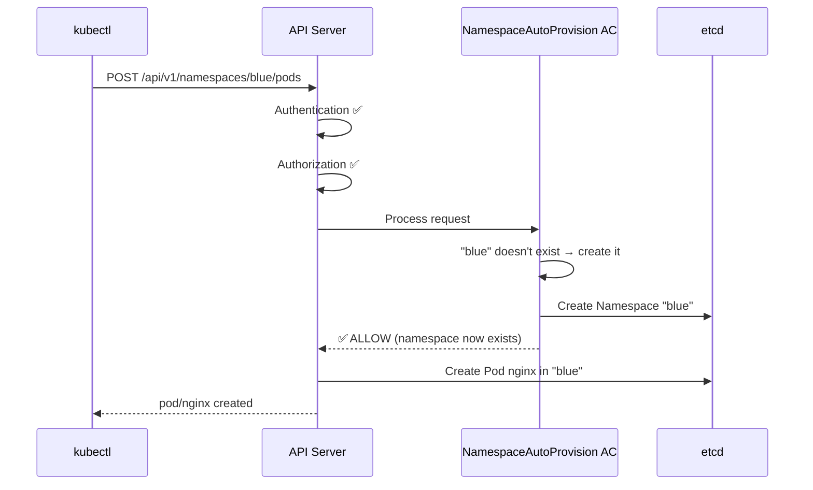
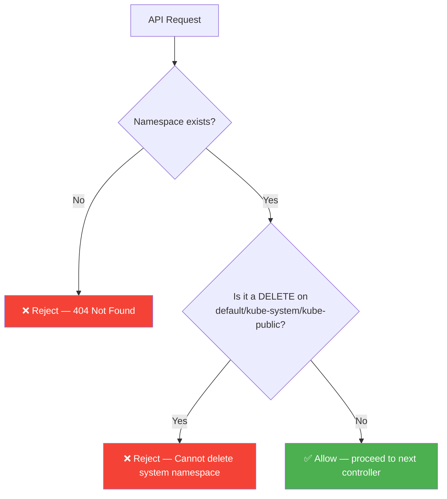
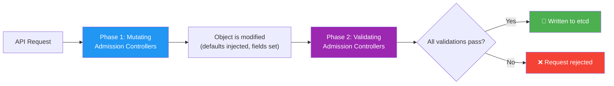
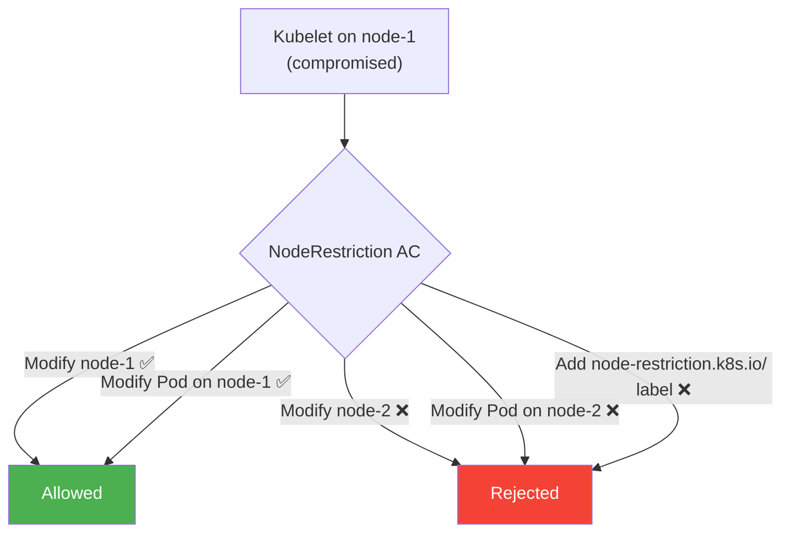
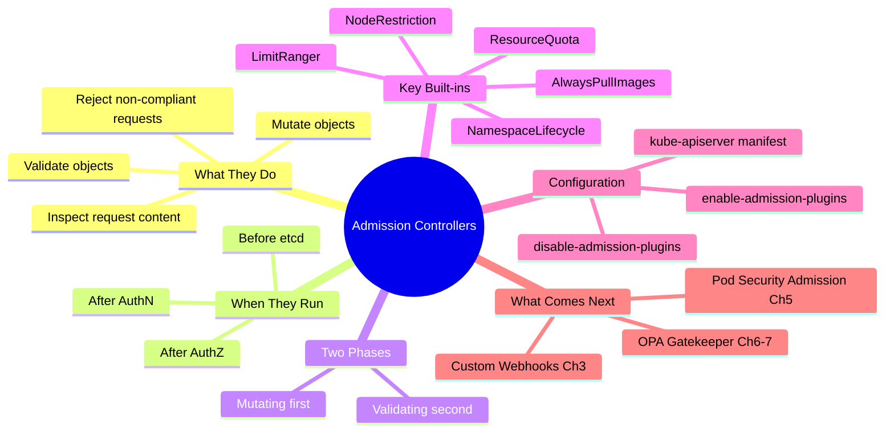

# 2 — Admission Controllers


---

## Why This Matters

RBAC is powerful — but it has a ceiling. It can answer **"can this user perform this verb on this resource?"** but it cannot answer:

- "Is the image from an approved registry?"
- "Is the tag something other than `latest`?"
- "Is the container about to run as root?"
- "Does this Pod have the required labels for cost tracking?"

These questions live **beyond** authentication and authorisation. They require something that inspects the **content** of the request, not just who is making it and what resource they are touching.

That something is an **Admission Controller** — a gatekeeper that runs after AuthN/AuthZ but **before** the object is persisted to etcd. Without admission controllers, a user with `create pods` permission could push anything into the cluster: root-running containers, untagged images from Docker Hub, Pods in namespaces that don't even exist. Admission controllers are where you enforce the hard security and operational policies that RBAC simply cannot express.

For the CKS exam, admission controllers are a **foundational concept** that underpins everything that comes after: Validating/Mutating webhooks, OPA Gatekeeper, Pod Security Admission — all of them are built on top of this mechanism.

---

## What Is an Admission Controller?

An admission controller is a **compiled-in plug-in** (or externally wired webhook) that intercepts requests to the Kubernetes API server after authentication and authorisation have passed, but before the object is written to etcd.

| Attribute | Detail |
|---|---|
| **Where it runs** | Inside the kube-apiserver process (built-in) or as an external webhook (custom) |
| **When it runs** | After AuthN → AuthZ, before etcd write |
| **What it can do** | Validate (accept/reject) and/or Mutate (modify) the request object |
| **Scope** | Any API request — Pods, Services, Namespaces, RBAC objects, etc. |
| **Configuration** | `--enable-admission-plugins` / `--disable-admission-plugins` flags on kube-apiserver |
| **Kubernetes source** | `plugin/pkg/admission/` in the kubernetes/kubernetes repo |

### What Admission Controllers Are NOT

| Misconception | Reality |
|---|---|
| "They replace RBAC" | They extend RBAC — AuthZ still runs first |
| "They only affect Pods" | They intercept ALL API object types |
| "They are network policies" | They gate the API server, not network traffic |
| "They are always on" | Each plug-in must be explicitly enabled or is opt-in |
| "Webhooks are the same as built-in controllers" | Webhooks are dynamic; built-ins are compiled into the binary |

---

## How the Kubernetes Request Lifecycle Works

Every `kubectl` command (or API call) travels through a strict pipeline before it reaches etcd.



### Step-by-step breakdown

**1 — Authentication**

The API server verifies the identity of the caller. For `kubectl`, this comes from the KubeConfig file:

```bash
cat ~/.kube/config
```

```yaml
apiVersion: v1
clusters:
- cluster:
    certificate-authority-data: LS0tLS1CRUdJTiBDRVUx...   # base64 CA cert
    server: https://controlplane:6443
  name: kubernetes
users:
- name: admin
  user:
    client-certificate-data: LS0tLS1CRUdJTiBDRVJU...       # base64 client cert
    client-key-data: LS0tLS1CRUdJTiBSU0Eg...               # base64 private key
```

**2 — Authorisation (RBAC)**

After identity is confirmed, RBAC checks whether the identity is *allowed* to perform the requested verb on the requested resource. A typical developer role:

```yaml
apiVersion: rbac.authorization.k8s.io/v1
kind: Role
metadata:
  name: developer
rules:
- apiGroups: [""]
  resources: ["pods"]
  verbs: ["list", "get", "create", "update", "delete"]
```

RBAC can also be scoped to specific resource names:

```yaml
# Only allows creating pods named "blue" or "orange"
rules:
- apiGroups: [""]
  resources: ["pods"]
  verbs: ["create"]
  resourceNames: ["blue", "orange"]
```

**3 — Admission Controllers (the focus of this chapter)**

Even after a user is authenticated and authorised, the admission layer can still reject or modify the request. This is where policies about *content* are enforced.

**4 — etcd persistence**

Only requests that survive the full pipeline are written to etcd and acted on by controllers, the scheduler, and kubelets.

---

## The RBAC Gap — Why Admission Controllers Exist

Consider this Pod manifest:

```yaml
apiVersion: v1
kind: Pod
metadata:
  name: web-pod
spec:
  containers:
  - name: ubuntu
    image: ubuntu:latest        # ❌ latest tag — unpredictable
    command: ["sleep", "3600"]
    securityContext:
      runAsUser: 0              # ❌ running as root
      capabilities:
        add: ["MAC_ADMIN"]      # ❌ elevated capability
```

RBAC says: **"The user is allowed to create Pods."** ✅

RBAC does **not** say:
- "But not if the image tag is `latest`"
- "But not if it runs as UID 0"
- "But not if it requests `MAC_ADMIN`"

Admission controllers fill this gap by inspecting the *body* of the request, not just the verb and resource type.



---

## Built-In Admission Controllers

Kubernetes ships with a large set of built-in controllers. The most important ones to know:

| Controller | Type | What It Does | Default? |
|---|---|---|---|
| **AlwaysPullImages** | Validating | Forces `imagePullPolicy: Always` — prevents using cached images from other namespaces | No |
| **DefaultStorageClass** | Mutating | Auto-adds default StorageClass to PVCs that don't specify one | Yes |
| **EventRateLimit** | Validating | Throttles API server event flood — prevents DoS via event spam | No |
| **NamespaceExists** | Validating | Rejects requests targeting non-existent namespaces | Yes (deprecated → NamespaceLifecycle) |
| **NamespaceAutoProvision** | Mutating | Auto-creates namespace if it doesn't exist | No (deprecated → NamespaceLifecycle) |
| **NamespaceLifecycle** | Validating | Rejects requests to non-existent namespaces; protects `default`, `kube-system`, `kube-public` from deletion | Yes |
| **NodeRestriction** | Validating | Limits what the kubelet can modify — prevents lateral movement via node compromise | Yes |
| **LimitRanger** | Mutating+Validating | Enforces resource limits/requests on Pods per namespace | Yes |
| **ResourceQuota** | Validating | Enforces namespace-level resource consumption limits | Yes |
| **ServiceAccount** | Mutating | Auto-mounts the default ServiceAccount token into Pods | Yes |
| **MutatingAdmissionWebhook** | Mutating | Calls external webhooks to mutate objects (OPA, Kyverno, etc.) | Yes |
| **ValidatingAdmissionWebhook** | Validating | Calls external webhooks to validate objects | Yes |
| **PodSecurity** | Validating | Enforces Pod Security Standards (replaces PSP) | Yes (K8s 1.25+) |

---

## Namespace-Related Controllers Deep Dive

These controllers illustrate the admission controller concept most clearly.

### NamespaceExists (Deprecated → NamespaceLifecycle)

When you run:

```bash
kubectl run nginx --image=nginx --namespace=blue
```

If the `blue` namespace doesn't exist:



```
Error from server (NotFound): namespaces "blue" not found
```

### NamespaceAutoProvision (Deprecated → NamespaceLifecycle)

With this controller enabled, the same command would:



```bash
kubectl get namespaces
# NAME          STATUS   AGE
# blue          Active   3m   ← automatically created
# default       Active   23m
# kube-public   Active   24m
# kube-system   Active   24m
```

### NamespaceLifecycle (The Replacement)

The modern replacement combines both behaviours and adds protection for system namespaces:



---

## Discovering and Configuring Admission Controllers

### Viewing Enabled Controllers

To see which admission controllers are currently enabled:

```bash
# On a binary-based setup
kube-apiserver -h | grep enable-admission-plugins

# On a kubeadm setup (controllers run as pods)
kubectl exec kube-apiserver-controlplane -n kube-system -- \
  kube-apiserver -h | grep enable-admission-plugins
```

You can also inspect the API server manifest directly:

```bash
# kubeadm stores the manifest here
cat /etc/kubernetes/manifests/kube-apiserver.yaml | grep admission
```

### Enabling Additional Controllers

**Binary setup** — edit the systemd unit file:

```bash
ExecStart=/usr/local/bin/kube-apiserver \
  --advertise-address=${INTERNAL_IP} \
  --allow-privileged=true \
  --authorization-mode=Node,RBAC \
  --enable-admission-plugins=NodeRestriction,NamespaceAutoProvision \
  ...
```

**Kubeadm setup** — edit the static Pod manifest:

```yaml
# /etc/kubernetes/manifests/kube-apiserver.yaml
apiVersion: v1
kind: Pod
metadata:
  name: kube-apiserver
  namespace: kube-system
spec:
  containers:
  - name: kube-apiserver
    image: k8s.gcr.io/kube-apiserver:v1.29.0
    command:
    - kube-apiserver
    - --authorization-mode=Node,RBAC
    - --enable-admission-plugins=NodeRestriction,NamespaceAutoProvision
    - --disable-admission-plugins=DefaultStorageClass
```

> **Important:** After editing `/etc/kubernetes/manifests/kube-apiserver.yaml`, the kubelet automatically restarts the API server pod. Wait 30–60 seconds for it to come back up.

### Enabling vs Disabling

```bash
# Enable specific controllers
--enable-admission-plugins=NodeRestriction,AlwaysPullImages,LimitRanger

# Disable specific controllers (even if they are default-on)
--disable-admission-plugins=DefaultStorageClass,NamespaceLifecycle
```

> ⚠️ **Never disable `NamespaceLifecycle`** in production — it protects `kube-system` and `kube-public` from accidental deletion.

---

## Two Phases: Mutating Then Validating

When a request passes through admission controllers, it goes through two distinct phases:



**Why mutate before validating?**

Mutation runs first so that injected defaults (e.g., storage class, resource limits, security context fields) are visible to validators before the final decision is made. If validation ran first, it would reject requests that would have been fixed by mutation.

**Example flow for a PVC with no StorageClass:**

1. Mutating — `DefaultStorageClass` injects `storageClassName: standard`
2. Validating — `ResourceQuota` checks the modified PVC meets quota
3. etcd — PVC persisted with the injected storage class

---

## NodeRestriction — The Security-Critical Built-In

The `NodeRestriction` admission controller is especially important from a security perspective and is **enabled by default**.

**What it does:**

Limits what a kubelet can modify when it authenticates to the API server using its node certificate. A kubelet can only:
- Modify its **own** Node object
- Modify Pods **scheduled to its own node**

It cannot:
- Modify other nodes' objects
- Modify arbitrary Pods on other nodes
- Add the `node-restriction.kubernetes.io/` label prefix (reserved for this protection)

**Why this matters for CKS:**

If an attacker compromises a node and gets the kubelet credentials, `NodeRestriction` prevents them from using those credentials to pivot and modify the entire cluster. It is a critical lateral movement defence.



---

## Real-World Scenarios

### Scenario 1 — Blocking Docker Hub Images with AlwaysPullImages

**Problem:** Engineers are using `imagePullPolicy: IfNotPresent` and pulling from Docker Hub. A compromised node could serve a cached malicious image to other pods.

**Solution:** Enable `AlwaysPullImages` admission controller:

```yaml
# kube-apiserver manifest
- --enable-admission-plugins=NodeRestriction,AlwaysPullImages
```

**Effect:** Every Pod creation or restart forces a fresh pull — the registry credentials are always validated, and cached images can't be reused without re-authentication.

**Side effect to be aware of:** Increases startup latency and registry load. Requires all nodes to have registry pull credentials configured.

### Scenario 2 — Diagnosing a "Namespace Not Found" Error

**Symptom:**

```bash
kubectl run app --image=nginx --namespace=production
# Error from server (NotFound): namespaces "production" not found
```

**Diagnosis steps:**

```bash
# 1. Confirm the namespace doesn't exist
kubectl get namespace production

# 2. Check which admission controllers are active
kubectl exec kube-apiserver-controlplane -n kube-system -- \
  kube-apiserver -h | grep admission-plugins

# 3. Confirm NamespaceLifecycle is present (default-on)
# This is the controller rejecting the request

# 4. Fix — create the namespace first
kubectl create namespace production

# 5. Retry
kubectl run app --image=nginx --namespace=production
```

**Do NOT enable NamespaceAutoProvision** in production clusters — auto-creating namespaces can mask typos and create sprawl.

### Scenario 3 — Hardening with Multiple Controllers Together

**Use-case:** A team wants to enforce that all workloads:
1. Use only images from `registry.internal.company.com`
2. Always pull fresh (no stale cache)
3. Have resource limits set

**Configuration:**

```yaml
# /etc/kubernetes/manifests/kube-apiserver.yaml
command:
- kube-apiserver
- --enable-admission-plugins=NodeRestriction,AlwaysPullImages,LimitRanger,ResourceQuota
```

Then create namespace-level LimitRange and ResourceQuota objects:

```yaml
# Namespace defaults and limits
apiVersion: v1
kind: LimitRange
metadata:
  name: default-limits
  namespace: production
spec:
  limits:
  - type: Container
    default:
      cpu: "500m"
      memory: "256Mi"
    defaultRequest:
      cpu: "100m"
      memory: "64Mi"
    max:
      cpu: "2"
      memory: "1Gi"
---
apiVersion: v1
kind: ResourceQuota
metadata:
  name: compute-quota
  namespace: production
spec:
  hard:
    requests.cpu: "10"
    requests.memory: "20Gi"
    pods: "50"
```

Image registry enforcement requires a custom webhook (covered in Chapter 3).

---

## Common Mistakes

| Mistake | Consequence | Fix |
|---|---|---|
| Disabling `NamespaceLifecycle` | `kube-system` can be accidentally deleted, breaking the cluster | Never disable this controller |
| Enabling `NamespaceAutoProvision` in production | Typos in namespace names silently create new namespaces | Use `NamespaceLifecycle` only |
| Forgetting the API server pod restart delay | New admission plugins appear missing — engineers re-edit the manifest, creating a loop | Wait 60s after editing the manifest; verify with `kubectl get pod -n kube-system` |
| Using `--enable-admission-plugins` without the full list | Only the listed controllers are enabled — previous defaults may be lost | Use `--enable-admission-plugins` to ADD; use `--disable-admission-plugins` to REMOVE specific ones from the default set |
| Expecting RBAC to enforce image policy | RBAC has no visibility into request body content | Use admission controllers or webhooks for content-based policies |
| Confusing Mutating and Validating ordering | Assuming validators run first and missing the mutation window | Mutating always runs before Validating |

---

## Quick Reference

### Key Commands

```bash
# View enabled admission plugins (kubeadm)
kubectl exec kube-apiserver-controlplane -n kube-system -- \
  kube-apiserver -h | grep enable-admission-plugins

# Edit the API server manifest (kubeadm)
vim /etc/kubernetes/manifests/kube-apiserver.yaml

# Watch API server restart after manifest edit
watch kubectl get pods -n kube-system

# Check API server logs if it fails to restart
crictl logs $(crictl ps -a --name kube-apiserver -q | head -1)

# Verify which plugins are running (check args on running pod)
kubectl get pod kube-apiserver-controlplane -n kube-system \
  -o jsonpath='{.spec.containers[0].command}' | tr ',' '\n' | grep admission
```

### Admission Controller Reference Card

```
DEFAULT-ON controllers (partial list):
  NamespaceLifecycle        — namespace existence + system ns protection
  NodeRestriction           — kubelet scope limitation (lateral movement defence)
  DefaultStorageClass       — auto-assigns storage class to PVCs
  ServiceAccount            — auto-mounts default SA token
  ResourceQuota             — enforces quota objects
  LimitRanger               — enforces LimitRange objects
  MutatingAdmissionWebhook  — external mutation webhooks
  ValidatingAdmissionWebhook — external validation webhooks
  PodSecurity               — Pod Security Standards (K8s 1.25+)

NOT DEFAULT (must enable explicitly):
  AlwaysPullImages          — forces fresh pulls every time
  NamespaceAutoProvision    — auto-creates namespaces (deprecated)
  EventRateLimit            — throttles API server events
  ImagePolicyWebhook        — external image policy evaluation
```

### API Server Flag Syntax

```bash
# Add controllers
--enable-admission-plugins=ControllerA,ControllerB

# Remove controllers from defaults
--disable-admission-plugins=DefaultStorageClass

# Both flags can coexist
--enable-admission-plugins=AlwaysPullImages
--disable-admission-plugins=DefaultStorageClass
```

---

## CKS Exam Tips

> 💡 **The admission controller pipeline order is testable:** Authentication → Authorization → Admission → etcd. Know it cold.

> 💡 **NodeRestriction is a favourite exam topic.** Know what it restricts (kubelet can only touch its own node + its own scheduled pods) and why it matters (lateral movement prevention after node compromise).

> 💡 **Editing the API server manifest** — exam tasks often ask you to enable a plugin. Edit `/etc/kubernetes/manifests/kube-apiserver.yaml`, add to `--enable-admission-plugins`, and wait for the pod to restart.

> 💡 **NamespaceLifecycle vs NamespaceAutoProvision vs NamespaceExists** — NamespaceExists and NamespaceAutoProvision are deprecated. NamespaceLifecycle is their replacement. The exam may use the deprecated names in questions — map them to NamespaceLifecycle.

> 💡 **Mutating runs before Validating.** This sequence matters because injected defaults must be present before validation checks them.

> 💡 **RBAC vs Admission Controllers** — the key distinction: RBAC controls WHO can do WHAT verb on WHAT resource. Admission controllers control WHETHER the content of the request is acceptable.

> 💡 **AlwaysPullImages** is a security hardening measure — it prevents a compromised node from serving a cached malicious image. Enabling it is a CKS-style hardening task.

```yaml
# CKS exam pattern — enable admission plugin in kubeadm cluster
# File: /etc/kubernetes/manifests/kube-apiserver.yaml
spec:
  containers:
  - command:
    - kube-apiserver
    - --enable-admission-plugins=NodeRestriction,AlwaysPullImages  # ← add here
    - --disable-admission-plugins=DefaultStorageClass               # ← or remove here
```

---

## Summary

Admission controllers are the **content-aware security layer** in the Kubernetes API pipeline. They run after authentication and authorisation but before persistence, giving them the ability to inspect, reject, or modify any API request based on its actual content — not just who is making it.

The key takeaways:

- **RBAC controls access; admission controllers control content.** They are complementary, not alternatives.
- **Two phases:** Mutating runs first (to inject defaults), then Validating (to check the final state).
- **NodeRestriction** is the CKS-critical default controller — it limits kubelet privilege scope and blocks lateral movement.
- **NamespaceLifecycle** replaced the deprecated NamespaceExists and NamespaceAutoProvision controllers.
- Built-in controllers cover many common needs, but for complex policies (registry whitelisting, label enforcement, security context requirements) you need **webhooks** — covered in Chapter 3.



---

## What's Next

**Chapter 3 — Validating and Mutating Admission Controllers** takes the concepts here further: instead of being limited to the built-in plug-ins, you will build **external webhooks** — HTTP servers that Kubernetes calls at admission time. This unlocks arbitrary policy logic: image registry enforcement, label injection, security context defaults, and more. The two webhook admission controllers (`MutatingAdmissionWebhook` and `ValidatingAdmissionWebhook`) that ship as defaults are the hook points Chapter 3 exploits.

---

*Chapter 2 of 30 — Microservice Vulnerabilities | Kubernetes Security Study Guide*
