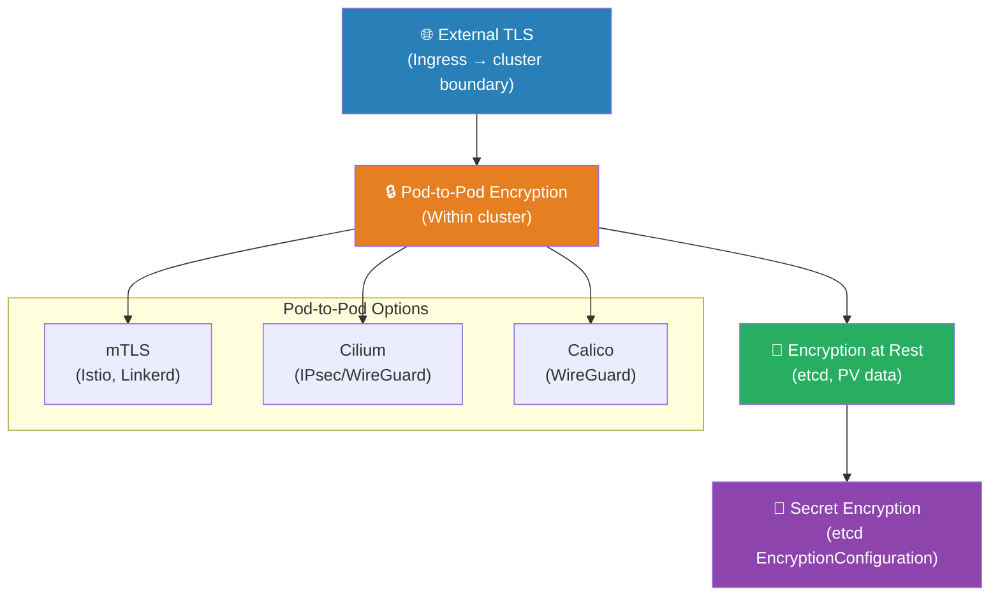

# Chapter 26 — Pod-to-Pod Encryption

> **Section:** Microservice Vulnerabilities
> **Previous:** [Chapter 25 — DNS in Multi-Tenant Environments](./25%20---%20DNS%20in%20Multi%20Tenant%20Environments.md)
> **Next:** [Chapter 27 — Implementing Pod-to-Pod Encryption using mTLS](./27%20---%20Implement%20Pod%20to%20Pod%20Encryption%20using%20mTLS.md)

---

## Why This Matters for CKS

After securing the API layer (RBAC, admission), the runtime environment (PSA, sandboxing), the multi-tenancy stack (namespaces, NetworkPolicy, node pools), and the DNS layer, one major attack surface remains: the network traffic flowing between pods inside the cluster. By default, pod-to-pod communication is unencrypted. Any attacker who can read traffic on the cluster network — a compromised node, a rogue CNI plugin, a cloud-provider network tap, or an insider threat — can read the plaintext payload of every inter-service call.

The CKS exam tests pod-to-pod encryption as a conceptual and practical topic:
- Understanding *why* in-cluster traffic needs encryption (zero-trust threat model)
- Identifying the three implementation approaches (mTLS, Cilium, Calico)
- Knowing the trade-offs between application-layer, CNI-layer, and service-mesh-layer encryption
- Understanding how mTLS provides both encryption AND authentication (Chapter 13 revisited at runtime)
- Chapter 27 then provides the hands-on implementation with Cilium

---

## The Problem: Unencrypted Pod-to-Pod Traffic

Kubernetes networking by default operates on a **trust-the-network** assumption: if a packet successfully reaches a pod's IP and port (after clearing NetworkPolicy), it's treated as legitimate. But this assumption has failure modes:

```
Unencrypted Cluster Traffic — Attack Scenarios
════════════════════════════════════════════════

Scenario 1: Compromised node (lateral movement)
  Attacker gains root on Node 2
  Runs: tcpdump -i eth0 -nn port 5432
  Captures: plaintext PostgreSQL queries from pods on Node 2
  Reads: customer PII, credit card numbers, authentication tokens

Scenario 2: Cloud provider network tap
  Shared hypervisor in a cloud environment
  Network traffic visible to hypervisor before encryption
  In some cloud configurations, VXLAN/Geneve overlay traffic
  can be inspected at the underlying physical network layer

Scenario 3: Rogue CNI or compromised CNI agent
  CNI plugins run as DaemonSets with host network access
  A compromised CNI agent can read all pod traffic on its node
  (all traffic passes through the CNI plugin's eBPF programs)

Scenario 4: Insider threat
  Malicious cluster administrator
  Has access to node-level traffic capture tools
  Can read all unencrypted inter-service communication

Scenario 5: Man-in-the-Middle (ARP spoofing)
  Attacker pod in same namespace
  Sends gratuitous ARP packets to redirect traffic
  Intercepts and reads traffic from frontend to backend
```

**The root cause in all scenarios:** Traffic between pods traverses the cluster network as plaintext. Anyone with network-layer access can read it.

---

## The E-Commerce Use Case

The KodeKloud source illustrates this with a concrete example:

```
E-Commerce Application Without Pod-to-Pod Encryption
══════════════════════════════════════════════════════

Customer places order
      │
      ▼
┌────────────────────┐
│  Frontend Pod      │  "Here's the payment data:"
│  (order service)   │  credit_card: 4532-1234-5678-9012
│                    │  cvv: 123
│                    │  amount: $500.00
└──────────────────┬─┘
                   │
                   │ HTTP (PLAINTEXT) ← Can be intercepted!
                   │
┌──────────────────▼─┐
│  Backend Pod       │
│  (payment service) │
└────────────────────┘

Any attacker with access to the node's network interface
can run tcpdump and read the credit card number in plaintext.

With pod-to-pod encryption:
  Frontend → [TLS/mTLS encrypted packet] → Backend
  Intercepted payload: gibberish (AES-256 ciphertext)
  Without the session key: impossible to decrypt
```

This is the core motivation: encryption ensures that intercepted traffic is unreadable, regardless of *how* it was intercepted.

---

## Why Compliance Requires Pod-to-Pod Encryption

Even if you trust your own infrastructure, regulatory standards often mandate encryption of data in transit:

```
┌──────────────────────────────────────────────────────────────────┐
│         Compliance Standards and In-Transit Encryption           │
├─────────────────────┬────────────────────────────────────────────┤
│ GDPR                │ Article 32: "encryption of personal data"  │
│                     │ In-cluster traffic carrying PII must be    │
│                     │ encrypted if it could be intercepted       │
├─────────────────────┼────────────────────────────────────────────┤
│ HIPAA               │ 45 CFR §164.312(e)(2)(ii): "Encryption and │
│                     │ Decryption" — PHI transmitted over         │
│                     │ electronic networks must be encrypted      │
├─────────────────────┼────────────────────────────────────────────┤
│ PCI-DSS             │ Requirement 4.2.1: "Strong cryptography    │
│                     │ shall be used to safeguard PAN during      │
│                     │ transmission over open, public networks"   │
│                     │ Internal cluster networks may qualify as   │
│                     │ "open" in shared cloud environments        │
├─────────────────────┼────────────────────────────────────────────┤
│ SOC 2               │ Availability + Confidentiality criteria:   │
│                     │ Data in transit should be encrypted        │
└─────────────────────┴────────────────────────────────────────────┘
```

A common compliance failure mode: teams encrypt external-facing APIs (HTTPS at the Ingress) but leave all internal pod-to-pod traffic unencrypted, then claim compliance. Auditors who understand Kubernetes know to look for in-cluster encryption.

---

## Zero-Trust Security Model

Pod-to-pod encryption is a cornerstone of the **zero-trust** security model as applied to Kubernetes:

```
Traditional (Perimeter-Based) Security Model:
  "Trust everything inside the network perimeter"
  → Pod A trusts Pod B because both are in the cluster
  → No encryption needed internally
  → Single perimeter breach = full lateral access

Zero-Trust Security Model:
  "Never trust, always verify — regardless of location"
  → Pod A doesn't trust Pod B just because it's in the cluster
  → Every connection requires cryptographic authentication (mTLS)
  → Every packet is encrypted regardless of network location
  → A breach of one pod doesn't automatically trust-grant another

Zero-Trust in Kubernetes requires:
  ✅ Authentication: mTLS (both sides prove identity with certs)
  ✅ Encryption: TLS/IPsec/WireGuard (all traffic encrypted)
  ✅ Authorization: NetworkPolicy + RBAC (limit what's reachable)
  ✅ Least privilege: minimum network access, minimum permissions
```

Pod-to-pod encryption is the encryption pillar of zero-trust. Without it, you have authentication (mTLS identity) but the traffic itself is still readable by network observers.

---

## The Three Implementation Approaches

Kubernetes itself does not encrypt pod-to-pod traffic — encryption must be added by external tools. Three primary approaches exist:

```
┌─────────────────────────────────────────────────────────────────────┐
│           Pod-to-Pod Encryption Approaches                          │
├──────────────────┬─────────────────────────────────────────────────┤
│ Approach         │ Description                                      │
├──────────────────┼─────────────────────────────────────────────────┤
│ 1. Mutual TLS    │ Application-layer or sidecar-layer encryption   │
│    (mTLS)        │ via service meshes (Istio, Linkerd)             │
│                  │ Both encryption AND authentication               │
│                  │ Application code unmodified (sidecar handles)   │
│                  │ SPIFFE/SVID certificate identity per workload   │
├──────────────────┼─────────────────────────────────────────────────┤
│ 2. Cilium        │ CNI-layer transparent encryption                 │
│    Encryption    │ IPsec or WireGuard protocols                     │
│                  │ Completely transparent to pods/applications      │
│                  │ No sidecars, no app changes                     │
│                  │ Encrypts ALL pod traffic automatically           │
├──────────────────┼─────────────────────────────────────────────────┤
│ 3. Calico        │ CNI-layer IPsec encryption                      │
│    Encryption    │ Similar to Cilium IPsec mode                    │
│                  │ Transparent to applications                     │
│                  │ Requires Calico CNI (Tigera Secure)             │
└──────────────────┴─────────────────────────────────────────────────┘
```

### Approach 1: Mutual TLS (mTLS) via Service Mesh

Covered in depth in Chapter 13 (mTLS theory) and Chapter 27 (implementation). The service mesh approach uses sidecar proxies (Envoy in Istio, Linkerd proxy in Linkerd) injected into every pod:

```
Service Mesh mTLS Architecture:
════════════════════════════════

Frontend Pod                          Backend Pod
┌─────────────────────┐              ┌─────────────────────┐
│ ┌──────────────┐    │              │    ┌──────────────┐  │
│ │ App Container│    │              │    │ App Container│  │
│ │ (sends HTTP) │    │              │    │ (receives    │  │
│ └──────┬───────┘    │              │    │  HTTP)       │  │
│        │ localhost  │              │    └──────┬───────┘  │
│ ┌──────▼───────┐    │              │    ┌──────▼───────┐  │
│ │Envoy Sidecar │◄───┼─mTLS/TLS 1.3─┼───►│Envoy Sidecar │  │
│ │(intercepts + │    │              │    │(decrypts +   │  │
│ │ encrypts)    │    │              │    │ forwards)    │  │
│ └──────────────┘    │              │    └──────────────┘  │
└─────────────────────┘              └─────────────────────┘

Key properties:
  • App containers communicate via localhost (127.0.0.1) — no TLS awareness needed
  • Sidecar intercepts outbound traffic, encrypts it
  • Sidecar on the other end decrypts, passes to local app
  • Both sidecars verify each other's SPIFFE SVID certificates (mTLS)
  • Certificate rotation is automatic (Istiod CA issues short-lived certs)
```

**Service mesh mTLS advantages:**
- Provides identity-based authentication (not just encryption)
- Fine-grained per-service policy (allow/deny based on identity)
- Automatic certificate rotation
- Works at L7 — can make decisions based on HTTP headers, gRPC methods
- Rich observability (request tracing, latency metrics per service)

**Service mesh mTLS limitations:**
- Adds latency (~1-3ms per hop for the proxy)
- Memory/CPU overhead for sidecar containers in every pod
- Operational complexity (managing the service mesh control plane)
- Doesn't encrypt all traffic — DaemonSets, host-network pods may bypass

### Approach 2: Cilium Encryption (IPsec or WireGuard)

Cilium implements encryption at the **network layer (L3/L4)** directly in the kernel using eBPF. No sidecars, no application changes — all pod traffic is transparently encrypted:

```
Cilium Transparent Encryption Architecture:
═══════════════════════════════════════════

Frontend Pod                          Backend Pod
┌─────────────────────┐              ┌─────────────────────┐
│ ┌──────────────┐    │              │    ┌──────────────┐  │
│ │ App Container│    │              │    │ App Container│  │
│ │ (sends HTTP  │    │              │    │ (receives    │  │
│ │  plaintext)  │    │              │    │  HTTP plain) │  │
│ └──────────────┘    │              │    └──────────────┘  │
│        │            │              │          ▲            │
│  Linux kernel / eBPF│              │   Linux kernel / eBPF │
│  Cilium agent       │              │   Cilium agent        │
│  encrypts packet    │              │   decrypts packet     │
└─────────┬───────────┘              └──────────┬────────────┘
          │                                     │
          └───── Encrypted (IPsec/WireGuard) ───┘
                  (node-to-node transport)

Key properties:
  • Pods communicate as normal — no TLS in app code
  • Cilium agent on each node encrypts all traffic before it leaves the node
  • Cilium agent on destination node decrypts before delivering to pod
  • Encryption is node-level: all pod-to-pod traffic between two nodes is encrypted
  • IPsec: kernel-native, FIPS-140 compliant, well-tested
  • WireGuard: modern, fast, simpler key management, not FIPS-140 (yet)
```

**Cilium encryption advantages:**
- Zero application changes
- No sidecar overhead
- Encrypts ALL pod traffic (including DaemonSets)
- Very low performance overhead (kernel-native crypto acceleration)
- Simple to enable (one flag in Cilium config)

**Cilium encryption limitations:**
- No L7 identity awareness (encrypts by IP, not by workload identity)
- WireGuard: not FIPS-140 compliant (matters for government/regulated workloads)
- IPsec: more complex key management
- Does not provide mTLS authentication (encryption only, not mutual identity verification)

### Approach 3: Calico Encryption (IPsec via WireGuard)

Calico (the Tigera commercial version or open-source with WireGuard) provides similar node-level transparent encryption to Cilium:

```yaml
# Enable WireGuard encryption in Calico
kubectl patch felixconfiguration default \
  --type='merge' \
  -p '{"spec":{"wireguardEnabled":true}}'

# Verify WireGuard is active on nodes
kubectl get node node-1 -o yaml | grep wireguard
# status.annotations."projectcalico.org/WireguardPublicKey": <key>
```

---

## Comparison: Which Approach to Use?

```
┌────────────────────────────────────────────────────────────────────────┐
│              Pod-to-Pod Encryption Approach Selection Guide             │
├────────────────────┬────────────────┬────────────────┬─────────────────┤
│ Requirement        │ mTLS (service  │ Cilium         │ Calico          │
│                    │ mesh)          │ (IPsec/WG)     │ (IPsec/WG)      │
├────────────────────┼────────────────┼────────────────┼─────────────────┤
│ Zero app changes   │ ✅ (sidecar)   │ ✅             │ ✅              │
├────────────────────┼────────────────┼────────────────┼─────────────────┤
│ Workload identity  │ ✅ SPIFFE/SVID │ ❌ IP-based    │ ❌ IP-based     │
│ authentication     │                │                │                 │
├────────────────────┼────────────────┼────────────────┼─────────────────┤
│ L7 traffic policy  │ ✅             │ ❌             │ ❌              │
├────────────────────┼────────────────┼────────────────┼─────────────────┤
│ Low overhead       │ ❌ Sidecar CPU │ ✅ Kernel-level│ ✅ Kernel-level │
│                    │ and memory     │                │                 │
├────────────────────┼────────────────┼────────────────┼─────────────────┤
│ Encrypts ALL       │ ❌ Only mesh-  │ ✅ All pod     │ ✅ All pod      │
│ traffic            │ enrolled pods  │ traffic        │ traffic         │
├────────────────────┼────────────────┼────────────────┼─────────────────┤
│ FIPS-140 compliant │ ✅ TLS 1.3    │ ✅ IPsec mode  │ ✅ IPsec mode  │
│                    │               │ ❌ WireGuard   │ ❌ WireGuard    │
├────────────────────┼────────────────┼────────────────┼─────────────────┤
│ Ease of deployment │ ❌ Complex     │ ✅ Simple flag │ ✅ Simple flag  │
│                    │ (mesh install) │                │                 │
├────────────────────┼────────────────┼────────────────┼─────────────────┤
│ Observability      │ ✅ Distributed │ ❌ Basic       │ ❌ Basic        │
│                    │ tracing, L7   │                │                 │
├────────────────────┼────────────────┼────────────────┼─────────────────┤
│ Best for           │ Zero-trust     │ Simple blanket │ Calico users    │
│                    │ microservices, │ encryption,    │ wanting blanket │
│                    │ regulated      │ Cilium users   │ encryption      │
│                    │ workloads      │                │                 │
└────────────────────┴────────────────┴────────────────┴─────────────────┘
```

---

## The Encryption Layer Stack

Pod-to-pod encryption sits in a specific place in the overall Kubernetes security stack:



For a fully encrypted Kubernetes cluster:
- **External → cluster**: TLS at the Ingress controller
- **Pod → pod**: mTLS (service mesh) or Cilium/Calico transparent encryption
- **etcd**: EncryptionConfiguration (Chapter 9)
- **Persistent volumes**: StorageClass encrypted: "true" (Chapter 21)

Each layer is independent — you need all four for defence-in-depth.

---

## Benefits Summary

```
┌─────────────────────────────────────────────────────────────────┐
│         Benefits of Pod-to-Pod Encryption                       │
├──────────────────────────────────────────────────────────────────┤
│ Data Confidentiality                                            │
│   Intercepted packets are unreadable (AES-256 ciphertext)      │
│   Protects PII, credentials, business logic in transit         │
├──────────────────────────────────────────────────────────────────┤
│ Integrity                                                       │
│   Tampered packets are detected and rejected (AEAD MACs)       │
│   Prevents in-transit data modification                        │
├──────────────────────────────────────────────────────────────────┤
│ Authentication (mTLS only)                                      │
│   Each service proves cryptographic identity                   │
│   Prevents connection from spoofed services                    │
├──────────────────────────────────────────────────────────────────┤
│ Compliance                                                      │
│   Satisfies GDPR Art. 32, HIPAA §164.312, PCI-DSS Req. 4      │
│   "Encryption in transit" requirement met for internal traffic  │
├──────────────────────────────────────────────────────────────────┤
│ Zero-Trust Enablement                                           │
│   Network location no longer implies trust                     │
│   Every connection authenticated and encrypted                 │
├──────────────────────────────────────────────────────────────────┤
│ Insider Threat Mitigation                                       │
│   Node-level access (including cluster admins) can't read      │
│   pod-to-pod payload content                                   │
├──────────────────────────────────────────────────────────────────┤
│ Key Management Automation                                       │
│   Service meshes rotate certs automatically (Istiod CA)        │
│   Cilium/Calico rotate WireGuard/IPsec keys automatically      │
│   No manual certificate lifecycle management                   │
└─────────────────────────────────────────────────────────────────┘
```

---

## Common Mistakes and Exam Traps

### ❌ Mistake 1: Assuming Ingress TLS = in-cluster encryption

TLS at the Ingress terminates at the Ingress controller. Traffic from the Ingress controller to the backend pod is typically plain HTTP (unless using SSL passthrough or end-to-end TLS). Ingress TLS protects external-to-cluster traffic only.

### ❌ Mistake 2: Thinking NetworkPolicy provides encryption

NetworkPolicy controls which pods can communicate — it does not encrypt the traffic that's allowed to flow. A NetworkPolicy allow rule means packets can travel; those packets are still plaintext without pod-to-pod encryption.

### ❌ Mistake 3: Assuming service mesh mTLS covers all traffic

Service meshes only encrypt traffic between pods that have the sidecar proxy injected. DaemonSets, host-network pods, and pods with `sidecar.istio.io/inject: false` bypass the mesh. CNI-level encryption (Cilium/Calico) covers all pod traffic.

### ❌ Mistake 4: Overlooking performance impact when choosing approach

Sidecar-based mTLS adds ~2-5MB memory per pod and 1-3ms latency. For a cluster with 10,000 pods, this is 20-50GB of memory just for sidecars. CNI-level encryption has far lower overhead — kernel AES-NI hardware acceleration makes IPsec and WireGuard very efficient.

### ❌ Mistake 5: Forgetting that encryption at rest and in transit are separate

etcd encryption (Chapter 9) protects data at rest — stored secrets in etcd. Pod-to-pod encryption protects data in transit — packets traveling between pods. Both are required for a fully secure cluster; one does not substitute for the other.

---

## Quick Reference Summary

```
┌─────────────────────────────────────────────────────────────────┐
│          Pod-to-Pod Encryption — Quick Reference                 │
├─────────────────┬───────────────────────────────────────────────┤
│ Why needed      │ Default pod traffic is plaintext              │
│                 │ Interceptable via compromised nodes, CNI,     │
│                 │ cloud network taps, ARP spoofing              │
├─────────────────┼───────────────────────────────────────────────┤
│ Approach 1      │ mTLS via service mesh (Istio/Linkerd)         │
│                 │ + Identity authentication (SPIFFE)            │
│                 │ + L7 policy + observability                   │
│                 │ - Sidecar overhead, operational complexity     │
├─────────────────┼───────────────────────────────────────────────┤
│ Approach 2      │ Cilium transparent encryption                  │
│                 │ + IPsec or WireGuard at kernel level          │
│                 │ + Encrypts ALL pod traffic, zero app changes  │
│                 │ + Low overhead (hardware crypto acceleration) │
│                 │ - No workload identity / L7 policy            │
├─────────────────┼───────────────────────────────────────────────┤
│ Approach 3      │ Calico encryption (WireGuard/IPsec)           │
│                 │ Similar to Cilium but for Calico CNI users    │
├─────────────────┼───────────────────────────────────────────────┤
│ Compliance      │ GDPR, HIPAA, PCI-DSS all require in-transit  │
│                 │ encryption; pod-to-pod satisfies this for     │
│                 │ internal cluster traffic                      │
├─────────────────┼───────────────────────────────────────────────┤
│ Zero-trust      │ Encryption + mTLS authentication = zero-trust │
│                 │ pod-level: no implicit trust by network loc.  │
├─────────────────┼───────────────────────────────────────────────┤
│ NetworkPolicy   │ Controls who can communicate — not encryption  │
│ vs encryption   │ Both are needed; they address different risks  │
└─────────────────┴───────────────────────────────────────────────┘
```

---

## CKS Exam Tips

**Know the three approaches by name and their key trade-offs.** The exam may ask you to identify which approach is most appropriate for a scenario:
- "Least operational overhead, encrypts all traffic" → Cilium/Calico transparent encryption
- "Workload identity authentication needed" → mTLS service mesh
- "FIPS-140 compliance required" → IPsec mode (not WireGuard)

**NetworkPolicy ≠ encryption.** This is a classic exam distractor. NetworkPolicy restricts which pods can communicate — it does not encrypt the packets that are allowed to flow.

**Ingress TLS ≠ pod-to-pod encryption.** TLS at the Ingress terminates before reaching the backend pods. Internal traffic from Ingress to pod is plaintext without additional configuration.

**mTLS provides two things:** encryption AND mutual authentication. CNI-level encryption (Cilium/Calico) provides encryption only — not workload identity authentication.

**Compliance keywords → pod-to-pod encryption is mandatory.** Any scenario mentioning GDPR, HIPAA, PCI-DSS, or "data in transit" is signaling that pod-to-pod encryption needs to be part of the answer.

---

## Summary

Pod-to-pod encryption addresses the fundamental gap in Kubernetes's default security posture: all inter-pod communication is unencrypted. An attacker with node-level access, network-layer visibility, or a compromised CNI plugin can read every API call, database query, and user data payload flowing between services in plaintext.

Three implementation approaches exist. Mutual TLS via service meshes (Istio, Linkerd) provides both encryption and workload identity authentication using SPIFFE certificates, enforced by Envoy sidecar proxies injected into each pod — offering rich L7 observability but with meaningful resource overhead. Cilium transparent encryption uses eBPF and kernel-level IPsec or WireGuard to encrypt all pod traffic automatically at the node level, with no application changes and minimal overhead, but without workload identity verification. Calico encryption provides similar node-level IPsec or WireGuard capabilities for clusters using the Calico CNI.

The right choice depends on requirements: for zero-trust identity-based authentication and L7 policy, mTLS via service mesh is the right tool; for simple blanket encryption with minimal overhead, Cilium or Calico transparent encryption is ideal. Both are often used together in mature deployments — Cilium for baseline encryption plus a service mesh for identity-based authorization.

Chapter 27 provides the hands-on implementation details for the approach most tested in the CKS exam context.

---

## What's Next

**[Chapter 27 — Implementing Pod-to-Pod Encryption using mTLS →](./27%20---%20Implement%20Pod%20to%20Pod%20Encryption%20using%20mTLS.md)**

Chapter 27 moves from theory to implementation — setting up actual pod-to-pod encryption. It covers configuring mTLS with practical examples including application-level TLS, Istio's automatic mTLS injection, and Cilium's WireGuard transparent encryption mode — the implementation most commonly tested in the CKS lab environment.
