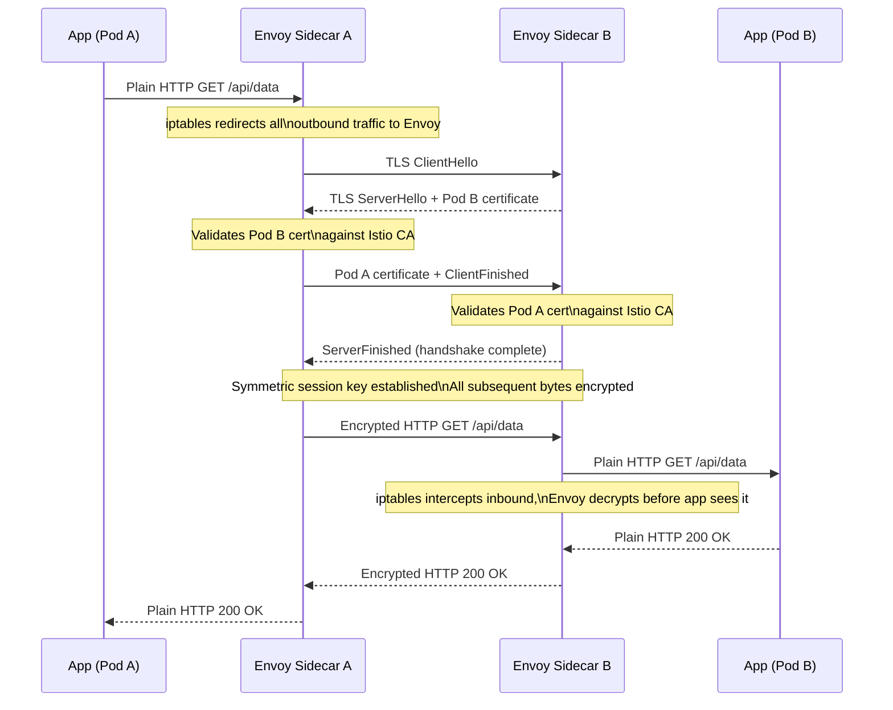
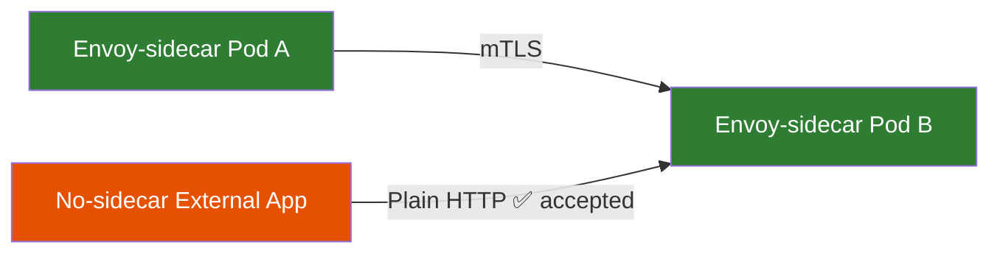
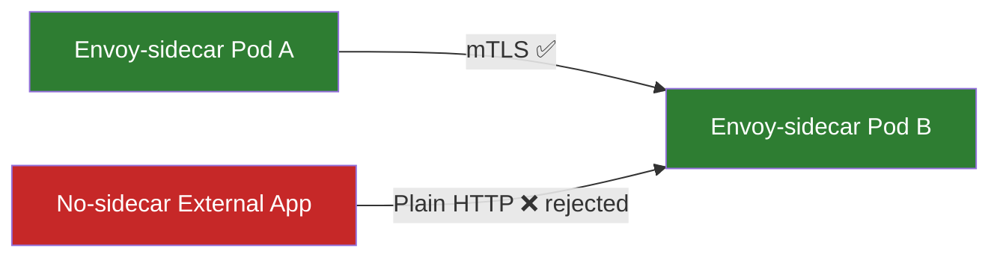

# Chapter 27: Implement Pod-to-Pod Encryption Using mTLS

## Why This Matters for CKS

The CKS exam expects you to go beyond *knowing* that mTLS exists — it tests whether you can **configure and verify** it. That means writing `PeerAuthentication` and `DestinationRule` resources, understanding what Istio's sidecar proxy actually does at the packet level, and diagnosing why traffic is or is not being encrypted. This chapter bridges the gap between the conceptual overview in Chapter 26 and hands-on implementation.

Key exam scenarios you will encounter:
- Enable strict mTLS for a namespace and verify no plain-text traffic is accepted.
- Apply a `PeerAuthentication` policy in permissive mode and explain the trade-off.
- Confirm that a sidecar is injected and that inter-pod TLS is negotiated.
- Understand why mTLS fails when one pod lacks a sidecar.

---

## What Is mTLS Implementation in Kubernetes?

Implementing mTLS between pods means establishing a system where **every pod proves its identity before any byte of application data is exchanged**. Unlike one-way TLS (where only the server presents a certificate), mTLS requires *both* sides to present and validate certificates.

In a bare Kubernetes cluster this would require every application to manage its own PKI, key rotation, and TLS handshake logic — an enormous burden. Service meshes such as **Istio** and **Linkerd** solve this by injecting a transparent sidecar proxy into every pod. The application continues to speak plain HTTP or TCP; the sidecar transparently upgrades the connection to mTLS before any packet crosses a pod boundary.

```
┌─────────────────────────────────────────────────────┐
│  Without Service Mesh                               │
│                                                     │
│  Pod A (app)  ──── plain TCP ────▶  Pod B (app)    │
│  No encryption, no identity, no audit trail         │
└─────────────────────────────────────────────────────┘

┌─────────────────────────────────────────────────────┐
│  With Istio mTLS                                    │
│                                                     │
│  Pod A      Envoy A ══ mTLS tunnel ══ Envoy B   Pod B│
│  (app) ──▶ (sidecar)                 (sidecar) ──▶(app)│
│  plain HTTP                                plain HTTP│
│                                                     │
│  Application is unaware of encryption               │
└─────────────────────────────────────────────────────┘
```

---

## How mTLS Works Between Pods — Step by Step

The mTLS handshake between two Istio-managed pods follows a precise sequence. Understanding it is essential for debugging and for the CKS exam.

### Phase 1: Certificate Provisioning (Pre-flight)

Before any application traffic flows, Istio's control plane provisions certificates to every sidecar:

```
Istiod (Control Plane)
    │
    ├── Generates X.509 SVID for Pod A: spiffe://cluster.local/ns/default/sa/webapp
    ├── Generates X.509 SVID for Pod B: spiffe://cluster.local/ns/default/sa/mysql
    │
    └── Pushes certs to Envoy sidecars via xDS API (mTLS to Istiod itself)
```

Each certificate encodes a **SPIFFE** (Secure Production Identity Framework For Everyone) identity URI, not just a hostname. This is critical — it means identity is tied to the workload's ServiceAccount, not its IP address (which is ephemeral in Kubernetes).

### Phase 2: Application Initiates Connection

The application inside Pod A makes an ordinary HTTP or TCP call to Pod B's ClusterIP. The Envoy sidecar in Pod A intercepts this via iptables rules injected by the init container.

### Phase 3: The mTLS Handshake



### Phase 4: Session Reuse

Subsequent requests between the same pod pair reuse the established TLS session. Certificate rotation (every 24 hours by default in Istio) triggers a graceful re-handshake without dropping in-flight requests.

---

## The Four mTLS Steps (KodeKloud Core Concepts)

KodeKloud distills the handshake into four conceptual steps. Mapping them to the full sequence above:

| Step | Description | Full Handshake Phase |
|------|-------------|----------------------|
| 1 | Pod A requests Pod B's certificate | TLS ClientHello |
| 2 | Pod B responds with its cert and requests Pod A's cert | TLS ServerHello + cert request |
| 3 | Pod A validates Pod B's cert, sends its own cert + symmetric key | ClientCertificate + ClientKeyExchange |
| 4 | Pod B validates Pod A's cert; both use symmetric key for all further data | Handshake Finished → encrypted application data |

The symmetric key in Step 3 is not literally sent — it is derived via ECDHE (Elliptic Curve Diffie-Hellman Ephemeral) so neither side ever transmits the key over the wire. See Chapter 13 for the full ECDHE explanation.

---

## Istio Architecture: The Sidecar Model

Istio is the most widely deployed service mesh for Kubernetes and the one most relevant to CKS. Its architecture has two planes:

### Control Plane — Istiod

Istiod is a single binary that combines three historical Istio components:

| Component | Responsibility |
|-----------|---------------|
| Pilot | Pushes routing/policy config to Envoy sidecars via xDS |
| Citadel | Issues and rotates X.509 certificates (Istio CA) |
| Galley | Validates and distributes Istio configuration |

```yaml
# Istiod runs in the istio-system namespace
kubectl get pods -n istio-system
# NAME                      READY   STATUS    RESTARTS   AGE
# istiod-6d8f9b7d4c-xk2lp   1/1     Running   0          2d
```

### Data Plane — Envoy Sidecars

Every pod in a mesh-enabled namespace gets an `istio-proxy` container injected by a mutating webhook. This container runs Envoy, a high-performance C++ proxy.

```bash
# Verify sidecar injection is enabled for a namespace
kubectl get namespace default --show-labels
# NAME      STATUS   AGE   LABELS
# default   Active   30d   istio-injection=enabled

# Check that a pod has the sidecar
kubectl get pod webapp-abc123 -o jsonpath='{.spec.containers[*].name}'
# webapp istio-proxy
```

The init container (`istio-init`) installs iptables rules that redirect all inbound traffic to port 15006 and all outbound traffic to port 15001, where Envoy listens.

```
iptables rules installed by istio-init:
  OUTPUT  → redirect non-Envoy TCP to 15001 (Envoy outbound)
  PREROUTING → redirect non-Envoy TCP to 15006 (Envoy inbound)

Envoy ports:
  15001  outbound listener
  15006  inbound listener
  15090  Prometheus metrics
  15020  health check
```

---

## Istio mTLS Modes

Istio controls mTLS behaviour through a `PeerAuthentication` resource. Two modes matter for CKS:

### Permissive Mode (Default)

```yaml
apiVersion: security.istio.io/v1beta1
kind: PeerAuthentication
metadata:
  name: default
  namespace: default
spec:
  mtls:
    mode: PERMISSIVE
```

**Behaviour:**
- Pods with sidecars communicate via mTLS.
- Pods *without* sidecars (external services, legacy pods) can still send plain-text traffic.
- The sidecar accepts both encrypted and unencrypted inbound connections.

**Use case:** Migration phase — you can onboard services incrementally without breaking existing plain-text clients.



### Strict Mode (Maximum Security)

```yaml
apiVersion: security.istio.io/v1beta1
kind: PeerAuthentication
metadata:
  name: default
  namespace: production
spec:
  mtls:
    mode: STRICT
```

**Behaviour:**
- The sidecar rejects **all** plain-text connections, even from within the cluster.
- Every caller must present a valid Istio-issued certificate.
- Pods without sidecars cannot communicate with strict-mode pods.

**Use case:** Production environments, regulated workloads (PCI, HIPAA), zero-trust posture.



> ⚠️ **CKS Exam Trap:** Enabling strict mode across a namespace that contains pods without sidecars (e.g., the namespace where Istiod itself runs, or any system namespace) will break connectivity. Always scope strict policies to namespaces you fully control.

---

## Hands-On Implementation

### Step 1: Install Istio

```bash
# Download istioctl
curl -L https://istio.io/downloadIstio | sh -
export PATH=$PATH:$(pwd)/istio-*/bin

# Install with the default profile
istioctl install --set profile=default -y

# Verify control plane
kubectl get pods -n istio-system
# istiod-...  1/1  Running
# istio-ingressgateway-...  1/1  Running
```

### Step 2: Enable Sidecar Injection for a Namespace

```bash
# Label the namespace to enable automatic sidecar injection
kubectl label namespace production istio-injection=enabled

# Verify the label
kubectl get namespace production --show-labels
# NAME         STATUS   AGE   LABELS
# production   Active   1d    istio-injection=enabled,kubernetes.io/metadata.name=production
```

> Pods already running **will not** get the sidecar until they are restarted. Roll deployments after labelling:
> ```bash
> kubectl rollout restart deployment -n production
> ```

### Step 3: Apply Permissive PeerAuthentication (Migration Phase)

```yaml
# permissive-mtls.yaml
apiVersion: security.istio.io/v1beta1
kind: PeerAuthentication
metadata:
  name: default
  namespace: production
spec:
  mtls:
    mode: PERMISSIVE
```

```bash
kubectl apply -f permissive-mtls.yaml
```

### Step 4: Verify mTLS Is Being Used

```bash
# Check Envoy's inbound listener configuration
istioctl proxy-config listeners webapp-pod-abc123 -n production

# Check TLS context for a specific cluster
istioctl proxy-config cluster webapp-pod-abc123 -n production --fqdn mysql-svc.production.svc.cluster.local -o json | grep -A 5 "tlsContext"

# Use Kiali or the Istio dashboard to see mTLS locks on service graph
# (in lab environments with Kiali installed)
kubectl port-forward svc/kiali -n istio-system 20001:20001
```

### Step 5: Upgrade to Strict Mode

Once all services in the namespace have sidecars and mTLS is confirmed working in permissive mode:

```yaml
# strict-mtls.yaml
apiVersion: security.istio.io/v1beta1
kind: PeerAuthentication
metadata:
  name: default
  namespace: production
spec:
  mtls:
    mode: STRICT
```

```bash
kubectl apply -f strict-mtls.yaml

# Test that plain-text is now rejected:
kubectl exec -n production some-pod-without-sidecar -- \
  curl -v http://mysql-svc.production.svc.cluster.local:3306
# Connection refused / reset — strict mode is working
```

### Step 6: Fine-Grained mTLS with DestinationRule

`PeerAuthentication` controls what the **server** accepts. `DestinationRule` controls what the **client** sends. For consistent behaviour you need both:

```yaml
# destination-rule-mtls.yaml
apiVersion: networking.istio.io/v1alpha3
kind: DestinationRule
metadata:
  name: mysql-mtls
  namespace: production
spec:
  host: mysql-svc.production.svc.cluster.local
  trafficPolicy:
    tls:
      mode: ISTIO_MUTUAL   # client sends mTLS using Istio-issued certs
```

```bash
kubectl apply -f destination-rule-mtls.yaml
```

> Without a `DestinationRule`, a client sidecar may send plain HTTP even if the server enforces strict mTLS, causing a `Connection reset` error that is hard to diagnose.

### Complete Namespace Setup (Production-Ready)

```yaml
# production-mtls-full.yaml
---
# 1. Enforce strict mTLS for all pods in production namespace
apiVersion: security.istio.io/v1beta1
kind: PeerAuthentication
metadata:
  name: default
  namespace: production
spec:
  mtls:
    mode: STRICT

---
# 2. Tell all clients to use Istio mTLS when calling services in production
apiVersion: networking.istio.io/v1alpha3
kind: DestinationRule
metadata:
  name: production-default
  namespace: production
spec:
  host: "*.production.svc.cluster.local"
  trafficPolicy:
    tls:
      mode: ISTIO_MUTUAL
```

---

## Real-World Scenarios

### Scenario 1: Payment Data Between Microservices

**Problem:** A fintech startup has a `checkout` pod that sends card data to a `payment-processor` pod over plain HTTP. A compromised node could intercept this.

**Solution:**

```
Before mTLS:
  checkout-pod ──── plain HTTP with card data ────▶ payment-processor-pod
  (visible to anyone on the node's network interface)

After strict mTLS:
  checkout-pod
    └─ envoy-sidecar (encrypts) ══ TLS 1.3 ══ envoy-sidecar (decrypts)
                                                    └─ payment-processor-pod
  (card data never appears in plaintext on the wire)
```

**Implementation:**
```bash
kubectl label namespace payments istio-injection=enabled
kubectl rollout restart deployment -n payments
kubectl apply -f strict-peer-authentication.yaml  # namespace: payments
```

### Scenario 2: Gradual Migration with Per-Workload Override

A legacy `batch-job` pod cannot be given a sidecar (it uses `hostNetwork: true`). You want strict mTLS everywhere except for this specific workload's traffic:

```yaml
# Allow plain-text only to the legacy-api service
apiVersion: security.istio.io/v1beta1
kind: PeerAuthentication
metadata:
  name: legacy-api-permissive
  namespace: production
spec:
  selector:
    matchLabels:
      app: legacy-api    # Only this workload is permissive
  mtls:
    mode: PERMISSIVE
---
# Everything else in the namespace is strict
apiVersion: security.istio.io/v1beta1
kind: PeerAuthentication
metadata:
  name: default
  namespace: production
spec:
  mtls:
    mode: STRICT
```

> The `selector`-scoped policy takes precedence over the namespace-wide `default` policy for pods that match.

### Scenario 3: Cross-Namespace mTLS

mTLS works across namespaces with no special configuration — Istio's CA issues certs to all mesh-enrolled pods regardless of namespace.

```bash
# Pod in 'frontend' namespace can mTLS to pod in 'backend' namespace
# Both namespaces must have istio-injection=enabled

kubectl label namespace frontend istio-injection=enabled
kubectl label namespace backend istio-injection=enabled

# Apply strict policy to backend namespace
kubectl apply -f - <<EOF
apiVersion: security.istio.io/v1beta1
kind: PeerAuthentication
metadata:
  name: default
  namespace: backend
spec:
  mtls:
    mode: STRICT
EOF
```

### Scenario 4: Debugging mTLS Failures

```bash
# Symptom: curl from Pod A to Pod B returns "connection reset by peer"
# Diagnosis:

# 1. Check if sidecar is injected in both pods
kubectl get pod pod-a -o jsonpath='{.spec.containers[*].name}'
# Expected: app-container istio-proxy

# 2. Check PeerAuthentication policies
kubectl get peerauthentication -A

# 3. Check DestinationRule for the target service
kubectl get destinationrule -A -o yaml | grep -A 10 "host: target-svc"

# 4. Inspect Envoy's TLS configuration
istioctl proxy-config listeners pod-a --port 80

# 5. Check Istiod logs for certificate issues
kubectl logs -n istio-system -l app=istiod | grep "cert\|error\|TLS"

# 6. Verify cert validity on the sidecar
istioctl proxy-config secret pod-a -n production
# Shows: certificate chain, expiry date, SPIFFE URI
```

---

## Linkerd — An Alternative to Istio

While Istio dominates CKS exam questions, Linkerd is worth understanding as an alternative. Its key difference is **automatic mTLS by default** — you do not need to apply any `PeerAuthentication` resource.

```bash
# Linkerd installs mTLS with zero configuration
linkerd install | kubectl apply -f -

# Annotate a namespace to inject Linkerd's proxy (linkerd-proxy, not Envoy)
kubectl annotate namespace production linkerd.io/inject=enabled

# Verify mTLS for a pod
linkerd viz -n production stat deploy
# Displays success rate, RPS, and TLS status (✔ = mTLS active)
```

| Feature | Istio | Linkerd |
|---------|-------|---------|
| mTLS default | Permissive (must enable strict) | Automatic and always-on |
| Proxy | Envoy (feature-rich) | Rust-based linkerd-proxy (lightweight) |
| Config resources | PeerAuthentication + DestinationRule | Minimal — automatic |
| Learning curve | Steep | Gentle |
| CKS exam relevance | High (Istio-specific questions) | Medium |
| Performance overhead | ~5–10% CPU increase | ~1–3% CPU increase |

---

## How Istio Handles the Non-mTLS Case (Permissive Mode Internals)

In permissive mode, Envoy's inbound listener uses **ALPN-based protocol detection** to distinguish mTLS from plain HTTP:

```
Inbound connection arrives at Envoy port 15006
    │
    ├─ TLS ClientHello detected?
    │       YES → Full mTLS handshake → decrypt → forward to app
    │
    └─ No TLS detected?
            In PERMISSIVE mode: accept plain-text → forward to app
            In STRICT mode: terminate connection (RST)
```

This is why the same listener port handles both encrypted and unencrypted traffic in permissive mode — it is not two separate listeners but a single listener with a protocol fallback.

---

## mTLS vs Application-Layer TLS

A common exam question asks what mTLS at the service mesh layer adds over application-layer TLS (e.g., MySQL's built-in SSL):

| Dimension | App-Layer TLS (e.g., MySQL SSL) | Service Mesh mTLS (Istio) |
|-----------|--------------------------------|--------------------------|
| Identity | IP or hostname (fragile) | SPIFFE URI tied to ServiceAccount |
| Cert rotation | Manual or app-managed | Automatic, every 24h |
| Coverage | Only that one connection | All pod-to-pod traffic |
| Visibility | None | Full telemetry, Kiali graph |
| App changes required | Yes (configure MySQL SSL) | No (sidecar is transparent) |
| mTLS (mutual) | Sometimes (MySQL: optional) | Always (both sides verified) |
| Key compromise blast radius | Affects that service | Narrow — per-workload certs |

The mesh approach wins on **uniformity** and **zero app changes**, while app-layer TLS can offer **deeper protocol understanding** (e.g., query-level logging).

---

## Common Mistakes

### Mistake 1: Applying Strict Mode Without Rolling Pods First

```bash
# BAD: Apply strict mode before restarting pods to inject sidecar
kubectl label namespace production istio-injection=enabled
kubectl apply -f strict-peer-authentication.yaml
# Result: pods without sidecars can no longer receive traffic → outage

# GOOD: Enable injection, roll pods, verify sidecars, THEN apply strict
kubectl label namespace production istio-injection=enabled
kubectl rollout restart deployment -n production
kubectl get pods -n production -o jsonpath='{range .items[*]}{.metadata.name}{"\t"}{.spec.containers[*].name}{"\n"}{end}'
# Confirm all pods show 'istio-proxy' in container list
kubectl apply -f strict-peer-authentication.yaml
```

### Mistake 2: Missing DestinationRule — Clients Still Send Plain HTTP

```bash
# PeerAuthentication alone (strict) will reject plain-text
# But without DestinationRule, some clients won't upgrade to mTLS

# Symptom: 503 errors from services despite mTLS supposedly being enabled
# Fix: Apply DestinationRule with mode: ISTIO_MUTUAL for all targets
kubectl apply -f destination-rule-all-services.yaml
```

### Mistake 3: Forgetting System Namespaces

```bash
# NEVER apply strict PeerAuthentication to kube-system or istio-system
# These namespaces have pods that cannot have sidecars

# BAD:
kubectl apply -f strict-pa.yaml --namespace kube-system
# Result: CoreDNS loses connectivity → entire cluster DNS breaks

# GOOD: Always scope PeerAuthentication to application namespaces
metadata:
  namespace: production  # NOT kube-system, NOT istio-system
```

### Mistake 4: Confusing PeerAuthentication Scope

```yaml
# This applies to ALL pods in the namespace (no selector)
apiVersion: security.istio.io/v1beta1
kind: PeerAuthentication
metadata:
  name: default
  namespace: production    # namespace-wide
spec:
  mtls:
    mode: STRICT

# This applies ONLY to pods with app: webapp
apiVersion: security.istio.io/v1beta1
kind: PeerAuthentication
metadata:
  name: webapp-only
  namespace: production
spec:
  selector:
    matchLabels:
      app: webapp          # workload-specific
  mtls:
    mode: PERMISSIVE
```

If both exist, the **more specific** (selector-scoped) policy wins for matching pods.

### Mistake 5: Not Verifying Certificate Expiry

Istio rotates certs automatically, but if Istiod is down during rotation, sidecars can hold expired certs. Always monitor:

```bash
# Check cert expiry across all sidecars in a namespace
for pod in $(kubectl get pods -n production -o name); do
  echo "=== $pod ==="
  istioctl proxy-config secret ${pod#pod/} -n production 2>/dev/null | grep -E "CERT|EXPIR"
done
```

---

## Quick Reference

| Resource | API Group | Purpose |
|----------|-----------|---------|
| `PeerAuthentication` | `security.istio.io/v1beta1` | What the **server** sidecar accepts (plain vs mTLS) |
| `DestinationRule` | `networking.istio.io/v1alpha3` | What the **client** sidecar sends (TLS mode for outbound) |
| `AuthorizationPolicy` | `security.istio.io/v1beta1` | L7 RBAC — who can call what method/path (Ch. 28) |

| PeerAuthentication Mode | Accepts mTLS | Accepts plain HTTP |
|------------------------|--------------|-------------------|
| PERMISSIVE | ✅ | ✅ |
| STRICT | ✅ | ❌ (connection reset) |
| DISABLE | ❌ (plain only) | ✅ |

| DestinationRule TLS Mode | What Client Sends |
|--------------------------|------------------|
| `DISABLE` | Plain HTTP |
| `SIMPLE` | One-way TLS (like HTTPS) |
| `MUTUAL` | mTLS with custom certs |
| `ISTIO_MUTUAL` | mTLS using Istio-issued certs (most common) |

### Essential Verification Commands

```bash
# Check what namespaces have injection enabled
kubectl get namespace -l istio-injection=enabled

# List all PeerAuthentication policies in the cluster
kubectl get peerauthentication -A

# List all DestinationRules
kubectl get destinationrule -A

# Verify a pod has the sidecar
kubectl get pod <pod-name> -o jsonpath='{.spec.containers[*].name}'

# Check Envoy TLS config for a pod
istioctl proxy-config listeners <pod-name> -n <namespace>

# Check the certificate Envoy is using
istioctl proxy-config secret <pod-name> -n <namespace>

# Analyse the overall mesh config for issues
istioctl analyze -n <namespace>

# Verify mTLS for a specific connection
istioctl experimental authz check <pod-name>
```

---

## CKS Exam Tips

1. **The two-resource rule:** You almost always need *both* `PeerAuthentication` (server-side) and `DestinationRule` (client-side) for a complete mTLS setup. If only one is present, the exam question is likely asking you to add the missing one.

2. **Scope matters:** `PeerAuthentication` without a `selector` is namespace-wide. The `name: default` convention is just a convention — any name works for namespace-wide policy.

3. **STRICT mode kills plain-text immediately:** If you apply strict mode to a namespace and see connection resets, the first thing to check is whether all pods in that namespace have the `istio-proxy` sidecar. Use `kubectl get pods -o jsonpath='{range .items[*]}{.metadata.name}{"\t"}{.spec.containers[*].name}{"\n"}{end}'`.

4. **`istioctl analyze` is your friend:** Before applying strict mode in the exam, run `istioctl analyze -n <namespace>` to catch misconfiguration warnings. It often points directly to the problem.

5. **Istio is not always pre-installed in CKS labs:** Some lab tasks ask you to install Istio. Know the `istioctl install --set profile=default -y` command. The `default` profile is sufficient for exam tasks.

6. **Namespace labels for injection:** `istio-injection=enabled` is the label. Not `istio/injection`, not `injection=enabled`. Typos here cause subtle failures — pods are created without sidecars and strict mode then breaks them.

7. **SPIFFE URI format:** If asked about the identity embedded in an Istio certificate, it is `spiffe://cluster.local/ns/<namespace>/sa/<service-account>`. This ties workload identity to ServiceAccount, not pod name.

8. **Permissive → Strict migration path:** In the exam, if you are asked to "migrate" or "upgrade" mTLS rather than "enable from scratch", the expected answer is permissive first, then strict after verifying sidecars.

---

## Summary

Pod-to-pod encryption via mTLS is the practical implementation of the zero-trust principle inside a Kubernetes cluster. The core insight is that **applications should not implement TLS themselves** — the service mesh sidecar handles it transparently. Istio implements this through:

- **Istiod** provisioning SPIFFE X.509 certificates to every Envoy sidecar.
- **Envoy** intercepting all pod traffic via iptables and performing the mTLS handshake transparently.
- **PeerAuthentication** resources controlling whether the server sidecar enforces mTLS (STRICT) or allows plain-text fallback (PERMISSIVE).
- **DestinationRule** resources controlling whether the client sidecar upgrades outbound connections to mTLS.

The migration path always follows the same order: label namespace → roll pods → verify sidecars → apply permissive → confirm mTLS works → apply strict → verify plain-text is rejected.

---

## What's Next

Chapter 28 introduces **Cilium** — a CNI plugin that implements encryption at the Linux kernel level using eBPF, rather than sidecars. Where Istio adds a process alongside every pod, Cilium modifies the kernel's networking stack itself. This approach offers lower overhead and works without any changes to existing deployments, making it a compelling alternative for environments where sidecar injection is not feasible. Chapters 28 and 29 cover Cilium's architecture and how to write encryption policies that enforce transparent WireGuard or IPsec encryption across the entire cluster.
