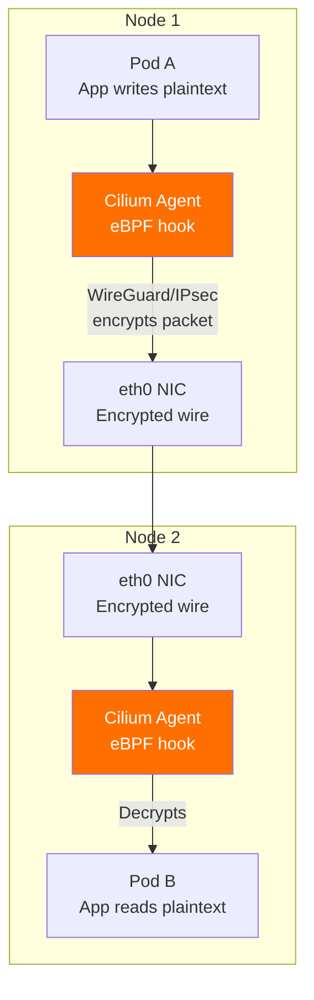
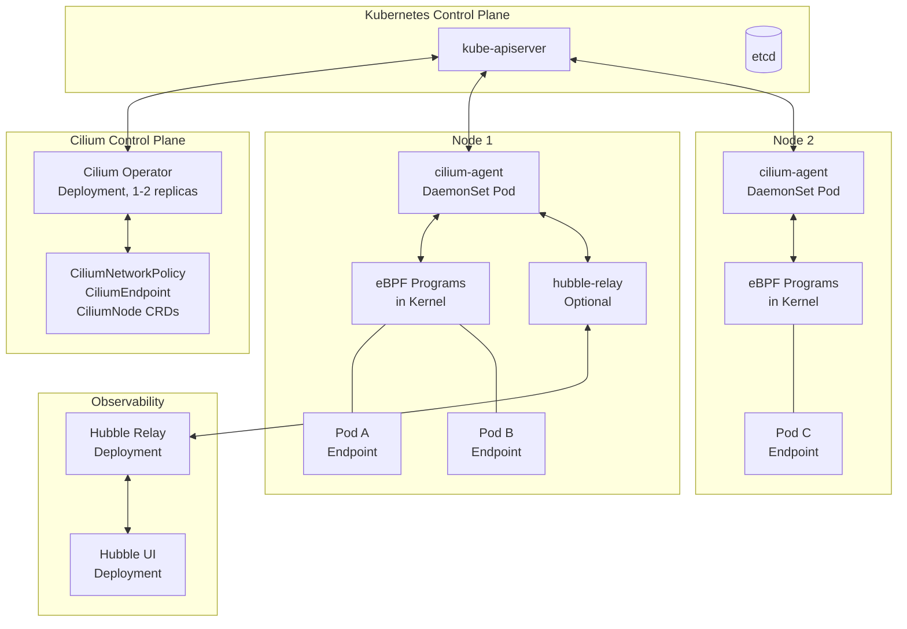
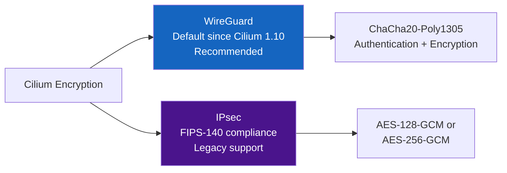

# Chapter 28: Cilium — Architecture, eBPF, and Encryption Policies

> **Combined Chapter:** This file merges three KodeKloud lessons — *Introduction to Cilium*, *Understanding Cilium's Architecture*, and *Writing Effective Encryption Policies* — into a single comprehensive reference, significantly expanded with current Cilium 1.14–1.16 features, eBPF internals, hands-on labs, and CKS exam guidance.

---

## Why This Matters for CKS

Cilium appears in the CKS exam as the modern, eBPF-native alternative to iptables-based CNI plugins and sidecar-based service meshes. The exam tests:

- How Cilium provides **transparent pod-to-pod encryption** without application changes.
- How `CiliumNetworkPolicy` extends Kubernetes `NetworkPolicy` with L7 capabilities.
- How to **verify** that encryption is actually happening (tcpdump, Hubble).
- The difference between **WireGuard** (default in modern Cilium) and **IPsec** encryption.
- Cilium's **identity model** — why it is safer than IP-based policy enforcement.

If a CKS lab question says "enable pod-to-pod encryption on the cluster" and Cilium is the installed CNI, you need to know exactly which Helm values or kubectl commands to use.

---

## Part 1: Introduction to Cilium

### What Is Cilium?

Cilium is a **CNCF-graduated** (October 2023), open-source cloud-native networking, observability, and security project for Kubernetes. Unlike traditional CNI plugins that rely on iptables/ipvs for packet filtering, Cilium runs **programmable BPF code directly inside the Linux kernel**, bypassing much of the traditional network stack.

```
Traditional CNI (e.g., Flannel, Calico without eBPF):
  Pod → iptables rules (thousands of chains) → routing → destination Pod
  Bottleneck: iptables is O(n) rule-scanning, non-programmable

Cilium with eBPF:
  Pod → BPF hook in kernel → BPF map lookup (O(1)) → destination Pod
  Benefit: programmable, identity-aware, microsecond latency
```

**CNCF Graduation means:**
- Production-ready, security-audited codebase.
- Multi-vendor governance (Isovalent, Google, AWS, Microsoft, Red Hat).
- Mandatory for CKS candidates to understand as of the 2024 exam update.

### Cilium's Core Value Propositions

| Capability | What Cilium Does | Traditional Alternative |
|-----------|------------------|------------------------|
| **CNI / Pod Networking** | Routes pod traffic via eBPF, replaces iptables | Flannel (VXLAN), Calico (BGP) |
| **Network Policy** | L3/L4/L7 policy with identity awareness | Standard NetworkPolicy (L3/L4 only) |
| **Service Load Balancing** | eBPF-based kube-proxy replacement | kube-proxy (iptables/ipvs) |
| **Pod-to-Pod Encryption** | Transparent WireGuard or IPsec | Istio sidecars, app-level TLS |
| **Observability** | Hubble — real-time flow monitoring | Prometheus + custom logging |
| **Bandwidth Management** | Per-pod rate limiting via EDT | tc (traffic control) + CNI annotations |
| **Cluster Mesh** | Multi-cluster networking & policy | Istio federation, manual kubeconfig |

### Cilium's Approach to Pod-to-Pod Encryption

Cilium encrypts traffic **at the network layer** (L3/L4), meaning:

1. **Application code is completely unchanged.** Your pods write to sockets normally.
2. **The Linux kernel encrypts the packet** before it leaves the node's NIC.
3. **The receiving kernel decrypts** before delivering to the destination pod's socket.
4. **No sidecar container is needed.** No iptables redirect. No extra process per pod.



**Key distinction from Istio mTLS:**

| Dimension | Istio mTLS (Ch. 27) | Cilium Transparent Encryption |
|-----------|---------------------|-------------------------------|
| Where encryption happens | L7 (application/sidecar) | L3/L4 (kernel network layer) |
| Sidecar required | Yes (`istio-proxy` container) | No |
| App changes required | No | No |
| Identity granularity | L7 (SPIFFE + URI) | L3 (Cilium Identity / label-based) |
| L7 policy + encryption | Yes (same Envoy) | Partial (Cilium supports L7 via Envoy as envoy-proxy, separate feature) |
| Performance overhead | Moderate (extra process, TLS termination) | Very low (kernel-native) |
| Encryption algorithm | TLS 1.3 (ECDHE + AEAD) | WireGuard (ChaCha20-Poly1305) or IPsec (AES-128/256-GCM) |
| FIPS 140-2 compliance | Possible with BoringSSL | IPsec mode supports FIPS |

---

## Part 2: Understanding Cilium's Architecture

### The eBPF Foundation — Why It Changes Everything

eBPF (Extended Berkeley Packet Filter) is the technology that makes Cilium fundamentally different. To understand Cilium, you must understand eBPF.

#### What Is eBPF?

eBPF allows you to run **sandboxed programs inside the Linux kernel** without modifying kernel source code or loading kernel modules. The kernel verifies every eBPF program before execution, guaranteeing:
- No infinite loops.
- No memory access violations.
- No crashes (kernel panic impossible from eBPF).

```
Traditional approach to network security:
  1. Write kernel module (C code)
  2. Compile for exact kernel version
  3. Load module (potential kernel panic risk)
  4. Update policy → recompile → reload

eBPF approach:
  1. Write BPF program (restricted C, compiled to BPF bytecode)
  2. Kernel verifier checks safety
  3. JIT-compile to native machine code (x86/ARM)
  4. Attach to kernel hook (XDP, TC, socket, etc.)
  5. Update policy → update BPF map (O(1) hash table) → instant
```

#### eBPF Hook Points Cilium Uses

```
Packet receive (ingress path):
  NIC → XDP hook (earliest, pre-allocation) → TC hook → Socket buffer → Pod

Packet send (egress path):
  Pod → Socket buffer → TC hook → XDP hook → NIC

Cilium attaches eBPF programs to:
  ┌─────────────────────────────────────────────────────┐
  │ XDP (eXpress Data Path)                             │
  │   - Earliest hook, runs before SKB allocation       │
  │   - Used for: DDoS mitigation, fast path forwarding │
  ├─────────────────────────────────────────────────────┤
  │ TC (Traffic Control) - clsact qdisc                │
  │   - Main hook for Cilium's policy enforcement       │
  │   - Both ingress and egress per-interface           │
  │   - Used for: L3/L4 filtering, NAT, encryption      │
  ├─────────────────────────────────────────────────────┤
  │ Socket operations                                   │
  │   - Connect(), sendmsg(), recvmsg() hooks           │
  │   - Used for: accelerated local pod-to-pod (bypass  │
  │     full network stack on same node)                │
  └─────────────────────────────────────────────────────┘
```

#### BPF Maps — The Data Layer

BPF programs communicate with user space (Cilium agent) and with each other through **BPF maps** — kernel-resident hash tables and arrays:

```
Key BPF maps Cilium uses:

cilium_lxc          → endpoint metadata (pod IP → identity, ifindex)
cilium_policy       → policy verdicts per identity pair
cilium_ct4_global   → connection tracking table (IPv4)
cilium_ct6_global   → connection tracking table (IPv6)
cilium_lb4_services → load balancer service table
cilium_lb4_backends → load balancer backend table (pods)
cilium_encrypt_state → encryption state per node

Lookup: O(1) hash, microsecond latency
Compare to iptables: O(n) linear scan through all rules
```

#### eBPF vs iptables Performance at Scale

```
Cluster with 1000 services × 10 pods each = 10,000 iptables rules

iptables:
  - Rule matching: O(10,000) per packet
  - Rule update: lock entire table, update all rules (seconds)
  - Memory: ~10MB just for rule tables

Cilium eBPF:
  - Service lookup: O(1) hash table
  - Rule update: atomic map update, instant
  - Memory: constant BPF maps
  - Throughput: 2-10× higher than iptables at scale
```

---

### Cilium Component Architecture



#### Component 1: Cilium Agent (`cilium-agent`)

The **Cilium Agent** runs as a DaemonSet — one pod per node. It is the brain of Cilium on each node.

**Responsibilities:**
- Watches Kubernetes API for Pod, Service, NetworkPolicy, CiliumNetworkPolicy events.
- Translates Kubernetes resources into **BPF programs and maps**.
- Manages endpoint lifecycle (pod start → assign identity → load BPF program → pod stop → cleanup).
- Handles IPAM (IP address assignment) via multiple modes (Cluster Scope, Kubernetes Host Scope, AWS ENI, Azure IPAM, GKE).
- Manages encryption key distribution for IPsec mode.
- Exposes health API (`cilium status`) and metrics.

```bash
# Inspect the Cilium agent on a node
kubectl exec -n kube-system ds/cilium -- cilium status --verbose

# Sample output sections:
# KVStore:        Ok   etcd: ...
# Kubernetes:     Ok   1.29 ...
# Cilium:         Ok   OK
# NodeMonitor:    Listening for events on 4 CPUs
# Controller Status: ...
# Proxy Status: ...
# Encryption: Wireguard   [NodeEncryption: Enabled]
```

**Key configuration flags (Helm values):**
```yaml
# values.yaml
agent:
  enabled: true
  resources:
    requests:
      cpu: 100m
      memory: 512Mi
    limits:
      cpu: 4000m
      memory: 4Gi
```

#### Component 2: Cilium Operator (`cilium-operator`)

The **Cilium Operator** runs as a Deployment (1-2 replicas, not DaemonSet). It handles cluster-wide tasks that only need to run once:

**Responsibilities:**
- IPAM for cluster-scope IP allocation.
- Garbage collecting terminated endpoints from `CiliumEndpoint` CRDs.
- Synchronising Kubernetes `NetworkPolicy` → `CiliumNetworkPolicy`.
- Managing `CiliumNode` resources.
- Heartbeat for etcd (if using Cilium's own etcd).
- Certificate management for Hubble mTLS.

```bash
kubectl get pods -n kube-system -l app.kubernetes.io/name=cilium-operator
# NAME                               READY   STATUS    RESTARTS   AGE
# cilium-operator-7d6bf9d8c5-xk2lp   1/1     Running   0          7d
```

#### Component 3: Hubble — The Observability Layer

**Hubble** is Cilium's built-in observability platform. It intercepts every network flow at the eBPF layer and makes it available for:
- Real-time flow monitoring (`hubble observe`).
- HTTP/gRPC request visibility (which microservice called which).
- DNS query/response logging.
- Drop reason analysis (why was a packet dropped by policy?).
- Service dependency mapping (Hubble UI).

Hubble has three sub-components:

| Component | Type | Purpose |
|-----------|------|---------|
| **Hubble Server** | Part of cilium-agent | Exports flows via gRPC |
| **Hubble Relay** | Deployment | Aggregates flows from all nodes |
| **Hubble UI** | Deployment + Service | Web dashboard for flow visualization |

```bash
# Enable Hubble during Cilium install
helm upgrade cilium cilium/cilium \
  --set hubble.enabled=true \
  --set hubble.relay.enabled=true \
  --set hubble.ui.enabled=true

# Use Hubble CLI to observe flows
hubble observe --namespace production --follow

# Watch for dropped packets (policy denies)
hubble observe --verdict DROPPED --follow

# See all flows to/from a specific pod
hubble observe --pod production/webapp-abc123 --follow

# HTTP-level visibility
hubble observe --protocol http --follow
# Outputs: source → dest: GET /api/users 200 OK (12ms)
```

#### Component 4: Cilium CNI Plugin

When the kubelet creates a pod, it calls the **CNI plugin binary** (`/opt/cni/bin/cilium-cni`). Cilium's CNI plugin:
1. Calls the cilium-agent via Unix socket to allocate an IP.
2. Creates a `veth pair` — one end in the pod's network namespace, one end on the node.
3. Loads eBPF programs on the node-side veth interface.
4. Updates the `cilium_lxc` BPF map with the new endpoint's identity.

```
Pod network namespace:
  eth0 (pod) ←── veth pair ──→ lxcXXXXXX (node host ns)
                                     │
                               BPF program attached (TC hook)
                               Policy enforcement happens here
```

#### Component 5: Cilium CRDs (Custom Resource Definitions)

Cilium extends Kubernetes with several CRDs:

| CRD | Purpose |
|-----|---------|
| `CiliumNetworkPolicy` (CNP) | Namespaced L3/L4/L7 policy |
| `CiliumClusterwideNetworkPolicy` (CCNP) | Cluster-scoped policy (no namespace restriction) |
| `CiliumEndpoint` (CEP) | Per-pod endpoint state (identity, IP, policy) |
| `CiliumNode` | Per-node networking state |
| `CiliumIdentity` | Workload identity derived from labels |
| `CiliumEgressGatewayPolicy` | NAT gateway for egress traffic to external services |
| `CiliumLocalRedirectPolicy` | Redirect traffic to local pods (L4 LB) |

```bash
# See all Cilium CRDs
kubectl get crd | grep cilium
# ciliumclusterwidenetworkpolicies.cilium.io
# ciliumendpoints.cilium.io
# ciliumidentities.cilium.io
# ciliumnodes.cilium.io
# ciliumnetworkpolicies.cilium.io
# ...

# Inspect a pod's Cilium endpoint
kubectl get ciliumendpoint -n production webapp-abc123 -o yaml
```

---

### Cilium's Identity Model — Security Beyond IP Addresses

This is one of Cilium's most important security innovations and a concept tested in CKS.

#### The Problem with IP-Based Policy

Traditional `NetworkPolicy` selects endpoints by IP address under the hood. In Kubernetes:
- Pod IPs are **ephemeral** — they change on restart.
- Network policies are re-evaluated after IP changes.
- An attacker who compromises a pod can potentially **send packets with a spoofed source IP** to bypass IP-based rules.

#### Cilium's Label-Based Identity

Cilium assigns a **numeric identity** to each workload based on its **Kubernetes labels** (and namespace). This identity is embedded in every packet via encapsulation headers or by using the WireGuard peer routing table.

```
Process:
1. Pod created with labels: app=webapp, tier=frontend, ns=production
2. Cilium agent hashes the label set → Identity: 12345
3. BPF map updated: Pod IP → Identity 12345
4. Policy: "Identity 12345 can talk to Identity 67890 (app=mysql)"
5. Packet arrives → BPF looks up source IP → gets identity → checks policy
6. If source pod is replaced (new IP), same labels → same identity → policy still works
```

```bash
# See all identities in the cluster
kubectl get ciliumidentity

# NAME     NAMESPACE    AGE
# 12345    production   7d
# 67890    production   7d

# See which labels map to an identity
kubectl get ciliumidentity 12345 -o jsonpath='{.security-labels}'
# {"k8s:app":"webapp","k8s:io.kubernetes.pod.namespace":"production","k8s:tier":"frontend"}
```

#### Why This Matters for Security

- **Anti-spoofing:** Even if a pod sends a packet with a forged source IP, the eBPF program on the sending node enforces the correct identity based on the local pod table. Cilium prevents identity spoofing at the host level.
- **Policy continuity:** Policies survive pod restarts without flapping.
- **Cross-namespace clarity:** Identity includes the namespace label, preventing namespace confusion attacks.

---

### Cilium Data Path — Packet Journey

Understanding the data path is critical for debugging and for the CKS exam.

#### Case 1: Same-Node Pod-to-Pod Communication

```
Pod A (eth0) → veth → lxcXXX (host ns)
                          │
                    TC egress BPF:
                    - Identity lookup for Pod A
                    - Policy verdict for (A → B)
                    - ALLOW: redirect to Pod B's veth
                    - DENY: drop packet
                          │
                    lxcYYY (host ns) → veth → Pod B (eth0)
                    TC ingress BPF:
                    - Re-validate identity (defense in depth)
```

Same-node traffic **never leaves the host** — eBPF redirects it directly via in-kernel socket-level acceleration (sockmap), bypassing the full TCP stack for a significant performance gain.

#### Case 2: Cross-Node Pod-to-Pod (VXLAN or Native Routing)

```
Pod A (Node 1) → veth → lxcXXX
                            │
                    TC egress BPF:
                    - Lookup destination pod → Node 2's IP
                    - VXLAN encapsulate (or route via BGP)
                    - Encrypt packet (WireGuard/IPsec) if enabled
                            │
                    eth0 (Node 1) ──── [encrypted packet] ────▶ eth0 (Node 2)
                                                                      │
                                                              TC ingress BPF:
                                                              - Decrypt packet
                                                              - VXLAN decapsulate
                                                              - Identity extraction
                                                              - Policy verdict
                                                                      │
                                                              lxcZZZ → veth → Pod B
```

---

### Cilium's Networking Modes

Cilium supports multiple underlying network transports:

| Mode | How It Works | Best For |
|------|-------------|---------|
| **VXLAN** (default) | Overlay encapsulation (UDP 8472) | Any cloud, no BGP needed |
| **Geneve** | Similar to VXLAN, more extensible | OpenStack environments |
| **Native Routing** | Direct routing (no encapsulation) | Environments with L3 routing control |
| **AWS ENI** | Each pod gets an ENI IP (real VPC IP) | EKS, highest performance |
| **Azure IPAM** | Azure-native IPs | AKS |
| **GKE** | Google Cloud alias IPs | GKE |

```bash
# Check which tunnel mode is active
kubectl exec -n kube-system ds/cilium -- cilium status | grep "Tunnel"
# Tunnel:            vxlan
```

---

### Kube-Proxy Replacement

Cilium can **completely replace kube-proxy** using eBPF-based Service load balancing. This is relevant to CKS because it changes how cluster networking works:

```bash
# Install Cilium without kube-proxy
helm install cilium cilium/cilium \
  --set kubeProxyReplacement=strict \
  --set k8sServiceHost=<API_SERVER_IP> \
  --set k8sServicePort=6443

# Verify kube-proxy is NOT running
kubectl get pods -n kube-system | grep kube-proxy
# (empty — no kube-proxy pods)

# Verify Cilium is handling services
kubectl exec -n kube-system ds/cilium -- cilium service list
```

**Benefits of kube-proxy replacement:**
- 2-10× faster service load balancing (BPF map vs iptables chain traversal).
- Native support for DSR (Direct Server Return) — return traffic bypasses load balancer.
- Session affinity via eBPF connection tracking (no iptables DNAT).
- Maglev consistent hashing for stable backend selection.

---

## Part 3: Pod-to-Pod Encryption — Deep Dive

### Encryption Architecture in Cilium

Cilium offers **two encryption protocols** for transparent pod-to-pod encryption:



### WireGuard Encryption (Recommended, Cilium ≥ 1.10)

WireGuard is a modern, fast, and audited VPN protocol. Cilium integrates it at the kernel level (WireGuard is now part of the mainline Linux kernel since 5.6).

#### How Cilium's WireGuard Integration Works

```
Setup (per-node, done by cilium-agent):
1. cilium-agent generates WireGuard keypair for the node.
2. Public key stored in CiliumNode CRD annotation.
3. All agents on other nodes learn each other's public keys via CiliumNode.
4. WireGuard kernel interface (cilium_wg0) created per node.
5. Peer table: Node2_IP → Node2_PublicKey, Node3_IP → Node3_PublicKey, ...

Packet flow with WireGuard:
Pod A → eBPF TC hook → WireGuard encrypt → cilium_wg0 → eth0 → [wire]
[wire] → eth0 → cilium_wg0 → WireGuard decrypt → eBPF TC hook → Pod B
```

#### Enabling WireGuard Encryption

```bash
# Method 1: During initial Cilium install (Helm)
helm install cilium cilium/cilium \
  --namespace kube-system \
  --set encryption.enabled=true \
  --set encryption.type=wireguard \
  --set encryption.nodeEncryption=true   # Encrypts node-to-node, not just pod-to-pod

# Method 2: Upgrading an existing Cilium installation
helm upgrade cilium cilium/cilium \
  --namespace kube-system \
  --reuse-values \
  --set encryption.enabled=true \
  --set encryption.type=wireguard

# Method 3: Using cilium CLI (Cilium 1.11+)
cilium install --encryption wireguard
cilium config set encryption-type wireguard

# Verify WireGuard is active
kubectl exec -n kube-system ds/cilium -- cilium status | grep -i encrypt
# Encryption:         Wireguard   [NodeEncryption: Enabled, cilium_wg0 (Pubkey: <key>, Port: 51871)]
```

#### WireGuard Observability

```bash
# Check WireGuard peers on a node (shows all peer nodes)
kubectl exec -n kube-system ds/cilium -- wg show cilium_wg0

# interface: cilium_wg0
#   public key: <node1-pubkey>
#   listening port: 51871
#
# peer: <node2-pubkey>
#   endpoint: 192.168.1.2:51871
#   allowed ips: 10.0.2.0/24
#   latest handshake: 5 seconds ago
#   transfer: 1.21 GiB received, 987 MiB sent

# Verify encryption is ON for a specific flow via Hubble
hubble observe --namespace production --protocol tcp \
  --output json | jq '.flow.is_reply, .flow.traffic_direction, .flow.l4'
```

#### WireGuard Node Encryption (Cilium ≥ 1.14)

Standard WireGuard in Cilium encrypts **pod-to-pod traffic crossing nodes**. With `nodeEncryption: true` (Cilium 1.14+), node-level traffic (health checks, node-to-node API calls) is also encrypted:

```yaml
# Cilium ConfigMap / Helm values
encryption.enabled: "true"
encryption.type: "wireguard"
encryption.nodeEncryption: "true"   # New in 1.14, encrypts all node traffic
```

---

### IPsec Encryption (FIPS Compliance)

IPsec is the older option. Use it when:
- Your organization requires **FIPS 140-2** compliance (WireGuard's ChaCha20 is not FIPS-approved).
- You need **hardware offload** (some NICs accelerate IPsec but not WireGuard).
- Compliance frameworks specifically mandate IPsec.

#### How Cilium IPsec Works

```
Setup:
1. A Kubernetes Secret contains the pre-shared key (PSK).
2. cilium-agent reads the secret and programs the Linux xfrm (IPsec) subsystem.
3. Security Associations (SAs) established between all node pairs.
4. Packets matching BPF rules are encrypted by xfrm before leaving the NIC.

Key rotation:
- Cilium supports rolling key rotation without packet loss.
- New key programmed first, old key kept for decryption during transition.
```

#### Setting Up IPsec

```bash
# Step 1: Create the IPsec PSK secret
PSK=$(dd if=/dev/urandom count=20 bs=1 2>/dev/null | xxd -p -l 20)
kubectl create secret generic cilium-ipsec-keys \
  --namespace kube-system \
  --from-literal=keys="3 rfc4106(gcm(aes)) ${PSK} 128"
# Format: <key-ID> <algorithm> <PSK-hex> <key-size>
# rfc4106(gcm(aes)) = AES-128-GCM (FIPS-approved)

# Step 2: Install Cilium with IPsec
helm install cilium cilium/cilium \
  --namespace kube-system \
  --set encryption.enabled=true \
  --set encryption.type=ipsec

# Verify IPsec is active
kubectl exec -n kube-system ds/cilium -- cilium status | grep -i ipsec
# Encryption:    IPsec   [enabled: 3 rfc4106(gcm(aes)) ... 128]

# Step 3: Rotating keys (rolling rotation, no downtime)
NEW_PSK=$(dd if=/dev/urandom count=20 bs=1 2>/dev/null | xxd -p -l 20)
kubectl patch secret cilium-ipsec-keys -n kube-system \
  --patch "{\"data\": {\"keys\": \"$(echo -n "4 rfc4106(gcm(aes)) ${NEW_PSK} 128" | base64 -w0)\"}}"
# Key ID incremented from 3 → 4; old key still decrypts in-flight packets
```

---

### WireGuard vs IPsec — Detailed Comparison

| Dimension | WireGuard | IPsec |
|-----------|-----------|-------|
| **Algorithm** | ChaCha20-Poly1305 (fixed) | AES-GCM, AES-CBC (configurable) |
| **FIPS 140-2** | ❌ ChaCha20 not FIPS | ✅ AES-GCM is FIPS |
| **Key management** | Auto (per-node keypair via CiliumNode) | Manual PSK via Kubernetes Secret |
| **Key rotation** | Automatic (built-in rekeying) | Manual + rolling update pattern |
| **Performance** | Higher (kernel-native, simpler crypto) | Lower (more complex SA negotiation) |
| **Linux kernel req** | ≥ 5.6 (WireGuard mainline) | Any (xfrm long-standing) |
| **Cilium support** | ≥ 1.10 (stable in 1.14) | ≥ 1.4 |
| **Debug tools** | `wg show cilium_wg0` | `ip xfrm state`, `ip xfrm policy` |
| **Node encryption** | ✅ (1.14+, nodeEncryption flag) | ✅ |
| **Recommended** | Yes (default choice) | Only if FIPS required |

---

## Part 4: CiliumNetworkPolicy — Writing Effective Policies

### Standard Kubernetes NetworkPolicy vs CiliumNetworkPolicy

Before writing Cilium-specific policies, understand what Kubernetes `NetworkPolicy` gives you — and where it falls short:

```
Standard NetworkPolicy capabilities:
  ✅ L3: IP block/allow by CIDR
  ✅ L4: TCP/UDP port filtering
  ✅ Pod selector (within namespace)
  ✅ Namespace selector
  ❌ HTTP method filtering (GET vs POST)
  ❌ gRPC method filtering
  ❌ DNS-based egress (allow *.amazonaws.com)
  ❌ FQDN-based policy
  ❌ Cluster-wide policy (no ClusterNetworkPolicy in standard K8s)
  ❌ Kafka topic-level filtering
  ❌ Process-level identity

CiliumNetworkPolicy adds all the ❌ items above.
```

### CiliumNetworkPolicy Structure

```yaml
apiVersion: cilium.io/v2
kind: CiliumNetworkPolicy
metadata:
  name: <policy-name>
  namespace: <namespace>        # Namespaced (CNP)
                                # Use CiliumClusterwideNetworkPolicy for cluster-wide
spec:
  # Which pods this policy applies to (same as podSelector in NetworkPolicy)
  endpointSelector:
    matchLabels:
      <label-key>: <label-value>
    matchExpressions:           # Optional: advanced label matching
      - key: environment
        operator: In
        values: ["production", "staging"]

  # Ingress rules (who can send to me)
  ingress:
  - fromEndpoints:              # From pods (same or cross-namespace)
      - matchLabels:
          <label>: <value>
    fromCIDR:                   # From external IPs
      - 10.0.0.0/8
    fromCIDRSet:                # CIDR with exceptions
      - cidr: 10.0.0.0/8
        except:
          - 10.0.0.0/24
    toPorts:
      - ports:
        - port: "80"
          protocol: TCP
        rules:                  # L7 rules (HTTP, Kafka, DNS, gRPC)
          http:
            - method: GET
              path: /api/.*

  # Egress rules (where I can send to)
  egress:
  - toEndpoints:
      - matchLabels:
          <label>: <value>
    toFQDNs:                    # DNS-based egress (Cilium-exclusive)
      - matchName: "api.github.com"
      - matchPattern: "*.amazonaws.com"
    toPorts:
      - ports:
        - port: "443"
          protocol: TCP
```

---

### KodeKloud Core Policy — Encrypted Traffic Between `myapp` Pods

This is the canonical example from the KodeKloud source, expanded with context:

```yaml
# allow-encrypted-traffic.yaml
apiVersion: cilium.io/v2
kind: CiliumNetworkPolicy
metadata:
  name: allow-encrypted-traffic
  namespace: production
spec:
  # Apply to all pods with label app: myapp
  endpointSelector:
    matchLabels:
      app: myapp

  # Allow outbound traffic only to other myapp pods on TCP 80
  egress:
  - toEndpoints:
    - matchLabels:
        app: myapp
    toPorts:
    - ports:
      - port: "80"
        protocol: TCP
```

**What this policy does:**
- Pods labelled `app: myapp` in the `production` namespace can only send TCP traffic to other `app: myapp` pods on port 80.
- All other egress is implicitly denied (Cilium policy is default-deny once any egress rule is present for an endpoint).
- Crucially, this policy is **evaluated on top of** WireGuard/IPsec encryption — the network layer encrypts the packet *regardless* of this policy. The policy controls *authorization*; encryption controls *confidentiality*.

```bash
kubectl apply -f allow-encrypted-traffic.yaml

# Verify policy was accepted
kubectl get ciliumnetworkpolicy -n production allow-encrypted-traffic -o yaml

# Check that the policy is active on the endpoint
kubectl exec -n kube-system ds/cilium -- \
  cilium endpoint list | grep myapp
```

---

### Policy Patterns — Common Production Scenarios

#### Pattern 1: Default Deny All + Selective Allow

```yaml
# 1. Default deny all ingress and egress
apiVersion: cilium.io/v2
kind: CiliumNetworkPolicy
metadata:
  name: default-deny-all
  namespace: production
spec:
  endpointSelector: {}    # {} = all pods in namespace
  ingress: []             # Empty rule list = deny all ingress
  egress: []              # Empty rule list = deny all egress
---
# 2. Allow webapp to call mysql on 3306
apiVersion: cilium.io/v2
kind: CiliumNetworkPolicy
metadata:
  name: webapp-to-mysql
  namespace: production
spec:
  endpointSelector:
    matchLabels:
      app: webapp
  egress:
  - toEndpoints:
    - matchLabels:
        app: mysql
    toPorts:
    - ports:
      - port: "3306"
        protocol: TCP
---
# 3. Allow mysql to receive from webapp
apiVersion: cilium.io/v2
kind: CiliumNetworkPolicy
metadata:
  name: mysql-from-webapp
  namespace: production
spec:
  endpointSelector:
    matchLabels:
      app: mysql
  ingress:
  - fromEndpoints:
    - matchLabels:
        app: webapp
    toPorts:
    - ports:
      - port: "3306"
        protocol: TCP
```

#### Pattern 2: L7 HTTP Policy (Cilium-Exclusive)

```yaml
# Only allow GET requests to /api/public — no POST, no DELETE
apiVersion: cilium.io/v2
kind: CiliumNetworkPolicy
metadata:
  name: api-l7-restrict
  namespace: production
spec:
  endpointSelector:
    matchLabels:
      app: api-server
  ingress:
  - fromEndpoints:
    - matchLabels:
        app: frontend
    toPorts:
    - ports:
      - port: "8080"
        protocol: TCP
      rules:
        http:
        - method: "GET"
          path: "/api/public/.*"
        - method: "GET"
          path: "/health"
```

> This policy is enforced by Cilium's embedded Envoy proxy (separate from Istio's Envoy). When L7 rules are present, Cilium automatically redirects traffic through the local Envoy process for L7 inspection.

#### Pattern 3: FQDN-Based Egress (External APIs)

```yaml
# Allow pods to reach specific external FQDNs only
apiVersion: cilium.io/v2
kind: CiliumNetworkPolicy
metadata:
  name: allow-external-apis
  namespace: production
spec:
  endpointSelector:
    matchLabels:
      app: payment-service
  egress:
  # Allow DNS resolution (required for FQDN policy to work)
  - toEndpoints:
    - matchLabels:
        k8s:io.kubernetes.pod.namespace: kube-system
        k8s-app: kube-dns
    toPorts:
    - ports:
      - port: "53"
        protocol: ANY
      rules:
        dns:
        - matchPattern: "*.stripe.com"
        - matchPattern: "*.paypal.com"
  # Allow HTTPS to matched FQDNs
  - toFQDNs:
    - matchPattern: "*.stripe.com"
    - matchName: "api.paypal.com"
    toPorts:
    - ports:
      - port: "443"
        protocol: TCP
```

#### Pattern 4: Cluster-Wide Policy (`CiliumClusterwideNetworkPolicy`)

```yaml
# Apply to all pods across all namespaces — use with care
apiVersion: cilium.io/v2
kind: CiliumClusterwideNetworkPolicy
metadata:
  name: block-metadata-service
spec:
  endpointSelector: {}    # All pods in all namespaces
  egress:
  # Block access to cloud metadata service (169.254.169.254)
  - toCIDRSet:
    - cidr: 0.0.0.0/0
      except:
        - 169.254.169.254/32
```

#### Pattern 5: Cross-Namespace Policy

```yaml
# Allow frontend in 'web' namespace to reach api in 'backend' namespace
apiVersion: cilium.io/v2
kind: CiliumNetworkPolicy
metadata:
  name: cross-namespace-allow
  namespace: backend
spec:
  endpointSelector:
    matchLabels:
      app: api
  ingress:
  - fromEndpoints:
    - matchLabels:
        app: frontend
        k8s:io.kubernetes.pod.namespace: web    # Namespace label selector
    toPorts:
    - ports:
      - port: "8080"
        protocol: TCP
```

#### Pattern 6: Kafka Topic-Level Policy

```yaml
# Only allow 'producer' pods to write to topic 'orders'
apiVersion: cilium.io/v2
kind: CiliumNetworkPolicy
metadata:
  name: kafka-topic-policy
  namespace: messaging
spec:
  endpointSelector:
    matchLabels:
      app: kafka
  ingress:
  - fromEndpoints:
    - matchLabels:
        app: producer
    toPorts:
    - ports:
      - port: "9092"
        protocol: TCP
      rules:
        kafka:
        - apiKey: "produce"
          topic: "orders"
```

---

### Verifying Encryption with tcpdump (KodeKloud Core Technique)

The KodeKloud source correctly identifies `tcpdump` as the verification tool. Here is the full procedure with interpretation:

#### Step 1: Deploy Test Pods

```bash
# Create two test pods in different nodes
kubectl run sender --image=nicolaka/netshoot -n production \
  --labels="app=myapp" -- sleep 3600
kubectl run receiver --image=nicolaka/netshoot -n production \
  --labels="app=myapp" -- sleep 3600

# Verify they're on different nodes
kubectl get pods -n production -o wide
# NAME       NODE      IP
# sender     node-1    10.0.1.5
# receiver   node-2    10.0.2.7
```

#### Step 2: Capture Without Encryption (Baseline)

First, disable encryption temporarily (or use a cluster without it) to confirm you can see plaintext:

```bash
# On node-2, capture traffic on the main interface
kubectl debug node/node-2 -it --image=nicolaka/netshoot -- \
  tcpdump -i eth0 -nn host 10.0.1.5 -A

# Then in another terminal, send data from sender pod:
kubectl exec -n production sender -- \
  curl http://10.0.2.7/api/data

# Without encryption, tcpdump output includes readable HTTP:
# GET /api/data HTTP/1.1
# Host: 10.0.2.7
# User-Agent: curl/7.88.1
```

#### Step 3: Enable WireGuard Encryption

```bash
helm upgrade cilium cilium/cilium \
  --namespace kube-system \
  --reuse-values \
  --set encryption.enabled=true \
  --set encryption.type=wireguard

# Wait for agent rollout
kubectl rollout status ds/cilium -n kube-system
```

#### Step 4: Verify Encryption with tcpdump

```bash
# Install tcpdump inside a pod on the receiving node (for node-level capture)
# OR use kubectl debug (preferred, no modification to existing pods)
kubectl debug node/node-2 -it --image=nicolaka/netshoot -- bash

# Inside the debug pod:
apt-get update && apt-get install -y tcpdump   # If not in netshoot image

# Capture on main interface (eth0 or ens3 — check with ip link)
tcpdump -i eth0 -nn host 10.0.1.5 -A -v

# In another terminal, send traffic:
kubectl exec -n production sender -- curl http://10.0.2.7/api/data
```

**Expected output WITH encryption:**

```
# tcpdump output — WireGuard encrypted traffic
IP 10.0.1.1.51871 > 10.0.2.1.51871: UDP, length 148
..........^...............Q....<..C..m..........
.....dU.....z........iV.."?.D...?...`...........
# (binary garbage — no readable HTTP headers visible)
# WireGuard uses UDP port 51871
```

**Expected output WITHOUT encryption:**

```
# tcpdump output — unencrypted traffic
IP 10.0.1.5.54321 > 10.0.2.7.80: Flags [P.], seq 1:78, ack 1, win 502
GET /api/data HTTP/1.1
Host: 10.0.2.7
Accept: */*
# (fully readable HTTP in plaintext)
```

#### Verification Checklist

```bash
# 1. Cilium reports encryption enabled
kubectl exec -n kube-system ds/cilium -- cilium status | grep -i encrypt
# ✅ Encryption:    Wireguard   [...]

# 2. WireGuard interface exists on nodes
kubectl exec -n kube-system ds/cilium -- ip link show cilium_wg0
# ✅ cilium_wg0: <POINTOPOINT,NOARP,UP,LOWER_UP> mtu 1420 qdisc noqueue

# 3. WireGuard peers are established
kubectl exec -n kube-system ds/cilium -- wg show cilium_wg0
# ✅ Shows peer entries for each other node with recent handshake timestamps

# 4. Hubble confirms encrypted flows
hubble observe --namespace production --follow --output json | \
  jq 'select(.flow.is_reply == false) | .flow.Summary'
# Shows flows but no plaintext content — encryption is below Hubble's view

# 5. Node-level tcpdump shows no readable app data
kubectl debug node/<node-name> -it --image=nicolaka/netshoot -- \
  tcpdump -i eth0 -nn udp port 51871 -c 20
# ✅ All packets are UDP 51871 (WireGuard) — unreadable binary
```

---

## Part 5: Advanced Cilium Features (Beyond KodeKloud)

### Hubble UI — Flow Visualization

```bash
# Port-forward the Hubble UI
kubectl port-forward -n kube-system svc/hubble-ui 12000:80

# Open http://localhost:12000
# Shows:
# - Service dependency map (which services talk to which)
# - Real-time flow table
# - Policy verdicts (FORWARDED vs DROPPED)
# - Latency histograms per service pair
```

### Hubble for Security Forensics

```bash
# Find all dropped packets in the last hour (policy violations)
hubble observe \
  --verdict DROPPED \
  --since 1h \
  --output json | jq '{
    source: .flow.source.pod_name,
    dest: .flow.destination.pod_name,
    reason: .flow.drop_reason_desc,
    port: .flow.l4.TCP.destination_port
  }'

# Identify unexpected external connections
hubble observe \
  --verdict FORWARDED \
  --type l3-l4 \
  --output json | \
  jq 'select(.flow.destination.namespace == null) | .flow.destination.ip'
# IPs with no namespace = external destinations
```

### Bandwidth Manager (Rate Limiting)

```yaml
# Pod annotation for per-pod bandwidth limits
apiVersion: v1
kind: Pod
metadata:
  name: limited-pod
  annotations:
    kubernetes.io/ingress-bandwidth: "50M"    # 50 Mbps inbound
    kubernetes.io/egress-bandwidth: "50M"     # 50 Mbps outbound
spec:
  containers:
  - name: app
    image: myapp:latest
```

Cilium implements this using **EDT (Earliest Departure Time)** — a packet pacing algorithm that is far more accurate than token bucket rate limiting used by older CNI plugins.

### Cilium Mutual Authentication (Cilium ≥ 1.14)

Cilium 1.14 introduced **mutual authentication** using SPIFFE certificates — bringing mTLS-like workload identity to Cilium's L3 encryption:

```bash
# Enable mutual authentication (requires SPIRE integration)
helm upgrade cilium cilium/cilium \
  --set authentication.mutual.spire.enabled=true \
  --set authentication.mutual.spire.install.enabled=true

# This integrates with SPIRE (SPIFFE Runtime Environment)
# Each pod gets a SPIFFE SVID — same as Istio's identity model
# But implemented at the kernel level, not via sidecars
```

### Cilium Gateway API Support (Cilium ≥ 1.13)

Cilium supports the Kubernetes **Gateway API** (the successor to Ingress) natively:

```yaml
# GatewayClass using Cilium
apiVersion: gateway.networking.k8s.io/v1
kind: GatewayClass
metadata:
  name: cilium
spec:
  controllerName: io.cilium/gateway-controller
---
apiVersion: gateway.networking.k8s.io/v1
kind: Gateway
metadata:
  name: production-gateway
  namespace: production
spec:
  gatewayClassName: cilium
  listeners:
  - name: https
    port: 443
    protocol: HTTPS
    tls:
      mode: Terminate
      certificateRefs:
      - name: production-tls-cert
```

### Cilium Cluster Mesh

For multi-cluster Kubernetes (e.g., multi-region), Cilium Cluster Mesh extends pod networking and network policies across clusters:

```bash
# Connect two clusters
cilium clustermesh enable --context cluster1
cilium clustermesh enable --context cluster2
cilium clustermesh connect --context cluster1 --destination-context cluster2

# After connection, pods in cluster1 can reach pods in cluster2
# and CiliumNetworkPolicy applies across both clusters
```

---

## Real-World Scenarios

### Scenario 1: Replacing Istio with Cilium in a PCI-DSS Environment

**Challenge:** Payment cluster needs pod-to-pod encryption for PCI-DSS. Current Istio setup adds 50ms latency and 30% CPU overhead from sidecar TLS termination.

**Solution:** Migrate to Cilium WireGuard with FQDN-based egress policies:

```bash
# 1. Install Cilium with WireGuard
helm install cilium cilium/cilium \
  --set encryption.enabled=true \
  --set encryption.type=wireguard \
  --set hubble.enabled=true \
  --set hubble.relay.enabled=true

# 2. Remove Istio injection labels
kubectl label namespace production istio-injection-

# 3. Restart pods (they get Cilium eBPF datapath, no Istio sidecar)
kubectl rollout restart deployment -n production

# 4. Verify encryption is active
kubectl exec -n kube-system ds/cilium -- cilium status | grep Wireguard

# 5. Apply CiliumNetworkPolicies to replace Istio AuthorizationPolicies
kubectl apply -f cilium-policies/

# Result: ~5ms latency (was 50ms), ~5% CPU (was 30%)
```

### Scenario 2: Blocking Cloud Metadata Service Access

A common security requirement — prevent pods from accessing the cloud provider's metadata API at `169.254.169.254` (which can expose IAM credentials):

```yaml
apiVersion: cilium.io/v2
kind: CiliumClusterwideNetworkPolicy
metadata:
  name: block-cloud-metadata
spec:
  endpointSelector: {}
  egress:
  # Allow all traffic EXCEPT to the metadata service
  - toCIDRSet:
    - cidr: 0.0.0.0/0
      except:
        - 169.254.169.254/32
        - fd00:ec2::254/128    # IPv6 metadata endpoint (AWS)
```

### Scenario 3: CKS Lab — Enable Encryption on Existing Cluster

**Lab task:** "The cluster is running Cilium as the CNI. Enable pod-to-pod encryption using WireGuard."

```bash
# Step 1: Check current Cilium version and config
kubectl exec -n kube-system ds/cilium -- cilium status | head -20

# Step 2: Check if encryption is already set
kubectl get configmap -n kube-system cilium-config -o yaml | grep encrypt
# Expected: nothing (not set yet)

# Step 3: Enable WireGuard via Helm upgrade
helm upgrade cilium cilium/cilium \
  --namespace kube-system \
  --reuse-values \
  --set encryption.enabled=true \
  --set encryption.type=wireguard

# Step 4: Wait for rollout
kubectl rollout status ds/cilium -n kube-system --timeout=120s

# Step 5: Verify
kubectl exec -n kube-system ds/cilium -- cilium status | grep -i encrypt
# Should show: Encryption: Wireguard [...]

# Step 6: Confirm with wg show
kubectl exec -n kube-system ds/cilium -- wg show
# Shows cilium_wg0 interface and peers

# Step 7: Apply the encryption policy from KodeKloud
kubectl apply -f - <<EOF
apiVersion: cilium.io/v2
kind: CiliumNetworkPolicy
metadata:
  name: allow-encrypted-traffic
  namespace: default
spec:
  endpointSelector:
    matchLabels:
      app: myapp
  egress:
  - toEndpoints:
    - matchLabels:
        app: myapp
    toPorts:
    - ports:
      - port: "80"
        protocol: TCP
EOF
```

---

## Common Mistakes

### Mistake 1: Confusing CiliumNetworkPolicy Enforcement Scope

```yaml
# WRONG: Thinking this denies traffic FROM all others TO myapp
spec:
  endpointSelector:
    matchLabels:
      app: myapp
  egress:
  - toEndpoints:
    - matchLabels:
        app: myapp

# CORRECT understanding:
# endpointSelector = "this policy APPLIES TO pods with app:myapp"
# egress rules = "these pods can only SEND traffic to other app:myapp pods"
# This does NOT restrict who can SEND to myapp — add ingress rules for that
```

### Mistake 2: Forgetting DNS Egress When Using FQDN Policies

```yaml
# BROKEN: FQDN policy without DNS egress rule
spec:
  egress:
  - toFQDNs:
    - matchName: "api.stripe.com"
  # Missing DNS rule → pods can't resolve api.stripe.com → policy never matches

# FIXED: Always add DNS egress alongside FQDN egress
spec:
  egress:
  - toEndpoints:      # Allow DNS queries to CoreDNS
    - matchLabels:
        k8s:io.kubernetes.pod.namespace: kube-system
        k8s-app: kube-dns
    toPorts:
    - ports:
      - port: "53"
        protocol: ANY
  - toFQDNs:
    - matchName: "api.stripe.com"
    toPorts:
    - ports:
      - port: "443"
        protocol: TCP
```

### Mistake 3: Applying `CiliumNetworkPolicy` to kube-system

```bash
# DANGER: This breaks Cilium itself
kubectl apply -f - <<EOF
apiVersion: cilium.io/v2
kind: CiliumNetworkPolicy
metadata:
  name: default-deny
  namespace: kube-system
spec:
  endpointSelector: {}
  ingress: []
  egress: []
EOF
# Result: Cilium agents can't reach Istiod, CoreDNS breaks, cluster dies
```

### Mistake 4: Incorrect endpointSelector Syntax

```yaml
# WRONG: Using podSelector (Kubernetes NetworkPolicy syntax) in CNP
spec:
  podSelector:          # ❌ This field doesn't exist in CiliumNetworkPolicy
    matchLabels:
      app: myapp

# CORRECT: Use endpointSelector
spec:
  endpointSelector:     # ✅
    matchLabels:
      app: myapp
```

### Mistake 5: Not Restarting Pods After Enabling Injection / Encryption

```bash
# Enabling WireGuard requires cilium-agent to restart and reload BPF programs
# Pods themselves don't restart — they automatically get the new datapath
# But if the agent DaemonSet update hasn't rolled out, pods still use old datapath

# Always wait for DaemonSet rollout to complete
kubectl rollout status daemonset/cilium -n kube-system

# Then verify encryption on all nodes
kubectl get pods -n kube-system -l app.kubernetes.io/name=cilium -o wide
# All should be Running with updated age
```

---

## Quick Reference

### Essential Commands

```bash
# === CILIUM STATUS ===
kubectl exec -n kube-system ds/cilium -- cilium status
kubectl exec -n kube-system ds/cilium -- cilium status --verbose

# === ENCRYPTION ===
kubectl exec -n kube-system ds/cilium -- cilium status | grep -i encrypt
kubectl exec -n kube-system ds/cilium -- wg show                    # WireGuard mode
kubectl exec -n kube-system ds/cilium -- ip xfrm state              # IPsec mode

# === ENDPOINTS (pods) ===
kubectl exec -n kube-system ds/cilium -- cilium endpoint list
kubectl exec -n kube-system ds/cilium -- cilium endpoint get <ID>

# === POLICY ===
kubectl exec -n kube-system ds/cilium -- cilium policy get
kubectl exec -n kube-system ds/cilium -- cilium policy trace \
  --src-k8s-pod production/webapp --dst-k8s-pod production/mysql --dport 3306

# === IDENTITY ===
kubectl get ciliumidentity
kubectl exec -n kube-system ds/cilium -- cilium identity list

# === HUBBLE ===
hubble observe --namespace production --follow
hubble observe --verdict DROPPED --follow
hubble observe --protocol http --follow

# === TROUBLESHOOTING ===
istioctl analyze      # Not applicable — use:
cilium connectivity test              # Full end-to-end connectivity test
kubectl exec -n kube-system ds/cilium -- cilium monitor --type drop
```

### Installation Quick Reference

```bash
# Add Helm repo
helm repo add cilium https://helm.cilium.io/
helm repo update

# Minimal install
helm install cilium cilium/cilium --namespace kube-system

# Production install with encryption + observability
helm install cilium cilium/cilium \
  --namespace kube-system \
  --set encryption.enabled=true \
  --set encryption.type=wireguard \
  --set encryption.nodeEncryption=true \
  --set hubble.enabled=true \
  --set hubble.relay.enabled=true \
  --set hubble.ui.enabled=true \
  --set kubeProxyReplacement=strict \
  --set k8sServiceHost=<API_IP> \
  --set k8sServicePort=6443
```

### Policy API Reference

| Field | CiliumNetworkPolicy | Standard NetworkPolicy |
|-------|--------------------|-----------------------|
| Target pods | `endpointSelector` | `podSelector` |
| Source pods | `fromEndpoints` | `from.podSelector` |
| Source namespace | Inside `fromEndpoints` with `k8s:io.kubernetes.pod.namespace` label | `from.namespaceSelector` |
| Source CIDR | `fromCIDR` | `from.ipBlock` |
| Destination CIDR | `toCIDR` | `to.ipBlock` |
| Destination DNS | `toFQDNs` | ❌ Not supported |
| Port + L7 rules | `toPorts` with `rules.http/kafka/dns` | `ports` (L4 only) |
| Cluster-wide | `CiliumClusterwideNetworkPolicy` | ❌ Not supported |

---

## CKS Exam Tips

1. **Know the API group:** Cilium resources use `cilium.io/v2`, not `networking.k8s.io`. If the exam shows `apiVersion: cilium.io/v2` and `kind: CiliumNetworkPolicy`, you're writing Cilium policy — use `endpointSelector`, not `podSelector`.

2. **The single Helm command:** For "enable WireGuard encryption on the cluster", the answer is almost always:
   ```bash
   helm upgrade cilium cilium/cilium --namespace kube-system \
     --reuse-values \
     --set encryption.enabled=true \
     --set encryption.type=wireguard
   ```
   Memorize `--reuse-values` — without it you overwrite all existing config.

3. **tcpdump verification flow:** KodeKloud specifically tests this. Steps: `kubectl exec -it <pod> -- bash` → `apt-get update && apt-get install -y tcpdump` → `tcpdump -i eth0 -nn`. Encrypted traffic shows **binary/garbage** with UDP port 51871 (WireGuard). Plain traffic shows readable HTTP headers.

4. **Hubble for policy debugging:** If a connection is being dropped and you don't know why, `hubble observe --verdict DROPPED --follow` shows the exact drop reason (policy name, identity, port).

5. **`cilium policy trace` is the silver bullet:** When you're not sure if a policy will allow or deny a connection:
   ```bash
   kubectl exec -n kube-system ds/cilium -- cilium policy trace \
     --src-k8s-pod production/webapp-abc \
     --dst-k8s-pod production/mysql-xyz \
     --dport 3306
   # Output: ALLOW or DENY with full policy trace
   ```

6. **endpointSelector `{}` = all pods:** An empty `{}` selector matches all endpoints in the namespace (for CNP) or all endpoints cluster-wide (for CCNP). Don't confuse this with `matchLabels: {}` which also matches all.

7. **Cilium requires Linux 4.9.17+ for basic operation; 5.10+ for WireGuard and full feature set.** On CKS exam clusters, assume the kernel is recent enough.

8. **Cilium replaces kube-proxy:** If asked why `kube-proxy` pods are missing from `kube-system`, check if Cilium is installed with `kubeProxyReplacement=strict`. This is normal and expected.

9. **IPsec needs a Secret:** If the exam sets up IPsec mode, there must be a `cilium-ipsec-keys` Secret in `kube-system`. If encryption seems broken in IPsec mode, check this Secret first.

10. **CiliumClusterwideNetworkPolicy has no `namespace` in metadata:** It is a cluster-scoped resource. Don't add `namespace: kube-system` — it will be rejected.

---

## Summary

Cilium is a paradigm shift in Kubernetes networking. Rather than layering security on top of the Linux network stack, Cilium **replaces the network stack** — or more precisely, programs it — using eBPF. The results are:

- **Performance:** O(1) BPF map lookups instead of O(n) iptables chain traversal.
- **Security:** Identity-based policy tied to Kubernetes labels, not ephemeral IPs.
- **Encryption:** Transparent WireGuard or IPsec at the kernel level — no sidecar, no app changes.
- **Observability:** Hubble gives per-flow, per-request visibility with zero instrumentation of application code.

The three KodeKloud chapters combined in this file teach a progression:
1. **Why Cilium** — eBPF foundation, transparent encryption philosophy.
2. **How Cilium** — agent + operator + Hubble architecture, identity model, data path.
3. **What to configure** — `CiliumNetworkPolicy`, WireGuard/IPsec setup, tcpdump verification.

The CKS exam focuses especially on: enabling WireGuard encryption via Helm, writing `CiliumNetworkPolicy` with the correct field names (`endpointSelector`, `toEndpoints`, `toFQDNs`), and verifying that encryption is active. Master the verification workflow (cilium status → wg show → tcpdump) and you're prepared for any Cilium question the exam presents.

---

## What's Next

This chapter closes the Microservice Vulnerabilities module. Looking back at the complete arc:

- **Chapters 13–15:** mTLS fundamentals and multi-tenancy theory.
- **Chapters 16–22:** Isolation at the control plane, data plane (network, storage, node), and infrastructure layers.
- **Chapters 23–26:** Resource fairness (APF, QoS), DNS isolation, and encryption theory.
- **Chapters 27–28:** Encryption implementation — Istio mTLS (sidecar/L7) and Cilium (kernel/L3).

The next CKS domain — **Supply Chain Security** — shifts focus from runtime to build-time: scanning container images for vulnerabilities, verifying image signatures, securing the software supply chain with tools like Cosign and SLSA, and enforcing admission control to block non-compliant images. The skills built here (policy enforcement, verification workflows, trust boundaries) apply directly to supply chain security.
