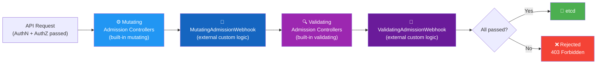
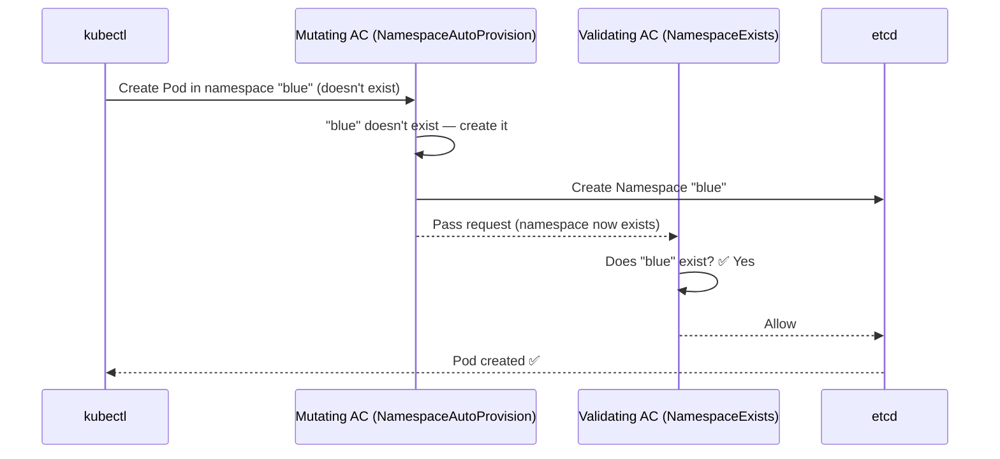
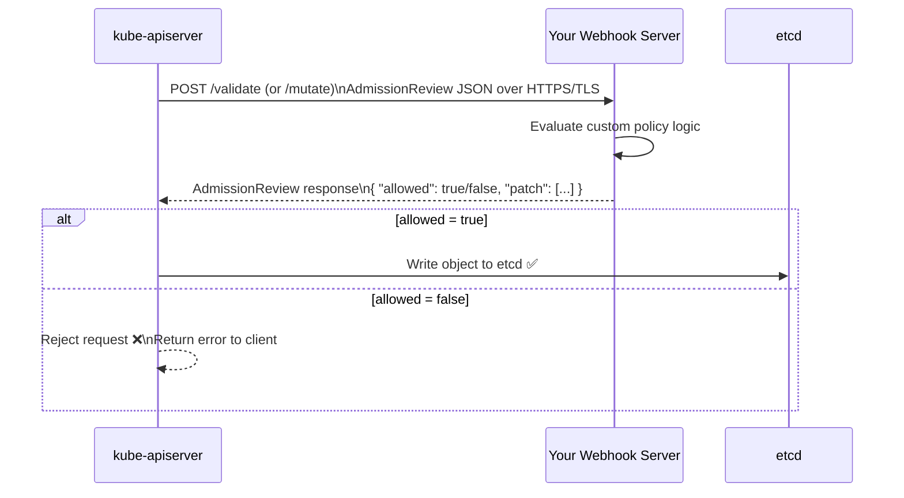
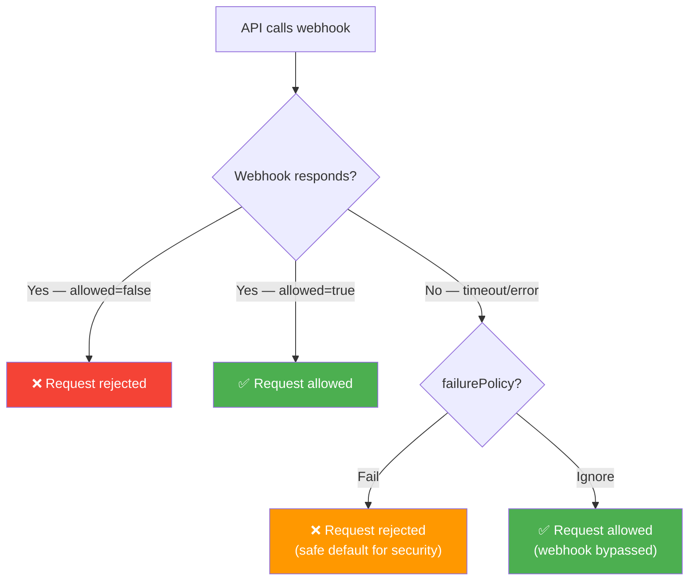
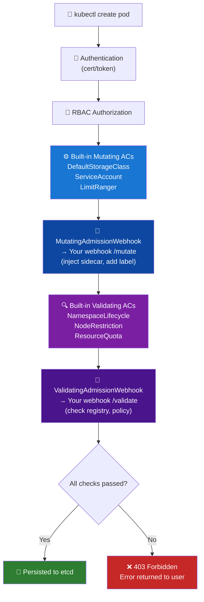
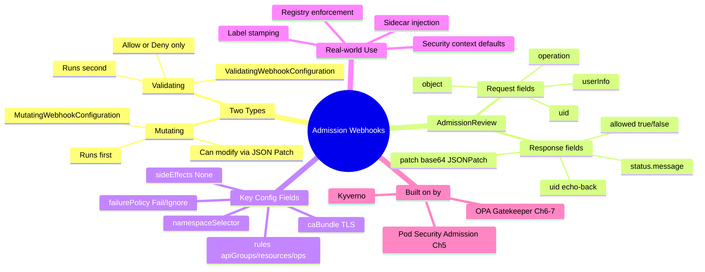

# 3 — Validating and Mutating Admission Controllers


---

## Why This Matters

Chapter 2 introduced built-in admission controllers — compiled into the kube-apiserver binary, covering common needs like namespace lifecycle, storage class defaults, and node restriction. But built-ins have a hard limit: **you cannot add custom policy logic without modifying and recompiling Kubernetes itself.**

Real-world clusters need policies that built-ins cannot express:
- "Reject any Pod whose image is not from `registry.company.com`"
- "Inject a sidecar container into every Pod in the `production` namespace"
- "Label every object with the requesting user's email address"
- "Require specific annotations on all Deployments before allowing creation"

This is where **admission webhooks** come in — dynamic, externally hosted HTTP servers that Kubernetes calls during the admission phase. They let you write arbitrary policy logic in any language and plug it directly into the API request pipeline without touching the Kubernetes codebase.

For CKS, webhooks underpin the entire ecosystem of policy engines: OPA Gatekeeper (Chapter 6–7), Pod Security Admission (Chapter 5), and any custom security enforcement you write. Understanding how webhooks work mechanically is essential.

---

## What Are Validating and Mutating Admission Controllers?

All admission controllers fall into two behavioural categories:

| Type | What It Does | Can Reject? | Can Modify? | Example |
|---|---|---|---|---|
| **Mutating** | Changes the object before it is persisted | Yes | **Yes** | Inject sidecar, add label, set default storageClass |
| **Validating** | Inspects the (possibly mutated) object and approves or rejects | **Yes** | No | Check image registry, verify label exists, block root user |
| **Both** | Some built-ins do both in one pass | Yes | Yes | LimitRanger (sets defaults + validates max) |

### The Critical Ordering Rule



**Mutating always runs before Validating.** This is intentional: mutating controllers inject defaults and modify objects first, so that when validating controllers inspect the object, they see the final, complete version. If validation ran first, it could reject a request that mutation would have fixed.

**Practical example:**



If the order were reversed, `NamespaceExists` (validating) would reject the request before `NamespaceAutoProvision` (mutating) had a chance to create the namespace.

---

## Built-In Controller Examples

### DefaultStorageClass — Mutating in Action

When you submit a PVC without a `storageClassName`:

```yaml
# What the user submits
apiVersion: v1
kind: PersistentVolumeClaim
metadata:
  name: myclaim
spec:
  accessModes:
  - ReadWriteOnce
  resources:
    requests:
      storage: 500Mi
  # storageClassName NOT specified
```

The `DefaultStorageClass` mutating controller intercepts it and injects the default:

```yaml
# What actually gets written to etcd (after mutation)
apiVersion: v1
kind: PersistentVolumeClaim
metadata:
  name: myclaim
spec:
  accessModes:
  - ReadWriteOnce
  resources:
    requests:
      storage: 500Mi
  storageClassName: default   # ← injected by DefaultStorageClass controller
```

Verify:

```bash
kubectl describe pvc myclaim
# Name:          myclaim
# Namespace:     default
# StorageClass:  default     ← added automatically
# Status:        Pending
```

### NamespaceLifecycle — Validating in Action

```bash
kubectl run nginx --image=nginx --namespace=does-not-exist
# Error from server (NotFound): namespaces "does-not-exist" not found
```

The `NamespaceLifecycle` controller validates that the target namespace exists before allowing the object to be created. No mutation occurs — it's a pure gate.

---

## Extending with External Webhooks

Beyond built-ins, Kubernetes provides two dynamic webhook extension points:

| Webhook Kind | K8s Object | Phase | Purpose |
|---|---|---|---|
| `MutatingAdmissionWebhook` | `MutatingWebhookConfiguration` | Mutating phase | Modify objects — inject sidecars, add labels, set defaults |
| `ValidatingAdmissionWebhook` | `ValidatingWebhookConfiguration` | Validating phase | Approve or reject based on custom policy |

Both are **enabled by default** in modern Kubernetes. They work by calling an external HTTPS server you provide.

### The Webhook Call Flow



---

## The AdmissionReview Object

The API server sends a JSON `AdmissionReview` object to your webhook and expects an `AdmissionReview` response back.

### Request (API server → Webhook)

```json
{
  "apiVersion": "admission.k8s.io/v1",
  "kind": "AdmissionReview",
  "request": {
    "uid": "705ab4f5-6393-11e8-b7cc-4201aa800002",
    "kind": {
      "group": "",
      "version": "v1",
      "kind": "Pod"
    },
    "resource": {
      "group": "",
      "version": "v1",
      "resource": "pods"
    },
    "namespace": "production",
    "operation": "CREATE",
    "userInfo": {
      "username": "jane.doe@company.com",
      "groups": ["system:authenticated"]
    },
    "object": {
      "metadata": {
        "name": "web-pod",
        "namespace": "production"
      },
      "spec": {
        "containers": [{
          "name": "app",
          "image": "nginx:latest",
          "securityContext": {
            "runAsUser": 0
          }
        }]
      }
    },
    "oldObject": null,
    "dryRun": false
  }
}
```

### Key Fields in the Request

| Field | Description |
|---|---|
| `request.uid` | Unique ID — **must be echoed back** in the response |
| `request.kind` | What kind of object is being created/updated |
| `request.operation` | CREATE, UPDATE, DELETE, CONNECT |
| `request.userInfo` | Who is making the request (username, groups, UID) |
| `request.object` | The full object being submitted (the body) |
| `request.oldObject` | The existing object (for UPDATE operations) |
| `request.dryRun` | True if `kubectl --dry-run=server` — webhook should not apply side effects |

### Response (Webhook → API server)

**Allow:**

```json
{
  "apiVersion": "admission.k8s.io/v1",
  "kind": "AdmissionReview",
  "response": {
    "uid": "705ab4f5-6393-11e8-b7cc-4201aa800002",
    "allowed": true
  }
}
```

**Deny:**

```json
{
  "apiVersion": "admission.k8s.io/v1",
  "kind": "AdmissionReview",
  "response": {
    "uid": "705ab4f5-6393-11e8-b7cc-4201aa800002",
    "allowed": false,
    "status": {
      "code": 403,
      "message": "Image must be from registry.company.com — found: nginx:latest"
    }
  }
}
```

**Mutate (allow + patch):**

```json
{
  "apiVersion": "admission.k8s.io/v1",
  "kind": "AdmissionReview",
  "response": {
    "uid": "705ab4f5-6393-11e8-b7cc-4201aa800002",
    "allowed": true,
    "patchType": "JSONPatch",
    "patch": "W3sib3AiOiAiYWRkIiwgInBhdGgiOiAiL21ldGFkYXRhL2xhYmVscy91c2VyIiwgInZhbHVlIjogImphbmUuZG9lIn1d"
  }
}
```

> The `patch` field is a **base64-encoded JSON Patch** array. Decoded, it looks like:
> ```json
> [{"op": "add", "path": "/metadata/labels/user", "value": "jane.doe"}]
> ```

---

## Building a Webhook Server

Your webhook server is simply an HTTPS service that accepts POST requests and returns JSON. It can be written in any language. TLS is **mandatory** — the API server will not call plain HTTP endpoints.

### Python / Flask Webhook Server

```python
from flask import Flask, request, jsonify
import base64
import json

app = Flask(__name__)

# ─── VALIDATING ENDPOINT ─────────────────────────────────────────────────────

@app.route("/validate", methods=["POST"])
def validate():
    admission_review = request.get_json()
    req = admission_review["request"]

    object_name = req["object"]["metadata"]["name"]
    user_name   = req["userInfo"]["username"]
    uid         = req["uid"]

    # Policy: users cannot create objects with their own name
    allowed = True
    message = ""

    if object_name == user_name:
        allowed = False
        message = f"You cannot create objects named '{object_name}' — that is your username."

    # Image registry policy
    containers = req["object"].get("spec", {}).get("containers", [])
    for c in containers:
        if not c["image"].startswith("registry.company.com/"):
            allowed = False
            message = f"Image '{c['image']}' is not from approved registry registry.company.com"
            break

    return jsonify({
        "apiVersion": "admission.k8s.io/v1",
        "kind": "AdmissionReview",
        "response": {
            "uid": uid,
            "allowed": allowed,
            "status": {"message": message}
        }
    })

# ─── MUTATING ENDPOINT ────────────────────────────────────────────────────────

@app.route("/mutate", methods=["POST"])
def mutate():
    admission_review = request.get_json()
    req = admission_review["request"]

    user_name = req["userInfo"]["username"]
    uid       = req["uid"]

    # Mutation: add a label with the requesting user's name
    patch = [
        {
            "op": "add",
            "path": "/metadata/labels",
            "value": {}          # create labels if absent
        },
        {
            "op": "add",
            "path": "/metadata/labels/created-by",
            "value": user_name   # tag with the creator's username
        }
    ]

    patch_bytes   = json.dumps(patch).encode("utf-8")
    patch_encoded = base64.b64encode(patch_bytes).decode("utf-8")

    return jsonify({
        "apiVersion": "admission.k8s.io/v1",
        "kind": "AdmissionReview",
        "response": {
            "uid":       uid,
            "allowed":   True,
            "patchType": "JSONPatch",
            "patch":     patch_encoded
        }
    })

if __name__ == "__main__":
    # Production: pass TLS cert/key here
    app.run(host="0.0.0.0", port=443,
            ssl_context=("/certs/tls.crt", "/certs/tls.key"))
```

### Go Webhook Server (Excerpt)

```go
package main

import (
    "encoding/json"
    "fmt"
    "io/ioutil"
    "net/http"

    admissionv1 "k8s.io/api/admission/v1"
    metav1      "k8s.io/apimachinery/pkg/apis/meta/v1"
)

// admitFunc is the function signature for any admit handler
type admitFunc func(admissionv1.AdmissionReview) *admissionv1.AdmissionResponse

// serve wraps an admitFunc into an HTTP handler
func serve(w http.ResponseWriter, r *http.Request, admit admitFunc) {
    body, err := ioutil.ReadAll(r.Body)
    if err != nil {
        http.Error(w, "cannot read body", http.StatusBadRequest)
        return
    }

    var ar admissionv1.AdmissionReview
    if err := json.Unmarshal(body, &ar); err != nil {
        http.Error(w, fmt.Sprintf("cannot unmarshal body: %v", err), http.StatusBadRequest)
        return
    }

    ar.Response = admit(ar)
    ar.Response.UID = ar.Request.UID  // echo UID back

    resp, err := json.Marshal(ar)
    if err != nil {
        http.Error(w, fmt.Sprintf("cannot marshal response: %v", err), http.StatusInternalServerError)
        return
    }

    w.Header().Set("Content-Type", "application/json")
    w.Write(resp)
}

func validatePod(ar admissionv1.AdmissionReview) *admissionv1.AdmissionResponse {
    // Parse pod from request.object
    // Apply custom logic here
    return &admissionv1.AdmissionResponse{
        Allowed: true,
    }
}

func main() {
    http.HandleFunc("/validate", func(w http.ResponseWriter, r *http.Request) {
        serve(w, r, validatePod)
    })
    http.ListenAndServeTLS(":443", "/certs/tls.crt", "/certs/tls.key", nil)
}
```

---

## JSON Patch Operations

For mutating webhooks, the patch is a JSON Patch (RFC 6902) array:

| Operation | Effect | Example |
|---|---|---|
| `add` | Add a field or array element | `{"op":"add","path":"/metadata/labels/env","value":"prod"}` |
| `remove` | Delete a field | `{"op":"remove","path":"/spec/containers/0/securityContext/runAsUser"}` |
| `replace` | Change existing field value | `{"op":"replace","path":"/spec/replicas","value":3}` |
| `copy` | Copy a value from one path to another | `{"op":"copy","from":"/metadata/name","path":"/metadata/labels/name"}` |
| `move` | Move a value | `{"op":"move","from":"/spec/old","path":"/spec/new"}` |
| `test` | Assert a value (fails the patch if mismatch) | `{"op":"test","path":"/spec/replicas","value":1}` |

### Encoding a Patch

```python
import json, base64

patch = [
    {"op": "add", "path": "/metadata/labels/team", "value": "platform"},
    {"op": "replace", "path": "/spec/containers/0/imagePullPolicy", "value": "Always"}
]

encoded = base64.b64encode(json.dumps(patch).encode()).decode()
print(encoded)
# W3sib3AiOiAiYWRkIi...  ← this goes in the response "patch" field
```

---

## Deploying the Webhook Server in Kubernetes

### Step 1 — Create TLS Certificates

The API server requires TLS. Generate a certificate for your webhook service:

```bash
# Using cert-manager (recommended for production)
kubectl apply -f - <<EOF
apiVersion: cert-manager.io/v1
kind: Certificate
metadata:
  name: webhook-cert
  namespace: webhook-system
spec:
  secretName: webhook-tls
  dnsNames:
  - webhook-service.webhook-system.svc
  - webhook-service.webhook-system.svc.cluster.local
  issuerRef:
    name: cluster-issuer
    kind: ClusterIssuer
EOF

# Or use openssl for a self-signed cert (lab/exam environments)
openssl genrsa -out ca.key 2048
openssl req -new -x509 -days 365 -key ca.key \
  -subj "/O=Kubernetes/CN=Admission Webhook CA" -out ca.crt

openssl genrsa -out server.key 2048
openssl req -new -key server.key \
  -subj "/CN=webhook-service.webhook-system.svc" -out server.csr

openssl x509 -req -days 365 -in server.csr \
  -CA ca.crt -CAkey ca.key -CAcreateserial -out server.crt

# Store as Kubernetes Secret
kubectl create secret tls webhook-tls \
  --cert=server.crt --key=server.key \
  -n webhook-system
```

### Step 2 — Deploy the Webhook Server as a Pod + Service

```yaml
apiVersion: apps/v1
kind: Deployment
metadata:
  name: admission-webhook
  namespace: webhook-system
spec:
  replicas: 1
  selector:
    matchLabels:
      app: admission-webhook
  template:
    metadata:
      labels:
        app: admission-webhook
    spec:
      containers:
      - name: webhook
        image: registry.company.com/admission-webhook:v1.0.0
        ports:
        - containerPort: 443
        volumeMounts:
        - name: tls
          mountPath: /certs
          readOnly: true
      volumes:
      - name: tls
        secret:
          secretName: webhook-tls
---
apiVersion: v1
kind: Service
metadata:
  name: webhook-service
  namespace: webhook-system
spec:
  selector:
    app: admission-webhook
  ports:
  - port: 443
    targetPort: 443
```

### Step 3 — Register the Webhook with Kubernetes

#### ValidatingWebhookConfiguration

```yaml
apiVersion: admissionregistration.k8s.io/v1
kind: ValidatingWebhookConfiguration
metadata:
  name: pod-policy.example.com
webhooks:
- name: pod-policy.example.com
  admissionReviewVersions: ["v1"]
  sideEffects: None                 # ← required field
  clientConfig:
    service:
      namespace: webhook-system
      name: webhook-service
      path: /validate              # ← the endpoint on your server
    caBundle: "CiOtLS0tQk..."     # ← base64-encoded CA cert
  rules:
  - apiGroups: [""]
    apiVersions: ["v1"]
    operations: ["CREATE", "UPDATE"]
    resources: ["pods"]
    scope: "Namespaced"
  failurePolicy: Fail              # Fail or Ignore — what to do if webhook is unreachable
  namespaceSelector:               # Optional — only call webhook for matching namespaces
    matchLabels:
      admission-webhook: enabled
```

#### MutatingWebhookConfiguration

```yaml
apiVersion: admissionregistration.k8s.io/v1
kind: MutatingWebhookConfiguration
metadata:
  name: label-injector.example.com
webhooks:
- name: label-injector.example.com
  admissionReviewVersions: ["v1"]
  sideEffects: None
  clientConfig:
    service:
      namespace: webhook-system
      name: webhook-service
      path: /mutate
    caBundle: "CiOtLS0tQk..."
  rules:
  - apiGroups: ["", "apps"]
    apiVersions: ["v1"]
    operations: ["CREATE"]
    resources: ["pods", "deployments"]
    scope: "*"
  failurePolicy: Ignore            # Don't block creation if webhook is down
```

---

## Key Configuration Fields Explained

### `failurePolicy`

Controls what happens when the webhook server is unreachable or returns an error:

| Value | Behaviour | Use Case |
|---|---|---|
| `Fail` | Reject the request — safe but risky if webhook goes down | Security-critical validation |
| `Ignore` | Allow the request — available but could bypass policy | Non-critical mutation (label injection) |



### `sideEffects`

Whether your webhook has side effects (writes to external systems, creates other objects):

| Value | Meaning |
|---|---|
| `None` | No side effects — safe to call for dry-run requests |
| `NoneOnDryRun` | Has side effects but won't execute them on dry-run |
| `Some` | Has side effects even on dry-run (deprecated in favour of NoneOnDryRun) |
| `Unknown` | (Deprecated) |

> Set `sideEffects: None` unless your webhook writes to external systems.

### `namespaceSelector` and `objectSelector`

Fine-grained control over when the webhook fires:

```yaml
# Only fire for namespaces with this label
namespaceSelector:
  matchLabels:
    environment: production

# Only fire for objects with this label
objectSelector:
  matchExpressions:
  - key: webhook-skip
    operator: DoesNotExist
```

### `rules`

Defines which API calls trigger the webhook:

```yaml
rules:
- apiGroups: [""]           # "" = core API group (pods, services, etc.)
  apiVersions: ["v1"]
  operations:
  - CREATE
  - UPDATE
  # Also available: DELETE, CONNECT
  resources:
  - pods
  - pods/status             # Subresources
  scope: "Namespaced"       # Namespaced | Cluster | *
```

---

## Complete Architecture Overview



---

## Real-World Scenarios

### Scenario 1 — Image Registry Enforcement (Validating Webhook)

**Problem:** Engineers are pulling images from Docker Hub. The security team mandates all images must come from `registry.company.com`.

**Webhook logic (Python):**

```python
@app.route("/validate", methods=["POST"])
def validate_registry():
    req = request.get_json()["request"]
    containers = req["object"].get("spec", {}).get("containers", [])
    init_containers = req["object"].get("spec", {}).get("initContainers", [])

    all_containers = containers + init_containers
    violations = []

    for c in all_containers:
        if not c["image"].startswith("registry.company.com/"):
            violations.append(
                f"Container '{c['name']}' uses disallowed image: {c['image']}"
            )

    allowed = len(violations) == 0
    message = "; ".join(violations) if violations else ""

    return jsonify({
        "apiVersion": "admission.k8s.io/v1",
        "kind": "AdmissionReview",
        "response": {
            "uid": req["uid"],
            "allowed": allowed,
            "status": {"message": message}
        }
    })
```

**Result:**

```bash
kubectl run nginx --image=nginx
# Error from server: Container 'nginx' uses disallowed image: nginx
# (images must be from registry.company.com/)

kubectl run nginx --image=registry.company.com/nginx:1.25
# pod/nginx created ✅
```

### Scenario 2 — Sidecar Injection (Mutating Webhook)

**Problem:** The platform team wants every Pod in the `production` namespace to have a log-shipper sidecar injected automatically, without requiring developers to add it manually.

**Webhook logic (Python):**

```python
@app.route("/mutate", methods=["POST"])
def inject_sidecar():
    req = request.get_json()["request"]

    sidecar = {
        "name": "log-shipper",
        "image": "registry.company.com/log-shipper:v2.1",
        "resources": {
            "limits": {"memory": "64Mi", "cpu": "50m"}
        },
        "volumeMounts": [{
            "name": "varlog",
            "mountPath": "/var/log"
        }]
    }

    # JSON Patch to append to containers array
    patch = [{
        "op": "add",
        "path": "/spec/containers/-",   # "-" appends to end of array
        "value": sidecar
    }]

    import json, base64
    encoded = base64.b64encode(json.dumps(patch).encode()).decode()

    return jsonify({
        "apiVersion": "admission.k8s.io/v1",
        "kind": "AdmissionReview",
        "response": {
            "uid":       req["uid"],
            "allowed":   True,
            "patchType": "JSONPatch",
            "patch":     encoded
        }
    })
```

**Webhook config (only fires for `production` namespace):**

```yaml
namespaceSelector:
  matchLabels:
    environment: production
```

**Result:**

```bash
kubectl run app --image=registry.company.com/myapp:v1 -n production

kubectl get pod app -n production -o jsonpath='{.spec.containers[*].name}'
# app log-shipper   ← sidecar automatically injected ✅
```

### Scenario 3 — Debugging a Rejected Request

**Symptom:** A user gets:

```
Error from server (Forbidden): pods "web" is forbidden:
[pod-policy.example.com] Image must be from registry.company.com — found: nginx:latest
```

**Diagnosis workflow:**

```bash
# 1. Identify which webhook is firing
kubectl get validatingwebhookconfigurations
kubectl describe validatingwebhookconfiguration pod-policy.example.com

# 2. Check if webhook pod is running
kubectl get pods -n webhook-system

# 3. Check webhook pod logs
kubectl logs -n webhook-system deployment/admission-webhook

# 4. Test the webhook directly
curl -k -X POST https://webhook-service.webhook-system.svc/validate \
  -H "Content-Type: application/json" \
  -d '{"request": {"uid": "test", "object": {"spec": {"containers": [{"name":"c","image":"nginx"}]}}}}'

# 5. Temporarily bypass (for emergency — use with caution)
# Set failurePolicy: Ignore in the webhook config, or
# Delete the ValidatingWebhookConfiguration entirely to restore access
kubectl delete validatingwebhookconfiguration pod-policy.example.com
```

---

## Common Mistakes

| Mistake | Consequence | Fix |
|---|---|---|
| Not echoing `request.uid` in response | API server ignores the response — can cause indefinite hang or timeout | Always set `response.uid = request.uid` |
| Using HTTP instead of HTTPS | API server refuses connection — webhook is never called | TLS is mandatory; use a proper cert for the SAN matching the service DNS |
| `failurePolicy: Fail` on an unreliable webhook | A webhook pod crash blocks ALL pod creation cluster-wide | Use `failurePolicy: Ignore` for non-critical webhooks; ensure webhooks are highly available |
| Forgetting `sideEffects: None` | Webhook cannot be called during dry-run (`kubectl --dry-run=server`) | Always set `sideEffects: None` unless your webhook genuinely has external side effects |
| Webhook calls itself (infinite loop) | A mutating webhook fires for all Pods — including the webhook's own Pod | Use `namespaceSelector` or `objectSelector` to exclude the webhook's namespace |
| `caBundle` missing or wrong | `x509: certificate signed by unknown authority` — TLS handshake fails | Base64-encode the CA certificate, not the server cert |
| Mutation after validation | Injecting values that were already validated | Mutating runs BEFORE validating — the correct order; don't try to reverse it |
| JSON Patch path mismatch | Patch rejected — object unchanged, no error surfaced to user | Test patches carefully; path must exactly match the object structure |

---

## Quick Reference

### Webhook Configuration Fields

```yaml
webhooks:
- name: unique.webhook.name          # Fully-qualified DNS-style name
  admissionReviewVersions: ["v1"]    # Must include "v1"
  sideEffects: None                  # None | NoneOnDryRun | Some
  failurePolicy: Fail                # Fail | Ignore
  timeoutSeconds: 10                 # Default 10s; max 30s
  clientConfig:
    service:                         # In-cluster webhook
      namespace: webhook-system
      name: webhook-service
      path: /validate
      port: 443
    # OR for out-of-cluster:
    url: "https://my-webhook.example.com/validate"
    caBundle: "<base64-ca-cert>"     # Required for TLS validation
  rules:
  - apiGroups: [""]
    apiVersions: ["v1"]
    operations: ["CREATE", "UPDATE"]
    resources: ["pods"]
    scope: "Namespaced"              # Namespaced | Cluster | *
  namespaceSelector: {}              # Optional label selector
  objectSelector: {}                 # Optional label selector
  matchPolicy: Equivalent            # Exact | Equivalent
  reinvocationPolicy: Never          # Never | IfNeeded (mutating only)
```

### JSON Patch Cheat Sheet

```json
[
  {"op": "add",     "path": "/metadata/labels/env",    "value": "prod"},
  {"op": "remove",  "path": "/spec/containers/0/securityContext"},
  {"op": "replace", "path": "/spec/replicas",          "value": 3},
  {"op": "add",     "path": "/spec/containers/-",      "value": {"name":"sidecar","image":"..."}}
]
```

### Key Commands

```bash
# List all webhook configurations
kubectl get validatingwebhookconfigurations
kubectl get mutatingwebhookconfigurations

# Inspect a specific webhook
kubectl describe validatingwebhookconfiguration <name>

# Temporarily disable a webhook (emergency)
kubectl delete validatingwebhookconfiguration <name>

# Get the CA bundle for a TLS secret
kubectl get secret webhook-tls -n webhook-system \
  -o jsonpath='{.data.tls\.crt}' | base64 -d | \
  openssl x509 -noout -text | grep "Subject:"

# Encode a CA cert for the caBundle field
cat ca.crt | base64 -w 0
```

---

## CKS Exam Tips

> 💡 **Webhook = AdmissionReview in, AdmissionReview out.** The API server sends an `AdmissionReview` JSON object and expects an `AdmissionReview` JSON response. Know the structure of both.

> 💡 **`uid` must be echoed.** Every response must copy the `request.uid` into `response.uid`. This is a common source of bugs and a testable detail.

> 💡 **TLS is not optional.** Webhooks communicate over HTTPS. The `caBundle` in the webhook configuration is the base64-encoded CA certificate that signed the webhook server's TLS cert.

> 💡 **`failurePolicy: Fail` is the secure default** for security-critical validation — it ensures that if the webhook is unreachable, requests are blocked (fail closed). Know when to use `Ignore` (less critical, high-availability concerns).

> 💡 **Mutating before Validating** — if asked about ordering, mutating webhooks always run in the mutating phase, validating webhooks in the validating phase. The mutating phase precedes the validating phase.

> 💡 **`reinvocationPolicy: IfNeeded`** (mutating only) — if another mutating webhook modifies an object after yours ran, Kubernetes may re-invoke your webhook. This is how multi-webhook mutation chains work.

> 💡 **OPA Gatekeeper and Kyverno are both implemented as webhook servers** — they register `ValidatingWebhookConfiguration` and `MutatingWebhookConfiguration` objects and process `AdmissionReview` requests under the hood. Understanding this chapter is the foundation for Chapters 6 and 7.

```yaml
# CKS exam pattern — ValidatingWebhookConfiguration skeleton
apiVersion: admissionregistration.k8s.io/v1
kind: ValidatingWebhookConfiguration
metadata:
  name: my-validator
webhooks:
- name: my-validator.example.com
  admissionReviewVersions: ["v1"]
  sideEffects: None
  failurePolicy: Fail
  clientConfig:
    service:
      namespace: webhook-system
      name: webhook-service
      path: /validate
    caBundle: "<base64>"
  rules:
  - apiGroups: [""]
    apiVersions: ["v1"]
    operations: ["CREATE"]
    resources: ["pods"]
```

---

## Summary

Validating and Mutating Admission Webhooks unlock **arbitrary policy logic** in the Kubernetes API pipeline without modifying the cluster binary. The two key points that define them:

**Mutating webhooks** run first — they receive the object, can modify it via JSON Patch, and return the patched version. Used for sidecar injection, label stamping, default injection, and security context normalisation.

**Validating webhooks** run second — they inspect the (possibly mutated) final object and return a simple allow/deny decision with an optional message. Used for registry enforcement, policy compliance, required annotation checks, and anything that must hard-block non-conforming resources.



---

## What's Next

**Chapter 4 — Pod Security Policies** covers the now-deprecated PSP mechanism, which was Kubernetes' first attempt at a built-in policy system above admission controllers. Although deprecated in K8s 1.21 and removed in 1.25, PSP concepts appear in exam scenarios involving legacy clusters and help frame why Pod Security Standards (Chapter 5) and OPA (Chapters 6–7) were needed as replacements. Understanding PSPs also deepens your understanding of what admission controllers can express at the pod specification level.

---

*Chapter 3 of 30 — Microservice Vulnerabilities | Kubernetes Security Study Guide*
