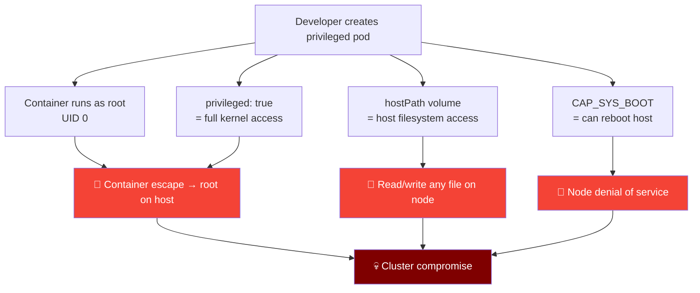
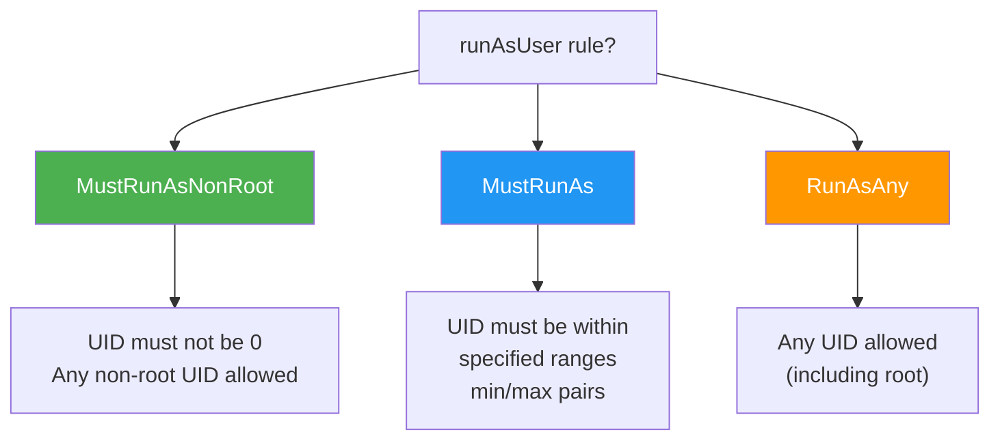
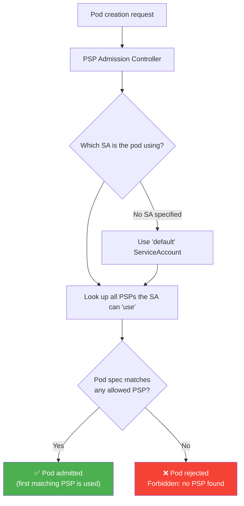
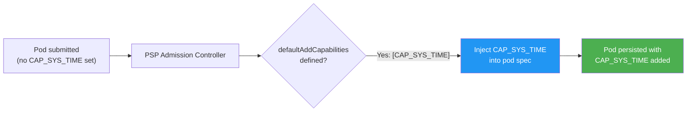
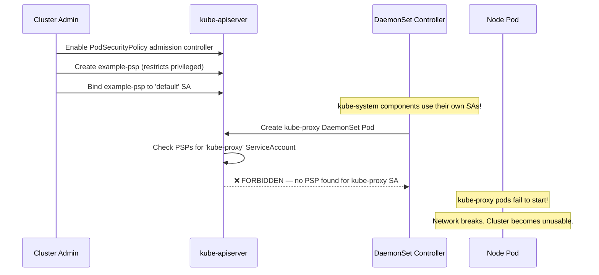
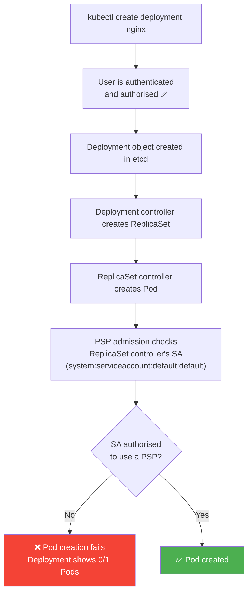
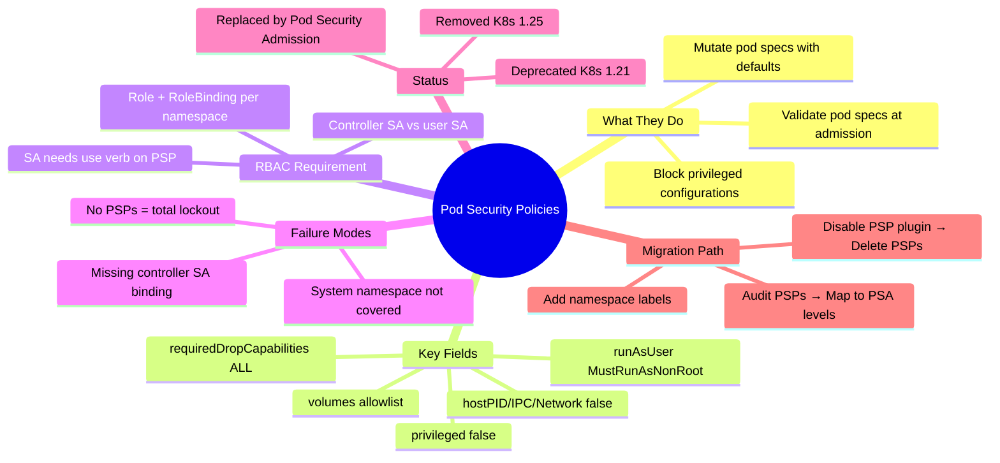

# 4 — Pod Security Policies

> ⚠️ **Deprecated Notice:** Pod Security Policies (PSP) were deprecated in Kubernetes **1.21** and removed entirely in **1.25**. They are replaced by Pod Security Admission + Pod Security Standards (Chapter 5). This chapter is essential for CKS candidates working with legacy clusters and for understanding why the modern alternatives were designed the way they are.


---

## Why This Matters

Before Pod Security Standards existed, cluster administrators had no native Kubernetes mechanism to answer: *"Can any developer with `create pods` permission just spin up a privileged, root-running, host-filesystem-mounting container?"* Without PSP, the answer was yes — RBAC controlled who could create pods, but not what kind of pods they could create.

Pod Security Policies were Kubernetes' first attempt to solve this at the API-server level. They worked as a **validating (and sometimes mutating) admission controller** that inspected every pod creation request and rejected it if the pod's specification violated the defined policy — before the pod was ever scheduled or run.

Understanding PSPs matters for three reasons:

1. **Legacy clusters** — many production clusters still run K8s < 1.25 with PSP enabled. CKS candidates must be able to read, create, and troubleshoot PSPs.
2. **Design context** — PSP's failure modes (accidental cluster lockout, RBAC complexity, no dry-run mode) directly motivated the design of Pod Security Standards. Knowing what PSP got wrong explains why PSA is structured the way it is.
3. **Conceptual foundation** — PSP fields (`privileged`, `runAsUser`, `volumes`, `capabilities`) map directly to the Pod Security Standards levels. Every field you learn here reappears in Chapter 5.

---

## What Is a Pod Security Policy?

A Pod Security Policy is a **cluster-scoped resource** (`kind: PodSecurityPolicy`, API group `policy/v1beta1`) that defines a set of conditions a pod must satisfy before it is admitted to the cluster. The PSP admission controller enforces these conditions at the API server level.

| Attribute | Detail |
|---|---|
| **Kind** | `PodSecurityPolicy` |
| **API Group** | `policy/v1beta1` (removed in K8s 1.25) |
| **Scope** | Cluster-scoped (not namespaced) |
| **Phase** | Admission controller — runs before etcd write |
| **Can Validate** | Yes — reject non-compliant pods |
| **Can Mutate** | Yes — inject defaults (unlike its replacement, PSA) |
| **Enabled via** | `--enable-admission-plugins=PodSecurityPolicy` on kube-apiserver |
| **Access controlled by** | RBAC — pods/service accounts must have `use` verb on the PSP |
| **Deprecated** | K8s 1.21 |
| **Removed** | K8s 1.25 |

### What PSP Is NOT

| Misconception | Reality |
|---|---|
| "PSP is always on" | It requires explicit enablement via `--enable-admission-plugins` |
| "Any pod can use any PSP" | Pods must be authorised to use a PSP via RBAC Role + RoleBinding |
| "PSP applies to all namespaces equally" | PSP access is controlled per service account; each SA can use different PSPs |
| "PSP replaces RBAC" | PSP works alongside RBAC — RBAC controls who can create pods, PSP controls what kind |
| "Enabling PSP with no PSPs defined is safe" | **Critically dangerous** — enabling the controller with no PSP objects blocks ALL pod creation |

---

## The Problem PSP Solves

Consider this highly privileged pod manifest:

```yaml
apiVersion: v1
kind: Pod
metadata:
  name: sample-pod
spec:
  containers:
  - name: ubuntu
    image: ubuntu
    command: ["sleep", "3600"]
    securityContext:
      privileged: true          # Full host kernel access
      runAsUser: 0              # Running as root
      capabilities:
        add: ["CAP_SYS_BOOT"]  # Can reboot the host
  volumes:
  - name: data-volume
    hostPath:
      path: /data               # Direct access to host filesystem
      type: Directory
```

Without PSP, any user with `create pods` RBAC permission can deploy this. The consequences:



PSP blocks all of this at admission time — before the pod is even scheduled.

---

## Enabling PSP on the API Server

PSP is an admission controller plugin that must be explicitly enabled.

**Binary/systemd setup:**

```bash
ExecStart=/usr/local/bin/kube-apiserver \
  --advertise-address=${INTERNAL_IP} \
  --allow-privileged=true \
  --authorization-mode=Node,RBAC \
  --enable-admission-plugins=PodSecurityPolicy \
  ...
```

**Kubeadm static Pod manifest** (`/etc/kubernetes/manifests/kube-apiserver.yaml`):

```yaml
apiVersion: v1
kind: Pod
metadata:
  name: kube-apiserver
  namespace: kube-system
spec:
  containers:
  - name: kube-apiserver
    image: k8s.gcr.io/kube-apiserver:v1.20.0
    command:
    - kube-apiserver
    - --authorization-mode=Node,RBAC
    - --enable-admission-plugins=NodeRestriction,PodSecurityPolicy   # ← add here
    - --advertise-address=172.17.0.107
    - --allow-privileged=true
```

> ⚠️ **Critical Warning:** Enabling `PodSecurityPolicy` without any PSP objects and RBAC bindings in place will **immediately block all pod creation** — including system pods in `kube-system`. Always create the PSP + RBAC first, then enable the admission plugin.

---

## Defining a Pod Security Policy

### Minimal PSP — Block Privileged Containers

```yaml
apiVersion: policy/v1beta1
kind: PodSecurityPolicy
metadata:
  name: example-psp
spec:
  privileged: false    # Deny privileged containers
  seLinux:
    rule: RunAsAny
  supplementalGroups:
    rule: RunAsAny
  runAsUser:
    rule: RunAsAny
  fsGroup:
    rule: RunAsAny
  volumes:
  - '*'               # Allow all volume types
```

This single policy rejects any pod with `privileged: true`.

### Comprehensive Hardened PSP

```yaml
apiVersion: policy/v1beta1
kind: PodSecurityPolicy
metadata:
  name: restricted-psp
  annotations:
    seccomp.security.alpha.kubernetes.io/allowedProfiles: 'runtime/default'
spec:
  # ── Privilege Escalation ──────────────────────────────────────────────
  privileged: false
  allowPrivilegeEscalation: false
  defaultAllowPrivilegeEscalation: false

  # ── User / Group ──────────────────────────────────────────────────────
  runAsUser:
    rule: MustRunAsNonRoot       # UID must not be 0

  runAsGroup:
    rule: MustRunAs
    ranges:
    - min: 1000
      max: 65535

  supplementalGroups:
    rule: MustRunAs
    ranges:
    - min: 1
      max: 65535

  fsGroup:
    rule: MustRunAs
    ranges:
    - min: 1
      max: 65535

  # ── Linux Capabilities ────────────────────────────────────────────────
  requiredDropCapabilities:
  - ALL                          # Force drop all capabilities first

  allowedCapabilities:
  - NET_BIND_SERVICE             # Whitelist only what's needed

  defaultAddCapabilities: []     # Don't auto-add any capabilities

  # ── Host Access ───────────────────────────────────────────────────────
  hostPID: false                 # No host PID namespace
  hostIPC: false                 # No host IPC namespace
  hostNetwork: false             # No host network namespace

  hostPorts: []                  # No host port binding

  # ── Filesystem ───────────────────────────────────────────────────────
  readOnlyRootFilesystem: true   # Force read-only root fs

  # ── Volume Types ─────────────────────────────────────────────────────
  volumes:
  - configMap
  - emptyDir
  - projected
  - secret
  - downwardAPI
  - persistentVolumeClaim
  # hostPath is NOT listed — blocked

  # ── SELinux ───────────────────────────────────────────────────────────
  seLinux:
    rule: RunAsAny

  # ── Sysctls ───────────────────────────────────────────────────────────
  forbiddenSysctls:
  - '*'                          # Block all sysctl modifications
```

---

## PSP Field Reference

### User and Group Controls

| Field | Rule Options | Description |
|---|---|---|
| `runAsUser` | `MustRunAs`, `MustRunAsNonRoot`, `RunAsAny` | Controls which UIDs are allowed |
| `runAsGroup` | `MustRunAs`, `MustRunAsNonRoot`, `RunAsAny` | Controls which GIDs are allowed |
| `supplementalGroups` | `MustRunAs`, `MayRunAs`, `RunAsAny` | Controls additional groups |
| `fsGroup` | `MustRunAs`, `MayRunAs`, `RunAsAny` | Controls volume ownership GID |

**`runAsUser` rules explained:**



```yaml
# Example: restrict to UID range 1000-9999
runAsUser:
  rule: MustRunAs
  ranges:
  - min: 1000
    max: 9999
```

### Capability Controls

| Field | Purpose | Example |
|---|---|---|
| `requiredDropCapabilities` | Force these to be dropped from every container | `["ALL"]` |
| `allowedCapabilities` | Whitelist: only these can be added | `["NET_BIND_SERVICE"]` |
| `defaultAddCapabilities` | Auto-add these to every container (mutating) | `["SYS_TIME"]` |

```yaml
# Best practice pattern: drop all, then selectively allow
requiredDropCapabilities:
- ALL
allowedCapabilities:
- NET_BIND_SERVICE  # Only capability allowed to be added
defaultAddCapabilities: []
```

### Volume Type Controls

```yaml
volumes:
# Allowed safe types
- configMap
- emptyDir
- projected
- secret
- downwardAPI
- persistentVolumeClaim

# Dangerous types — do NOT include in restricted policies:
# - hostPath     → direct host filesystem access
# - hostPathType  → same
# - '*'          → all types (too permissive)
```

### Host Access Controls

```yaml
hostPID: false        # Prevent seeing/signalling host processes
hostIPC: false        # Prevent accessing host IPC mechanisms
hostNetwork: false    # Prevent bypassing network policy via host network

hostPorts:            # Restrict host port binding
- min: 0
  max: 0              # Empty list = no host ports allowed
```

---

## The RBAC Requirement — The Critical Complexity

Enabling the PSP admission controller alone is not enough. Pods (via their ServiceAccount) must be **explicitly authorised** to use a PSP via RBAC. This was one of PSP's biggest sources of operational complexity.

### How PSP Authorization Works



### Step-by-Step Setup

**Step 1 — Create the PSP:**

```yaml
apiVersion: policy/v1beta1
kind: PodSecurityPolicy
metadata:
  name: example-psp
spec:
  privileged: false
  runAsUser:
    rule: MustRunAsNonRoot
  requiredDropCapabilities:
  - CAP_SYS_BOOT
  defaultAddCapabilities:
  - CAP_SYS_TIME          # Mutating: injected into every pod that uses this PSP
  volumes:
  - persistentVolumeClaim
  seLinux:
    rule: RunAsAny
  supplementalGroups:
    rule: RunAsAny
```

**Step 2 — Create a Role with `use` permission:**

```yaml
apiVersion: rbac.authorization.k8s.io/v1
kind: Role
metadata:
  name: psp-example-role
  namespace: default
rules:
- apiGroups: ["policy"]
  resources: ["podsecuritypolicies"]
  resourceNames: ["example-psp"]   # ← specific PSP name
  verbs: ["use"]                    # ← only verb that matters for PSPs
```

**Step 3 — Bind the Role to a ServiceAccount:**

```yaml
apiVersion: rbac.authorization.k8s.io/v1
kind: RoleBinding
metadata:
  name: psp-example-rolebinding
  namespace: default
subjects:
- kind: ServiceAccount
  name: default              # The SA the pod uses
  namespace: default
roleRef:
  kind: Role
  name: psp-example-role
  apiGroup: rbac.authorization.k8s.io
```

**Step 4 — Verify the pod can be created:**

```bash
kubectl create -f pod.yaml
# pod/sample-pod created ✅

# Without the RoleBinding:
# Error from server (Forbidden): pods "sample-pod" is forbidden:
# unable to validate against any pod security policy
```

### ClusterRole for Cluster-Wide PSP Access

For policies that should apply across all namespaces (e.g., a baseline policy for all workloads):

```yaml
apiVersion: rbac.authorization.k8s.io/v1
kind: ClusterRole
metadata:
  name: psp-restricted-clusterrole
rules:
- apiGroups: ["policy"]
  resources: ["podsecuritypolicies"]
  resourceNames: ["restricted-psp"]
  verbs: ["use"]
---
apiVersion: rbac.authorization.k8s.io/v1
kind: ClusterRoleBinding
metadata:
  name: psp-restricted-all-serviceaccounts
subjects:
- kind: Group
  name: system:serviceaccounts   # All service accounts in all namespaces
  apiGroup: rbac.authorization.k8s.io
roleRef:
  kind: ClusterRole
  name: psp-restricted-clusterrole
  apiGroup: rbac.authorization.k8s.io
```

---

## PSP Mutation — The Hidden Power (and Problem)

Unlike its replacement (Pod Security Admission), PSPs could **mutate** pod definitions — injecting defaults into pods that didn't explicitly set them:



**Mutating PSP fields:**

| Field | Mutation Effect |
|---|---|
| `defaultAddCapabilities` | Auto-adds listed capabilities to every container |
| `defaultAllowPrivilegeEscalation` | Sets `allowPrivilegeEscalation` if not specified |
| `runAsUser.rule: MustRunAs` (with single range) | Sets the UID if not specified |
| `fsGroup.rule: MustRunAs` (with single range) | Sets the fsGroup if not specified |
| `supplementalGroups.rule: MustRunAs` | Sets supplementalGroups |

> **Why this mattered:** Mutation was convenient (operators could inject defaults without developers having to know about them) but it made the system **unpredictable** — pods would be silently modified without the submitter knowing. This was one of the main criticisms of PSPs and is explicitly not supported in Pod Security Standards.

---

## The "Death by Lockout" — PSP's Biggest Operational Risk

The most infamous PSP failure mode:



**The fix — always create a privileged PSP for system components:**

```yaml
# Before enabling PSP, create this policy and bind it to kube-system SAs
apiVersion: policy/v1beta1
kind: PodSecurityPolicy
metadata:
  name: privileged-psp
spec:
  privileged: true
  hostPID: true
  hostIPC: true
  hostNetwork: true
  hostPorts:
  - min: 0
    max: 65535
  volumes:
  - '*'
  allowedCapabilities:
  - '*'
  runAsUser:
    rule: RunAsAny
  seLinux:
    rule: RunAsAny
  supplementalGroups:
    rule: RunAsAny
  fsGroup:
    rule: RunAsAny
---
# Bind to system:masters and all kube-system service accounts
apiVersion: rbac.authorization.k8s.io/v1
kind: ClusterRoleBinding
metadata:
  name: privileged-psp-system
subjects:
- kind: Group
  name: system:masters
  apiGroup: rbac.authorization.k8s.io
- kind: Group
  name: system:nodes
  apiGroup: rbac.authorization.k8s.io
- kind: ServiceAccount
  name: default
  namespace: kube-system
roleRef:
  kind: ClusterRole
  name: psp-privileged-clusterrole
  apiGroup: rbac.authorization.k8s.io
```

---

## PSP with Controllers (Deployments, ReplicaSets)

When pods are created by a controller (Deployment, DaemonSet, StatefulSet), the PSP is evaluated against the **controller's ServiceAccount**, not the user who created the Deployment:



This was a notorious source of confusion: a developer could create a Deployment (RBAC allows it), but the pods never started because the Deployment controller's SA didn't have PSP `use` permission.

**Fix:** Bind the PSP to the SA used by the controller:

```bash
# For a Deployment in namespace "default" using SA "myapp-sa"
kubectl create rolebinding myapp-psp-binding \
  --role=psp-example-role \
  --serviceaccount=default:myapp-sa \
  -n default
```

---

## PSP vs Pod Security Standards — Key Differences

| Feature | PSP (deprecated) | Pod Security Standards (Ch.5) |
|---|---|---|
| **Implementation** | Dedicated admission plugin | Built-in `PodSecurity` admission controller |
| **API** | `policy/v1beta1` CRD-like objects | Labels on namespaces |
| **Scope** | Cluster-scoped policy objects | Namespace-scoped labels |
| **RBAC required** | Yes — complex SA binding | No |
| **Mutation** | Yes — injects defaults | No — validate only |
| **Profiles** | Custom-defined | Three fixed levels: privileged/baseline/restricted |
| **Dry-run/audit** | No | Yes — `warn` and `audit` modes |
| **Granularity** | Fine-grained per-SA | Coarse per-namespace level |
| **Kubernetes version** | Removed in 1.25 | Available since 1.21, stable 1.25 |
| **Lockout risk** | High | Low |

---

## Real-World Scenarios

### Scenario 1 — All Pod Creation Blocked After Enabling PSP

**Symptom:**

```bash
kubectl run nginx --image=nginx
# Error from server (Forbidden): pods "nginx" is forbidden:
# unable to validate against any pod security policy: []
```

**Root cause:** PSP admission controller enabled but no PSP objects exist OR the ServiceAccount has no `use` binding.

**Diagnosis:**

```bash
# 1. Confirm PSP is enabled
kubectl exec kube-apiserver-controlplane -n kube-system -- \
  kube-apiserver -h | grep admission-plugins | grep PodSecurityPolicy

# 2. List existing PSPs
kubectl get psp

# 3. Check RBAC: can the 'default' SA use any PSP?
kubectl auth can-i use psp/example-psp \
  --as=system:serviceaccount:default:default

# 4. List all PSP RBAC bindings
kubectl get rolebindings,clusterrolebindings -A \
  -o jsonpath='{range .items[?(@.roleRef.name=="psp-example-role")]}{.metadata.namespace}/{.metadata.name}{"\n"}{end}'
```

**Fix:**

```bash
# Quick fix: create a permissive PSP and bind to all SAs (then tighten)
kubectl apply -f permissive-psp.yaml
kubectl create clusterrolebinding permissive-psp-all \
  --clusterrole=permissive-psp-role \
  --group=system:serviceaccounts
```

### Scenario 2 — Deployment Creates 0 Pods Despite RBAC

**Symptom:** `kubectl create deployment nginx --image=nginx` succeeds but `kubectl get pods` shows no pods. ReplicaSet events show PSP errors.

```bash
kubectl describe replicaset nginx-xxx
# Events:
# Warning FailedCreate: Error creating: pods "nginx-xxx-" is forbidden:
# unable to validate against any pod security policy
```

**Root cause:** The user who created the Deployment has PSP `use` permission, but the Deployment/ReplicaSet controller uses the namespace's `default` ServiceAccount, which doesn't.

**Fix:**

```bash
# Bind PSP to the SA that the Deployment's pods will use
kubectl create rolebinding nginx-psp-binding \
  --role=psp-example-role \
  --serviceaccount=default:default \
  -n default
```

### Scenario 3 — Auditing Existing PSP Coverage

**Goal:** Before migrating from PSP to Pod Security Standards, audit which PSPs exist and what they allow.

```bash
# List all PSPs
kubectl get psp -o wide

# Describe each PSP
kubectl describe psp restricted-psp

# Find all RBAC bindings granting use of PSPs
kubectl get clusterrolebindings,rolebindings -A \
  -o json | jq '.items[] | select(.roleRef.kind=="ClusterRole" or .roleRef.kind=="Role") | 
  {name: .metadata.name, namespace: .metadata.namespace, subjects: .subjects}'

# Check which PSP a specific SA can use
kubectl auth can-i use psp/restricted-psp \
  --as=system:serviceaccount:production:web-app-sa

# Get effective PSP for a pod
kubectl get pod nginx-xxx -o jsonpath='{.metadata.annotations.kubernetes\.io/psp}'
```

---

## Common Mistakes

| Mistake | Consequence | Fix |
|---|---|---|
| Enabling PSP with no PSPs defined | ALL pod creation blocked, including kube-system | Create PSPs + RBAC bindings before enabling the admission plugin |
| Forgetting to bind PSP to controller SAs | Deployment/DaemonSet pods fail silently | Bind PSP to the SA used by pods, not just the human user's SA |
| Using one PSP for everything | Either too permissive or too restrictive | Create a restricted PSP for workloads, a privileged PSP for system components |
| Relying on PSP mutation | Pod specs silently modified — ops confusion | Document mutations; PSA doesn't support mutation, so plan migration accordingly |
| Not planning namespace-level PSP granularity | Inconsistent enforcement across namespaces | Use namespaced Roles/RoleBindings to apply different PSPs per namespace |
| Binding PSP to `system:authenticated` group | Any authenticated user can use any PSP — defeats the purpose | Bind only to specific service accounts |

---

## Quick Reference

### PSP Spec Fields Cheat Sheet

```yaml
spec:
  # Core security
  privileged: false
  allowPrivilegeEscalation: false
  defaultAllowPrivilegeEscalation: false
  readOnlyRootFilesystem: true

  # Users/Groups
  runAsUser:
    rule: MustRunAsNonRoot | MustRunAs | RunAsAny
    ranges: [{min: 1000, max: 65535}]
  runAsGroup:
    rule: MustRunAs
    ranges: [{min: 1000, max: 65535}]
  fsGroup:
    rule: MustRunAs
    ranges: [{min: 1, max: 65535}]
  supplementalGroups:
    rule: MustRunAs
    ranges: [{min: 1, max: 65535}]

  # Capabilities
  requiredDropCapabilities: ["ALL"]
  allowedCapabilities: ["NET_BIND_SERVICE"]
  defaultAddCapabilities: []

  # Host access
  hostPID: false
  hostIPC: false
  hostNetwork: false
  hostPorts: []

  # Volumes
  volumes: [configMap, emptyDir, projected, secret, persistentVolumeClaim]

  # Sysctls
  allowedUnsafeSysctls: []
  forbiddenSysctls: ["*"]

  # SELinux
  seLinux:
    rule: RunAsAny
```

### Key Commands

```bash
# List PSPs
kubectl get psp

# Describe a PSP
kubectl describe psp example-psp

# Check if a SA can use a PSP
kubectl auth can-i use psp/example-psp \
  --as=system:serviceaccount:default:myapp-sa

# Get the PSP that was applied to a running pod
kubectl get pod mypod -o jsonpath='{.metadata.annotations.kubernetes\.io/psp}'

# Create a Role granting PSP use
kubectl create role psp-role \
  --verb=use \
  --resource=podsecuritypolicies \
  --resource-name=example-psp

# Bind to a ServiceAccount
kubectl create rolebinding psp-binding \
  --role=psp-role \
  --serviceaccount=default:myapp-sa
```

---

## CKS Exam Tips

> 💡 **PSP is deprecated/removed — but it's still testable.** CKS exams on older cluster versions (pre-1.25) include PSP tasks. Know how to enable the admission plugin, create a PSP, and wire up RBAC.

> 💡 **The RBAC binding is the most common source of PSP failures.** "Unable to validate against any pod security policy" almost always means a missing `use` RoleBinding, not a misconfigured PSP spec.

> 💡 **Controller SA vs user SA.** When a Deployment creates a Pod, the PSP is evaluated against the **pod's ServiceAccount**, not the user who created the Deployment. This distinction is heavily tested.

> 💡 **`kubectl auth can-i use psp/<name>`** is your best debugging tool. Run it as the ServiceAccount the pod uses.

> 💡 **PSP = `policy/v1beta1`**, NOT `policy/v1`. The v1beta1 API group is a hint that this was never considered stable enough for v1 — which is why it was removed.

> 💡 **Know the migration path.** PSP → Pod Security Admission (Ch.5). If asked to migrate a cluster, the process is: audit current PSPs → map to PSA levels → add namespace labels → disable PSP admission plugin → delete PSP objects.

> 💡 **Mutating PSP fields don't exist in PSA.** If a PSP uses `defaultAddCapabilities`, that mutation must be replaced with an explicit security context in the pod spec when migrating to PSA.

```yaml
# CKS exam pattern — minimal working PSP setup
---
apiVersion: policy/v1beta1
kind: PodSecurityPolicy
metadata:
  name: restricted
spec:
  privileged: false
  runAsUser:
    rule: MustRunAsNonRoot
  seLinux:
    rule: RunAsAny
  supplementalGroups:
    rule: RunAsAny
  fsGroup:
    rule: RunAsAny
  volumes: ['configMap','emptyDir','secret','persistentVolumeClaim']
---
apiVersion: rbac.authorization.k8s.io/v1
kind: Role
metadata:
  name: use-restricted-psp
  namespace: default
rules:
- apiGroups: ["policy"]
  resources: ["podsecuritypolicies"]
  resourceNames: ["restricted"]
  verbs: ["use"]
---
apiVersion: rbac.authorization.k8s.io/v1
kind: RoleBinding
metadata:
  name: use-restricted-psp
  namespace: default
subjects:
- kind: ServiceAccount
  name: default
  namespace: default
roleRef:
  kind: Role
  name: use-restricted-psp
  apiGroup: rbac.authorization.k8s.io
```

---

## Summary

Pod Security Policies were Kubernetes' first built-in mechanism for enforcing pod-level security constraints. They worked as an admission controller that validated (and sometimes mutated) pod specifications against cluster-defined policies, blocking insecure configurations like privileged containers, root users, and hostPath volume mounts.

PSPs solved a real problem but introduced significant operational complexity:

- Enabling PSP with no objects defined locked out the entire cluster
- Every ServiceAccount that creates pods needed explicit RBAC `use` bindings — including controller SAs
- Mutation made pod specifications unpredictable
- No dry-run or audit mode made testing risky
- There was no way to apply different PSPs to different namespaces without duplicating RBAC objects

These shortcomings led to their deprecation in 1.21 and removal in 1.25 in favour of **Pod Security Admission + Pod Security Standards** (Chapter 5).



---

## What's Next

**Chapter 5 — Pod Security Admission and Pod Security Standards** is the modern replacement for PSP. Instead of cluster-scoped policy objects with complex RBAC wiring, Pod Security Standards define three pre-built security levels (privileged, baseline, restricted) that are applied to namespaces via simple labels. Pod Security Admission enforces these levels with three modes: enforce (block), audit (log), and warn (notify) — giving operators a safe path to roll out security requirements without lockout risk.

---

*Chapter 4 of 30 — Microservice Vulnerabilities | Kubernetes Security Study Guide*
