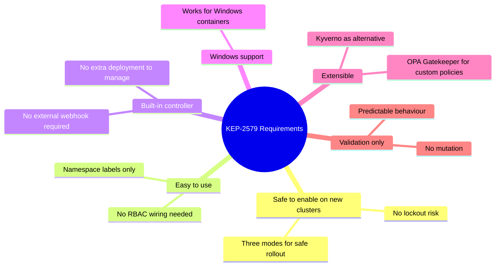
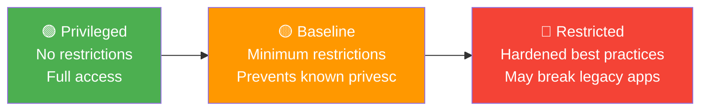
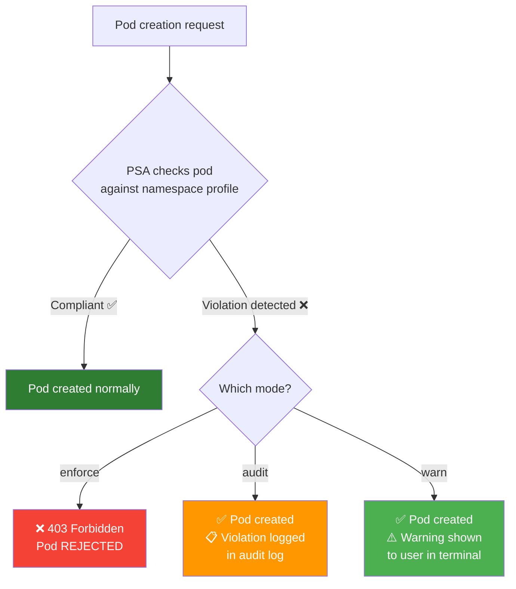
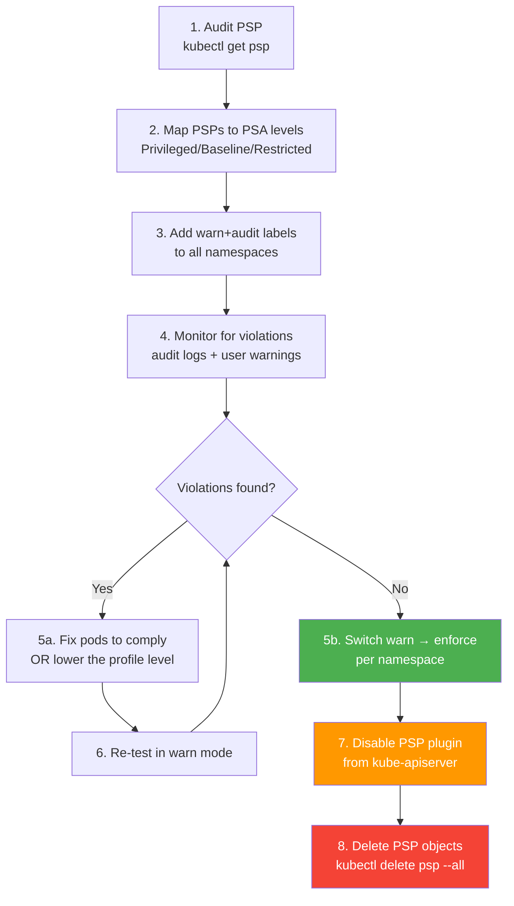
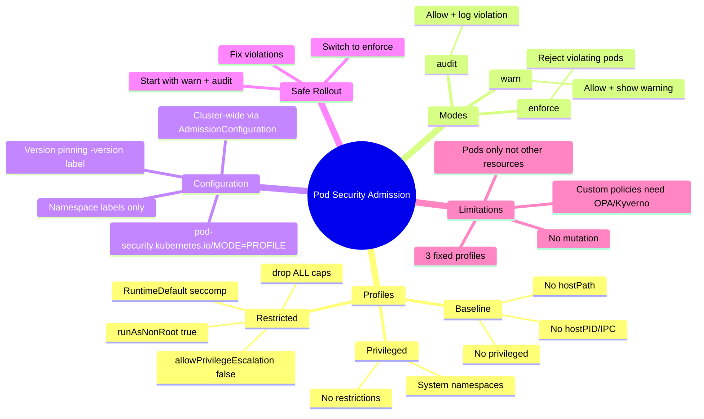

# 5 — Pod Security Admission and Pod Security Standards


---

## Why This Matters

Chapter 4 showed that Pod Security Policies solved the right problem (blocking insecure pod specs at admission time) but solved it in the wrong way — requiring complex RBAC wiring per ServiceAccount, risking cluster lockout, and providing no safe way to test policies before enforcement.

**Pod Security Admission (PSA) + Pod Security Standards (PSS)** are the official, stable replacements introduced in KEP-2579. They rethink the model entirely:

- Instead of custom policy objects, there are **three fixed security levels** (profiles)
- Instead of RBAC wiring, policies are applied via **namespace labels** — one line per namespace
- Instead of binary enforce-or-lockout, there are **three modes** — enforce, audit, warn — letting you test policies safely before locking them in

PSA is **enabled by default** in every Kubernetes cluster since 1.23 (beta) / 1.25 (stable). You do not need to enable any admission plugin — it is already running. For CKS, PSA is the primary pod-level security enforcement mechanism on modern clusters and is heavily tested.

---

## What Is Pod Security Admission?

Pod Security Admission is a **built-in admission controller** (not a webhook, not an external plugin) that enforces the Kubernetes Pod Security Standards at the namespace level.

| Attribute | Detail |
|---|---|
| **Kind** | Built-in admission controller (`PodSecurity`) |
| **Enabled by default** | Yes — since K8s 1.23 (beta), 1.25 (GA) |
| **Configuration** | Namespace labels — no separate objects to create |
| **Can Validate** | Yes — rejects non-compliant pods (enforce mode) |
| **Can Mutate** | **No** — PSA only validates, never mutates |
| **Profiles** | Three fixed levels: privileged / baseline / restricted |
| **Modes** | Three: enforce / audit / warn |
| **Replaces** | Pod Security Policies (removed K8s 1.25) |
| **Extended by** | OPA Gatekeeper, Kyverno, KRAIL for custom policies |

### What PSA Is NOT

| Misconception | Reality |
|---|---|
| "PSA requires configuration to activate" | It is on by default — just add namespace labels |
| "PSA can inject defaults like PSP" | PSA is validate-only — no mutation |
| "PSA replaces all policy engines" | PSA covers pod specs only; OPA/Kyverno handle broader policies |
| "PSA blocks non-pod resources" | PSA only inspects Pod-creating requests |
| "One PSA profile covers everything" | Different namespaces can have different profiles |

---

## The Design Philosophy — KEP-2579

PSA was designed around explicit requirements from KEP-2579:



The deliberate trade-off: PSA is intentionally **less flexible** than PSP. It covers the 80% case (the three standard security levels) well. For the remaining 20% (custom policies, image registry enforcement, label requirements), you use OPA Gatekeeper (Chapters 6–7) or Kyverno alongside PSA.

---

## The Three Pod Security Standards Profiles

Pod Security Standards define three cumulative security levels. Each level is a superset of the restrictions of the level before it.



### Profile 1: Privileged

```yaml
# Effectively no restrictions
# Allows: privileged containers, root user, hostPath volumes,
#         host network/PID/IPC, all capabilities, any seccomp
```

Used for: System namespaces (`kube-system`), infrastructure components (CNI plugins, storage drivers, monitoring agents), trusted operators.

### Profile 2: Baseline

Prevents known privilege escalation vectors while keeping compatibility with most containerized applications.


**Baseline restrictions:**

| Control | Restriction |
|---|---|
| Host Processes (Windows) | `hostProcess: true` disallowed |
| Host Namespaces | `hostPID: true`, `hostIPC: true` disallowed |
| Privileged Containers | `privileged: true` disallowed |
| Capabilities | Only the default Docker set allowed — `NET_ADMIN`, `SYS_ADMIN`, etc. not addable beyond defaults |
| HostPath Volumes | Disallowed |
| Host Ports | Restricted — `hostPort > 0` disallowed |
| AppArmor | Only `runtime/default` or `localhost/*` profiles (if set) |
| SELinux | `type` must be in allowed set; `user` and `role` must be unset |
| `/proc` Mount Type | Only `Default` procMount allowed |
| Seccomp | Not restricted at baseline (anything or nothing) |
| Sysctls | Only safe sysctls: `kernel.shm_rmid_forced`, `net.ipv4.*`, `net.ipv6.*`, `net.core.somaxconn` |

Used for: General workloads in non-kube-system namespaces, most standard applications.

### Profile 3: Restricted

Implements current pod hardening best practices. May require application changes.


**Restricted = Baseline PLUS:**

| Control | Restriction |
|---|---|
| Volume Types | Only `configMap`, `csi`, `downwardAPI`, `emptyDir`, `ephemeral`, `persistentVolumeClaim`, `projected`, `secret` |
| Privilege Escalation | `allowPrivilegeEscalation: false` **required** |
| Running as Non-Root | `runAsNonRoot: true` **required** |
| RunAsUser | UID must not be 0 |
| Seccomp | Must be `RuntimeDefault` or `Localhost` — `Unconfined` disallowed |
| Capabilities | `drop: [ALL]` **required**; only `NET_BIND_SERVICE` may be added |

**Pod manifest that passes `restricted`:**

```yaml
apiVersion: v1
kind: Pod
metadata:
  name: compliant-pod
spec:
  securityContext:
    runAsNonRoot: true
    runAsUser: 1000
    seccompProfile:
      type: RuntimeDefault       # ← required for restricted
  containers:
  - name: app
    image: nginx:1.25
    securityContext:
      allowPrivilegeEscalation: false   # ← required for restricted
      runAsNonRoot: true                # ← required for restricted
      capabilities:
        drop: ["ALL"]                  # ← required for restricted
      # seccompProfile can also be set at container level
```

---

## The Three Enforcement Modes

Each profile can be applied in any of three modes independently:

| Mode | What Happens on Violation | Use Case |
|---|---|---|
| **enforce** | Pod creation **rejected** — 403 Forbidden | Production enforcement |
| **audit** | Pod creation **allowed** but violation logged in audit log | Monitoring without blocking |
| **warn** | Pod creation **allowed** but user sees a **warning** in terminal | Developer awareness / dry-run testing |



### Modes Can Be Combined Per Namespace

A single namespace can have all three modes active simultaneously with different profiles:

```bash
# Enforce baseline (block obviously bad pods)
# Warn on restricted (alert devs to gaps)
# Audit restricted (track what would be blocked)
kubectl label ns production \
  pod-security.kubernetes.io/enforce=baseline \
  pod-security.kubernetes.io/warn=restricted \
  pod-security.kubernetes.io/audit=restricted
```

This is the recommended **safe migration strategy**: start with audit/warn, then move to enforce once you've confirmed no violations.

---

## Applying PSA — Namespace Labels

PSA configuration is entirely via namespace labels. No CRDs, no admission plugin flags, no RBAC:

### Label Format

```
pod-security.kubernetes.io/<MODE>=<PROFILE>
pod-security.kubernetes.io/<MODE>-version=<VERSION>
```

### Basic Examples

```bash
# Enforce restricted policy on 'payroll' namespace
kubectl label ns payroll \
  pod-security.kubernetes.io/enforce=restricted

# Enforce baseline policy on 'hr' namespace
kubectl label ns hr \
  pod-security.kubernetes.io/enforce=baseline

# Warn-only for restricted on 'dev' namespace (safe for experimentation)
kubectl label ns dev \
  pod-security.kubernetes.io/warn=restricted
```

### Multi-Mode Configuration Table

| Namespace | Mode | Profile | Effect |
|---|---|---|---|
| `payroll` | enforce | restricted | Pods must strictly comply — violations rejected |
| `hr` | enforce | baseline | Standard security — known privesc blocked |
| `dev` | warn | restricted | Developers see warnings but pods still deploy |

```yaml
# Applying via YAML (preferred for GitOps)
apiVersion: v1
kind: Namespace
metadata:
  name: payroll
  labels:
    pod-security.kubernetes.io/enforce: restricted
    pod-security.kubernetes.io/enforce-version: v1.29
    pod-security.kubernetes.io/audit: restricted
    pod-security.kubernetes.io/audit-version: v1.29
    pod-security.kubernetes.io/warn: restricted
    pod-security.kubernetes.io/warn-version: v1.29
```

### The `-version` Label

```bash
pod-security.kubernetes.io/enforce-version=v1.29
```

Pins the policy check to a specific Kubernetes version's definition of the profile. This ensures that upgrading Kubernetes doesn't silently tighten policies and break existing workloads.

```bash
# Use 'latest' to always use the current version's policy definition
pod-security.kubernetes.io/enforce-version=latest

# Or pin to a specific version for stability
pod-security.kubernetes.io/enforce-version=v1.29
```

---

## Verifying PSA is Active

```bash
# Confirm PodSecurity admission controller is enabled
kubectl exec -n kube-system kube-apiserver-controlplane -it -- \
  kube-apiserver -h | grep enable-admission-plugins

# Output should include: ...,PodSecurity,...

# List namespace labels to see active policies
kubectl get ns payroll --show-labels

# Describe namespace to see all labels
kubectl describe ns payroll
# Labels: pod-security.kubernetes.io/enforce=restricted
```

---

## PSA Behaviour in Practice

### Enforce Mode — Pod Rejected

```bash
kubectl label ns test pod-security.kubernetes.io/enforce=restricted

# This pod fails restricted: privileged=true, no allowPrivilegeEscalation=false
kubectl run bad-pod --image=nginx \
  --overrides='{"spec":{"containers":[{"name":"c","image":"nginx","securityContext":{"privileged":true}}]}}' \
  -n test

# Error from server (Forbidden): pods "bad-pod" is forbidden:
# violates PodSecurity "restricted:latest":
#   privileged (container "c" must not set securityContext.privileged=true),
#   allowPrivilegeEscalation != false (container "c" must set
#   securityContext.allowPrivilegeEscalation=false),
#   unrestricted capabilities (container "c" must set
#   securityContext.capabilities.drop=["ALL"]),
#   runAsNonRoot != true (pod or container "c" must set
#   securityContext.runAsNonRoot=true),
#   seccompProfile (pod or container "c" must set
#   securityContext.seccompProfile.type to "RuntimeDefault" or "Localhost")
```

Note: the error message **lists all violations** — not just the first one. This is a significant improvement over PSP.

### Warn Mode — Pod Allowed but Warning Shown

```bash
kubectl label ns dev pod-security.kubernetes.io/warn=restricted

kubectl run my-app --image=nginx -n dev
# Warning: would violate PodSecurity "restricted:latest":
#   allowPrivilegeEscalation != false (container "my-app" must set ...)
#   ...
# pod/my-app created   ← Pod IS created despite the warning
```

### Audit Mode — Pod Allowed, Violation Logged

```bash
kubectl label ns staging pod-security.kubernetes.io/audit=restricted

kubectl run my-app --image=nginx -n staging
# pod/my-app created  ← No warning shown to user

# But in the audit log:
# {"kind":"Event","apiVersion":"audit.k8s.io/v1",
#  "annotations":{"pod-security.kubernetes.io/audit-violations":
#  "would violate PodSecurity \"restricted:latest\"..."}}
```

---

## Cluster-Wide Default Configuration

For cluster-wide defaults (applying a baseline policy to all namespaces unless overridden), configure the `PodSecurity` admission controller via the `AdmissionConfiguration` file:

```yaml
# /etc/kubernetes/admission-configuration.yaml
apiVersion: apiserver.config.k8s.io/v1
kind: AdmissionConfiguration
plugins:
- name: PodSecurity
  configuration:
    apiVersion: pod-security.admission.config.k8s.io/v1
    kind: PodSecurityConfiguration
    defaults:
      enforce: "baseline"
      enforce-version: "latest"
      audit: "restricted"
      audit-version: "latest"
      warn: "restricted"
      warn-version: "latest"
    exemptions:
      usernames: []
      runtimeClasses: []
      namespaces:
      - kube-system       # ← exempt system namespaces from enforcement
      - monitoring
      - logging
```

Reference this file in the kube-apiserver manifest:

```yaml
# /etc/kubernetes/manifests/kube-apiserver.yaml
- --admission-control-config-file=/etc/kubernetes/admission-configuration.yaml
```

### Namespace Exemptions

Critical namespaces (`kube-system`, CNI, monitoring) need exemption from restrictive policies because their components legitimately need privileged access:

```yaml
exemptions:
  namespaces:
  - kube-system      # CNI, kube-proxy, etc.
  - kube-public
  - kube-node-lease
  - monitoring       # Prometheus node-exporter needs host access
  - logging          # Fluentd/Filebeat need hostPath volumes
```

---

## Safe Migration Path from PSP to PSA



**Step-by-step commands:**

```bash
# Step 1: List existing PSPs
kubectl get psp -o wide

# Step 2: For each namespace, add warn labels first (safe — doesn't block anything)
kubectl label ns production \
  pod-security.kubernetes.io/warn=restricted \
  pod-security.kubernetes.io/audit=restricted

# Step 3: Wait and check audit logs for violations
kubectl logs -n kube-system kube-apiserver-controlplane | grep "pod-security"

# Step 4: Fix non-compliant pods; then upgrade to enforce
kubectl label ns production \
  pod-security.kubernetes.io/enforce=restricted \
  --overwrite

# Step 5: Disable PSP admission plugin from kube-apiserver manifest
# Remove: --enable-admission-plugins=...,PodSecurityPolicy,...

# Step 6: Clean up PSP objects
kubectl delete psp --all
kubectl delete clusterrole -l related-to-psp=true
kubectl delete clusterrolebinding -l related-to-psp=true
```

---

## PSA vs PSP — Full Comparison

| Feature | PSP | PSA |
|---|---|---|
| **API Object** | `PodSecurityPolicy` CRD | Namespace labels only |
| **RBAC Required** | Yes — SA needs `use` verb | No |
| **Profiles** | Custom-defined | 3 fixed: privileged/baseline/restricted |
| **Mutation** | Yes (injects defaults) | No (validate only) |
| **Modes** | Enforce only | enforce / audit / warn |
| **Safe rollout** | No — enable = immediate block risk | Yes — use warn/audit first |
| **Per-namespace config** | Via RBAC bindings | Via namespace labels |
| **System namespace protection** | Manual privileged PSP needed | Built-in exemptions |
| **Error messages** | Opaque — first violation only | Clear — all violations listed |
| **Kubernetes version** | Removed 1.25 | Stable since 1.25 |
| **Custom policies** | Partial — via PSP fields | Delegate to OPA/Kyverno |
| **Lockout risk** | High | Very low |

---

## PSA vs OPA Gatekeeper — When to Use Which

PSA and OPA Gatekeeper are **complementary**, not alternatives:

| Scenario | PSA | OPA Gatekeeper |
|---|---|---|
| Block privileged containers | ✅ Use PSA (restricted) | ✅ Can also do this |
| Block root user (UID 0) | ✅ PSA restricted | ✅ Can also do this |
| Enforce image registry whitelist | ❌ PSA cannot | ✅ OPA does this |
| Require specific labels on all objects | ❌ PSA cannot | ✅ OPA does this |
| Block HostPath volumes | ✅ PSA restricted | ✅ Can also do this |
| Custom UID ranges | ❌ PSA cannot | ✅ OPA does this |
| Enforce resource limits | ❌ PSA cannot | ✅ OPA does this |
| Block non-Pod resources (Deployments, etc.) | ❌ PSA only inspects Pods | ✅ OPA inspects any resource |

**Recommended approach:** PSA as the baseline pod security layer + OPA/Kyverno for custom policies.

---

## Real-World Scenarios

### Scenario 1 — Enforcing Namespace-Level Security Tiers

**Goal:** A company has three environment types: production (strict), staging (warn), dev (permissive).

```bash
# Production — enforce restricted, no exceptions
kubectl label ns production \
  pod-security.kubernetes.io/enforce=restricted \
  pod-security.kubernetes.io/enforce-version=v1.29

# Staging — warn restricted (developers see issues, nothing blocked)
kubectl label ns staging \
  pod-security.kubernetes.io/warn=restricted \
  pod-security.kubernetes.io/audit=restricted

# Dev — baseline enforce only (prevent obviously bad things)
kubectl label ns development \
  pod-security.kubernetes.io/enforce=baseline

# Kube-system — exempt (done via admission config, not label)
```

**Verify:**

```bash
kubectl get ns -o json | jq '.items[] | 
  {name: .metadata.name, 
   labels: (.metadata.labels | with_entries(select(.key | startswith("pod-security"))))}'
```

### Scenario 2 — Diagnosing a Restricted Violation

**Symptom:** A developer's pod keeps failing in the `payroll` namespace:

```
Error from server (Forbidden): pods "payment-api" is forbidden:
violates PodSecurity "restricted:latest":
  allowPrivilegeEscalation != false (container "payment-api" must set
  securityContext.allowPrivilegeEscalation=false),
  runAsNonRoot != true (pod or container "payment-api" must set
  securityContext.runAsNonRoot=true),
  seccompProfile (pod or container "payment-api" must set
  securityContext.seccompProfile.type to "RuntimeDefault" or "Localhost")
```

**Fix — add the required security context fields:**

```yaml
# Before (fails restricted)
containers:
- name: payment-api
  image: registry.company.com/payment-api:v2.1

# After (passes restricted)
containers:
- name: payment-api
  image: registry.company.com/payment-api:v2.1
  securityContext:
    allowPrivilegeEscalation: false       # ← required
    runAsNonRoot: true                     # ← required
    runAsUser: 1000                        # ← non-root UID
    capabilities:
      drop: ["ALL"]                        # ← required
    seccompProfile:
      type: RuntimeDefault                 # ← required
```

### Scenario 3 — Progressive Rollout to Restricted

**Goal:** Migrate a 50-namespace cluster to `restricted` without disrupting running workloads.

```bash
# Phase 1: Add warn+audit to all namespaces (safe — no pods blocked)
for ns in $(kubectl get ns -o jsonpath='{.items[*].metadata.name}'); do
  kubectl label ns "$ns" \
    pod-security.kubernetes.io/warn=restricted \
    pod-security.kubernetes.io/audit=restricted \
    --overwrite 2>/dev/null || true
done

# Phase 2: Check audit log for violations over the next week
kubectl logs -n kube-system kube-apiserver-controlplane \
  | grep "pod-security" | jq '.'

# Phase 3: Fix non-compliant pods namespace by namespace

# Phase 4: Graduate each namespace to enforce as it becomes compliant
kubectl label ns payroll \
  pod-security.kubernetes.io/enforce=restricted \
  --overwrite

# Phase 5: Pin the version after all namespaces are graduated
kubectl label ns payroll \
  pod-security.kubernetes.io/enforce-version=v1.29 \
  --overwrite
```

---

## Common Mistakes

| Mistake | Consequence | Fix |
|---|---|---|
| Labelling `kube-system` with `restricted` enforce | kube-proxy, CoreDNS, CNI pods all fail — cluster breaks | Always exempt system namespaces via AdmissionConfiguration |
| Using `enforce` without testing `warn` first | Existing pods fail immediately — production incident | Use warn/audit for at least a week before switching to enforce |
| Forgetting PSA is validate-only | Assuming PSA injected security context defaults like PSP did | PSA never mutates — all required fields must be in the pod spec explicitly |
| Not pinning `-version` label | Kubernetes upgrade silently tightens policy — pods start failing | Pin to `pod-security.kubernetes.io/enforce-version=v1.29` |
| Thinking PSA covers all resources | A non-compliant Deployment is allowed — only the resulting Pods are blocked | PSA intercepts Pod creation; use OPA/Kyverno for Deployment-level enforcement |
| Mixing up modes and profiles | Wrong label key → policy silently not applied | Label key is `pod-security.kubernetes.io/<MODE>`, value is the profile name |
| Removing warn after adding enforce | Lose visibility into future violations | Keep warn/audit alongside enforce for ongoing monitoring |

---

## Quick Reference

### Label Syntax

```bash
# Single mode
kubectl label ns <namespace> pod-security.kubernetes.io/<mode>=<profile>

# With version pin
kubectl label ns <namespace> \
  pod-security.kubernetes.io/<mode>=<profile> \
  pod-security.kubernetes.io/<mode>-version=<k8s-version>

# All three modes
kubectl label ns <namespace> \
  pod-security.kubernetes.io/enforce=restricted \
  pod-security.kubernetes.io/audit=restricted \
  pod-security.kubernetes.io/warn=restricted

# Modes: enforce | audit | warn
# Profiles: privileged | baseline | restricted
# Version: v1.25 | v1.26 | v1.27 | v1.28 | v1.29 | latest
```

### Profile Restriction Summary

```
privileged  → No restrictions
              Use for: kube-system, CNI, storage, trusted infra

baseline    → Blocks:
              - privileged: true
              - hostPID/hostIPC: true
              - hostPath volumes
              - dangerous capabilities (NET_ADMIN, SYS_ADMIN, etc.)
              Use for: general workloads

restricted  → Baseline PLUS blocks:
              - allowPrivilegeEscalation not explicitly false
              - runAsNonRoot not explicitly true
              - runAsUser: 0
              - seccomp: Unconfined
              - capabilities not dropped (ALL must be dropped)
              - non-allowlisted volume types
              Use for: security-sensitive workloads
```

### Required Fields for Restricted Compliance

```yaml
# Minimum pod spec to pass 'restricted' profile
spec:
  securityContext:
    runAsNonRoot: true
    runAsUser: 1000            # any non-zero UID
    seccompProfile:
      type: RuntimeDefault
  containers:
  - name: app
    image: myimage:tag
    securityContext:
      allowPrivilegeEscalation: false
      runAsNonRoot: true
      capabilities:
        drop: ["ALL"]
      # Optional (can inherit from pod level):
      seccompProfile:
        type: RuntimeDefault
```

### Key Commands

```bash
# Verify PSA is enabled
kubectl exec -n kube-system kube-apiserver-controlplane -- \
  kube-apiserver -h | grep enable-admission-plugins

# Label namespace (enforce)
kubectl label ns myns pod-security.kubernetes.io/enforce=restricted

# Label namespace (warn + audit for testing)
kubectl label ns myns \
  pod-security.kubernetes.io/warn=restricted \
  pod-security.kubernetes.io/audit=restricted

# Remove a label
kubectl label ns myns pod-security.kubernetes.io/warn-

# List all namespaces with PSA labels
kubectl get ns --show-labels | grep "pod-security"

# Check what policies apply to a namespace
kubectl get ns myns -o jsonpath='{.metadata.labels}' | jq 'with_entries(select(.key | startswith("pod-security")))'

# Dry-run a pod against namespace policy (simulate enforce)
kubectl run test --image=nginx -n myns --dry-run=server
```

---

## CKS Exam Tips

> 💡 **PSA is the default — no plugin needed.** Unlike PSP, you don't enable PSA. It's already running. Just add namespace labels.

> 💡 **Label key format is exact.** `pod-security.kubernetes.io/enforce=restricted` — know it cold. The mode is the label key suffix, the profile is the value.

> 💡 **Three modes, three profiles — memorise the matrix.** Modes: enforce/audit/warn. Profiles: privileged/baseline/restricted. They combine independently.

> 💡 **Restricted requires five things:** `allowPrivilegeEscalation: false`, `runAsNonRoot: true`, `capabilities.drop: [ALL]`, `seccompProfile.type: RuntimeDefault`, non-root UID. Missing any one will fail.

> 💡 **warn before enforce.** In exam scenarios asking you to implement a policy safely without disrupting existing workloads — use `warn` first, then switch to `enforce`.

> 💡 **PSA is Pod-only.** It only intercepts requests that create Pods (directly or via controllers). Deployments, Services, ConfigMaps — not inspected by PSA.

> 💡 **kube-system needs exemption.** If a question asks you to apply a cluster-wide policy, always exempt `kube-system` either via AdmissionConfiguration or by not labelling it.

> 💡 **Violation messages list all issues.** Unlike PSP which often gave one error, PSA tells you every field that needs to change. Use this in exam debugging.

```yaml
# CKS exam pattern — quickly apply PSA to a namespace
# Enforce restricted (if confident no existing violations):
kubectl label ns secure-ns pod-security.kubernetes.io/enforce=restricted

# Safe rollout pattern (if unsure about existing workloads):
kubectl label ns secure-ns \
  pod-security.kubernetes.io/warn=restricted \
  pod-security.kubernetes.io/audit=restricted
# (upgrade to enforce after verifying no violations)
```

---

## Summary

Pod Security Admission with Pod Security Standards is Kubernetes' built-in, stable solution for pod-level security enforcement. It solves PSP's key failure modes — complex RBAC, lockout risk, silent mutation — by reducing pod security configuration to namespace labels and three well-defined security levels.

The three profiles (privileged → baseline → restricted) provide clear, predictable expectations. The three modes (enforce → audit → warn) enable safe progressive rollout. The combination means you can move from "no pod security" to "full restriction" without ever causing a production outage.

PSA covers the pod specification layer. For policies beyond pod specs — image registries, resource limits, label enforcement, multi-resource policies — use OPA Gatekeeper (Chapter 6–7) or Kyverno alongside PSA.



---

## What's Next

**Chapter 6 — Open Policy Agent (OPA)** introduces the policy engine that fills the gaps PSA leaves. OPA is a general-purpose policy engine using the Rego language that can enforce arbitrary rules on any Kubernetes resource — image registries, required labels, resource limits, namespace constraints, and much more. Understanding OPA is critical for CKS because it represents the industry-standard approach to fine-grained Kubernetes policy enforcement that goes beyond what PSA can express.

---

*Chapter 5 of 30 — Microservice Vulnerabilities | Kubernetes Security Study Guide*
