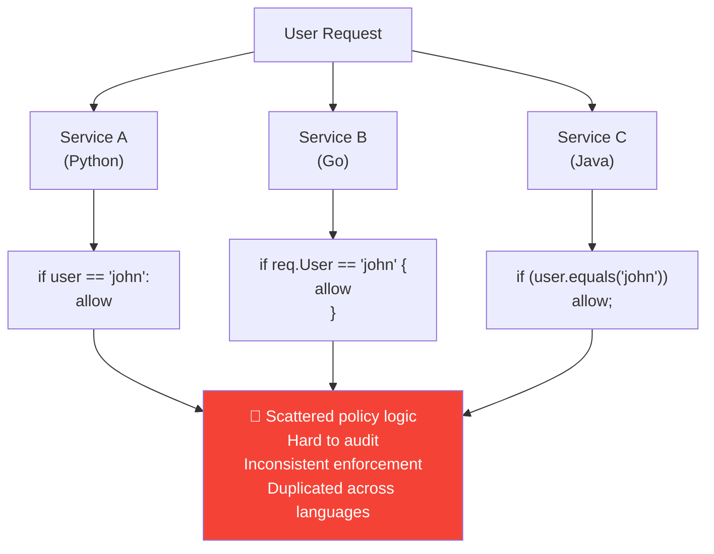
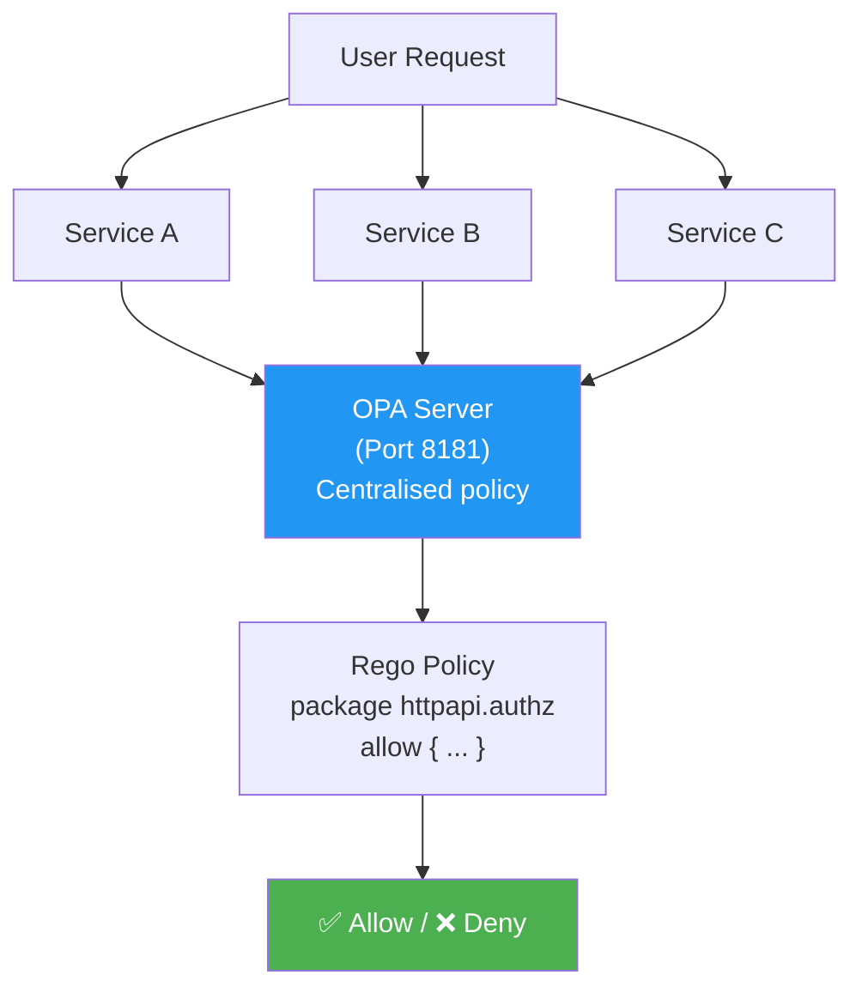
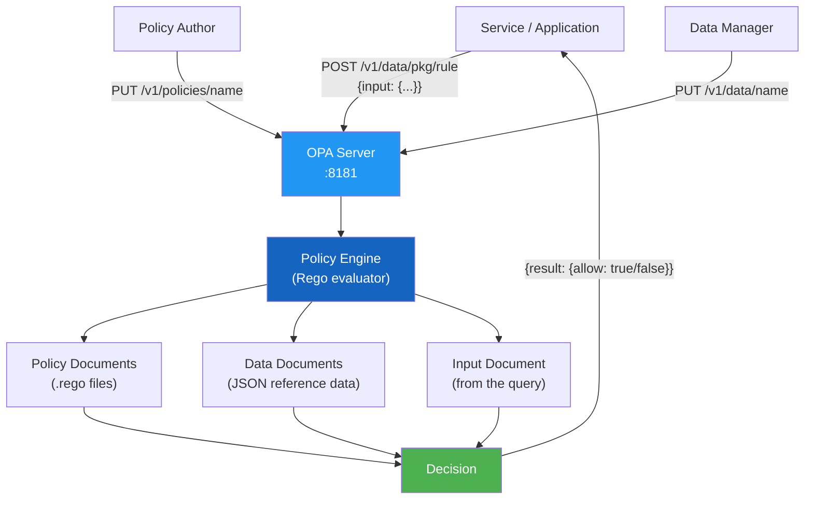
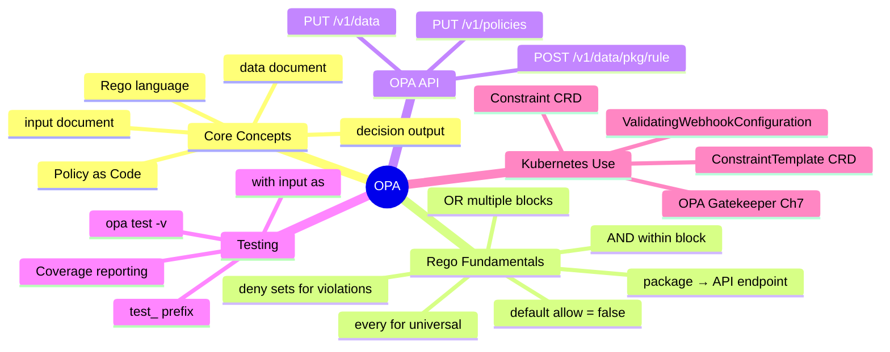

# 6 — Open Policy Agent (OPA)


---

## Why This Matters

Chapters 4 and 5 covered Kubernetes-native pod security mechanisms (PSP → PSA). But both have the same fundamental limitation: they only inspect **Pod specifications**. They cannot answer:

- "Is this image from our approved registry?"
- "Does every Deployment have a `team` label?"
- "Can user Alice delete ConfigMaps in the `finance` namespace?"
- "Is this Ingress exposing an HTTP (not HTTPS) endpoint?"

These are **content-based, cross-resource policies** — and they require a general-purpose policy engine. That engine is **Open Policy Agent (OPA)**.

OPA is a CNCF-graduated, general-purpose policy engine used across the cloud-native ecosystem. In Kubernetes it runs as a validating admission webhook (Chapter 7 covers the Kubernetes integration — OPA Gatekeeper). But OPA's concepts — the **Rego language**, the **input/data model**, the **query API** — are what you must understand first, because Gatekeeper is just OPA packaged for Kubernetes.

For CKS, OPA/Gatekeeper is a frequent topic: writing policies, debugging rejections, and understanding why the engine returns the decisions it does. This chapter gives you the OPA fundamentals you need.

---

## What Is OPA?

Open Policy Agent is a **general-purpose, domain-agnostic policy engine** that decouples policy decisions from application code.

| Attribute | Detail |
|---|---|
| **Full name** | Open Policy Agent |
| **Language** | Rego (REE-go) — a declarative query language |
| **Created by** | Styra (2016), donated to CNCF |
| **CNCF status** | Graduated (2021) |
| **How it runs** | As a standalone daemon (REST API on port 8181) |
| **Input** | Structured JSON (the "input" document) |
| **Output** | Structured JSON (the policy decision) |
| **Policy files** | `.rego` extension |
| **Kubernetes integration** | OPA Gatekeeper (Chapter 7) |
| **Playground** | [play.openpolicyagent.org](https://play.openpolicyagent.org) |

### The Core Problem OPA Solves

Without a centralised policy engine, every service implements its own authorization logic:



With OPA:



Every service asks OPA: *"Should I allow this?"* OPA evaluates the policy and returns a decision. Policy logic lives in one place, in one language (Rego), regardless of what language the services use.

---

## The Authorization Problem — A Progressive Example

### Stage 1: No Authorization

```python
from flask import Flask, request
app = Flask(__name__)

@app.route('/home')
def home():
    return 'Welcome Home!', 200
    # ← Anyone can access this. No checks at all.
```

**Problem:** Any user, authenticated or not, gets access.

### Stage 2: Inline Authorization (Anti-pattern)

```python
@app.route('/home')
def home():
    user = request.args.get("user")
    if user != "john":
        return 'Unauthorized!', 401
    return 'Welcome Home!', 200
```

**Problems:**
- Policy is hardcoded in application code
- Adding users requires a code change and redeployment
- If you have 10 services in 4 languages, you have 10 copies of this logic to maintain
- No audit trail of policy decisions
- No way to test policy without running the application

### Stage 3: OPA-Delegated Authorization (Correct Pattern)

```python
import requests as http

@app.route('/home')
def home():
    user = request.args.get("user")

    # Build the input for OPA
    input_data = {
        "input": {
            "user": user,
            "path": "home",
            "method": request.method
        }
    }

    # Ask OPA for a decision
    opa_response = http.post(
        "http://127.0.0.1:8181/v1/data/httpapi/authz",
        json=input_data
    )

    decision = opa_response.json()["result"]["allow"]

    if not decision:
        return 'Unauthorized!', 401
    return 'Welcome Home!', 200
```

The application no longer makes policy decisions — it only asks OPA. All policy logic lives in Rego.

---

## The Rego Language


Rego is a **declarative query language** inspired by Datalog. It is designed to be:
- **Readable** — policies read like English sentences
- **Composable** — rules build on other rules
- **Safe** — no infinite loops, always terminates
- **Testable** — built-in test framework

### Key Rego Concepts

```mermaid
mindmap
  root((Rego))
    package
      Namespace for rules
      Maps to API endpoint
    import input
      The incoming request data
      JSON document
    default
      Fallback value if no rule matches
      Always define for safety
    Rules
      allow { conditions }
      deny { conditions }
      Multiple bodies = OR
    Conditions
      All lines in a body = AND
      All must be true to fire
    Data
      Static reference data
      Loaded separately
```

### Rego Syntax Fundamentals

```rego
# Package declaration — defines the namespace
# This maps to the API path: /v1/data/httpapi/authz
package httpapi.authz

# Import the input document (the query sent to OPA)
import input

# Default value — returned if no rule matches
# Without this, OPA returns undefined, not false
default allow = false

# A rule — "allow is true IF all conditions in the body hold"
allow {
    input.path == "home"         # condition 1 (AND)
    input.user == "john"         # condition 2 (AND)
    input.method == "GET"        # condition 3 (AND)
}

# Multiple rule bodies = OR (any one block can make allow = true)
allow {
    input.path == "admin"
    input.user == "admin"
}
```

**AND vs OR in Rego:**

```rego
# Lines within a single rule body = AND
# (all must be true for the rule to fire)
allow {
    input.user == "alice"    # AND
    input.path == "reports"  # AND
}

# Multiple rule bodies for the same variable = OR
# (if any body fires, allow = true)
allow {
    input.user == "alice"
}
allow {
    input.user == "bob"
}
# Equivalent to: allow if user is alice OR user is bob
```

### Rego Data Types

```rego
package example

# Boolean
is_admin = true {
    input.user == "admin"
}

# String comparison
allow {
    input.method == "GET"
}

# Array membership — "some" keyword or "in"
allowed_users = ["alice", "bob", "charlie"]

allow {
    input.user == allowed_users[_]   # "_" = any index
}

# Object field access
allow {
    input.user.role == "editor"
    input.resource.namespace == "production"
}

# Set operations
restricted_namespaces := {"kube-system", "kube-public", "monitoring"}

deny {
    restricted_namespaces[input.namespace]   # input.namespace is in the set
}

# String functions
allow {
    startswith(input.image, "registry.company.com/")
}
```

### Variables and Comprehensions

```rego
package policies

# Variable binding — walrus-style with :=
username := input.userInfo.username

# List comprehension — collect all container images
images := [img | img := input.spec.containers[_].image]

# Check all images pass a condition (every item)
allow {
    every img in images {
        startswith(img, "registry.company.com/")
    }
}

# Check if any image fails (exists an item that violates)
deny[msg] {
    container := input.spec.containers[_]
    not startswith(container.image, "registry.company.com/")
    msg := sprintf("Container '%v' uses image from disallowed registry: %v",
                   [container.name, container.image])
}
```

---

## Running OPA

### Install and Start OPA Server

```bash
# Download OPA binary (Linux)
curl -L -o opa \
  https://github.com/open-policy-agent/opa/releases/download/v0.60.0/opa_linux_amd64
chmod 755 ./opa

# Start the OPA server (foreground, port 8181)
./opa run --server
# {"addrs":["0.0.0.0:8181"],"level":"info","msg":"Listening on address."}

# Start with a policy file pre-loaded
./opa run --server example.rego

# Start with a data file and policy file
./opa run --server example.rego data.json
```

> **Default behaviour:** OPA listens on all interfaces (`0.0.0.0:8181`) with no authentication. In production, always run OPA behind a service mesh, or enable OPA's built-in auth. In Kubernetes, OPA runs as an in-cluster pod only accessible to the API server.

### OPA REST API

```bash
# Load a policy
curl -X PUT --data-binary @example.rego \
  http://localhost:8181/v1/policies/example1

# List all policies
curl http://localhost:8181/v1/policies

# Get a specific policy
curl http://localhost:8181/v1/policies/example1

# Delete a policy
curl -X DELETE http://localhost:8181/v1/policies/example1

# Query a decision
curl -X POST http://localhost:8181/v1/data/httpapi/authz \
  -H "Content-Type: application/json" \
  -d '{"input": {"user": "john", "path": "home"}}'
# Response: {"result": {"allow": true}}

# Load static data (reference data)
curl -X PUT http://localhost:8181/v1/data/users \
  -H "Content-Type: application/json" \
  -d '{"john": {"role": "admin"}, "jane": {"role": "viewer"}}'
```

### API Endpoint Mapping

The API endpoint for querying a decision is derived from the package name:

```
package httpapi.authz
         ↓      ↓
/v1/data/httpapi/authz
```

```
package kubernetes.admission
         ↓          ↓
/v1/data/kubernetes/admission
```

---

## A Complete Policy Example

### Scenario: Multi-User Web API

**Reference data** (`users.json`):

```json
{
  "users": {
    "john": {
      "role": "admin",
      "department": "engineering"
    },
    "jane": {
      "role": "viewer",
      "department": "finance"
    },
    "bob": {
      "role": "editor",
      "department": "engineering"
    }
  },
  "paths": {
    "admin": ["admin"],
    "home": ["admin", "viewer", "editor"],
    "reports": ["admin", "viewer"]
  }
}
```

**Policy** (`policy.rego`):

```rego
package httpapi.authz

import input
import data.users
import data.paths

default allow = false

# Allow if the user exists and has the right role for the path
allow {
    user_info := users[input.user]          # Look up user
    allowed_roles := paths[input.path]       # Look up allowed roles
    allowed_roles[_] == user_info.role       # User's role is in allowed list
}

# Deny with a reason (useful for debugging)
deny[reason] {
    not users[input.user]
    reason := sprintf("User '%v' not found", [input.user])
}

deny[reason] {
    user_info := users[input.user]
    allowed_roles := paths[input.path]
    not allowed_roles[_] == user_info.role
    reason := sprintf("User '%v' with role '%v' cannot access path '%v'",
                      [input.user, user_info.role, input.path])
}
```

**Query examples:**

```bash
# john (admin) accessing /home → should allow
curl -X POST http://localhost:8181/v1/data/httpapi/authz \
  -d '{"input": {"user": "john", "path": "home"}}'
# {"result": {"allow": true, "deny": []}}

# jane (viewer) accessing /admin → should deny
curl -X POST http://localhost:8181/v1/data/httpapi/authz \
  -d '{"input": {"user": "jane", "path": "admin"}}'
# {"result": {"allow": false, "deny": ["User 'jane' with role 'viewer' cannot access path 'admin'"]}}

# unknown user → should deny
curl -X POST http://localhost:8181/v1/data/httpapi/authz \
  -d '{"input": {"user": "mallory", "path": "home"}}'
# {"result": {"allow": false, "deny": ["User 'mallory' not found"]}}
```

---

## Testing OPA Policies

OPA has a built-in test framework. Test files use the same `.rego` extension with test rules prefixed `test_`.

```rego
# policy_test.rego
package httpapi.authz

# Test that admin can access /home
test_admin_home_allowed {
    allow with input as {"user": "john", "path": "home"}
}

# Test that viewer cannot access /admin
test_viewer_admin_denied {
    not allow with input as {"user": "jane", "path": "admin"}
}

# Test that admin can access /admin
test_admin_admin_allowed {
    allow with input as {"user": "john", "path": "admin"}
}

# Test unknown user is denied everywhere
test_unknown_user_denied {
    not allow with input as {"user": "mallory", "path": "home"}
}

# Test deny reasons
test_unknown_user_deny_reason {
    count(deny) > 0 with input as {"user": "mallory", "path": "home"}
}
```

Run tests:

```bash
opa test -v policy.rego policy_test.rego

# data.httpapi.authz.test_admin_home_allowed: PASS (1.2ms)
# data.httpapi.authz.test_viewer_admin_denied: PASS (0.8ms)
# data.httpapi.authz.test_admin_admin_allowed: PASS (0.9ms)
# data.httpapi.authz.test_unknown_user_denied: PASS (0.5ms)
# data.httpapi.authz.test_unknown_user_deny_reason: PASS (0.6ms)
# ─────────────────────────────────────────────────────
# PASS: 5/5
```

### Test Coverage

```bash
# Check test coverage — what lines of policy are exercised by tests
opa test --coverage policy.rego policy_test.rego

# Coverage report shows which rules are covered
```

---

## OPA Playground

For interactive experimentation, use [play.openpolicyagent.org](https://play.openpolicyagent.org):

**Policy panel (left):**

```rego
package play

default allow = false

allow {
    input.user == "john"
    input.path == "home"
}
```

**Input panel (right):**

```json
{
  "user": "john",
  "path": "home"
}
```

**Output:**

```json
{
  "allow": true
}
```

The playground supports:
- Real-time evaluation as you type
- Sharing policy links
- Testing with multiple input documents
- Exploring the evaluation trace (how OPA reached its decision)

---

## OPA Architecture



### Three Document Types

| Document | Source | Contents | Example |
|---|---|---|---|
| **Input** | Query caller | Current request to evaluate | `{"user": "john", "path": "home"}` |
| **Data** | Loaded via API or file | Reference data (users, roles, allowlists) | `{"users": {"john": {"role": "admin"}}}` |
| **Policy** | Rego files | Rules that reason over input + data | `allow { input.user == "john" }` |

---

## Real-World Scenarios

### Scenario 1 — Centralised Multi-Service Authorization

**Problem:** A platform has 8 microservices, each with its own auth logic in different languages. Policy updates require deploying all 8 services.

**Solution with OPA:**

```rego
package platform.authz

import input
import data.roles
import data.permissions

default allow = false

# Grant access if user has a role with the required permission
allow {
    user_roles := roles[input.user]
    required_perm := permissions[input.resource][input.action]
    user_roles[_] == required_perm
}
```

Each service simply POSTs to OPA's `/v1/data/platform/authz` — policy changes deploy to OPA only, zero service restarts.

### Scenario 2 — Image Registry Policy

**Problem:** Engineers are accidentally pushing pods with Docker Hub images.

**Rego policy to detect non-approved registries:**

```rego
package registry.policy

import input

approved_registries := {
    "registry.company.com",
    "gcr.io/company-project",
    "ghcr.io/company-org"
}

default allow = false

allow {
    all_images_approved
}

all_images_approved {
    containers := input.spec.containers
    every c in containers {
        approved_image(c.image)
    }
}

approved_image(image) {
    registry := split(image, "/")[0]
    approved_registries[registry]
}

violation[msg] {
    c := input.spec.containers[_]
    not approved_image(c.image)
    msg := sprintf("Image '%v' in container '%v' is not from an approved registry",
                   [c.image, c.name])
}
```

### Scenario 3 — Debugging a Policy Denial

**Symptom:** A service call is denied but the reason isn't clear.

**Debugging with OPA explain:**

```bash
# Query with explain=full to see evaluation trace
curl -X POST "http://localhost:8181/v1/data/httpapi/authz?explain=full" \
  -H "Content-Type: application/json" \
  -d '{"input": {"user": "jane", "path": "admin"}}'

# OPA returns the full evaluation tree showing which conditions failed
```

**Using the playground trace:**

```rego
# Add a debug helper rule
debug[info] {
    info := {
        "user": input.user,
        "user_role": data.users[input.user].role,
        "allowed_roles": data.paths[input.path],
        "decision": allow
    }
}
```

```bash
# Query the debug rule
curl -X POST http://localhost:8181/v1/data/httpapi/authz/debug \
  -d '{"input": {"user": "jane", "path": "admin"}}'
# {"result": [{"allowed_roles": ["admin"], "decision": false,
#              "user": "jane", "user_role": "viewer"}]}
```

---

## Common Mistakes

| Mistake | Consequence | Fix |
|---|---|---|
| No `default allow = false` | OPA returns `undefined` (not false) when no rule matches — applications may treat undefined as allowed | Always define `default allow = false` |
| Confusing AND (within body) and OR (multiple bodies) | Policy logic is wrong — rules fire when they shouldn't | Remember: lines in one block = AND; multiple blocks for same rule = OR |
| Wrong package name → wrong API endpoint | OPA returns 404 — no decision | Package name must match the URL path: `package a.b.c` → `/v1/data/a/b/c` |
| Not loading data before querying | `data.users` is undefined — rules that reference it silently fail | Use `PUT /v1/data/...` to load reference data before policy evaluation |
| OPA open on the network | Any process can read/write policies | Bind to localhost or implement OPA's auth tokens; in K8s, OPA is cluster-internal only |
| Using OPA for authn (not just authz) | OPA does policy decisions — it doesn't verify passwords or tokens | Authentication is still done by your app or an identity provider |
| Not testing policies | Silent policy logic errors make it to production | Write `test_` prefixed rules and run `opa test` in CI |

---

## Quick Reference

### OPA Server Commands

```bash
# Start server
opa run --server

# Start with files
opa run --server policy.rego data.json

# Start on specific address
opa run --server --addr 127.0.0.1:8181

# Evaluate a query from command line (no server)
opa eval -d policy.rego -i input.json "data.httpapi.authz.allow"

# Run tests
opa test policy.rego policy_test.rego

# Run tests verbosely
opa test -v policy.rego policy_test.rego

# Format Rego file
opa fmt policy.rego

# Check policy for syntax errors
opa check policy.rego
```

### OPA API Endpoints

```bash
# Policies
PUT    /v1/policies/<id>       # Create/update policy
GET    /v1/policies            # List all policies
GET    /v1/policies/<id>       # Get policy
DELETE /v1/policies/<id>       # Delete policy

# Data
PUT    /v1/data/<path>         # Create/update data document
GET    /v1/data/<path>         # Get data document
PATCH  /v1/data/<path>         # Patch data document
DELETE /v1/data/<path>         # Delete data document

# Query (make a decision)
POST   /v1/data/<package/rule> # Evaluate rule with input
GET    /v1/data/<package/rule> # Evaluate rule (no input)

# Ad-hoc query
POST   /v1/query               # Run arbitrary Rego query
```

### Rego Cheat Sheet

```rego
package my.package

import input

# Default
default allow = false

# Simple condition
allow { input.user == "admin" }

# AND (multiple conditions in one block)
allow {
    input.user == "alice"
    input.method == "GET"
}

# OR (multiple blocks)
allow { input.user == "alice" }
allow { input.user == "bob" }

# Array membership
allow { input.user == ["alice","bob","charlie"][_] }

# Set membership
admins := {"alice", "bob"}
allow { admins[input.user] }

# String functions
allow { startswith(input.image, "gcr.io/") }
allow { contains(input.path, "/api/v1/") }

# Negation
deny { not input.user }

# Comprehension — collect violating containers
violations[msg] {
    c := input.spec.containers[_]
    not startswith(c.image, "approved.io/")
    msg := sprintf("Bad image: %v", [c.image])
}

# Every (all must satisfy)
allow {
    every c in input.spec.containers {
        startswith(c.image, "approved.io/")
    }
}

# Variable binding
allow {
    role := data.users[input.user].role
    role == "admin"
}

# sprintf formatting
msg := sprintf("User %v denied access to %v", [input.user, input.path])
```

---

## CKS Exam Tips

> 💡 **OPA in Kubernetes = OPA Gatekeeper** (Chapter 7). The CKS exam tests Gatekeeper specifically, but you need the Rego fundamentals from this chapter to write and debug ConstraintTemplates.

> 💡 **`default allow = false` is mandatory.** Never write a policy without it. OPA returns `undefined` (not `false`) if no rule matches and there's no default — many apps treat undefined as allowed.

> 💡 **Package name → API endpoint mapping.** `package a.b.c` is queried at `/v1/data/a/b/c`. Know this to load and test policies correctly.

> 💡 **AND = lines in one block; OR = multiple blocks.** This is the most common source of Rego logic errors. Internalize it with examples.

> 💡 **`opa test -v`** is your debugging tool. Write test cases for every rule to verify your policy before deploying.

> 💡 **OPA is not authn** — it is purely authz. It takes input and returns a decision. The application/webhook still owns authentication.

> 💡 **The Rego playground** at [play.openpolicyagent.org](https://play.openpolicyagent.org) is allowed during the CKS exam (it's a public site). Use it to test Rego logic if you're unsure.

```rego
# CKS exam pattern — image registry enforcement skeleton
package k8s.admission

import input

default allow = false

allow {
    not deny[_]    # allow if no denials
}

deny[msg] {
    c := input.request.object.spec.containers[_]
    not startswith(c.image, "registry.company.com/")
    msg := sprintf("Image '%v' not from approved registry", [c.image])
}
```

---

## Summary

Open Policy Agent is the industry-standard solution for centralised, language-agnostic policy enforcement. Its core model is simple: applications send a JSON **input** document to OPA, OPA evaluates **Rego policies** against that input (plus any loaded **data**), and returns a structured JSON decision.

The key Rego concepts to master:
- **package** — namespace that maps to the API endpoint
- **default** — always define a safe fallback
- **AND** (lines within a block) vs **OR** (multiple blocks)
- **import input** — access to the query document
- **import data** — access to reference data loaded separately
- **violation/deny sets** — collect all violations with messages
- **every** — universal quantification (all items must satisfy)

OPA as a standalone server is the foundation. Chapter 7 shows how OPA Gatekeeper packages this for Kubernetes — using CRDs (`ConstraintTemplate`, `Constraint`) instead of raw REST API calls, and running as a validating admission webhook that the API server calls automatically for every resource operation.



---

## What's Next

**Chapter 7 — OPA in Kubernetes** covers OPA Gatekeeper — the Kubernetes-native packaging of OPA. Gatekeeper installs as a set of CRDs and a validating admission webhook. You write `ConstraintTemplate` objects (which contain Rego policies) and `Constraint` objects (which instantiate those templates for specific resources and namespaces). This is the production mechanism for enforcing arbitrary custom policies in a Kubernetes cluster — and it is the exam-critical application of everything in this chapter.

---

*Chapter 6 of 30 — Microservice Vulnerabilities | Kubernetes Security Study Guide*
