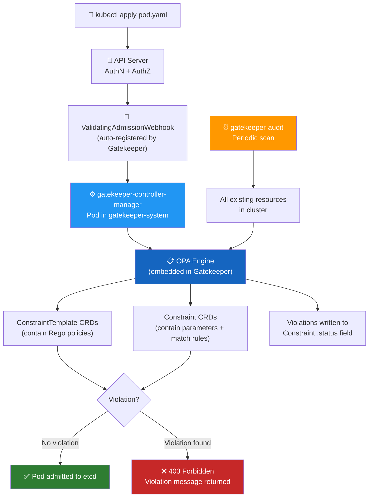
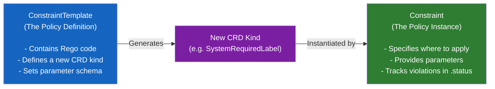
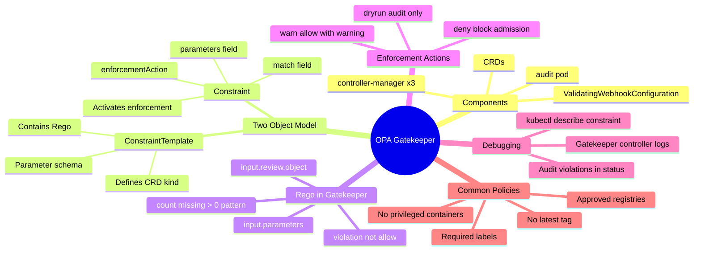

# 7 — OPA in Kubernetes (Gatekeeper)


---

## Why This Matters

Chapter 6 introduced OPA as a general-purpose policy engine with a REST API. Running raw OPA in Kubernetes is possible but cumbersome — you'd need to manually deploy OPA, register a `ValidatingWebhookConfiguration`, write API glue code, and manage policy storage separately. Every policy change requires touching multiple Kubernetes objects.

**OPA Gatekeeper** solves this by packaging OPA as a first-class Kubernetes citizen:

- Policies are **Kubernetes CRDs** — you `kubectl apply` them like any other resource
- The webhook is **automatically registered** — no manual webhook configuration
- Policies are **parameterised** via separate Constraint objects — one template, many instances
- An **audit controller** continuously scans existing resources for violations, not just new ones
- Policy violations appear as **Kubernetes events and status fields** — visible via `kubectl describe`

For CKS, Gatekeeper is the exam-standard implementation of OPA in Kubernetes. You will be expected to understand the `ConstraintTemplate` → `Constraint` relationship, write Rego violation rules, and debug policy rejections.

---

## What Is OPA Gatekeeper?

OPA Gatekeeper is a **Kubernetes-native policy controller** that integrates OPA with the Kubernetes admission webhook system using the OPA Constraint Framework.

| Attribute | Detail |
|---|---|
| **Project** | [github.com/open-policy-agent/gatekeeper](https://github.com/open-policy-agent/gatekeeper) |
| **How it installs** | A set of CRDs + Deployments + ValidatingWebhookConfiguration |
| **Namespace** | `gatekeeper-system` |
| **Components** | `gatekeeper-controller-manager` (3 replicas) + `gatekeeper-audit` (1 replica) |
| **Policy objects** | `ConstraintTemplate` (the Rego + CRD schema) + `Constraint` (the instance) |
| **Webhook type** | `ValidatingAdmissionWebhook` — Gatekeeper validates but also optionally mutates |
| **Audit** | Periodically re-evaluates ALL existing resources against all constraints |
| **Compared to raw OPA** | CRD-based, no manual webhook registration, parameterised, auditable |

### Gatekeeper vs Raw OPA

| Feature | Raw OPA | OPA Gatekeeper |
|---|---|---|
| Policy storage | OPA REST API (`PUT /v1/policies`) | Kubernetes CRD (`ConstraintTemplate`) |
| Webhook setup | Manual `ValidatingWebhookConfiguration` | Auto-registered on install |
| Parameterisation | Hard-coded in Rego | `Constraint` object passes `input.parameters` |
| Audit of existing resources | ❌ None | ✅ `gatekeeper-audit` controller |
| Policy sharing | Raw Rego files | Published CRDs via OPA Policy Library |
| Violation visibility | OPA logs | `kubectl describe constraint` → status field |
| Kubernetes native | ❌ External server | ✅ First-class CRDs |

---

## How Gatekeeper Works — The Full Pipeline



---

## Installing OPA Gatekeeper

```bash
# Install from the official release manifest
kubectl apply -f https://raw.githubusercontent.com/open-policy-agent/gatekeeper/v3.14.0/deploy/gatekeeper.yaml

# Verify all components are running
kubectl get all -n gatekeeper-system
```

Expected output:

```
NAME                                                    READY   STATUS    RESTARTS   AGE
pod/gatekeeper-audit-6699999786d-6n8xt                  1/1     Running   0          31s
pod/gatekeeper-controller-manager-854f95df4f-dbhp7      1/1     Running   0          31s
pod/gatekeeper-controller-manager-854f95df4f-k96kj      1/1     Running   0          31s
pod/gatekeeper-controller-manager-854f95df4f-zfnbw      1/1     Running   0          31s

NAME                                   TYPE        CLUSTER-IP      PORT(S)    AGE
service/gatekeeper-webhook-service     ClusterIP   172.20.60.127   443/TCP    31s

NAME                                          READY   UP-TO-DATE   AVAILABLE
deployment.apps/gatekeeper-audit              1/1     1            1
deployment.apps/gatekeeper-controller-manager 3/3     3            3
```

What Gatekeeper installs automatically:

```bash
# Verify the webhook was auto-registered
kubectl get validatingwebhookconfigurations
# NAME                                     WEBHOOKS   AGE
# gatekeeper-validating-webhook-configuration   2     31s

# Verify the CRDs
kubectl get crd | grep gatekeeper
# configs.config.gatekeeper.sh
# constraintpodstatuses.status.gatekeeper.sh
# constrainttemplates.templates.gatekeeper.sh
# ...
```

---

## The Two-Object Model: ConstraintTemplate + Constraint

The central concept of OPA Gatekeeper is the separation of **policy logic** from **policy configuration**:



| Object | Role | API Group | Who writes it |
|---|---|---|---|
| `ConstraintTemplate` | Policy library — defines the Rego + CRD schema | `templates.gatekeeper.sh/v1` | Platform/security team |
| `Constraint` | Policy instance — where/how to apply, with params | `constraints.gatekeeper.sh/v1beta1` | Cluster admin / team lead |

---

## The OPA Constraint Framework


The framework answers three questions for every policy:

1. **What is required?** — The Rego logic in the ConstraintTemplate
2. **Where is it enforced?** — The `match` field in the Constraint
3. **What parameters apply?** — The `parameters` field in the Constraint, passed as `input.parameters` in Rego

---

## Step 1: Writing the ConstraintTemplate

The `ConstraintTemplate` contains two things: the Rego policy and the CRD schema definition for the new `Constraint` kind it creates.

### Anatomy of a ConstraintTemplate

```yaml
apiVersion: templates.gatekeeper.sh/v1
kind: ConstraintTemplate
metadata:
  name: systemrequiredlabels           # ← Must match spec.crd.spec.names.kind (lowercase)
spec:
  crd:
    spec:
      names:
        kind: SystemRequiredLabel       # ← New CRD kind this template creates
      validation:
        openAPIV3Schema:               # ← Schema for the Constraint's spec.parameters
          type: object
          properties:
            labels:
              type: array
              items:
                type: string
  targets:
  - target: admission.k8s.gatekeeper.sh  # ← Always this value for K8s admission
    rego: |
      package systemrequiredlabels

      violation[{"msg": msg, "details": {"missing_labels": missing}}] {
        provided := {label | input.review.object.metadata.labels[label]}
        required := {label | label := input.parameters.labels[_]}
        missing   := required - provided
        count(missing) > 0
        msg := sprintf("Required labels missing: %v", [missing])
      }
```

### Key Fields Explained

| Field | Purpose |
|---|---|
| `metadata.name` | Must be the lowercase version of `spec.crd.spec.names.kind` |
| `spec.crd.spec.names.kind` | The new CRD kind that Constraints will use (e.g., `SystemRequiredLabel`) |
| `spec.crd.spec.validation` | OpenAPI schema for `spec.parameters` in the Constraint |
| `spec.targets[].target` | Always `admission.k8s.gatekeeper.sh` for Kubernetes admission |
| `spec.targets[].rego` | The Rego policy — must define `violation[{"msg": msg}]` |

### The Rego in Gatekeeper

In raw OPA (Chapter 6), the entry point was `allow`. In Gatekeeper, the entry point is **`violation`** — a set rule that collects all violations:

```rego
# Raw OPA pattern (Chapter 6)
default allow = false
allow {
    conditions...
}

# Gatekeeper pattern (this chapter)
# violation is a set — each element is a violation object
violation[{"msg": msg, "details": details}] {
    # conditions that indicate a VIOLATION (not compliance)
    conditions...
    msg := "Human-readable error message"
    details := {"extra": "context"}   # optional
}
```

**Input document in Gatekeeper:**

In raw OPA the input is whatever the client sends. In Gatekeeper the input has a fixed structure:

```json
{
  "review": {
    "operation": "CREATE",
    "object": {
      "metadata": {
        "name": "my-pod",
        "namespace": "expensive",
        "labels": {"team": "backend"}
      },
      "spec": { ... }
    },
    "oldObject": null,
    "userInfo": {
      "username": "jane@company.com",
      "groups": ["system:authenticated"]
    }
  },
  "parameters": {
    "labels": ["billing", "team"]
  }
}
```

Key paths:
- `input.review.object` — the Kubernetes object being created/updated
- `input.review.object.metadata.labels` — its labels
- `input.review.object.spec` — its spec
- `input.review.userInfo` — who is making the request
- `input.parameters` — values from the Constraint's `spec.parameters`

---

## Step 2: Applying the ConstraintTemplate

```bash
kubectl apply -f requiredlabels-template.yaml

# Verify the template was created
kubectl get constrainttemplate
# NAME                    AGE
# systemrequiredlabels    5s

# Verify the new CRD was auto-generated
kubectl get crd | grep systemrequiredlabels
# systemrequiredlabels.constraints.gatekeeper.sh   5s
```

---

## Step 3: Creating Constraints

Once the `ConstraintTemplate` is applied, Gatekeeper automatically creates a new CRD kind (`SystemRequiredLabel`). You then create `Constraint` instances of that kind:

### Constraint for `expensive` Namespace — Require "billing" Label

```yaml
# require-label-billing.yaml
apiVersion: constraints.gatekeeper.sh/v1beta1
kind: SystemRequiredLabel
metadata:
  name: require-billing-label
spec:
  match:                          # ← Where to apply this constraint
    kinds:
    - apiGroups: [""]
      kinds: ["Pod"]              # ← Only on Pods
    namespaces:                   # ← Only in these namespaces
    - "expensive"
  parameters:
    labels: ["billing"]           # ← Passed as input.parameters.labels in Rego
```

### Constraint for `engineering` Namespace — Require "tech" Label

```yaml
# require-label-tech.yaml
apiVersion: constraints.gatekeeper.sh/v1beta1
kind: SystemRequiredLabel
metadata:
  name: require-tech-label
spec:
  match:
    kinds:
    - apiGroups: [""]
      kinds: ["Pod"]
    namespaces:
    - "engineering"
  parameters:
    labels: ["tech"]
```

### Applying the Constraints

```bash
kubectl apply -f require-label-billing.yaml
# systemrequiredlabel.constraints.gatekeeper.sh/require-billing-label created

kubectl apply -f require-label-tech.yaml
# systemrequiredlabel.constraints.gatekeeper.sh/require-tech-label created

# List all constraints of this type
kubectl get systemrequiredlabels
# NAME                    AGE
# require-billing-label   10s
# require-tech-label      8s
```

---

## Testing Constraint Enforcement

### Pod Without Required Label (Rejected)

```bash
kubectl run nginx --image=nginx -n expensive
# Error from server (Forbidden):
# admission webhook "validation.gatekeeper.sh" denied the request:
# [require-billing-label] Required labels missing: {"billing"}
```

### Pod With Required Label (Allowed)

```bash
kubectl run nginx --image=nginx -n expensive \
  --labels="billing=cost-center-42"
# pod/nginx created ✅
```

### Checking Constraint Status — Audit Violations

The `gatekeeper-audit` controller periodically scans existing resources and reports violations in the Constraint's status:

```bash
kubectl describe systemrequiredlabel require-billing-label
# ...
# Status:
#   Audit Timestamp:  2024-01-15T10:30:00Z
#   By Pod:           ...
#   Total Violations: 3
#   Violations:
#     Enforcement Action:  deny
#     Kind:               Pod
#     Message:            Required labels missing: {"billing"}
#     Name:               old-pod-1
#     Namespace:          expensive
#     Enforcement Action:  deny
#     Kind:               Pod
#     Message:            Required labels missing: {"billing"}
#     Name:               legacy-app
#     Namespace:          expensive
```

Existing pods that violate policies are **not deleted** — but the violation is reported. New pods will be blocked.

---

## The `match` Field — Constraint Scope

The `match` field in a Constraint determines which requests trigger evaluation:

```yaml
spec:
  match:
    # Kubernetes resource kinds to target
    kinds:
    - apiGroups: [""]               # "" = core API group
      kinds: ["Pod", "Service"]
    - apiGroups: ["apps"]
      kinds: ["Deployment", "DaemonSet", "StatefulSet"]

    # Namespace scoping (include)
    namespaces:
    - "production"
    - "staging"

    # Namespace scoping (exclude)
    excludedNamespaces:
    - "kube-system"
    - "gatekeeper-system"

    # Label selector on the object
    labelSelector:
      matchLabels:
        app: frontend
      matchExpressions:
      - key: env
        operator: In
        values: ["production", "staging"]

    # Label selector on the namespace
    namespaceSelector:
      matchLabels:
        admission-gate: enabled
```

---

## Complete Policy Gallery

### Policy 1: Require Specific Labels

```yaml
# template
apiVersion: templates.gatekeeper.sh/v1
kind: ConstraintTemplate
metadata:
  name: k8srequiredlabels
spec:
  crd:
    spec:
      names:
        kind: K8sRequiredLabels
      validation:
        openAPIV3Schema:
          type: object
          properties:
            labels:
              type: array
              items:
                type: string
  targets:
  - target: admission.k8s.gatekeeper.sh
    rego: |
      package k8srequiredlabels

      violation[{"msg": msg, "details": {"missing_labels": missing}}] {
        provided := {label | input.review.object.metadata.labels[label]}
        required := {label | label := input.parameters.labels[_]}
        missing   := required - provided
        count(missing) > 0
        msg := sprintf("You must provide labels: %v", [missing])
      }
```

### Policy 2: Block Privileged Containers

```yaml
apiVersion: templates.gatekeeper.sh/v1
kind: ConstraintTemplate
metadata:
  name: k8snoprivilegedcontainer
spec:
  crd:
    spec:
      names:
        kind: K8sNoPrivilegedContainer
  targets:
  - target: admission.k8s.gatekeeper.sh
    rego: |
      package k8snoprivilegedcontainer

      violation[{"msg": msg}] {
        c := input.review.object.spec.containers[_]
        c.securityContext.privileged == true
        msg := sprintf("Container '%v' must not be privileged", [c.name])
      }

      violation[{"msg": msg}] {
        c := input.review.object.spec.initContainers[_]
        c.securityContext.privileged == true
        msg := sprintf("Init container '%v' must not be privileged", [c.name])
      }
```

### Policy 3: Enforce Approved Image Registries

```yaml
apiVersion: templates.gatekeeper.sh/v1
kind: ConstraintTemplate
metadata:
  name: k8sallowedrepos
spec:
  crd:
    spec:
      names:
        kind: K8sAllowedRepos
      validation:
        openAPIV3Schema:
          type: object
          properties:
            repos:
              type: array
              items:
                type: string
  targets:
  - target: admission.k8s.gatekeeper.sh
    rego: |
      package k8sallowedrepos

      violation[{"msg": msg}] {
        container := input.review.object.spec.containers[_]
        not approved_repo(container.image)
        msg := sprintf("Image '%v' is not from an approved registry. Allowed: %v",
                       [container.image, input.parameters.repos])
      }

      approved_repo(image) {
        repo := input.parameters.repos[_]
        startswith(image, repo)
      }
---
apiVersion: constraints.gatekeeper.sh/v1beta1
kind: K8sAllowedRepos
metadata:
  name: only-approved-registries
spec:
  match:
    kinds:
    - apiGroups: [""]
      kinds: ["Pod"]
  parameters:
    repos:
    - "registry.company.com/"
    - "gcr.io/company-project/"
```

### Policy 4: Block Latest Image Tag

```yaml
apiVersion: templates.gatekeeper.sh/v1
kind: ConstraintTemplate
metadata:
  name: k8sdisallowedtags
spec:
  crd:
    spec:
      names:
        kind: K8sDisallowedTags
      validation:
        openAPIV3Schema:
          type: object
          properties:
            tags:
              type: array
              items:
                type: string
  targets:
  - target: admission.k8s.gatekeeper.sh
    rego: |
      package k8sdisallowedtags

      violation[{"msg": msg}] {
        container := input.review.object.spec.containers[_]
        tag := container.image
        endswith(tag, ":latest")
        msg := sprintf("Container '%v' uses the 'latest' tag — pin to a specific version: %v",
                       [container.name, tag])
      }

      violation[{"msg": msg}] {
        container := input.review.object.spec.containers[_]
        not contains(container.image, ":")   # No tag at all = implicitly latest
        msg := sprintf("Container '%v' has no image tag — pin to a specific version: %v",
                       [container.name, container.image])
      }
```

---

## Enforcement Actions

Constraints support different enforcement modes:

```yaml
spec:
  enforcementAction: deny     # Default — reject the request
  # OR
  enforcementAction: dryrun   # Allow the request, only record audit violations
  # OR
  enforcementAction: warn     # Allow but emit a warning (K8s 1.27+)
```

This maps to PSA's mode concept — use `dryrun` to test policies before enforcing them:

```bash
# Safe rollout: test with dryrun first
kubectl apply -f - <<EOF
apiVersion: constraints.gatekeeper.sh/v1beta1
kind: K8sRequiredLabels
metadata:
  name: test-required-labels
spec:
  enforcementAction: dryrun       # ← Test mode — nothing blocked
  match:
    kinds:
    - apiGroups: [""]
      kinds: ["Pod"]
  parameters:
    labels: ["billing"]
EOF

# Check audit violations without blocking anything
kubectl describe k8srequiredlabels test-required-labels

# When happy with the violations, switch to deny
kubectl patch k8srequiredlabels test-required-labels \
  --type=merge \
  -p '{"spec":{"enforcementAction":"deny"}}'
```

---

## The OPA Policy Library

The Gatekeeper team maintains a pre-built library of common policies at [github.com/open-policy-agent/gatekeeper-library](https://github.com/open-policy-agent/gatekeeper-library). Common policies available:

| Policy | What It Enforces |
|---|---|
| `K8sRequiredLabels` | Required labels on objects |
| `K8sAllowedRepos` | Approved image registries only |
| `K8sDisallowedTags` | Block `:latest` and other dangerous tags |
| `K8sNoPrivilegedContainers` | Block `privileged: true` |
| `K8sReadOnlyRootFilesystem` | Enforce `readOnlyRootFilesystem: true` |
| `K8sContainerLimits` | Require CPU/memory limits |
| `K8sBlockNodePort` | Block NodePort services |
| `K8sExternalIPs` | Block Services with external IPs |
| `K8sNoHostNamespace` | Block `hostPID`, `hostIPC`, `hostNetwork` |
| `K8sHostFilesystem` | Restrict hostPath volume paths |

```bash
# Install from the library
kubectl apply -f https://raw.githubusercontent.com/open-policy-agent/gatekeeper-library/master/library/general/requiredlabels/template.yaml

kubectl apply -f https://raw.githubusercontent.com/open-policy-agent/gatekeeper-library/master/library/general/requiredlabels/samples/all_must_have_owner/constraint.yaml
```

---

## Real-World Scenarios

### Scenario 1 — Enforcing Cost Labels on All Production Pods

**Problem:** Finance can't allocate cloud costs because pods in `production` don't have `team` and `cost-center` labels.

```yaml
# Template: already defined as K8sRequiredLabels

# Constraint
apiVersion: constraints.gatekeeper.sh/v1beta1
kind: K8sRequiredLabels
metadata:
  name: production-required-labels
spec:
  enforcementAction: deny
  match:
    kinds:
    - apiGroups: [""]
      kinds: ["Pod"]
    namespaces:
    - "production"
  parameters:
    labels: ["team", "cost-center"]
```

```bash
# Test it — pod without labels is rejected
kubectl run app --image=nginx -n production
# Error: [production-required-labels] You must provide labels: {"cost-center", "team"}

# Correct pod
kubectl run app --image=nginx -n production \
  --labels="team=platform,cost-center=CC-123"
# pod/app created ✅
```

### Scenario 2 — Debugging a Gatekeeper Rejection

**Symptom:**

```
Error from server (Forbidden):
admission webhook "validation.gatekeeper.sh" denied the request:
[require-billing-label] Required labels missing: {"billing"}
[only-approved-registries] Image 'nginx:latest' is not from an approved registry
```

**Diagnosis:**

```bash
# 1. List all constraints to see what's active
kubectl get constraints -A
# NAME                         AGE
# require-billing-label        1d
# only-approved-registries     1d
# k8snoprivilegedcontainer     1d

# 2. Describe the failing constraints
kubectl describe systemrequiredlabel require-billing-label
# Shows: parameters, match scope, and audit violations

# 3. Check Gatekeeper controller logs for details
kubectl logs -n gatekeeper-system \
  deployment/gatekeeper-controller-manager | grep "violation"

# 4. View audit findings for existing violations
kubectl get systemrequiredlabels -o json | \
  jq '.items[].status.violations[] | {name, namespace, message}'
```

**Fix:**

```yaml
# Add the required label
metadata:
  labels:
    billing: "cost-center-99"

# Change image to approved registry
image: registry.company.com/nginx:1.25.3
```

### Scenario 3 — Safe Cluster-Wide Policy Rollout

**Goal:** Roll out a "no `latest` tag" policy across the entire cluster without disrupting existing deployments.

```bash
# Phase 1: Audit only — see what would be blocked
kubectl apply -f - <<EOF
apiVersion: constraints.gatekeeper.sh/v1beta1
kind: K8sDisallowedTags
metadata:
  name: no-latest-tag
spec:
  enforcementAction: dryrun   # ← Audit only, nothing blocked
  match:
    kinds:
    - apiGroups: [""]
      kinds: ["Pod"]
    excludedNamespaces:
    - kube-system
    - gatekeeper-system
  parameters:
    tags: ["latest"]
EOF

# Phase 2: Wait 15 minutes for audit to run
# Check violations
kubectl describe k8sdisallowedtags no-latest-tag | grep -A 30 "Violations:"

# Phase 3: Fix all violating pods (update image tags)
# ...

# Phase 4: Switch to enforce
kubectl patch k8sdisallowedtags no-latest-tag \
  --type=merge \
  -p '{"spec":{"enforcementAction":"deny"}}'
```

---

## Common Mistakes

| Mistake | Consequence | Fix |
|---|---|---|
| `metadata.name` in ConstraintTemplate doesn't match the lowercase `kind` | Template fails to install — CRD not generated | Ensure `metadata.name` = lowercase(`spec.crd.spec.names.kind`) |
| Using `input.request` instead of `input.review` in Gatekeeper Rego | Policy never fires — wrong input path | Gatekeeper uses `input.review.object`, not `input.request.object` |
| No `count(missing) > 0` check | violation fires even when set is empty | Always guard set-difference violations with `count(missing) > 0` |
| Missing `openAPIV3Schema` for parameters | Constraint creation fails — schema validation error | Define schema for all parameters used in Rego |
| Not excluding `gatekeeper-system` from constraints | Gatekeeper pods may violate their own policies — bootstrapping failure | Always add `excludedNamespaces: [kube-system, gatekeeper-system]` |
| Using `enforcementAction: deny` immediately | Blocks existing non-compliant workloads | Use `dryrun` first, audit, fix, then switch to `deny` |
| Forgetting the Constraint after the Template | Template exists but no enforcement happens | `ConstraintTemplate` defines the kind; `Constraint` activates enforcement |
| Wrong `apiGroups` in `match.kinds` | Constraint doesn't fire for the resource | `""` for core resources (Pod, Service); `"apps"` for Deployments |

---

## Quick Reference

### Complete Workflow

```bash
# 1. Install Gatekeeper
kubectl apply -f https://raw.githubusercontent.com/.../gatekeeper.yaml

# 2. Verify installation
kubectl get all -n gatekeeper-system
kubectl get validatingwebhookconfigurations | grep gatekeeper

# 3. Apply ConstraintTemplate
kubectl apply -f template.yaml
kubectl get constrainttemplates

# 4. Apply Constraint (start with dryrun)
kubectl apply -f constraint.yaml
kubectl get constraints -A

# 5. Test enforcement
kubectl run test --image=nginx -n <namespace>   # should be rejected/warned

# 6. View audit violations
kubectl describe <constraintKind> <constraintName>

# 7. Switch to enforce when ready
kubectl patch <kind> <name> --type=merge \
  -p '{"spec":{"enforcementAction":"deny"}}'
```

### Rego Template for Gatekeeper

```rego
package <packagename>

# Violation rule — fires when a policy is violated
violation[{"msg": msg, "details": details}] {
  # Access the submitted object
  obj := input.review.object

  # Access parameters from the Constraint
  param := input.parameters.someParam

  # Your policy logic here
  <condition>

  # Compose the violation message
  msg     := sprintf("Violation: ...", [...])
  details := {"field": "value"}    # optional extra context
}
```

### Key Commands

```bash
# List all constraint templates
kubectl get constrainttemplates

# List all constraints (all kinds)
kubectl get constraints -A

# Describe a constraint (shows audit violations)
kubectl describe <kind> <name>

# Check Gatekeeper logs
kubectl logs -n gatekeeper-system deployment/gatekeeper-controller-manager

# Check audit logs
kubectl logs -n gatekeeper-system deployment/gatekeeper-audit

# Delete a constraint
kubectl delete <kind> <name>

# Delete a constraint template (removes CRD too)
kubectl delete constrainttemplate <name>
```

---

## CKS Exam Tips

> 💡 **Two objects, always.** Every Gatekeeper policy needs a `ConstraintTemplate` AND a `Constraint`. Forgetting either means the policy doesn't enforce. The template defines the CRD kind; the constraint activates it.

> 💡 **`input.review.object` not `input.request.object`.** In Gatekeeper, the Rego input path is `input.review.object`. In raw OPA/webhook, it's `input.request.object`. This is the #1 Rego mistake in Gatekeeper policies.

> 💡 **The template `metadata.name` must be lowercase `kind`.** If `kind: K8sRequiredLabels`, then `metadata.name: k8srequiredlabels`. Case mismatch causes the template to fail.

> 💡 **`violation[...]` not `allow`.** Gatekeeper Rego uses `violation` as the entry point. `allow` is not used. Violation conditions describe what's WRONG, not what's allowed.

> 💡 **`dryrun` before `deny`.** If a CKS task asks you to implement a policy without disrupting workloads, use `enforcementAction: dryrun` or `warn` first.

> 💡 **Audit violations in `.status`.** `kubectl describe constraint <name>` shows all existing resources that violate the constraint. Use this for exam debugging tasks.

> 💡 **Exclude system namespaces.** Always add `excludedNamespaces: [kube-system, gatekeeper-system]` unless explicitly told otherwise — constraints that fire on system pods can break the cluster.

```yaml
# CKS exam pattern — full Gatekeeper policy in one file
---
apiVersion: templates.gatekeeper.sh/v1
kind: ConstraintTemplate
metadata:
  name: k8srequiredlabels           # lowercase kind
spec:
  crd:
    spec:
      names:
        kind: K8sRequiredLabels     # PascalCase
      validation:
        openAPIV3Schema:
          type: object
          properties:
            labels:
              type: array
              items:
                type: string
  targets:
  - target: admission.k8s.gatekeeper.sh
    rego: |
      package k8srequiredlabels
      violation[{"msg": msg}] {
        provided := {l | input.review.object.metadata.labels[l]}
        required := {l | l := input.parameters.labels[_]}
        missing  := required - provided
        count(missing) > 0
        msg := sprintf("Missing labels: %v", [missing])
      }
---
apiVersion: constraints.gatekeeper.sh/v1beta1
kind: K8sRequiredLabels
metadata:
  name: require-team-label
spec:
  enforcementAction: deny
  match:
    kinds:
    - apiGroups: [""]
      kinds: ["Pod"]
    excludedNamespaces: ["kube-system", "gatekeeper-system"]
  parameters:
    labels: ["team"]
```

---

## Summary

OPA Gatekeeper is the production-grade, Kubernetes-native packaging of OPA. It solves raw OPA's operational overhead by wrapping policies in first-class Kubernetes CRDs, auto-registering the admission webhook, and adding continuous audit scanning of existing resources.

The two-object model is the core concept:

- **`ConstraintTemplate`** — defines the Rego policy and creates a new CRD kind. Written once per policy type.
- **`Constraint`** — an instance of that kind, specifying where to apply (via `match`) and what parameters to use. Written once per namespace/team/use-case.

The Rego in Gatekeeper uses `violation[{"msg": msg}]` (not `allow`), receives input at `input.review.object` (not `input.request.object`), and accesses Constraint parameters via `input.parameters`.



---

## What's Next

**Chapter 8 — Manage Kubernetes Secrets** shifts focus from admission-time policy enforcement to data-at-rest protection. Kubernetes Secrets are a fundamental security primitive — but their default storage (base64 in etcd) is often misunderstood as encryption. Chapter 8 covers how Secrets work, how to use them safely (volumes vs environment variables), RBAC for Secret access, and the critical difference between base64 encoding and actual encryption — setting the stage for Chapter 9 which covers encrypting Secret data at rest in etcd.

---

*Chapter 7 of 30 — Microservice Vulnerabilities | Kubernetes Security Study Guide*
