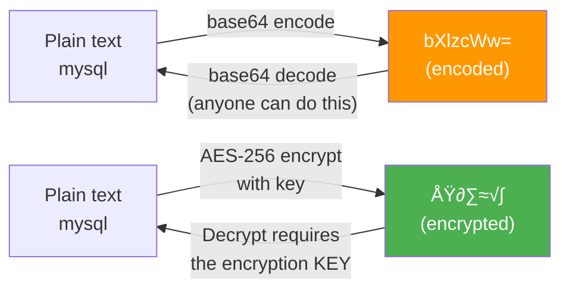
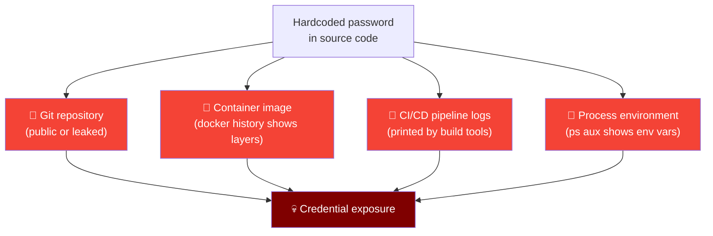
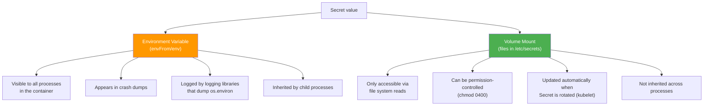
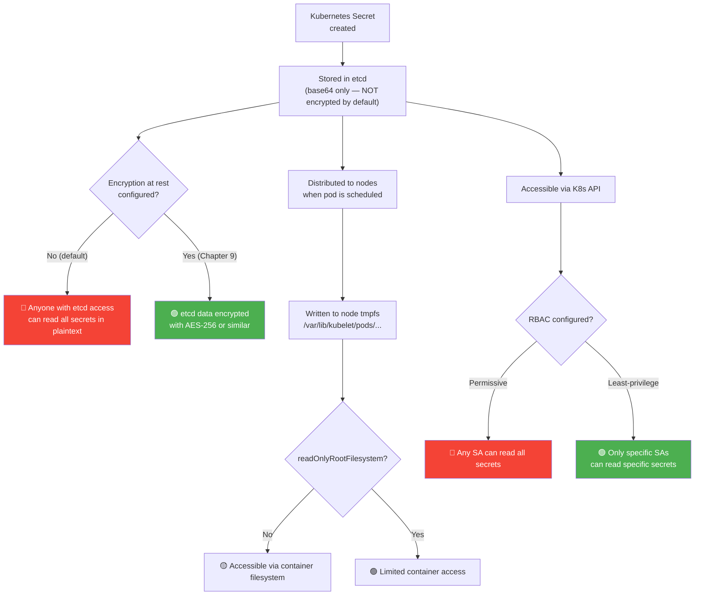
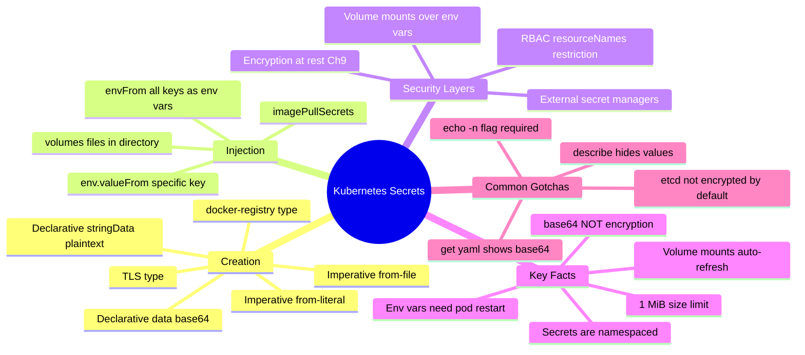

# 8 — Manage Kubernetes Secrets


---

## Why This Matters

Every application handles sensitive data: database passwords, API keys, TLS certificates, OAuth tokens. The naive approach — hardcoding credentials in application code or baking them into container images — is a critical security failure that exposes secrets in:

- Source code repositories (public GitHub leaks happen daily)
- Container image layers (inspectable with `docker history`)
- Pod environment variables (visible to anyone who can `kubectl exec`)
- CI/CD logs (often public or poorly protected)

Kubernetes Secrets are the native mechanism for decoupling sensitive data from application code and configuration. But they come with a critical caveat that is heavily tested on CKS: **Kubernetes Secrets are encoded (base64), not encrypted, by default.** Understanding what that means — and what additional steps are required to actually protect secrets — is the core of this chapter and Chapter 9.

For CKS, Secrets are tested from multiple angles: creating them, injecting them safely, auditing RBAC access, understanding the encoding-vs-encryption distinction, and configuring encryption at rest.

---

## What Is a Kubernetes Secret?

A Kubernetes Secret is an API object (`kind: Secret`) designed to hold small amounts of sensitive data — passwords, tokens, certificates, keys — separately from pod specifications.

| Attribute | Detail |
|---|---|
| **Kind** | `Secret` |
| **API Group** | `v1` (core) |
| **Scope** | Namespaced |
| **Default storage** | Base64-encoded in etcd (NOT encrypted by default) |
| **Max size** | 1 MiB per Secret |
| **Types** | Opaque (generic), `kubernetes.io/tls`, `kubernetes.io/dockerconfigjson`, `kubernetes.io/service-account-token`, etc. |
| **Encoded** | Yes — base64 |
| **Encrypted** | Only if encryption at rest is configured (Chapter 9) |

### The Critical Distinction: Encoded ≠ Encrypted



```bash
# Base64 "encoding" is trivially reversible — it is NOT security:
echo -n 'bXlzcWw=' | base64 --decode
# mysql   ← anyone can do this

# Base64 is only a data format, not protection
```

**What base64 encoding provides:** Allows binary data to be stored as ASCII text in etcd/YAML. That is all.

**What it does NOT provide:** Confidentiality, integrity, or protection against anyone who can read the etcd data or the Secret object via the Kubernetes API.

---

## The Problem: Hardcoded Credentials

Before Secrets, developers resorted to this pattern:

```python
# ❌ Insecure — credentials in source code
import mysql.connector
from flask import Flask

app = Flask(__name__)

@app.route("/")
def main():
    conn = mysql.connector.connect(
        host="mysql",
        database="mysql",
        user="root",
        password="paswrd"    # ← Hardcoded! In git. Forever.
    )
    return "Connected!", 200
```

**Attack surfaces this creates:**



The correct approach: the application reads configuration from environment variables or mounted files — and Kubernetes injects those from Secrets at runtime, separate from the image and code.

```python
# ✅ Secure — credentials injected by Kubernetes at runtime
import os
import mysql.connector
from flask import Flask

app = Flask(__name__)

@app.route("/")
def main():
    conn = mysql.connector.connect(
        host=os.environ.get("DB_Host"),
        database="mysql",
        user=os.environ.get("DB_User"),
        password=os.environ.get("DB_Password")   # ← From Secret, not code
    )
    return "Connected!", 200
```

---

## ConfigMap vs Secret — When to Use Which

| Data Type | Use | Example |
|---|---|---|
| Non-sensitive config | `ConfigMap` | Database hostname, port, feature flags, log level |
| Sensitive credentials | `Secret` | Database password, API key, TLS private key, OAuth token |

```yaml
# ConfigMap — non-sensitive
apiVersion: v1
kind: ConfigMap
metadata:
  name: app-config
data:
  DB_Host: "mysql-service"     # hostname — not sensitive
  DB_Port: "3306"
  LOG_LEVEL: "info"

# Secret — sensitive
apiVersion: v1
kind: Secret
metadata:
  name: app-secret
type: Opaque
data:
  DB_User: cm9vdA==            # "root" base64-encoded
  DB_Password: cGFzd3Jk        # "paswrd" base64-encoded
```

---

## Secret Types

| Type | Used For | Created by |
|---|---|---|
| `Opaque` | Arbitrary user-defined data (generic) | User |
| `kubernetes.io/tls` | TLS certificates and keys | User / cert-manager |
| `kubernetes.io/dockerconfigjson` | Docker registry pull credentials | User / `kubectl create secret docker-registry` |
| `kubernetes.io/service-account-token` | ServiceAccount JWT tokens | Kubernetes automatically |
| `kubernetes.io/ssh-auth` | SSH private keys | User |
| `kubernetes.io/basic-auth` | Username + password for basic auth | User |
| `bootstrap.kubernetes.io/token` | Node bootstrap tokens | kubeadm |

---

## Creating Secrets

### Method 1: Imperative — From Literals

```bash
# Create from key=value pairs directly
kubectl create secret generic app-secret \
  --from-literal=DB_Host=mysql \
  --from-literal=DB_User=root \
  --from-literal=DB_Password=paswrd

# kubectl handles the base64 encoding automatically
kubectl get secret app-secret -o yaml
# data:
#   DB_Host: bXlzcWw=
#   DB_Password: cGFzd3Jk
#   DB_User: cm9vdA==
```

### Method 2: Imperative — From File

```bash
# Create from a .env or properties file
# File contents: DB_Host=mysql\nDB_User=root\nDB_Password=paswrd

kubectl create secret generic app-secret \
  --from-file=app_secret.properties

# Or from individual files (key = filename, value = file contents)
kubectl create secret generic tls-secret \
  --from-file=tls.crt=server.crt \
  --from-file=tls.key=server.key
```

### Method 3: Declarative — YAML with Base64

First, encode your values:

```bash
# Encode each value
echo -n 'mysql'  | base64   # → bXlzcWw=
echo -n 'root'   | base64   # → cm9vdA==
echo -n 'paswrd' | base64   # → cGFzd3Jk

# Decode to verify
echo -n 'bXlzcWw=' | base64 --decode   # → mysql
```

Then create the YAML:

```yaml
# secret-data.yaml
apiVersion: v1
kind: Secret
metadata:
  name: app-secret
  namespace: default
type: Opaque
data:
  DB_Host: bXlzcWw=       # base64("mysql")
  DB_User: cm9vdA==       # base64("root")
  DB_Password: cGFzd3Jk   # base64("paswrd")
```

```bash
kubectl apply -f secret-data.yaml
```

### Method 4: Declarative — Using `stringData` (Plaintext in YAML)

For convenience in GitOps workflows where encoding is done externally (e.g., Sealed Secrets, External Secrets Operator):

```yaml
apiVersion: v1
kind: Secret
metadata:
  name: app-secret
type: Opaque
stringData:
  DB_Host: mysql       # ← plain text, Kubernetes encodes it
  DB_User: root
  DB_Password: paswrd
```

> ⚠️ **Never commit `stringData` Secrets to git.** The values are plain text in the YAML file. Use `data` (base64) for committed files, or use a Secret management tool.

### Method 5: TLS Secret

```bash
# From existing certificate files
kubectl create secret tls my-tls-secret \
  --cert=server.crt \
  --key=server.key

# Or declaratively
apiVersion: v1
kind: Secret
metadata:
  name: my-tls-secret
type: kubernetes.io/tls
data:
  tls.crt: <base64-encoded-cert>
  tls.key: <base64-encoded-key>
```

### Method 6: Docker Registry Secret (Image Pull Secret)

```bash
kubectl create secret docker-registry regcred \
  --docker-server=registry.company.com \
  --docker-username=myuser \
  --docker-password=mypassword \
  --docker-email=user@company.com
```

---

## Viewing Secrets

```bash
# List all Secrets in current namespace
kubectl get secrets
# NAME          TYPE     DATA   AGE
# app-secret    Opaque   3      10m

# Show Secret details (data values are NOT shown)
kubectl describe secret app-secret
# Name:         app-secret
# Namespace:    default
# Type:         Opaque
# Data
# ====
# DB_Host:      5 bytes    ← only byte count shown, not value
# DB_Password:  6 bytes
# DB_User:      4 bytes

# Show encoded values (base64)
kubectl get secret app-secret -o yaml
# data:
#   DB_Host: bXlzcWw=
#   DB_Password: cGFzd3Jk
#   DB_User: cm9vdA==

# Decode a specific field directly
kubectl get secret app-secret \
  -o jsonpath='{.data.DB_Password}' | base64 --decode
# paswrd

# Decode all fields at once
kubectl get secret app-secret -o json | \
  jq '.data | map_values(@base64d)'
# {"DB_Host": "mysql", "DB_Password": "paswrd", "DB_User": "root"}
```

---

## Injecting Secrets into Pods

### Method 1: Environment Variables — All Keys (`envFrom`)

Injects every key in the Secret as a separate environment variable:

```yaml
apiVersion: v1
kind: Pod
metadata:
  name: webapp
spec:
  containers:
  - name: webapp
    image: registry.company.com/webapp:v1
    ports:
    - containerPort: 8080
    envFrom:
    - secretRef:
        name: app-secret          # All keys become env vars
    - configMapRef:
        name: app-config          # Can mix ConfigMap and Secret
```

```bash
# Verify inside the container
kubectl exec webapp -- env | grep DB
# DB_Host=mysql
# DB_User=root
# DB_Password=paswrd
```

**Risk:** Environment variables are visible to all processes in the container, appear in crash dumps, and can be leaked by logging frameworks that dump `os.environ`.

### Method 2: Environment Variables — Single Key (`env.valueFrom`)

Injects specific keys only:

```yaml
spec:
  containers:
  - name: webapp
    image: registry.company.com/webapp:v1
    env:
    - name: DATABASE_PASSWORD         # env var name in container
      valueFrom:
        secretKeyRef:
          name: app-secret            # Secret name
          key: DB_Password            # Key within the Secret
    - name: DATABASE_HOST
      valueFrom:
        configMapKeyRef:
          name: app-config
          key: DB_Host
```

### Method 3: Volume Mount (Recommended for Sensitive Data)

Each Secret key becomes a **file** in the mounted directory. The file's content is the decoded value:

```yaml
apiVersion: v1
kind: Pod
metadata:
  name: webapp
spec:
  containers:
  - name: webapp
    image: registry.company.com/webapp:v1
    volumeMounts:
    - name: secret-volume
      mountPath: /etc/secrets         # Directory inside container
      readOnly: true                  # ← Always mount read-only
  volumes:
  - name: secret-volume
    secret:
      secretName: app-secret
      defaultMode: 0400               # ← File permissions: owner read-only
```

Inside the container:

```bash
ls /etc/secrets
# DB_Host  DB_Password  DB_User

cat /etc/secrets/DB_Password
# paswrd

# Application reads the file instead of env var
password = open('/etc/secrets/DB_Password').read().strip()
```

**Why volume mounts are safer than env vars:**



### Method 4: Image Pull Secret

For pulling images from private registries:

```yaml
apiVersion: v1
kind: Pod
metadata:
  name: private-app
spec:
  imagePullSecrets:
  - name: regcred          # The docker-registry Secret
  containers:
  - name: app
    image: registry.company.com/myapp:v1
```

Or configure at the ServiceAccount level (applies to all pods using that SA):

```bash
kubectl patch serviceaccount default \
  -p '{"imagePullSecrets": [{"name": "regcred"}]}'
```

---

## Injection Method Comparison

| Method | Syntax | Best For | Risks |
|---|---|---|---|
| `envFrom.secretRef` | All keys as env vars | Simple apps, non-critical secrets | All keys exposed as env vars |
| `env.valueFrom.secretKeyRef` | Specific keys as env vars | Selective injection | Env var exposure risks |
| `volumes` + `volumeMounts` | Keys as files | Sensitive data, TLS certs | Requires file-reading code |
| `imagePullSecrets` | Registry credentials | Private image registries | Must exist before pod creation |

---

## RBAC for Secrets

Secrets have **the same RBAC model as other resources**, but the stakes are higher. Anyone with `get` or `list` on Secrets in a namespace can read all secrets in that namespace.

### Least-Privilege Secret RBAC

```yaml
# Only allow reading a specific Secret
apiVersion: rbac.authorization.k8s.io/v1
kind: Role
metadata:
  name: secret-reader
  namespace: production
rules:
- apiGroups: [""]
  resources: ["secrets"]
  resourceNames: ["app-secret"]   # ← Restrict to specific secret name
  verbs: ["get"]                  # ← No list, no watch, no create
---
apiVersion: rbac.authorization.k8s.io/v1
kind: RoleBinding
metadata:
  name: webapp-secret-binding
  namespace: production
subjects:
- kind: ServiceAccount
  name: webapp-sa
  namespace: production
roleRef:
  kind: Role
  name: secret-reader
  apiGroup: rbac.authorization.k8s.io
```

### Dangerous RBAC Patterns to Avoid

```yaml
# ❌ Never give wildcard on secrets
rules:
- apiGroups: [""]
  resources: ["secrets"]
  verbs: ["*"]             # Create/delete/list all secrets

# ❌ Never use list without resourceNames restriction
rules:
- apiGroups: [""]
  resources: ["secrets"]
  verbs: ["list"]          # Lists ALL secret names in namespace
                           # (names can be sensitive themselves)

# ✅ Minimal: get on specific secret only
rules:
- apiGroups: [""]
  resources: ["secrets"]
  resourceNames: ["app-secret"]
  verbs: ["get"]
```

### Check Who Can Access Secrets

```bash
# Who can read secrets in the production namespace?
kubectl auth can-i get secrets -n production --list

# Can the webapp ServiceAccount read app-secret?
kubectl auth can-i get secret/app-secret \
  --as=system:serviceaccount:production:webapp-sa \
  -n production

# Audit: find all subjects that can get secrets
kubectl get rolebindings,clusterrolebindings -A -o json | \
  jq '.items[] | select(.roleRef.kind == "Role" or .roleRef.kind == "ClusterRole") | 
  {name: .metadata.name, subjects: .subjects}'
```

---

## Security Considerations — The Full Picture



### The Six Rules of Secret Security

1. **Never hardcode secrets in application code** — use env vars or volume mounts
2. **Never commit Secret YAML with `stringData` to git** — use Sealed Secrets or External Secrets Operator
3. **Enable encryption at rest** (Chapter 9) — base64 in etcd is not protection
4. **Use RBAC with `resourceNames`** to restrict access to specific secrets
5. **Prefer volume mounts over environment variables** for sensitive values
6. **Consider external secret managers** (Vault, AWS Secrets Manager, GCP Secret Manager) for production

### Encryption at Rest Preview

Configuring encryption at rest (fully covered in Chapter 9) requires an `EncryptionConfiguration` file:

```yaml
# /etc/kubernetes/enc/enc.yaml
apiVersion: apiserver.config.k8s.io/v1
kind: EncryptionConfiguration
resources:
- resources:
  - secrets
  providers:
  - aescbc:                          # ← Encrypt using AES-CBC
      keys:
      - name: key1
        secret: c2VjcmV0IGlzIHN1bXdlcnZlZQ==   # base64(32-byte key)
  - identity: {}                     # ← Fallback for reading unencrypted data
```

Then reference it in kube-apiserver:

```yaml
# /etc/kubernetes/manifests/kube-apiserver.yaml
command:
- kube-apiserver
- --encryption-provider-config=/etc/kubernetes/enc/enc.yaml
volumeMounts:
- name: enc
  mountPath: /etc/kubernetes/enc
  readOnly: true
volumes:
- name: enc
  hostPath:
    path: /etc/kubernetes/enc
    type: DirectoryOrCreate
```

### External Secret Providers

For production environments, store secrets outside etcd entirely:

| Provider | Tool | How It Works |
|---|---|---|
| HashiCorp Vault | Vault Agent / Vault Secrets Operator | Secrets injected at pod startup from Vault |
| AWS Secrets Manager | External Secrets Operator (ESO) | Syncs AWS secrets to K8s Secret objects |
| GCP Secret Manager | External Secrets Operator | Syncs GCP secrets to K8s Secret objects |
| Azure Key Vault | Azure Key Vault Provider for Secrets Store CSI | Mounts Azure secrets as volume directly |
| Any | Sealed Secrets (Bitnami) | Encrypts Secret YAML for safe git storage |

---

## Real-World Scenarios

### Scenario 1 — Migrating from Hardcoded to Secret-Backed Credentials

**Before:**

```python
# app.py — credentials in source code ❌
conn = mysql.connector.connect(host="mysql", user="root", password="SuperSecret123")
```

**Step 1 — Create the Secret:**

```bash
kubectl create secret generic mysql-creds \
  --from-literal=MYSQL_USER=root \
  --from-literal=MYSQL_PASSWORD=SuperSecret123 \
  -n production
```

**Step 2 — Mount as volume in the Pod:**

```yaml
spec:
  containers:
  - name: webapp
    image: registry.company.com/webapp:v2
    volumeMounts:
    - name: db-creds
      mountPath: /etc/db-creds
      readOnly: true
  volumes:
  - name: db-creds
    secret:
      secretName: mysql-creds
      defaultMode: 0400
```

**Step 3 — Update application to read from files:**

```python
# app.py — reads from mounted Secret ✅
def get_db_password():
    with open('/etc/db-creds/MYSQL_PASSWORD', 'r') as f:
        return f.read().strip()

conn = mysql.connector.connect(
    host=os.environ.get('MYSQL_HOST', 'mysql'),
    user=open('/etc/db-creds/MYSQL_USER').read().strip(),
    password=get_db_password()
)
```

### Scenario 2 — Auditing Secret Access

**Problem:** Security team suspects a pod is accessing secrets it shouldn't.

```bash
# 1. Find all pods and their ServiceAccounts in the namespace
kubectl get pods -n production \
  -o custom-columns="POD:.metadata.name,SA:.spec.serviceAccountName"

# 2. Check what each SA can do with secrets
kubectl auth can-i get secrets \
  --as=system:serviceaccount:production:webapp-sa \
  -n production

# 3. Find all roles/bindings that grant secret access
kubectl get rolebindings -n production -o yaml | \
  grep -B5 -A5 "secrets"

# 4. Check which secrets a specific pod is mounting
kubectl describe pod suspect-pod -n production | grep -A 10 "Volumes:"

# 5. Enable API server audit logging for secret access
# In audit-policy.yaml:
# - level: Metadata
#   resources:
#   - group: ""
#     resources: ["secrets"]
```

### Scenario 3 — Secret Rotation Without Downtime

**Problem:** A database password was rotated. Need to update the Kubernetes Secret without pod restart.

```bash
# Update the Secret (volume-mounted secrets auto-update within ~60s)
kubectl create secret generic mysql-creds \
  --from-literal=MYSQL_PASSWORD=NewRotatedPassword456 \
  --dry-run=client -o yaml | kubectl apply -f -

# Pods using volume mounts will get the new value automatically
# (kubelet refreshes mounted secrets on its sync interval)

# Pods using env vars (envFrom) will NOT auto-update
# Those pods require a restart:
kubectl rollout restart deployment/webapp -n production
```

> **Volume mounts automatically refresh.** Files in mounted secret volumes are updated by the kubelet without a pod restart (default sync period: 60 seconds). Environment variables do NOT update — a pod restart is required.

---

## Common Mistakes

| Mistake | Consequence | Fix |
|---|---|---|
| Treating base64 as encryption | False sense of security — anyone with etcd access or RBAC can trivially decode | Enable encryption at rest (Chapter 9) |
| Committing Secret YAML to git | Credentials in version history permanently | Use Sealed Secrets, External Secrets Operator, or git hooks that block secret files |
| Using `envFrom` for all secrets | All secret values exposed as env vars — risk of accidental logging | Use volume mounts for sensitive values; reserve envFrom for non-critical config |
| Giving broad `list secrets` RBAC | Lists all secret names in namespace — names can reveal what's sensitive | Use `get` with `resourceNames` restriction |
| Not setting `readOnly: true` on mounts | Container can modify mounted secret files | Always use `readOnly: true` and `defaultMode: 0400` |
| Storing large data in Secrets | Secrets have 1 MiB limit — large certs can hit it | Split large data; for large certificates use a Secret per cert |
| Using `default` SA for all pods | Default SA often has more permissions than needed | Create dedicated ServiceAccounts per workload with minimal RBAC |
| Not refreshing env-var pods after secret rotation | Old password still in use — authentication failures | Use volume mounts for auto-refresh, or automate rollout restarts |

---

## Quick Reference

### Creating Secrets

```bash
# Generic from literals (auto-encodes)
kubectl create secret generic <name> \
  --from-literal=KEY=value \
  --from-literal=KEY2=value2

# Generic from file
kubectl create secret generic <name> --from-file=<file>

# TLS
kubectl create secret tls <name> --cert=tls.crt --key=tls.key

# Docker registry
kubectl create secret docker-registry <name> \
  --docker-server=<server> \
  --docker-username=<user> \
  --docker-password=<pass>
```

### Viewing Secrets

```bash
kubectl get secrets
kubectl describe secret <name>
kubectl get secret <name> -o yaml
kubectl get secret <name> -o jsonpath='{.data.KEY}' | base64 --decode
```

### Base64 Operations

```bash
# Encode
echo -n 'myvalue' | base64

# Decode
echo -n 'bXl2YWx1ZQ==' | base64 --decode

# Note: always use -n to avoid encoding the newline character
```

### Secret Pod YAML Patterns

```yaml
# envFrom — all keys as env vars
envFrom:
- secretRef:
    name: app-secret

# env.valueFrom — specific key
env:
- name: DB_PASSWORD
  valueFrom:
    secretKeyRef:
      name: app-secret
      key: DB_Password

# Volume mount
volumeMounts:
- name: secret-vol
  mountPath: /etc/secrets
  readOnly: true
volumes:
- name: secret-vol
  secret:
    secretName: app-secret
    defaultMode: 0400
```

---

## CKS Exam Tips

> 💡 **base64 ≠ encryption — this distinction is explicitly tested.** Kubernetes Secrets are encoded, not encrypted. Anyone who can `kubectl get secret -o yaml` and run `base64 --decode` can read the value.

> 💡 **`echo -n`** — the `-n` flag is critical. Without it, `echo` adds a newline and the encoded value is wrong. `echo -n 'mysql' | base64` gives the correct `bXlzcWw=`.

> 💡 **Volume mounts auto-refresh; env vars don't.** After rotating a secret, pods using `volumes` update within ~60 seconds. Pods using `envFrom` or `env.valueFrom` need to be restarted.

> 💡 **Describe vs get -o yaml.** `kubectl describe secret` hides the values (shows byte counts). `kubectl get secret -o yaml` shows base64-encoded values. Know both.

> 💡 **RBAC with `resourceNames`.** The most secure pattern restricts access to specific secret names, not all secrets in a namespace. Exam tasks often ask you to restrict access to a particular secret.

> 💡 **`stringData` is for convenience, not security.** It lets you write plaintext values in the YAML; Kubernetes encodes them. Never git-commit YAML with `stringData`.

> 💡 **Encryption at rest is NOT the default.** This is a common exam trap. Even with Secrets correctly created and RBAC in place, secrets in etcd are only base64-encoded unless you configure `EncryptionConfiguration` (Chapter 9).

```bash
# CKS exam pattern — create and verify a secret
kubectl create secret generic db-secret \
  --from-literal=username=admin \
  --from-literal=password=S3cur3P@ss

# Verify
kubectl get secret db-secret -o yaml
kubectl get secret db-secret \
  -o jsonpath='{.data.password}' | base64 --decode
```

---

## Summary

Kubernetes Secrets separate sensitive data from application code and container images, making credential management safer and more maintainable. The key workflow is: create a Secret (imperative or declarative), then inject it into pods as environment variables or volume-mounted files.

The most important conceptual point for CKS: **Secrets are base64-encoded by default, not encrypted.** This means:

- Anyone with `kubectl get secret` access can decode any value in seconds
- Anyone with direct etcd access can read all secrets
- Encryption at rest (Chapter 9) is required to actually protect secrets at the storage layer
- RBAC is required to protect secrets at the API access layer

Volume mounts are preferred over environment variables for sensitive data because they auto-refresh on secret rotation and are not inherited by child processes.



---

## What's Next

**Chapter 9 — Demo: Encrypting Secret Data at Rest** is the hands-on follow-up to this chapter. It covers configuring `EncryptionConfiguration` on the kube-apiserver, choosing an encryption provider (AES-CBC, AES-GCM, KMS), verifying that etcd data is actually encrypted, and re-encrypting existing secrets that were stored before encryption was enabled. This is the step that transforms "encoded" secrets into genuinely protected secrets.

---

*Chapter 8 of 30 — Microservice Vulnerabilities | Kubernetes Security Study Guide*
