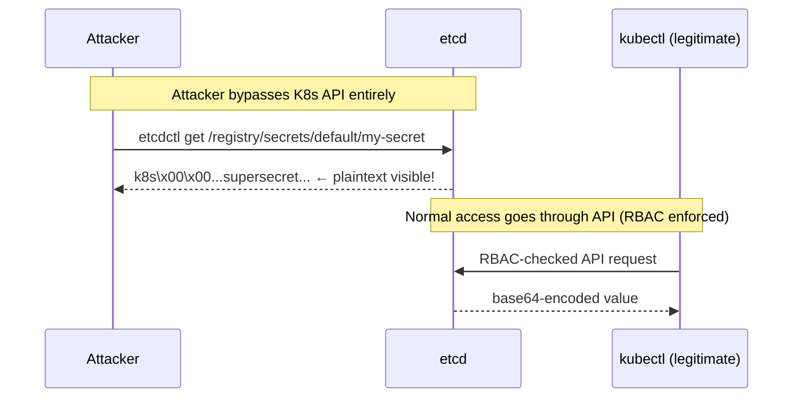
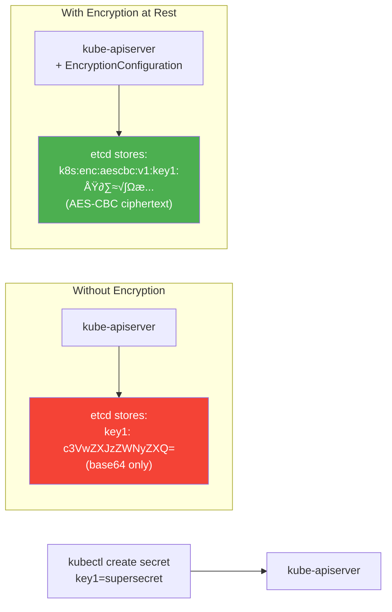
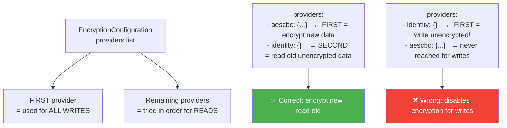
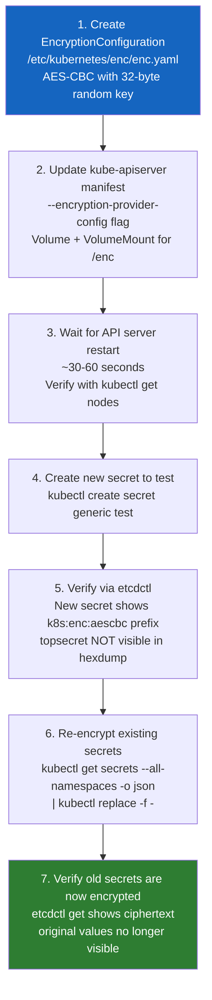
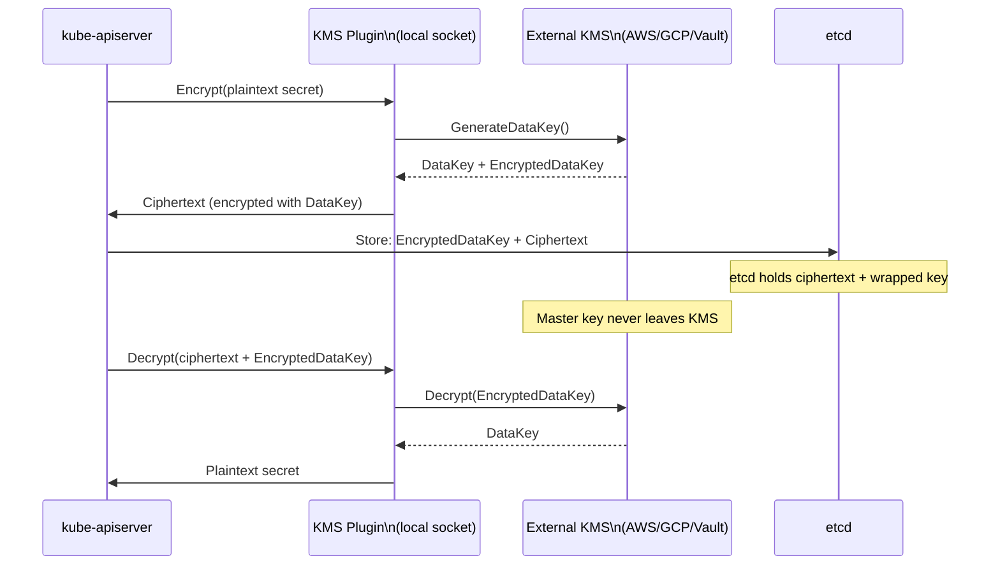
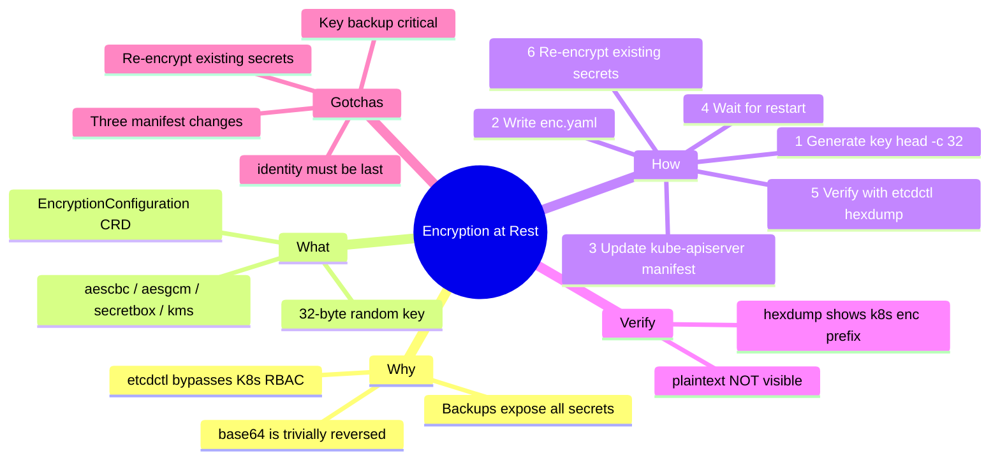

# 9 — Demo: Encrypting Secret Data at Rest


---

## Why This Matters

Chapter 8 established that Kubernetes Secrets are only base64-encoded by default — not encrypted. This chapter proves that claim empirically and shows exactly how to fix it.

**The threat model:** An attacker who gains access to the etcd datastore — through a compromised backup, a misconfigured etcd port, stolen etcd certificates, or physical access to a control-plane node — can read every Secret in the cluster with a single `etcdctl get` command. No Kubernetes RBAC. No API server. No audit trail.



Encryption at rest closes this gap — data stored in etcd is ciphertext even if someone extracts it directly, because the encryption key is only held by the API server.

For CKS, **encrypting secrets at rest is a guaranteed exam topic.** The complete workflow — generating a key, writing `EncryptionConfiguration`, updating the kube-apiserver manifest, verifying encryption, and re-encrypting existing secrets — is tested end to end.

---

## What Is Encryption at Rest?

Encryption at rest means that data is encrypted **before it is written to the etcd storage backend** and decrypted **after it is read back from etcd**. The API server handles both operations transparently.

| Without Encryption at Rest | With Encryption at Rest |
|---|---|
| Secret stored as base64 in etcd | Secret stored as ciphertext in etcd |
| `etcdctl get` reveals the value | `etcdctl get` returns opaque ciphertext |
| Backup files contain readable secrets | Backup files contain only ciphertext |
| Needs only etcd cert to read | Needs etcd cert + encryption key to read |
| RBAC is the only protection layer | RBAC + encryption-key control |



---

## Step 1: Prove the Problem — Unencrypted Secrets in etcd

### Create a Test Secret

```bash
kubectl create secret generic my-secret \
  --from-literal=key1=supersecret
# secret/my-secret created

kubectl get secret
# NAME        TYPE     DATA   AGE
# my-secret   Opaque   1      5s

kubectl describe secret my-secret
# Name:         my-secret
# Namespace:    default
# Type:         Opaque
# Data
# ====
# key1: 11 bytes   ← value hidden by describe

kubectl get secret my-secret -o yaml
# data:
#   key1: c3VwZXJzZWNyZXQ=   ← base64 encoded

# Decode it trivially:
echo -n 'c3VwZXJzZWNyZXQ=' | base64 --decode
# supersecret   ← original value recovered instantly
```

### Read Directly from etcd — Bypassing Kubernetes API

Install etcdctl if not present:

```bash
# Ubuntu / Debian
apt-get install etcd-client

# Or use the binary from the etcd release
ETCD_VER=v3.5.10
curl -L https://github.com/etcd-io/etcd/releases/download/${ETCD_VER}/etcd-${ETCD_VER}-linux-amd64.tar.gz \
  -o etcd.tar.gz
tar xzf etcd.tar.gz
cp etcd-${ETCD_VER}-linux-amd64/etcdctl /usr/local/bin/

# Verify API version
ETCDCTL_API=3 etcdctl version
```

Read the secret directly from etcd:

```bash
ETCDCTL_API=3 etcdctl \
  --cacert=/etc/kubernetes/pki/etcd/ca.crt \
  --cert=/etc/kubernetes/pki/etcd/server.crt \
  --key=/etc/kubernetes/pki/etcd/server.key \
  get /registry/secrets/default/my-secret | hexdump -C
```

Sample output (pre-encryption):

```
00000000  2f 72 65 67 69 73 74 72  79 2f 73 65 63 72 65 74  |/registry/secret|
00000010  73 2f 64 65 66 61 75 6c  74 2f 6d 79 2d 73 65 63  |s/default/my-sec|
00000020  72 65 74 0a 6b 38 73 00  0a 0c 0a 02 76 31 12 06  |ret.k8s.....v1..|
...
00000080  73 75 70 65 72 73 65 63  72 65 74 1a 00 22 00      |supersecret...".|
```

> **"supersecret" is visible in plain text in the hexdump.** This is the vulnerability. The Kubernetes API was never involved — only etcd certificates were needed.

---

## Step 2: Check If Encryption is Already Enabled

Before configuring anything, verify the current state:

```bash
# Method 1: Check the kube-apiserver process arguments
ps aux | grep kube-apiserver | grep encryption-provider-config
# If no output → encryption is NOT configured

# Method 2: Check the kube-apiserver manifest
grep -i encryption /etc/kubernetes/manifests/kube-apiserver.yaml
# If no output → encryption is NOT configured

# Method 3: Check via kubectl
kubectl get pod kube-apiserver-controlplane -n kube-system \
  -o jsonpath='{.spec.containers[0].command}' | tr ' ' '\n' | grep encryption
# If no output → encryption is NOT configured
```

If you see `--encryption-provider-config=...` — encryption is already enabled. If not, proceed with the steps below.

---

## Step 3: Generate a Strong Encryption Key

The AES-CBC and AES-GCM providers require a **base64-encoded 32-byte (256-bit) key**:

```bash
# Generate a cryptographically random 32-byte key and base64-encode it
head -c 32 /dev/urandom | base64

# Example output (yours will be different — each run generates a unique key):
# y0xTt+U6xgRdNxe4nDYYsij0GgRDoUYc+wAwOKeNfPs=

# Save it to a variable
ENCRYPTION_KEY=$(head -c 32 /dev/urandom | base64)
echo $ENCRYPTION_KEY
```

> **Key security:** This key is the master protection for all Secrets. Store it securely — outside the cluster if possible (e.g., in a hardware security module or KMS). Losing the key means losing access to all encrypted secrets.

---

## Step 4: Create the EncryptionConfiguration File

```bash
# Create the directory on the control plane node
mkdir -p /etc/kubernetes/enc

# Write the encryption configuration
cat > /etc/kubernetes/enc/enc.yaml <<EOF
apiVersion: apiserver.config.k8s.io/v1
kind: EncryptionConfiguration
resources:
- resources:
  - secrets
  providers:
  - aescbc:
      keys:
      - name: key1
        secret: ${ENCRYPTION_KEY}
  - identity: {}
EOF

# Verify the file
cat /etc/kubernetes/enc/enc.yaml
```

### Understanding the EncryptionConfiguration

```yaml
apiVersion: apiserver.config.k8s.io/v1
kind: EncryptionConfiguration
resources:
- resources:
  - secrets                  # Which resource types to encrypt
  # Can also add: configmaps, events, etc.
  providers:
  - aescbc:                  # PRIMARY provider — used for writing new data
      keys:
      - name: key1           # Key name (used to identify which key decrypted data)
        secret: <base64-32-byte-key>
  - identity: {}             # FALLBACK provider — reads unencrypted existing data
                             # Must be LAST for write-encrypt, FIRST for write-unencrypted
```

### Provider Ordering — The Critical Rule



**`identity: {}`** means "store/read as-is, no encryption". When placed last, it allows the API server to read pre-existing unencrypted secrets (backward compatibility) while all new writes use AES-CBC.

### Available Encryption Providers

| Provider | Algorithm | Key Size | Notes |
|---|---|---|---|
| `aescbc` | AES-CBC | 32 bytes (256-bit) | Widely used, good security; CBC mode susceptible to padding oracle if misused |
| `aesgcm` | AES-GCM | 16 or 32 bytes | Authenticated encryption — provides integrity check; **key must be rotated** after 200k uses |
| `secretbox` | XSalsa20 + Poly1305 | 32 bytes | Strong authenticated encryption |
| `kms` | Provider-dependent | N/A | Delegates to external KMS (AWS KMS, GCP KMS, HashiCorp Vault, Azure Key Vault) |
| `kms` (v2) | Provider-dependent | N/A | Improved performance KMS integration |
| `identity` | None | N/A | No encryption — fallback/plaintext |

**For CKS exam:** `aescbc` is the standard provider used in most exam scenarios.

---

## Step 5: Update the Kube-Apiserver Manifest

Edit `/etc/kubernetes/manifests/kube-apiserver.yaml`:

```bash
# Make a backup first
cp /etc/kubernetes/manifests/kube-apiserver.yaml \
   /etc/kubernetes/manifests/kube-apiserver.yaml.bak

# Edit the manifest
vim /etc/kubernetes/manifests/kube-apiserver.yaml
```

Add three things to the manifest:

```yaml
apiVersion: v1
kind: Pod
metadata:
  name: kube-apiserver
  namespace: kube-system
spec:
  containers:
  - name: kube-apiserver
    image: registry.k8s.io/kube-apiserver:v1.29.0
    command:
    - kube-apiserver
    - --advertise-address=10.10.30.4
    - --allow-privileged=true
    - --authorization-mode=Node,RBAC
    # ① ADD THIS LINE:
    - --encryption-provider-config=/etc/kubernetes/enc/enc.yaml
    # ... other existing flags ...

    volumeMounts:
    # ... existing mounts ...
    # ② ADD THIS MOUNT:
    - name: enc
      mountPath: /etc/kubernetes/enc
      readOnly: true

  volumes:
  # ... existing volumes ...
  # ③ ADD THIS VOLUME:
  - name: enc
    hostPath:
      path: /etc/kubernetes/enc
      type: DirectoryOrCreate
```

### Wait for the API Server to Restart

After editing the manifest, the kubelet detects the change and restarts the kube-apiserver pod automatically:

```bash
# Watch the pod restart
watch kubectl get pods -n kube-system

# Or check the process directly
ps aux | grep kube-apiserver | grep -v grep

# Wait until the API server is responsive again (30-60 seconds)
kubectl get nodes
# NAME           STATUS   ROLES           AGE
# controlplane   Ready    control-plane   10d   ← cluster is back

# Verify the encryption flag is present in the running process
ps aux | grep kube-apiserver | grep encryption-provider-config
# ... --encryption-provider-config=/etc/kubernetes/enc/enc.yaml ...
```

---

## Step 6: Verify New Secrets Are Encrypted

Create a new secret after encryption is enabled:

```bash
kubectl create secret generic my-secret-2 \
  --from-literal=key2=topsecret

kubectl get secret
# NAME          TYPE     DATA   AGE
# my-secret     Opaque   1      20m   ← OLD — still unencrypted in etcd
# my-secret-2   Opaque   1      5s    ← NEW — encrypted in etcd
```

Now read `my-secret-2` directly from etcd:

```bash
ETCDCTL_API=3 etcdctl \
  --cacert=/etc/kubernetes/pki/etcd/ca.crt \
  --cert=/etc/kubernetes/pki/etcd/server.crt \
  --key=/etc/kubernetes/pki/etcd/server.key \
  get /registry/secrets/default/my-secret-2 | hexdump -C
```

Expected output (with encryption):

```
00000000  2f 72 65 67 69 73 74 72  79 2f 73 65 63 72 65 74  |/registry/secret|
00000010  73 2f 64 65 66 61 75 6c  74 2f 6d 79 2d 73 65 63  |s/default/my-sec|
00000020  72 65 74 2d 32 0a 6b 38  73 3a 65 6e 63 3a 61 65  |ret-2.k8s:enc:ae|
00000030  73 63 62 63 3a 76 31 3a  6b 65 79 31 3a bd 56 23  |scbc:v1:key1:.V#|
00000040  f2 a9 3e 72 45 9d 8a 1c  b4 f6 2d 8a 7e 03 c4 12  |..>rE.....-.~...|
```

Key indicators of encryption:
- The prefix `k8s:enc:aescbc:v1:key1:` — identifies the encryption provider and key name
- **"topsecret" is NOT visible anywhere in the hexdump** — it is ciphertext

Compare the old `my-secret` (not yet re-encrypted):

```bash
ETCDCTL_API=3 etcdctl \
  --cacert=/etc/kubernetes/pki/etcd/ca.crt \
  --cert=/etc/kubernetes/pki/etcd/server.crt \
  --key=/etc/kubernetes/pki/etcd/server.key \
  get /registry/secrets/default/my-secret | hexdump -C

# "supersecret" STILL VISIBLE — this is an old secret, written before encryption was enabled
```

---

## Step 7: Re-Encrypt All Existing Secrets

Existing secrets written before encryption was enabled are still stored in plaintext (base64 only). Force a re-write of all secrets through the API server to apply encryption:

```bash
# Re-encrypt all secrets in all namespaces
# This reads each secret (decodes from etcd) and writes it back (re-encodes with AES)
kubectl get secrets --all-namespaces -o json | kubectl replace -f -

# For a single namespace:
kubectl get secrets -n default -o json | kubectl replace -f -

# Verify the old secret is now encrypted
ETCDCTL_API=3 etcdctl \
  --cacert=/etc/kubernetes/pki/etcd/ca.crt \
  --cert=/etc/kubernetes/pki/etcd/server.crt \
  --key=/etc/kubernetes/pki/etcd/server.key \
  get /registry/secrets/default/my-secret | hexdump -C

# "supersecret" should NO LONGER be visible — prefix k8s:enc:aescbc:v1:key1: should appear
```

> **Why this works:** `kubectl replace` reads the secret via the API server (which decrypts it), then writes it back via the API server (which re-encrypts it with the current primary provider). The original plaintext is never stored.

---

## Key Rotation

When you need to rotate the encryption key (e.g., periodic rotation policy, suspected key compromise):

### Step 1 — Add the New Key to the Config (Keep the Old Key)

```bash
# Generate new key
NEW_KEY=$(head -c 32 /dev/urandom | base64)

cat > /etc/kubernetes/enc/enc.yaml <<EOF
apiVersion: apiserver.config.k8s.io/v1
kind: EncryptionConfiguration
resources:
- resources:
  - secrets
  providers:
  - aescbc:
      keys:
      - name: key2        # ← NEW key first (used for writes)
        secret: ${NEW_KEY}
      - name: key1        # ← OLD key second (still needed to READ old data)
        secret: ${OLD_KEY}
  - identity: {}
EOF
```

### Step 2 — Restart API Server and Re-Encrypt

```bash
# Restart API server (edit manifest to trigger restart, or touch the file)
# Wait for restart...

# Re-encrypt all secrets with the new key
kubectl get secrets --all-namespaces -o json | kubectl replace -f -
```

### Step 3 — Remove the Old Key

```bash
# After all secrets are re-encrypted with key2, remove key1
cat > /etc/kubernetes/enc/enc.yaml <<EOF
apiVersion: apiserver.config.k8s.io/v1
kind: EncryptionConfiguration
resources:
- resources:
  - secrets
  providers:
  - aescbc:
      keys:
      - name: key2        # Only new key remains
        secret: ${NEW_KEY}
  - identity: {}
EOF
```

---

## The Complete Encryption at Rest Workflow



---

## KMS Integration (Production-Grade)

For production clusters, storing the encryption key in a file on the control plane is a single point of failure — if the control plane is compromised, both the ciphertext and the key are exposed. KMS integration delegates key management to an external, hardened system:

```yaml
apiVersion: apiserver.config.k8s.io/v1
kind: EncryptionConfiguration
resources:
- resources:
  - secrets
  providers:
  - kms:
      apiVersion: v2
      name: my-kms-plugin
      endpoint: unix:///tmp/socketfile.sock   # KMS plugin socket
      timeout: 3s
  - identity: {}
```

**How KMS works:**



With KMS: even if etcd is compromised, the master key is safely in the external KMS — ciphertext alone is useless.

---

## Real-World Scenarios

### Scenario 1 — Full End-to-End Encryption Setup (CKS Exam Pattern)

```bash
# 1. Generate key
head -c 32 /dev/urandom | base64 > /tmp/enc-key.txt
ENC_KEY=$(cat /tmp/enc-key.txt)

# 2. Create config directory
mkdir -p /etc/kubernetes/enc

# 3. Write EncryptionConfiguration
cat > /etc/kubernetes/enc/enc.yaml <<EOF
apiVersion: apiserver.config.k8s.io/v1
kind: EncryptionConfiguration
resources:
- resources:
  - secrets
  providers:
  - aescbc:
      keys:
      - name: key1
        secret: ${ENC_KEY}
  - identity: {}
EOF

# 4. Edit kube-apiserver manifest
# Add to spec.containers[0].command:
#   - --encryption-provider-config=/etc/kubernetes/enc/enc.yaml
# Add to spec.containers[0].volumeMounts:
#   - name: enc
#     mountPath: /etc/kubernetes/enc
#     readOnly: true
# Add to spec.volumes:
#   - name: enc
#     hostPath:
#       path: /etc/kubernetes/enc
#       type: DirectoryOrCreate
vim /etc/kubernetes/manifests/kube-apiserver.yaml

# 5. Wait for API server restart
watch kubectl get pods -n kube-system

# 6. Verify encryption is active
ps aux | grep kube-apiserver | grep encryption-provider-config

# 7. Test with a new secret
kubectl create secret generic test-enc --from-literal=password=mysecretpassword

# 8. Verify via etcd
ETCDCTL_API=3 etcdctl \
  --cacert=/etc/kubernetes/pki/etcd/ca.crt \
  --cert=/etc/kubernetes/pki/etcd/server.crt \
  --key=/etc/kubernetes/pki/etcd/server.key \
  get /registry/secrets/default/test-enc | hexdump -C
# mysecretpassword should NOT be visible

# 9. Re-encrypt all existing secrets
kubectl get secrets --all-namespaces -o json | kubectl replace -f -

# 10. Clean up test key file
rm /tmp/enc-key.txt
```

### Scenario 2 — Debugging: API Server Won't Start After Editing Manifest

**Symptom:** After editing the manifest, `kubectl get nodes` returns connection refused for >2 minutes.

```bash
# Check if the kubelet is trying to restart the API server
journalctl -u kubelet | tail -50

# Check for syntax errors in the manifest
cat /etc/kubernetes/manifests/kube-apiserver.yaml | python3 -c "import sys,yaml; yaml.safe_load(sys.stdin)" && echo "YAML valid"

# Check if the enc.yaml file exists and is readable
cat /etc/kubernetes/enc/enc.yaml

# Check API server logs (if the container started but crashed)
crictl logs $(crictl ps -a --name kube-apiserver -q | head -1)

# Common error: key not valid base64, or wrong length
# Fix: regenerate the key
head -c 32 /dev/urandom | base64
```

### Scenario 3 — Confirming Which Secrets Are Encrypted

**Goal:** Audit whether all secrets in a cluster are encrypted in etcd.

```bash
# List all secrets across all namespaces
kubectl get secrets --all-namespaces \
  -o jsonpath='{range .items[*]}{.metadata.namespace}/{.metadata.name}{"\n"}{end}'

# For each secret, check etcd directly
for secret in $(kubectl get secrets --all-namespaces \
  -o jsonpath='{range .items[*]}{.metadata.namespace}/{.metadata.name} {end}'); do
  NS=$(echo $secret | cut -d/ -f1)
  NAME=$(echo $secret | cut -d/ -f2)

  result=$(ETCDCTL_API=3 etcdctl \
    --cacert=/etc/kubernetes/pki/etcd/ca.crt \
    --cert=/etc/kubernetes/pki/etcd/server.crt \
    --key=/etc/kubernetes/pki/etcd/server.key \
    get /registry/secrets/${NS}/${NAME} 2>/dev/null)

  if echo "$result" | grep -q "k8s:enc:"; then
    echo "✅ ENCRYPTED: ${NS}/${NAME}"
  else
    echo "❌ NOT ENCRYPTED: ${NS}/${NAME}"
  fi
done
```

---

## Common Mistakes

| Mistake | Consequence | Fix |
|---|---|---|
| Putting `identity: {}` FIRST in providers | All writes go through identity (no encryption) — aescbc is only used for reads | Always put the encrypting provider first; `identity` must be last |
| Forgetting the volumeMount for the enc directory | API server can't read enc.yaml — fails to start | Add both the volume AND the volumeMount to the manifest |
| Using a key that isn't 32 bytes | API server refuses to start — invalid key length error | Always use `head -c 32 /dev/urandom \| base64` |
| Not re-encrypting existing secrets | Old secrets remain in plaintext in etcd | Run `kubectl get secrets --all-namespaces -o json \| kubectl replace -f -` |
| Losing the encryption key | All secrets become permanently inaccessible | Back up the key securely before configuring; consider KMS |
| Not restarting the API server after key rotation | API server still uses old key — new writes use old key | Edit the manifest (even a whitespace change) to trigger restart |
| Encrypting etcd backups without the key | Backup is useless without the key to decrypt | Store key separately from backups |
| Using key rotation without keeping the old key during transition | Secrets encrypted with old key can't be read | Always keep old keys during rotation until all secrets are re-encrypted |

---

## Quick Reference

### Encryption Setup Commands

```bash
# Generate 32-byte AES key
head -c 32 /dev/urandom | base64

# Create config directory
mkdir -p /etc/kubernetes/enc

# Verify API server has encryption enabled
ps aux | grep kube-apiserver | grep encryption-provider-config

# Read secret from etcd (check if encrypted)
ETCDCTL_API=3 etcdctl \
  --cacert=/etc/kubernetes/pki/etcd/ca.crt \
  --cert=/etc/kubernetes/pki/etcd/server.crt \
  --key=/etc/kubernetes/pki/etcd/server.key \
  get /registry/secrets/<namespace>/<name> | hexdump -C

# Re-encrypt all secrets
kubectl get secrets --all-namespaces -o json | kubectl replace -f -

# Watch API server restart
watch kubectl get pods -n kube-system
```

### EncryptionConfiguration Template

```yaml
apiVersion: apiserver.config.k8s.io/v1
kind: EncryptionConfiguration
resources:
- resources:
  - secrets
  providers:
  - aescbc:                              # PRIMARY — encrypts new writes
      keys:
      - name: key1                       # Identifies which key decrypted
        secret: <base64-32-byte-key>     # head -c 32 /dev/urandom | base64
  - identity: {}                         # FALLBACK — reads unencrypted old data
```

### kube-apiserver Manifest Additions

```yaml
# In command:
- --encryption-provider-config=/etc/kubernetes/enc/enc.yaml

# In volumeMounts:
- name: enc
  mountPath: /etc/kubernetes/enc
  readOnly: true

# In volumes:
- name: enc
  hostPath:
    path: /etc/kubernetes/enc
    type: DirectoryOrCreate
```

### Recognising Encrypted vs Unencrypted Data in etcd

```
# ENCRYPTED — has k8s:enc prefix:
k8s:enc:aescbc:v1:key1:...ciphertext...

# NOT ENCRYPTED — plaintext visible:
.../registry/secrets/default/my-secret...supersecret...
```

---

## CKS Exam Tips

> 💡 **This is a high-frequency exam task.** Know the complete 7-step workflow cold: generate key → create config → update manifest → restart → create test secret → verify etcd → re-encrypt all.

> 💡 **`identity: {}` ordering is the #1 trap.** It must be LAST when you want encryption. First = no encryption for writes. Always double-check provider order.

> 💡 **Three manifest changes required:** the `--encryption-provider-config` flag, the `volumeMounts` entry, and the `volumes` entry. Missing any one causes the API server to fail to start.

> 💡 **`hexdump -C` is how you verify.** Look for `k8s:enc:aescbc:v1:key1:` prefix in the output. If you see your secret value in plaintext, encryption isn't working.

> 💡 **Re-encrypt existing secrets.** The exam will often ask you to ensure ALL secrets are encrypted — not just new ones. `kubectl get secrets --all-namespaces -o json | kubectl replace -f -` handles this.

> 💡 **`head -c 32 /dev/urandom | base64`** — memorise this command. It generates the correct 32-byte AES-256 key. `head -c 16` gives 128-bit (also valid for AES-128 but not for AES-256).

> 💡 **etcdctl certificate paths** — on kubeadm clusters: `--cacert=/etc/kubernetes/pki/etcd/ca.crt`, `--cert=/etc/kubernetes/pki/etcd/server.crt`, `--key=/etc/kubernetes/pki/etcd/server.key`.

> 💡 **If API server doesn't restart:** check `journalctl -u kubelet`, check the manifest YAML syntax, and verify the enc.yaml file exists at the path referenced.

```bash
# CKS exam pattern — complete setup in order
mkdir -p /etc/kubernetes/enc
cat > /etc/kubernetes/enc/enc.yaml <<EOF
apiVersion: apiserver.config.k8s.io/v1
kind: EncryptionConfiguration
resources:
- resources:
  - secrets
  providers:
  - aescbc:
      keys:
      - name: key1
        secret: $(head -c 32 /dev/urandom | base64)
  - identity: {}
EOF

vim /etc/kubernetes/manifests/kube-apiserver.yaml
# Add: --encryption-provider-config=/etc/kubernetes/enc/enc.yaml
# Add volumeMount and volume for /etc/kubernetes/enc

# Wait for restart...
watch kubectl get pods -n kube-system

# Verify
kubectl create secret generic test --from-literal=val=secret123
ETCDCTL_API=3 etcdctl \
  --cacert=/etc/kubernetes/pki/etcd/ca.crt \
  --cert=/etc/kubernetes/pki/etcd/server.crt \
  --key=/etc/kubernetes/pki/etcd/server.key \
  get /registry/secrets/default/test | hexdump -C
# Look for k8s:enc:aescbc prefix — secret123 should NOT be visible

# Re-encrypt all
kubectl get secrets --all-namespaces -o json | kubectl replace -f -
```

---

## Summary

Encrypting secret data at rest is the last mile that transforms Kubernetes Secrets from "base64 encoded and trivially readable" to "genuinely protected". The mechanism is: configure the kube-apiserver with an `EncryptionConfiguration` file that specifies an encryption provider (AES-CBC being the standard) and a 32-byte key. All secret writes after this point produce AES ciphertext in etcd instead of base64.

The five facts to internalize:

1. **Without encryption at rest, etcd is a plaintext database** for anyone with the etcd certificates
2. **The first provider encrypts writes** — `identity` must be last to enable encryption
3. **Existing secrets are not automatically re-encrypted** — run `kubectl replace` to backfill
4. **Encrypted data in etcd shows `k8s:enc:aescbc:v1:keyname:` prefix** — use hexdump to verify
5. **Losing the key = losing all secrets** — back up the key separately from the cluster



---

## What's Next

**Chapter 10 — Container Sandboxing** introduces a completely different layer of isolation: instead of (or in addition to) restricting what a container can do via security contexts, capabilities, and seccomp, container sandboxing creates a stronger boundary between the container and the host kernel. This includes gVisor (a user-space kernel) and Kata Containers (lightweight VMs) — mechanisms that protect against kernel exploits that bypass all of the Kubernetes-level controls covered in the previous chapters.

---

*Chapter 9 of 30 — Microservice Vulnerabilities | Kubernetes Security Study Guide*
