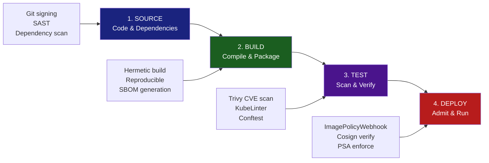

# Chapter 1: Overview of Supply Chain Security

## Why This Matters for CKS

Supply Chain Security accounts for approximately **20% of the CKS exam weight** — the same as Microservice Vulnerabilities. The exam tests whether you can prevent insecure software from entering your cluster in the first place. Where the Microservice Vulnerabilities module was about securing what's *already running*, this module is about securing what you *allow to run*.

The CKS exam specifically tests:
- Scanning container images for vulnerabilities (Trivy).
- Enforcing image policies (ImagePolicyWebhook, OPA Gatekeeper).
- Minimising container image attack surface (distroless, multi-stage builds).
- Understanding SBOM formats and their role in vulnerability disclosure.
- Static analysis of Kubernetes manifests (KubeLinter).

This chapter sets the conceptual foundation for everything that follows in the module.

---

## What Is Supply Chain Security?

A **software supply chain** is the complete set of steps, tools, people, and dependencies that transform an idea into software running in production. Just as a physical product supply chain runs from raw materials to store shelf, a software supply chain runs from source code to running pod.

The core insight of supply chain security is this:

> **You cannot fully secure a system if you don't control the integrity of every component that goes into it.**

This was not always obvious. For years, security teams focused on the perimeter — firewalls, intrusion detection, runtime monitoring. Supply chain security asks a harder question: **what if the attack happened before the software ever reached your cluster?**

---

## The Factory Assembly Line Analogy

KodeKloud uses a factory analogy that maps precisely to Kubernetes deployments. Understanding this mapping is fundamental:


The four phases shown above map directly to the Kubernetes software supply chain:

```
Physical Factory                    Kubernetes Software Supply Chain
─────────────────────────────────────────────────────────────────────
Raw material suppliers         →    Open-source dependencies (npm, pip, apt)
Receiving & inspection         →    Dependency scanning (Trivy, Snyk, OWASP DC)
Component assembly             →    Container image build (Dockerfile, kaniko)
Intermediate QA checks         →    CI/CD pipeline tests + SAST + lint
Quality assurance testing      →    DAST, integration tests, security scans
Packaging & tamper-proof seal  →    Image signing (Cosign, Notary2)
Secure logistics / delivery    →    Signed admission to cluster (ImagePolicyWebhook)
Shelf / customer delivery      →    Running pod in production namespace
```

If any stage in this chain is compromised, everything downstream inherits the compromise — even if the downstream stages are perfectly secured. A backdoored dependency that passes all tests will make it all the way to production.

---

## Why Supply Chain Attacks Are the Most Dangerous

Traditional attacks target **your** infrastructure. Supply chain attacks target the **software you trust**. This distinction is critical because:

1. **You can't patch what you can't see.** If a malicious package was introduced at the dependency level, static firewalls and runtime policies won't catch it — the malware is inside a "trusted" process.

2. **Scale of impact.** A single compromised library or base image affects every organisation using it simultaneously.

3. **Long dwell time.** SolarWinds was compromised for 9–14 months before discovery. Attackers deliberately stay quiet.

4. **Bypasses zero-trust.** mTLS, NetworkPolicy, and RBAC protect against external attackers. A supply chain attack gives the attacker code running inside your trust boundary from day one.

---

## Real-World Supply Chain Attacks — Learning from History

Understanding real attacks builds intuition for what the controls in this module actually prevent.

### Attack 1: SolarWinds (2020) — Build System Compromise

**What happened:** Attackers compromised SolarWinds' Orion build system. They injected malicious code (`SUNBURST`) into the legitimate software build process. The resulting signed `.dll` file was shipped to 18,000+ organisations as a legitimate update.

**Why it was devastating:** The software was genuinely signed by SolarWinds' valid certificate. Every security scanner approved it. The backdoor was inside the binary before anyone outside the build system could see it.

**Kubernetes equivalent:** If your CI/CD build server is compromised, every container image it produces — regardless of your Dockerfile — could contain injected malicious code. The image would pass Trivy vulnerability scans because Trivy doesn't detect injected binaries, only known CVEs in known packages.

**Mitigation:**
- Hermetic, isolated build environments (no outbound internet access during build).
- Reproducible builds — same inputs always produce byte-identical outputs.
- SLSA Level 3+: build provenance tied to a specific, audited build system.

### Attack 2: Log4Shell (2021) — Dependency Vulnerability

**What happened:** CVE-2021-44228 — a critical remote code execution vulnerability in Apache Log4j 2.x (a Java logging library). Because Log4j is a transitive dependency in thousands of Java applications, organisations didn't even know they were running it.

**Why it was devastating:** Most affected teams had no idea Log4j was in their container images. Nobody had inventoried their dependencies. The attack surface was invisible.

**Kubernetes equivalent:** A container image built from `openjdk:17` + your application code silently includes Log4j as a transitive dependency. Without Trivy scanning and an SBOM, you can't detect or patch it.

**Mitigation:**
- SBOM (Software Bill of Materials) — Chapter 3. An SBOM makes every dependency visible.
- Trivy image scanning in CI/CD — Chapter 10. Known CVEs are caught before deployment.
- Distroless/minimal base images — Chapter 4. Fewer packages = smaller attack surface.

### Attack 3: XZ Utils (2024) — Social Engineering + Backdoor

**What happened:** A contributor named "Jia Tan" spent 2 years building trust in the XZ Utils open-source project. After gaining maintainer privileges, they injected a sophisticated backdoor (CVE-2024-3094) into versions 5.6.0 and 5.6.1. The backdoor targeted SSH authentication via systemd on certain Linux distributions.

**Why it matters for Kubernetes:** XZ Utils is included in many popular Linux base images. Any container built from an affected Debian or Fedora base image during that window would contain the backdoor. A single base image vulnerability can affect every microservice in a cluster.

**Kubernetes mitigation:**
- Pin base images to specific digest hashes (`FROM debian@sha256:abc123...`), not tags.
- Minimise base image footprint (distroless images don't include XZ Utils at all).
- Regular SBOM regeneration — if the base image changes, the SBOM diff reveals new packages.
- Cosign signature verification — verify the base image publisher's signature before building.

### Attack 4: Codecov (2021) — CI/CD Tool Compromise

**What happened:** Attackers gained access to Codecov's (a code coverage tool) Docker image and modified a bash script (`bash uploader`) that many CI/CD pipelines download and run directly. The script was modified to exfiltrate environment variables — including CI/CD secrets and API tokens.

**Why it matters for Kubernetes:** Many CI/CD pipelines use `curl | bash` to install tools. This pattern downloads and executes untrusted code with whatever privileges the CI system has — including access to Kubernetes registry credentials, kubeconfig, and signing keys.

**Mitigation:**
- Never use `curl | bash` in CI pipelines. Pin tool versions and verify checksums.
- Use pinned Docker image digests for CI pipeline tools.
- Rotate credentials if CI environment variables were potentially exposed.

---

## The Four Stages of Kubernetes Supply Chain Security

The KodeKloud source outlines four stages. Here they are, expanded with the Kubernetes-specific tools and controls for each:




### Stage 1: Source — Where Code Is Written

This is the origin of trust. A compromised source stage undermines everything downstream.

**Threats at this stage:**
- Malicious dependencies added to `package.json`, `requirements.txt`, `go.mod`.
- Typosquatting: `reqeusts` (instead of `requests`) on PyPI.
- Dependency confusion: private package names shadowed by public packages.
- Compromised developer workstations pushing backdoored code.
- Secrets committed to Git history.

**Controls:**
```bash
# 1. Signed commits — every commit cryptographically tied to a developer
git config --global commit.gpgsign true
git config --global user.signingkey <GPG-KEY-ID>

# 2. Branch protection — require signed commits + PR reviews
# GitHub: Settings → Branches → Require signed commits

# 3. Dependency scanning in pre-commit
# .pre-commit-config.yaml
repos:
- repo: https://github.com/aquasecurity/trivy
  hooks:
  - id: trivy-filesystem
    args: ["--exit-code", "1", "--severity", "CRITICAL"]

# 4. Secret detection
# Tools: truffleHog, gitleaks, GitHub Secret Scanning
gitleaks detect --source .

# 5. SAST (Static Application Security Testing)
# Tools: semgrep, SonarQube, CodeQL
semgrep --config auto .
```

**SLSA Source requirements (Level 2+):**
- All changes must be reviewed by a person other than the author.
- Source must be version-controlled.
- Changes must have an associated change history.

### Stage 2: Build — Where Code Becomes a Container Image

The build stage is where source code plus dependencies become the container image that will run in your cluster.

**Threats at this stage:**
- Compromised build server injects code (SolarWinds model).
- Insecure Dockerfile: running as root, including dev tools in production image.
- Non-reproducible builds: same Dockerfile can produce different images at different times.
- Unverified base images pulled from public registries without signature check.
- Build cache poisoning: a cached layer contains a malicious package.

**Controls:**

```dockerfile
# Secure Dockerfile practices

# 1. Multi-stage build — builder stage (has tools) vs final stage (minimal)
FROM golang:1.22-alpine AS builder
WORKDIR /app
COPY go.mod go.sum ./
RUN go mod download
COPY . .
RUN CGO_ENABLED=0 go build -o myapp ./cmd/main.go

# Final stage: distroless (no shell, no package manager)
FROM gcr.io/distroless/static:nonroot
COPY --from=builder /app/myapp /myapp
USER nonroot:nonroot
ENTRYPOINT ["/myapp"]

# 2. Pin base image by digest — immune to tag mutation
FROM debian@sha256:aadf4d9dbb04f5f87c1b9b7c2c3a0b3a9e8c5a1d2e3f4...
# NOT: FROM debian:bookworm  ← tag can change without warning

# 3. Minimal packages only — no apt-get install curl wget in production
```

```bash
# 4. Build provenance with SLSA (using GitHub Actions + slsa-github-generator)
# Produces signed provenance: who built it, when, from which commit

# 5. Kaniko for rootless image builds in Kubernetes CI
# Builds OCI images without Docker daemon (no privileged container needed)
kubectl apply -f kaniko-build-job.yaml
```

**SBOM generation at build time:**
```bash
# Syft generates SBOM at build time
syft scan <image>:<tag> -o spdx-json > sbom.spdx.json

# Store SBOM alongside image in registry
cosign attach sbom --sbom sbom.spdx.json <image>:<tag>
```

### Stage 3: Test — Where Vulnerabilities Are Caught

The test stage is the quality gate before code reaches production. In a secure supply chain, it must be impossible to deploy without passing this stage.

**What to test:**
- Known CVEs in OS packages and application dependencies (Trivy — Chapter 10).
- Kubernetes manifest security (KubeLinter — Chapter 7).
- Policy compliance (conftest with Rego rules).
- Secrets accidentally embedded in images (`docker history`, `dive`).
- Image signature verification.

```bash
# Trivy — CVE scanning
trivy image myapp:v1.2.3 --severity HIGH,CRITICAL --exit-code 1
# exit-code 1 fails the CI pipeline if HIGH/CRITICAL CVEs found

# KubeLinter — manifest security analysis
kube-linter lint deployment.yaml
# Catches: missing resource limits, missing securityContext, latest tag, etc.

# Conftest — OPA policy testing for manifests
conftest test deployment.yaml --policy ./policies/

# Cosign — verify image signature before test run
cosign verify --key cosign.pub myapp:v1.2.3
# Fail if signature missing or invalid

# Check for embedded secrets in image layers
docker run --rm -v /var/run/docker.sock:/var/run/docker.sock \
  aquasec/trivy image --scanners secret myapp:v1.2.3
```

**Admission gate — nothing untested reaches the cluster:**
```
CI/CD Pipeline gate:
  1. trivy scan → CRITICAL CVEs → FAIL (stop here)
  2. kube-linter → privilege issues → FAIL (stop here)
  3. cosign sign → attach provenance
  4. push to approved registry
  5. → deploy to staging
  6. integration tests
  7. → deploy to production (ImagePolicyWebhook enforces signed-only)
```

### Stage 4: Deploy — Where Security Is Enforced at Runtime Admission

The deploy stage is the **last line of defence** before code runs in your cluster. Even if every previous stage was perfect, you need to enforce rules at admission to catch anything that bypasses CI/CD (manual `kubectl apply`, drift, etc.).


**Controls at deploy stage:**

```yaml
# 1. ImagePolicyWebhook — only allow images from approved registries
#    (Chapter 9 — detailed configuration)
# Enforces: must come from registry.company.com, must be signed

# 2. OPA Gatekeeper — enforce image policies
apiVersion: constraints.gatekeeper.sh/v1beta1
kind: K8sAllowedRepos
metadata:
  name: allowed-registries
spec:
  parameters:
    repos:
    - "registry.company.com/"
    - "gcr.io/distroless/"
  match:
    kinds:
    - apiGroups: [""]
      kinds: ["Pod"]

# 3. Pod Security Admission — enforce restricted profile
# (NOT Pod Security Policies — PSP was removed in K8s 1.25)
kubectl label namespace production \
  pod-security.kubernetes.io/enforce=restricted

# 4. Cosign admission verification (via Policy Controller)
apiVersion: policy.sigstore.dev/v1beta1
kind: ClusterImagePolicy
metadata:
  name: require-signed-images
spec:
  images:
  - glob: "registry.company.com/**"
  authorities:
  - keyless:
      url: https://fulcio.sigstore.dev
      identities:
      - issuer: https://token.actions.githubusercontent.com
        subjectRegExp: "https://github.com/myorg/.*"
```

> ⚠️ **Important correction from KodeKloud source:** The KodeKloud notes mention "Pod Security Policies" for deployment security. **PSP was deprecated in Kubernetes 1.21 and permanently removed in 1.25.** In all modern Kubernetes clusters (1.25+), use **Pod Security Admission (PSA)** with `pod-security.kubernetes.io/enforce=restricted` namespace labels instead. Never configure PSP in a new cluster.

---

## The SLSA Framework — A Standard for Supply Chain Integrity

**SLSA** (Supply chain Levels for Software Artifacts, pronounced "salsa") is a security framework from Google and the OpenSSF (Open Source Security Foundation) that defines progressively stronger supply chain security guarantees.

```
SLSA Level   What It Guarantees
─────────────────────────────────────────────────────────────────
Level 0      No guarantees (baseline — most software here today)

Level 1      Build process documented; provenance available
             (Who built it, when, from what source)

Level 2      Build process uses a hosted CI system (GitHub Actions,
             GitLab CI); provenance is signed by the CI system

Level 3      Build is hermetic (no network, no external state);
             provenance is non-falsifiable; source reviewed

Level 4*     Two-party review; hermetic + reproducible builds;
             (Highest standard — very few projects achieve this)
             *SLSA v0.1 had Level 4; SLSA v1.0 restructured to Tracks
```

**SLSA v1.0** (current) restructured into two tracks:
- **Build Track** (Levels 1–3): provenance and build integrity.
- (Future tracks planned for Source and Dependencies.)

**What SLSA means for Kubernetes:**
```bash
# A SLSA Level 2 build produces a provenance attestation:
{
  "subject": [{"name": "registry.io/myapp", "digest": {"sha256": "abc..."}}],
  "predicateType": "https://slsa.dev/provenance/v1",
  "predicate": {
    "buildDefinition": {
      "buildType": "https://actions.github.io/buildtypes/workflow/v1",
      "externalParameters": {
        "workflow": {"ref": "refs/heads/main", "repository": "https://github.com/myorg/myapp"}
      }
    },
    "runDetails": {
      "builder": {"id": "https://github.com/actions/runner"},
      "buildMetadata": {"finishedOn": "2025-01-15T10:00:00Z"}
    }
  }
}

# Verify provenance before deploying
slsa-verifier verify-image registry.io/myapp:v1.2.3 \
  --source-uri github.com/myorg/myapp \
  --source-tag v1.2.3
```

---

## Benefits of Supply Chain Security — Expanded


KodeKloud lists five benefits. Here's a deeper explanation of each plus additional ones:

### Early Vulnerability Detection

When scanning happens at build time (Stage 2-3), you find CVEs before they reach production. The cost of fixing a vulnerability grows exponentially the later it's found:

```
Cost to fix a vulnerability:
  Design time:     1x
  Development:     6x
  Testing:         15x
  Production:      100x+
  After breach:    1000x+ (regulatory fines, remediation, reputational damage)
```

Trivy + CI gate prevents the 100x and 1000x scenarios.

### Optimised Resource Management

Without supply chain security, security incidents cause unplanned work: emergency patching, incident response, rollbacks, post-mortems. This steals engineering time from planned work. A functioning supply chain moves security effort **left** (cheaper, planned) rather than **right** (expensive, reactive).

### Improved Compliance

Regulations increasingly mandate supply chain controls:
- **NIST SP 800-218 (SSDF):** Requires documented, secure development processes.
- **Executive Order 14028 (US):** Mandates SBOM for software sold to US federal government.
- **EU Cyber Resilience Act (2024):** Requires SBOM and vulnerability disclosure for software sold in the EU.
- **PCI DSS v4.0:** Requires software composition analysis and vulnerability management.

### Efficient Incident Response

When Log4Shell hit, organisations *with SBOMs* knew within hours which containers were affected. Organisations *without SBOMs* spent days or weeks manually checking thousands of images.

```
With SBOM:
  1. CVE-2021-44228 announced (log4j affected)
  2. Query SBOM database: "which images contain log4j-core?"
  3. Get list in seconds
  4. Patch those images and redeploy

Without SBOM:
  1. CVE-2021-44228 announced
  2. Manually check every Dockerfile and dependency tree
  3. Weeks of work, uncertain coverage
  4. Miss transitive dependencies
```

### Enhanced Overall Security Posture

Supply chain security creates a **verifiable chain of custody**: every artifact can be traced back to a specific commit, built by a specific CI system, at a specific time. This is the digital equivalent of a tamper-evident seal on a physical product.

### Trust Establishment (Additional Benefit)

Customers and partners increasingly ask for security attestations. Having a documented supply chain with SBOMs, signed images, and SLSA provenance is a competitive advantage and a requirement for enterprise sales.

---

## The Kubernetes-Specific Supply Chain Threat Model

General supply chain threats apply to all software, but Kubernetes has unique characteristics that introduce additional risks:

```
Kubernetes-specific supply chain threats:

1. Public container registry images
   ├── docker.io images often run as root with full capabilities
   ├── No security scanning requirement to publish to Docker Hub
   └── Tag mutation: redis:7 today ≠ redis:7 tomorrow

2. Helm chart supply chain
   ├── helm install my-app stable/my-app pulls unverified templates
   ├── Helm charts can render arbitrary RBAC and privileged containers
   └── Chart museum / ArtifactHub has no mandatory security scanning

3. Operator lifecycle
   ├── Operators run with cluster-admin or broad ClusterRole
   ├── Operator images from OperatorHub may be poorly maintained
   └── Operator CRDs can trigger privileged pod creation

4. Init container / sidecar injection
   ├── Mutating webhooks inject sidecars into your pods
   ├── A compromised webhook = every pod gets a malicious sidecar
   └── Verify webhook image signatures and restrict webhook namespaces

5. CI/CD pipeline images
   ├── Your build pipeline uses kaniko, kube-score, etc.
   ├── These images run with cluster access during build
   └── Pin digests, not tags, for all CI tool images
```

---

## The Supply Chain Security Mindset

The single most important mental shift for a Kubernetes security engineer thinking about supply chain:

```
Old mindset: "Secure the cluster perimeter"
  → Assume software arriving at the cluster is trustworthy
  → Focus: firewalls, NetworkPolicy, RBAC

New mindset: "Trust nothing — verify everything"
  → Assume any artifact could be compromised
  → Verify: signature, provenance, SBOM, CVE scan
  → Enforce: admission controls reject anything unverified
  → Monitor: runtime detection for unexpected behaviour (Falco)
```

This is the **zero-trust software supply chain** model, and it underlies every chapter in this module.

---

## Module Map — What Each Chapter Covers

This module contains 10 chapters that progressively build the complete supply chain security stack:

| Chapter | Title | What It Solves |
|---------|-------|---------------|
| **Ch. 1** | Overview of Supply Chain Security | Mental model, SLSA, real attacks |
| **Ch. 2** | Risks of Inadequate Supply Chain Management | Attack taxonomy, cost of inaction |
| **Ch. 3** | What Is SBOM and Why It's Important | Software inventory and CVE traceability |
| **Ch. 4** | Minimize Base Image Footprint | Reducing attack surface at the image layer |
| **Ch. 5** | SBOM Format | SPDX vs CycloneDX, tooling comparison |
| **Ch. 6** | SBOM Workflow | Integration into CI/CD pipeline |
| **Ch. 7** | Introduction to KubeLinter | Static analysis of Kubernetes manifests |
| **Ch. 8** | Image Security | Image signing, Cosign, trust policies |
| **Ch. 9** | Whitelist Allowed Registries — ImagePolicyWebhook | Enforcing registry restrictions at admission |
| **Ch. 10** | Scan Images for Known Vulnerabilities — Trivy | CVE scanning workflow and CI integration |

---

## Common Mistakes

### Mistake 1: Treating Supply Chain Security as a One-Time Audit

```
Wrong approach:
  "We scanned all our images in January. We're secure."

Reality:
  - New CVEs are published daily (NVD: ~25,000/year)
  - A clean scan today ≠ clean scan tomorrow
  - Continuous scanning (weekly or per-deployment) is required

Right approach:
  - Scan on every build (Trivy in CI)
  - Schedule weekly scans of production images (even if not rebuilt)
  - Subscribe to security advisories for your key dependencies
```

### Mistake 2: Pinning Tags Instead of Digests

```bash
# WRONG — "latest" or a version tag can change without warning
FROM nginx:latest
FROM python:3.11

# RIGHT — immutable reference (SHA-256 digest)
FROM nginx@sha256:c8a861b8a1eeef6d48955a9be852e7b2ceed7bbf4c9e2b7d6b0a5d98e12f4c1
FROM python@sha256:b4d8c89a2f1e0c7d9e4a3b2f1c0d8e7a6b5c4d3e2f1a0b9c8d7e6f5a4b3c2
```

### Mistake 3: Scanning Only the Final Image

Many teams scan the final layer of their container image but miss vulnerabilities in:
- Base image OS packages (scan with `--severity ALL`).
- Language-level dependencies (`package-lock.json`, `go.sum`).
- Configuration files embedded in the image.
- Secrets accidentally committed to the image during development.

```bash
# Comprehensive Trivy scan
trivy image \
  --severity UNKNOWN,LOW,MEDIUM,HIGH,CRITICAL \
  --scanners vuln,secret,config \
  myapp:v1.2.3
```

### Mistake 4: Conflating Image Scanning with Image Signing

- **Scanning** detects known CVEs in existing packages. It cannot detect injected backdoors.
- **Signing** proves the image came from a trusted builder at a trusted time. It cannot detect CVEs.

You need both. An image can be perfectly signed (proving it came from your CI) but still contain a critical CVE. An image can be CVE-free but unsigned (no proof it came from your build system).

### Mistake 5: Ignoring the Helm and Operator Supply Chain

Most Kubernetes security programmes scan application images but forget:
- Helm chart `values.yaml` can override image references to pull from arbitrary registries.
- Operators use their own images with broad RBAC — often running as cluster-admin.
- `kubectl apply -f https://raw.githubusercontent.com/...` is a `curl | bash` equivalent.

**Fix:** Treat Helm charts, operators, and manifests from URLs the same as application images — require them to pass the same security gates.

---

## Quick Reference

### Supply Chain Security Tools Landscape

| Category | Tool | Purpose | Chapter |
|----------|------|---------|---------|
| SBOM generation | Syft, cdxgen | Generate SBOM from image or filesystem | 5, 6 |
| CVE scanning | Trivy, Grype, Clair | Detect known vulnerabilities | 10 |
| Secret detection | Trivy, truffleHog, gitleaks | Find secrets in images/repos | 10 |
| Image signing | Cosign, Notary2 | Cryptographically sign images | 8 |
| Manifest linting | KubeLinter, kube-score | Detect insecure K8s configs | 7 |
| Policy as code | Conftest + OPA | Enforce custom policies in CI | (OPA module) |
| Registry control | ImagePolicyWebhook | Restrict allowed registries | 9 |
| Provenance | SLSA + slsa-verifier | Verify build provenance | 1 (this chapter) |
| Dependency audit | OWASP Dependency-Check, Snyk | Application dependency CVEs | CI/CD integration |

### SLSA Level Quick Reference

| Level | Key Requirement | Who Can Achieve |
|-------|----------------|----------------|
| 0 | None | Everyone (default) |
| 1 | Provenance generated | Small teams with CI |
| 2 | Provenance signed by hosted CI | Teams using GitHub Actions/GitLab CI |
| 3 | Hermetic build + non-falsifiable provenance | Mature DevSecOps orgs |

### The Four Stages Cheat Sheet

```
STAGE 1: SOURCE
  Controls: Signed commits, SAST, dependency scanning, secret detection
  Tools: gitleaks, semgrep, OWASP DC, Snyk

STAGE 2: BUILD
  Controls: Hermetic builds, pinned base images, multi-stage Dockerfile, SBOM gen
  Tools: kaniko, Syft, Cosign (sign), Docker BuildKit

STAGE 3: TEST
  Controls: CVE scan, manifest lint, policy check, signature verify
  Tools: Trivy, KubeLinter, conftest, Cosign (verify)

STAGE 4: DEPLOY
  Controls: Registry allowlist, admission validation, PSA enforcement
  Tools: ImagePolicyWebhook, OPA Gatekeeper, PSA labels, Sigstore Policy Controller
```

---

## CKS Exam Tips

1. **PSP is gone:** Never write a PodSecurityPolicy in your exam answers unless the question explicitly mentions a K8s version < 1.25. Use PSA (`pod-security.kubernetes.io/enforce=restricted`) for all deployment security questions.

2. **Supply chain = build-time security:** When the exam says "prevent vulnerable images from being deployed," think Trivy (scan) + ImagePolicyWebhook (enforce). Both together — scanning catches CVEs, webhooks catch unscanned/unregistered images.

3. **Know the tool for each layer:**
   - Image CVEs → Trivy
   - Manifest security → KubeLinter
   - Registry restriction → ImagePolicyWebhook + OPA Gatekeeper
   - Image signing → Cosign (sigstore)
   - Software inventory → SBOM (Syft/SPDX)

4. **The exam doesn't ask about SLSA configuration** — but understanding SLSA helps you answer architecture/design questions about "how do you ensure image integrity end-to-end."

5. **Trivy is the exam favourite:** Know `trivy image <image>`, `--severity`, `--exit-code 1`, and `--scanners vuln,secret`. Expect at least one Trivy task.

---

## Summary

Supply chain security is the practice of ensuring every component that enters your Kubernetes cluster — source code, dependencies, base images, build tools, and manifests — can be verified, traced, and trusted. It is the answer to the question: **"How do we know this software is what we think it is?"**

The four-stage model (Source → Build → Test → Deploy) mirrors the physical factory analogy but translates it into concrete Kubernetes controls: signed commits, hermetic builds, Trivy scanning, and ImagePolicyWebhook enforcement. Real attacks like SolarWinds, Log4Shell, and XZ Utils demonstrate that compromising any one stage can affect thousands of downstream organisations.

Modern standards like SLSA provide a common language for measuring supply chain maturity. The controls in this module — SBOM, distroless images, KubeLinter, image signing, Trivy, and admission webhooks — collectively implement SLSA Level 2–3 guarantees in a Kubernetes environment.

---

## What's Next

Chapter 2 examines the specific **risks** that emerge when supply chain management is inadequate — the attack vectors, the blast radius of each, and the cost models that make the business case for the controls introduced throughout this module. Understanding the risk taxonomy helps you prioritise which controls to implement first in a resource-constrained environment.
