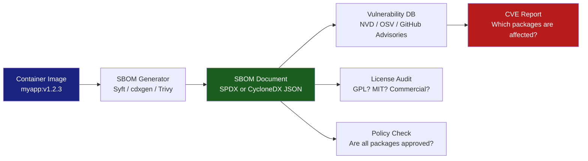
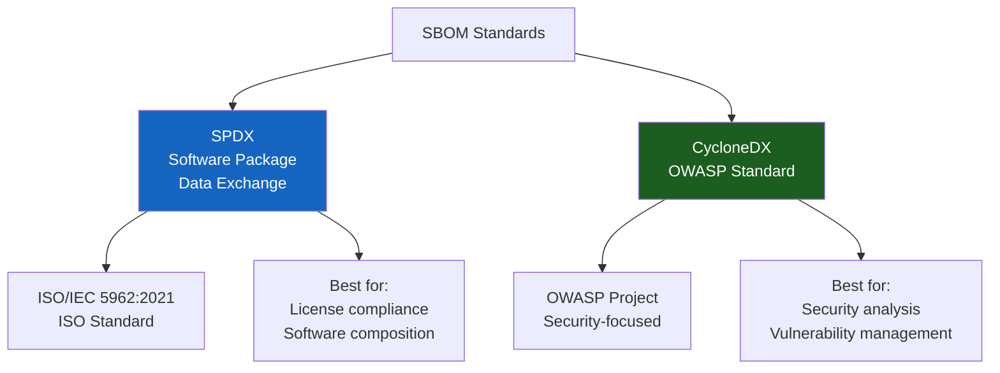
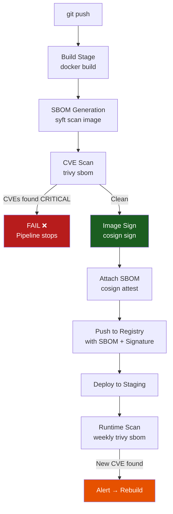

# Chapter 3: What Is SBOM and Why It's Important

## Why This Matters for CKS

An SBOM (Software Bill of Materials) is the foundational tool that makes everything else in supply chain security possible. Without an SBOM, you are flying blind — you don't know what's in your containers, and you can't assess impact when a CVE is announced. With an SBOM, you can answer "are we affected by Log4Shell?" in seconds.

The CKS exam tests SBOM at a conceptual level — you need to understand what it is, what formats it comes in, and how it connects to vulnerability scanning (Trivy), image signing (Cosign), and CI/CD pipelines. You won't be asked to hand-write SPDX JSON, but you will be expected to generate SBOMs using tools and explain their security value.

---

## What Is an SBOM?

A **Software Bill of Materials (SBOM)** is a **machine-readable, structured inventory of every component** that makes up a software artifact — including direct dependencies, transitive dependencies, OS packages, and the relationships between them.

The recipe analogy from KodeKloud is precise and worth extending:

```
Food Label / Recipe          SBOM Equivalent
──────────────────────────────────────────────────────
Ingredient list              Component list (packages, libraries)
Ingredient quantities        Component versions
Allergen warnings            Known CVEs / vulnerabilities
Nutritional information      License types (GPL, MIT, Apache)
Expiry date                  Last updated / patch status
Manufacturer info            Supplier / originator
Batch number                 Package hash / PURL (Package URL)
Country of origin            Source repository / download location
```

Just as you wouldn't knowingly serve food with undisclosed allergens, you shouldn't deploy software with undisclosed vulnerabilities. The SBOM makes the invisible visible.



---

## The SBOM Concept — KodeKloud Visual


The six dimensions in this image map to specific SBOM fields:

| Visual Element | SBOM Field | Example Value |
|---------------|-----------|---------------|
| Software Composition | `packages[]` | openssl, curl, log4j-core |
| Supplier Details | `supplier`, `originator` | Apache Software Foundation |
| Security Vulnerabilities | `externalRefs[SECURITY]` | CVE-2021-44228, CPE identifier |
| Licenses | `licenseDeclared`, `licenseConcluded` | GPL-3.0, MIT, Apache-2.0 |
| Versions | `versionInfo` | 3.8-5, 2.14.1 |
| Patch Status | Cross-referenced with NVD | Fixed in 2.17.0, No fix available |

---

## Why SBOMs Became Mandatory — The Regulatory Push

SBOMs moved from a security best practice to a regulatory requirement between 2021 and 2024:

### US Executive Order 14028 (May 2021)

The Biden administration's Executive Order on Improving the Nation's Cybersecurity directly required SBOM for any software sold to the US federal government:

> *"The term 'Software Bill of Materials' or 'SBOM' means a formal record containing the details and supply chain relationships of various components used in building software."*

**Impact on Kubernetes workloads:** Any organisation selling software-as-a-service to US federal agencies must provide SBOMs for their container images. This drove mainstream adoption of tools like Syft and cdxgen.

### EU Cyber Resilience Act (CRA) — 2024

The EU CRA, which entered into force in 2024, requires manufacturers of "products with digital elements" sold in the EU to:
- Maintain an SBOM for each product.
- Actively monitor and disclose vulnerabilities.
- Provide security updates for the product's expected lifetime.

**Scope:** Covers all software and hardware products with network connectivity — including Kubernetes operators, Helm charts, and any SaaS product with an EU user base.

**Non-compliance penalty:** Up to €15 million or 2.5% of global annual revenue.

### NIST SP 800-218 (SSDF) and NIST SP 800-161

The NIST Secure Software Development Framework (SSDF) and NIST Cybersecurity Supply Chain Risk Management (C-SCRM) both require SBOM as a component of secure software development and supply chain risk management.

### Summary Table

| Regulation | Jurisdiction | SBOM Required | Penalty for Non-compliance |
|-----------|-------------|---------------|--------------------------|
| EO 14028 | USA (federal contracts) | Yes | Loss of federal contracts |
| EU Cyber Resilience Act | European Union | Yes | €15M or 2.5% revenue |
| NIST SSDF | USA (best practice) | Recommended | N/A (voluntary) |
| PCI DSS v4.0 | Global (payment industry) | Recommended | Loss of PCI certification |
| FDA SBOM Guidance | USA (medical devices) | Yes (medical software) | FDA rejection |

---

## Key Benefits of SBOM


### Benefit 1: Improved Transparency in Software Composition

Without an SBOM, answering "what exactly is in this container?" requires reverse engineering the image layers — a slow, error-prone process that misses transitive dependencies.

```bash
# Without SBOM — you have to guess:
docker inspect myapp:v1.2.3
# Shows: layers, env vars, entrypoint — NOT individual packages

docker history myapp:v1.2.3
# Shows: Dockerfile commands — NOT transitive deps

# With SBOM — instant complete answer:
syft scan myapp:v1.2.3 -o table
# NAME               VERSION    TYPE
# openssl            3.0.11     deb
# libssl3            3.0.11     deb
# python3            3.11.6     deb
# requests           2.31.0     python
# urllib3            2.0.7      python
# cryptography       41.0.5     python
# log4j-core         2.14.1     java-archive   ← This is the problem
# ... (200+ more entries)
```

Transparency means your security team, compliance team, and customers can all independently verify what's inside your software.

### Benefit 2: Quicker Incident Response During Security Events

This is the most immediately valuable benefit. When a new CVE is announced, the first question is always: **"Are we affected?"**

**Without SBOM — Log4Shell (CVE-2021-44228) response:**
```
Hour 0:  CVE announced — critical RCE in log4j-core
Hour 2:  Security team asks engineering: "Are we using log4j?"
Hour 4:  Engineering starts checking Dockerfiles manually
Hour 8:  "We don't see log4j in our Dockerfiles..."
Hour 24: Someone discovers it's a transitive dependency of spring-boot
Hour 48: Still not sure which of 50 services are affected
Hour 72: Emergency patches applied — but did we get everything?
Week 2:  Another service found to be affected — missed in manual audit
```

**With SBOM — Log4Shell response:**
```bash
# Hour 0: CVE announced
# Hour 0.1: Query SBOM database for all images containing log4j-core
grype db update
for image in $(cat production-images.txt); do
  grype sbom:sboms/${image//\//-}.spdx.json | grep log4j
done
# Instant output: services/payment-api, services/order-processor, services/email-sender

# Hour 1: Patch those 3 services, rebuild, redeploy
# Hour 2: Confirmed clean — no other services affected
# Time saved: 70+ hours of manual investigation
```

### Benefit 3: Efficient Management of Software Dependencies

SBOMs don't just help in emergencies — they enable proactive dependency hygiene:

```bash
# Find all components older than 1 year (outdated dependency risk)
syft scan myapp:v1.2.3 -o spdx-json | \
  jq '.packages[] | select(.versionInfo) | {name: .name, version: .versionInfo}'

# Identify all GPL-licensed components (license compliance)
syft scan myapp:v1.2.3 -o spdx-json | \
  jq '.packages[] | select(.licenseDeclared | test("GPL"; "i")) | {name, license: .licenseDeclared}'
# Critical: GPL components may require you to open-source your application

# Find packages with no known maintainer (abandoned dependency risk)
syft scan myapp:v1.2.3 -o cyclonedx-json | \
  jq '.components[] | select(.supplier == null) | .name'
```

### Benefit 4: Enhanced Security Through Detailed Vulnerability Tracking

An SBOM connects to vulnerability databases to give you a real-time view of your risk:

```bash
# Grype: cross-reference SBOM against multiple vulnerability databases
grype sbom:myapp.spdx.json

# Output:
# NAME         INSTALLED   FIXED-IN    TYPE          VULNERABILITY   SEVERITY
# openssl      3.0.11      3.0.12      deb           CVE-2023-5678   HIGH
# urllib3      2.0.7       2.0.8       python        CVE-2023-43804  MEDIUM
# log4j-core   2.14.1      2.17.0      java-archive  CVE-2021-44228  CRITICAL

# SEVERITY COUNTS: CRITICAL=1, HIGH=1, MEDIUM=1, LOW=5, NEGLIGIBLE=12
```

**Vulnerability databases Grype/Trivy query:**
| Database | Coverage | URL |
|----------|---------|-----|
| NVD (National Vulnerability Database) | All languages | nvd.nist.gov |
| OSV (Open Source Vulnerabilities) | Open source packages | osv.dev |
| GitHub Security Advisories | Language ecosystems | github.com/advisories |
| Alpine Linux SecDB | Alpine packages | secdb.alpinelinux.org |
| Debian Security | Debian/Ubuntu packages | security.debian.org |
| RedHat CSAF | RHEL/UBI packages | access.redhat.com |

### Benefit 5: Easier Compliance With Regulatory Standards

```bash
# License compliance report from SBOM
syft scan myapp:v1.2.3 -o spdx-json | \
  jq '[.packages[] | {name, version: .versionInfo, license: .licenseDeclared}] |
  group_by(.license) |
  map({license: .[0].license, packages: map(.name)})' > license-report.json

# Example output:
# [
#   {"license": "MIT", "packages": ["requests", "click", "pydantic"]},
#   {"license": "Apache-2.0", "packages": ["flask", "boto3"]},
#   {"license": "GPL-3.0-only", "packages": ["grep", "tar"]},  ← Review needed
#   {"license": "LGPL-2.1", "packages": ["glibc"]}             ← Dynamic link OK
# ]
```

---

## The SBOM JSON Example — Anatomy of a Record

The KodeKloud source provides an excellent SPDX JSON example for the `grep` package. Let's dissect every field:

```json
{
  "package": {
    "name": "grep",
    "SPDXID": "SPDXRef-Package-deb-grep-a8613391d2f5a59d",
    "versionInfo": "3.8-5",
    "supplier": "Person: Anibal Monsalve Salazar (anibal@debian.org)",
    "originator": "Person: Anibal Monsalve Salazar (anibal@debian.org)",
    "downloadLocation": "NOASSERTION",
    "filesAnalyzed": true,
    "packageVerificationCode": {
      "packageVerificationCodeValue": "6dab867e2a9f53bf5faee39422e2c82e551ca7d8d"
    },
    "sourceInfo": "acquired package info from DPKG DB: /usr/share/doc/grep/copyright, /var/lib/dpkg/info/grep.list",
    "licenseConcluded": "NOASSERTION",
    "licenseDeclared": "GPL-3.0-only AND GPL-3.0-or-later",
    "copyrightText": "NOASSERTION",
    "externalRefs": [
      {
        "referenceCategory": "SECURITY",
        "referenceType": "cpe22Type",
        "referenceLocator": "cpe:2.3:a:grep:grep:3.8-5:*:*:*:*:*:*:*"
      },
      {
        "referenceCategory": "PACKAGE-MANAGER",
        "referenceType": "url",
        "referenceLocator": "pkg:deb/debian/grep@3.8-5?arch=amd64&distro=debian-12"
      }
    ]
  }
}
```

### Field-by-Field Explanation

| Field | What It Means | Security Use |
|-------|-------------|-------------|
| `name` | Human-readable package name | Identify which package |
| `SPDXID` | Unique identifier within this SBOM document | Reference from other packages (dependency graph) |
| `versionInfo` | `3.8-5` = grep 3.8, Debian packaging revision 5 | Match against CVE version ranges |
| `supplier` | Who packaged it (Debian maintainer here) | Trust anchor — is this from a known-good source? |
| `originator` | Who originally wrote it | Distinguish upstream author from packager |
| `packageVerificationCode` | SHA-1 hash of all file checksums | Detect tampering — if hash changes, package was modified |
| `licenseDeclared` | `GPL-3.0-only AND GPL-3.0-or-later` | Compliance — GPL requires source code disclosure |
| `externalRefs[SECURITY]` | CPE identifier: `cpe:2.3:a:grep:grep:3.8-5:...` | Links to NVD — vulnerabilities are looked up by CPE |
| `externalRefs[PACKAGE-MANAGER]` | PURL: `pkg:deb/debian/grep@3.8-5` | Universal package reference across tools |

### The CPE Identifier — How CVE Lookup Works

The **CPE (Common Platform Enumeration)** in `externalRefs` is the bridge between your SBOM and the CVE database:

```
CPE format: cpe:2.3:<part>:<vendor>:<product>:<version>:<update>:...
Example:    cpe:2.3:a:grep:grep:3.8-5:*:*:*:*:*:*:*
            ─────── ─ ──── ──── ─────
              |     |  |    |    └── version
              |     |  |    └─────── product name
              |     |  └──────────── vendor
              |     └─────────────── part (a=application)
              └───────────────────── spec version

NVD lookup: https://nvd.nist.gov/products/cpe/search?keyword=cpe:2.3:a:grep:grep:3.8
→ Returns all CVEs affecting grep 3.8
```

### The PURL — Package URL Standard

The **PURL (Package URL)** provides a universal way to identify a package across different ecosystems:

```
PURL format: pkg:<type>/<namespace>/<name>@<version>?<qualifiers>
Examples:
  pkg:deb/debian/grep@3.8-5?arch=amd64&distro=debian-12    (Debian package)
  pkg:npm/%40angular/core@12.0.0                            (npm scoped package)
  pkg:pypi/requests@2.31.0                                  (Python package)
  pkg:maven/org.apache.logging.log4j/log4j-core@2.14.1     (Java Maven)
  pkg:docker/library/nginx@sha256:abc123                    (Docker image)
  pkg:golang/github.com/gin-gonic/gin@v1.9.1               (Go module)
```

PURLs are tool-agnostic — whether you use Grype, Trivy, or Dependency-Track, they all understand PURLs.

---

## SBOM Formats — SPDX vs CycloneDX

There are two dominant SBOM standards. Understanding their differences is important for tooling decisions:



| Dimension | SPDX | CycloneDX |
|-----------|------|-----------|
| **Governing body** | Linux Foundation | OWASP |
| **ISO standard** | Yes — ISO/IEC 5962:2021 | No (ECMA TC54 in progress) |
| **Primary focus** | License compliance + composition | Security + vulnerability management |
| **Formats** | JSON, YAML, RDF, tag-value | JSON, XML, protobuf |
| **Relationship modeling** | Rich (DESCRIBES, DEPENDS_ON, GENERATED_FROM) | Good (dependencies array) |
| **Vulnerability support** | Via `externalRefs` (indirect) | Native (VEX, CVSS built-in) |
| **VEX support** | Via OpenVEX companion | Native in CycloneDX 1.5+ |
| **Tool support** | Syft, SPDX-tools, Trivy | Syft, cdxgen, Trivy, Grype |
| **US EO 14028** | Recommended (NTIA minimum) | Recommended (NTIA minimum) |
| **Kubernetes ecosystem** | Common (Syft default) | Growing (CycloneDX for security focus) |
| **Current version** | SPDX 2.3 / 3.0 | CycloneDX 1.6 |

**Which to use?**
- If your primary goal is **license compliance**: SPDX (richer license model, ISO standard).
- If your primary goal is **security/vulnerability management**: CycloneDX (VEX support, security-first design).
- For most Kubernetes security use cases: **use both** — generate SPDX for compliance, CycloneDX for vulnerability scanning.

```bash
# Syft can generate both formats:
syft scan myapp:v1.2.3 -o spdx-json > sbom.spdx.json       # SPDX format
syft scan myapp:v1.2.3 -o cyclonedx-json > sbom.cdx.json    # CycloneDX format

# Trivy also supports both:
trivy image --format spdx-json myapp:v1.2.3 > sbom.spdx.json
trivy image --format cyclonedx myapp:v1.2.3 > sbom.cdx.json
```

---

## SBOM Generation Tools

### Syft — The Kubernetes Standard

Syft (by Anchore) is the most widely used SBOM generator in the Kubernetes ecosystem. It understands container images, filesystems, and OCI archives.

```bash
# Install Syft
curl -sSfL https://raw.githubusercontent.com/anchore/syft/main/install.sh | sh -s -- -b /usr/local/bin

# Generate SBOM from a container image
syft scan myapp:v1.2.3 -o spdx-json > myapp-sbom.spdx.json

# Generate from an OCI tarball (for air-gapped environments)
docker save myapp:v1.2.3 -o myapp.tar
syft scan oci-archive:myapp.tar -o cyclonedx-json > myapp-sbom.cdx.json

# Generate from local filesystem (for scanning build context)
syft scan dir:./src -o spdx-json > src-sbom.json

# Quick table view (human-readable)
syft scan myapp:v1.2.3 -o table
# NAME              VERSION       TYPE
# alpine-baselayout 3.4.3-r1     apk
# busybox           1.36.1-r2    apk
# openssl           3.1.3-r0     apk
# ca-certificates   20230506-r0  apk
# myapp             1.2.3        go-module

# Syft detects package types automatically:
# apk (Alpine), deb (Debian/Ubuntu), rpm (RedHat), python, npm,
# gem (Ruby), jar/war (Java), go-module, cargo (Rust), nuget (.NET)
```

### cdxgen — CycloneDX Native Generator

cdxgen is the reference implementation for CycloneDX, with deep language support:

```bash
# Install
npm install -g @cyclonedx/cdxgen

# Generate from a container image
cdxgen -t docker myapp:v1.2.3 -o sbom.cdx.json

# Generate from source code (language-aware)
cdxgen -t python . -o sbom.cdx.json    # Python project
cdxgen -t java . -o sbom.cdx.json      # Java/Maven/Gradle
cdxgen -t nodejs . -o sbom.cdx.json    # Node.js
cdxgen -t go . -o sbom.cdx.json        # Go modules

# cdxgen is best for source-level SBOMs (before build)
# Syft is best for image-level SBOMs (after build)
```

### Trivy — Scanning + SBOM in One Tool

Trivy (from Aqua Security) combines vulnerability scanning and SBOM generation in a single tool — making it the most practical choice for CI/CD integration:

```bash
# Generate SBOM and scan for vulnerabilities simultaneously
trivy image \
  --format cyclonedx \
  --output sbom.cdx.json \
  myapp:v1.2.3

# Or: generate SBOM first, then scan SBOM later
trivy image --format spdx-json -o sbom.spdx.json myapp:v1.2.3
trivy sbom sbom.spdx.json --severity HIGH,CRITICAL

# Trivy can scan an existing SBOM file (without re-pulling the image)
trivy sbom sbom.cdx.json
# Useful for: scanning SBOMs from suppliers without needing the image
```

---

## Attaching SBOMs to Container Images — OCI Referrers

Modern container registries support attaching SBOMs directly to images using the **OCI Referrers API**. This means the SBOM travels with the image and is always available:

```bash
# Step 1: Generate SBOM
syft scan myapp:v1.2.3 -o spdx-json > sbom.spdx.json

# Step 2: Attach SBOM to image in registry using Cosign
cosign attach sbom \
  --sbom sbom.spdx.json \
  --type spdx \
  registry.company.com/myapp:v1.2.3

# Step 3: Sign the SBOM attestation (proves SBOM is authentic)
cosign attest \
  --predicate sbom.spdx.json \
  --type spdxjson \
  --key cosign.key \
  registry.company.com/myapp:v1.2.3

# Step 4: Verify SBOM attestation (at deploy time or by consumers)
cosign verify-attestation \
  --key cosign.pub \
  --type spdxjson \
  registry.company.com/myapp:v1.2.3 | \
  jq '.payload | @base64d | fromjson | .predicate.packages | length'
# Output: 247  ← 247 packages in this image

# Step 5: Pull and query the SBOM from the registry
cosign download sbom registry.company.com/myapp:v1.2.3 > pulled-sbom.spdx.json
```

This approach means:
- Every image in your registry has its SBOM stored alongside it.
- Consumers (downstream teams, security scanners, customers) can always retrieve the SBOM.
- The SBOM is signed — it cannot be tampered with without invalidating the signature.

---

## VEX — Vulnerability Exploitability eXchange

VEX is the companion standard to SBOM that answers: **"OK, this CVE is in my SBOM — but is it actually exploitable in our specific deployment?"**

Many CVEs in an SBOM are not actually exploitable because:
- The vulnerable code path is never called.
- The vulnerable feature is disabled by configuration.
- The vulnerability requires a code pattern not used in this application.

```
SBOM says: CVE-2023-12345 affects openssl 3.0.11 in myapp:v1.2.3

VEX statement:
{
  "vulnerability": "CVE-2023-12345",
  "product": "registry.company.com/myapp:v1.2.3",
  "status": "not_affected",
  "justification": "vulnerable_code_not_in_execute_path",
  "impact_statement": "myapp does not use TLS client authentication
                        (the vulnerable feature). The TLSv1.2 handshake
                        code path is never invoked."
}
```

**VEX statuses:**
| Status | Meaning |
|--------|---------|
| `not_affected` | CVE exists in image but is not exploitable |
| `affected` | CVE is present and exploitable — action required |
| `fixed` | CVE was present, now patched in this version |
| `under_investigation` | Team is analysing — answer pending |

```bash
# CycloneDX 1.5+ supports VEX natively
# OpenVEX is a standalone VEX specification by sigstore

# Generate a VEX document with OpenVEX tools
vexctl create \
  --product "pkg:oci/myapp@sha256:abc123" \
  --vuln "CVE-2023-12345" \
  --status "not_affected" \
  --justification "vulnerable_code_not_in_execute_path" > myapp.vex.json

# Trivy can consume VEX to suppress non-exploitable CVEs
trivy image \
  --vex myapp.vex.json \
  myapp:v1.2.3
# CVE-2023-12345 now suppressed from output (VEX says not_affected)
```

**Why VEX matters for Kubernetes teams:** Without VEX, a Trivy scan might show 50 HIGH CVEs, most of which are not exploitable in your specific container configuration. Security fatigue sets in, teams start ignoring scan results. VEX lets you document justified suppressions, reducing noise while keeping real risks visible.

---

## SBOM for Kubernetes Cluster Components

SBOMs aren't just for your application images — the Kubernetes cluster itself has a supply chain:

```bash
# Generate SBOM for official Kubernetes components
syft scan k8s.gcr.io/kube-apiserver:v1.29.0 -o spdx-json > kube-apiserver-sbom.json
syft scan k8s.gcr.io/etcd:3.5.10-0 -o spdx-json > etcd-sbom.json
syft scan k8s.gcr.io/coredns/coredns:v1.11.1 -o spdx-json > coredns-sbom.json

# The Kubernetes project publishes official SBOMs starting from v1.26:
# https://github.com/kubernetes/kubernetes/releases
# Each release includes: kubernetes-spdx.json

# Query the official Kubernetes SBOM for a specific component
curl -sL https://github.com/kubernetes/kubernetes/releases/download/v1.29.0/kubernetes-spdx.json | \
  jq '.packages[] | select(.name | test("golang"; "i")) | {name, version: .versionInfo}'
# Find which Go version Kubernetes 1.29 uses (affects Go stdlib CVEs)
```

---

## SBOM in a Complete CI/CD Pipeline



```yaml
# GitHub Actions pipeline with SBOM integration
name: Build and Scan

on: [push]

jobs:
  build-scan-sign:
    runs-on: ubuntu-latest
    permissions:
      contents: read
      packages: write
      id-token: write   # For keyless Cosign signing

    steps:
    - uses: actions/checkout@11bd71901bbe5b1630ceea73d27597364c9af683  # v4.2.2

    - name: Build image
      run: docker build -t $IMAGE_TAG .

    - name: Generate SBOM with Syft
      uses: anchore/sbom-action@v0
      with:
        image: ${{ env.IMAGE_TAG }}
        format: spdx-json
        output-file: sbom.spdx.json

    - name: Scan SBOM for vulnerabilities
      uses: anchore/scan-action@v3
      with:
        sbom: sbom.spdx.json
        fail-build: true
        severity-cutoff: critical   # Block on CRITICAL only

    - name: Push image
      run: docker push $IMAGE_TAG

    - name: Sign image with Cosign (keyless)
      uses: sigstore/cosign-installer@v3
    - run: |
        cosign sign --yes $IMAGE_TAG

    - name: Attach SBOM attestation
      run: |
        cosign attest \
          --predicate sbom.spdx.json \
          --type spdxjson \
          --yes \
          $IMAGE_TAG
```

---

## Querying SBOMs — Practical Security Workflows

### Workflow 1: "We just heard about CVE-X — are we affected?"

```bash
# Maintain a directory of SBOMs for all production images
ls sboms/
# payment-api.spdx.json
# order-service.spdx.json
# user-auth.spdx.json
# ...

# Query all SBOMs simultaneously
for sbom in sboms/*.json; do
  result=$(grype sbom:$sbom 2>/dev/null | grep "CVE-2024-XXXX")
  if [ -n "$result" ]; then
    echo "AFFECTED: $sbom"
    echo "$result"
  fi
done

# Output in under 30 seconds:
# AFFECTED: sboms/payment-api.spdx.json
# log4j-core  2.14.1  CVE-2024-XXXX  CRITICAL
```

### Workflow 2: License Audit Before a Release

```bash
# Check all images for GPL licenses (may require open-sourcing your code)
for sbom in sboms/*.json; do
  echo "=== $sbom ==="
  cat $sbom | jq -r '.packages[] | select(.licenseDeclared | test("GPL"; "i")) | "\(.name): \(.licenseDeclared)"'
done
```

### Workflow 3: Dependency-Track — Continuous SBOM Management

**Dependency-Track** is an open-source SBOM management platform by OWASP. It provides:
- A web UI for browsing all SBOMs across all projects.
- Automatic CVE correlation against NVD, OSV, GitHub Advisories.
- Policy management (block deployment if policy violated).
- Historical tracking (when was this CVE introduced?).

```bash
# Upload SBOM to Dependency-Track via API
curl -X PUT \
  -H "X-Api-Key: $DT_API_KEY" \
  -H "Content-Type: application/json" \
  -d "{
    \"projectName\": \"myapp\",
    \"projectVersion\": \"v1.2.3\",
    \"bom\": \"$(cat sbom.cdx.json | base64)\"
  }" \
  https://dependencytrack.company.com/api/v1/bom

# Dependency-Track then:
# 1. Parses the SBOM
# 2. Looks up all packages in NVD/OSV
# 3. Shows vulnerability dashboard in UI
# 4. Sends alerts for new CVEs found in existing SBOMs
```

---

## SBOM Content Minimum Requirements (NTIA)

The US National Telecommunications and Information Administration (NTIA) defined minimum SBOM fields for US federal compliance. Every SBOM record must contain:

| Field | SPDX Field | CycloneDX Field | KodeKloud Example |
|-------|-----------|-----------------|------------------|
| Supplier name | `supplier` | `supplier.name` | "Anibal Monsalve Salazar" |
| Component name | `name` | `name` | "grep" |
| Version | `versionInfo` | `version` | "3.8-5" |
| Other unique identifiers | `externalRefs` PURL | `purl` | `pkg:deb/debian/grep@3.8-5` |
| Dependency relationships | `relationships` | `dependencies` | DEPENDS_ON, GENERATED_FROM |
| Author of SBOM data | `creationInfo.creators` | `metadata.authors` | Tool: syft-1.0.1 |
| Timestamp | `creationInfo.created` | `metadata.timestamp` | 2025-01-15T10:00:00Z |

---

## Common Mistakes

### Mistake 1: Generating SBOM Only at Build Time — Not Attaching It

```bash
# WRONG: Generate locally, never store it
syft scan myapp:v1.2.3 > sbom.json
# sbom.json stays on CI runner, gets deleted after job

# RIGHT: Attach SBOM to the image in the registry
cosign attest --predicate sbom.json --type spdxjson myapp:v1.2.3
# Now SBOM is always retrievable, anywhere the image is available
```

### Mistake 2: Scanning the Final Image Only — Missing Source-Level Dependencies

```bash
# Final image scan: finds OS packages, discovers binary artifacts
syft scan myapp:v1.2.3    # Good — catches runtime deps

# Source scan: finds development dependencies, test tools, build tools
cdxgen -t python . -o sbom.cdx.json    # Catches ALL deps including devDependencies

# Best practice: generate SBOM at BOTH stages
# Source SBOM: for license compliance and early CVE detection
# Image SBOM: for production vulnerability management
```

### Mistake 3: Ignoring Transitive Dependencies

```bash
# package.json says:
{
  "dependencies": {
    "express": "^4.18.2"   # Direct dependency
  }
}

# But express depends on:
# body-parser → qs (possible prototype pollution)
# serve-static → send → mime (various CVEs)
# ... (50+ transitive dependencies)

# Without SBOM: you only see "express"
# With SBOM: you see all 50+ transitive dependencies and their CVEs

# Syft captures transitive deps automatically:
syft scan myapp:v1.2.3 | grep "npm"
# express         4.18.2  npm
# body-parser     1.20.1  npm    ← transitive
# qs              6.11.0  npm    ← transitive of transitive
```

### Mistake 4: Not Updating SBOMs After Rebuilds

```bash
# Wrong: Generate SBOM once at v1.0.0, never update
sbom-v1.0.0.json   ← stale after v1.0.1 patch

# Right: Regenerate SBOM on every build, version alongside the image
syft scan myapp:v1.0.1 -o spdx-json > sbom-v1.0.1.spdx.json
cosign attest --predicate sbom-v1.0.1.spdx.json myapp:v1.0.1
```

### Mistake 5: Treating SBOM as a Point-in-Time Report

An SBOM documents what was in the image when it was generated. But new CVEs are discovered constantly against the same unchanged packages. You need **continuous monitoring**:

```bash
# Weekly: re-scan existing SBOMs against updated CVE databases
# (Without rebuilding images — just re-running grype/trivy against stored SBOMs)
grype db update   # Update local CVE database
for sbom in sboms/*.json; do
  grype sbom:$sbom --severity CRITICAL --output table
done
```

---

## Quick Reference

### SBOM Generation Commands

```bash
# Syft (most common for container images)
syft scan <image> -o spdx-json         # SPDX format
syft scan <image> -o cyclonedx-json    # CycloneDX format
syft scan <image> -o table             # Human-readable

# Trivy (combined scan + SBOM)
trivy image --format spdx-json --output sbom.json <image>
trivy image --format cyclonedx --output sbom.json <image>
trivy sbom sbom.json                   # Scan an existing SBOM

# cdxgen (source code / language-native)
cdxgen -t python .                     # Python project
cdxgen -t java .                       # Java project
cdxgen -t nodejs .                     # Node.js project

# Cosign (attach/sign/verify SBOM in registry)
cosign attach sbom --sbom sbom.json <image>
cosign attest --predicate sbom.json --type spdxjson <image>
cosign verify-attestation --type spdxjson <image>
cosign download sbom <image>
```

### Format Quick Comparison

| Need | Use |
|------|-----|
| License compliance | SPDX (richer license model) |
| Vulnerability scanning | CycloneDX (VEX support) |
| Government/federal compliance | SPDX (ISO standard) |
| OWASP tooling integration | CycloneDX |
| Both | Generate both formats (Syft supports both) |

---

## CKS Exam Tips

1. **Know the definition:** "An SBOM is a structured, machine-readable inventory of all software components, their versions, licenses, and dependencies in a software artifact." One sentence that covers all the bases.

2. **Know the tools:** Syft generates SBOMs; Trivy scans SBOMs and images; Grype scans SBOMs against CVE databases; Cosign attaches/signs SBOMs in registries.

3. **The Log4Shell story is the killer exam example:** If asked "why is SBOM important?", the answer is Log4Shell — without an SBOM you didn't know log4j-core was even in your images.

4. **SPDX vs CycloneDX:** SPDX is ISO standard, good for license compliance. CycloneDX is OWASP, good for security/vulnerability management. Both are valid SBOM formats — the KodeKloud example uses SPDX JSON.

5. **SBOM fields to know:** `name`, `versionInfo`, `licenseDeclared`, `supplier`, `externalRefs` (CPE for vulnerability lookup, PURL for package manager). You don't need to memorise JSON structure, but knowing what each field represents is tested.

6. **SBOM doesn't replace scanning** — it enables faster scanning. You still need Trivy to cross-reference SBOM against CVE databases.

---

## Summary

An SBOM is the foundation of transparent, auditable software supply chain security. It answers the question "what is in this software?" with machine-readable precision, enabling:
- **Instant CVE impact assessment** — query which images are affected by a new vulnerability.
- **License compliance** — know before legal issues arise.
- **Regulatory proof** — EO 14028, EU CRA, and FDA medical device guidance all require SBOMs.
- **VEX integration** — document justified CVE suppressions to reduce scanner noise.

The two dominant formats are SPDX (ISO standard, license-rich) and CycloneDX (OWASP, security-first). In practice, generate both. Use Syft for container images, cdxgen for source code, and attach the signed SBOM to the image in the registry using Cosign so it's always available.

---

## What's Next

Chapter 4 covers **minimising the base image footprint** — reducing the number of packages in a container image in the first place. Fewer packages means a smaller SBOM, fewer potential CVEs, and a narrower attack surface. A distroless image running a Go binary might have 5 packages in its SBOM; a full Debian image running the same binary might have 400. Chapter 4 shows you how to get from 400 to 5.
